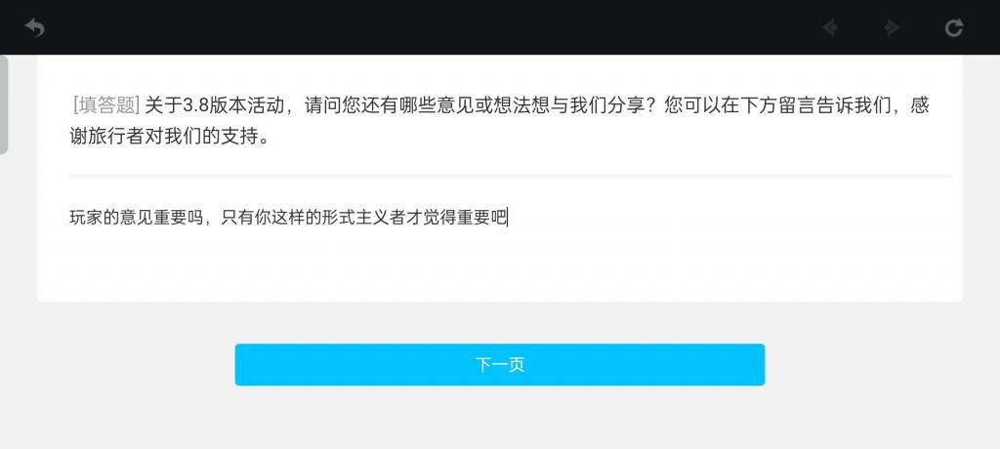

### [不吐不快] 关于新的调查问卷

Made by ngapost2md (c) ludoux [GitHub Repo](https://github.com/ludoux/ngapost2md)

----

##### 0.[0] \<pid:0\> 2023-07-14 18:41:43 by 飘雪菌
大前提是他们根本不看问卷，这不是大家已经反复论证过的吗
所以再怎么说也没用，大家过过嘴瘾就行，较真就输了，除非他端上一个不爆典的整个枫丹版本(有可能吗？)

----

##### 1.[0] \<pid:702671223\> 2023-07-14 19:40:40 by 等把美又强的剑
虽然但是，有题可以答也蛮爽的，指锐评角色。

----

##### 2.[0] \<pid:702671255\> 2023-07-14 19:40:54 by 飘雪菌

----

##### 3.[0] \<pid:702671385\> 2023-07-14 19:41:42 by 是是是洺
看大家晒问卷挺爽的
至于米看不看，那种事无所谓啦

----

##### 4.[0] \<pid:702671756\> 2023-07-14 19:44:11 by lolireactor
从结果来说是看的，因为隔壁全优化了
所以从结果反推：他们都看，但是不会在这改

----

##### 5.[0] \<pid:702698336\> 2023-07-14 22:39:48 by 飘雪菌
>[jump](#pid702671385) 是是是洺(2023-07-14 19:41) 说: 
>
>看大家晒问卷挺爽的
>至于米看不看，那种事无所谓啦

唉

----

##### 6.[0] \<pid:702872055\> 2023-07-16 00:12:36 by 小样儿鸣
讲道理，只要还打算玩一阵子，填问卷就是有用的，但前提是得让他们先急一急，拿流水的鞭子抽一抽，然后他们才会改。这个事一个人说的不算，得大家都觉得不好玩了才行。

体验越好，流水越高；流水越高，米越骄傲；米越骄傲，游戏越臭；游戏越臭，体验越差。总结：~~白嫖最快乐~~体验越好，体验越差。

----

##### 7.[0] \<pid:705381137\> 2023-07-28 08:24:57 by Riverlee12
别那么消极

顺风时问卷确实没用，游戏公司干过的都知道市场调研不如领导的一拍脑门

但是逆风时，问卷可是市场调研唯一能在公司例会上毫不留情批评相关部门的武器，而且被他说的那个单位面无土色，有些聪明的还会提前跟你打下招呼，上会的时候说的轻一点

现在的局势，懂得都懂

----

##### 8.[2] \<pid:705383675\> 2023-07-28 08:40:24 by 飘雪菌
>[jump](#pid705381137) Riverlee12(2023-07-28 08:24) 说: 
>
>别那么消极
>
>顺风时问卷确实没用，游戏公司干过的都知道市场调研不如领导的一拍脑门
>
>但是逆风时，问卷可是市场调研唯一能在公司例会上毫不留情批评相关部门的武器，而且被他说的那个单位面无土色，有些聪明的还会提前跟你打下招呼，上会的时候说的轻一点
>
>现在的局势，懂得都懂

人确实该积极向上一点，但绝对不是在米这里积极向上

----

##### 9.[0] \<pid:705422460\> 2023-07-28 11:29:59 by wingheng
>[jump](#pid705381137) Riverlee12(2023-07-28 08:24) 说: 
>
>别那么消极
>
>顺风时问卷确实没用，游戏公司干过的都知道市场调研不如领导的一拍脑门
>
>但是逆风时，问卷可是市场调研唯一能在公司例会上毫不留情批评相关部门的武器，而且被他说的那个单位面无土色，有些聪明的还会提前跟你打下招呼，上会的时候说的轻一点
>
>现在的局势，懂得都懂

它不懂回去翻前几期调查问卷吗？还要玩家在这给它猜什么时候意见重要什么时候填，米jb谁啊

----

##### 10.[0] \<pid:705423520\> 2023-07-28 11:34:43 by 让我看看JPG
>[jump](#pid705381137) Riverlee12(2023-07-28 08:24) 说: 
>
>别那么消极
>
>顺风时问卷确实没用，游戏公司干过的都知道市场调研不如领导的一拍脑门
>
>但是逆风时，问卷可是市场调研唯一能在公司例会上毫不留情批评相关部门的武器，而且被他说的那个单位面无土色，有些聪明的还会提前跟你打下招呼，上会的时候说的轻一点
>
>现在的局势，懂得都懂

以前认真剖析长篇大论给他填的问卷当垃圾扔了，看都不屑看，甚至还嘲讽玩家，凭什么现在要求玩家给他再填？我们是他爹还是他妈？你认真填了人家都觉得你这是杂音，也就你们xxx在乎吧

----

##### 11.[0] \<pid:705424401\> 2023-07-28 11:38:23 by 老虎二世
好可惜，我已经删游了，否则高低要去锐评两句

----

##### 12.[0] \<pid:705424472\> 2023-07-28 11:38:43 by 嘀嘟滴嘟嘀
不用填问卷，有建议直接来里茶对着米哈游工作人员直接开骂，他们看得到。

----

##### 13.[0] \<pid:705557671\> 2023-07-28 23:52:22 by Riverlee12
>[jump](#pid705423520) 让我看看JPG(2023-07-28 11:34) 说: 
>
>以前认真剖析长篇大论给他填的问卷当垃圾扔了，看都不屑看，甚至还嘲讽玩家，凭什么现在要求玩家给他再填？我们是他爹还是他妈？你认真填了人家都觉得你这是杂音，也就你们xxx在乎吧

然而非常搞笑的事，原神今晚发调查问卷了

一切真的完全不出我所料

----

##### 14.[0] \<pid:705557770\> 2023-07-28 23:53:11 by Riverlee12
>[jump](#pid705422460) wingheng(2023-07-28 11:29) 说: 
>
>它不懂回去翻前几期调查问卷吗？还要玩家在这给它猜什么时候意见重要什么时候填，米jb谁啊

然而非常搞笑的事，原神今晚发调查问卷了

一切真的完全不出我所料

----

##### 15.[0] \<pid:705558211\> 2023-07-28 23:56:15 by 离去的脚步声

----

##### 16.[0] \<pid:705558405\> 2023-07-28 23:57:39 by 离去的脚步声
就一条圣遗物一键保存更换，完全不影响他赚钱的，开服第一天到现在米哈游起码得收个几十万次反馈

事实证明就是个屁

----

##### 17.[0] \<pid:705558525\> 2023-07-28 23:58:32 by 转生三周目
2008，告辞  
日语不熟练，我很抱歉

----

##### 18.[0] \<pid:705561947\> 2023-07-29 00:26:28 by uino759
感觉最近的问卷发得有点频繁

----

##### 19.[0] \<pid:705562511\> 2023-07-29 00:31:32 by 马小跳i
>[jump](#pid705561947) uino759(2023-07-29 00:26)说:
>感觉最近的问卷发得有点频繁

可能觉得大家比较缺摩拉吧

----

##### 20.[0] \<pid:705562767\> 2023-07-29 00:33:48 by 尤塔基里斯

----

##### 21.[0] \<pid:705563099\> 2023-07-29 00:36:38 by rosa__canina
08就是表明态度的最好方式

----

##### 23.[0] \<pid:705563732\> 2023-07-29 00:42:20 by 让我看看JPG
>[jump](#pid705557671) Riverlee12(2023-07-28 23:52) 说: 
>
>然而非常搞笑的事，原神今晚发调查问卷了
>
>一切真的完全不出我所料

哦，那又怎样mhy发问卷和我不想填有关系吗？以前认真填的共计几千字，上万字的没骂人的建议当垃圾扔了，可你mhy就是一个都不管，想来我的建议也不重要所以没用，我现在也忘了我填过什么了呢我只想加速，看mhy能端出什么前无古人，后无来者的震撼东西来

----

##### 24.[0] \<pid:705563943\> 2023-07-29 00:44:21 by 科技钻头
考虑到调查问卷主要针对新游戏，我对云上五骁抓头花的情节提出了一些建设性的意见

----

##### 25.[0] \<pid:705564060\> 2023-07-29 00:45:17 by XGin
>[jump](#pid705381137) Riverlee12(2023-07-28 08:24) 说: 
>
>别那么消极
>
>顺风时问卷确实没用，游戏公司干过的都知道市场调研不如领导的一拍脑门
>
>但是逆风时，问卷可是市场调研唯一能在公司例会上毫不留情批评相关部门的武器，而且被他说的那个单位面无土色，有些聪明的还会提前跟你打下招呼，上会的时候说的轻一点
>
>现在的局势，懂得都懂

你这么一说就通透了，这就去狠狠地肯定，全部非常满意，继续加大力度，我嫌它死得太慢了

----

##### 26.[0] \<pid:705565197\> 2023-07-29 00:53:11 by 绘麻厨
>[jump](#pid705381137) Riverlee12(2023-07-28 08:24) 说: 
>
>别那么消极
>
>顺风时问卷确实没用，游戏公司干过的都知道市场调研不如领导的一拍脑门
>
>但是逆风时，问卷可是市场调研唯一能在公司例会上毫不留情批评相关部门的武器，而且被他说的那个单位面无土色，有些聪明的还会提前跟你打下招呼，上会的时候说的轻一点
>
>现在的局势，懂得都懂

真的吗，我这期问卷直接用猛干语录填的，希望能在他们会上念出来

----

##### 27.[0] \<pid:705565593\> 2023-07-29 00:55:25 by 闲人闲事儿
别问，问就是2008，问卷什么的不熟捏，早干嘛去了

----

##### 28.[0] \<pid:705568396\> 2023-07-29 01:14:37 by 侵晓窥檐语丶
事不过三，我只会给听不懂话的小孩反复讲道理，如果米员工也需要，建议回炉重造。

----

##### 29.[0] \<pid:705568748\> 2023-07-29 01:17:19 by Bauhaus的大豪斯
>[jump](#pid705381137) Riverlee12(2023-07-28 08:24):

是啊，毕竟项目组还是听意见的，不过是隔壁的项目组

----

##### 30.[0] \<pid:705570038\> 2023-07-29 01:29:18 by 罐头晓鱼
问卷调查很重要吗，也就对米哈游这家公司抱有希望的人才觉得重要吧

----

##### 31.[0] \<pid:705570548\> 2023-07-29 01:34:11 by 妄覆舟
骂就完了，这期不一样，这期可以结合好几个时事骂

