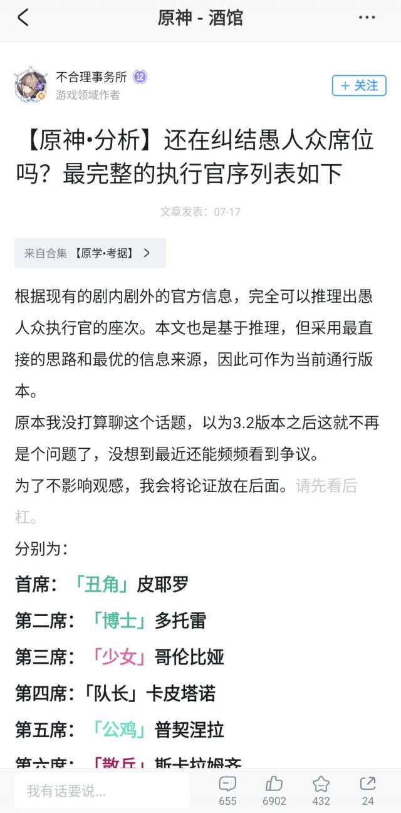
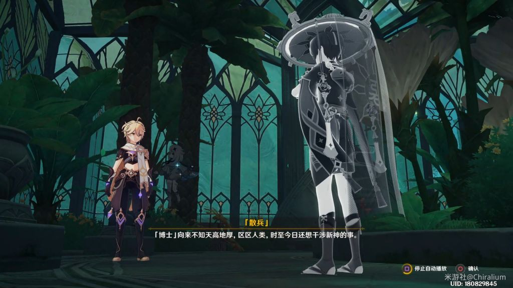

### [热点事件]愚人众席位问题，米游社快吵疯了

Made by ngapost2md (c) ludoux [GitHub Repo](https://github.com/ludoux/ngapost2md)

##### 热门回复

- [1楼](#pid703418627): 我们还是先聊聊那个空了几百年的第六席吧<...
- [4楼](#pid703418772): 这个问题与其“考据”推论，不如直接做梦 ...
- [7楼](#pid703419213): 现在看这些真的挺无语的，有世界树在什么都...
- [9楼](#pid703420951): 队一仆四啊，看完某欺软怕硬的纯白人偶的语...

----

##### 0.[0] \<pid:0\> 2023-07-18 21:59:59 by wkmjga
坛友们认为队长仆人几席？

----

##### 1.[462] \<pid:703418627\> 2023-07-18 22:02:11 by lingwzhui
我们还是先聊聊那个空了几百年的第六席吧
愚人众排席位看着像个笑话

----

##### 2.[11] \<pid:703418628\> 2023-07-18 22:02:12 by 名字就是个编号
你进里世界了
下次记得发帖标签不要带热点事件和不吐不快

----

##### 3.[23] \<pid:703418678\> 2023-07-18 22:02:32 by XZESTY
队长1，仆人4，丑角0(排序10)。

----

##### 4.[76] \<pid:703418772\> 2023-07-18 22:03:15 by Adrammelech
这个问题与其“考据”推论，不如直接做梦  

丑角领导不算，队长1仆人4，第十有什么药编剧没编完

----

##### 5.[0] \<pid:703418884\> 2023-07-18 22:03:56 by Giganoto
阿蕾奇诺4。

----

##### 6.[6] \<pid:703419033\> 2023-07-18 22:05:03 by AkariYu3310
看語氣大過6

----

##### 7.[180] \<pid:703419213\> 2023-07-18 22:06:24 by 你家破猫不招财
现在看这些真的挺无语的，有世界树在什么都能改，第六席那个bug真的巨搞笑

----

##### 8.[15] \<pid:703420741\> 2023-07-18 22:17:05 by 墨已遥
队长1(目前吹他的角色太多了)，仆人4(5元素黄毛面前第10席有什么出现的价值吗)，10席留给旅行者(按以前几个国家的安排总得给黄毛一个绑定该国家的身份)

----

##### 9.[104] \<pid:703420951\> 2023-07-18 22:18:30 by fsdilu
队一仆四啊，看完某欺软怕硬的纯白人偶的语音后不是很明显了吗

----

##### 10.[7] \<pid:703421249\> 2023-07-18 22:20:40 by 阿青青青青呀
没啥好吵的()仆人马上上线了
未知的席位就1/4/10 
队长只可能在1/4 因为有公子语音兜底

----

##### 11.[32] \<pid:703421823\> 2023-07-18 22:24:47 by tyzgite
不懂就问，到底是哪些群体对队1仆4这么敏感？之前在b站提了嘴队1仆4被追着咬

----

##### 12.[0] \<pid:703422119\> 2023-07-18 22:27:02 by wkmjga
>[jump](#pid703418628) 名字就是个编号(2023-07-18 22:02) 说: 
>
>你进里世界了
>下次记得发帖标签不要带热点事件和不吐不快

哦不好的谢谢提醒

----

##### 13.[17] \<pid:703422443\> 2023-07-18 22:29:21 by 旺旺雪豹
>[jump](#pid703421823) tyzgite(2023-07-18 22:24) 说: 
>
>不懂就问，到底是哪些群体对队1仆4这么敏感？之前在b站提了嘴队1仆4被追着咬

我也好奇，什么人会讨厌队长？

----

##### 14.[0] \<pid:703422634\> 2023-07-18 22:30:32 by ICEBERG0121
仆人必第四席

----

##### 15.[0] \<pid:703422811\> 2023-07-18 22:31:45 by 看我把那飞机打下来
>[jump](#pid703422443) 旺旺雪豹(2023-07-18 22:29):

主要是仆人的问题

米游社关于仆人第4还是第10吵的特别厉害，还有丑角算不算执行官也吵的厉害

----

##### 16.[0] \<pid:703423160\> 2023-07-18 22:34:16 by 旺旺雪豹
>[jump](#pid703422811) 看我把那飞机打下来(2023-07-18 22:31) 说: 
>
>主要是仆人的问题
>
>米游社关于仆人第4还是第10吵的特别厉害，还有丑角算不算执行官也吵的厉害

队长他们也吵啊...我搜个法尔伽次次都出现在吵队长席位里，因为是人类就拿出来疯狂贬(好像贬了他就能贬队长) 
简直无妄之灾

----

##### 17.[8] \<pid:703423580\> 2023-07-18 22:37:11 by 冰冷的心脏
整这些考据，不如先把那个不知道怎么消失的补上

----

##### 18.[5] \<pid:703423989\> 2023-07-18 22:40:23 by 一般通过咸鱼A
应该是队1仆4，愚人众席位还是有意义的，其他对没有直接利益冲突但席位低于自己的7、8、9、11席语音都是贬低；冬夜愚戏里仆人对5和9对话的打断也算不上客气，她席位大概率在这俩之上，不太可能是10；能质问二席博士的队长也大概率比博士更靠前，那不就只剩1席了

----

##### 19.[2] \<pid:703424244\> 2023-07-18 22:42:13 by 我流伦子哥
除非岁月史书，否则一定队1仆4

----

##### 20.[19] \<pid:703426144\> 2023-07-18 22:56:10 by snwx62
>[jump](#pid703421823) tyzgite(2023-07-18 22:24) 说: 
>
>不懂就问，到底是哪些群体对队1仆4这么敏感？之前在b站提了嘴队1仆4被追着咬

仆人据说才二十几岁 可能是年龄比仆人大席位没仆人高的吧

----

##### 21.[1] \<pid:703433849\> 2023-07-18 23:52:53 by 色胚茄子
我希望他俩
并列第六席！

----

##### 22.[0] \<pid:703445077\> 2023-07-19 01:43:14 by 音羽城
>[jump](#pid703426144) snwx62(2023-07-18 22:56) 说: 
>
>仆人据说才二十几岁 可能是年龄比仆人大席位没仆人高的吧

才二十几岁？那稻妻假巫女支线里说壁炉之家她收养孤儿培养成间谍难到是一个小孩抚养一群小孩吗？？

----

##### 23.[1] \<pid:703451969\> 2023-07-19 04:13:08 by 茫然的熊
队长最强人类，必然第一。  而且他去了纳塔，火神脾气火爆，有种队长会和火神打起来，打赢拿走神之心的感觉

----

##### 24.[3] \<pid:703452015\> 2023-07-19 04:15:35 by 君影清灵
这点破事都能吵吗，反正席位都是米哈游一句话的事情

----

##### 25.[8] \<pid:703452459\> 2023-07-19 04:34:48 by 文湫
>[jump](#pid703451969) 茫然的熊(2023-07-19 04:13) 说: 
>
>队长最强人类，必然第一。  而且他去了纳塔，火神脾气火爆，有种队长会和火神打起来，打赢拿走神之心的感觉

最强“人类”，可是目前来看丑角、博士、少女这三个活了几百年的老东西都很难以“正常人类”来界定啊

----

##### 26.[15] \<pid:703452808\> 2023-07-19 04:51:31 by 文湫
讲真，队1仆4最大的问题就是丑角席位

散兵、公子相关的剧情和语音都明确提到了丑角是愚人众执行官之一，而执行官只有11席也是早就公布的，现在你跟我说丑角是执行官但不在11席之内，很怪。
顺带还有一个空缺的第10席，这游戏都快三周年了居然没有任何文本对此有过暗示和铺垫，同样也很怪。

虽说吃书的先河早已开过，但如果mhy能在这么重要的设定上这么玩的话，我对编剧的评价就得再降一档了。

----

##### 27.[2] \<pid:703453320\> 2023-07-19 05:16:31 by eRound
>[jump](#pid703452459) 文湫(2023-07-19 04:34) 说: 
>
>最强“人类”，可是目前来看丑角、博士、少女这三个活了几百年的老东西都很难以“正常人类”来界定啊

纳西妲和散兵都认为博士是人类，博士的自我认知也是人类

----

##### 28.[0] \<pid:703455945\> 2023-07-19 06:54:10 by 柚原柚美x
大大们，队1仆4的说法，求链接，想去看看

----

##### 29.[0] \<pid:703456039\> 2023-07-19 06:56:12 by 弓手gggg
>[jump](#pid703452808) 文湫(2023-07-19 04:51) 说: 
>
>讲真，队1仆4最大的问题就是丑角席位
>
>散兵、公子相关的剧情和语音都明确提到了丑角是愚人众执行官之一，而执行官只有11席也是早就公布的，现在你跟我说丑角是执行官但不在11席之内，很怪。
>顺带还有一个空缺的第10席，这游戏都快三周年了居然没有任何文本对此有过暗示和铺垫，同样也很怪。
>
>虽说吃书的先河早已开过，但如果mhy能在这么重要的设定上这么玩的话，我对编剧的评价就得再降一档了。

队4仆10吃的书更多，冬夜愚戏pv都有问题……

----

##### 30.[0] \<pid:703456532\> 2023-07-19 07:06:51 by winwkvmn
6席没人 10席没人 突然感觉这个组织编位好滑稽啊

----

##### 31.[8] \<pid:703456744\> 2023-07-19 07:10:37 by gtgce
仆人要是第十散兵早喷她菜了

----

##### 32.[3] \<pid:703457506\> 2023-07-19 07:23:00 by aiopsx
这个问题早在去年就已经在永恒绿洲版块结束了
[url](https://ngabbs.com/read.php?tid=34751703)

如果你不信消息，还有语音排序，人设图排序，散兵起名禁词在服务器里的顺序，反正你所有能看见的官方排序里都是队1仆4，要是还不信那就只能等枫丹了

----

##### 33.[0] \<pid:703462472\> 2023-07-19 08:11:49 by 勇者鱼丸君
队长1仆人4丑角10这是明面上的，实际上丑角可以抹掉1变成第0席

----

##### 34.[0] \<pid:703462790\> 2023-07-19 08:14:10 by 溶解在暧昧中
现在排好了，到时候跟你说，最弱的最强，他能蒙蔽世界树 干涉他人认知 你准备怎么办？

----

##### 35.[12] \<pid:703466237\> 2023-07-19 08:36:41 by 文湫
>[jump](#pid703456039) 弓手gggg(2023-07-19 06:56) 说: 
>
>队4仆10吃的书更多，冬夜愚戏pv都有问题……

有啥问题？

如果你指的是仆人怼富人和公鸡，那这其实算不上吃书，因为第9席的富人开口就在阴阳第5席的公鸡，第7席的木偶能直接锐评一句“荒谬可笑”，而在散兵间章中，第8席的女士基本全程都在攻击第6席的散兵……互相攻击差不多就是执行官之间的普遍现象。

----

##### 36.[0] \<pid:703466676\> 2023-07-19 08:39:05 by 弓手gggg
>[jump](#pid703466237) 文湫(2023-07-19 08:36) 说: 
>
>有啥问题？
>
>如果你指的是仆人怼富人和攻击，那这其实算不上吃书，因为第9席的富人开口就在阴阳第5席的公鸡，第7席的木偶能直接锐评一句“荒谬可笑”，而在散兵间章中，因为第8席的女士基本全程都在攻击第6席的散兵。

队长直呼本名质问博士，顺便仆人怼富人这点，阴阳和怼不是一回事，类似于对领导对高层你也可以阴阳但你不能当面怼。富人虽然是阴阳，但是称呼依然是恭敬的“市长大人”，你可以说这是富人的性格使然，但是用上了敬称这也是事实。
还有32楼的总结你可以看一看

----

##### 37.[3] \<pid:703467466\> 2023-07-19 08:43:29 by 伴火同进者
>[jump](#pid703452459) 文湫(2023-07-19 04:34):

长生种的散兵觉得博士是人，博士也觉得自己是人

----

##### 38.[0] \<pid:703469053\> 2023-07-19 08:52:06 by 伴火同进者
已知：

·第二席的博士是人类(见楼上)

·博士单凭武力也能坐稳第二席

·前三席执行官都拥有堪比神明的实力

·前第六席的流浪者认为队长拥有顶尖的实力

如果队长是第一席，那需要解释的就只有第十席的归属和稻妻世界任务“门户清理”中提到的首席执行官是怎么回事

----

##### 39.[0] \<pid:703469567\> 2023-07-19 08:54:39 by F8273937
有什么可吵的，无非就是接不接受丑角不算纳入排名的执行官和第十席暂时没透露的设定而已

----

##### 40.[5] \<pid:703469961\> 2023-07-19 08:56:33 by 风与牧歌
>[jump](#pid703469053) 伴火同进者(2023-07-19 08:52) 说: 
>
>已知：
>
>·第二席的博士是人类(见楼上)
>
>·博士单凭武力也能坐稳第二席
>
>
>
>·前三席执行官都拥有堪比神明的实力
>
>
>
>·前第六席的流浪者认为队长拥有顶尖的实力
>
>[img]./mon_202307/19/l2Q2s-499fK10T3cSzx-

这不是“只有”，忽然多一个人和丑角莫名论外的bug可比现在这十一个人里乱排要严重多了。

----

##### 41.[0] \<pid:703470023\> 2023-07-19 08:56:50 by 泡泡闪光必杀剑
呃呃，这种事情都能吵起来么，鉴定为太闲了，米给大伙整个活吧看这群人闲的
认真的说，有世界树这种东西在席位还有意义么，第六席都空了多少年了蒙德教堂那个愚人众还在咕囔着别给分到第六席散兵手下呢

----

##### 42.[0] \<pid:703470590\> 2023-07-19 08:59:43 by GrossGrass
队1仆4，10是当年的反主，目前一直空缺

----

##### 43.[4] \<pid:703473889\> 2023-07-19 09:14:42 by 果然傲娇容易出傲娇么
>[jump](#pid703451969) 茫然的熊(2023-07-19 04:13) 说: 
>
>队长最强人类，必然第一。  而且他去了纳塔，火神脾气火爆，有种队长会和火神打起来，打赢拿走神之心的感觉

我觉得这就太崩了，还不如火神飘了，说如果你能接我十招，或者逼我用双手，我就把神之心给你

次回，火神单挑深渊，被两条龙蜥大败洗脑恶堕

----

##### 44.[0] \<pid:703475295\> 2023-07-19 09:20:56 by 茫然的熊
>[jump](#pid703473889) 果然傲娇容易出傲娇么(2023-07-19 09:14) 说: 
>
>我觉得这就太崩了，还不如火神飘了，说如果你能接我十招，或者逼我用双手，我就把神之心给你
>
>
>次回，火神单挑深渊，被两条龙蜥大败洗脑恶堕

有啥崩的，前三席不是说有比肩神明的实力吗，二席的表现看出来确实不虚。

----

##### 45.[0] \<pid:703488833\> 2023-07-19 10:14:35 by dfpvml
>[jump](#pid703426144) snwx62(2023-07-18 22:56) 说: 
>
>仆人据说才二十几岁 可能是年龄比仆人大席位没仆人高的吧

哪里有说啊？
八席六席都已经实锤是活了几百年的老东西了 九席大概率也是老东西(都进圣遗物了不太可能是年轻人) 她一个4席才二十多怎么可能

----

##### 46.[0] \<pid:703491129\> 2023-07-19 10:22:20 by 维尔贝尔
>[jump](#pid703445077) 音羽城(2023-07-19 01:43):

万一不是一个人呢，比如《仆人》只是壁炉之家主人的称号而并非是某个特定人的称号

----

##### 47.[0] \<pid:703491772\> 2023-07-19 10:24:22 by jamie123456
丑角不列席的问题还是当初罗盘上的皮耶罗面具吧，只要这个能解释清楚都好说(看mhy怎么编了)

----

##### 48.[0] \<pid:703539684\> 2023-07-19 13:49:11 by 弦意
愚人众执行官除了统领丑角，其他人难道有上下级之分？已经出现的剧情不都是平级吗，还有说pv语气.散兵态度，没看出来有上下级之分

