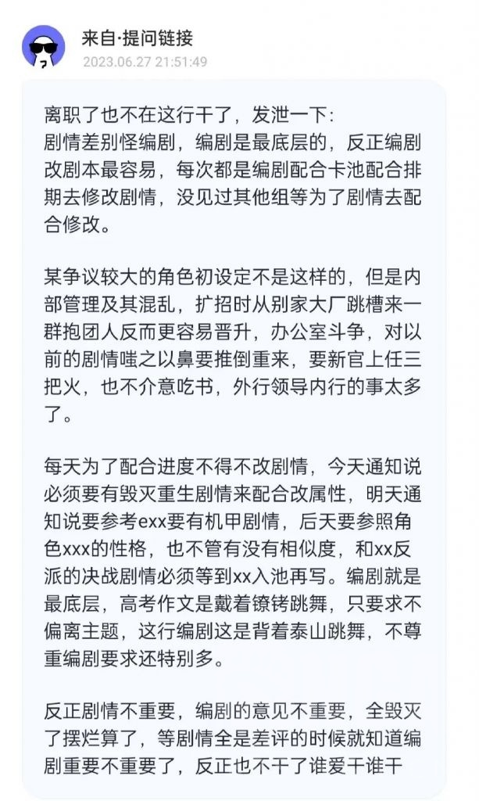

### [不吐不快]以前的编剧文案到底是什么情况啊

Made by ngapost2md (c) ludoux [GitHub Repo](https://github.com/ludoux/ngapost2md)

##### 热门回复

- [1楼](#pid703450916): 不管是不是轮换，岁月史树出来之后，整个剧...
- [3楼](#pid703451174): [s:ac:哭笑]你油比较像主管跑掉了,...
- [4楼](#pid703451298): 也别看到现在的剧情烂，就吹以前负责大纲和...
- [10楼](#pid703460128): 以前最多是弱智，现在的是故意恶心玩家和逆...

----

##### 0.[6] \<pid:0\> 2023-07-19 03:29:55 by a1818137
3.6末期入坑，有幸没赶上“罪犯也有受教育的权利”的剧情，来来回回也看到了不少讨论和交流

目前看到的两种情况，一个是剧情策划编剧是三个团队轮换的，然后现在这个团队正好是做须弥和枫丹，至少要5.0才能换到下一组

另一种情况是之前写出好剧情好文案的大佬们该跳槽的跳槽，该追梦的追梦去了

到底哪个才是真的啊？  

编辑1:看了带伙儿说的，也多少明白了，看来2.7之类的剧情真的是昙花一现，也许不能复制了…说实话从刚入坑的时候选“应急食品”选的心安理得，到剧情走到中间觉得派蒙总有一天会离开所以接下来每一次都会选“最好的伙伴”，到现在手会下意识的点点点…以前听人说磕了能写出一些光怪陆离的剧情给人眼前一亮的新鲜感，现在看到这剧情只觉得是不是吃了S所以报复社会 恶心玩家，看到很多人称呼可莉从蒙德小太阳到喝多了三鹿的大头娃娃，想想那些原学家找细节挖伏笔到编剧直接掀桌子世界树记忆修改术，感觉老哥们可怜又有点可笑，很难想象那些亲身经历过3.3  3.6的老哥们怎么忍得住不化身乐子人的。事已至此，可能也只能自爆了吧.jpg

----

##### 1.[127] \<pid:703450916\> 2023-07-19 03:32:43 by 吸水恶魔
不管是不是轮换，岁月史树出来之后，整个剧情就已经失控了，没有讨论价值了。

后续的作者除非直接把树烧了，不然这屁股怎么都擦不完的。

总有一个负责大方向的，现在情况更像是目前的大方向剧情正是如此，实际情况比你认为的情况2还要糟。

----

##### 2.[0] \<pid:703450955\> 2023-07-19 03:33:52 by 是的魈很弱
估计一半一半吧，项目组有好几个团队，团队里面也有人员流动。都很正常

----

##### 3.[92] \<pid:703451174\> 2023-07-19 03:41:04 by タウィル
你油比较像主管跑掉了,新来的立马动歪脑筋写自己故事,就像当年WOW生吞编年史

----

##### 4.[190] \<pid:703451298\> 2023-07-19 03:45:49 by stadialuna
也别看到现在的剧情烂，就吹以前负责大纲和剧情的人有多好，优菈心海传说任务，糖霜史莱姆和奥赛尔大战后的争论，只会neta历史而没逻辑的稻妻主线，不是也烂得很。

----

##### 5.[0] \<pid:703451386\> 2023-07-19 03:48:37 by 九皋213
确实，只有在没写出来的时候剧情才好

----

##### 6.[0] \<pid:703459164\> 2023-07-19 07:43:04 by 今天休息一会嘛
看了看以前的狗屎剧情，倾向于第一种情况(如果真有的话)，而且三个组都半斤八两，就看哪个更没下限了

----

##### 7.[0] \<pid:703459596\> 2023-07-19 07:47:30 by 云恭
我倒觉得原神主线的味道没变多少
1.1还是2.2其实也没怎么可以说的，比3.3真的是好还是没那么直白但是核心都有一脉相承类似感觉，而且实际上大部分人难道不是同意虽然搞事的剧情都是愚人众干的，但是至冬冰神会洗白、天理会洗白这点没冲突吗

----

##### 8.[0] \<pid:703459692\> 2023-07-19 07:48:36 by bzbjzj
还有可能就是摊子铺大了，抽调了部分老手到其他游戏里。
(但是不能否认米的项目管理可能有问题，现在听说了三个传闻脑补了一个滑坡但算了不说。)

----

##### 9.[23] \<pid:703459828\> 2023-07-19 07:50:11 by 泪滴洇湿的言语
老实说以前的剧情也不怎么样，只是须弥为了捧日本太子大暴雷而已。

----

##### 10.[61] \<pid:703460128\> 2023-07-19 07:53:12 by 我流伦子哥
以前最多是弱智，现在的是故意恶心玩家和逆大众审美，还有极致的啰嗦导致逆反心理爆炸

----

##### 11.[1] \<pid:703460414\> 2023-07-19 07:55:37 by 四风的烈酒
>[jump](#pid703451174) タウィル(2023-07-19 03:41) 说: 
>
>你油比较像主管跑掉了,新来的立马动歪脑筋写自己故事,就像当年WOW生吞编年史

魔兽那边更多是编年史和游戏小说互吃，凯恩在编年史都被吃崩了

----

##### 12.[10] \<pid:703462328\> 2023-07-19 08:10:40 by 泥头车司机66号
随便吧，难道让这种文案上市的班子里有无辜的人？

总不能你也皇上是好的

----

##### 13.[19] \<pid:703462626\> 2023-07-19 08:12:54 by 我是小小猫
为什么总是想“他们只是做得好的不在这里了”而不能相信mhy整个烂了呢

----

##### 14.[5] \<pid:703465607\> 2023-07-19 08:33:02 by D_终于考好了
至少我最喜欢的温迪传说的编剧已经追梦去了

----

##### 15.[21] \<pid:703467146\> 2023-07-19 08:41:42 by 小吉祥典王
>[jump](#pid703451298) stadialuna(2023-07-19 03:45) 说: 
>
>也别看到现在的剧情烂，就吹以前负责大纲和剧情的人有多好，优菈心海传说任务，糖霜史莱姆和奥赛尔大战后的争论，只会neta历史而没逻辑的稻妻主线，不是也烂得很。

以前文案可以说是有的能力不行，但至少大部分三观是正的，现在文案是又毁三观又没逻辑还喜欢塞私货，真要人比人那我感觉还是以前的稍微好点

有一说一，时至今日我也想不出怎么能写出蒸鸡蒸馍这档事来

----

##### 16.[15] \<pid:703467423\> 2023-07-19 08:43:16 by 自由搏击总冠军
蠢和又蠢又坏是有区别的

----

##### 17.[1] \<pid:703468388\> 2023-07-19 08:48:32 by 汐汐漓漓
一个人的水平也是能下滑的，比如格陵兰帆船能写逆熵外传小说封神，也能终章全程&#39;&#39;&#39;&#39;&#39;&#39;地说教，剧情不明所以扯一堆东西机械降神完结了事。还有个逆天噶芙兰，前脚能写萧云故事，后脚能拿符华垫奥托素裳，洗白分食饭徒弟。这就是米哈游的编剧，大概率是自己找补都找补不上   

----

##### 18.[16] \<pid:703471293\> 2023-07-19 09:03:15 by 喵西斯
以前也有烂的，但问题是也有好的。早期有很多文案的文笔表达确实厉害。
我猜的是以前的文案不是都跑了，是好的跑了，烂的留下来了，和新来的一起烂。  
至于为啥不觉得是以前的文案恶堕了……因为差距真的太大太大了。

----

##### 19.[13] \<pid:703473700\> 2023-07-19 09:13:57 by fsdilu
>[jump](#pid703451298) stadialuna(2023-07-19 03:45) 说: 
>
>也别看到现在的剧情烂，就吹以前负责大纲和剧情的人有多好，优菈心海传说任务，糖霜史莱姆和奥赛尔大战后的争论，只会neta历史而没逻辑的稻妻主线，不是也烂得很。

但以前的烂是有逻辑的，优拉心海是执着于凹人设而忽视现实逻辑，璃月稻妻主线是想的太多能力不足和篇幅把握失调，而现在的烂完全是离谱的反人类的

----

##### 20.[0] \<pid:703480872\> 2023-07-19 09:44:02 by 四十四号外星人
以前也一般，但相较于现在，以前就显得高大上了。毕竟心海当时那传说任务人人骂，到了须弥末期，我??一跃成王！感谢影的好大儿

----

##### 21.[2] \<pid:703489209\> 2023-07-19 10:15:57 by 辰砂之纺锤
>[jump](#pid703465607) D_终于考好了(2023-07-19 08:33) 说: 
>
>至少我最喜欢的温迪传说的编剧已经追梦去了

这是真的吗我还等着温迪传说二呢

----

##### 22.[8] \<pid:703489841\> 2023-07-19 10:18:11 by Matrix1204
>[jump](#pid703480872) 四十四号外星人(2023-07-19 09:44) 说: 
>
>以前也一般，但相较于现在，以前就显得高大上了。毕竟心海当时那传说任务人人骂，到了须弥末期，我??一跃成王！感谢影的好大儿

影：别来沾边

----

##### 23.[9] \<pid:703490126\> 2023-07-19 10:19:02 by 嘀嘟滴嘟嘀
以前剧情是低幼弱智，现在剧情不但低幼弱智还双标败德

----

##### 24.[13] \<pid:703491940\> 2023-07-19 10:25:01 by 球球游侠
以前是有好活也有烂活，好烂穿插，现在是整好活的跑了，留下的全是整烂活的，烂活也就罢了，还爱夹带私货，三观不正的舔它那赛博叠

----

##### 25.[5] \<pid:703513618\> 2023-07-19 11:49:45 by 十夜铃沄花
以前再烂的活逻辑是有的，只是表现出来很搞笑
现在彻底摆了各种三观歪又没逻辑的塑造自然就逆反了

但拿七神绑风男从钟离开始就一脉相承，感觉更像是管事的跑路了换了原本就在组里的另一个接班，然后这人本来就在加私货接班后一发不可收拾了

----

##### 26.[19] \<pid:703514869\> 2023-07-19 11:54:32 by 果然傲娇容易出傲娇么
首先整个基调肯定是变了
之前不管哪个国家都在强调人的作用

蒙德是神明撒手，璃月是神明逝去(明面上)，稻妻是万千愿望死谏

到了须弥就成了不聪明也不能打的就不是好神明了吗？

璃月盐神可是明确有过不聪明也不能打的神来当领导是个怎么样的悲剧收场

----

##### 27.[2] \<pid:703515474\> 2023-07-19 11:56:49 by jasmine4869
世界树这个影响世界观底层逻辑的东西真的不是一个组的问题，像稻妻主线拉胯换个国家就淡忘了，更别说个人传说做完也快忘了，这个世界树从推出来到大结局都要膈应你

----

##### 28.[0] \<pid:703515590\> 2023-07-19 11:57:15 by 不淡定の文
>[jump](#pid703467146) 小吉祥典王(2023-07-19 08:41) 说: 
>
>以前文案可以说是有的能力不行，但至少大部分三观是正的，现在文案是又毁三观又没逻辑还喜欢塞私货，真要人比人那我感觉还是以前的稍微好点
>
>有一说一，时至今日我也想不出怎么能写出蒸鸡蒸馍这档事来

也有一种可能，以前的文案因为公司长期工作压力过大而黑化了(误)

----

##### 29.[0] \<pid:703515783\> 2023-07-19 11:58:01 by mie001
现在的烂活就是以前优菈和心海传说任务那个等级的，但是以前大部分都没烂到那个程度，而3.6开始几乎都是这个水平的
至于换文案，看足迹pv和现在的什么往事成书的考究就能看出来，现在这个基本是全改了

----

##### 30.[2] \<pid:703521960\> 2023-07-19 12:23:58 by ggt12
真假不知，纯粹当瓜吃

----

##### 31.[2] \<pid:703522656\> 2023-07-19 12:27:03 by 色胚茄子
有好有坏吧，前期好剧情也不少
但如果夸前面写得好尿点一点没有肯定不现实的，主要还是因为有滤镜而感到瑕不掩瑜
现在屎拉得太多终于有点掩不住，而且已经熏到对前面剧情的滤镜也消失的程度了

----

##### 32.[0] \<pid:703526517\> 2023-07-19 12:44:26 by lizhuoli1126
你把游戏当现实？还是当心理学教材？

----

##### 33.[4] \<pid:703527425\> 2023-07-19 12:48:40 by 萌量不足-v-
>[jump](#pid703521960) ggt12(2023-07-19 12:23) 说: 
>
>真假不知，纯粹当瓜吃
>

先跟脉脉的米哈游员工文案地位高打一架

----

##### 34.[0] \<pid:703527765\> 2023-07-19 12:50:23 by 风之碧海之翠
以前也一般，但好歹不会散播剧毒三观

----

##### 35.[3] \<pid:703533316\> 2023-07-19 13:17:37 by ggt12
>[jump](#pid703527425) 萌量不足-v-(2023-07-19 12:48):

我没有见过一个国产厂商文案地位高的，当然不排除米哈游株式会社不一样，毕竟不少日游系列构成和脚本的地位是实打实的高。

----

##### 36.[2] \<pid:703534920\> 2023-07-19 13:25:37 by hdjde110
>[jump](#pid703533316) ggt12(2023-07-19 13:17):

但是之前不是说3.1是三崩子编剧来做的吗？真的一点学不到啊。。。

----

##### 37.[5] \<pid:703535659\> 2023-07-19 13:29:24 by setsuna2023
没有内幕就从一般创作者心态，也不难看出散兵改模入池有明显另起炉灶另捏oc的成分
如果是思想连续的创作者不会对过去的铺垫心血这么儿戏甚至弃如敝履

----

##### 38.[1] \<pid:703536241\> 2023-07-19 13:32:16 by 天灾小熊猫
>[jump](#pid703521960) ggt12(2023-07-19 12:23) 说: 
>
>真假不知，纯粹当瓜吃
>

那个xx决战剧情是博士烧树吗？

----

##### 39.[0] \<pid:703592191\> 2023-07-19 17:47:06 by 蓝月亮MOON
我是真的开始特别讨厌猫塑了

