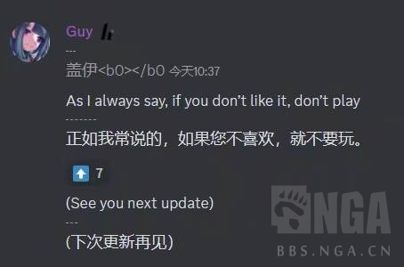

### [不吐不快] [含原无关]有些话游戏制作人真的不能说吧

Made by ngapost2md (c) ludoux [GitHub Repo](https://github.com/ludoux/ngapost2md)

##### 热门回复

- [1楼](#pid703533434): 小众游戏圈地自萌可以，大众游戏不行。既要...
- [3楼](#pid703534177): 翻译下：awwbwg [s:ac...

----

##### 0.[37] \<pid:0\> 2023-07-19 13:14:56 by 云间卷书
今天arcaea(一个音游)更新，该游戏制作人在官方Discord发布了如下言论：

让我不得不联想某个也说过这话的制作人啊(。

----

##### 1.[114] \<pid:703533434\> 2023-07-19 13:18:08 by 徐俊瓶
小众游戏圈地自萌可以，大众游戏不行。既要二次元手游第一又要awwbwg，那这人应该是收钱了

----

##### 2.[0] \<pid:703533734\> 2023-07-19 13:19:45 by Fablet
阿卡伊也搞这出？
完了，不能直视阿卡伊了。

----

##### 3.[24] \<pid:703534177\> 2023-07-19 13:21:59 by 露缇娜丝
翻译下：awwbwg
等等，他不会以为学蔡某说句awwbwg就能流水几十亿了吧

----

##### 4.[4] \<pid:703534343\> 2023-07-19 13:22:48 by 缩小帽设定是神
问问他玩不玩原神~~玩的话就破案了~~

----

##### 5.[20] \<pid:703534365\> 2023-07-19 13:22:54 by NastyaT
它要是免费游戏倒也没啥事
收费但上steam的话，反正玩的不爽能退款，也没啥大事
收费但不能退款就很emmmm了

----

##### 6.[4] \<pid:703535189\> 2023-07-19 13:26:59 by ggt12
音游玩家和制作人之间的关系是这样的，人家又不是“(泛)二次元手游第一”

----

##### 7.[11] \<pid:703535443\> 2023-07-19 13:28:14 by 宇宙の音
不是一码事，筛选用户，让用户不喜欢的就不要玩，前提是有一定有用户量了，才会想说“坚持路线来稳定发展”
小众游戏，或者精品游戏，或者ip游戏，都可以这么讲，毕竟照顾核心用户就行了

但怎么说呢，我感觉在原这个事儿上，更多是“不在乎用户”。他们所做的，也肯定不是照顾核心玩家的路子，不过是更多人没心力折腾，而且真是新生代年一游，属于滤镜拉满自我强化

我感觉官方连有恃无恐都不算，只是有人私货溢出而已
毕竟本来人物相关就容易一碗水端不平，这是很要技术的。结果折腾到剧情的一半，须弥属实给人开眼

又是嗑嗑嗑，那算什么awwbwg——饭圈而已

----

##### 8.[17] \<pid:703535722\> 2023-07-19 13:29:43 by Teddydesu
其实我挺想知道蔡喵现在还敢不敢再公开发布一次这个言论的
给学长仙蛆壮壮胆也好啊，反正又没上市也不会市值蒸发

----

##### 9.[2] \<pid:703540547\> 2023-07-19 13:53:20 by AkariYu3310
有没有前情提要
如果是arcaea 基础玩法 那awwbwg也没有错
如果是指最近那些谱 不好说

----

##### 10.[0] \<pid:703543502\> 2023-07-19 14:08:23 by 迷迭迷迭派蒙酱
才被Exs写的谱创死，简单按照个人的理解梳理下：

大概是arcaea和另外一个热门音游Cytus2联动，把两首对面音游的重量级曲目一首谱面写的极其抽象(包括但不限于硬造反手，手感极差，无视双手碰撞体积等)，荣登同难度最抽象谱面之首。

另外一首是对面音游的结尾曲II，人气非常高，原曲长度7分半被叫做音游马拉松，联动过来后被剪成了不到三分钟，把原曲很多精髓的地方减没了(但arcaea没有曲目超过四分钟的先例，大概不是因为剪的原因骂arc而是剪得太烂)

然后本次联动的隐藏曲目竟然不是来自Cytus而是来自同一家公司的Deemo，虽然同样很重量级但确实这个操作很值得吐槽就是了

(至于guy这句话我不好评价，得亏arcaea质量好，小烂活不断但至少质量在线，近几个版本更新都有好活，反观你原。。。)

----

##### 11.[0] \<pid:703546279\> 2023-07-19 14:21:27 by mie001
建议蔡喵再强调一次，让仙闹的欢一点，乐子不嫌大

----

##### 12.[0] \<pid:703546355\> 2023-07-19 14:21:51 by samiyako
无所谓，这游戏玩3分钟我就滚了。这玩法实在学不会

----

##### 13.[0] \<pid:703546911\> 2023-07-19 14:24:26 by AkariYu3310
>[jump](#pid703546355) samiyako(2023-07-19 14:21):

會玩其實挺好玩的
練一兩年差不多可以摘星了

----

##### 14.[0] \<pid:703554452\> 2023-07-19 14:59:29 by Skalski_
这个游戏我真的确实会滚，cytus还能学arcaea是真打不动

----

##### 15.[0] \<pid:703556485\> 2023-07-19 15:08:41 by 天空覆层的观测者
别的我不想说，请exs先生滚出去，别再给10+作谱了

----

##### 16.[0] \<pid:703557764\> 2023-07-19 15:14:36 by kunizu
音游不可能不小众的

----

##### 17.[0] \<pid:703560299\> 2023-07-19 15:25:50 by 未始有物
其实可以说，但首先你别卖月卡战令这类的东西，其次你最好是一次性完结的游戏，否则说这话不给退款多少有点得了便宜卖乖了，当然如果是上面说的糟蹋联动那联动不就是你招呼别人来么，然后没做好再让别人滚，那确实也有点幽默了

