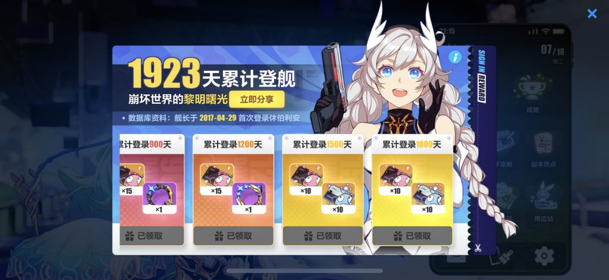

### [热点事件] [不吐不快] 来了好多崩铁人，那我来吐吐米这个公司的黑泥

Made by ngapost2md (c) ludoux [GitHub Repo](https://github.com/ludoux/ngapost2md)

----

##### 0.[5] \<pid:0\> 2023-07-19 20:23:10 by 一只电子龙
身份：仅玩原，对其他系列仅略懂

正文黑泥部分：

这是让我最不喜欢的一部分：强推崩坏宇宙，让我感觉原是外人，崩系列才是亲人。玩原后才知道有这么多角色就是在崩系列人物上稍微进行本地化改动：四神这么重量级的角色竟然只有岩神是完全原创的。(有没有好心人来说说水神是原创还是有原型的)
给我强烈的感觉：我投入感情的角色就是米的素材库而已。(另外听说钟离在隔壁被拆元素了？)

同位体好像都是崩系列的吧，没有原的原创角色到崩去当同位体吧。(明确说明联动的角色不算，比如崩3)
对于只玩原的玩家(比如我)，总感觉自己厨了崩同位体有种低崩一等；而且我是真不关心崩这系列游戏，游戏里总出同位体，游戏外总玩联动梗有种社区大环境在逼我去玩米所有游戏的感觉。

极为主观的意见：如果我在原的推被拿去做同素异形体，我大概率不会开心，因为ta不独一无二了。(当然也不排除大家爱屋及乌去玩新游戏，这就是米的目的吗好吧是我在逆行)

----

##### 2.[0] \<pid:703620596\> 2023-07-19 20:25:18 by 一只电子龙
另外围观了崩的cp问题：
米是不是不写cp会死啊。不会写就按无cp全员cb写，玩家自己会嗑的

----

##### 3.[0] \<pid:703620609\> 2023-07-19 20:25:24 by Miyas2
1.都是赚钱的工具哪来高贵低贱之分，喜欢我外服特供tnl吗
2.你以为现在崩铁就没有融原的角色了吗

----

##### 4.[0] \<pid:703620882\> 2023-07-19 20:27:12 by 2HAL9000
水神现在看没原型，btw隔壁设计不知道情况，营销软文是确实有说剪切粘贴原的角色的

----

##### 5.[0] \<pid:703620936\> 2023-07-19 20:27:39 by 一只电子龙
>[jump](#pid703620609) Miyas2(2023-07-19 20:25)说:
>1.都是赚钱的工具哪来高贵低贱之分，喜欢我外服特供tnl吗 2.你以为现在崩铁就没有融原的角色了吗[s:a2:冷]

第一个不知道，等一个科普。
第二点其实我个人就是不喜欢同位体，拆元素，不管从哪个游戏到哪个。偶尔一两次干还可以，一直这样我会觉得：这个公司一点原创力都没有的吗

----

##### 6.[0] \<pid:703621168\> 2023-07-19 20:29:01 by 倾落影
星铁有角色缝合了原神角色是能说的吗
话说崩坏系列是相当于剧的一二三季吗？星铁和崩三走的不是一个赛道吧？为啥有崩三角色直接同名同姓同建模搬过来了，卖情怀？

----

##### 7.[0] \<pid:703621422\> 2023-07-19 20:30:43 by q794623
  光是零点酒吧就是无解深渊了，当然部分人会嗯岁，那我只能说啊对对对，反正xiao就完事了

----

##### 9.[0] \<pid:703621672\> 2023-07-19 20:32:21 by pirsdsop
>[jump](#pid703621168) 倾落影(2023-07-19 20:29) 说: 
>
>星铁有角色缝合了原神角色是能说的吗
>话说崩坏系列是相当于剧的一二三季吗？星铁和崩三走的不是一个赛道吧？为啥有崩三角色直接同名同姓同建模搬过来了，卖情怀？

崩二和崩三和崩铁设定剧情其实都不一样……
甚至有的“演员”性格都差距很大
硬要说的话有人可能会解释说他们都在“崩坏宇宙”里，虽然啥都不一样但是那是因为他们都在不同的世界泡(平行世界)里 
可我觉得这就不是一个人一个世界观  
完全就是卖情怀卖外表 很无语

----

##### 10.[0] \<pid:703622004\> 2023-07-19 20:34:17 by Lagrange_
水神目前看来没有原型，以前的梦里被传是希儿的同位体，不过现在至少外貌上已经看不出来了，鬼吧还说米终于想清楚女演员没用了，乐

----

##### 11.[0] \<pid:703622075\> 2023-07-19 20:34:46 by 举只栗子
都说了嘛，所谓崩坏宇宙就是给崩坏女演员换上不同皮肤去不同世界观里卖相同cp

----

##### 12.[1] \<pid:703622175\> 2023-07-19 20:35:26 by 一只电子龙
另外3.2之前我还算是个剧情党，喜欢看原学分析贴。
当时我看到原的世界分析说是崩3的一个世界泡，并观测到特瓦林我就绷不住了，也就算说整个原的世界天生就低崩一等
以前想着这样也可以接受，只要写好就行，现在看来结尾没有崩3宇宙的东西机械降神就算成功

----

##### 13.[0] \<pid:703622293\> 2023-07-19 20:36:09 by xmkz798
水神应该是杏玛尔，火神我认为肯定是姬子不然对不起名字

----

##### 14.[0] \<pid:703622466\> 2023-07-19 20:37:23 by 倾落影
>[jump](#pid703621672) pirsdsop(2023-07-19 20:32) 说: 
>
>崩二和崩三和崩铁设定剧情其实都不一样……
>甚至有的“演员”性格都差距很大
>硬要说的话有人可能会解释说他们都在“崩坏宇宙”里，虽然啥都不一样但是那是因为他们都在不同的世界泡(平行世界)里 
>可我觉得这就不是一个人一个世界观  
>完全就是卖情怀卖外表 很无语

这么看的话mhy是否过于自信了，同样外表的演员出现在多个游戏里世界观不同性格经历都不一样却觉得会一样赚钱？

----

##### 15.[2] \<pid:703622623\> 2023-07-19 20:38:18 by 一只电子龙
而且一个二游，竟然有“演员”这个说法?果然米是偶像公司，角色是艺人，我是小丑

----

##### 16.[0] \<pid:703622921\> 2023-07-19 20:40:20 by Miyas2
>[jump](#pid703620936) 一只电子龙(2023-07-19 20:27) 说: 
>
>第一个不知道，等一个科普。
>第二点其实我个人就是不喜欢同位体，拆元素，不管从哪个游戏到哪个。偶尔一两次干还可以，一直这样我会觉得：这个公司一点原创力都没有的吗

第一个你直接搜崩三兔就知道了
第二个，确实，不光是角色，剧情也是，我出脑以后看见一堆的剧情“引据”分析都觉得很好笑，全是套来的东西就没有一点原创能力吗

----

##### 17.[0] \<pid:703623231\> 2023-07-19 20:42:29 by narozx
啊？我只知道崩坏有雷电芽衣，风神和草神是？

----

##### 18.[0] \<pid:703623279\> 2023-07-19 20:42:47 by 我流伦子哥
楼主我嘴替zsbd

----

##### 19.[0] \<pid:703623389\> 2023-07-19 20:43:32 by 一只电子龙
>[jump](#pid703621672) pirsdsop(2023-07-19 20:32)说:
>[quote][pid=703621168,37061615,1]Reply[/pid] <b>Post by [uid=65042764]倾落影[/uid] (2023-07-19 20:29):</b>  星铁有角色缝合了原神角色是能说的吗[s:ac:哭笑] 话说崩坏系列是相当于剧的一二三季吗？星铁和崩三走的不是一个赛道吧？为啥有崩三角色直接同名同姓同建模搬过来了，卖情怀？[s:a2:不明觉厉][/quote]崩二和崩三和崩铁设定剧情其实都不一样…… 甚至有的“演员”性格都差距很大 硬要说的话有人可能会解释说他们都在“崩坏宇宙”里，虽然啥都不一样但是那是因为他们都在不同的世界泡(平行世界)里  可我觉得这就不是一个人一个世界观   完全就是卖情怀卖外表 很无语

既然设定剧情性格都不一样，为什么不干脆出新角色啊……另外问问有同位体的厨子们，你们喜欢这个角色在其余系列里的同位体吗

----

##### 20.[0] \<pid:703623594\> 2023-07-19 20:44:47 by 我流伦子哥
>[jump](#pid703623231) narozx(2023-07-19 20:42) 说: 
>
>啊？我只知道崩坏有雷电芽衣，风神和草神是？

崩2温蒂和三蹦子的德莉莎(同声优同体型同发色)
不过从须弥开始有一点去崩化的味道，草神没那么严重，最多只到崩三的ky玩梗水平。温迪的神装纹路和温蒂神似

----

##### 21.[0] \<pid:703623814\> 2023-07-19 20:46:27 by baijin123
崩铁出来的时候就有一种论调，认为崩铁故意做得轻量化(十分钟就能收完菜？)，就是为了收割玩累了米家的大头游戏(崩三，原)后的玩家的零碎游玩时间。所以说，楼主觉得社区在逼自己去玩崩，这或许恰是米家的终极目的？可怕捏

----

##### 22.[0] \<pid:703623875\> 2023-07-19 20:46:50 by 一只电子龙
>[jump](#pid703623279) 我流伦子哥(2023-07-19 20:42)说:
>楼主我嘴替zsbd

哈哈哈我都眼熟你了你在那几个高楼里面很多时候也是我的嘴替

----

##### 23.[0] \<pid:703623911\> 2023-07-19 20:47:05 by 倾落影
>[jump](#pid703623594) 我流伦子哥(2023-07-19 20:44) 说: 
>
>崩2温蒂和三蹦子的德莉莎(同声优同体型同发色)
>不过从须弥开始有一点去崩化的味道，草神没那么严重，最多只到崩三的ky玩梗水平。温迪的神装纹路和温蒂神似

每次在原神视频看到弹幕刷温蒂都绷不住，幸好现在不看了

----

##### 24.[0] \<pid:703624111\> 2023-07-19 20:48:34 by setsuna2023
个人补充一点，卖演员/素材重组，在消费者层面问题是多掏一份钱获得差异化不大的体验，除了特别纯的结晶，边际效应下降是必然规律吧
现在有哪个换皮手游卖得很好吗

----

##### 26.[0] \<pid:703624241\> 2023-07-19 20:49:26 by sikamadu
>[jump](#pid703620882) 2HAL9000(2023-07-19 20:27) 说: 
>
>水神现在看没原型，btw隔壁设计不知道情况，营销软文是确实有说剪切粘贴原的角色的

水神都双重人格了，难道不是一眼希儿吗

----

##### 27.[0] \<pid:703624457\> 2023-07-19 20:51:10 by xqtdbmys
其实没有什么同位体，都是番茄和苹果的区别，印象色差不多罢了，目前原神和崩坏没有半毛钱关系，都是硬蹭的

----

##### 28.[0] \<pid:703624561\> 2023-07-19 20:51:49 by 一只电子龙
>[jump](#pid703620514) jsjdnfnf(2023-07-19 20:24):

我的想法：我要玩科幻我会玩原?我就想玩一个纯粹的奇幻故事，不要结尾一转科幻(可以接受提瓦特虚拟说，但不接受结尾转入崩系列)，要独立出来就彻底独立，而不是遮遮掩掩做崩系列的下位。

----

##### 29.[0] \<pid:703624654\> 2023-07-19 20:52:21 by narozx
>[jump](#pid703623594) 我流伦子哥(2023-07-19 20:44)说:
>[quote][pid=703623231,37061615,1]Reply[/pid] <b>Post by [uid=65049773]narozx[/uid] (2023-07-19 20:42):</b>  啊？我只知道崩坏有雷电芽衣，风神和草神是？[/quote]崩2温蒂和三蹦子的德莉莎(同声优同体型同发色) 不过从须弥开始有一点去崩化的味道，草神没那么严重，最多只到崩三的ky玩梗水平。温迪的神装纹路和温蒂神似

好家伙，米()是没钱买新素材吗，抄成这样……

----

##### 30.[0] \<pid:703624715\> 2023-07-19 20:52:43 by 2HAL9000
>[jump](#pid703624241) sikamadu(2023-07-19 20:49) 说: 
>
>水神都双重人格了，难道不是一眼希儿吗

是说脸啦[

----

##### 31.[0] \<pid:703625276\> 2023-07-19 20:56:30 by 哒哒块
>[jump](#pid703624241) sikamadu(2023-07-19 20:49) 说: 
>
>水神都双重人格了，难道不是一眼希儿吗

最重要的cv对不上

能对上的短发基底、双重人格、“芙”字辈，但这些都不是啥罕见元素

除非哪天爆出更早期的废案

----

##### 32.[0] \<pid:703625400\> 2023-07-19 20:57:21 by 豆豆在花盆里
水神我听玩过崩三的朋友说原型像是杏玛尔

----

##### 33.[1] \<pid:703625695\> 2023-07-19 20:59:27 by 一只电子龙
>[jump](#pid703622293) xmkz798(2023-07-19 20:36):

这就是我不喜欢演员，同位体的理由：
剩下的神还没有出呢，就已经为崩的角色安排好了神位了……难道原神就不配有自己的新角色，自己的神明?
(叠甲：不是针对个人，这种发言我见过很多了，都是米的一贯做法给老玩家们留下的印象就顺口说出来了，一切都怪米)

----

##### 34.[0] \<pid:703625975\> 2023-07-19 21:01:33 by sikamadu
>[jump](#pid703625276) 哒哒块(2023-07-19 20:56) 说: 
>
>最重要的cv对不上
>
>能对上的短发基底、双重人格、“芙”字辈，但这些都不是啥罕见元素
>
>除非哪天爆出更早期的废案

那按照这种说法，温迪和温蒂cv也对不上啊

水神设计成双重人格我感觉就已经是很明显了

----

##### 35.[0] \<pid:703626400\> 2023-07-19 21:04:22 by dfpvml
绫人算不算奥托的演员毕竟中日cv都一样

----

##### 36.[0] \<pid:703626409\> 2023-07-19 21:04:28 by 小说宅x
>[jump](#pid703625695) 一只电子龙(2023-07-19 20:59) 说: 
>
>这就是我不喜欢演员，同位体的理由：
>剩下的神还没有出呢，就已经为崩的角色安排好了神位了……难道原神就不配有自己的新角色，自己的神明?
>(叠甲：不是针对个人，这种发言我见过很多了，都是米的一贯做法给老玩家们留下的印象就顺口说出来了，一切都怪米)

而且往往只桃七神，给我一种特别高贵的感觉，来你们这不当神这种一眼剧情强度中心的角色都委屈了。
还有哔哔赖赖姬子火神的，我真的想说就姬子那个狗屁人气能带来个屁的保底，还有姬子厨没被mhy气死的有一个算一个我全当他们是受虐狂。

----

##### 37.[0] \<pid:703626526\> 2023-07-19 21:05:19 by 倾落影
>[jump](#pid703625695) 一只电子龙(2023-07-19 20:59) 说: 
>
>这就是我不喜欢演员，同位体的理由：
>剩下的神还没有出呢，就已经为崩的角色安排好了神位了……难道原神就不配有自己的新角色，自己的神明?
>(叠甲：不是针对个人，这种发言我见过很多了，都是米的一贯做法给老玩家们留下的印象就顺口说出来了，一切都怪米)

印象里很早就在b站看到过七神设定和外貌的推测视频，那个视频印象最深的就是up说火神和崩三姬子相貌应该有很高相似性(或者说原神版姬子)

----

##### 38.[0] \<pid:703626999\> 2023-07-19 21:08:03 by 倾落影
>[jump](#pid703626400) dfpvml(2023-07-19 21:04) 说: 
>
>绫人算不算奥托的演员毕竟中日cv都一样

不算吧？除了cv他俩有其他相似之处吗？不过ky的人挺多，现在应该少点了，因为星铁出了罗刹

----

##### 39.[0] \<pid:703627428\> 2023-07-19 21:10:51 by mk311ols
>[jump](#pid703620514) jsjdnfnf(2023-07-19 20:24) 说: 
>
>确实，非要在原神这个奇幻世界里搞科幻，好好的游戏被毁了，我看到机甲怪物就恶心

不要小瞧科幻啊，科幻才不是这么肤浅的东西

----

##### 40.[0] \<pid:703629211\> 2023-07-19 21:22:11 by jinjin886
>[jump](#pid703626400) dfpvml(2023-07-19 21:04) 说: 
>
>绫人算不算奥托的演员毕竟中日cv都一样

算，绫人刚出时隔壁奥托刚死，pv的弹幕和评论区刷的全是奥托。但之后崩铁出了更明显相似的罗刹，绫人这边刷的才少了，后续神里家背景故事都拿来垫给散兵了，绫人实惨。

----

##### 41.[1] \<pid:703629502\> 2023-07-19 21:24:09 by 一只电子龙
>[jump](#pid703626409) 小说宅x(2023-07-19 21:04):

怎么说呢，我已经退而求其次到接受原神同位体，但希望是普通角色。
只桃神给我观感极差：一是我根本不明白这些人是谁你就跟我说这是未来的神；另一方面你已经在另一个游戏里是剧情中心了怎么还要在原里面是重量级人物七神啊

----

##### 42.[0] \<pid:703629738\> 2023-07-19 21:25:33 by 6666655555略略略
感觉除了八重雷神，原还有什么角色和崩是一样的吗？cv是奇想一家独大肯定是很多角色是相同的。双重人格之类的莱依拉不是已经有了吗？现在什么火神冰神都靠猜，怎么就是崩的角色的神位了？原里面的符华和爱莉希雅这样的高人气角色也没有在原有迹象出现。至于星铁，本身是崩坏系列那走一步看一步吧。
我崩三原，星铁都是开服玩家。我的观点和楼主刚好相反，mhy现在就是把不得原独立出去，现在原的体量比崩大很多。不可能什么逼着原去玩崩。至于大伟哥所说的崩坏系列是独一无二的，那确实啊，没有崩坏三就没有原。崩坏系列代表着他的十年创业期，代表着一代人的青春。只玩原就只玩原，没影响，但想评价米哈游这家公司确实不能只看原。

----

##### 43.[0] \<pid:703630237\> 2023-07-19 21:29:00 by 慢吞吞的惬意时光
玩过崩坏3的老玩家都不会对米这些操作感到陌生，零点酒吧、空中劈叉、tnl、克扣箱子、ml百合两头恰、终焉，崩铁和原神的烂活你都能在崩三里找到原型

----

##### 44.[1] \<pid:703630440\> 2023-07-19 21:30:29 by ソフィスト
>[jump](#pid703629738) 6666655555略略略(2023-07-19 21:25)说:
>感觉除了八重雷神，原还有什么角色和崩是一样的吗？cv是奇想一家独大肯定是很多角色是相同的。双重人格之类的莱依拉不是已经有了吗？现在什么火神冰神都靠猜，怎么就是崩的角色的神位了？原里面的符华和爱莉希雅这样的高人气角色也没有在原有迹象出现。至于星铁，本身是崩坏系列那走一步看一步吧。 我崩三原，星铁都是开服玩家。我的观点和楼主刚好相反，mhy现在就是把不得原独立出去，现在原的体量比崩大很多。不可能什么逼着原去玩崩。至于大伟哥所说的崩坏系列是独一无二的，那确实啊，没有崩坏三就没有原。崩坏系列代表着他的十年创业期，代表着一代人的青春。只玩原就只玩原，没影响，但想评价米哈游这家公司确实不能只看原。

天理的维系者当初不是一眼就看得出是空律变体嘛。CV方面中配不知道，日配依旧还是让钉宫上的

