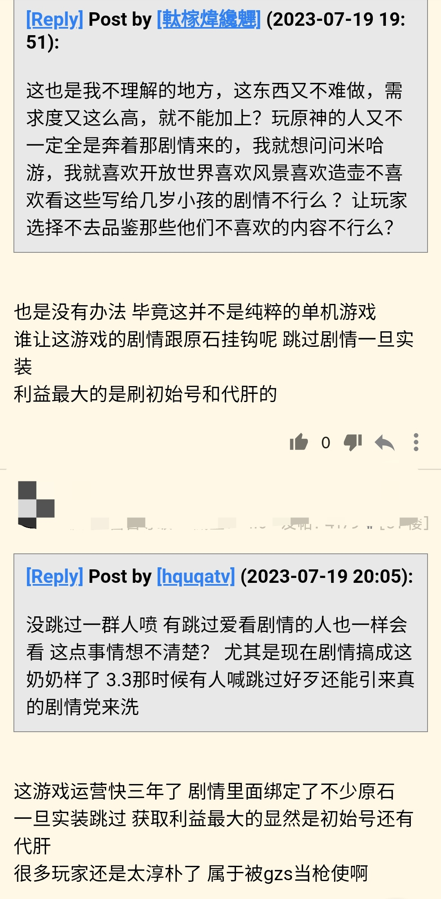

### [不吐不快]我不明白

Made by ngapost2md (c) ludoux [GitHub Repo](https://github.com/ludoux/ngapost2md)

----

##### 0.[1] \<pid:0\> 2023-07-19 20:30:27 by pother

为什么有些人发言总是从厂商的角度考虑。
之前的bgo也是，我氪了五万一天没断过签的bgo号就是因为被bilibili孝子恶心到退坑的。
还有之前舟的利刃也是。
当我吐槽厂商时，我只是在发泄不满，倒不一定真的期待他们就能改。改不改，我也会继续玩。
但是孝子总是觉得要维护社区环境的和谐美满，你吐厂商的黑泥就是在污染他们的社区环境。
仿佛我玩的是游戏，他们玩的是社区。

结果，最后我不是因为厂商的不作为而弃坑，而是因为孝子的堵嘴而弃坑。

到底谁污染了谁的环境?

----

##### 1.[0] \<pid:703621840\> 2023-07-19 20:33:17 by pother
我怀疑这是二游的特色，玩的就是社区和厨放。
明明我玩其他游戏时都不是这个氛围的。
在游戏里收获快乐，在游戏外吐槽抱怨，都是很正常的。

----

##### 2.[0] \<pid:703622040\> 2023-07-19 20:34:30 by 魑魅魍魉魖魌
结晶不是最喜欢说这是一个单机游戏吗？有工作室关单机玩家什么事？

----

##### 3.[0] \<pid:703622121\> 2023-07-19 20:35:07 by 我修院淳平
我为厂商考虑的原因只有一个，说服我自己，省的被气的吃不下饭。
但该飞它们马是省不了的。

----

##### 4.[1] \<pid:703622225\> 2023-07-19 20:35:45 by wjxjh
这不是二游特色，是结晶游戏特色。结晶越多的游戏越会发生这个

----

##### 5.[0] \<pid:703622372\> 2023-07-19 20:36:43 by Highhhope
你玩的是游戏，人家玩的是身份认同

----

##### 6.[0] \<pid:703623079\> 2023-07-19 20:41:22 by 熊猫小天天
原神不是单机游戏吗？工作室刷原石跟我有什么关系？想孝就直说

----

##### 7.[0] \<pid:703623523\> 2023-07-19 20:44:18 by 倾落影
游戏剧情和原石挂钩？除了剧情中间有秘境的，其他主线剧情都是结束后才给原石吧？出个skip怎么你了

----

##### 8.[0] \<pid:703625051\> 2023-07-19 20:54:54 by ritsukaalter
你说的没错它们玩的就是社区

----

##### 9.[0] \<pid:703626114\> 2023-07-19 21:02:30 by 缩小帽设定是神
那能不能到了须弥剧情开放剧情跳过功能呢？借口一套一套的

----

##### 11.[0] \<pid:703627415\> 2023-07-19 21:10:43 by 米兰达123
就算从游戏公司角度考虑，加上剧情跳过也不见得是什么坏事啊，尤其是原神的剧情又是出了名的又长又无聊，要是有跳过，很多人没看过原神的剧情，说不定其他的节奏也不会那么大

----

##### 12.[0] \<pid:703627680\> 2023-07-19 21:12:13 by 秘密首领艾华斯
剧情才几个原石没点b数吗？你这游戏物品又不能交易工作室最多也就能组织代肝而已。

----

##### 13.[0] \<pid:703627876\> 2023-07-19 21:13:35 by 哒哒块
工业化提纯

----

##### 14.[0] \<pid:703628153\> 2023-07-19 21:15:15 by 沆瀣一气zex
原神主线那点剧情能有多少原石啊……还刷初始，刷他那不知道什么时候复刻凹复刻大数字的角色吗？现在常驻角色除了小提强度勉强跟得上版本，其他的不都是快半截身子入土了吗。就这种初始拿来何用

----

##### 15.[0] \<pid:703628664\> 2023-07-19 21:18:37 by 啪哒砰砰
我觉得不让跳剧情是因为原神是卖电子手办的游戏，你把剧情跳过了没媚到你你怎么会想抽

----

##### 16.[0] \<pid:703629219\> 2023-07-19 21:22:15 by pother
>[jump](#pid703628664) 啪哒砰砰(2023-07-19 21:18) 说: 
>我觉得不让跳剧情是因为原神是卖电子手办的游戏，你把剧情跳过了没媚到你你怎么会想抽

据我所知，舟和废狗，两个卖jpg和平面小人的都有剧情跳过。原神一个卖3D电子手办的反倒怕没人抽?

----

##### 17.[0] \<pid:703629652\> 2023-07-19 21:25:01 by 再也不随意注销了
未成年学长把氪佬赶走是厂商的福气

----

##### 18.[0] \<pid:703629713\> 2023-07-19 21:25:21 by 一念の差
省流：给我爹充钱啊！！！

----

##### 19.[0] \<pid:703637150\> 2023-07-19 22:13:54 by fanqiecaodan
你原好好反外挂不就得了，再不济玩家正常游戏谁tm买那么多工作室号，最后你以为miHoYo是不知道tb卖号还是咋滴就你能，觉得自己老帅了老牛逼了

----

##### 20.[0] \<pid:703638767\> 2023-07-19 22:24:01 by 费雷德里克尔梅
在现在这个时候，成品号都卖不出价格，还在乎初始号剧情跳过刷原石，感觉是好幽默

