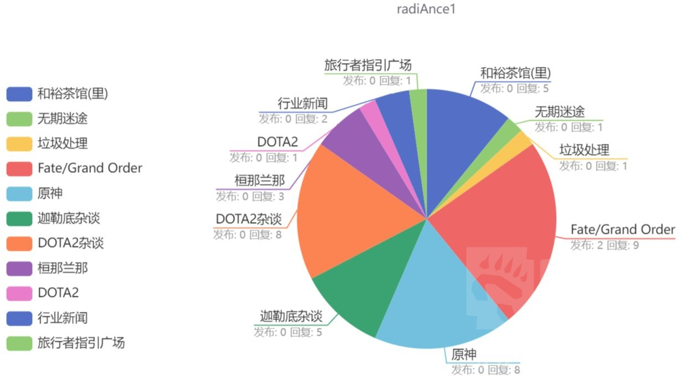
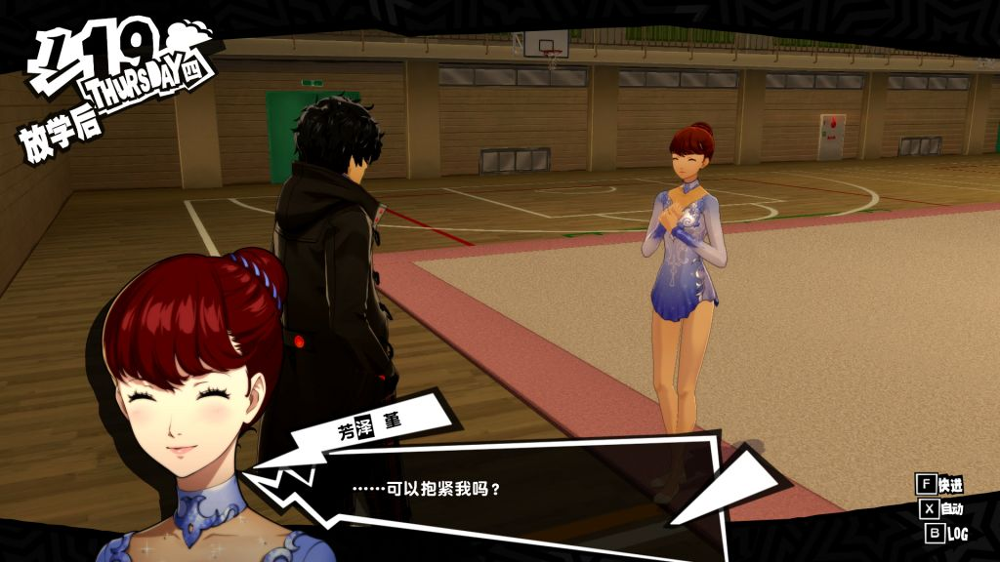
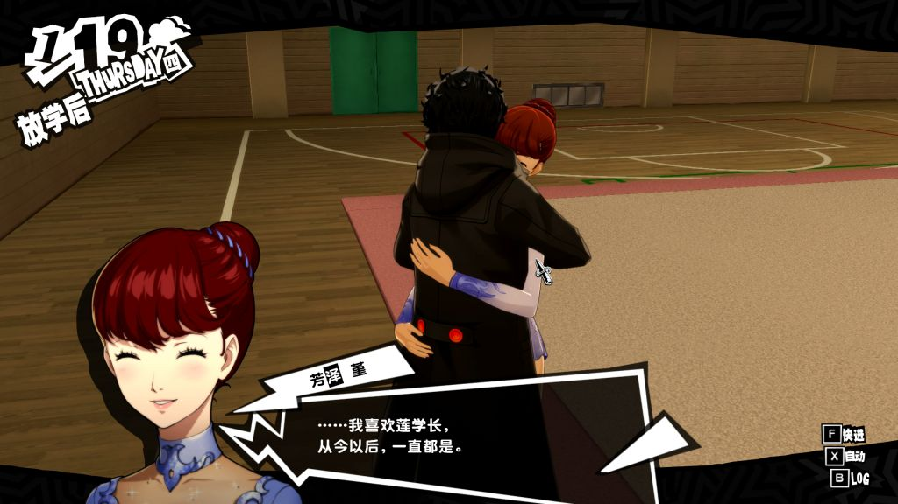
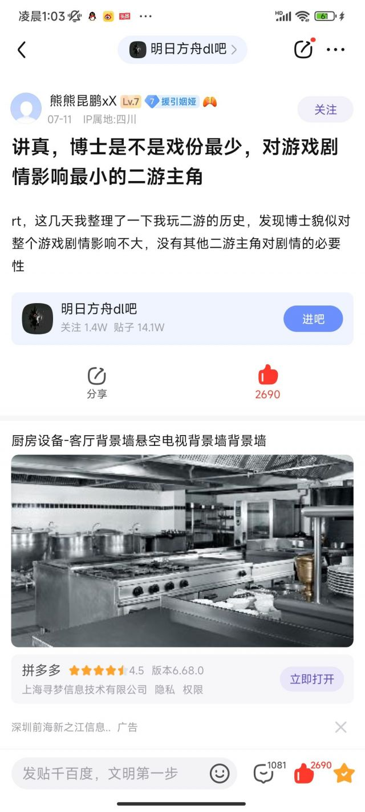
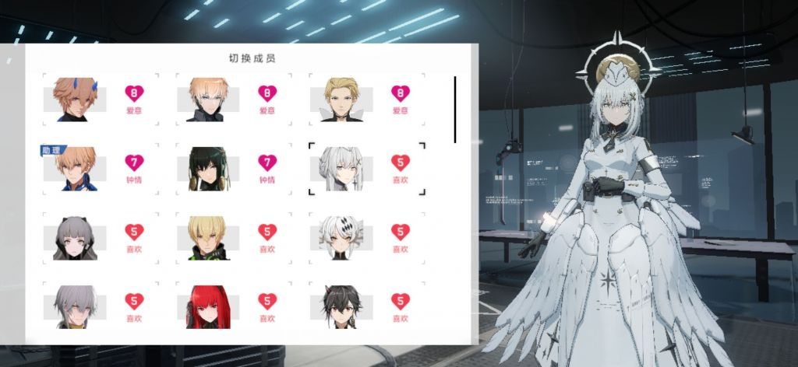

### [不吐不快]你们觉得原里面那几个ml写的很好吗？

Made by ngapost2md (c) ludoux [GitHub Repo](https://github.com/ludoux/ngapost2md)

----

##### 0.[0] \<pid:0\> 2023-07-19 21:06:48 by 秘密首领艾华斯
说实话原神里的m角色l我觉得也写的不咋地啊，突出一个尬，神里申鹤都有一种啊我们很熟吗你怎么就看上我了的奇怪感觉。而且即使看上了也缺乏山盟海誓和生死与共的厚重感，最多就是抛个媚眼写几句擦点边，有感情但不多的台词，和我看的番和小说对爱情的表现力压根不在一个档次上。魔禁里随便拖个几十卷没戏份的npc五和出来塑造的都甩你十条街，人家五和在当麻病床旁边的那一段独白和后续被建宫说服之后重新站起来去面对几乎不可能战胜的敌人的觉悟不远超你原所有所谓ml的台词？奥赛尔老婆按理来说实力设定也不低，但过于空降的出场，尬的没边的脸接水炮，旁边看戏的仙人，本身毫无理念的工具反派设置让这一战显得没有任何紧迫感，对比后方之水展现出的无边力量与坚定信念相形见绌。完全是因为ml写的再烂起码也比蒸鸡，基界强者，黑丝烧0好，算是给写作水平兜底的底裤才不会被宅男攻击，这剧情到番剧里管你什么感情倾向，动画区早出几十万播放的辱骂视频了。

----

##### 1.[0] \<pid:703627940\> 2023-07-19 21:13:55 by 呙邱邱
一般，能解渴就行。

----

##### 2.[0] \<pid:703627970\> 2023-07-19 21:14:07 by jsjdnfnf
感觉不如帕姆。。。ml

----

##### 3.[4] \<pid:703628051\> 2023-07-19 21:14:35 by 哒哒块
再差那也是ml啊，以前被骂不挑食我甚至有点认可，现在发现我都饿死了

----

##### 4.[3] \<pid:703628193\> 2023-07-19 21:15:31 by UID3563849
他不卖CP就谢天谢地了，ML写得好不好甚至不写都已经无所谓了

----

##### 5.[2] \<pid:703628242\> 2023-07-19 21:15:57 by narozx
3.2之前草神的ml卖得倒是还行其他就算了

----

##### 6.[0] \<pid:703628435\> 2023-07-19 21:17:13 by 硫酸小檗碱
是的，但是根本没几个，之前还不喜欢逛街，后来发现你游cp写得更烂

----

##### 7.[0] \<pid:703628441\> 2023-07-19 21:17:15 by Komeiji5
有点暗示玩家会自己发电，至少别给大家添堵就不错了，喜欢我阿草kfk的cp背刺么

----

##### 8.[0] \<pid:703628454\> 2023-07-19 21:17:20 by 是风动，也是心动
ml我印象只有魈剧情？可能其他不太关注，对魈有好感印象深，其他要么差要么无感

----

##### 9.[0] \<pid:703628504\> 2023-07-19 21:17:36 by D_终于考好了
目前为止最ml的是捷德，只是不能抽

----

##### 10.[1] \<pid:703628529\> 2023-07-19 21:17:47 by 汐汐漓漓
一旦想到米哈游是捏着鼻子给玩家写ml，就有一种我真的是黄毛的快乐

----

##### 11.[1] \<pid:703628609\> 2023-07-19 21:18:21 by 罗一川
写的确实不咋地，但是至少神里没一会旅行者一会又去贴别的男人了，当然就米这发病程度以后怎么样也说不准

----

##### 12.[0] \<pid:703628793\> 2023-07-19 21:19:23 by 秘密首领艾华斯
>[jump](#pid703628435) 硫酸小檗碱(2023-07-19 21:17) 说: 
>
>是的，但是根本没几个，之前还不喜欢逛街，后来发现你游cp写得更烂

我最早的时候以为是无脑ml破坏了角色的正常塑造，一度反对过这种特别尴尬的无脑贴，后来发现你游剧情只是单纯的没有创作能力还时不时发癫而已  
哦不对，某个时间点以后是一直发癫

----

##### 13.[0] \<pid:703628920\> 2023-07-19 21:20:13 by Lucky Luk
不太行，ml我更注重那段感情发展，像神里这种逛个街就突然献舞的我是直接把游戏塞后台等她跳完的。

----

##### 14.[1] \<pid:703628933\> 2023-07-19 21:20:17 by 逐日绝影
甚至五和还不是四大正教(捂脸)，关键你米卖cp卖得更难以启齿这是能说的吗

----

##### 15.[0] \<pid:703629070\> 2023-07-19 21:21:19 by 阿猹不吃香菜
一般，比不上我玩的其他游戏
绫华那个主线里穿插逛街月下一舞我皱着眉看完的
申鹤那个忘了，之后不二创入脑和夜兰卖cp就算成功
有记忆点的是魈，但是同人好像ml打不过cp

----

##### 16.[1] \<pid:703629137\> 2023-07-19 21:21:40 by 油门踩到底
问题是黄毛本人就跟没脑子没嘴一样，问你哥哥妹妹在哪都要派蒙代答，还磕个屁
说实话，神里绫华和旅行者逛街，甚至比不上神里绫华拿着黄毛遗照上街好磕
前者你都不知道这对话要怎么写

----

##### 17.[0] \<pid:703629180\> 2023-07-19 21:21:55 by 其实我也不想说
我只能说请好好的看着我很尬

----

##### 18.[0] \<pid:703629307\> 2023-07-19 21:22:51 by 寅阮龚庚余曾
黑米先放一边，饭要一口一口吃，神申魈托起码解决了从无到有的问题，hy的pg当时还不支持从有到好的升级
现在甚至完成了从有到无，从无到牛的突破捏

----

##### 21.[1] \<pid:703630469\> 2023-07-19 21:30:39 by EWSCHNEE
说真的要玩真ml我还不如去玩galgame甚至是*作，原这可怜的文本量还有演出效果，换算成动画一两集差不多30min就能讲完的事，可以拖1h+，水分可以说大的很。

但是以目前的状况大家就图个电子手办柜，有ml总比没有好吧。调侃一下，能量+3放过去会被喷烂，现在能算是加分项了。

----

##### 22.[1] \<pid:703630631\> 2023-07-19 21:31:50 by 伤逝遐汐
他们镍币写的ml还勉强能看，虽然确实生硬。但他们真心实意写的东西突出一个不堪入目

----

##### 23.[1] \<pid:703630650\> 2023-07-19 21:31:57 by 技竜
楼上直球说女角很尬男角很行的这几位点进动态怎么都是疑似是高等性别呢

不会以为原神真有什么好塑造吧?五十步笑百步可太好笑了这也是玩原神玩的

----

##### 24.[0] \<pid:703630746\> 2023-07-19 21:32:34 by 今锁朱楼
和你差不多感觉，对ml没什么特殊偏爱所以很多时候会觉得有点微妙，所有暧昧剧情全被我划进朋友范围里了。
至于具体的剧情水平：
绫华ml剧情对跳舞无感，印象最深的是结尾的神里说完 撒由那拉 然后转身一个人慢慢走上台阶，旅行者就在底下深深凝望着她的背影，这是我对绫华的情感最高峰。就这一小段来说，文案想塑造的倾慕旅者但仍有理性的大小姐形象在我心里是立住了。
魈在我眼里就是往死里卖，出场那个转头就明白了这个角色的定位，没什么特别触动我的剧情但也没什么反感，就当交朋友了。
申鹤是有点微妙，我给她的定位是小龙女，初入人世的仙子对旅行者一见钟情，最后打boss救场那段挺燃的，但因为旅行者送了所以我主要感觉是有点尴尬。(喜欢代入理解一下)
还有就是散兵了，认真讲不黑，散兵的ml属性挺明显的，身为女性也能get到他针对女性的设计点，白散和小孩对坐碰手那张图我当时好感还挺高。但他的起名字剧情是我觉得最莫名其妙的，比魈那个随叫随到还奇怪，那个至少可以用交朋友遮掩一下。我当时并没有觉得散兵和旅行者有多么亲近的关系，所以让我给起名我很抗拒，起名字在我眼里仪式感太强了但我对他并没有那么浓烈的感情。而且鉴于我当时觉得散兵既然要给纳西妲当助手，纳西妲给起名是最好的，也能隐晦地定义一下二人的母子设定。

----

##### 26.[0] \<pid:703631096\> 2023-07-19 21:34:55 by 秘密首领艾华斯
>[jump](#pid703630650) 技竜(2023-07-19 21:31) 说: 
>
>楼上直球说女角很尬男角很行的这几位点进动态怎么都是疑似是高等性别呢
>
>不会以为原神真有什么好塑造吧?五十步笑百步可太好笑了这也是玩原神玩的

魈的话ml剧情我认为确实比别的角色稍微好一点，但也就那么个样，到番剧里还是混个及格水平都难，至于男角色平均水平，其他一个人就能拉成负的

----

##### 27.[0] \<pid:703631108\> 2023-07-19 21:34:59 by n258456
作为一个老涩批的个人观感:神里比较可惜，进展太快了缺了点感觉，申鹤倒是有那味儿了但由于她和重云的亲戚关系导致我对这俩的小姨文学比ml更感兴趣(所以说明明是一个ml角色为什么非得加个小姨的设定呢？你是故意的还是不小心的？)
只能说总比没有强

----

##### 28.[0] \<pid:703631481\> 2023-07-19 21:37:29 by hedeki
感觉…ml不如隔壁5732的理发店asmr

----

##### 29.[0] \<pid:703631529\> 2023-07-19 21:37:47 by 绅士官邸
就是一坨，尬中尬。
只是因为相悦法则，ml比cp多了层“伸手不打笑脸人”的盾所以更易于接受而已。
推荐米()搞ml就和推荐菜鸡写手写龙傲天小白文一样，不是说那样做多好，只是考虑到笔者水平……

----

##### 30.[0] \<pid:703631703\> 2023-07-19 21:38:53 by Zzyugg
没人提我心是吧，我心的能量+4现在看来也挺香

----

##### 31.[0] \<pid:703631906\> 2023-07-19 21:40:18 by 在豆田发现少女
不咋地，但你连ml都讨好不了玩家写cp不更是一坨屎。噢3.3前草神ml算不错的，后面崩盘了，怎么肥四捏。

----

##### 32.[0] \<pid:703632140\> 2023-07-19 21:41:54 by 伊莱亚斯0508
mhy这个比公司，让他们写ml跟杀了他们一样难受，甭管写的咋样，有都得谢天谢地对它感恩戴德了

----

##### 33.[0] \<pid:703633411\> 2023-07-19 21:50:16 by 我不是路过的
手游这种载体ML本来就容易没头没尾。

拿很多人举例的大小碧蓝来说，里面多的是那种莫名其妙的对你高评价高好感，甚至各种疯狂倒贴。你非要去一个个纠结逻辑是纠结不起的。

但是说实话，我作为玩家我不在乎，也不想去算这个逻辑。现实勾心斗角够累了，二次元有人贴贴老老实实躺平多爽。

----

##### 34.[0] \<pid:703634240\> 2023-07-19 21:55:43 by 四方形打柠檬茶
之前车ml的不少，就是因为水平实在是太差了，每个ml角色突然开卖的时候都让我尴尬然后mhy证明了它写cp的功力比ml烂上十倍甚至九倍

----

##### 35.[0] \<pid:703634505\> 2023-07-19 21:57:18 by 众生蔓延
当大家以为魈神申是ml的开始还有余裕挑三拣四的时候，没想到已经是结束(指卖得哪怕不是多数好评但也不会如此逆天)

----

##### 36.[1] \<pid:703635094\> 2023-07-19 22:01:07 by 转生能成功吗
感觉比不上1999短短四章主线塑造出的角色(斯耐德、十四行诗、槲寄生、星锑、苏芙比、Apple)
这些角色哪怕不是ml向，她们对维尔汀的情谊都会让我很感动

----

##### 37.[0] \<pid:703635140\> 2023-07-19 22:01:25 by Lilith330
都那样，神申魈能一直卖就不错了，神里没咋卖过别的，可能怕爆炸
申鹤已经卖忘了，还暗戳戳带申兰
魈一直都是多线卖的，ml卖得狠南桐cp也没落下，不过至少版里提起来时很多人都不知道或者不觉得卖得过分罢了。

----

##### 38.[0] \<pid:703635333\> 2023-07-19 22:02:40 by 转生能成功吗
>[jump](#pid703629070) 阿猹不吃香菜(2023-07-19 21:21) 说: 
>
>一般，比不上我玩的其他游戏
>绫华那个主线里穿插逛街月下一舞我皱着眉看完的
>申鹤那个忘了，之后不二创入脑和夜兰卖cp就算成功
>有记忆点的是魈，但是同人好像ml打不过cp

魈荧/空应该比其他cp更有热度一点吧至少国内是这样的

----

##### 39.[0] \<pid:703635649\> 2023-07-19 22:04:33 by 呙邱邱
不带脑子地干脆把主角写成一个人见人爱热心善良但无口的“魅魔”吧，然后加点天外来客与生俱来的特殊性，引起自机的好奇心和探索欲……啪，ml写好了

----

##### 40.[0] \<pid:703636703\> 2023-07-19 22:11:17 by MeliMor
我在磕魈荧但是主要原因是我喜欢bg以及刚入坑的时候看到了不错的文，游戏里就一般吧感觉，没有到让我反感的地步不过能看出来在卖，现在主要也就活在固定几个太太的投喂下，而且这个算cp还是算ml还是乙什么的好像一直在吵架，咱也不懂

----

##### 41.[3] \<pid:703637018\> 2023-07-19 22:13:12 by 弦意
怎么说呢，不比不知道，虽然ml写的不咋地，但比起卖的cp崩人设，还不如ml，至少没有谁绑死旅行者

----

##### 42.[0] \<pid:703637267\> 2023-07-19 22:14:37 by 再也不随意注销了
都不咋样

----

##### 43.[0] \<pid:703637740\> 2023-07-19 22:17:25 by 前排合影围观
申鹤现在还算ml么，米哈游最近感觉好像更偏爱申兰吧，二创转官推的典型

----

##### 44.[0] \<pid:703637985\> 2023-07-19 22:19:04 by 呙邱邱
>[jump](#pid703637740) 前排合影围观(2023-07-19 22:17) 说: 
>
>申鹤现在还算ml么，米哈游最近感觉好像更偏爱申兰吧，二创转官推的典型

至少游戏里应该还是算的吧……游戏外的我就不知道了。

----

##### 45.[0] \<pid:703638241\> 2023-07-19 22:20:34 by radiAnce1
>[jump](#pid703629137) 油门踩到底(2023-07-19 21:21) 说: 
>
>问题是黄毛本人就跟没脑子没嘴一样，问你哥哥妹妹在哪都要派蒙代答，还磕个屁
>说实话，神里绫华和旅行者逛街，甚至比不上神里绫华拿着黄毛遗照上街好磕
>前者你都不知道这对话要怎么写
>
>编辑：用词有些激烈所以编辑一下
>就是说，不管什么ml，里面的“master”的角色至少有点人设才行
>隔壁四字的博士可以是冷酷棋手，所以我可以磕博士x小卢
>也可以是摸鱼人，所以我可以磕博士x白金
>还可以是某个远大抱负的人，所以我可以磕博士x凯尔希
>
>崩3的舰长算是传统日式老好人？所以我可以

噗，你说其他游戏我都能忍，博士和舰长，你真的不是来搞笑的吗？博士就一黑色塑料袋，yj为了省钱长相和性别都不给出来，一年活动剧情更是出不来几次，如果说黄毛是摄像头，博士连摄像头都不如，黑色裹尸袋你以为是在说谁啊。舰长主线里根本没这个人，只有活动剧情才能出场，博士和舰长就是二游主角小丑大小王 你拿来踩黄毛？你说战双，ba，fgo，我都没意见，博士和舰长还是算了吧

----

##### 46.[0] \<pid:703638549\> 2023-07-19 22:22:33 by radiAnce1
>[jump](#pid703637740) 前排合影围观(2023-07-19 22:17) 说: 
>
>申鹤现在还算ml么，米哈游最近感觉好像更偏爱申兰吧，二创转官推的典型

什么时候转官推了？游戏里都没见面，话都每一句叫官推？别把心脏弱那二创当真吧

----

##### 47.[0] \<pid:703644276\> 2023-07-19 23:01:07 by 油门踩到底
>[jump](#pid703638241) radiAnce1(2023-07-19 22:20)说:
>[quote][pid=703629137,37062045,1]Reply[/pid] <b>Post by [uid=62920389]油门踩到底[/uid] (2023-07-19 21:21):</b>  问题是黄毛本人就跟没脑子没嘴一样，问你哥哥妹妹在哪都要派蒙代答，还磕个屁[s:ac:哭笑] 说实话，神里绫华和旅行者逛街，甚至比不上神里绫华拿着黄毛遗照上街好磕 前者你都不知道这对话要怎么写[s:ac:哭笑]  编辑：用词有些激烈所以编辑一下 就是说，不管什么ml，里面的“master”的角色至少有点人设才行 隔壁四字的博士可以是冷酷棋手，所以我可以磕博士x小卢 也可以是摸鱼人，所以我可以磕博士x白金 还可以是某个远大抱负的人，所以我可以磕博士x凯尔希  崩3的舰长算是传统日式老好人？所以我可以[/quote]噗，你说其他游戏我都能忍，博士和舰长，你真的不是来搞笑的吗？博士就一黑色塑料袋，yj为了省钱长相和性别都不给出来，一年活动剧情更是出不来几次，如果说黄毛是摄像头，博士连摄像头都不如，黑色裹尸袋你以为是在说谁啊。舰长主线里根本没这个人，只有活动剧情才能出场，博士和舰长就是二游主角小丑大小王 你拿来踩黄毛？你说战双，ba，fgo，我都没意见，博士和舰长还是算了吧

崩3现在的活动就是在卖ml，你觉得舰长ml菜，人家舰长身边至少观星迷迭月下，你黄毛不会连活动剧情也没ml磕吧
你说博士不行就更好笑了，我寻思粥版首页就一堆博士ml帖子，游戏里又一堆ml粮，怎么这都不知道的
退一万步讲，不会真有人觉得黄毛待遇能比得上舰长和博士的吧

哦不看粥版也不看崩啊，那没事了

----

##### 48.[0] \<pid:703644700\> 2023-07-19 23:04:08 by 霜雪有序
神里那个任务但凡不是为了卖卡，把月下跳舞告别放稻妻结束须弥将开那是绝杀好吧，结果就是硬插在主线里，结果ml卖的生硬又奇怪还莫名被解读出了绿茶利用黄毛送死的剧情被抹黑~~但是这个人设还挺带感的所以二创常用~~
只能说米写感情线就这水平，有ml就不错了还能咋的

----

##### 49.[0] \<pid:703646772\> 2023-07-19 23:18:08 by 无。乡3
>[jump](#pid703638241) radiAnce1(2023-07-19 22:20) 说: 
>
>噗，你说其他游戏我都能忍，博士和舰长，你真的不是来搞笑的吗？博士就一黑色塑料袋，yj为了省钱长相和性别都不给出来，一年活动剧情更是出不来几次，如果说黄毛是摄像头，博士连摄像头都不如，黑色裹尸袋你以为是在说谁啊。舰长主线里根本没这个人，只有活动剧情才能出场，博士和舰长就是二游主角小丑大小王 你拿来踩黄毛？你说战双，ba，fgo，我都没意见，博士和舰长还是算了吧

舰长和博士还得是有糖吃，原神里面你能找到多少ml剧情？还是说愿意写ml剧情？

----

##### 50.[0] \<pid:703647537\> 2023-07-19 23:23:17 by Elektronische
申鹤打牌台词挺ml的，主要是总体待遇真的很差，剧情量太少了

----

##### 51.[0] \<pid:703648158\> 2023-07-19 23:27:44 by setsuna2023
你是想看一段精美动画搭配说爱他让他氪648的ml，还是想看文案没完没了的黑屁毕业论文经费内卷甲方乙方艺术理想原生家庭领带美元这届观众太难伺候竟然敢刻薄攻讦

----

##### 52.[0] \<pid:703648653\> 2023-07-19 23:31:20 by 冷泠棱凌
真论ml原分分钟被友商薄纱不说，起码我现在左手君彼右手dl乙女抓冲得很开心

----

##### 53.[0] \<pid:703649329\> 2023-07-19 23:36:17 by Laeditil
里哥版本退坑的，比不上战双一根

----

##### 54.[0] \<pid:703650306\> 2023-07-19 23:43:05 by 魔王布洛喵
和楼上差不多，虽然我很喜欢绫华传说任务，但我觉得这主要还是归功于做之前在论坛看到的几篇赏析，让我很好地get到了立意(并且我很吃这套)，但具体落实到游戏里那演出是真不太行

----

##### 55.[0] \<pid:703652057\> 2023-07-19 23:55:00 by 人是有极限的
现在的问题是原神已经没有ml了好吗？须弥最ml的草神已经被拉去卖cp了，你所谓的ml角色已经边缘化好久了，我都不记得她们上次出场是什么时候了

----

##### 56.[0] \<pid:703652262\> 2023-07-19 23:56:19 by Joyeeeah没有joy
宵宫传2对我pg，神里那个还是算了

----

##### 57.[0] \<pid:703653305\> 2023-07-20 00:03:55 by 呙邱邱
其实原大可以搞一个自机参与世界任务，这不比给NPC解决家长里短好，还能顺便刻画剧情和卖ml，不用配音剧情可以量大管饱(但如果写得差就是地狱级别的折磨……)。

米赚得还是太多了，摆烂都能赚钱，但把NPC换成自机到底牵扯那个底层逻辑了，反正再ooc也不会比之前的烂活更烂(除非它胆敢放一对cp让我任务全程观摩他们打情骂俏好几个小时)

----

##### 58.[0] \<pid:703653937\> 2023-07-20 00:08:58 by radiAnce1
>[jump](#pid703644276) 油门踩到底(2023-07-19 23:01) 说: 
>
>崩3现在的活动就是在卖ml，你觉得舰长ml菜，人家舰长身边至少观星迷迭月下，你黄毛不会连活动剧情也没ml磕吧
>你说博士不行就更好笑了，我寻思粥版首页就一堆博士ml帖子，游戏里又一堆ml粮，怎么这都不知道的
>退一万步讲，不会真有人觉得黄毛待遇能比得上舰长和博士的吧
>
>
>哦不看粥版也不看崩啊，那没事了
>

明日一堆ml粮？第一次听说，不会是从密录和语音里抠出来的吧，明日方舟里一堆语音卖ml实际上剧情里和博士面都没见过，能天使语音叫你义人，剧情里和你有什么关系吗？

----

##### 59.[0] \<pid:703654402\> 2023-07-20 00:12:52 by radiAnce1
>[jump](#pid703646772) 无。乡3(2023-07-19 23:18) 说: 
>
>舰长和博士还得是有糖吃，原神里面你能找到多少ml剧情？还是说愿意写ml剧情？

博士有什么糖吃啊？你能列举一下吗？明日方舟一年这么多活动，博士出场几次啊？

----

##### 60.[0] \<pid:703658274\> 2023-07-20 00:44:03 by 油门踩到底
>[jump](#pid703653937) radiAnce1(2023-07-20 00:08)说:
>[quote][pid=703644276,37062045,3]Reply[/pid] <b>Post by [uid=62920389]油门踩到底[/uid] (2023-07-19 23:01):</b>  崩3现在的活动就是在卖ml，你觉得舰长ml菜，人家舰长身边至少观星迷迭月下，你黄毛不会连活动剧情也没ml磕吧[s:ac:茶] 你说博士不行就更好笑了，我寻思粥版首页就一堆博士ml帖子，游戏里又一堆ml粮，怎么这都不知道的[s:ac:擦汗] 退一万步讲，不会真有人觉得黄毛待遇能比得上舰长和博士的吧   哦不看粥版也不看崩啊，那没事了 [img]https://img.nga.178.com/attachments/mon_202307/19/l2Q2s-58vbZaT3cSyu-jh.jpg.medium.jpg[/img][/quote]明日一堆ml粮？第一次听说，不会是从密录和语音里抠出来的吧，明日方舟里一堆语音卖ml实际上剧情里和博士面都没见过，能天使语音叫你义人，剧情里和你有什么关系吗？

你拿能天使一个19年开服干员举例我还能说啥
你都不玩粥了我还怎么给你解释啊，我给你提水月和缪尔赛思
我都不知道你认不认识

----

##### 61.[0] \<pid:703659380\> 2023-07-20 00:54:25 by 无。乡3
>[jump](#pid703654402) radiAnce1(2023-07-20 00:12) 说: 
>
>博士有什么糖吃啊？你能列举一下吗？明日方舟一年这么多活动，博士出场几次啊？

孤星不算么刚刚入坑没多久(5个月)。我觉得这ml卖的挺好  还有肉鸽卖ml的。活动剧情都比较平庸，感觉能看的没多少，也就孤星比较强了。

----

##### 62.[0] \<pid:703659715\> 2023-07-20 00:57:25 by framita
>[jump](#pid703637740) 前排合影围观(2023-07-19 22:17) 说: 
>
>申鹤现在还算ml么，米哈游最近感觉好像更偏爱申兰吧，二创转官推的典型

有一说一，申鹤不管壶还是打牌座位和打牌中台词都是ml的，一直没变过
别二创入脑。目前游戏官图(非转)跟申鹤有关系的就云瑾甘雨重云

----

##### 63.[0] \<pid:703660107\> 2023-07-20 01:01:09 by 凤凰不知火
公子算ml吗?刚出的时候传说任务+h5小活动对话狠狠的卖了一波，但是目前走势奇怪，先是3.2小树林然后刚刚生日信又开始提冬妮娅，我已经开始害怕了

----

##### 64.[0] \<pid:703660687\> 2023-07-20 01:06:57 by yoyo12138
发现我真是mhy游戏玩多了，导致ml敏感度爆炸什么都能ml

现在玩别的游戏来这种直球的直接给我击沉了鉴定为糙糠吃多了突然吃白面

----

##### 65.[0] \<pid:703660820\> 2023-07-20 01:08:11 by radiAnce1
>[jump](#pid703658274) 油门踩到底(2023-07-20 00:44) 说: 
>
>你拿能天使一个19年开服干员举例我还能说啥
>你都不玩粥了我还怎么给你解释啊，我给你提水月和缪尔赛思
>我都不知道你认不认识

我是水陈之后退坑的，所以水月和缪尔赛思这两个角色不清楚，这是我在贴吧里找的图，但凡明日方舟里博士待遇好一点，出场高光剧情多一些，我想也不会发这样的帖子吧

----

##### 66.[0] \<pid:703661155\> 2023-07-20 01:11:33 by Skalski_
有就得了，还挑啊不过出脑的现在我选择优化原神，真要看好感情线的ml我干嘛不去看galgme，游戏角色的ml不都是这样角色突然爱上主角的吗，有什么好车的

----

##### 67.[0] \<pid:703663641\> 2023-07-20 01:38:37 by 油门踩到底
>[jump](#pid703660820) radiAnce1(2023-07-20 01:08) 说: 
>
>我是水陈之后退坑的，所以水月和缪尔赛思这两个角色不清楚，这是我在贴吧里找的图，但凡明日方舟里博士待遇好一点，出场高光剧情多一些，我想也不会发这样的帖子吧

我不知道你偏要在车原神ml烂的地方，费劲心思论证粥的ml烂穿地心是想干什么
在你跑到贴吧搬一个莫名其妙的帖子之前，先看看你是在哪个版的什么主题帖里发言

----

##### 68.[0] \<pid:703664901\> 2023-07-20 01:55:50 by 江1城子
>[jump](#pid0) 秘密首领艾华斯(2023-07-19 21:06) 说: 
>
>说实话原神里的m角色l我觉得也写的不咋地啊，突出一个尬，神里申鹤都有一种啊我们很熟吗你怎么就看上我了的奇怪感觉。而且即使看上了也缺乏山盟海誓和生死与共的厚重感，最多就是抛个媚眼写几句擦点边，有感情但不多的台词，和我看的番和小说对爱情的表现力压根不在一个档次上。魔禁里随便拖个几十卷没戏份的npc五和出来塑造的都甩你十条街，人家五和在当麻病床旁边的那一段独白和后续被建宫说服之后重新站起来去面对几乎不可能战胜的敌人的觉悟不远超你原所有所谓ml的台词？奥赛尔老婆按理来说实力设定也不低，但过于空降的出场，

一般，没有那种感觉，看同人小说比直接去看剧情强

----

##### 69.[0] \<pid:703665269\> 2023-07-20 02:00:40 by 哈克克
我就喜欢ml 但须弥连绫华申鹤这样的人也没了  
草那样就是噁心人

----

##### 70.[0] \<pid:703665437\> 2023-07-20 02:02:44 by 风雷赫赫
粥我不太熟，崩的ml浓度最多跟原半斤八两好吧，最起码原的ml是能进主线的

----

##### 71.[0] \<pid:703665923\> 2023-07-20 02:10:17 by 青春派洛迪
以前觉得不行，3.6以后觉得还行，现在觉得魈阿贝多申鹤绫华棒极了！

----

##### 72.[0] \<pid:703666675\> 2023-07-20 02:23:38 by 吃乐川下你和我
舟的ml(个人指博cp)能嗑的下的：银灰(风雪过境)，砾(长夜临光)，水月(深蓝之树)，凯尔希、普瑞塞斯(第八章)，特蕾西娅(如我所见)，缪尔塞思(孤星)，嗯，没了。
确实少，不用否认，其余的角色剧情那真就突出一个“角色有自己的生活”，哦，我一般不承认只在档案里倒贴的是ml(点名某虎鲸)。
原的ml最大的问题出在剧情少，往往不知道为什么就突然喜欢上了，我需要看到角色之间的感情递进，从不熟到熟到ml，我做了什么吸引到了ta、ta为什么会对这种行为有回应，这些都是构成情感很重要的因素。但原神的剧情(角色之间的有效互动量)实在是太短太少了，角色与主角之间根本就没什么互动，怎么可能让人真的相信ta是喜欢“我”而不只是文案的任务呢？

----

##### 73.[0] \<pid:703666826\> 2023-07-20 02:26:50 by nygulas赵四
申鹤从3.4开始就慢慢往夜兰那边靠了，下次出场还能不能ml都不好说呢

----

##### 74.[0] \<pid:703667509\> 2023-07-20 02:41:17 by 当归无风
cp/ml我都吃，杂食，事实是你米写啥都不太行，能嗑下去完全是靠一部分优秀同人我很喜欢绫华的剧情，但也必须承认多方面来看都有很大的进步空间，可能真的是写不出更好的

----

##### 75.[0] \<pid:703667839\> 2023-07-20 02:49:10 by 春日隼
ml还是靠有点苗头剩下脑补来的好，mhy硬写的就是尬，我很吃跟魈和老爷之间那种战友并肩信任地把背后交给对方这种感情，让我有种cb转向cp的感觉，那种一上来就卖ml的达咩达咩

----

##### 76.[0] \<pid:703669340\> 2023-07-20 03:29:05 by 徐俊瓶
感觉不如婕德

----

##### 77.[0] \<pid:703669707\> 2023-07-20 03:39:39 by Kururugi
>[jump](#pid703660820) radiAnce1(2023-07-20 01:08) 说: 
>
>我是水陈之后退坑的，所以水月和缪尔赛思这两个角色不清楚，这是我在贴吧里找的图，但凡明日方舟里博士待遇好一点，出场高光剧情多一些，我想也不会发这样的帖子吧

你21年退坑的，水月和缪尔赛思一个22年一个23年……这俩的力度很大了，尤其是水月。可以看看水月肉鸽的文案

----

##### 78.[0] \<pid:703673322\> 2023-07-20 06:21:12 by 到底什么是禁止字词
1234比原神稍微强那么一点点，我指ml，但只是强一点点，战双来了全鲨了
建议mhy和yj先把那个好感度整明白了再来聊ml的事，最起码人库洛的好感度真就是好感度

----

##### 79.[0] \<pid:703676338\> 2023-07-20 07:28:10 by 丶灬暮雨灬丶
原神里面我觉得写的最好的ml
来自七圣召唤的派蒙卡牌
“你是万千星尘中的一颗，与我而言却是整个世界”

----

##### 80.[0] \<pid:703677804\> 2023-07-20 07:46:59 by 御坂2180号
ML不能说是太直球，只能说是太突然，明明刚认识没多久 如果把废话精简一下，出角色任务的频率提高一下会好不少

----

##### 81.[0] \<pid:703694628\> 2023-07-20 09:31:16 by 白浪梅
2.3：哦，阿贝多是真把我当朋友，结尾拐弯抹角拐我上雪山
现在：卧槽，阿贝多想拐我上雪山
评价为：玩原神玩的
ml有归有，和别的游戏一对比就是惨烈

----

##### 82.[0] \<pid:703700823\> 2023-07-20 09:58:38 by 溶解在暧昧中
王道 王道不行
ml ml不行
废物
憋写你那幼稚园cp了

----

##### 83.[0] \<pid:703705033\> 2023-07-20 10:16:54 by 十琉
绫华传说任务后半段真挺好的，人设立起来了，ml卖了，甚至万年摄像头的旅行者还给了回应，堪称完美，但是时间点不对啊，我第一次过的时候满心满眼都是打雷神，绫华的月下舞只让我觉得拖时间，麻烦，还是后来开小号重新过了一次任务才被惊艳到。
申鹤剧情也还行，但是最深的印象反而是神女劈观，可惜剧情过完基本查无此人，有时候明明出场了还硬是找各种理由不让和旅行者贴贴。
魈算是ml里面待遇最好的了，剧情没什么大问题，每年海灯节都能拉出来卖一下ml，还有2.7层岩剧情和零零散散的露面，但是这ml总有种越来越按头磕的感觉，有点吃不下去了

----

##### 84.[0] \<pid:703706673\> 2023-07-20 10:23:57 by 丁沈关癸徐向
>[jump](#pid703653937) radiAnce1(2023-07-20 00:08):

跟他们说这些没用，博士是我见过待遇最低的手游主角了，原神黄毛至少可以一直露脸，博士甚至一年都没出现过几次
也就念叨着孤星孤星，可孤星之前呢？孤星之前出场的活动也没几次，问就一片大地，问就泰拉不是围着你转的
有人对缪尔赛思的密录不满博士没出场都被打成自律人，我只奉劝有心思入坑的各位别冲着ML和厨干员(除非大热)去玩明日方舟，不会幸福的

----

##### 85.[0] \<pid:703708854\> 2023-07-20 10:32:58 by rufeix
大概有声木偶戏就是比无声PPT难写吧
只能说没有期待就不会失望

----

##### 86.[0] \<pid:703774356\> 2023-07-20 15:38:37 by radiAnce1
>[jump](#pid703659380) 无。乡3(2023-07-20 00:54) 说: 
>
>孤星不算么刚刚入坑没多久(5个月)。我觉得这ml卖的挺好，玩这么久二游了，粥孤星里面的ml剧情，让我第一次动心。香啊很香啊(王爷饼干)  还有肉鸽卖ml的。以及最近的活动剧情都比较平庸，感觉能看的没多少，也就孤星比较强了。

孤星缪尔赛思狠狠卖了一波ml，然后信赖解锁的密录又是和博士没什么关系的，甚至还有被贾斯丁骚扰的剧情，你说yj角色的ml含金量有多高？

----

##### 87.[1] \<pid:703775252\> 2023-07-20 15:42:22 by radiAnce1
>[jump](#pid703666675) 吃乐川下你和我(2023-07-20 02:23) 说: 
>
>舟的ml(个人指博cp)能嗑的下的：银灰(风雪过境)，砾(长夜临光)，水月(深蓝之树)，凯尔希、普瑞塞斯(第八章)，特蕾西娅(如我所见)，缪尔塞思(孤星)，嗯，没了。
>确实少，不用否认，其余的角色剧情那真就突出一个“角色有自己的生活”，哦，我一般不承认只在档案里倒贴的是ml(点名某虎鲸)。
>原的ml最大的问题出在剧情少，往往不知道为什么就突然喜欢上了，我需要看到角色之间的感情递进，从不熟到熟到ml，我做了什么吸引到了ta、ta为什么会对这种行为有回应，这些都是构成情感很重要的因素

这里面普瑞赛斯和特蕾西娅都不是干员，银灰和水月是男性吧，等于说四年的游戏，干员角色200个里面男性向ml角色只有三个呗

----

##### 88.[0] \<pid:703776247\> 2023-07-20 15:46:36 by 吃乐川下你和我
>[jump](#pid703775252) radiAnce1(2023-07-20 15:42)说:
>[quote][pid=703666675,37062045,4]Reply[/pid] <b>Post by [uid=64603834]吃乐川下你和我[/uid] (2023-07-20 02:23):</b>  舟的ml(个人指博cp)能嗑的下的：银灰(风雪过境)，砾(长夜临光)，水月(深蓝之树)，凯尔希、普瑞塞斯(第八章)，特蕾西娅(如我所见)，缪尔塞思(孤星)，嗯，没了。 确实少，不用否认[s:ac:茶]，其余的角色剧情那真就突出一个“角色有自己的生活”，哦，我一般不承认只在档案里倒贴的是ml(点名某虎鲸)。 原的ml最大的问题出在剧情少，往往不知道为什么就突然喜欢上了，我需要看到角色之间的感情递进，从不熟到熟到ml，我做了什么吸引到了ta、ta为什么会对这种行为有回应，这些都是构成情感很重要的因素[/quote]这里面普瑞赛斯和特蕾西娅都不是干员，银灰和水月是男性吧，等于说四年的游戏，干员角色200个里面男性向ml角色只有三个呗

反正，没剧情的我不吃，有档案里卖的没剧情，有剧情有博士的不多，有博士喜欢博士的，你问我我也就能想起这几个了

----

##### 89.[0] \<pid:703776549\> 2023-07-20 15:47:53 by xzhlm
我以为都到现在了态度应该是有就不错了

----

##### 90.[0] \<pid:703777853\> 2023-07-20 15:53:31 by bluebayouplus
比卖cp的好
其他作品里受欢迎的cp，双方人物关系性都是有从cp互动中升华的吧。而原神的cp快把人物毁完了还行。ml里有角色弧提升的申鹤，魈，绫华，都是经过旅行者互动完成自我救赎。真的比角色优点全靠脑补的cp强多了。
而cp里有角色弧的迪卢克凯亚，两人都通过彼此的童年经历成长，所以也成了最广泛接受的cp。

----

##### 91.[0] \<pid:703780549\> 2023-07-20 16:06:15 by 叶公好龙娘
我觉得原这种ml不好写
一般这种就让角色独立别搞什么cp
让玩家自己发电最好

可惜这样来钱慢

----

##### 92.[0] \<pid:703782003\> 2023-07-20 16:13:16 by gfdfykhds41268
就那么点剧情和标签就不说好不好了，但是3.4卖绫华时装的时候，她穿上可爱的新裙子和黄毛贴贴说悄悄话，我对她产生了深深的怜悯和同情…… 
创死，都能创死，编剧你干得好啊

----

##### 93.[1] \<pid:703782876\> 2023-07-20 16:17:21 by 子夜歌QAQ
get不到原里面卖ml的那些，我推也不卖ml，在我看来就讲好角色自己的故事然后把握好分寸，cp放点无伤大雅的小彩蛋让cp党自己挖，角色对主角态度自然一点，有一点羁绊感也无所谓，让ml党能高高兴兴和自己老公老婆玩，单纯喜欢这个角色不喜欢ml的也不至于被过于亲密的态度膈应到，这就行了，大家各玩各的。可惜米哈游现在似乎不会写这种了

----

##### 94.[0] \<pid:703784258\> 2023-07-20 16:23:52 by 燕子安贝
神里还是可以的 
不然也不会不暴露还被那么多奇怪的人喷了

----

##### 95.[0] \<pid:703785151\> 2023-07-20 16:27:51 by 侵晓窥檐语丶
反正我觉得自机角色的ml都写得很刻意且尬得我脚趾扣地，可能就上面有人说的3.2之前的草神好点吧，起码不刻意，另外好点的暂时想不起来

----

##### 96.[0] \<pid:703787447\> 2023-07-20 16:38:13 by 秘密首领艾华斯
>[jump](#pid703628933) 逐日绝影(2023-07-19 21:20) 说: 
>
>甚至五和还不是四大正教(捂脸)，关键你米卖cp卖得更难以启齿这是能说的吗

我又回去看了下新约九，说实话差的太大了，哪怕抛开丰富的哲学思辨和对英雄主义的剖析来看，单单只考虑爱情与羁绊，只眼最后踏遍万水千山执掌宇宙洪荒遍览大千世界最终却选择回到原来的起点，只因那是个有一个人真正理解她所经历的一切的世界，这份厚重感也超过原神的所有所谓爱情

----

##### 97.[0] \<pid:703797227\> 2023-07-20 17:22:39 by ninesky1985
写的不好也比异味拉郎配强

----

##### 98.[0] \<pid:703824895\> 2023-07-20 19:43:21 by 无。乡4
>[jump](#pid703774356) radiAnce1(2023-07-20 15:38) 说: 
>
>孤星缪尔赛思狠狠卖了一波ml，然后信赖解锁的密录又是和博士没什么关系的，甚至还有被贾斯丁骚扰的剧情，你说yj角色的ml含金量有多高？

缪缪密录确实挺膈应人的，水也是水的离谱。但不妨碍前面卖ml剧情的含金量。话题回到待遇问题上来，博士待遇我也很清楚，毕竟经常逛社区，没有不懂的可能。但是和黄毛比好太多了，黄毛在剧情里面不是跑腿就是在跑腿的路上，蒙德剧情也算是非常经典的勇者斗恶龙，可以给自己挂了个战绩威慑人，但是可以感受出来，这战绩，真的除了被吹屁用没有，到新地区就还是那个b样。本质上就是个剧情推动机器，而且双子线更新真的太慢了，这样下来导致黄毛根本没有人物塑造，就像个工具一样需要干什么那他就干什么博士也没有好到哪里去，剧情少，大部分剧情与他无关。但是人家没有工具属性在我眼里光这点就已经爆杀黄毛了，而且ml剧情写的也很好，虽然只有三个能看的(缪，银，水)。但比原确实强多了。黄毛的ml我实在找不出什么优点，绫华剧情安排太烂了，申鹤卖也没售后，魈一年卖一点，草神算是烂完了。有ml剧情的人物也就4个，一个卖的差，一个无售后，一个卖一点，一个直接背刺。
硬要比，原ml比不过粥的，不如直接骂yj卖ml卖的少实在。刚刚才看了点卡池限定数据，缪的抽取率居然是最高的可以看出yj的基本盘大部分都是ml党，这种ml剧情卖这么少却又靠ml党爆金币的行为确实令人不齿。

----

##### 99.[0] \<pid:703847235\> 2023-07-20 21:55:07 by radiAnce1
>[jump](#pid703824895) 无。乡4(2023-07-20 19:43) 说: 
>
>缪缪密录确实挺膈应人的，水也是水的离谱。但不妨碍前面卖ml剧情的含金量。话题回到待遇问题上来，博士待遇我也很清楚，毕竟经常逛社区，没有不懂的可能。但是和黄毛比好太多了，黄毛在剧情里面不是跑腿就是在跑腿的路上，蒙德剧情也算是非常经典的勇者斗恶龙，可以给自己挂了个战绩威慑人，但是可以感受出来，这战绩，真的除了被吹屁用没有，到新地区就还是那个b样。本质上就是个剧情推动机器，而且双子线更新真的太慢了，这样下来导致黄毛根本没有人物塑造，就像个工具一样需要干什么那他就干什

其实黄毛人设不统一，很好理解，就是每个活动剧情都是不同文案写的，每个文案写的时候也不会详细考虑之前文案的设定，导致黄毛实力忽强忽弱，性格也是百变。真要说ml的话，原神不止4个，诺艾尔，心海应该也算吧，而且原神的演出要比明日方舟好多了，无论是凌华的舞蹈和心头一指还是霄宫的怀中抱妹杀，这种动画演出是明日方舟不可能实现的。

----

##### 100.[0] \<pid:703855537\> 2023-07-20 22:48:38 by sugown
一直觉得原神的设定风格和一个早逝的二游有些像，叫梅露可物语，虽然我觉得后者剧本质量高得多
每期的活动基本是愈术士主角优和吉祥物梅露可在梅弗特哈涅的各国旅行时的故事
虽然ml要素也不多，但是空国一真的写得很不错
在卖ml的同时也写出了角色的成长，很希望mhy能写出这样的ml，虽然看()的剧情就感觉没戏…

----

##### 101.[0] \<pid:703858424\> 2023-07-20 23:08:14 by 久居无妄坡
绫华我觉得还可以吧，

