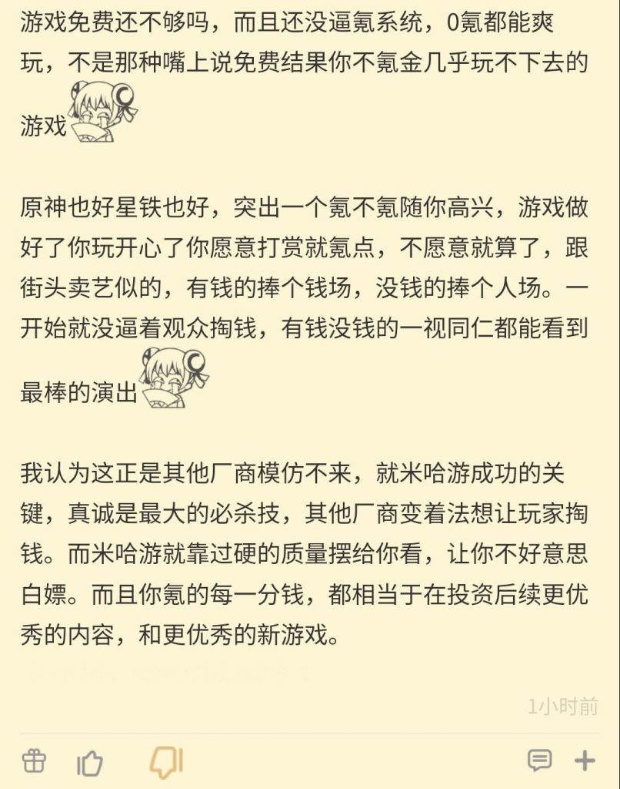

### [不吐不快]话说学会关注手游流水也是从原神开始的

Made by ngapost2md (c) ludoux [GitHub Repo](https://github.com/ludoux/ngapost2md)

----

##### 0.[5] \<pid:0\> 2023-07-20 12:04:12 by 岩间琉璃，云间月
以前玩王者、闪暖啥的，大家忙着喷队友，看皮肤，骂策划，几乎没什么人会提这游戏流水怎么样，所以以前都对手游流水没啥概念
直到我玩了原神，一个个精神股东天天搁那吹流水“哇米哈游太强了流水好高”，让我以为原神是王者那个级别的。
后来我好奇去b站搜一下手游流水，然后…王者的那个条条和原神的那个条条差距让我噗的一下笑出声
底下评论区一个玩王者的嘲米孝子天天吹流水，然后有人回复他“原神pc端blablabla……二游不同赛道blablabla……”

----

##### 1.[0] \<pid:703731599\> 2023-07-20 12:05:47 by 卯农迟辛蒙甘
别急，马上就会有学长告诉你是从粥开始扯流水的
~~他们是不是不知道扯流水都是舰圈玩剩下的~~

----

##### 2.[0] \<pid:703731722\> 2023-07-20 12:06:20 by 休戰的天空
以前看流水是怕乙烷游戏它突然死了 现在看流水是盼蒸蒸日上的游戏赶紧死

----

##### 3.[0] \<pid:703731750\> 2023-07-20 12:06:27 by 他一直都是对的
我玩农时也关注啊，当时天天盼农似 被鸡摁着打时我天天开香槟  
原做得到吗 做不到 只能搞出那种傻子才信的pc黑箱

----

##### 4.[0] \<pid:703731762\> 2023-07-20 12:06:32 by Wincyl_
我第一次关注手游流水是先帝~~阴阳师~~

----

##### 5.[0] \<pid:703731951\> 2023-07-20 12:07:21 by 田优宇
其实最早是舰娘开始
然后舟稍微带了下，原降临后正式普及民众

----

##### 6.[0] \<pid:703732067\> 2023-07-20 12:07:54 by 今锁朱楼
没关注过具体流水，但第一次听到 某二游流水高 是bgo。
没错就是我们bgo把B站送上市的故事。

----

##### 7.[0] \<pid:703732129\> 2023-07-20 12:08:10 by 17岁的八云紫
你看看二观最早那时候啥游戏开服不就知道了()

----

##### 8.[1] \<pid:703733036\> 2023-07-20 12:12:19 by q794623
我关注流水是舟开始。。

也不算关注，主要开服那几个月，登顶就送10连券，这你不关注也知道是什么原因。后面滑下来了。。反正登不了，不会送，关注个锤子。

谁没事跟孝子贤孙一样盯这玩意

----

##### 9.[0] \<pid:703733600\> 2023-07-20 12:14:47 by 好几块哈哈
我只知道，别的游戏流水高：“整天搁这骗钱割韭菜。”，米哈游流水高：“只有米哈游才会把我们氪金的钱反馈给我们！”

----

##### 10.[0] \<pid:703733758\> 2023-07-20 12:15:31 by JSYB
>[jump](#pid703732129) 17岁的八云紫(2023-07-20 12:08)说:
>你看看二观最早那时候啥游戏开服不就知道了()[s:ac:羡慕]

二观应该是吹某游日服登顶开的吧，太久远记不太清了

----

##### 11.[0] \<pid:703734180\> 2023-07-20 12:17:26 by 苏心洲
虽然拐舟有点奶嘴嫌疑
但是这个二游流水论我印象里还真是舟开始逐渐火起来的
到了原开始发扬光大走向大众视野

----

##### 12.[0] \<pid:703734208\> 2023-07-20 12:17:35 by Succrraiden
别，我来当个mxz先。
不是舟吗，把二游yys踢下去了，流水第一。

----

##### 13.[0] \<pid:703734877\> 2023-07-20 12:20:51 by muziqiduan
>[jump](#pid703733758) JSYB(2023-07-20 12:15) 说: 
>
>二观应该是吹某游日服登顶开的吧，太久远记不太清了

最早海外流水有良好成绩的印象里是羽中和少前在韩国市场，那时候韩国算现象级手游，每月的流水比国内高，少前日服因为二游圈子那几家公司恩怨情仇的事情记得是好久之后才开的，那时候大碧蓝印象里已经开了日服了。

----

##### 14.[0] \<pid:703735515\> 2023-07-20 12:23:54 by kouuu663
我记得二观刚开始是做舰B海外流水起家的，当时舰B应该算是国产二次元手游出海最成功的的了，大家看舰B在日本赚外汇也都是看个乐呵，我记得当时舰B吧还有个蓝鸟搬运贴，虽然我不玩但是还是看的挺有意思的

只不过不知道为什么后来变成比谁割国内韭菜割的多了

----

##### 15.[0] \<pid:703736016\> 2023-07-20 12:26:26 by scoutqq
>[jump](#pid703733600) 好几块哈哈(2023-07-20 12:14)说:
>我只知道，以前看手综和瓜版的时候，别的游戏流水高：“整天搁这骗钱割韭菜。”，米哈游流水高：“只有米哈游才会把我们氪金的钱反馈给我们！”，花钱还要跪着玩，米哈游独一份。

错误的,米流水高了他们就会装作好像真有个虚空bw在迫害他们一样阴阳两句粥

----

##### 16.[0] \<pid:703737081\> 2023-07-20 12:31:28 by pirsdsop
>[jump](#pid703735515) kouuu663(2023-07-20 12:23) 说: 
>
>我记得二观刚开始是做舰B海外流水起家的，当时舰B应该算是国产二次元手游出海最成功的的了，大家看舰B在日本赚外汇也都是看个乐呵，我记得当时舰B吧还有个蓝鸟搬运贴，虽然我不玩但是还是看的挺有意思的
>
>只不过不知道为什么后来变成比谁割国内韭菜割的多了

是当年舰n和舰b大战 海外流水也是大战的一方面罢了
二观不是什么没有目的的人 现在也是如此

----

##### 17.[1] \<pid:703737162\> 2023-07-20 12:31:52 by shidao6376
我玩手游比较晚，YYS那会就有人关注流水了，粥那会登顶发十连，玩家关注的更多了。
这个锅扣不到原身上

不过吃官粮的二创我还是第一次见到，估计全网都找不出第四个游戏能有官方养着UP出商店二创(什么？你问另外两个是谁)

----

##### 18.[0] \<pid:703737346\> 2023-07-20 12:32:45 by ou2021
还真是当年的舟卫兵(19年)“发扬光大”的
(我签名最后一句话的来历)
~~这种人一起埋了好~~

----

##### 19.[0] \<pid:703739611\> 2023-07-20 12:44:00 by 岩间琉璃，云间月
>[jump](#pid703734180) 苏心洲(2023-07-20 12:17) 说: 
>
>虽然拐舟有点奶嘴嫌疑
>但是这个二游流水论我印象里还真是舟开始逐渐火起来的
>到了原开始发扬光大走向大众视野

这我就不知道了，没玩过舟，甚至我对舟的了解全都是因为它们天天拐舟。
只是以前从来没见过这么多精神股东的大场面，仿佛是丫鬟在吹自己把主子伺候的很舒服

----

##### 20.[0] \<pid:703740952\> 2023-07-20 12:51:06 by 冰镇雨滴
可能是当初舟登顶能拿十连，所以很多人才开始关注流水的吧

----

##### 21.[0] \<pid:703742030\> 2023-07-20 12:56:42 by xiehuaijiu76
>[jump](#pid703739611) 岩间琉璃，云间月(2023-07-20 12:44):

你可以把以前的粥看成现在的原，不仅官方屁股歪(龙门是独立城市，龙门对应港；历史虚无乌冬面)连玩家都魔怔的很。不过好在粥官方扣门的很，从不出钱买二创，那时候b站只有粥小将乱刷弹幕，没有各种粥相关视频糊脸。

现在的官方老实多了，不敢搞这些小动作。玩家的魔怔程度也少了很多，结晶粉已经没有多少了，除了偶尔可见的海猫粉(类似大伟粉)，公司粉基本死绝了。
但是它们以前惹过的游戏群体可不少，有不少相关受害者还记着仇呢(比如碧蓝航线玩家)。知道瓜版吗，以前就是他们家控制的，后面和崩坏三打架打输了，就失守了。
至于为什么爱嘬这家奶嘴，因为大概这是米学长们唯一赢过的对家，其他的奶嘴农撸塞不敢嘬。

----

##### 22.[0] \<pid:703742266\> 2023-07-20 12:57:52 by 先R再R最后R
没接触过早期粥，如果粥登顶发抽，那米还真是罪大恶极把人拉下来自己还死抠，这下大家都没得蹭了()

----

##### 23.[0] \<pid:703742748\> 2023-07-20 13:00:34 by 不再嘴硬
呃在我认知里，流水这玩意被近乎全民关注，一堆人拿着这玩意大赢特赢的架势确实是从粥开始的，再早期关注度没这么高
说个听起来像各打五十大板的暴论吧，某些人拐粥的内容本身还真没问题，问题在他们笑话别人之前不看看自己屁股上沾了多少屎

----

##### 24.[0] \<pid:703746491\> 2023-07-20 13:21:19 by 噢你可惜呀
粥关注流水是因为那时候真的会发十连。

----

##### 25.[1] \<pid:703747612\> 2023-07-20 13:27:26 by 无料通贩商
>[jump](#pid703742030) xiehuaijiu76(2023-07-20 12:56) 说: 
>
>你可以把以前的粥看成现在的原，不仅官方屁股歪(龙门是独立城市，龙门对应港；历史虚无乌冬面)连玩家都魔怔的很。不过好在粥官方扣门的很，从不出钱买二创，那时候b站只有粥小将乱刷弹幕，没有各种粥相关视频糊脸。
>
>现在的官方老实多了，不敢搞这些小动作。玩家的魔怔程度也少了很多，结晶粉已经没有多少了，除了偶尔可见的海猫粉(类似大伟粉)，公司粉基本死绝了。
>但是它们以前惹过的游戏群体可不少，有不少相关受害者还记着仇呢(比如碧蓝航线玩家)。知道瓜版吗，以前就是他们家控制的，后面和崩坏三打架打输了，就失守了。
>

瓜版一开始就是为了吃战双的瓜成立的，还是因为版主自己挑事成立的，战双的对家是谁需要我说吗岁月史书到理查来了真的是不要脸皮啊

----

##### 26.[0] \<pid:703747904\> 2023-07-20 13:29:00 by AGDer
>[jump](#pid703742030) xiehuaijiu76(2023-07-20 12:56)说:
><b>Reply to [pid=703739611,37067997,1]Reply[/pid] Post by [uid=65060151]岩间琉璃，云间月[/uid] (2023-07-20 12:44)</b>你可以把以前的粥看成现在的原，不仅官方屁股歪(龙门是独立城市，龙门对应港；历史虚无乌冬面)连玩家都魔怔的很。不过好在粥官方扣门的很，从不出钱买二创，那时候b站只有粥小将乱刷弹幕，没有各种粥相关视频糊脸。  现在的官方老实多了，不敢搞这些小动作。玩家的魔怔程度也少了很多，结晶粉已经没有多少了，除了偶尔可见的海猫粉(类似大伟粉)，公司粉基本死绝了。 但是它们以前惹过的游戏群体可不少，有不少相关受害者还记着仇呢(比如碧蓝航线玩家)。知道瓜版吗，以前就是他们家控制的，后面和崩坏三打架打输了，就失守了。 至于为什么爱嘬这家奶嘴，因为大概这是米学长们唯一赢过的对家，其他的奶嘴农撸塞不敢嘬。

乌冬面都还能翻出来，可把人逗乐咯
这下玩原神玩的了，历史虚无还得看

----

##### 27.[0] \<pid:703748801\> 2023-07-20 13:33:48 by 暗之铃音
>[jump](#pid703742030) xiehuaijiu76(2023-07-20 12:56) 说: 
>
>你可以把以前的粥看成现在的原，不仅官方屁股歪(龙门是独立城市，龙门对应港；历史虚无乌冬面)连玩家都魔怔的很。不过好在粥官方扣门的很，从不出钱买二创，那时候b站只有粥小将乱刷弹幕，没有各种粥相关视频糊脸。
>
>现在的官方老实多了，不敢搞这些小动作。玩家的魔怔程度也少了很多，结晶粉已经没有多少了，除了偶尔可见的海猫粉(类似大伟粉)，公司粉基本死绝了。
>但是它们以前惹过的游戏群体可不少，有不少相关受害者还记着仇呢(比如碧蓝航线玩家)。知道瓜版吗，以前就是他们家控制的，后面和崩坏三打架打输了，就失守了。
>

其实现在两边还在打吧，不过基本不怎么出现在明面，所以爱打就打去吧，利刃一个多索雷斯杀的差不多了，现在环境比以前好不少

----

##### 28.[0] \<pid:703749555\> 2023-07-20 13:38:04 by Sue_91
还在粥呢，这楼说流水讨论谁带起来的没问题，怎么后面还有话说现在动不动拐粥合理的，且不说利刃都死得差不多了，天天拿过去时的zwb来给自己现在作妖找补，何尝不是一种哭坟
更不要说好多拐杖还是自导自演，翻开临时找的粥皮底下是条蠕动的藓蛆。而且有一说一，当年的zwb确实逆天，但我也没听说过他们开盒成瘾收钱拜鬼还有沾毒嫌疑。

----

##### 29.[0] \<pid:703750093\> 2023-07-20 13:40:51 by 冲天槊的尖头
粥关注流水是因为那阵子登顶有十连，原我就不知道了

----

##### 30.[0] \<pid:703750430\> 2023-07-20 13:42:31 by 海崎新太9139

昨天看到的典

----

##### 31.[3] \<pid:703750668\> 2023-07-20 13:43:49 by 冲天槊的尖头
>[jump](#pid703742030) xiehuaijiu76(2023-07-20 12:56) 说: 
>
>你可以把以前的粥看成现在的原，不仅官方屁股歪(龙门是独立城市，龙门对应港；历史虚无乌冬面)连玩家都魔怔的很。不过好在粥官方扣门的很，从不出钱买二创，那时候b站只有粥小将乱刷弹幕，没有各种粥相关视频糊脸。
>
>现在的官方老实多了，不敢搞这些小动作。玩家的魔怔程度也少了很多，结晶粉已经没有多少了，除了偶尔可见的海猫粉(类似大伟粉)，公司粉基本死绝了。
>但是它们以前惹过的游戏群体可不少，有不少相关受害者还记着仇呢(比如碧蓝航线玩家)。知道瓜版吗，以前就是他们家控制的，后面和崩坏三打架打输了，就失守了。
>

瓜版不是嘲讽战双开的吗？岁月史书用的6啊，你是真当大静谧以后nga里没有老明日方舟玩家了？

----

##### 32.[0] \<pid:703751199\> 2023-07-20 13:46:38 by akanatsu
鹅厂游戏利润率30多，mhy利润60，资本家的贪婪水平亦有高下

----

##### 33.[2] \<pid:703751282\> 2023-07-20 13:47:04 by 冲天槊的尖头
>[jump](#pid703749555) Sue_91(2023-07-20 13:38) 说: 
>
>还在粥呢，这楼说流水讨论谁带起来的没问题，怎么后面还有话说现在动不动拐粥合理的，且不说利刃都死得差不多了，天天拿过去时的zwb来给自己现在作妖找补，何尝不是一种哭坟
>更不要说好多拐杖还是自导自演，翻开临时找的粥皮底下是条蠕动的藓蛆。而且有一说一，当年的zwb确实逆天，但我也没听说过他们开盒成瘾收钱拜鬼还有沾毒嫌疑。

典中典之虽然我开盒网暴磕仙丹，但是都怪粥，这楼上的味已经快溢出来了

----

##### 34.[0] \<pid:703751369\> 2023-07-20 13:47:28 by JSYB
>[jump](#pid703747612) 无料通贩商(2023-07-20 13:27)说:
>[quote][pid=703742030,37067997,2]Reply[/pid] <b>Post by [uid=64937083]xiehuaijiu76[/uid] (2023-07-20 12:56):</b>  你可以把以前的粥看成现在的原，不仅官方屁股歪(龙门是独立城市，龙门对应港；历史虚无乌冬面)连玩家都魔怔的很。不过好在粥官方扣门的很，从不出钱买二创，那时候b站只有粥小将乱刷弹幕，没有各种粥相关视频糊脸。  现在的官方老实多了，不敢搞这些小动作。玩家的魔怔程度也少了很多，结晶粉已经没有多少了，除了偶尔可见的海猫粉(类似大伟粉)，公司粉基本死绝了。 但是它们以前惹过的游戏群体可不少，有不少相关受害者还记着仇呢(比如碧蓝航线玩家)。知道瓜版吗，以前就是他们家控制的，后面和崩坏三打架打输了，就失守了。 [/quote]瓜版一开始就是为了吃战双的瓜成立的，还是因为版主自己挑事成立的，战双的对家是谁需要我说吗[s:ac:咦]岁月史书到理查来了真的是不要脸皮啊   还有乌冬面的结果是东国先一步打进乌萨斯，乌冬面原本就是个小丑理论了，结果补丁打上去后连逻辑都说不通了[s:ac:擦汗] 龙门独立原话是龙门是一座独立的移动城邦，剧情里不管内测公测都属于炎，结果直接把这段话浓缩成龙门独立念了四年，没活硬整[s:ac:衰]   最后有关碧蓝，姐姐这个话术还是泥潭的碧蓝版块传出来卖惨的，因为词太脏就甩得一干二净。还有当初悠星给日本某捐款用的三笠船名号，不久后方舟就突然就多了三笠干员，你有头绪吗？

这个，作为一个舟测试期的老考据人，得解释下，之前设定里龙门确实是属于炎，但也确实是独立城市。但这个和什么zz倾向没啥关系
早期设定里，天灾比现在更频繁，导致移动城市之间交流被频繁的天灾隔断，所以泰拉所有国家的移动城市都是相互独立的，只有经常交流或者同源的移动城市会形成相对松散的国家概念(类似古希腊的城邦制)，然后城市间通讯主要靠天灾信使带话等等。
所以那时候龙门是属于炎这个松散联盟的独立城邦，切城是属于乌萨斯这个聚落的独立城邦，然后这俩航道又离得近，偶尔互相交流结果哪知道后来又出了hk事件，估计为了避嫌，改成了现在这样

ps:这样改也造成了一些问题
你看现在游戏里天灾信使地位比较高，实际上是因为原设里确实更重要(城市间交流必备)但以现在这个频率和烈度的天灾是不太对的，所以为了圆设定，加了预测天灾的补丁，算是勉强圆回来了

----

##### 35.[0] \<pid:703754144\> 2023-07-20 14:01:57 by bishoujo！！！
反正我是从舟开始知道还有流水榜的，那时候只看ios登顶吧，所以还有人呼吁去ios氪金的。
赫拉格好像是最后一次登顶，后面每次开池子都会发现有个叫王者荣耀的家伙在那里，敏那直呼不可战胜。
二观我也是因为群里有人截图发乐子才知道的，那时候天天盼着粥和双去世来着，现在已经完全不看了，反正二游流水就是米一家独大了。

----

##### 36.[0] \<pid:703754565\> 2023-07-20 14:04:12 by 骄纵fgo
>[jump](#pid703742030) xiehuaijiu76(2023-07-20 12:56) 说: 
>
>你可以把以前的粥看成现在的原，不仅官方屁股歪(龙门是独立城市，龙门对应港；历史虚无乌冬面)连玩家都魔怔的很。不过好在粥官方扣门的很，从不出钱买二创，那时候b站只有粥小将乱刷弹幕，没有各种粥相关视频糊脸。
>
>现在的官方老实多了，不敢搞这些小动作。玩家的魔怔程度也少了很多，结晶粉已经没有多少了，除了偶尔可见的海猫粉(类似大伟粉)，公司粉基本死绝了。
>但是它们以前惹过的游戏群体可不少，有不少相关受害者还记着仇呢(比如碧蓝航线玩家)。知道瓜版吗，以前就是他们家控制的，后面和崩坏三打架打输了，就失守了。
>

粥都没玩过岁月史书有一套的，粥人看流水等着发十连，原看流水甜甜花酿鸡喂不饱的狼赢又赢？乌冬面和红船帖子现在还在舟版挂城墙，敢去看看高赞是什么成分吗

----

##### 37.[0] \<pid:703754601\> 2023-07-20 14:04:23 by aswaw111
其实王者还是有一次关注流水的，关菲菲锚点皮那段时期，大伙都可关注流水啦~~毕竟流水烂完了也不会影响大伙打游戏，但确实会影响关菲菲年终奖~~

----

##### 38.[0] \<pid:703758911\> 2023-07-20 14:26:34 by 火郭 Electronica
>[jump](#pid703731599) 卯农迟辛蒙甘(2023-07-20 12:05) 说: 
>
>别急，马上就会有学长告诉你是从粥开始扯流水的
>~~他们是不是不知道扯流水都是舰圈玩剩下的~~

舰圈大战最激烈那时候跟明日方舟开服还隔了好几年呢，玩家都换好几茬了
就想现在讨论现代智能手机一般不会把iPhone以前的也包含进来一样

