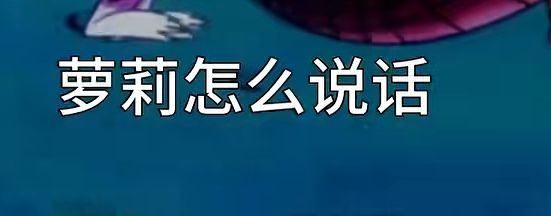

### [不吐不快]看到个观点很有意思

Made by ngapost2md (c) ludoux [GitHub Repo](https://github.com/ludoux/ngapost2md)

----

##### 0.[0] \<pid:0\> 2023-07-20 12:18:07 by Alkett
在b站上随手一刷看见个讲葫芦娃的 但是感觉他评价二游文案的观点有点道理

----

##### 1.[4] \<pid:703734419\> 2023-07-20 12:18:37 by Alkett

----

##### 2.[0] \<pid:703734534\> 2023-07-20 12:19:10 by Alkett

----

##### 3.[0] \<pid:703734661\> 2023-07-20 12:19:53 by Alkett

----

##### 4.[4] \<pid:703735041\> 2023-07-20 12:21:36 by 今锁朱楼
这适用于所有文学作品，网络小说看多了就会发现同一个写烂了的梗有人就是能写出花来，有人就写的食之无味，弃之可惜。
网文界有句名言就是 看文没有雷点，唯一的雷点是文笔不好。

----

##### 5.[0] \<pid:703735240\> 2023-07-20 12:22:39 by q794623
大纲设定意义真的有限，甚至可能没有意义。

就须弥，足迹说什么？你什么往事书。
游戏实际体验什么？往事俱已成空.jpg

----

##### 6.[0] \<pid:703735315\> 2023-07-20 12:22:56 by Nimbus純水100
谁有本事只去做二游的剧本啊
二游只要求三观正确逻辑通顺措辞浅显易懂
不过goushit粘哪一个啊

----

##### 7.[0] \<pid:703735480\> 2023-07-20 12:23:44 by 迷你靓仔
总结:菜

----

##### 8.[0] \<pid:703735620\> 2023-07-20 12:24:27 by scoutqq
>[jump](#pid703735041) 今锁朱楼(2023-07-20 12:21)说:
>这适用于所有文学作品，网络小说看多了就会发现同一个写烂了的梗有人就是能写出花来，有人就写的食之无味，弃之可惜。 网文界有句名言就是 看文没有雷点，唯一的雷点是文笔不好。

雷点是日轻式对白设计这个算文笔还是啥?

----

##### 9.[0] \<pid:703735782\> 2023-07-20 12:25:17 by 科技钻头
是这样的，会写故事的人都去写网文了，不受约束还更赚钱。影视剧行业也有同样的问题。

----

##### 10.[0] \<pid:703735852\> 2023-07-20 12:25:39 by Kon8888
是这样大纲很好打，但是真的上手了才会知道最难的永远是细化。
大纲只是骨架，其他的细节表现才是血肉，从对人物的理解到场景的选取再到叙事节奏的安排，这些都是需要花大时间大力气才能磨出来的，也是最见作者水平的

----

##### 11.[0] \<pid:703735904\> 2023-07-20 12:25:55 by 阳光彩虹小尼马
所以这也是为何如今几乎所有游戏都爱用碎片谜语人叙事，能掩盖很多缺点，还会有卫兵奉为圭臬。这点单机圈也深受其粉丝的迫害

----

##### 12.[0] \<pid:703736725\> 2023-07-20 12:29:50 by 喵西斯
别的不说，我看文看剧就一个要求，就是人物。
人物形象丰满，不要模板化标签化，人应该是复杂多样的。
人物的行为应该是符合逻辑的，能体现个性的，而不是推动故事向前发展的工具。
文字工作者写人物，得让读者感觉他们活着，活在另一个世界。而不是作者手里的提线木偶。
说白了，我们对艺术的最高要求就是要能打动人，以人的情感换人的情感。ai图看多了会腻就是差不多这个道理。

----

##### 13.[0] \<pid:703736998\> 2023-07-20 12:31:05 by Alkett
才发现，图片顺序有点乱，算了，反正也不影响理解，懒得改了。 不过我自己编故事自嗨时就感觉大纲好编，但是具体故事情节难写

----

##### 14.[1] \<pid:703737533\> 2023-07-20 12:33:44 by 冬马乔太郎
有人写三角恋就能写出批判空间前十的白色相簿2，有人就只能写成烂俗剧，说白了还是水平不够。

那话又说回来了，水平不够就别塞你那勾巴私货了，好好服务受众不行吗？天天输出你那价值观，被骂了还觉得委屈，贱的。

----

##### 15.[0] \<pid:703737743\> 2023-07-20 12:34:49 by sbsx123
一般二游和原神的大部分剧情都是这样没错，但不要把散兵剧情混为一谈

----

##### 16.[0] \<pid:703738634\> 2023-07-20 12:39:11 by muziqiduan
问题是原连还行的大纲都吃了。
能写出最初那版大纲和足迹，至少知道自己要啥，给点时间打磨打磨还有的看。现在这帮子玩意真就一拍大腿加设定，然后再一拍脑袋写情节，然后圆不上就再一拍大腿，突出的就是一个梦游。

----

##### 17.[0] \<pid:703739123\> 2023-07-20 12:41:35 by 要一杯杨枝甘露
写不出来优秀的没关系
写出来平平无奇的也正常
米家是独创一坨散兵写法

----

##### 18.[0] \<pid:703739183\> 2023-07-20 12:41:56 by Der_Steppen_Cyrano
>[jump](#pid703737533) 冬马乔太郎(2023-07-20 12:33) 说: 
>
>有人写三角恋就能写出批判空间前十的白色相簿2，有人就只能写成烂俗剧，说白了还是水平不够。
>
>
>那话又说回来了，水平不够就别塞你那勾巴私货了，好好服务受众不行吗？天天输出你那价值观，被骂了还觉得委屈，贱的。

前十？第一！在兰十出来之前当了七年第一，现在也是万年老二

----

##### 19.[0] \<pid:703740705\> 2023-07-20 12:49:41 by Seeyoupelos
你游招的文案就这样的，要求就是有看过一些番，会写字。剧本创作的艺术性？可不敢碰瓷。

----

##### 20.[1] \<pid:703741030\> 2023-07-20 12:51:32 by 怎样才能不被禁言1
碎片化叙事不是没能力写出完整优秀故事的卑劣技巧，这是以前看到的对老头环的评价。法环的世界观足够庞大，人物动机合理，行为逻辑可信，而逻辑在和现实世界不同的奇幻世界的世界观下更重要。
一个完整的故事即使老套，只要足够庞大，那么将其打碎之后的乐趣就会指数级上升。原神的文案根本没有对宏大故事的把控能力，一切只服务于卖卡，怎么会不让玩家出脑

----

##### 21.[0] \<pid:703742573\> 2023-07-20 12:59:37 by 海崎新太9139
原崩剧情的问题除了为了扩大受众和求稳导致的大量高举轻放以外，一个是为了搭配卡池档期硬扭剧情和角色高光桥段，另一个是为了降低成本搞的站桩3d模型木偶戏和大量npc模型复用导致的恶劣观感又给本就不乐观的剧本雪上加霜，这已经不是写剧情的人靠自身水平能解决的问题了。
所以有些时候看到手综版嗯吹3d模型剧情演出就觉得好笑，立绘+文字+cg图这种低成本模式被研究出来利用至今是有其道理的，地球上还没有能按手游的更新周期和商业模式产出高质量3d剧情演出的公司，全3d+把剧情演出放在地图中对生产速度和剧情规模的限制在原神里就展示的淋漓尽致了，都笑4字立绘对碰，可4字只有文本和图片限制下的自由创作空间让他可以每个版本写一个完整的有起承转合的章节，而原有3d有地图有配音的剧情连每个版本正常塑造一个完整角色的余裕都没有，更别论剧情的质量和完整性了……为什么原崩没动画没配音的小任务观感好很多？因为文案在这种部分里创作自由大的多。
现在崩铁没有能到处爬能各种犄角旮旯塞宝箱神瞳充数解谜的大世界作为遮羞布，已经把这种剧情演出模式的问题暴露的淋漓尽致了，快进到下个版本学原加入大量轱辘话和手点无意义选项环节，多做点站桩演出多掏点配音钱嘛

----

##### 22.[0] \<pid:703743413\> 2023-07-20 13:04:10 by ThedesAlizes
原视频是什么想看看

----

##### 23.[0] \<pid:703744117\> 2023-07-20 13:08:02 by 先R再R最后R
以前看动漫就思考过这个问题，到底什么是好看
其实就是表现力，好故事写烂的有之，烂故事写活的有之，我十几年前头一次看jojo漫画直接通宵，难道是剧情新颖吗？明显不是，甚至很老套，但他写的好，比如节奏好，表现力强，吸引读者，那它就是好作品
对于游戏剧情也是一样，指望写个不烂的宝宝巴士、平稳落地、合家欢就行，结果emmm

----

##### 24.[0] \<pid:703748805\> 2023-07-20 13:33:49 by 逐日绝影
>[jump](#pid703739183) Der_Steppen_Cyrano(2023-07-20 12:41) 说: 
>
>前十？第一！在兰十出来之前当了七年第一，现在也是万年老二

犹记得刚上大学时在没推过ic，cc的情况下跑去b站云冬马te时生理性的胃疼……

----

##### 25.[0] \<pid:703751050\> 2023-07-20 13:45:46 by Aikili
网络小说看多了都懂吧，经常淘文的，应该也遇到过那种文案简介很有意思，正文无聊到看不下去的文
以及某个梗泛滥爆火大家就很快又开始抱怨梗不好之类的，归根究底就是每个作者水平不一，厉害的作者一个常见梗都能写的很有意思，而有的作者有趣少见的梗都能写到看不下去
没有不好看的梗和套路，只有写不好的作者
当然啦，大半作者是不会承认自己写不好的，只会怪读者怪大众怪审查怪老板怪坏境

----

##### 26.[0] \<pid:703752326\> 2023-07-20 13:52:16 by 冲天槊的尖头
感觉，，，，，不如刺猬猫小说

----

##### 27.[0] \<pid:703752746\> 2023-07-20 13:54:31 by 厄咒
原神的剧情大多是根据角色设定的那些东西来进行剧情填充的，有的剧情文案功力高就能填充一些看起来不错的剧情，()要是想正常写不是不行，但因为一些众所周知的原因，()现在人设骨头都是ec的，填充物也就好不到哪去

----

##### 28.[0] \<pid:703754417\> 2023-07-20 14:03:23 by cccherch
感觉某个二游更严重的是喜欢写过家家来教导玩家人生哲理，比起浮于表面的人物塑造，企图规训玩家还不让跳过才是真正恶心大伙的最重要原因。

----

##### 29.[0] \<pid:703772554\> 2023-07-20 15:30:49 by 星际兄贵
>[jump](#pid703735852) Kon8888(2023-07-20 12:25):

太对了，我日常卡文的原因就是不知道怎么合情合理地细化(否则很容易像米家编剧一样爆典，这样我宁可继续卡文)
另外我也很反感宫崎英高式的碎片化叙事，讲不明白的故事还算故事吗

----

##### 30.[0] \<pid:703773663\> 2023-07-20 15:35:43 by 泛舟浮白
论主笔笔力的重要性

----

##### 31.[0] \<pid:703775648\> 2023-07-20 15:44:01 by 五柳情州
一些设定比如末世/异世界是n年前/n年后的地球，天地是反过来的，网游修真后宫无限流balabala
敢拿笔或者有兴趣写东西的人可不少，除了特别创新的设定或者梗外，简单的概括情节可能都是那么几个
光毛融的和布袋戏写的是一回事吗，须弥几大学院本可以是低配的哈利波特，但米哈游的文案写的钱都是些陈芝麻烂谷子的屁事，毫无奇幻色彩

