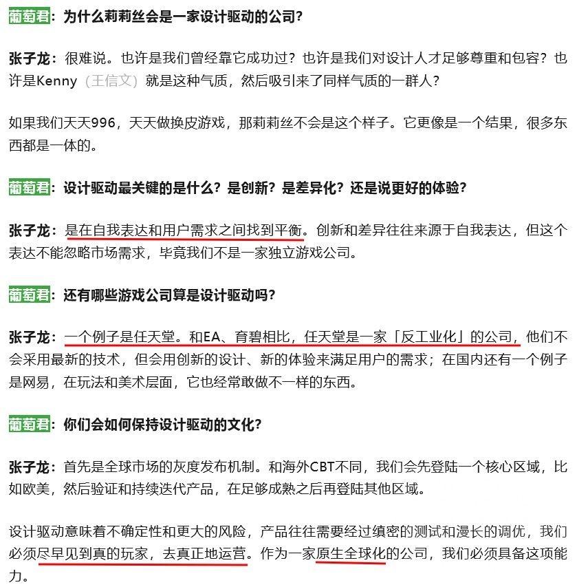
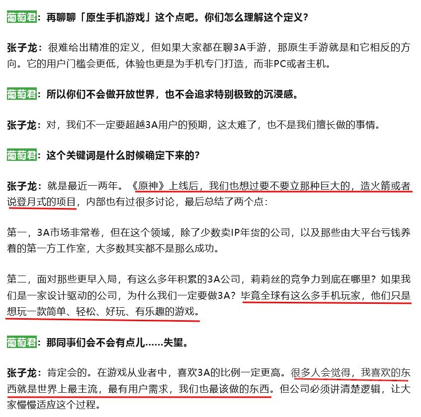
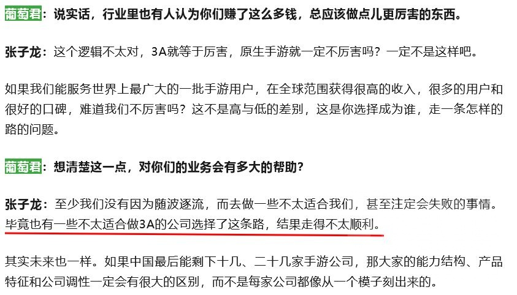
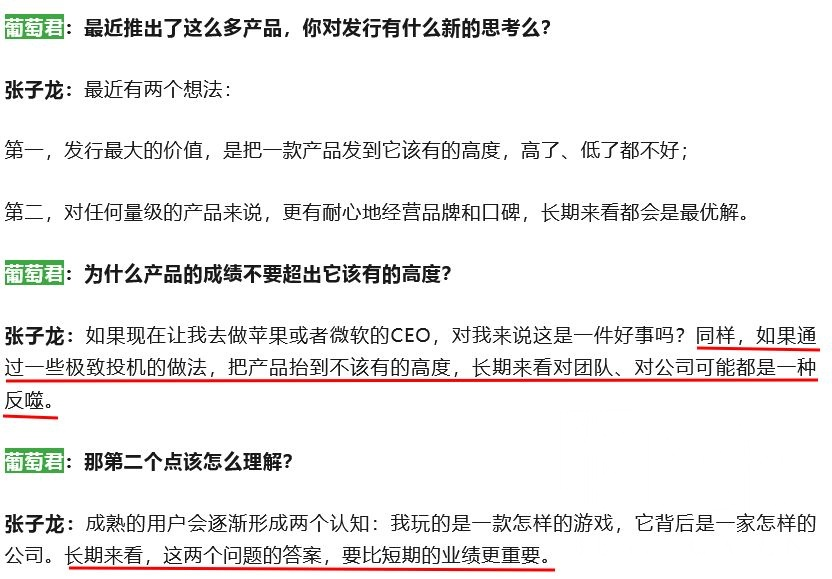

### [不吐不快] 翻到一篇不同赛道的同行访谈，关于开放世界和过度宣发这两段很有意思

Made by ngapost2md (c) ludoux [GitHub Repo](https://github.com/ludoux/ngapost2md)

----

##### 0.[3] \<pid:0\> 2023-07-20 17:30:01 by setsuna2023
出处：莉莉丝10周年专访 [url](https://mp.weixin.qq.com/s/44xT0chcgr97l-8Vnr-_vA)
首先叠甲：一切类似访谈文章都摆脱不了厂商软文和自我美化的可能性，请保持质疑质疑再质疑的态度找乐子
觉得有几段很乐，截出来给大伙儿看看，和心里对mhy的一些想法对照一下，反正15天后冲水
莉莉丝一年营收不过70多亿，又不卖电子偶像饭圈，绝对打压不了273亿的米哈游的，各位结晶放心

----

##### 1.[0] \<pid:703799784\> 2023-07-20 17:34:32 by setsuna2023
好像过审了，为免麻烦就不在主楼编辑了，额外补充一句访谈发布日期是5月10日，正是铁开服半个月声势浩大如日中天仿佛新皇登基，而且原颓势不显的时候

----

##### 2.[0] \<pid:703800245\> 2023-07-20 17:36:49 by 阳光彩虹小尼马
唉，我觉得没必要。游戏还要看好不好玩。刘伟还洒泪呢

----

##### 3.[0] \<pid:703800594\> 2023-07-20 17:38:26 by junjew

mhy确实有浮躁的感觉甚至到了让人忍不住猜测是不是内部管理崩了的程度

----

##### 4.[0] \<pid:703800820\> 2023-07-20 17:39:30 by Aritaaa
这两句话你不标红一下我不是很认可

----

##### 5.[0] \<pid:703800823\> 2023-07-20 17:39:31 by ochaaki
仅这段内容来说还是很不错的观点，不过不了解莉莉丝，真实态度就不妄评了

----

##### 6.[0] \<pid:703800929\> 2023-07-20 17:40:06 by 设备锁谁还没关
有意思，莉莉丝是做什么游戏的没怎么听说过这个公司的游戏啊但是看这个访谈的态度，这人看的倒是很明白

----

##### 7.[0] \<pid:703800954\> 2023-07-20 17:40:16 by setsuna2023
>[jump](#pid703800245) 阳光彩虹小尼马(2023-07-20 17:36)说:
>唉，我觉得没必要。游戏还要看好不好玩。刘伟还洒泪呢

那我再解释一下我发这个显然不是为了给公司做人格化卖人设
原和铁要是真的在手机上好玩，我发这个东西不就是讨打吗？

----

##### 8.[0] \<pid:703801206\> 2023-07-20 17:41:25 by ai助手
>[jump](#pid703800929) 设备锁谁还没关(2023-07-20 17:40)说:
>有意思，莉莉丝是做什么游戏的[s:ac:哭笑]没怎么听说过这个公司的游戏啊[s:ac:哭笑]但是看这个访谈的态度，这人看的倒是很明白[s:ac:哭笑]

剑与远征，艾比，迷失岛2，
最出名的应该是刀塔传奇

----

##### 9.[0] \<pid:703801230\> 2023-07-20 17:41:33 by q794623
游戏的本质是娱乐产品，给客人娱乐来换取报酬。。。

现在米哈游是觉得，，，先娱乐自己，反正有X子掏钱

----

##### 10.[0] \<pid:703804078\> 2023-07-20 17:56:05 by 何可守
莉莉丝是那个比较明确地说就是为了钱的二游公司吗

----

##### 11.[0] \<pid:703804988\> 2023-07-20 18:00:31 by ggt12
>[jump](#pid703800823) ochaaki(2023-07-20 17:39)说:
>[s:ac:闪光]仅这段内容来说还是很不错的观点，不过不了解莉莉丝，真实态度就不妄评了

是不是真实想法不知道，不过莉莉丝这公司一直在避免当出头鸟这点是真的，比如剑与远征这游戏本来可以做的更高调一些的，但是他们没有。

----

##### 12.[0] \<pid:703805754\> 2023-07-20 18:03:21 by 老虎二世
虽然只出现了一次“原”，但是句句都有阿米的影子

----

##### 13.[0] \<pid:703806073\> 2023-07-20 18:04:38 by 老虎二世
>[jump](#pid703804078) 何可守(2023-07-20 17:56) 说: 
>
>莉莉丝是那个比较明确地说就是为了钱的二游公司吗

莉莉丝严格来说不是二游公司

----

##### 14.[0] \<pid:703836305\> 2023-07-20 20:52:46 by 芙洛斯特的残影
莉莉丝最出名的就是当年的刀塔传奇吧
虽然后来狗ch运营烂了

----

##### 15.[0] \<pid:703841169\> 2023-07-20 21:18:03 by muziqiduan
通篇看下来，总结一句话就是做事心里有数，知道什么钱自己能恰的到。
挺好的。

----

##### 16.[0] \<pid:703872517\> 2023-07-21 00:58:42 by radiAnce1
>[jump](#pid703800929) 设备锁谁还没关(2023-07-20 17:40) 说: 
>
>有意思，莉莉丝是做什么游戏的没怎么听说过这个公司的游戏啊但是看这个访谈的态度，这人看的倒是很明白

莉莉丝主要是出海游戏做的多一些，国内市场知名度差一点

----

##### 17.[0] \<pid:703872832\> 2023-07-21 01:01:34 by radiAnce1
>[jump](#pid703804078) 何可守(2023-07-20 17:56) 说: 
>
>莉莉丝是那个比较明确地说就是为了钱的二游公司吗

是的，但是我觉得这句话说的没毛病，公司目的就是为了盈利，正如个人工作是为了赚钱一样，是句不好听但是很诚实的话。

----

##### 18.[0] \<pid:703903957\> 2023-07-21 09:17:53 by 无神之主
根本原因还是因为米本身是小作坊起家的，最开始几个哥们做款自己想要的游戏运营赚钱了，大家皆大欢喜，做点自己喜欢的东西多好，那个二游先帝刚出的年代，一款能和游戏制作人贴吧面对面的手游，为米打下了不小的基础。
之后的过程本来是小团队慢慢扩张，再做几款新游出来，一开始扩张的都算是同好，扁平管理还能接受，结果做了一款新游，爆了，发现好像人手不够了，于是开始扩张，小作坊慢慢升级成了大公司。
但很明显创始人根本没有考虑到这么大的公司该怎么运营，于是那些传统大公司的毛病开始浮现，扁平化管理也开始出现弊端，没有一个能拍板定向整个游戏走向的总制作人，可是内容产出却很快，所谓的“工业化”出现了。
当我们在讲工业化的时候，是在讲比起同行的内容，它能更快产出新的东西，但如果这真的只是工业化流水线也就算了，产出的东西大差不差能用就行，可是游戏更接近于一个艺术作品，它需要玩法，它需要故事，手游还需要持续运营。
可是在这么多人的工业化产出的情况下，却产生了割裂感，不知道有没有人知道社交平台上画师的一种活动，就是把线稿分成很多格，然后给不同的画师上色拼成一幅画，最终成品会五颜六色的，而现在原就是这个处境。
它已经产生割裂感了，最开始的几个画师可能风格都是类似的，但现在里面已经出现一些奇怪的东西了。
想到哪儿说到哪儿的，脑子有点混乱，差不多就这几个意思吧，当我一个米忽悠老用户的胡言乱语好了，也许我只是自己的臆想，想骂我就骂吧。

----

##### 19.[0] \<pid:703908470\> 2023-07-21 09:38:23 by ricardo_milos
20年没跟风去立项开放世界的友商真该庆幸一下

----

##### 20.[0] \<pid:705490971\> 2023-07-28 17:02:07 by setsuna2023
各种商单虚假繁荣有感而发，顶上来给理查新来的朋友们乐一个
“发行最大的价值是发到该有的高度，高了低了都不好”

