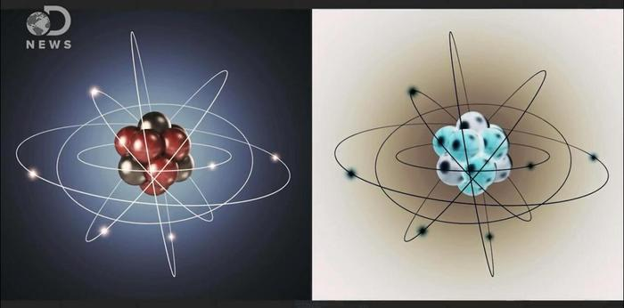
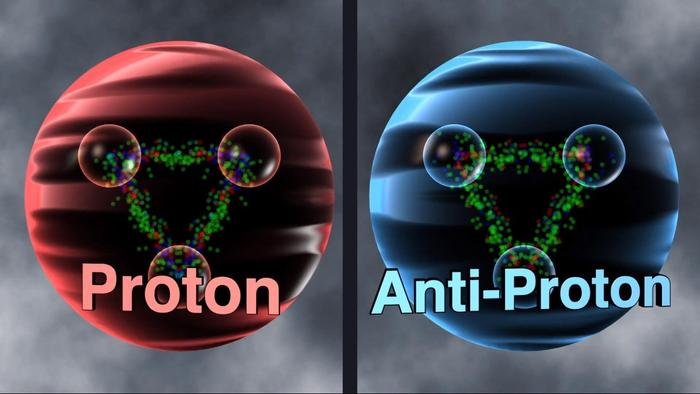
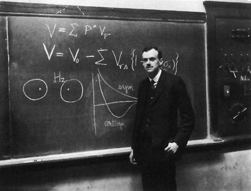

### [不吐不快] 震惊！枫丹已大规模应用反物质作为能源！

Made by ngapost2md (c) ludoux [GitHub Repo](https://github.com/ludoux/ngapost2md)

----

##### 0.[0] \<pid:0\> 2023-07-21 00:38:23 by GT7896
尊敬的读者们，我是枫丹国境内的“蒸汽鸟报社”记者。今天，我将向您报道一则令人瞩目的新闻——枫丹国已经大规模应用反物质作为能源，为我们的社会带来了巨大的变革。

在科技的飞速发展下，枫丹国不断探索新的能源形式，旨在实现能源的高效、清洁和可持续利用。经过多年的科学研究和技术突破，反物质能源终于成为我们的现实。

反物质是一种粒子，与普通物质互为反粒子，其核心具有相同的质量但带有相反的电荷。当反物质与普通物质相遇时，它们会发生湮灭反应，释放出大量的能量。这种能量密集、高效利用的特性，使得反物质成为了理想的能源选择。

大规模应用反物质作为能源为枫丹带来了多方面的好处。首先，能源短缺问题逐渐迎刃而解。由于湮灭反应释放出的能量巨大，少量的反物质就足以供应数十年乃至更长时间的能源需求。相比传统能源，反物质能源的储存和利用效率大大提高，减少了对有限资源的依赖。

其次，反物质能源的应用也显著降低了环境污染。湮灭反应仅产生高能粒子和光子，而没有产生任何有害的尾气或废物，对大气和水体没有污染。枫丹的天空再也不会被煤炭或石油燃烧所弥漫的黑烟笼罩，我们的水域再也不会受到废物排放的威胁。

此外，反物质能源的应用也推动了科技和经济的发展。大规模的反物质生产和利用需要高度复杂的技术和设施，这促进了科学家和工程师们在能源领域的研究和创新。同时，反物质产业链的建设也带动了相关产业的发展，创造了大量就业机会，为枫丹经济的腾飞提供了强大动力。

然而，我们也要看到，反物质能源的应用还面临着一些挑战。首先，反物质的生产和储存仍然是一个复杂而昂贵的过程。科学家们需要不断努力，降低成本并提高产量，以实现能源的可持续发展。

其次，反物质的安全问题也需要引起我们的高度关注。反物质与普通物质相遇时会产生湮灭反应，释放出巨大的能量，如果失去控制，可能带来灾难性的后果。因此，科学家们需要确保反物质能源的安全运用，并建立完善的安全体系。

尽管面临挑战，枫丹国已经迈出了应用反物质能源的重要一步。我们坚信，通过持续的努力和科技创新，反物质能源将成为我们未来能源的重要组成部分，为枫丹国和全球带来更加美好的未来。让我们携手共建绿色、清洁、繁荣的枫丹！

----

##### 1.[0] \<pid:703870638\> 2023-07-21 00:41:52 by dfpvml
蹭了个大的

----

##### 2.[0] \<pid:703871239\> 2023-07-21 00:47:24 by ★_☆
你这个反物质有没有简称啊

----

##### 3.[0] \<pid:703871489\> 2023-07-21 00:49:42 by nanimonoK
>[jump](#pid703871239) _(2023-07-21 00:47)说:
>你这个反物质有没有简称啊[s:a2:有何贵干]

原神的新元素自然有很“原神”风味的简称，就叫O元素，P元素吧。

----

##### 4.[0] \<pid:703871532\> 2023-07-21 00:50:02 by stella131
有点慌

----

##### 5.[0] \<pid:703876093\> 2023-07-21 01:43:43 by 辰砂之纺锤
这是刚做完梦吗，合理之中带着一丝抽象

----

##### 6.[0] \<pid:703901516\> 2023-07-21 09:07:02 by 魑魅魍魉魖魌
“湮灭反应仅产生高能粒子和光子，而没有产生任何有害的尾气或废物，对大气和水体没有污染”
我物理不是很好，但是我记得高能粒子对生物体也是有害的吧？

----

##### 7.[0] \<pid:703903219\> 2023-07-21 09:14:30 by 透明的视野
太忙了，这么长的文章根本看不完，有没有省流

----

##### 8.[0] \<pid:703903470\> 2023-07-21 09:15:46 by yblc
>[jump](#pid703903219) 透明的视野(2023-07-21 09:14) 说: 
>
>太忙了，这么长的文章根本看不完，有没有省流

应该是枫丹它荒芒起来了

