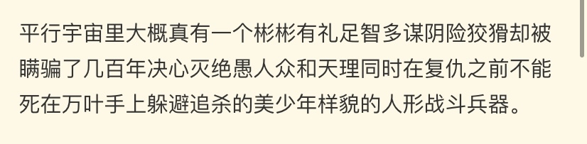

### [不吐不快]对与流浪者和散兵的想法

Made by ngapost2md (c) ludoux [GitHub Repo](https://github.com/ludoux/ngapost2md)

----

##### 0.[0] \<pid:0\> 2023-07-21 00:47:15 by 眠的移动城堡
本人散厨，今天看到了一个佬对世界树之前的散兵的评价，很有感触也很纠结
相比于如今的流浪者，我更喜欢曾经的散兵
散兵的塑造很成功，导致我对这个角色拉满了期待
一个很有魅力的反派

但是看如今的流浪者，嗯…那种感觉说不上来，就是很不对劲，用我的话说就是没有之前那种感觉了
好像好几种东西混到了一起
打个比方，类似于纯牛奶加了很多添加剂，导致它失去了纯这个优点，本质上也不如纯牛奶了，反而变成了另一种东西—调制乳

3.2和3.3剧情把散写的光突出了他的决心和愤怒
却有点弱智
跟之前判若两人，看起来像一个中二小男孩，有点幼稚
完全没有反派那种感觉，没有魅力

嗯…只能希望流浪者接下来的剧情可以挽救一下，虽然感觉救不回来了

我是看在散兵的份上抽的流浪者，不然一点也不想要

感觉完全是两个角色了啊喂！好想骂死这个编剧

----

##### 1.[0] \<pid:703871748\> 2023-07-21 00:52:00 by 眠的移动城堡
>[jump](#pid0) 眠的移动城堡(2023-07-21 00:47) 说: 
>
>本人散厨，今天看到了一个佬对世界树之前的散兵的评价，很有感触也很纠结
>相比于如今的流浪者，我更喜欢曾经的散兵
>散兵的塑造很成功，导致我对这个角色拉满了期待
>一个很有魅力的反派
>
>但是看如今的流浪者，嗯…那种感觉说不上来，就是很不对劲，用我的话说就是没有之前那种感觉了
>好像好几种东西混到了一起
>打个比方，类似于纯牛奶加了很多添加剂，导致它失去了纯这个优点，本质上也不如纯牛

还是说我高估了散兵？现在好迷茫

----

##### 2.[3] \<pid:703871760\> 2023-07-21 00:52:04 by 末日时会做什么
你好，里版欢迎你。
顺带一提你这样的也只会被散厨(散解？)踢出去，不利于内部团结的话不要说

----

##### 3.[0] \<pid:703871943\> 2023-07-21 00:53:39 by 眠的移动城堡
>[jump](#pid703871760) 末日时会做什么(2023-07-21 00:52) 说: 
>
>你好，里版欢迎你。
>顺带一提你这样的也只会被散厨(散解？)踢出去，不利于内部团结的话不要说

原来我发错位置了吗本人萌新，不太懂这个

----

##### 4.[0] \<pid:703872123\> 2023-07-21 00:55:21 by 末日时会做什么
>[jump](#pid703871943) 眠的移动城堡(2023-07-21 00:53) 说: 
>
>原来我发错位置了吗本人萌新，不太懂这个

你加了不吐不快标签被自动送进来了

----

##### 5.[0] \<pid:703872219\> 2023-07-21 00:56:10 by 眠的移动城堡
>[jump](#pid703872123) 末日时会做什么(2023-07-21 00:55) 说: 
>
>你加了不吐不快标签被自动送进来了

我的天

----

##### 6.[1] \<pid:703872523\> 2023-07-21 00:58:45 by 白浪梅
是的，我其实一开始是奇怪为什么编剧把有潜力的角色写成这水平，见到个散厨都不开喷反护
后来我意识到了，有一群在代表全部散厨，同时把自己不喜欢的声音都切割掉

----

##### 7.[1] \<pid:703872680\> 2023-07-21 01:00:03 by AxialAge
我一直不懂怎么进了趟世界树，恢复记忆就变嘴臭了，明明以前都不是这样，导致我都不想拿他跑图，或者要切日配才行

----

##### 8.[1] \<pid:703872891\> 2023-07-21 01:02:11 by 眠的移动城堡
>[jump](#pid703872680) AxialAge(2023-07-21 01:00) 说: 
>
>我一直不懂怎么进了趟世界树，恢复记忆就变嘴臭了，明明以前都不是这样，导致我都不想拿他跑图，或者要切日配才行

我感觉执行官时期散还挺正常的，不知道为什么进世界树后多了个嘴臭属性

----

##### 9.[0] \<pid:703873226\> 2023-07-21 01:05:31 by 丁麦杜丁屈曲
我说实话3.3最后改世界树前我听说过散的节奏，当时还觉得这角色还行没有那么糟糕啊，结果剧情最后给我一个巨大的“惊喜”。
谁能告诉我你失忆时一副要负责任的态度，拿回记忆后怎么又旧病复发甚至变本加厉？好像之前说要负责任的不是你，好像你不觉得自己有错一样，这是个啥态度？傲娇也不是这样吧？

----

##### 10.[2] \<pid:703873606\> 2023-07-21 01:09:39 by 什锦
萌新，理智散厨，被tag误送进里区。我建议里区老哥们谨慎

----

##### 11.[0] \<pid:703873770\> 2023-07-21 01:11:54 by 什锦
补点公鸡性。散兵和流浪者版权都在mhy手里，老米选择把他塑造成垃圾那他就是个垃圾，接受不了的才应该反省自己

----

##### 12.[0] \<pid:703873960\> 2023-07-21 01:14:12 by 为蒙德红玫瑰献上心脏
是这样子啊 b格烂了 赎罪烂了 ml烂了
看着3.3做剧情前被建模吸引抽出来 又在3.6彻底失去耐心前因为风系且c位给了皇冠的大炮 只有一阵无语

----

##### 13.[0] \<pid:703874847\> 2023-07-21 01:24:44 by 眠的移动城堡
>[jump](#pid703872523) 白浪梅(2023-07-21 00:58) 说: 
>
>是的，我其实一开始是奇怪为什么编剧把有潜力的角色写成这水平，见到个散厨都不开喷反护
>后来我意识到了，有一群在代表全部散厨，同时把自己不喜欢的声音都切割掉了
>在年初桓那版还有对剧情不满的散厨楼，后面4月份也有类似的，楼里是各种“原来你也”的声音
>我是觉得编剧真不会写讨论出的好写法哪个拿去都比现在剧情观感强

我当时甚至期待着剧情能多么美好，现在想来自己像个小丑

----

##### 14.[2] \<pid:703875857\> 2023-07-21 01:39:44 by 何時會有HE的存在
斥責雷散解,瞭解雷散解,成為雷散解.jpg橫跨兩年的角色的劇本寫成這樣,我怎樣能相信其他的角色不崩

----

##### 15.[0] \<pid:703876083\> 2023-07-21 01:43:31 by 大漠孤雪
>[jump](#pid703875857) 何時會有HE的存在(2023-07-21 01:39) 说: 
>
>斥責雷散解,瞭解雷散解,成為雷散解.jpg橫跨兩年的角色的劇本寫成這樣,我怎樣能相信其他的角色不崩

最开始我不能理解为什么散兵厨子内部为啥分裂成了雷散、流浪者两个派别
现在我理解了

----

##### 16.[1] \<pid:703876971\> 2023-07-21 01:58:11 by lhx2770544613
支持散兵和流浪者正义切割，喜欢散兵的人都是品味很高的人，而喜欢流浪者的不过是对散兵爱不够，只是喜欢散兵脸的肤浅之人，或者被米哈游用劣质洗白就认可。只有我们散兵厨才是真散解，那帮厨流浪者的不配这个名字。

----

##### 17.[0] \<pid:703878320\> 2023-07-21 02:25:48 by pqfwc922
no
我严肃的说我是在未归版本就断定这个角色一定会造成巨大冲突的

阴柔少年反派是受女玩家欢迎的同时最能刺激男玩家恶感的角色之一，除非杀掉这个角色或者打成搞笑角色，否则拥护他的人一定会和带入主角的人产生持续性冲突，一个以男玩家为主体的游戏就不该让这种东西自机

当然能烂穿地心，既被写成小丑又能用时给男女玩家上血压这点是超出预期

----

##### 18.[0] \<pid:703878576\> 2023-07-21 02:31:32 by 须弥笑话
我感觉草神都救得回来，散兵早就救不回来了…

流浪者创造了原神中史无前例的荒唐——角色故事与圣遗物专属故事不符。而导致这个差异的元凶就是：丹羽。虽然丹羽早在2.6就已经埋下伏笔，但在3.3，文案才给丹羽具体设定：踏鞴沙最高长官，散兵最重要的人
但搞笑的地方来了：
身为踏鞴沙最高长官，在2.0踏鞴沙地图的纸条里查无此人
身为散兵最重要的人，在2.3华馆套散兵回忆录里查无此人
就是这样一个人，文案硬是指着他给玩家说：这就是散兵第二次背叛的主人公所以丹羽是什么新时代克苏鲁吗？相关人员一个都不敢记录

而丹羽的出现直接顶掉了桂木——一个本来就是散兵心中最重要的人。(桂木：明明是我先来的，找到倾奇者也好，和倾奇者一起跳舞也好，明明都是我先来的，为什么你的眼里只有丹羽啊！)
而这一变动直接让桂木桂木长正两人变小丑：本来桂木因为渎职被长正斩杀，结果成了桂木自愿背锅顶死。而散兵和官方对长正的评价是什么？刚正不阿！你告诉我这种为了姓氏清白连底线都丢的魔怔人也配？散兵不找他算账？哦，我忘了，他脑袋里只有丹羽了，桂木不配

而让散兵这么多年念念不忘的是丹羽吗？本来华馆套里通过描写散兵回去的时候小孩不在了来暗示惨剧早已发生，散兵这么多年在流浪时哪怕堵住耳朵都无法逃避的梦魇是什么？踏鞴沙村民的期待！他一直愧疚自己没能及时赶回去。结果3.3成了什么？呜呜，丹羽背叛了我。而在华馆套里散兵是在村民的期待下前往鸣神岛的，结果个人故事里说他是为了丹羽主动去的(村民、散兵：6)

说真的，看3.3和流浪者个人故事时我一直怀疑我是在LOFTER看什么CP文吗？这么见缝插针，恨不得每个空白处都磕CP(还TM是天降的)…内部爱毁掉一个开服老角色是真的没想到

----

##### 19.[0] \<pid:703879210\> 2023-07-21 02:46:21 by 眠的移动城堡
>[jump](#pid703878576) 须弥笑话(2023-07-21 02:31) 说: 
>
>我感觉草神都救得回来，散兵早就救不回来了…
>
>流浪者创造了原神中史无前例的荒唐——角色故事与圣遗物专属故事不符。而导致这个差异的元凶就是：丹羽。虽然丹羽早在2.6就已经埋下伏笔，但在3.3，文案才给丹羽具体设定：踏鞴沙最高长官，散兵最重要的人
>但搞笑的地方来了：
>身为踏鞴沙最高长官，在2.0踏鞴沙地图的纸条里查无此人
>身为散兵最重要的人，在2.3华馆套散兵回忆录里查无此人
>就是这样一个人，文案硬是指着他给玩家说：这就是散兵第二次背叛的主人公所以

老师分析的太好了

----

##### 20.[0] \<pid:703879736\> 2023-07-21 03:00:09 by 冲天槊的尖头
米哈游有那个能力吗？没有

----

##### 21.[0] \<pid:703879818\> 2023-07-21 03:02:22 by SNsymerry
万叶有追杀你吗？没有吧？人家在不断循环放下了，你给自己加这么多戏就算了，还要给万叶加戏？我可去你的吧，真就和你厨的散兵一样离了人就不会走路了，笑死

----

##### 22.[0] \<pid:703880161\> 2023-07-21 03:12:41 by 眠的移动城堡
>[jump](#pid703879818) SNsymerry(2023-07-21 03:02) 说: 
>
>万叶有追杀你吗？没有吧？人家在不断循环放下了，你给自己加这么多戏就算了，还要给万叶加戏？我可去你的吧，真就和你厨的散兵一样离了人就不会走路了，笑死

问题来了，这位大哥，你在急什么
先组织一下自己的语言吧，我也没为散兵说话呀

----

##### 23.[1] \<pid:703880712\> 2023-07-21 03:30:07 by 巳樊党乙连宫
>[jump](#pid0) 眠的移动城堡(2023-07-21 00:47) 说: 
>
>本人散厨，今天看到了一个佬对世界树之前的散兵的评价，很有感触也很纠结
>相比于如今的流浪者，我更喜欢曾经的散兵
>散兵的塑造很成功，导致我对这个角色拉满了期待
>一个很有魅力的反派
>
>但是看如今的流浪者，嗯…那种感觉说不上来，就是很不对劲，用我的话说就是没有之前那种感觉了
>好像好几种东西混到了一起
>打个比方，类似于纯牛奶加了很多添加剂，导致它失去了纯这个优点，本质上也不如纯牛

因为编剧又懒惰又不负责任啊他明显没有构思好剧本，那个间章就是走个流程为了完成任务而写的，既没有过场动画也没有剧情pv啥的，就是让你看见散兵被博士欺骗了，后悔杀人了然后跳树换衣服进卡池了。如果编剧真对自己塑造的人物负责，至少会给他来点正面塑造吧。曾经给人感觉是个苦大仇深的反派，现在貌似只会吐舌头逃课摸鱼了，剧情和语音也是见人就怼。如果你觉得割裂其实很正常，光看华馆文本和实际做出来这个，很难想象居然是一个人

----

##### 25.[0] \<pid:703883583\> 2023-07-21 05:43:59 by 看我把那飞机打下来
>[jump](#pid703879818) SNsymerry(2023-07-21 03:02)说:
>万叶有追杀你吗？没有吧？人家在不断循环放下了，你给自己加这么多戏就算了，还要给万叶加戏？我可去你的吧，真就和你厨的散兵一样离了人就不会走路了，笑死

你是不是有点魔怔，说散兵在原神结局应该死在万叶手上那是加戏？

----

##### 26.[0] \<pid:703884047\> 2023-07-21 06:04:16 by qpznp52899
本来就不是那个路数的人物...从女士挂了他跑路那就看出来这不是魅力大反派的料....那时候说拜义父什么的就是这个，反派可以不正，但是退而求其次要么有一个超出常人执着的歪一点的信念，要么讲义气，他这一点义气都没有，怎么魅力。
厨子老说什么有本事别洗白，信就完蛋，肯定写的平，正面写不了，悔过写不了，翻大车以后大彻大悟写不了，怎么立体，世界树都搞出来了都倒是悟点道啊，长进一点啊，结果撑着也没洗混过去，这不肯定越写越平，就好好洗白就行了，管什么俗不俗气的，你不螺旋活人变冰箱全都俗，看得多有什么不俗啊，bg俗bl就不俗了，龙场悟道俗顺水推舟收编不俗啊，写得好是写得深，不是点菜，辣不要葱不要姜不要蒜不要肉不要素不要...
你真要魅力纯反派一前面写的就不是这种人，基本换人，二纯黑做主角不过审

----

##### 27.[0] \<pid:703884172\> 2023-07-21 06:09:08 by Lilith330
他最好的结局是死了
只要没死就是一个小丑
没死，还大摇大摆过着舒适的生活，到处锐评别人更是小丑里的小丑
假如散厨喜欢的是他内心挣扎的脆弱感，请问现在还有吗？3.3之后哪段剧情是在描写他的脆弱？
很想知道米哈游目前对于流浪者有没有一个人设，还是说自己也不知道怎么写，就干脆和妈粉一起喊宝宝最可爱了宝宝好可怜大家都来宠宝宝
如果说3.3给人的恶感只是岁月史书的如鲠在喉，3.6就是彻底把这个角色的可能性抹杀了
一个被安排在须弥无所事事想读书就读书想逃课就逃课，没有任何实绩，游手好闲嘴臭嚣张的……妈宝下头男

----

##### 28.[0] \<pid:703887207\> 2023-07-21 07:21:06 by 色胚茄子
楼主这样的出门是不是就要被叫雷散解

----

##### 29.[0] \<pid:703889121\> 2023-07-21 07:45:01 by mdjdfz
剧情为了给散兵让路牺牲了太多东西，到最后散兵是集剧里剧外万千优待于一身，没有偿罪没有受罚，却还是一副臭脸哼，无聊的态度，属实是让人不舒服。散厨可能会说人家性格就那样，我是不觉得这种大是大非面前还能拿性格说事的，杀人放火，逮住后问你可知悔改？哼，人类真是脆弱。他性格如此是吧，他算老几啊，还性格如此，今天天皇老子来了都按不下你倔强的头颅是吧，我是没法接受的。

----

##### 30.[0] \<pid:703889314\> 2023-07-21 07:46:56 by 零点，陈彬
死了失忆进池子被草神安排去打工一点问题也没有，拿了记忆也不忏悔，太怪了散兵这个角色可以很好看的，非得写成这样

----

##### 31.[0] \<pid:703889522\> 2023-07-21 07:49:03 by 星淡_重生版
虽然但是我也挺希望他死在稻妻的(也是爱过

----

##### 32.[0] \<pid:703892239\> 2023-07-21 08:13:25 by 看我把那飞机打下来
>[jump](#pid703889121) mdjdfz(2023-07-21 07:45)说:
>剧情为了给散兵让路牺牲了太多东西，到最后散兵是集剧里剧外万千优待于一身，没有偿罪没有受罚，却还是一副臭脸哼，无聊的态度，属实是让人不舒服。散厨可能会说人家性格就那样，我是不觉得这种大是大非面前还能拿性格说事的，杀人放火，逮住后问你可知悔改？哼，人类真是脆弱。他性格如此是吧，他算老几啊，还性格如此，今天天皇老子来了都按不下你倔强的头颅是吧，我是没法接受的。

在逆天编剧的眼里，这大概叫傲娇(我呸)

----

##### 33.[0] \<pid:703902229\> 2023-07-21 09:10:10 by 草右mmm
感觉散兵的“赎罪”大约是写不了太好

一是3.3结束这么久了，我们还是不知道万叶神里兄妹雷神神子这些跟散兵有因果关系的人准备怎么处理这条和散兵有关的故事线，3.3结尾就对这些人没任何交代，中间有机会的生日信生贺图文案3.6都没说，一点伏笔都没埋，散兵语音里对这些人还是那样的评价。

二是世界树的设定还不明晰，虽然大家都认为更改的是记忆，但是更改事实但天命既定的观点也很有说法。这样靠着世界观底层设定，流浪者能直接脱罪，将一切归咎于命运。

三是不管世界树的设定是什么，和他有因果关系的人都把他忘了，这时候所谓的“赎罪”也是做戏给瞎子看，然后被网友拿来pvp，世界树这种外挂也不能轻易讲出去，所以这能断了散兵解释前尘解释他们记忆问题的可能。同时，散兵现在很明显算须弥人，虽然他在稻妻债更多但稻妻岁掉了，那最大的可能就是在须弥“赎罪”(网友都在喊让散兵学魈锄地，这搞不好会二创转正哦，反正这种事米做多了，虽然我觉得散兵不管怎么做他都走不了魈的路成不了魈的结局和风评)，“赎罪”内容把稻妻须弥的一起算，这种行为有多少诚意大家自己判断，更何况现在的散兵依然是自觉高人一等藐视人类的人设。

四是制作组的内部爱非常不想散兵受苦，给他提好感的方式不是完善散兵的塑造给散兵多少高光(不过散兵身上也没有值得称道的东西，按现在的人设我是想不出来能给点什么)而是让他跟须弥别的高人气角色同框，不得不说制作组也很清楚散兵现在人嫌狗厌又废拉不堪烂泥扶不上墙，所以宁可崩了别的角色也要给散兵的好感度背书。从冰冷的商业角度看让人完全不能理解这种自毁城墙的行为。

综上，散兵后面的剧情多半又是“极具争议”的一坨，讨厌的人依然讨厌但厨子拼命护，新的乐子就在不远的将来

----

##### 34.[0] \<pid:703906888\> 2023-07-21 09:31:16 by sugown
希望赶紧把那树烧了或者用其他方法总之回归真相，然后散作为真正的罪人受苦赎罪去，找博士报仇去，心理状态和处境都越惨越好
现在内部爱的这股嬷味儿真的受不了，到底谁想看他在须弥当妈宝和在教令院安稳当太子啊

----

##### 35.[1] \<pid:703936489\> 2023-07-21 11:36:08 by 鼠卫兵
雷散姐三连.JPG

----

##### 36.[5] \<pid:703939703\> 2023-07-21 11:49:30 by ToutSeul
通过原神文案对这个角色的塑造，我终于知道俗套的洗白手法有多可贵了
但凡写个啥挡枪身死、重塑肉身回植记忆的剧情也不至于让整个人物的核心烂掉
就算要用岁月史树呢？就不能给树的设定打补丁？用更多篇幅来描写其它对犯下错误的弥补过程来增加入池的合理性？
现在通过这种粗暴的、机械降神式的既要还要，让其它一头栽树上变成一口不粘锅，顺带着把整个世界观弄崩了，也是很爆笑了

----

##### 37.[2] \<pid:703942894\> 2023-07-21 12:03:42 by 东方豆腐饭店
突然意识到散兵厨的名字已经被流浪者厨篡夺了，还被打为雷散解

----

##### 38.[5] \<pid:703943582\> 2023-07-21 12:06:50 by 我流伦子哥
散厨内部的一个散散原则就是专门用来对付楼主这种人的
一边说吃书一边说就是一个人的精神分裂是这样的，为了自己群体的利益采用有利于自己的灵活标准

----

##### 39.[0] \<pid:704064814\> 2023-07-21 23:32:44 by 易居壳
3.3我先抽了再过剧情的~~原来是有点喜欢雷散~~过完后出脑得不行，但至少队伍还在用3.6之后直接成为仓管

----

##### 40.[0] \<pid:704088109\> 2023-07-22 05:53:23 by 看我把那飞机打下来
>[jump](#pid703943582) 我流伦子哥(2023-07-21 12:06)说:
>散厨内部的一个散散原则就是专门用来对付楼主这种人的[s:ac:哭笑] 一边说吃书一边说就是一个人的精神分裂是这样的，为了自己群体的利益采用有利于自己的灵活标准

散兵超话是不承认吃书的，我记得散槽吧好几个吐槽散兵的设定前后割裂的地方都被挂到原神的隔空喊话bot了

