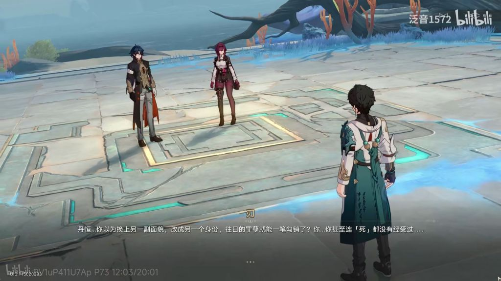
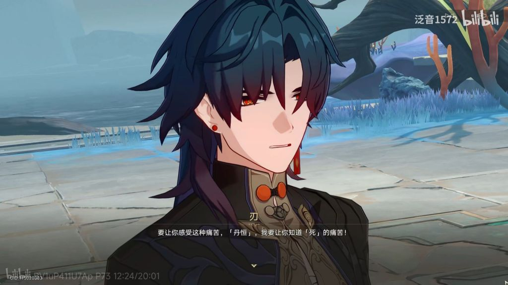
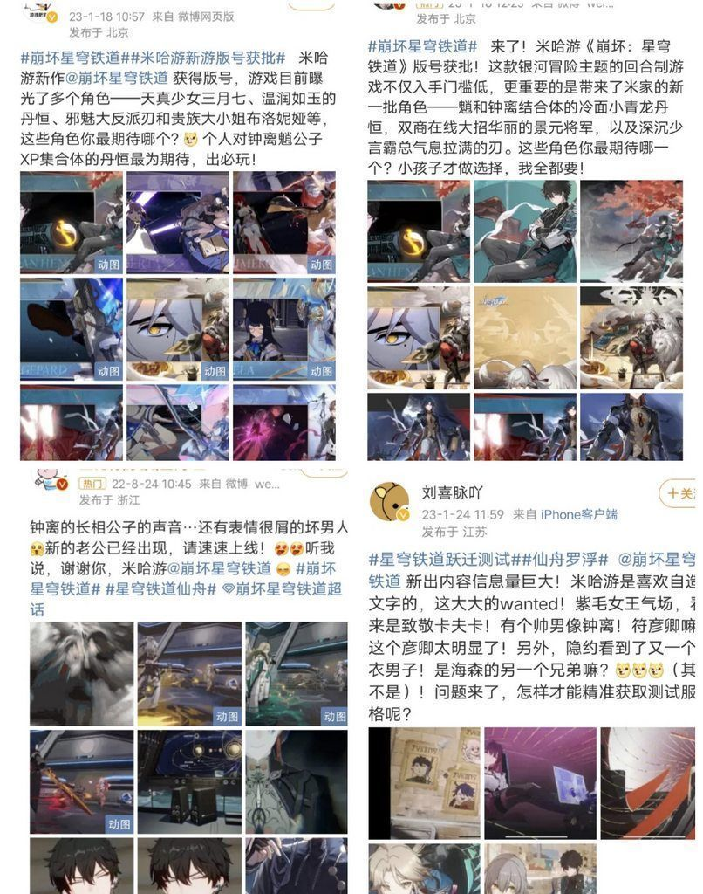

### [不吐不快]隔壁说是太子但感觉和某太子完全相反。

Made by ngapost2md (c) ludoux [GitHub Repo](https://github.com/ludoux/ngapost2md)

----

##### 0.[1] \<pid:0\> 2023-07-21 04:12:16 by 6666655555略略略
隔壁：
所有人都记得他所谓的罪过就他自己不记得。很多人都当他是前世那个人，但他自己清楚他不是前世。
太子：几乎所有人都忘了他的罪过，就他们夫妇和摄像头记得。
隔壁：取回记忆感觉就是看了一场自己前世的电影，没有对今生的人格产生很大的影响，以今生的人格为主体。
太子：以嘴臭为主体的人格，白散变得莫名其妙。
隔壁：不管是不是他做的，事情一定要有个了结，前世的各种因缘追着他，逼迫他站出来。
太子：前面忘了，后面忘了。一起包饺子，当上教令院代表了。
隔壁：不能算是同一个人但要为罪孽负责。
太子：明明是一个人却岁月史书来脱罪。
(这只是目前我看剧情的感受而已。隔壁的罪其实更像父债子还，当然如果后面出大问题了我也不会说它好，我只是更想强调某太子剧情的烂是非常非常烂，不是谁都能相提并论的。)

----

##### 1.[2] \<pid:703881915\> 2023-07-21 04:18:19 by 子柃子柃
感觉很多像拿丹恒洗散...毕竟玩铁的也不一定玩原...

----

##### 2.[0] \<pid:703882002\> 2023-07-21 04:22:22 by bzbjzj
所以是隔壁能接受，把人物积极方面的主动性表现出来了，而这边也不是没有(活在台词里的突破界限，也没写明白明白动机。主动接受记忆，然后整出了个表现不出好东西的奇葩脑回路。莫名奇妙的白黑散握手)，剩下的都是顺水推舟推让一下好事情就全接受了。

----

##### 3.[0] \<pid:703882120\> 2023-07-21 04:28:48 by bzbjzj
可以说散一天是纳的妈宝，那么散一天就塑造不出他积极方面的自我突破。
~~编剧是怎么做的把这么多逆天元素揉在一块的，没有这个形象让我刻意去想去拼都捏不出。~~
~~不信坛友去试一试。~~

----

##### 4.[0] \<pid:703882124\> 2023-07-21 04:28:52 by cccaz
相同的是无论编剧东拉西扯绕了多大圈，太子们的报应都永远不会到来。
太子为啥是太子.jpg
同理的还有优菈迪希雅们。
当然最惨的还是戴因。太子就是的世界树的枝，你算什么个东西也配叫拾枝者？
不过这种前编剧的遗孤怎么都得不得好死就是了

----

##### 5.[0] \<pid:703883932\> 2023-07-21 05:59:18 by 沆瀣一气zex
隔壁那位好歹是替前世服刑出狱了吧，我记得说是受了酷刑强制轮回然后才准出狱并且不准踏入仙舟。(我听我朋友讲的算是半云，可能没受酷刑)
咱原神这须弥太子可是一边在须弥最高学府享受学院人生，一边对黄毛摄像头写信说着学院生活好苦恼的赎罪啊。嘿！感觉还是咱原的太子地道！

----

##### 6.[0] \<pid:703884480\> 2023-07-21 06:21:12 by 小腿的btq
隔壁看描述反正刑罚是很重的，扒鳞强制轮回啥的，按那边的设定属于是死刑这已经不是同一个人的程度了，主要是1.2的主线到最后都没讲到底前世干了啥事受到这种极刑的，就怕这里最后又整了出闹剧成小丑了

----

##### 7.[0] \<pid:703886347\> 2023-07-21 07:06:09 by 云影之离
有人拿隔壁洗散吗只不过隔壁那位实在没什么好吹的吧

----

##### 8.[0] \<pid:703886518\> 2023-07-21 07:09:24 by 哈人哈人太哈人了
还对米哈游剧情抱有希望吗？

----

##### 9.[0] \<pid:703886660\> 2023-07-21 07:11:42 by 他一直都是对的
但是你在里版吹隔壁的角色塑造只会变成笑话，都是一帮人写出的东西你指望什么呢

----

##### 10.[0] \<pid:703889329\> 2023-07-21 07:47:05 by Tracy的救赎
立场差别太大。
假如，我是说假如，太子出场是站在黄毛这边的，黄毛刚踏上旅途就在蒙德遇到太子，甚至太子还帮助了黄毛，并成为了帮黄毛寻找至亲的旅伴，然后作为愚人众的执行官在四处作恶的同时也在收集至亲的信息，真正成为暗中的助力。这样写感受是不是好很多？甚至都不用洗白…
丹恒是列车组的一员，跟三月七和爷可以看作主角团，跟爷没有立场上的矛盾。

----

##### 11.[0] \<pid:703889447\> 2023-07-21 07:48:17 by 四方形打柠檬茶
没见过拿丹恒洗散的，倒是这几天见过不少用散来吹丹恒的，比烂是吧

----

##### 12.[0] \<pid:703891091\> 2023-07-21 08:03:25 by jasmine4869
这种纸片人过程中什么”死过一次”什么”重生轮回”之类的不过写几笔的事情，有什么好真情实感的，有赎罪的态度会反省自己会对受害人表达歉意才是应该着重去写的，不过对老米来说可能妨碍装逼了不好卖卡对吧

----

##### 13.[0] \<pid:703891433\> 2023-07-21 08:06:13 by 一念の差
这什么剧情？
要是我现在告诉你前世是个nacui，你也给我接受试试？

----

##### 14.[0] \<pid:703891608\> 2023-07-21 08:07:56 by 一念の差
>[jump](#pid703884480) 小腿的btq(2023-07-21 06:21) 说: 
>
>隔壁看描述反正刑罚是很重的，扒鳞强制轮回啥的，按那边的设定属于是死刑这已经不是同一个人的程度了，主要是1.2的主线到最后都没讲到底前世干了啥事受到这种极刑的，就怕这里最后又整了出闹剧成小丑了

不是很懂啊
一般诅咒人都是：你永世不得轮回
怎么强制轮回给你洗白白了，叫惩罚

----

##### 15.[0] \<pid:703892737\> 2023-07-21 08:17:17 by 喵西斯

我倒觉得隔壁那位太子像原这边太子的升级版。
既要把“曾有过罪但轮回(死)了一次”保留下来，又要把这边被人唾弃的地方删掉或优化。然后再缝点儿已经验证了的受欢迎的国风元素(比如龙sp)，力求推出一款不仅内部爱，也有十分广泛的玩家爱的角色，达成双方统一立场，不再酿成原如今的局面。(坏了，什么全部的爱)
米哈游:小样儿，这都拿不下你？

----

##### 16.[0] \<pid:703893046\> 2023-07-21 08:19:23 by hx0539
感觉不到区别很大，都是内部爱，只不过一个愿意圆得好点罢了

----

##### 17.[0] \<pid:703893274\> 2023-07-21 08:21:11 by 两块半大魔王
隔壁说的倒是好，最后还不是高高举起，轻轻放下，讲了半天还是没负责不然为啥叫太子，不愧是米哈游。

----

##### 18.[0] \<pid:703893676\> 2023-07-21 08:23:58 by Caolvzi
都是太子，区别是一个纯纯的逆天一个(目前)在各种补丁外加剧情加成下没那么逆天罢了

----

##### 19.[0] \<pid:703893783\> 2023-07-21 08:24:48 by 音羽城
话虽如此，我到现在还不知道隔壁大青龙就近干了啥坏事，刃倒是一口一个十恶不赦，可他到底干啥坏事了啊？？

----

##### 20.[0] \<pid:703894826\> 2023-07-21 08:31:33 by 小塞里斯
这几天怎么这么多悄悄咪咪吹隔壁的都是米哈游的到底在期待什么

----

##### 21.[0] \<pid:703895107\> 2023-07-21 08:33:22 by 悲伤烤红薯
我看到踩原吹崩会吐.JPG
前几天不还夸隔壁三观正？那么隔壁那位死过了吗？

----

##### 22.[1] \<pid:703895458\> 2023-07-21 08:35:38 by 阿天布鲁斯
目前隔壁的问题就是没讲明白
目前可知的信息给没玩过的描述一下
1为啥死刑没彻底死，是因为种族持明(龙)已经断了繁殖能力，所有的现存持明族都是上一世死了回归卵转生，丹恒又是龙尊，血脉珍贵，族里不舍得放弃
2前世坐牢后死刑，因为族里的自私没彻底剥夺他的记忆，算是带着记忆轮回了(带着记忆我不觉得算死过)，出生就意识到自己罪，于是坐牢到成年被永久驱逐
3目前剧情里按照碎片信息即是英雄也是罪人(英雄也好，罪人也好)判断可能是做过突出贡献，最后犯下大罪，但具体是啥，没说明白
4丹恒虽然一直明确自己和前世切割，但是该负的责任也都负责了，履行了龙尊的义务
最大的问题就是没讲明白故事，以米的笔力，我感觉很难说写成啥样，到底是宇智波鼬还是艾伦耶格尔

----

##### 23.[0] \<pid:703897145\> 2023-07-21 08:45:17 by 德赫瑞姆的小麦贩子
>[jump](#pid703893783) 音羽城(2023-07-21 08:24) 说: 
>
>话虽如此，我到现在还不知道隔壁大青龙就近干了啥坏事，刃倒是一口一个十恶不赦，可他到底干啥坏事了啊？？

我倾向于藏三个大版本后才会揭秘
仙舟人+持明族+列车组一起变小丑
然后大家一起包饺砸

----

##### 24.[0] \<pid:703897986\> 2023-07-21 08:49:30 by 阿荠赛
这下我和星or穹害有三月七同一视角了 什么叫代入感啊(摊手)

铁道这断章断在这儿 玩原3.3的ptsd不可控地要发作了啊啊啊啊啊

最好是日后谈写清楚嗷 而且按目前我对三月七的角色塑造的理解 后续青蒜丹恒的时候 她多半会直接问当事人“丹恒你是不是干坏事了”之类的 别一崩崩倆嗷

----

##### 25.[0] \<pid:703899534\> 2023-07-21 08:57:18 by 云影之离
>[jump](#pid703892737) 喵西斯(2023-07-21 08:17) 说: 
>
>
>我倒觉得隔壁那位太子像原这边太子的升级版。
>既要把“曾有过罪但轮回(死)了一次”保留下来，又要把这边被人唾弃的地方删掉或优化。然后再缝点儿已经验证了的受欢迎的国风元素(比如龙sp)，力求推出一款不仅内部爱，也有十分广泛的玩家爱的角色，达成双方统一立场，不再酿成原如今的局面。(坏了，什么全部的爱)
>米哈游:小样儿，这都拿不下你？

这位也别碰瓷了国风龙了

----

##### 26.[0] \<pid:703900286\> 2023-07-21 09:00:53 by 已美美冬眠
隔壁的描写真的能让人有实感吗通过官方文案告诉玩家某人受过什么酷刑，经历了什么死亡转生，都是很轻飘飘的东西，不觉得是惩罚，反而像是在加戏

----

##### 27.[0] \<pid:703900353\> 2023-07-21 09:01:14 by St-Ranger
>[jump](#pid703895458) 阿天布鲁斯(2023-07-21 08:35) 说: 
>
>目前隔壁的问题就是没讲明白
>目前可知的信息给没玩过的描述一下
>1为啥死刑没彻底死，是因为种族持明(龙)已经断了繁殖能力，所有的现存持明族都是上一世死了回归卵转生，丹恒又是龙尊，血脉珍贵，族里不舍得放弃
>2前世坐牢后死刑，因为族里的自私没彻底剥夺他的记忆，算是带着记忆轮回了(带着记忆我不觉得算死过)，出生就意识到自己罪，于是坐牢到成年被永久驱逐
>3目前剧情里按照碎片信息既是英雄也是罪人(英雄也好，罪人也好)判断可能是做过突出贡献，最后犯下大罪，但具体是啥，没说明白
>4丹恒虽然一直明确自己和前世切割

我稍微指正一下

1.龙尊的化龙之力尤为关键，所以不是持明族不舍放弃，而是没法放弃。事实上哪怕站在罗浮整体利益的立场上，真把化龙之力传承的龙尊弄没的话，那建木封印无人能维护也是不行的。

2.龙尊的英雄，是某代龙尊做出“一个违背祖宗的决定”，把持明族从老家带来的水用来镇压封印建木，所以对罗浮有大功。然后传承到上代丹枫，(虽然剧情还没明说)，但可以旁敲侧击推断，应该是丹枫和应星(点刀哥)出于私心想给云上五骁那个狐人族妹子延寿，然后搞出问题了。
这个剧情我说句实话，很有国产古偶的烂俗味道
轮回转世万年不朽的龙族当代龙尊为了心上人异族白月光，不惜天下安危和族内力量传承，行逆天之举、搞的举世皆敌。

----

##### 28.[0] \<pid:703900878\> 2023-07-21 09:03:50 by 魑魅魍魉魖魌
证明隔壁的屎比原神的屎香一点有意义吗？

----

##### 29.[0] \<pid:703900968\> 2023-07-21 09:04:16 by 好久才看见
有爱莉希雅在前面，丹恒这点算什么啊

这好歹算主线故事，一个DLC支线跟龙族3差不多，文案比主线长扯的比主线还远，还要吃主线的书，和主线主角拉CP，拿主线角色当垫子

----

##### 30.[2] \<pid:703901263\> 2023-07-21 09:05:42 by 音羽城
>[jump](#pid703897145) 德赫瑞姆的小麦贩子(2023-07-21 08:45) 说: 
>
>我倾向于藏三个大版本后才会揭秘
>仙舟人+持明族+列车组一起变小丑
>然后大家一起包饺砸

是的，我也很怀疑最后可能会是“啊？所谓的十恶不赦大罪也就这样而已啊？“，然后大家一起变小丑

----

##### 31.[0] \<pid:703902282\> 2023-07-21 09:10:27 by 喵西斯
>[jump](#pid703899534) 云影之离(2023-07-21 08:57) 说: 
>
>这位也别碰瓷了国风龙了

没打包送给霓虹星就感恩戴德吧

----

##### 32.[0] \<pid:703902542\> 2023-07-21 09:11:34 by 阿天布鲁斯
抽风了，编辑一下

----

##### 33.[0] \<pid:703903530\> 2023-07-21 09:16:00 by bzbjzj
>[jump](#pid703895458) 阿天布鲁斯(2023-07-21 08:35) 说: 
>
>目前隔壁的问题就是没讲明白
>目前可知的信息给没玩过的描述一下
>1为啥死刑没彻底死，是因为种族持明(龙)已经断了繁殖能力，所有的现存持明族都是上一世死了回归卵转生，丹恒又是龙尊，血脉珍贵，族里不舍得放弃
>2前世坐牢后死刑，因为族里的自私没彻底剥夺他的记忆，算是带着记忆轮回了(带着记忆我不觉得算死过)，出生就意识到自己罪，于是坐牢到成年被永久驱逐
>3目前剧情里按照碎片信息既是英雄也是罪人(英雄也好，罪人也好)判断可能是做过突出贡献，最后犯下大罪，但具体是啥，没说明白
>4丹恒虽然一直明确自己和前世切割

点刀哥和丹恒那里确实有点怪，米能力不足的话大概率整个小崩还是挺可能的还在接受氛围内。
点刀哥现在话说的太满，似乎为了给追杀丹恒造成的影响下台，实际体现却高高举起轻轻放下。
后续点刀哥估计是准备通过挂靠卡芙卡言灵和预言来给他的行为动机(疯批不受控)打补丁了。
评价为杀人装逼一时爽，洗白补丁火葬场。
唯有沉默两那么大仇结果就这。我就看看崩铁后续怎么盘这个逻辑。
(目前剧情还在接受范围，最多有点逻辑不顺)

----

##### 34.[0] \<pid:703904014\> 2023-07-21 09:18:11 by 阿天布鲁斯
>[jump](#pid703900353) St-Ranger(2023-07-21 09:01) 说: 
>
>我稍微指正一下
>
>1.龙尊的化龙之力尤为关键，所以不是持明族不舍放弃，而是没法放弃。事实上哪怕站在罗浮整体利益的立场上，真把化龙之力传承的龙尊弄没的话，那建木封印无人能维护也是不行的。
>
>2.龙尊的英雄，是某代龙尊做出“一个违背祖宗的决定”，把持明族从老家带来的水用来镇压封印建木，所以对罗浮有大功。然后传承到上代丹枫，(虽然剧情还没明说)，但可以旁敲侧击推断，应该是丹枫和应星(点刀哥)出于私心想给云上五骁那个狐人族妹子延寿，然后搞出问题了。
>这个剧情我说句实话，很有国产古偶的烂俗味道希望真别吧。还是这段剧情太短，啥都没说明白，挖一堆坑不填打哈哈那我就忍不下去了，玩游戏不是来猜谜的，主角团都讲不好那就没期待了

----

##### 35.[0] \<pid:703904057\> 2023-07-21 09:18:23 by 好想上钟离啊
刃都快变成卡夫卡的狗了~~玛奇玛和电次~~

----

##### 36.[0] \<pid:703904234\> 2023-07-21 09:19:22 by 阿天布鲁斯
>[jump](#pid703903530) bzbjzj(2023-07-21 09:16) 说: 
>
>点刀哥和丹恒那里确实有点怪，米能力不足的话大概率整个小崩还是挺可能的还在接受氛围内。
>点刀哥现在话说的太满，似乎为了给追杀丹恒造成的影响下台，实际体现却高高举起轻轻放下。
>后续点刀哥估计是准备通过挂靠卡芙卡言灵和预言来给他的行为动机(疯批不受控)打补丁了。
>评价为杀人装逼一时爽，洗白补丁火葬场。
>唯有沉默两那么大仇结果就这。我就看看崩铁后续怎么盘这个逻辑。
>(目前剧情还在接受范围，最多有点逻辑不顺)
>

估计就是轻轻放下，深仇大恨，有卖卡重要吗

----

##### 37.[0] \<pid:703904383\> 2023-07-21 09:20:04 by 云影之离
>[jump](#pid703902282) 喵西斯(2023-07-21 09:10) 说: 
>
>没打包送给霓虹星就感恩戴德吧

这版还有隔壁巡逻踩啊，那我直接说了打包送给须弥了  昨天发的又暗戳戳印证了

----

##### 38.[0] \<pid:703904681\> 2023-07-21 09:21:23 by 宫濑夜
隔壁不止轮回还蹲了几百年牢好吧，哪怕只是编剧写一写，也不是其他可以来蹭的好吧(哪个纸片人的行为不是编剧随手写一写的，咋的，二次元人物二次元蹲监狱不够还要扒来三次元蹲监狱才够？)隔壁不想沾原是有道理的，故事还没讲完就开始提前贷款自己要吃垃圾了？既然能接受凯亚剧情有大药，通往御三家的丹恒为什么不能开服剧情多点，御三家另一个三月七眼瞅着也有大药，别天天铁铁类原了(问为什么这么激动，咱就是说和其他一样不就是在骂角色吗)

----

##### 39.[3] \<pid:703904687\> 2023-07-21 09:21:25 by ovo不吃夜宵
别在这吹…

----

##### 40.[1] \<pid:703905204\> 2023-07-21 09:24:01 by 宫濑夜
>[jump](#pid703895458) 阿天布鲁斯(2023-07-21 08:35) 说: 
>
>目前隔壁的问题就是没讲明白
>目前可知的信息给没玩过的描述一下
>1为啥死刑没彻底死，是因为种族持明(龙)已经断了繁殖能力，所有的现存持明族都是上一世死了回归卵转生，丹恒又是龙尊，血脉珍贵，族里不舍得放弃
>2前世坐牢后死刑，因为族里的自私没彻底剥夺他的记忆，算是带着记忆轮回了(带着记忆我不觉得算死过)，出生就意识到自己罪，于是坐牢到成年被永久驱逐
>3目前剧情里按照碎片信息既是英雄也是罪人(英雄也好，罪人也好)判断可能是做过突出贡献，最后犯下大罪，但具体是啥，没说明白
>4丹恒虽然一直明确自己和前世切割

根据丹恒类内部出的歌词里，“一人九万余夜”估计丹恒这一世坐牢时间是两三百年，至少246年  。长梦应觉这首歌出的时间太早了，而且歌词目前都对应上了现在的剧情。

----

##### 41.[2] \<pid:703905248\> 2023-07-21 09:24:11 by EIVAAAA
>[jump](#pid703900353) St-Ranger(2023-07-21 09:01) 说: 
>
>我稍微指正一下
>
>1.龙尊的化龙之力尤为关键，所以不是持明族不舍放弃，而是没法放弃。事实上哪怕站在罗浮整体利益的立场上，真把化龙之力传承的龙尊弄没的话，那建木封印无人能维护也是不行的。
>
>2.龙尊的英雄，是某代龙尊做出“一个违背祖宗的决定”，把持明族从老家带来的水用来镇压封印建木，所以对罗浮有大功。然后传承到上代丹枫，(虽然剧情还没明说)，但可以旁敲侧击推断，应该是丹枫和应星(点刀哥)出于私心想给云上五骁那个狐人族妹子延寿，然后搞出问题了。
>这个剧情我说句实话，很有国产古偶的烂俗味道这营销部文案部全是文娱圈淘汰下来的吧

----

##### 42.[0] \<pid:703905269\> 2023-07-21 09:24:16 by bzbjzj
剧情里我有一点非常非常不满，完全是期待错位了，都说点刀哥戳那么多变遍丹恒了，居然丹恒没表现出PTSD症状，就两人默契配合以大欺小一起暴打一遍彦卿，白期待了。
他们到底多大仇啊。

----

##### 43.[0] \<pid:703905771\> 2023-07-21 09:26:30 by 云影之离
>[jump](#pid703904681) 宫濑夜(2023-07-21 09:21) 说: 
>
>隔壁不止轮回还蹲了几百年牢好吧，哪怕只是编剧写一写，也不是其他可以来蹭的好吧(哪个纸片人的行为不是编剧随手写一写的，咋的，二次元人物二次元蹲监狱不够还要扒来三次元蹲监狱才够？)隔壁不想沾原是有道理的，故事还没讲完就开始提前贷款自己要吃垃圾了？既然能接受凯亚剧情有大药，通往御三家的丹恒为什么不能开服剧情多点，御三家另一个三月七眼瞅着也有大药，别天天铁铁类原了(问为什么这么激动，咱就是说和其他一样不就是在骂角色吗)

隔壁不想沾原是有道理的那他先别缝原碰瓷啊，缝着在原的推，看他们那边捧太子写狗血古偶烂剧被偷人就该舒服是吧

----

##### 44.[0] \<pid:703905897\> 2023-07-21 09:27:02 by cbgc343
>[jump](#pid703892737) 喵西斯(2023-07-21 08:17) 说: 
>
>
>我倒觉得隔壁那位太子像原这边太子的升级版。
>既要把“曾有过罪但轮回(死)了一次”保留下来，又要把这边被人唾弃的地方删掉或优化。然后再缝点儿已经验证了的受欢迎的国风元素(比如龙sp)，力求推出一款不仅内部爱，也有十分广泛的玩家爱的角色，达成双方统一立场，不再酿成原如今的局面。(坏了，什么全部的爱)
>米哈游:小样儿，这都拿不下你？

滑一下
对比散兵，mhy为了让自家新太子拥有大众玩家的爱，含泪把家乡元素去掉，加上了自己最恨的国风元素……

----

##### 45.[0] \<pid:703906009\> 2023-07-21 09:27:31 by 哈啤哈沃克
>[jump](#pid703904681) 宫濑夜(2023-07-21 09:21)说:
>隔壁不止轮回还蹲了几百年牢好吧，哪怕只是编剧写一写，也不是其他可以来蹭的好吧(哪个纸片人的行为不是编剧随手写一写的，咋的，二次元人物二次元蹲监狱不够还要扒来三次元蹲监狱才够？)隔壁不想沾原是有道理的，故事还没讲完就开始提前贷款自己要吃垃圾了？既然能接受凯亚剧情有大药，通往御三家的丹恒为什么不能开服剧情多点，御三家另一个三月七眼瞅着也有大药，别天天铁铁类原了(问为什么这么激动，咱就是说和其他一样不就是在骂角色吗)

凯亚的大药是指见了戴因无事发生么

----

##### 46.[0] \<pid:703906328\> 2023-07-21 09:28:47 by 马卡龙部长
风男不愧你米第一种姓

----

##### 47.[2] \<pid:703907011\> 2023-07-21 09:31:48 by NastyaT
隔壁的暂时幸免是还没有惨遭塑造
按现在的猜测，如果真是点刀和丹枫给狐娘续命续出大问题，然后点刀千里追杀丹恒，这不是纯纯的医闹
为什么要给狐娘续命，长生种生离死别见多了怎么就狐娘特殊，要么拉丹枫和狐娘CP，要么变成丹枫-&gt;点刀-&gt;狐娘，又是一轮腥风血雨
要么就是狐娘心态崩了求丹枫和点刀就算不择手段也要给她续命，狐娘纯小丑，剩余两人微小丑
一塑造恐怕就遍地是雷

----

##### 48.[0] \<pid:703907059\> 2023-07-21 09:32:01 by 风干的小花
刃和丹恒那段其实是有点怪的 先深仇大恨先入为主 后面就是捅出龙身就走了~~还当做是帮了仙舟一个忙~~从景元的态度上来说对丹枫无罪更倾向一些 等一个后续剧情呗 很多人也是往龙渊腐败那边的问题靠

但你游其他已经是定性重现魔神战争的一角后在须弥囚犯也有接受教育的机会

----

##### 49.[0] \<pid:703907160\> 2023-07-21 09:32:24 by 啊呜一口吃掉aa
隔壁仙舟主线还没结束呢，就这点剧情，连丹枫以前具体犯了什么事都没讲清楚。

毕竟须弥主线一开始也好好的，结尾了突发恶疾才全面崩盘的，万一隔壁后面还有大的没来呢

----

##### 50.[0] \<pid:703907337\> 2023-07-21 09:33:18 by 提笔画我山河
得了吧都是太子还要分个高低贵贱，不都是一样烂

----

##### 51.[0] \<pid:703907657\> 2023-07-21 09:34:45 by 云影之离
>[jump](#pid703905897) cbgc343(2023-07-21 09:27) 说: 
>
>滑一下
>对比散兵，mhy为了让自家新太子拥有大众玩家的爱，含泪把家乡元素去掉，加上了自己最恨的国风元素……

没事，换上了第二故乡

----

##### 52.[2] \<pid:703908804\> 2023-07-21 09:39:43 by EIVAAAA
>[jump](#pid703907011) NastyaT(2023-07-21 09:31) 说: 
>
>隔壁的暂时幸免是还没有惨遭塑造
>按现在的猜测，如果真是点刀和丹枫给狐娘续命续出大问题，然后点刀千里追杀丹恒，这不是纯纯的医闹
>为什么要给狐娘续命，长生种生离死别见多了怎么就狐娘特殊，要么拉丹枫和狐娘CP，要么变成丹枫-&gt;点刀-&gt;狐娘，又是一轮腥风血雨
>要么就是狐娘心态崩了求丹枫和点刀就算不择手段也要给她续命，狐娘纯小丑，剩余两人微小丑
>一塑造恐怕就遍地是雷

这剧情要是真变成国产古偶电视剧是要被抓去被路温虫哥吐槽~~嘲笑~~若质的

----

##### 53.[0] \<pid:703909227\> 2023-07-21 09:41:40 by 宫濑夜
>[jump](#pid703906009) 哈啤哈沃克(2023-07-21 09:27) 说: 
>
>凯亚的大药是指见了戴因无事发生么

凯亚至少有坎瑞亚那条线以后还能有剧情，对比丽莎安柏的须弥线几乎没了已经可以算是有大药了

----

##### 54.[0] \<pid:703909878\> 2023-07-21 09:44:23 by 宫濑夜
>[jump](#pid703905771) 云影之离(2023-07-21 09:26) 说: 
>
>隔壁不想沾原是有道理的那他先别缝原碰瓷啊，缝着你在原的推，看他们那边捧太子写狗血古偶烂剧，被偷人就该舒服是吧  他要不缝我管你什么铁铁类原吗

啊？我平等的推五星成男和成女你说的是哪个？

----

##### 55.[1] \<pid:703910332\> 2023-07-21 09:46:22 by 戊农麻戊刁鲁
>[jump](#pid703909878) 宫濑夜(2023-07-21 09:44) 说: 
>
>啊？我平等的推五星成男和成女你说的是哪个？

你好

----

##### 56.[6] \<pid:703910863\> 2023-07-21 09:48:43 by NastyaT
>[jump](#pid703908804) EIVAAAA(2023-07-21 09:39) 说: 
>
>这剧情要是真变成国产古偶电视剧是要被抓去被路温虫哥吐槽~~嘲笑~~若质的

还有更可怕的呢，白露=狐娘可能性微存
其一景元语音，怀念故人的语气，“持明龙尊不好当，希望她这一世一切安好”
其二，重量级，这次更新的麟渊境新地图，有一句听起来是镜流CV的语音在发电“我只是想看看她，看看她过得好不好”
根据枪必响原则，一直没有正面描写的狐娘可能在这埋伏笔
米()要真这么搞我不得不怀疑他们确实招了一群之前在写古偶的人来当文案

----

##### 57.[0] \<pid:703910919\> 2023-07-21 09:49:00 by 魑魅魍魉魖魌
>[jump](#pid703906009) 哈啤哈沃克(2023-07-21 09:27) 说: 
>
>凯亚的大药是指见了戴因无事发生么

文案还没想好怎么编呢。不然你不觉得在拾枝杂谈里对下至八岁萝莉上至六千岁魔神的底细一清二楚的人，却不认识一个二十出头的蒙德骑兵队长多少有点问题吗？

----

##### 58.[0] \<pid:703911135\> 2023-07-21 09:50:03 by 宫濑夜
>[jump](#pid703910332) 戊农麻戊刁鲁(2023-07-21 09:46) 说: 
>
>你好
>

以为是ky，还真有这宣传？没在微博看原，好离谱…

----

##### 59.[0] \<pid:703911512\> 2023-07-21 09:51:33 by Laeditil
我只云过隔壁一点剧情，想问白露是那个狐娘转世的推测是不是真的？刷到这种微博而且下面全是骂这么写就烂完了的，为什么烂呢？

----

##### 60.[0] \<pid:703912135\> 2023-07-21 09:54:13 by 云影之离
>[jump](#pid703911512) Laeditil(2023-07-21 09:51) 说: 
>
>我只云过隔壁一点剧情，想问白露是那个狐娘转世的推测是不是真的？刷到这种微博而且下面全是骂这么写就烂完了的，为什么烂呢？

楼上有写啊，经典古偶烂剧拿着一堆仙神设定搞爱恨情仇狗血烂活

----

##### 61.[0] \<pid:703912448\> 2023-07-21 09:55:39 by bzbjzj
>[jump](#pid703907059) 风干的小花(2023-07-21 09:32)说:
>[s:ac:哭笑]刃和丹恒那段其实是有点怪的 先深仇大恨先入为主 后面就是捅出龙身就走了<del class='gray'> 还当做是帮了仙舟一个忙 </del>从景元的态度上来说对丹枫无罪更倾向一些 等一个后续剧情呗 很多人也是往龙渊腐败那边的问题靠  但你游其他已经是定性重现魔神战争的一角后在须弥囚犯也有接受教育的机会

要真无罪，仙舟可是会被婊的，毕竟目前看十王司确认了罪行，丹枫也确实遭受了脱磷的惩罚，将军也没啥异议，再说龙尊一系也是劳苦功高就算前生今世不当成一个人但毕竟也是一个龙尊来回转世。

----

##### 62.[0] \<pid:703912715\> 2023-07-21 09:56:51 by 神阳初忆时间
后排提醒一下，别打皇打到又打起来。当初那晚的盛况各位应该也不想复现吧别又被浑水摸鱼的带节奏了。
请谨记我们原神有且只有一位前无古人后无来者的太子，在座各位因为他而共襄盛举。其余任何“太子”都比不上这位的一根。还望各位想看乐子移步流水楼骗吃骗喝

----

##### 63.[3] \<pid:703912985\> 2023-07-21 09:58:02 by 音羽城
反正我觉的云上五骁的故事挖了一堆坑的同时埋了一堆雷，搞不好就是连环炸，大家集体变小丑

----

##### 64.[2] \<pid:703914977\> 2023-07-21 10:06:48 by 喵西斯
>[jump](#pid703912448) bzbjzj(2023-07-21 09:55) 说: 
>
>要真无罪，仙舟可是会被婊的，毕竟目前看十王司确认了罪行，丹枫也确实遭受了脱磷的惩罚，将军也没啥异议，再说龙尊一系也是劳苦功高就算前生今世不当成一个人但毕竟也是一个龙尊来回转世。
>

无所谓，仙舟的名声早就被廯蛆搞臭了
廯蛆频繁打滚儿的时候哪个不是顶着仙舟的人物名字和仙舟的人物头像  
虽说迁怒不太好，但看多了确实难绷

----

##### 65.[0] \<pid:703915425\> 2023-07-21 10:08:48 by 清明上核图
建议现在别急着吹隔壁踩这边，搞不好到最后隔壁比这边还烂。

