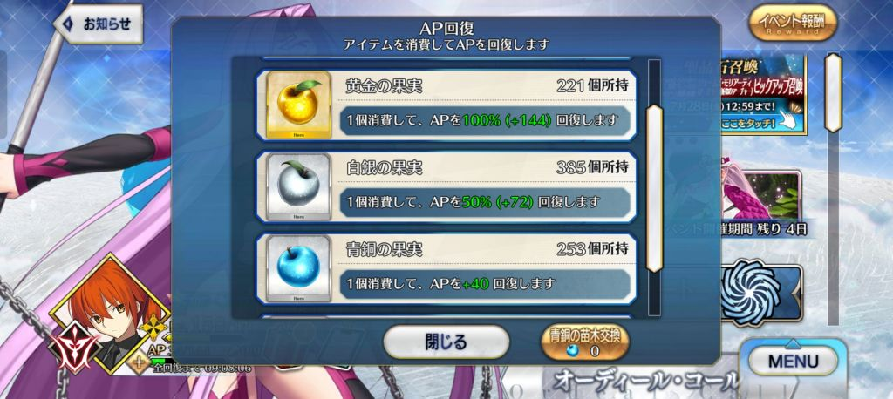

----

##### 59.[0] \<pid:704089220\> 2023-07-22 06:38:15 by AiakosG
一个既不敢在活动上强度又不能在深渊多上强度的同时没有pvp玩法的游戏却疯狂卡玩家练度真是要多缺心眼有多缺心眼

----

##### 60.[0] \<pid:704091133\> 2023-07-22 07:24:10 by 月亮末日
因为没东西，我最近玩的warframe，没体力限制能玩24小时不带停的

----

##### 61.[0] \<pid:704091154\> 2023-07-22 07:24:34 by 一念の差
>[jump](#pid704011872) UID62492053(2023-07-21 17:46) 说: 
>
>其实我要求也不高……我就想把六花的4个2000的古力特套装拿到就行，好像还有个变身器？我没有合体的其它几个船不要也行。15000自选SSR我根本想都没想，主要是我卡T4了2队船平均81级打不过……现在是改独角兽差图纸，推主线吧没油，刷T3吧油耗太大……突出个啥都干不了……

刷满100%会锁油的
t3不知道锁没锁

----

##### 62.[0] \<pid:704101463\> 2023-07-22 09:17:36 by 玖玖77
fgo不卡体力，平时种树活动爽刷

----

##### 63.[0] \<pid:704104094\> 2023-07-22 09:37:16 by 柚子汤圆
不卡体力的游戏我倒是见过一个
代价是养成材料需要大量的时间重复刷一个本去获得。
比如一个重要的稀有材料的掉率是0.2%
一个10%左右掉率的东西需要500个以上
充钱也没用

----

##### 64.[0] \<pid:704104379\> 2023-07-22 09:39:08 by 酷酷的猩
呃呃，永远都是生命防御垃圾没一个可以强的，无限体力不也是恶心人

----

##### 65.[0] \<pid:704104728\> 2023-07-22 09:41:39 by 小鸽白尼
体力系统手游最天才的的设计之一，配上抽卡的斯金纳箱能用很低的成本一举干翻传统游戏。
现在的手游策划比起传统制作，传统游戏目的是让玩家玩的爽然后付费，手游策划的工作就是百般刁难玩家让玩家玩的不爽来付费

----

##### 66.[0] \<pid:704105954\> 2023-07-22 09:51:02 by Vs_Code
>[jump](#pid704104728) 小鸽白尼(2023-07-22 09:41)说:
>体力系统手游最天才的的设计之一，配上抽卡的斯金纳箱能用很低的成本一举干翻传统游戏。 现在的手游策划比起传统制作，传统游戏目的是让玩家玩的爽然后付费，手游策划的工作就是百般刁难玩家让玩家玩的不爽来付费[s:ac:闪光]

十几年前的dnf就有体力了，没有体力值也有副本cd卡你，斯金纳箱更是国内策划玩了不知多少年的老东西了，真正说手游发明的，大概只有保底和648的统一标准定价了。

----

##### 67.[0] \<pid:704121828\> 2023-07-22 11:28:41 by mie001
管控玩家进度用的，为了延长内容的生命周期，给研发团队争取开发新内容的时间。“管控进度”其实是基础操作，只不过现在是靠控制玩家体力，再远古的时期是靠控制怪物刷新，控制装备掉落
之所以现在这么明显是因为手游厂商为了利润，开发成本要压低，所以更要拖时间

----

##### 68.[0] \<pid:704130164\> 2023-07-22 12:16:27 by 病_
体力/疲劳值/AP这个概念是用来限制用户对内容的消耗速度的  
 然后手游这块体力还有个作用就是卖钱

如果一个游戏到后面是体力用完没啥事干了这游戏肯定就有问题

----

##### 69.[0] \<pid:704130312\> 2023-07-22 12:17:15 by swingqaq
与其说是卡体力不如说是卡养成，而卡养成是网游诞生的时候就有的东西，不管是各种随机性，控制刷怪数量，高级本/团本cd本质都是为了限制养成速度的，不是说这个做法一定对，但是这个是对游戏寿命，或者说版本寿命来说是有必要的。
原的问题在于他什么都要体力，哪怕抛开钱和经验书，你还有武器材料，天赋材料，突破材料，周本boss材料，圣遗物这么多东西在和抢一天为数不多的体力。圣遗物还是一个投入巨量体力才会有收获的东西，甚至可能你这个角色爆金币了，或者出了更加适配的圣遗物了，你现在在刷的都堪堪小毕业。开服时期这套养成线路可能还行，但到了现在，要养的角色越来越多，养了没用的角色也出现了，没有优化没有减负，也没有不需要体力的平行系统来提供其他的养成体验或者玩法，就会觉得卡体力卡的无比难受。
暴论：深罪浸礼者和急冻树在本质上并没有区别，原神到现在的养成系统仍然是一滩死水没有任何变化

----

##### 70.[0] \<pid:704160892\> 2023-07-22 15:42:30 by 星光_夜芒
卡体力从而卡养成进度吧，装备养毕业了就没有热情了。现在我对“国产二游”印象就是抽卡、角色碎片、卡体力，总之不是啥太好的观感。
找手游的话，苹果外区，例如港区APP store，付费榜从上往下，还是有挺多质量不错的手游的谷歌商店则稍微乱一点。内地平台就算了，很多游戏引不进，卧龙凤雏太多，哗啦啦地买推广。

----

##### 71.[0] \<pid:704165067\> 2023-07-22 16:12:55 by AAO233
体力主要用途不是赚钱，是用来给制作组苟时长，不然你玩爽了发现制作组产能不够弃坑了咋整。每天限制你玩一会，等你体验完毕了我下个版本就出来了，双赢。

FGO不卡你体力是因为人家产能约等于零，有没有产出全看老板今天是上班还是去玩原神，你们玩家爱咋滴咋滴吧下次更新记得回来抽满宝提妈。

----

##### 72.[0] \<pid:704191247\> 2023-07-22 18:51:34 by Jebdish
lz你想想玩的爽的“爽”到底是圣遗物出货，还是攻略圣遗物副本本身

----

##### 73.[0] \<pid:704191677\> 2023-07-22 18:53:35 by UID62492053
>[jump](#pid704191247) Jebdish(2023-07-22 18:51) 说: 
>
>lz你想想玩的爽的“爽”到底是圣遗物出货，还是攻略圣遗物副本本身

我指的是那种我上线后有点事情干。但是现在我接触的几个游戏都是没有体力的时候一点事情都不能干。这么比下来原还能不需要体力的探索找箱子，虽然没什么性价比但是是“有东西可以玩”

----

##### 74.[0] \<pid:704193541\> 2023-07-22 19:04:41 by Drinton
每次讲到体力问题我就想到gbf，那个真的不卡，你想玩可以坐着高强度24小时一直玩

