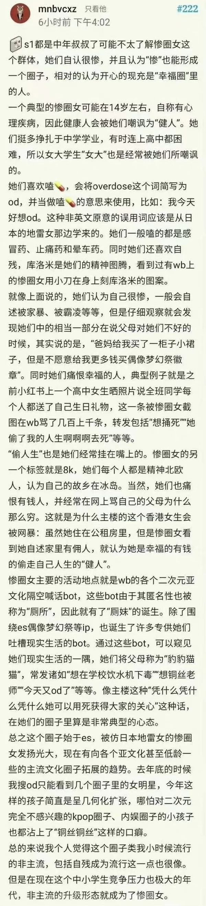

### [热点事件]里茶有律师吗？  关于骂人的问题

Made by ngapost2md (c) ludoux [GitHub Repo](https://github.com/ludoux/ngapost2md)

##### 热门回复

- [1楼](#pid703998815): 也许散解要的不是保护waf也不是为同担伸...

----

##### 0.[4] \<pid:0\> 2023-07-21 16:41:13 by Thl111
我以前听律师科普过，刑法或治安管理上的“侮辱”必须指名道姓+公然，一对一私下骂或者不指名道姓算不上违法，但可能构成民事侵权。
如果借私下的事情去起哄闹事，会可能构成寻衅滋事。
所以散解们最好的解决办法应该是民事起诉吧？

----

##### 1.[43] \<pid:703998815\> 2023-07-21 16:46:31 by 子万易卯丛岑
也许散解要的不是保护waf也不是为同担伸张正义，而是借这件事来让米哈游出手打压散黑(或者说她们看不惯的角色厨)呢？

----

##### 2.[17] \<pid:703999418\> 2023-07-21 16:49:10 by 小景一郎
你觉得以散解的平均年龄和文化程度搞得出这种事情么，估计只是想玩双标拿个例污名化群体，给某些群体扣一顶很大很大的帽子方便她们站在道德高地罢了 ，以她们的三观可能会在意我们祖辈过去的伤痛么，一想到我们民族受过的伤痛被她们拿来当武器攻击他人，我就想把这群小东西的嘴撕烂

----

##### 3.[16] \<pid:703999422\> 2023-07-21 16:49:11 by wuyu333
你怎么会认为之前玩命洗岁月史书的人多在乎历史呢

----

##### 4.[7] \<pid:703999658\> 2023-07-21 16:50:14 by 经常看书看得开
是不是自导自演都说不准呢

----

##### 5.[6] \<pid:703999935\> 2023-07-21 16:51:24 by 子吉桂己殷廖
因为他们不是真的因为共情那些苦难者哇当枪使达到自己目的罢了，不然早报警了

----

##### 6.[5] \<pid:703999944\> 2023-07-21 16:51:27 by yenfsjs
首先这件事搞清楚了吗，到底是不是两边互骂侮辱以及在哪个平台骂的，还是疑似反串，能不能先报警查清楚，一并整治

----

##### 8.[0] \<pid:704000547\> 2023-07-21 16:53:51 by sunshine23334
我想开始怀疑散解敢报警让警方介入吗？可以的话既能为自己主持公道，她们手里也拿了把武器，如果不报，这代表什么意思我不好说

----

##### 9.[1] \<pid:704001077\> 2023-07-21 16:56:02 by xxd1919
民事起诉，首先你要有个人信息，其次管辖原告就被告，这就已经让99%的人退却了，现在针对网络上的个人纠纷真能battle到法院去的哪个不是又钱又有闲的人。

----

##### 10.[1] \<pid:704006700\> 2023-07-21 17:21:35 by 无料通贩商
昨天存的

----

##### 11.[0] \<pid:704007769\> 2023-07-21 17:26:11 by 球球游侠
散解可以拿任何她们能利用的东西来党同伐异，它们不具备正常人该有的三观，脑袋里只有被粉头灌输的洗脑包和对别的群体的恨

----

##### 12.[0] \<pid:704007965\> 2023-07-21 17:26:56 by hx0539
咋说呢，用waf这个骂人确实不妥，但为什么我这么希望()厨去把老米告了呢他们闹得越大越好

----

##### 13.[0] \<pid:704009975\> 2023-07-21 17:37:03 by 樱木花kun
可能在她们的认知里，米哈游就是“衙门”吧。或者说想让米哈游法务部去“反黑”。在我看来两个人打嘴仗，犯不着兴师动众。

----

##### 14.[0] \<pid:704012969\> 2023-07-21 17:52:27 by 普露璐特
我觉得是怕报警查出来是伞解自导自演的

----

##### 15.[0] \<pid:704015903\> 2023-07-21 18:07:06 by 潜水企鹅
有可能是三姐自导自演，想借米哈游的刀杀人(散黑)而已。
记得仙散一家亲，既然仙拜鬼，那么三姐罕见搞事也很正常。

