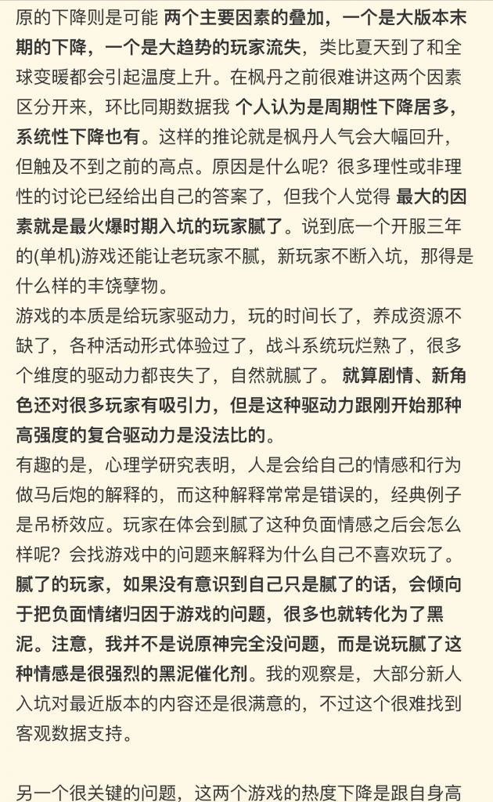
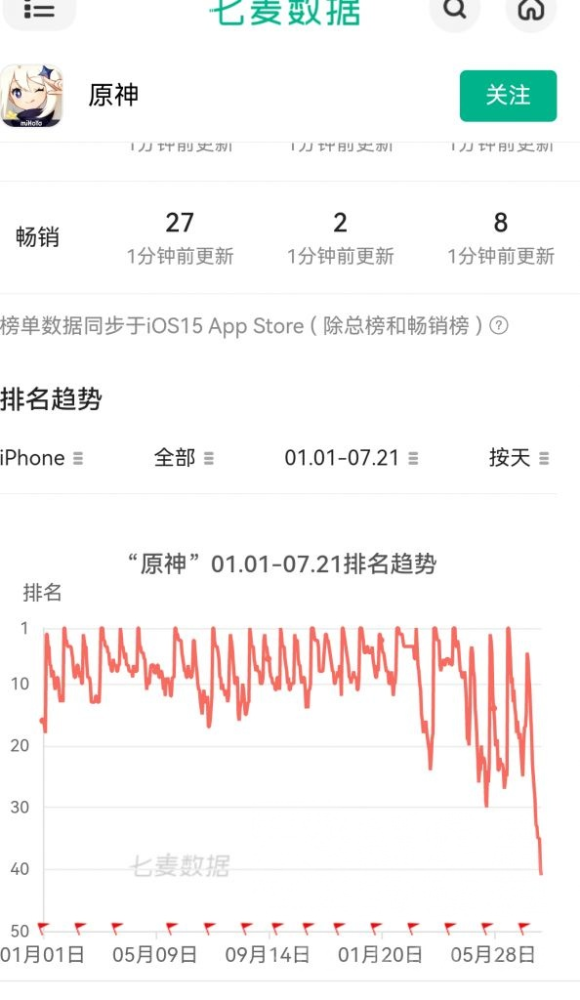
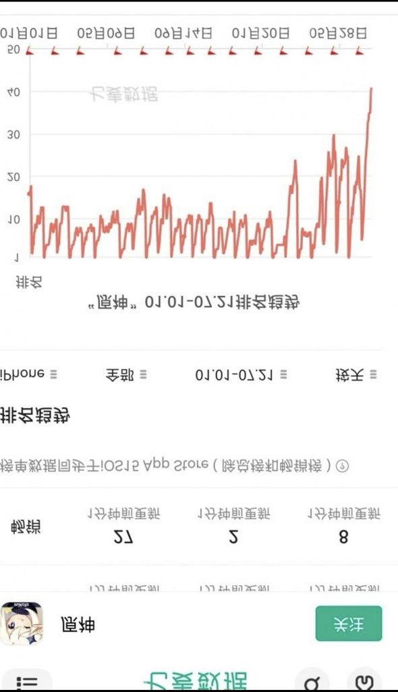

### [不吐不快]说一些戳肺管子的话

Made by ngapost2md (c) ludoux [GitHub Repo](https://github.com/ludoux/ngapost2md)

----

##### 0.[1] \<pid:0\> 2023-07-22 11:11:36 by ohgscn
(贴图放附件)
前因是刚才在手综看到的，总结一下：
<b> “因为玩家腻了，所以产生负面情绪，负面情绪转化黑泥”</b>
(避重就轻的说一些车轱辘话)

通篇意思就是：原没做错什么，有错的是某些玩家，某些玩家太苛刻了

前后没提到：角色超长时间不复刻，剧情低幼化，文案塞私货，卖cp，地图同质化，新角色设计趋向小众化，吃书情况严重等等这些都是要命的问题
(还是那句话：问题当作看不见，只要没人提就当不存在)

前面部分还提到了崩铁，说崩铁三个月目标玩家趋向于稳定；就问他们到底玩不玩崩铁啊，就崩铁65级突破后的难度，玩家等级0提升，怪物提升一个台阶，打周本那叫一个难受，从10分钟变成15分钟的游戏，问题掉落物基本不变，但是膨胀比原还严重。

然后底下有人说，看新玩家玩的也很好，两三个月就能满星，那只能说666了

对了，前段时间是谁在大规模的复制“awwbwg”的场面，不会都忘了吧

这些手综里面的是不是云玩家比较多啊，突出一个云玩家的自信，以后他们不贴资格证发言，一律当作云玩家。

----

##### 1.[0] \<pid:704118895\> 2023-07-22 11:12:32 by mithy-
这个版现在整个版面全是爆典，服气

----

##### 2.[2] \<pid:704120163\> 2023-07-22 11:19:45 by lingwzhui
那为什么老玩家会腻呢
快三年了，活动依然是4399，地图越来越显得大而空，一眼望去就知道哪些能互动哪些不能，解密基本靠藏来给玩家加难度，常驻玩法就一个七圣还不好玩，不腻才有鬼了
一款长期运营的游戏在舒适区里待到死都不愿意尝试做出一些新玩法，那么他作为一款<b>游戏</b>，不好玩就是最大的罪过，我现在看米哈游撅一下屁股都知道他活动要拉什么*  ，能不腻吗

----

##### 3.[1] \<pid:704120487\> 2023-07-22 11:21:29 by Lilith330
他们也会承认原在下降啊，还以为会咬死不松口呢，都是噪音，继续蒸

----

##### 4.[0] \<pid:704120758\> 2023-07-22 11:22:55 by 阳光彩虹小尼马
>[jump](#pid704120487) Lilith330(2023-07-22 11:21)说:
>他们也会承认原在下降啊，还以为会咬死不松口呢，都是噪音，继续蒸

我看到有个拿指数证明原蒸蒸日上开香槟的。尊重祝福好吧

----

##### 5.[0] \<pid:704121077\> 2023-07-22 11:24:38 by 滑稽︶﹋
上月原神流水观圣提高了pc系数的情况下都能同比跌10e，这月就更不用说了。ios排名应该是最直观的了

----

##### 6.[0] \<pid:704122824\> 2023-07-22 11:34:06 by jasmine4869
知乎老米风评最好，也是云玩家遍地

----

##### 7.[0] \<pid:704122836\> 2023-07-22 11:34:11 by 我流伦子哥
简单总结：都是玩家的错，这届玩家不行

----

##### 8.[1] \<pid:704123045\> 2023-07-22 11:35:25 by cl960908
学长不会承认热度下降，但是会在热度回升后蹦出来
所以讨论时不要把热度下降作结论，而是当成前提

----

##### 9.[0] \<pid:704123280\> 2023-07-22 11:36:43 by yuzuyuzuy
《我的观察是，大部分...》
《很难找到客观数据支撑》

----

##### 10.[0] \<pid:704123354\> 2023-07-22 11:37:03 by bug失去联系
首先，我们会说原神蒸蒸日上
然后，我们会说原神也不是一点问题也没有
我挺欣慰的，就算是手综结晶也不自觉步入第二阶段了

----

##### 11.[1] \<pid:704123526\> 2023-07-22 11:37:52 by ohgscn
>[jump](#pid704120487) Lilith330(2023-07-22 11:21) 说: 
>
>他们也会承认原在下降啊，还以为会咬死不松口呢，都是噪音，继续蒸

你在那边发帖说热度下降会被删帖(堵嘴)

----

##### 12.[0] \<pid:704123705\> 2023-07-22 11:39:02 by 本次项目成功
有道理的，因为玩腻了所以是玩原神玩的

总结成功

----

##### 13.[0] \<pid:704123870\> 2023-07-22 11:40:05 by 我御御了
我还真想听他夸夸o神现在哪点做得好

----

##### 14.[1] \<pid:704123892\> 2023-07-22 11:40:11 by 嘀嘟滴嘟嘀
让人家承认游戏在下跌已经不容易了，你居然还想让人家承认它米爹错了？

----

##### 15.[0] \<pid:704124109\> 2023-07-22 11:41:32 by yuzuyuzuy
>[jump](#pid704123354) bug失去联系(2023-07-22 11:37) 说: 
>
>首先，我们会说原神蒸蒸日上
>然后，我们会说原神也不是一点问题也没有
>我挺欣慰的，就算是手综结晶也不自觉步入第二阶段了

别蒸了

蒸蒸日上那位看江之岛的统计7月流水要艹原了

----

##### 16.[0] \<pid:704124343\> 2023-07-22 11:42:58 by cccherch
我的观察是，能在手综这些地方坚持当结晶的人，基本都没给他迷迭氪过多少钱，不然现在也不至于下滑咯

----

##### 17.[0] \<pid:704125593\> 2023-07-22 11:50:34 by 御坂2180号
现在手游也搞这套了吗我记得以前主机游戏不行的时候，也是这个说法，这届玩家不行

----

##### 18.[0] \<pid:704125969\> 2023-07-22 11:52:46 by fealib
我玩洛奇玩20年都不会腻，三年就腻的游戏应该自己反省一下

----

##### 20.[0] \<pid:704128479\> 2023-07-22 12:06:48 by 长风未尽
不一定是手综啦，主板都一堆这种人

----

##### 21.[0] \<pid:704128712\> 2023-07-22 12:08:09 by 吞花嚼茶

你要承认，一些人是做不到实事求是客观分析的，和他们讨论简直就是浪费自己的生命

----

##### 22.[0] \<pid:704133118\> 2023-07-22 12:33:35 by 马小跳i
其实没这么多人关心剧情，但是现在真的很无聊

----

##### 23.[0] \<pid:704137243\> 2023-07-22 12:57:55 by Aby星人
我的朋友3.4入坑3.63.7连着黑泥，这次3.8的宝宝巴士他甚至评价虽然很弱智，但起码比3.7好了，所以两个版本也会腻是吧

----

##### 24.[1] \<pid:704137723\> 2023-07-22 13:00:45 by ptreesptrees
游戏会玩腻很正常,魔兽世界我玩腻过,明日方舟fgo也玩腻过,但都是和平退坑,腻了就换个游戏,被剧情恶心到而退坑的原神真是独此一家.
避开这个核心问题不谈,那就不用谈了

----

##### 25.[0] \<pid:704138050\> 2023-07-22 13:02:42 by Teddydesu
至少承认现在原没以前好了

----

##### 26.[0] \<pid:704138502\> 2023-07-22 13:05:25 by pxn360529052
确实那当然是我的错，米忽悠必不可能有错，我要是脑子没问题会鬼迷心窍下你米忽悠的游戏来玩？
我现在变成这么恨米忽悠那确实是玩原神玩的，我原来没玩过原神还觉得哪怕借鉴了，部分原黑是不是有点过分了追着米忽悠黑，现在我懂了，这都是米忽悠的应得的，米黑都是玩原神玩的，我脑子有问题才玩米家游戏，都是我的错，米忽悠没有一点错

----

##### 27.[0] \<pid:704142424\> 2023-07-22 13:30:27 by mk311ols
>[jump](#pid704133118) 马小跳i(2023-07-22 12:33) 说: 
>
>其实没这么多人关心剧情，但是现在真的很无聊

这就是不让跳过的反噬

----

##### 28.[0] \<pid:704144930\> 2023-07-22 13:47:39 by 駄天使·夜羽
手综版说白了不就是桥洞，一群老鼠蟑螂被正常人打扫门户的时候顺手从家里赶出去，跑到桥洞底下自己搭了个米氏厕所，自己造屎自己吃，这就是手综版

----

##### 29.[0] \<pid:704147375\> 2023-07-22 14:04:27 by szqiyimu
>[jump](#pid704122824) jasmine4869(2023-07-22 11:34) 说: 
>
>知乎老米风评最好，也是云玩家遍地

知乎永远都是跟在背后吃屎的那个

----

##### 30.[0] \<pid:704147398\> 2023-07-22 14:04:36 by 友项
>[jump](#pid0) ohgscn(2023-07-22 11:11) 说: 
>
>(贴图放附件)
>前因是刚才在手综看到的，总结一下：
><b> “因为玩家腻了，所以产生负面情绪，负面情绪转化黑泥，黑泥多了导致原的热度下降”</b>
>(避重就轻的说一些车轱辘话)
>
>通篇意思就是：原没做错什么，有错的是某些玩家，某些玩家太苛刻了
>
>前后没提到：角色超长时间不复刻，剧情低幼化，文案塞私货，卖cp，地图同质化，新角色设计趋向小众化，吃书情况严重等等这些都是要命的问题
>(还是那句话：问题当作看不见，只要没人提就当不存在)
>
>从原外面看：二创质量下降，厨子大战，仙魔当道
>
>前面部分还提到了

资格证也没用，资格证他们可以偷别人氪佬的截图。要查成分还是mys好使

----

##### 31.[1] \<pid:704147619\> 2023-07-22 14:06:12 by 我流伦子哥
>[jump](#pid704128478) 先R再R最后R(2023-07-22 12:06) 说: 
>
>什么世另我，你说的这帖子，还有隔壁2个月满星的帖子恰好我都看到了
>那个满星的只能说抽卡非常极限，恰好抽到强度人权卡，于是有权在深渊打满
>换句话说，但凡抽卡不是那样规划的普通玩家，那要么氪，要么忍，要么润
>考虑到我之前逛隔壁，天天有人说O如何弱保软，特意回来玩了一个多月的O，然后……然后深渊12层碰不了一点而且是压力陡升的那种，我就想说米的这个深渊的设计思路实在是无力吐槽

策划看到你这句话，下次一定会从提升11层难度来优化你说的12层难度陡升问题

----

##### 32.[0] \<pid:704148195\> 2023-07-22 14:10:34 by 945367289哦
有1说1，我记得远古时代手综版不是禁o并且喷o的吗，怎么现在反过来了

----

##### 33.[0] \<pid:704149259\> 2023-07-22 14:17:49 by 先R再R最后R
>[jump](#pid704147619) 我流伦子哥(2023-07-22 14:06)说:
>[quote][pid=704128478,37091159,1]Reply[/pid] <b>Post by [uid=22998743]先R再R最后R[/uid] (2023-07-22 12:06):</b>  [s:ac:哭笑]什么世另我，你说的这帖子，还有隔壁2个月满星的帖子恰好我都看到了 那个满星的只能说抽卡非常极限，恰好抽到强度人权卡，于是有权在深渊打满 换句话说，但凡抽卡不是那样规划的普通玩家，那要么氪，要么忍，要么润 考虑到我之前逛隔壁，天天有人说O如何弱保软，特意回来玩了一个多月的O，然后……然后深渊12层碰不了一点[s:ac:哭笑]而且是压力陡升的那种，我就想说米的这个深渊的设计思路实在是无力吐槽[/quote]策划看到你这句话，下次一定会从提升11层难度来优化你说的12层难度陡升问题[s:ac:哭笑]

那我必须大力支持，特意上线填写非常简单，然后继续不上线状态

----

##### 34.[0] \<pid:704151348\> 2023-07-22 14:32:51 by Nghez
>[jump](#pid704148195) 945367289哦(2023-07-22 14:10) 说: 
>
>有1说1，我记得远古时代手综版不是禁o并且喷o的吗，怎么现在反过来了

他们也有任务啊，没人了就只能变成这样了

----

##### 35.[0] \<pid:704151681\> 2023-07-22 14:35:33 by 駄天使·夜羽
>[jump](#pid704148195) 945367289哦(2023-07-22 14:10)说:
>有1说1，我记得远古时代手综版不是禁o并且喷o的吗，怎么现在反过来了[s:ac:哭笑]

毕竟其他游戏有自己的板块自己的家，不会没事跑到桥洞去睡。而那些被原版赶出去的蛆虫别的本事没有，圈地控评最在行，此消彼长，自然就变成他们的私家厕所了。

----

##### 36.[0] \<pid:704151754\> 2023-07-22 14:36:02 by 仰望天下间
>[jump](#pid704121077) 滑稽︶(2023-07-22 11:24) 说: 
>
>上月原神流水观圣提高了pc系数的情况下都能同比跌10e，这月就更不用说了。ios排名应该是最直观的了

不要瞎说，我们原宝在蒸蒸日上哦

----

##### 37.[0] \<pid:704152161\> 2023-07-22 14:38:51 by 已经成为了一种笑话
>[jump](#pid704148195) 945367289哦(2023-07-22 14:10) 说: 
>
>有1说1，我记得远古时代手综版不是禁o并且喷o的吗，怎么现在反过来了

很多游戏都有自己的板块，玩家也都在自己的板块待着，只有桥洞人没有家，只能在手综流浪

就像某些游戏没有游戏内容，结晶只能做完每日清完体力然后去其他社区尽孝

----

##### 38.[0] \<pid:704152267\> 2023-07-22 14:39:34 by 有梦想的非酋
手综区不是云玩泛滥有多评价游戏的是真的一直在玩的老玩家

----

##### 39.[0] \<pid:704153098\> 2023-07-22 14:45:57 by tr1gger3
手综以前都是手游蝗虫什么游戏没玩过，小众冷门，外服游戏，dmm你想问的那边都能解答，而近两三个月流浪到手综的都是些什么臭鱼烂虾，突出一个游戏没玩个几个，眼高手低又要在那锐平，万物皆可转米，不知道以为是米哈游内部策划在那吹水呢，优越感爆棚

----

##### 40.[0] \<pid:704158400\> 2023-07-22 15:24:43 by xlsq03
我就不明白原神这逼游戏自称开放世界，限时地图做个车还要绑着支线才能坐
哪怕你仅仅是绑活动主线呢

----

##### 41.[1] \<pid:704161550\> 2023-07-22 15:47:27 by gyhggg
以前我也常待瓜版不进子版，因为主板常有人直接剧透，我只想自己玩完，瓜版那边基本没黑泥的，无形中维持了我的纯度，后面3.6太逆天，心里有个疙瘩，里茶那2000赞帖冲上热帖我才发现这里。

----

##### 42.[0] \<pid:704164329\> 2023-07-22 16:07:37 by 他一直都是对的
>[jump](#pid704153098) tr1gger3(2023-07-22 14:45) 说: 
>
>手综以前都是手游蝗虫什么游戏没玩过，小众冷门，外服游戏，dmm你想问的那边都能解答，而近两三个月流浪到手综的都是些什么臭鱼烂虾，突出一个游戏没玩个几个，眼高手低又要在那锐平，万物皆可转米，不知道以为是米哈游内部策划在那吹水呢，优越感爆棚

真的 一群除了数的过来的米系二游什么都没玩过还拿着那几篇小作文到处批判所有游戏的贵物，连云都舍不得云一下，对米跌太忠诚了

----

##### 43.[1] \<pid:704165135\> 2023-07-22 16:13:23 by innominate
>[jump](#pid704153098) tr1gger3(2023-07-22 14:45) 说: 
>
>手综以前都是手游蝗虫什么游戏没玩过，小众冷门，外服游戏，dmm你想问的那边都能解答，而近两三个月流浪到手综的都是些什么臭鱼烂虾，突出一个游戏没玩个几个，眼高手低又要在那锐平，万物皆可转米，不知道以为是米哈游内部策划在那吹水呢，优越感爆棚

去年我还逛逛手综，现在都懒得逛了，看帖子标题就能猜到底下的宗教信徒们会怎么回复，有种脑回路单一的美

----

##### 44.[0] \<pid:704165720\> 2023-07-22 16:17:25 by 阿古斯的影灵衣
游戏的长线运营和更新也不能一概而论

现在原神基本走的mmorpg的资料片更新方式，以年为周期出新地图，新战斗思路，新的交互方式

通过调整怪物分布和属性达到“修改职业平衡”的效果

这种更新方式其实挺难的，因为是强玩法驱动

比如gw2凯珊那一坨屎就只能靠卖新传奇外观和通过高回报日常周常逼迫玩家上线(是不是很眼熟)

美术音乐是可以靠钱解决的，可惜玩法不太能

----

##### 45.[0] \<pid:704166735\> 2023-07-22 16:24:25 by LoldtiA
第一阶段，我们宣称什么事都没发生
第二阶段，我们会说都是友商打压，但不需要我们做出应对
第三阶段，我们会说也许原或许某些地方确实做的不够好，但这更主要是玩家玩原神玩的。
第四阶段，已经太迟了。

----

##### 46.[0] \<pid:704169046\> 2023-07-22 16:39:31 by 奇迹沼
谁没事看手综啊，这不就知道了手综一片云玩家的吗，隔壁也有挺多的，我甚至在隔壁看到有人夸原神女角色出的又多又好的

----

##### 47.[0] \<pid:704172687\> 2023-07-22 17:04:15 by tr1gger3
>[jump](#pid704165135) innominate(2023-07-22 16:13)说:
>[quote][pid=704153098,37091159,2]Reply[/pid] <b>Post by [uid=63695785]tr1gger3[/uid] (2023-07-22 14:45):</b>  手综以前都是手游蝗虫什么游戏没玩过，小众冷门，外服游戏，dmm你想问的那边都能解答，而近两三个月流浪到手综的都是些什么臭鱼烂虾，突出一个游戏没玩个几个，眼高手低又要在那锐平，万物皆可转米，不知道以为是米哈游内部策划在那吹水呢，优越感爆棚[s:ac:哭笑][/quote]去年我还逛逛手综，现在都懒得逛了，看帖子标题就能猜到底下的宗教信徒们会怎么回复，有种脑回路单一的美

现在那边可以说是蔷薇聚集地了，我刚发个妮可事业线的变化在那没几分钟就冒烟了

----

##### 48.[0] \<pid:704175327\> 2023-07-22 17:22:07 by freonsuzuka
yysy怨气和不满确实一直在积攒，只是曾经玩家对这个游戏的爱让大家装出一副其乐融融的样子，但是有些东西太过恶心让大家破罐破摔彻底不想装了

----

##### 49.[0] \<pid:704176051\> 2023-07-22 17:27:24 by shiroe_tothewhite
“我的观察是，大部分新人还是满意的，不过很难找到客观数据支持”
前面洗了一整页最后来这么一句，那你说你吗呢

----

##### 50.[0] \<pid:704182518\> 2023-07-22 18:01:44 by 要一杯杨枝甘露
只能说3.2我游戏体验高涨，3.3直接一转直下好吧

----

##### 51.[0] \<pid:704183541\> 2023-07-22 18:07:00 by 叶落寒宵
不管如何，原就是蒸，你不服气？

