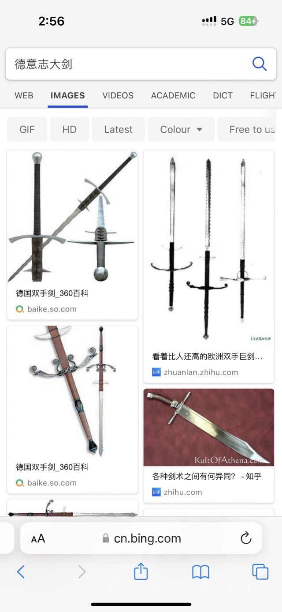
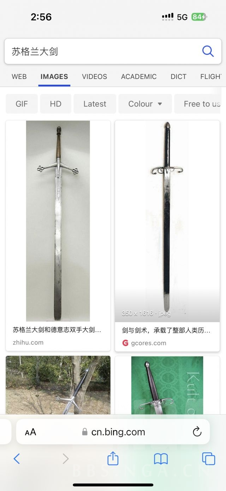

### [不吐不快]从崩3到原神，为什么米厂做不出一个拿得出手的大剑角色

Made by ngapost2md (c) ludoux [GitHub Repo](https://github.com/ludoux/ngapost2md)

----

##### 0.[0] \<pid:0\> 2023-07-22 13:40:53 by 原质提纯器
唯一拿得出手的居然还是靠吹外观，笑嘻了

----

##### 1.[0] \<pid:704150659\> 2023-07-22 14:27:35 by 本次项目成功
有点好奇古代有拿大剑的名将或者什么吗

我感觉大剑作为武器好别扭。。选材就很差

----

##### 2.[0] \<pid:704150947\> 2023-07-22 14:29:46 by StaryKnight
姥爷和一斗也很帅啊

----

##### 3.[0] \<pid:704151029\> 2023-07-22 14:30:30 by jasmine4869
古代应该是叫重剑吧
回标题，估计真是底层逻辑了，不喜欢做也做不好，但还是要拿做不好的出来卖钱

----

##### 4.[0] \<pid:704151147\> 2023-07-22 14:31:20 by 顾羽observer
薪炎就很好啊
啊，是双枪啊，那没事了

----

##### 5.[0] \<pid:704151252\> 2023-07-22 14:32:06 by Rudimentary
我的理解，大剑的特色是牺牲速度敏捷等，换高伤害。但是数值游戏那不可能让某类武器真的伤害高，所以就几乎只剩弱点了

----

##### 6.[0] \<pid:704151282\> 2023-07-22 14:32:22 by 零点，陈彬
大剑，隔壁怪猎大剑是真难，我也就用双刀和虫棍远程用重弩

----

##### 7.[0] \<pid:704151649\> 2023-07-22 14:35:20 by 等把美又强的剑
大剑如果真的设计出来伤害必须超模，以难以顺畅操作的代价，可惜网游很难这样设计。

----

##### 8.[0] \<pid:704151827\> 2023-07-22 14:36:26 by タウィル
>[jump](#pid704150659) 本次项目成功(2023-07-22 14:27)说:
>有点好奇古代有拿大剑的名将或者什么吗  我感觉大剑作为武器好别扭。。选材就很差

门板大剑是幻想世界才有的,
现实世界那种德国双手剑都没那么大

----

##### 9.[0] \<pid:704151974\> 2023-07-22 14:37:31 by 魑魅魍魉魖魌
就是不想罢了。就算大剑普攻手感一坨，也可以通过超模eq技能当个后台c或者辅助，然而你看大剑后台角色都是什么样的？

----

##### 10.[0] \<pid:704152094\> 2023-07-22 14:38:23 by muziqiduan
诺艾尔还行，至少我和很多玩家开服就是女仆把队伍养大的。

----

##### 11.[0] \<pid:704152130\> 2023-07-22 14:38:36 by 小kotomi
风辅把韧性做崩了，大剑自然无用。我个人认为大剑应该是代表强削韧和低端高伤。数值不可能给高，韧性被风辅值班。自然没优势

----

##### 12.[0] \<pid:704152631\> 2023-07-22 14:42:29 by 魑魅魍魉魖魌
>[jump](#pid704152130) 小kotomi(2023-07-22 14:38) 说: 
>
>风辅把韧性做崩了，大剑自然无用。我个人认为大剑应该是代表强削韧和低端高伤。数值不可能给高，韧性被风辅值班。自然没优势

就算没有风聚怪，大剑那个强削韧体感也不一定好，太强的削韧会把轻型怪打飞，我以前用小号迪卢克主c下深渊的时候，总是把小怪推出班尼特圈子导致吃不到奶和加攻。

----

##### 13.[0] \<pid:704152832\> 2023-07-22 14:43:51 by vegetbird
别的rpg大剑高伤害是要以双持不能拿副手作代价的，再加些笨重的debuff，你O没有副手装备平衡伤害属性，那不就只剩笨重了么

----

##### 14.[0] \<pid:704152973\> 2023-07-22 14:44:57 by lLerry
大剑手感我喜欢幻塔最近的夏佐，呼来呼去(字面)的太爽了，攻速很快力度也很足从来没玩过这么快乐的大剑

----

##### 15.[0] \<pid:704153000\> 2023-07-22 14:45:10 by 即使只身一人
>[jump](#pid704151252) Rudimentary(2023-07-22 14:32) 说: 
>
>我的理解，大剑的特色是牺牲速度敏捷等，换高伤害。但是数值游戏那不可能让某类武器真的伤害高，所以就几乎只剩弱点了

所以就让其他武器类型伤害高？

----

##### 16.[0] \<pid:704153461\> 2023-07-22 14:48:45 by shidao6376
>[jump](#pid704152094) muziqiduan(2023-07-22 14:38)说:
>诺艾尔还行，至少我和很多玩家开服就是女仆把队伍养大的。

诺艾尔的普攻动作不是几乎照搬尼尔机械纪元里面的吗

----

##### 17.[0] \<pid:704153901\> 2023-07-22 14:52:00 by 风之碧海之翠
感觉不如替身攻击…………雷泽

----

##### 18.[0] \<pid:704154298\> 2023-07-22 14:54:38 by 先R再R最后R
刚还想反驳，又想了想，好像我混淆了游戏和现实
游戏的话，双手武器的代价的速度和没有副手，优势是属性和数值，但O没副手的概念，武器的属性不敢给高、特效更是不可能，就卡住了
现实的话，双手大剑其实是范围偏小但攻速高的(对比单手剑的刺击动作)，靠周身抡着旋转攻击来持续输出，代价是范围不如枪和单手剑，而且训练成本爆炸~~懂了大剑角色养成再卡紧一点~~
说实话就米现在这个设计，大剑确实完全没特色(除了手感迟钝)
所以隔壁优化好了，按命途来，别惦记你那武器类型了

----

##### 19.[0] \<pid:704154428\> 2023-07-22 14:55:28 by Fablet
为什么米没有超级酷炫的火大剑呢()
说实在的，大剑教派例如黑魂，多半掺和了点剑风传奇时代留下来的信仰，通过持握不便的方式换高伤害，攻速慢。
但米这边对于大剑教派似乎有点偏见，例如举不起大剑还得别人帮忙举……轻盈和美观肯定比不上人上人的法器嘛。  
~~所以米真的是没品味的东西~~

----

##### 20.[0] \<pid:704154712\> 2023-07-22 14:57:39 by bluebayouplus
大剑可以削韧，但深渊里一群武装直升机和陆行舰，还自带反甲，用不上

----

##### 21.[0] \<pid:704154870\> 2023-07-22 14:58:46 by 魑魅魍魉魖魌
>[jump](#pid704154298) 先R再R最后R(2023-07-22 14:54) 说: 
>
>刚还想反驳，又想了想，好像我混淆了游戏和现实
>游戏的话，双手武器的代价的速度和没有副手，优势是属性和数值，但O没副手的概念，武器的属性不敢给高、特效更是不可能，就卡住了
>现实的话，双手大剑其实是范围偏小但攻速高的(对比单手剑的刺击动作)，靠周身抡着旋转攻击来持续输出，代价是范围不如枪和单手剑，而且训练成本爆炸~~懂了大剑角色养成再卡紧一点~~
>说实话就米现在这个设计，大剑确实完全没特色(除了手感迟钝)
>所以隔壁优化好了，按命途来，别惦记你那武器类型了![哭

(https://img4.nga.178.com/ngabbs/post/smile/)大剑整体长度更长吧，为什么攻击范围还更小？

----

##### 22.[0] \<pid:704154902\> 2023-07-22 14:59:01 by 凝紫寒C
我会想到剑三的藏剑(轻剑攒剑气重剑消耗剑气)作为70年代玩家，那个年代的藏剑作为PVE主力输出，重剑还是挺爽的……

----

##### 23.[0] \<pid:704154934\> 2023-07-22 14:59:18 by 哇库哇库今天吃什么
雷神都能拔刀变单手剑，公子都能切换变近战，迪希雅都能大招变打拳，鹿野院都能手拿法器打军体拳，你说米哈游为什么不出差不多的大剑？
结果那还不是显而易见吗

----

##### 25.[0] \<pid:704155435\> 2023-07-22 15:03:11 by Sue_91
有一说一，我觉得一斗作为一个大剑角色做得真挺好的，不管是机制还是手感还是天赋命座之间的连贯性，当然外观见仁见智。
不过他实在太冷门了，还是命座战士，云懂哥远多于真玩家，举个例子我至今还能在各处看见一群xjb科普说一斗重击只是抗打断强不是真霸体的

而且岩系最关键的是还有其他难以忽视的问题(。

----

##### 26.[0] \<pid:704155655\> 2023-07-22 15:04:29 by 黑蜀黍电动输弹机
>[jump](#pid704150659) 本次项目成功(2023-07-22 14:27):

门板大剑是日式奇幻产物
德双手或者苏格兰阔剑都是确有其物，德双手更是日耳曼佣兵团或者说国土佣仆的最爱。这群人是脱产专业部队，平时除了打架就是练剑(还有烧杀抢掠)拿的是双倍工资，任务就是挥舞巨剑做战场破阵突击队
德双手重也不过5-6kg(已经很重了)，长1米5-1米8都有，用起来迅捷如风，双手交替发力连段挥砍，速度和杀伤范围都远超单手剑，所谓大风车剑法，哪怕是单挑一群无甲喽啰，对面也是不敢上前的

----

##### 27.[0] \<pid:704156578\> 2023-07-22 15:11:06 by ZX_hysh
>[jump](#pid704155435) Sue_91(2023-07-22 15:03) 说: 
>有一说一，我觉得一斗作为一个大剑角色做得真挺好的，不管是机制还是手感还是天赋命座之间的连贯性，当然外观见仁见智。
>不过他实在太冷门了，还是命座战士，云懂哥远多于真玩家，举个例子我至今还能在各......

一斗只看思路做得挺好的。
岩系不吃风辅→缺聚怪→重击范围大，追怪强有小吸附
其中范围大就来自大剑，动作也大开大合很有感觉。

----

##### 28.[0] \<pid:704156674\> 2023-07-22 15:11:52 by 先R再R最后R
>[jump](#pid704154870) 魑魅魍魉魖魌(2023-07-22 14:58)说:
>[quote][pid=704154298,37092629,1]Reply[/pid] <b>Post by [uid=22998743]先R再R最后R[/uid] (2023-07-22 14:54):</b>  [s:ac:哭笑]刚还想反驳，又想了想，好像我混淆了游戏和现实 游戏的话，双手武器的代价的速度和没有副手，优势是属性和数值，但O没副手的概念，武器的属性不敢给高、特效更是不可能，就卡住了 现实的话，双手大剑其实是范围偏小但攻速高的(对比单手剑的刺击动作)，靠周身抡着旋转攻击来持续输出，代价是范围不如枪和单手剑，而且训练成本爆炸<del class='gray'> 懂了大剑角色养成再卡紧一点 </del> 说实话就米现在这个设计，大剑确实完全没特色(除了手感迟钝) 所以隔壁优化好了，按命途来，别惦记你那武器类型了[s:ac:哭[/quote]大剑整体长度更长吧，为什么攻击范围还更小？

这个是相对长枪和单手剑来说的，枪和单手剑是向前刺，枪好理解，单手剑的站位是侧身站位，单手向前刺击，能额外延展整个手臂的距离
双手的话，唔可以参考巫师里的杰洛特~~好像就是波兰的一种剑法~~，或者可以搜下于承惠老先生的剑术教学，剑身较多时候是绕着自己身体在旋转劈砍的，真正伸出去的距离不长，打起来一旦开转，其实就足够形成威慑了
不过西方的双手剑战绩多一些，而我国历史打起来更多是结阵对战，那长枪毫无疑问是第一选择，好练高效~~而且利刃对护甲的效果……不如拿个锤子~~，大剑的制造成本和训练成本都不合算，所以实战的内容我相对倾向于欧洲那边的记录一些，即精锐小队里的主力~~精锐的双手剑佣兵的工资都是其他人的几倍，训练太难了~~，倒也符合大部分游戏~~西幻~~里的设定

----

##### 29.[0] \<pid:704157096\> 2023-07-22 15:14:49 by wzqnb
德双？可以看看隔壁战双比安卡的直升机()

----

##### 30.[0] \<pid:704158241\> 2023-07-22 15:23:28 by 8991aiih
>[jump](#pid704157096) wzqnb(2023-07-22 15:14)说:
>德双？可以看看隔壁战双比安卡的直升机()[s:ac:哭笑]

深痕是吧
大剑攻速低什麽的不存在的，可变形武器就是这麽自信，大不了在空中放剑气

----

##### 33.[0] \<pid:704159281\> 2023-07-22 15:30:52 by 秘密首领艾华斯
崩三德尔塔说实话还行，事实上崩三最好的那段时间(原神开服前夕到开服后半年左右)设计还是不错的  
迷迭星猫德尔塔识律这几个动作和外观都很不错的装甲都是那段时间的，到了乐土时期就没动作只剩下外观了，现在外观也不咋地(悲)

----

##### 34.[0] \<pid:704161389\> 2023-07-22 15:46:10 by 摆烂的鱼鱼
大剑最初都有着攻速慢，爆发高，破盾削韧等特色。结果随着游戏越来越膨胀，互动性越来越低，反而让大剑没啥差异性优势了，劣势却放大了。

----

##### 35.[0] \<pid:704164860\> 2023-07-22 16:11:33 by fuchen828
什么时候来把亵渎圣剑这种玩意

----

##### 37.[0] \<pid:704166439\> 2023-07-22 16:22:25 by 樱木花kun
大剑想做好还得是走攻速流

----

##### 38.[0] \<pid:704168842\> 2023-07-22 16:38:15 by 密特菈斯
>[jump](#pid704152631) 魑魅魍魉魖魌(2023-07-22 14:42):

我记得热血英豪这古早游戏都有把人砸在地板上的操作，原神还只有击飞。

----

##### 39.[0] \<pid:704168912\> 2023-07-22 16:38:38 by 小kotomi
>[jump](#pid704152631) 魑魅魍魉魖魌(2023-07-22 14:42) 说: 
>
>就算没有风聚怪，大剑那个强削韧体感也不一定好，太强的削韧会把轻型怪打飞，我以前用小号迪卢克主c下深渊的时候，总是把小怪推出班尼特圈子导致吃不到奶和加攻。

但也不至于现在一样一无是处，可以考虑下圣骸兽会被大剑打断的话风评

----

##### 40.[0] \<pid:704169793\> 2023-07-22 16:44:28 by Violet≡
大剑就剩帅了全抽了

----

##### 41.[0] \<pid:704170098\> 2023-07-22 16:46:16 by 大西洋舰队总司令
刚看了那个锐评视频，做不出好的大剑角色算是mhy的技术难题，很显然mhy并不想解决这个问题。

----

##### 42.[0] \<pid:704171007\> 2023-07-22 16:52:37 by Sailinghome
在b站刷到过一个耍重剑的妹妹，演员年龄可能是十几岁吧，很灵巧，借势，人随着剑走。
这边好像没有哪个重剑角色能给我这种四两拨千斤，借力打的灵巧感……杀伤力也配不上武器。

----

##### 43.[0] \<pid:704171272\> 2023-07-22 16:54:27 by 我修院淳平
>[jump](#pid704171007) Sailinghome(2023-07-22 16:52) 说: 
>
>在b站刷到过一个耍重剑的妹妹，演员年龄可能是十几岁吧，很灵巧，借势，人随着剑走。
>这边好像没有哪个重剑角色能给我这种四两拨千斤，借力打的灵巧感……杀伤力也配不上武器。

一斗可能有吗？
感觉斗子平A在大剑里独一档的流畅

----

##### 44.[0] \<pid:704172051\> 2023-07-22 17:00:04 by 岂不罹凝寒
很简单的道理，大剑其实是武器差异化的直接体现。要想做好大剑角色，就是维护大剑的差异化。那就必须让每把武器都能有自己的使用场景，而从崩三到原，ch都希望是不要做出差异化，大家拿不同的武器只是为了让某种武器不给某些角色用，而不是为了做出区分度，比如不让钟离拿讨龙。
所以到了铁道武器都不分了，直接光锥，一张图了事。数值ch没能力做出差异化，就是大剑永远这么尴尬的本质。

----

##### 45.[0] \<pid:704173410\> 2023-07-22 17:09:13 by 小kotomi
原是一个p2w的氪金手游，它的游戏设计理念是“怎么骗氪金怎么来”，而不是“怎么合理怎么来”“怎么平衡怎么来”“怎么好玩怎么来”。可以说它的整个强度架构极度不健康。或者说主宰整个强度社区的就是这种mhy设计师人为制造的稀缺性，社区就像一只拴在绳子上的狗，策划往哪儿牵就对着哪儿叫，还脑补出一大堆所谓“xxx机制就是不行”，“xxx的x属性就是高贵”的搞笑玩意。
什么机制不行？双水共鸣让某些配队逻辑不自洽，那就直接把双水共鸣改掉，懂？我说句难听的，泥潭也就敢桃一桃，mhy设计师是真敢做，而且做出来比泥潭桃的还变态。再打个比方，都说赛诺是小丑，不过把赛诺抬起来真的很难？
我现在桃一套后台就可以全程覆盖，35%减雷抗的辅助圣遗物你们是不是觉得很变态？但是草套是真的存在。
我现在桃一套让赛诺堆200多充能还不损失多少伤害的主c圣遗物你们是不是觉得很变态？但是绝缘套是真的存在。
我现在桃一个能保全队生存同时给赛诺增伤50%的生存辅你们很变态？但是班尼特是真的存在。
我现在桃一个1q下场，然后就能后台维持激化20多秒不断，还有增伤能力的辅助你们是不是觉得很变态？但是珐露珊是真的存在。
这些占一个格子，干别人两个人事的角色；还有这些一套给的buff几乎堪比别人两套的圣遗物，就是现在原神强度的基石。赛诺，和其他很多主c的问题在于他和这些基石不匹配，不过问题来了——从游戏性、可玩性，很变态？但是班尼特是真的存在。
我现在桃一个1q下场，然后就能后台维持激化20多秒不断，还有增伤能力的辅助你们是不是觉得很变态？但是珐露珊是真的存在。

这些占一个格子，干别人两个人事的角色；还有这些一套给的buff几乎堪比别人两套的圣遗物，就是现在原神强度的基石。赛诺，和其他很多主c的问题在于他和这些基石不匹配，不过问题来了——从游戏性、可玩性，平衡性的角度
，这些“基石”应不应该存在？
不如说，在任何非氪金手游的游戏里，这些玩意能存在吗？在任何非氪金手游的游戏里，设计师会让少数一两个角色垄断某些重要功能两三年吗？在任何非氪金手游的游戏里，策划会盯着某个定位的角色一直出，占所有角色的70%了还在出吗？
就好像假如魔兽世界10个职业，8个只能打法系远程dps，很显然这种情况下大部分法远都会是下水道，然后论坛开始嘲笑法远机制就是不行，法远人下人，这种情况就是现在原神社区发生的事实，也就是绝大多数人都是策划手上牵的绳子上的一条狗。
我个人在剑斗看到的认为很中肯的一段对话，敬请各位评论

----

##### 46.[0] \<pid:704173808\> 2023-07-22 17:11:47 by dfpvml
把班尼特武器换成大剑 技能组和数值都不变 并不觉得会变弱
想做强很容易 只是米不想罢了

----

##### 47.[0] \<pid:704175708\> 2023-07-22 17:24:43 by Elektronische
就是恨罢了，法环三大轮椅两个是大剑，但不还都是放战技的法杖？而且慢速大剑确实不会做，高速大剑就算做了也给你硬塞个双枪武器

----

##### 48.[0] \<pid:704176198\> 2023-07-22 17:28:25 by 即使只身一人
>[jump](#pid704173410) 小kotomi(2023-07-22 17:09)说:
>原是一个p2w的氪金手游，它的游戏设计理念是“怎么骗氪金怎么来”，而不是“怎么合理怎么来”“怎么平衡怎么来”“怎么好玩怎么来”。可以说它的整个强度架构极度不健康。或者说主宰整个强度社区的就是这种mhy设计师人为制造的稀缺性，社区就像一只拴在绳子上的狗，策划往哪儿牵就对着哪儿叫，还脑补出一大堆所谓“xxx机制就是不行”，“xxx的x属性就是高贵”的搞笑玩意。 什么机制不行？双水共鸣让某些配队逻辑不自洽，那就直接把双水共鸣改掉，懂？我说句难听的，泥潭也就敢桃一桃，mhy设计师是真敢做，而且做出来比泥潭桃的还变态。再打个比方，都说赛诺是小丑，不过把赛诺抬起来真的很难？ 我现在桃一套后台就可以全程覆盖，35%减雷抗的辅助圣遗物你们是不是觉得很变态？但是草套是真的存在。 我现在桃一套让赛诺堆200多充能还不损失多少伤害的主c圣遗物你们是不是觉得很变态？但是绝缘套是真的存在。 我现在桃一个能保全队生存同时给赛诺增伤50%的生存辅你们很变态？但是班尼特是真的存在。 我现在桃一个1q下场，然后就能后台维持激化20多秒不断，还有增伤能力的辅助你们是不是觉得很变态？但是珐露珊是真的存在。 这些占一个格子，干别人两个人事的角色；还有这些一套给的buff几乎堪比别人两套的圣遗物，就是现在原神强度的基石。赛诺，和其他很多主c的问题在于他和这些基石不匹配，不过问题来了——从游戏性、可玩性，很变态？但是班尼特是真的存在。 我现在桃一个1q下场，然后就能后台维持激化20多秒不断，还有增伤能力的辅助你们是不是觉得很变态？但是珐露珊是真的存在。  这些占一个格子，干别人两个人事的角色；还有这些一套给的buff几乎堪比别人两套的圣遗物，就是现在原神强度的基石。赛诺，和其他很多主c的问题在于他和这些基石不匹配，不过问题来了——从游戏性、可玩性，平衡性的角度 ，这些“基石”应不应该存在？ 不如说，在任何非氪金手游的游戏里，这些玩意能存在吗？在任何非氪金手游的游戏里，设计师会让少数一两个角色垄断某些重要功能两三年吗？在任何非氪金手游的游戏里，策划会盯着某个定位的角色一直出，占所有角色的70%了还在出吗？ 就好像假如魔兽世界10个职业，8个只能打法系远程dps，很显然这种情况下大部分法远都会是下水道，然后论坛开始嘲笑法远机制就是不行，法远人下人，这种情况就是现在原神社区发生的事实，也就是绝大多数人都是策划手上牵的绳子上的一条狗。 我个人在剑斗看到的认为很中肯的一段对话，敬请各位评论

我觉得你说的中间那段确实原神问题挺大的。哪有狂堆一个属性，还可以再不损失原属性的代价下还让另外一个属性受益的道理？moba游戏里那么多例子

----

##### 49.[0] \<pid:704176897\> 2023-07-22 17:33:02 by gouldtoppm
薪炎，拔剑。

----

##### 50.[0] \<pid:704177514\> 2023-07-22 17:36:57 by 1703kj
大剑一般是典型的用长抬手/慢攻速/低敏捷换换取高伤害高削韧的模板，但因为米家特色霸体盾的存在，长抬手低敏捷只能算个p，于是米家做了特色平衡，大剑角色并没有高伤害。于是就出现了长抬手/慢攻速/低敏捷的同时，还卵伤害没有的大剑模板

----

##### 51.[0] \<pid:704178676\> 2023-07-22 17:43:35 by Sailinghome
>[jump](#pid704171272) 我修院淳平(2023-07-22 16:54)说:
>[quote][pid=704171007,37092629,3]Reply[/pid] <b>Post by [uid=64104707]Sailinghome[/uid] (2023-07-22 16:52):</b>  在b站刷到过一个耍重剑的妹妹，演员年龄可能是十几岁吧，很灵巧，借势，人随着剑走。 这边好像没有哪个重剑角色能给我这种四两拨千斤，借力打的灵巧感……杀伤力也配不上武器。[/quote]一斗可能有吗？ 感觉斗子平A在大剑里独一档的流畅

特殊重击有这个意思，但是那个攻击有时会断如果改成启动慢，但是一旦启动，人需要做的是用巧劲控制剑的方向(转手，脚踢都行)，而不是把力气花在启动—停止—启动—停止就好了……(可能类似满命一斗一直欧拉)

----

##### 52.[0] \<pid:704181144\> 2023-07-22 17:55:10 by 月小炎
没副手的游戏也多啊
传统游戏设计都是
武器攻击越高，前后摇越大(即攻速越慢)，硬直高，削刃高

----

##### 53.[0] \<pid:704181821\> 2023-07-22 17:58:23 by 叶落寒宵
>[jump](#pid704151147) 顾羽observer(2023-07-22 14:31) 说: 
>
>薪炎就很好啊
>啊，是双枪啊，那没事了

不是，有一说一，我是真不明白，剧情用的大剑，甲板待机也是大剑，攻击模组也是大剑，非要拿个双枪

----

##### 54.[0] \<pid:704183646\> 2023-07-22 18:07:43 by ZX_hysh
大剑合力弱是当年推可莉削的，只能说因为米太贪所以导致现在这个问题。

----

##### 55.[0] \<pid:704200333\> 2023-07-22 19:37:28 by UID2419450
武侠  。。。 玄幻 。。。修仙
玫瑰  。。。 真红 。。。炎律
任何游戏想长线发展都不会在早期把可控角色作的太强      
从最早的只能慢慢的砍  直到学会能砍砍出剑气
再到剑气乱舞  最后不仅会剑气乱舞还会飞天全屏聚会

----

##### 56.[0] \<pid:704202051\> 2023-07-22 19:45:52 by 赤炎的裁判
>[jump](#pid704181821) 叶落寒宵(2023-07-22 17:58) 说: 
>
>不是，有一说一，我是真不明白，剧情用的大剑，甲板待机也是大剑，攻击模组也是大剑，非要拿个双枪

为了卖专武
而且你不觉得
薪炎的队长充电技能，如果再加大剑武器，
真的不是一个极其保值的血舞发射器吗，不当输出了也可以在部分ss战场里继续发光发热
我的评价是米家角色在落地的那一刻起，ta的死相，淘汰在什么机制上，一样也已经被决定好啦

----

##### 57.[0] \<pid:704203460\> 2023-07-22 19:53:14 by 今天吃茶饼了吗
什么年代了还在削韧
你打小深海龙蜥、古岩龙蜥削韧纯副作用
大剑无法打破计数器挂元素先天低人一等都够判死刑了

----

##### 58.[0] \<pid:704220629\> 2023-07-22 21:22:20 by shidao6376
>[jump](#pid704171007) Sailinghome(2023-07-22 16:52)说:
>在b站刷到过一个耍重剑的妹妹，演员年龄可能是十几岁吧，很灵巧，借势，人随着剑走。 这边好像没有哪个重剑角色能给我这种四两拨千斤，借力打的灵巧感……杀伤力也配不上武器。

那个应该是何润东演的电影《征途》里面的，那个小姑娘挥动大剑用的是腰部的力量以及自身的惯性，特别好看

----

##### 59.[0] \<pid:704221171\> 2023-07-22 21:24:35 by 今锁朱楼
>[jump](#pid704171007) Sailinghome(2023-07-22 16:52)说:
>在b站刷到过一个耍重剑的妹妹，演员年龄可能是十几岁吧，很灵巧，借势，人随着剑走。 这边好像没有哪个重剑角色能给我这种四两拨千斤，借力打的灵巧感……杀伤力也配不上武器。

我也刷到过，那个踢剑很帅，力量感和技巧感都很足，如果能做到游戏里感觉会很不错。
我记得有大剑角色是武器带着走的，北斗和辛焱好像都是，但是不明显需要放慢了才能看出来。

----

##### 60.[0] \<pid:704232779\> 2023-07-22 22:21:30 by ritsukaalter
>[jump](#pid704154996) Jason794(2023-07-22 14:59) 说: 
>
>
>
>这是我知道的古代大剑了，感觉实际上更像是单手剑的放大版，现在游戏里的大剑感觉就像个钢板一样一大片，观感不是很好

感觉游戏里比较符合这个的应该就是西风大剑了，西风剑的放大版，也比较细

----

##### 61.[0] \<pid:704234802\> 2023-07-22 22:31:57 by 君长白
>[jump](#pid704150659) 本次项目成功(2023-07-22 14:27) 说: 
>
>有点好奇古代有拿大剑的名将或者什么吗
>
>我感觉大剑作为武器好别扭。。选材就很差

欧洲打仗有对骑兵的重剑，不过跟游戏里面的其实不太一样。而且说是重剑，其实应该是重武，游戏里不少其实斩马刀狼牙棒都有，就是专门打仗用的。杀伤力高，破盾，杀伤范围远。
不过你要说专精那个武器的将军，日本那边打仗用的其实多是大太，太刀基本上是下马捉对，一骑讨会用？肋差都是后期小巷械斗了。不过将军出名基本上都讲排兵吧，个人战力要看演义，但是将军嘛……重武哪有刀剑枪帅呢x

----

##### 62.[0] \<pid:704246811\> 2023-07-22 23:45:22 by Jason794
>[jump](#pid704232779) ritsukaalter(2023-07-22 22:21)说:
>[quote][pid=704154996,37092629,2]Reply[/pid] <b>Post by [uid=63422609]Jason794[/uid] (2023-07-22 14:59):</b>  [img]https://img.nga.178.com/attachments/mon_202307/22/l2Q2s-gns3ZeT1kShs-12j.jpg[/img] [img]https://img.nga.178.com/attachments/mon_202307/22/l2Q2s-34ynZeT1kShs-12j.jpg[/img] 这是我知道的古代大剑了，感觉实际上更像是单手剑的放大版，现在游戏里的大剑感觉就像个钢板一样一大片，观感不是很好[s:ac:哭笑][/quote]感觉游戏里比较符合这个的应该就是西风大剑了，西风剑的放大版，也比较细

确实原神里我觉得比较贴合现实的大剑也就西风大剑了，其他的都是门板，只能说这是奇幻世界观特有的

----

##### 63.[0] \<pid:704275876\> 2023-07-23 07:58:45 by 理律不知道我这卡
>[jump](#pid704202051) 赤炎的裁判(2023-07-22 19:45) 说: 
>
>为了卖专武
>而且你不觉得
>薪炎的队长充电技能，如果再加大剑武器，
>真的不是一个极其保值的血舞发射器吗，不当输出了也可以在部分ss战场里继续发光发热
>我的评价是米家角色在落地的那一刻起，ta的死相，淘汰在什么机制上，一样也已经被决定好啦

虽然但是，薪炎出的时候真的还有人用血舞吗
还有大剑角色真的没人想到我大姐头吗

----

##### 64.[0] \<pid:704320316\> 2023-07-23 13:17:56 by scoutqq
>[jump](#pid704151252) Rudimentary(2023-07-22 14:32) 说: 
>
>我的理解，大剑的特色是牺牲速度敏捷等，换高伤害。但是数值游戏那不可能让某类武器真的伤害高，所以就几乎只剩弱点了

有个比较反直觉的结论是：同样训练水平下双手大剑的敏捷性其实比双持单手剑要高

----

##### 65.[1] \<pid:704321586\> 2023-07-23 13:26:02 by Rudimentary
>[jump](#pid704320316) scoutqq(2023-07-23 13:17) 说: 
>
>有个比较反直觉的结论是：同样训练水平下双手大剑的敏捷性其实比双持单手剑要高

双持单手剑肯定更笨比啊真当人人kirito啊

----

##### 66.[0] \<pid:704450477\> 2023-07-24 04:16:55 by 法图依米亚
>[jump](#pid704151147) 顾羽observer(2023-07-22 14:31) 说: 
>
>薪炎就很好啊
>啊，是双枪啊，那没事了

喜欢我美好能量吗

----

##### 67.[0] \<pid:704451514\> 2023-07-24 05:09:45 by 黑蜀黍电动输弹机
>[jump](#pid704156674) 先R再R最后R(2023-07-22 15:11):

国土佣仆里挥双手剑的也是侧袭打突破的突击队，正面pikeman长矛结阵的时候从侧面打过去狂捞无甲后排。哪怕是双手剑正面进枪也没有好办法，据说有砍断枪头的方法，但是我没见到可靠资料
到文艺复兴之前双手剑就和骑士副手单手剑演化成了手半剑，一手抓柄一手扶柄头配重球杠杆式发力，比双手剑便宜好练好携带，通用双手剑招式(也通用单手剑招式)杀伤范围大于单手剑，能劈砍能刺击，有一定对甲能力，适合军队铺开装备
巫师里杰洛特用的就是手半剑，其实还可以算作长剑，看看人家是怎么舞剑花和拜年剑法的

----

##### 68.[0] \<pid:704455216\> 2023-07-24 07:19:53 by Elektronische
慢速大剑其实做明白的厂商也就一个半，FS算半个，但高速重武器其实也不算难做，原神里大剑主c的手感除了优菈也都不错，但高速大剑做了也全给孤儿属性或者硬塞个双枪

----

##### 69.[0] \<pid:704456449\> 2023-07-24 07:37:57 by 星辰之剑
大剑估计命座不好处理，搞不好就容易超模或者是强度不受控，或者反过来近乎没实质提升
这种设计难度估计CH不喜欢

----

##### 70.[0] \<pid:704467537\> 2023-07-24 09:02:02 by igughibi
总有人觉得是为了控制强度
怎么就不见得在别的角色别的武器上控制强度？
别人负责膨胀，大剑负责控制是吧
mhy连蓄力大剑都做不好，抄都抄不会了

----

##### 71.[0] \<pid:704828736\> 2023-07-25 19:12:19 by UID60485853
李素裳(也是一种大剑)

