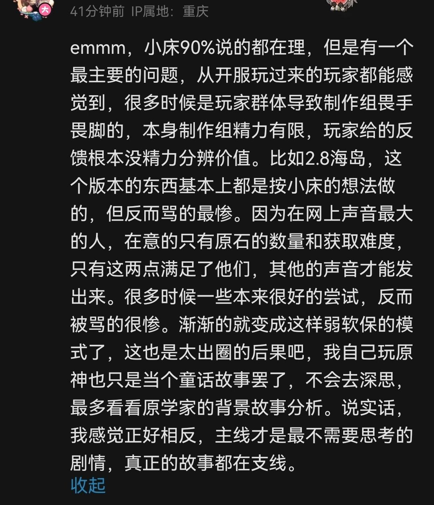
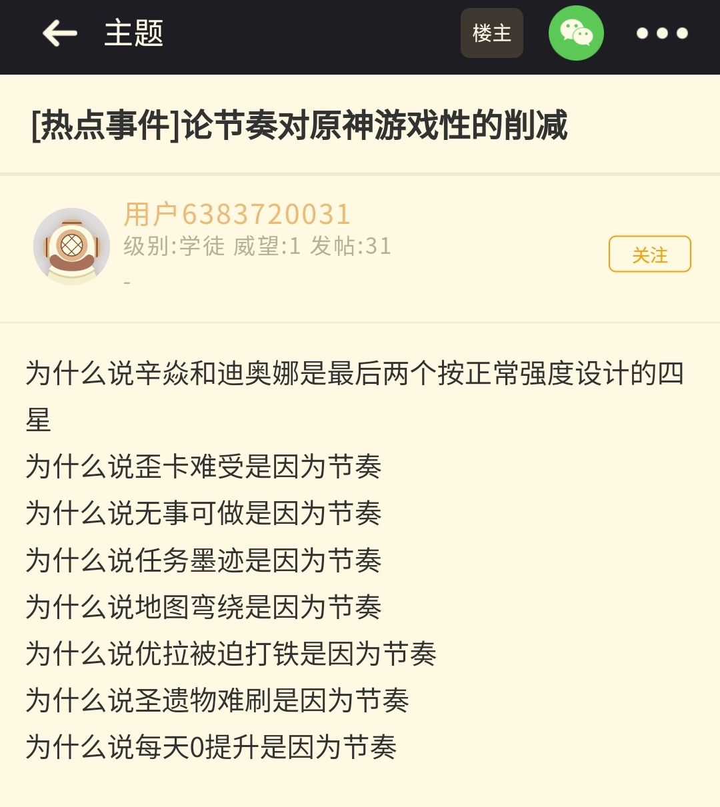
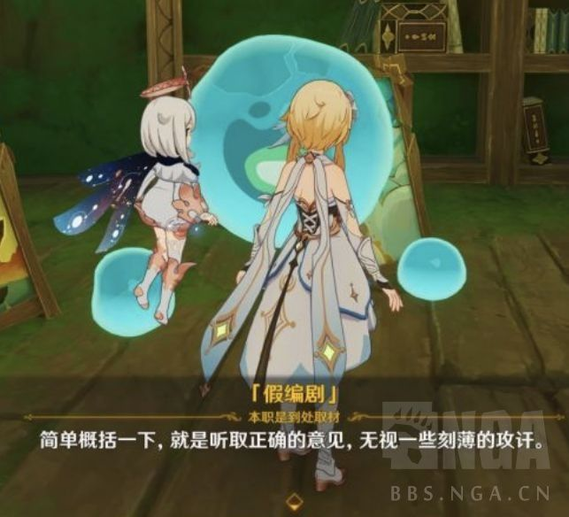
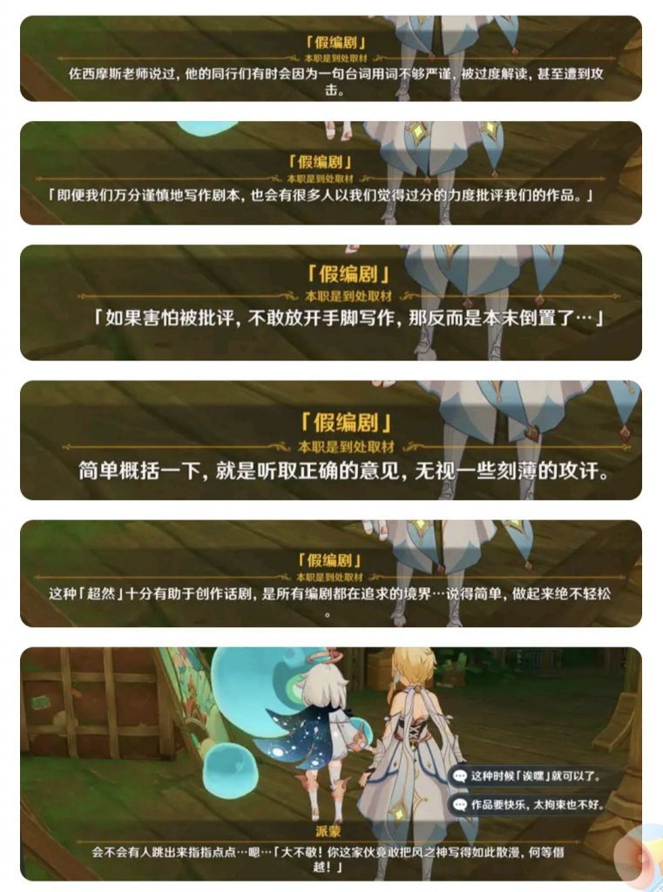

### [热点事件]原来是玩家裹挟mhy爆典的

Made by ngapost2md (c) ludoux [GitHub Repo](https://github.com/ludoux/ngapost2md)

----

##### 0.[0] \<pid:0\> 2023-07-22 15:42:38 by 自由搏击总冠军

  
出处：up主我牌去哪儿了 的最新视频评论区

----

##### 1.[0] \<pid:704161226\> 2023-07-22 15:44:55 by Drinton
乐，说得好像玩家按着那帮厕妹写其他一样

----

##### 2.[0] \<pid:704161358\> 2023-07-22 15:45:52 by sunshine23334
原来mhy会听取玩家意见啊...我说我是秦始皇vivo50这些洗地的人会给吗？

----

##### 3.[3] \<pid:704161375\> 2023-07-22 15:46:02 by 今锁朱楼
畏手畏脚。
指在最新剧情里疑似阴阳玩家。

----

##### 4.[1] \<pid:704161867\> 2023-07-22 15:50:01 by 零点，陈彬
他就算再保守也不至于一个常驻玩法没能留住玩家吧

----

##### 5.[0] \<pid:704162106\> 2023-07-22 15:51:36 by mute小号
其实是孙笑川指使米哈游爆典的

----

##### 6.[2] \<pid:704162142\> 2023-07-22 15:51:50 by meg1412
评论区的结晶好寄吧多看的有点生理不适了，感觉像是那种会给“游戏里这些话其实是说给玩家听的”这种b视频三连的人

----

##### 7.[0] \<pid:704162199\> 2023-07-22 15:52:14 by 隔壁的一只小鲸鱼
不说别的，原学家考究的东西现在在米哈游的不懈努力下都可以变成随时可以被岁掉的了

----

##### 8.[1] \<pid:704162219\> 2023-07-22 15:52:22 by 大号被叉出马桶
阴阳玩家的时候一点也不畏手畏脚

----

##### 9.[3] \<pid:704162645\> 2023-07-22 15:55:38 by Toposes
米哈游给玩家吃屎，玩家反应激烈

米哈游接到反馈后换了种方式给玩家吃屎，玩家继续反应激烈

这时候结晶出来说，就是因为米哈游上次听了你们的反馈游戏才做成这样

----

##### 10.[1] \<pid:704162833\> 2023-07-22 15:57:04 by 我想坐玛莎里哭
“制作组精力有限，玩家给的反馈没精力分辨价值”——指在剧情里阴阳怪气玩家不懂它们的阳春白雪。
“自己玩原神也只是当个童话故事，不会去深思”——你也知道原神剧情一旦深思处处都立不住脚啊。
“主线是最不需要思考的剧情，真正的故事在支线”——有没有可能正是因为主线重要才叫主线呢？主线负责推进剧情加塑造人物的作用，你告诉我主线剧情不需要思考？支线只是点睛之笔不是大头，支线搞好主线一坨答辩不是本末倒置？更何况米哈游的支线也没搞的有多好。

----

##### 11.[0] \<pid:704163615\> 2023-07-22 16:02:55 by 自由搏击总冠军
>[jump](#pid704162833) 我想坐玛莎里哭(2023-07-22 15:57) 说: 
>
>“制作组精力有限，玩家给的反馈没精力分辨价值”——指在剧情里阴阳怪气玩家不懂它们的阳春白雪。
>“自己玩原神也只是当个童话故事，不会去深思”——你也知道原神剧情一旦深思处处都立不住脚啊。
>“主线是最不需要思考的剧情，真正的故事在支线”——有没有可能正是因为主线重要才叫主线呢？主线负责推进剧情加塑造人物的作用，你告诉我主线剧情不需要思考？支线只是点睛之笔不是大头，支线搞好主线一坨答辩不是本末倒置？更何况米哈游的支线也没搞的有多好。

童话故事罪不至此，会岁月史树的童话故事我还真没见过

----

##### 12.[1] \<pid:704163908\> 2023-07-22 16:04:44 by 朔夜寒光
“主线是最不需要思考的剧情”，废话，敢思考吗，思考了还能圆上吗。

----

##### 13.[0] \<pid:704167192\> 2023-07-22 16:27:22 by LoldtiA
不是说玩家不知道自己到底想要啥？
情况不对就是玩家要求的，岁月史树饿人蒸鸡是玩家摁住文案头写的。

----

##### 14.[0] \<pid:704167615\> 2023-07-22 16:30:14 by 樱木花kun
全世界都在针对米宝全国只有米宝在带着镣铐跳舞

----

##### 15.[0] \<pid:704167884\> 2023-07-22 16:31:58 by 悲伤烤红薯
结晶是这样的
  
后面每条都有特别长的分析，没截，可以看出不是串子是发自内心的睿智

----

##### 16.[0] \<pid:704168116\> 2023-07-22 16:33:28 by q794623
   要是玩家真能裹挟mhy，那怎么着都写不出其他这一坨重量级，更别说那些草王语录。玩家刷散草99是什么时候？不是mhy先散草99才开始刷了吗？笑死

----

##### 17.[0] \<pid:704168329\> 2023-07-22 16:34:49 by 星际兄贵
畏手畏脚，指岁月史书

----

##### 18.[0] \<pid:704168523\> 2023-07-22 16:36:01 by 文湫
我觉得里版一些人真的是魔怔了

就事论事地说，去年海岛夏活，剧情拉满解密拉满，体验过的人都知道，而后续各论坛骂声一片，也是事实。而到今年夏活，剧情解密全部缩水，稍微对比一下就知道制作组肯定吸收了2.8海岛的反馈。

怎么到你这直接变成“编剧被玩家裹挟着暴典”了？他有谈到任何“暴典”的事吗？

----

##### 19.[0] \<pid:704168772\> 2023-07-22 16:37:51 by bug失去联系
制作组精力有限，指美工都去画散猫图，编剧都去给岁月史树擦屁股

----

##### 20.[0] \<pid:704168890\> 2023-07-22 16:38:28 by 前排合影围观
我逛完评论区的感受就是，没办法反驳小床观点，只能用一些&quot;共情&quot;&quot;体验&quot;&quot;沉浸&quot;&quot;没看全&quot;这类的词对于讲逻辑的人进行洗脑，试图证明逻辑是错误的，能调动情绪才是最好的

----

##### 21.[0] \<pid:704169346\> 2023-07-22 16:41:33 by gyhggg
哪个写东西不是畏手畏脚的，只是敢阴阳玩家的公司我真的是第一次见

----

##### 22.[4] \<pid:704169750\> 2023-07-22 16:44:07 by 已经成为了一种笑话
>[jump](#pid704168523) 文湫(2023-07-22 16:36) 说: 
>
>我觉得里版一些人真的是魔怔了
>
>就事论事地说，去年海岛夏活，剧情拉满解密拉满，体验过的人都知道，而后续各论坛骂声一片，也是事实。而到今年夏活，剧情解密全部缩水，稍微对比一下就知道制作组肯定吸收了2.8海岛的反馈。
>
>怎么到你这直接变成“编剧被玩家裹挟着暴典”了？他有谈到任何“暴典”的事吗？

你是没做今年夏活剧情吗？夏活是没有爆典是吗？夏活剧情是玩家按着他们的手写的吗？

----

##### 23.[0] \<pid:704169843\> 2023-07-22 16:44:43 by 五柳情州
评论总营造出一种字多就有理，用“理性”的口吻去维护或者给原说好话
ta都帮原神和米哈游说话了你就让让ta吧

----

##### 24.[5] \<pid:704170124\> 2023-07-22 16:46:25 by 无。乡4
>[jump](#pid704168523) 文湫(2023-07-22 16:36) 说: 
>
>我觉得里版一些人真的是魔怔了
>
>就事论事地说，去年海岛夏活，剧情拉满解密拉满，体验过的人都知道，而后续各论坛骂声一片，也是事实。而到今年夏活，剧情解密全部缩水，稍微对比一下就知道制作组肯定吸收了2.8海岛的反馈。
>
>怎么到你这直接变成“编剧被玩家裹挟着暴典”了？他有谈到任何“暴典”的事吗？

？喷的不是解密收益太低？原版我可没见谁狂喷剧情的

----

##### 25.[0] \<pid:704170187\> 2023-07-22 16:46:47 by 乐克乐克yyds
我倒真希望玩家这么有能耐

----

##### 26.[0] \<pid:704170455\> 2023-07-22 16:48:35 by mie001
>[jump](#pid704168523) 文湫(2023-07-22 16:36):

这跟里版有什么关系，这人前面说一堆后面来一句自己不在意剧情是没看到吗
2.8海岛和现在有一个特点就是，每次提到剧情的时候，总有一伙人跳出来拿什么“我不在意剧情”“我觉得就是童话”“12+你还想什么”来堵别人的嘴，只不过攻守互换了，当初用不在意剧情的说法来批判海岛的人现在来用这个说法护卫现在的版本罢了

----

##### 27.[0] \<pid:704170474\> 2023-07-22 16:48:45 by 威尔逊以撒
感觉他评论区很符合b站现状

----

##### 28.[2] \<pid:704170673\> 2023-07-22 16:50:11 by 无。乡4
>[jump](#pid704168523) 文湫(2023-07-22 16:36) 说: 
>
>我觉得里版一些人真的是魔怔了
>
>就事论事地说，去年海岛夏活，剧情拉满解密拉满，体验过的人都知道，而后续各论坛骂声一片，也是事实。而到今年夏活，剧情解密全部缩水，稍微对比一下就知道制作组肯定吸收了2.8海岛的反馈。
>
>怎么到你这直接变成“编剧被玩家裹挟着暴典”了？他有谈到任何“暴典”的事吗？

按你这个说法，剧情和解密确实缩水了，解密缩水体验确实好了很多，但剧情缩水体感是太烂了。剧情问题分明是写手水平有问题啊

----

##### 29.[0] \<pid:704171876\> 2023-07-22 16:58:47 by 714442843Q
米哈游在乎过玩家的意见吗？

----

##### 30.[0] \<pid:704172269\> 2023-07-22 17:01:23 by StarryForest
>[jump](#pid704168890) 前排合影围观(2023-07-22 16:38) 说: 
>
>我逛完评论区的感受就是，没办法反驳小床观点，只能用一些&quot;共情&quot;&quot;体验&quot;&quot;沉浸&quot;&quot;没看全&quot;这类的词对于讲逻辑的人进行洗脑，试图证明逻辑是错误的，能调动情绪才是最好的

这不就是米家剧情最大的卖点吗，结晶果然是标准受众群体

----

##### 31.[1] \<pid:704172499\> 2023-07-22 17:03:01 by 今锁朱楼
>[jump](#pid704168523) 文湫(2023-07-22 16:36):

逻辑链：对方观点 玩家群体发言导致制作组畏手畏脚使作品出现up主提出的缺陷，即弱软保→制作组会因为玩家发言畏手畏脚+作品出现问题是玩家毛病太多的原因。
那么一：玩家主要需求是什么？
答：就版内而言，核心需求是 加大游戏内可获取资源(尤其是原石)，提高文案水平降低废话浓度，重视男性玩家需要提高女自机的存在感，以及提高旅行者这一形象在剧情中的参与度。
这几点哪一条和弱软保有正面联系了？不是都反着弱软保来的？
二、制作组会因为玩家畏手畏脚。
由文案疑似阴阳玩家的发言，我质疑此种说法。
以及如果他真的这么重视玩家，散兵剧情应该早改了吧。
三、玩家毛病太多导致游戏出现问题。
同一，我不认为一中的任何一条实现后会使玩家体验变差。

----

##### 32.[0] \<pid:704173223\> 2023-07-22 17:07:57 by charme2102
>[jump](#pid704168523) 文湫(2023-07-22 16:36) 说: 
>
>我觉得里版一些人真的是魔怔了
>
>就事论事地说，去年海岛夏活，剧情拉满解密拉满，体验过的人都知道，而后续各论坛骂声一片，也是事实。而到今年夏活，剧情解密全部缩水，稍微对比一下就知道制作组肯定吸收了2.8海岛的反馈。
>
>怎么到你这直接变成“编剧被玩家裹挟着暴典”了？他有谈到任何“暴典”的事吗？

图里的评论说的是制作组因为会被玩家喷而畏手畏脚，用海岛举例，这贴里反驳说制作组并没有畏手畏脚甚至yygq暗讽玩家，有什么问题？这么急着给里版扣魔怔的帽子？

----

##### 33.[1] \<pid:704173316\> 2023-07-22 17:08:36 by Rudimentary
>[jump](#pid704162142) meg1412(2023-07-22 15:51) 说: 
>
>评论区的结晶好寄吧多看的有点生理不适了，感觉像是那种会给“游戏里这些话其实是说给玩家听的”这种b视频三连的人

结晶确实多得离谱了
这视频就轻飘飘的说了点缺点甚至还找补了不少，就这么多应激的
看来b站结晶含量比我想象中的多了几个数量级
最让我过目难忘的还是一句“对自己喜欢的游戏要有自信”“别陌生人说一句就动摇了自己的信念”
真的是爆孝如雷了

----

##### 34.[0] \<pid:704173356\> 2023-07-22 17:08:52 by dfpvml
没觉得怎么畏手畏脚的啊
爆典爆得比其他二游加起来都多。别人爆过的它都有 别人没爆过的它也有 
这就是你米畏手畏脚的结果？
那放开手脚得是什么样子

----

##### 35.[0] \<pid:704174856\> 2023-07-22 17:18:59 by 铁观音奶冻家军
一封给玩家的情书，

----

##### 36.[0] \<pid:704183726\> 2023-07-22 18:08:10 by Rycbarm_123
>[jump](#pid704168523) 文湫(2023-07-22 16:36) 说: 
>
>我觉得里版一些人真的是魔怔了
>
>就事论事地说，去年海岛夏活，剧情拉满解密拉满，体验过的人都知道，而后续各论坛骂声一片，也是事实。而到今年夏活，剧情解密全部缩水，稍微对比一下就知道制作组肯定吸收了2.8海岛的反馈。
>
>怎么到你这直接变成“编剧被玩家裹挟着暴典”了？他有谈到任何“暴典”的事吗？

米哈游不加对话跳过导致的

----

##### 37.[0] \<pid:704183998\> 2023-07-22 18:09:57 by 在豆田发现少女
是玩家逼mhy恶心玩家的吗，我的天

----

##### 38.[0] \<pid:704184574\> 2023-07-22 18:13:31 by 宇宙の音
>[jump](#pid704168523) 文湫(2023-07-22 16:36) 说: 
>
>我觉得里版一些人真的是魔怔了
>
>就事论事地说，去年海岛夏活，剧情拉满解密拉满，体验过的人都知道，而后续各论坛骂声一片，也是事实。而到今年夏活，剧情解密全部缩水，稍微对比一下就知道制作组肯定吸收了2.8海岛的反馈。
>
>怎么到你这直接变成“编剧被玩家裹挟着暴典”了？他有谈到任何“暴典”的事吗？

没必要，帮你复习两个点，首先是本次活动爆典了没，答案是有

其二，去年的海岛，如果你说辛焱和万叶的秘境没让人生理不适，那我觉得偏颇很大——全收集的玩家有多破防？？当初版内没有帖子狂喷吗？？

最后补一句老话题——2.8的纰漏在于，万叶的秘境是不是和草神有关系？？
如果有，那么散兵被草神这么对待，算什么情况

可以仔细品一品了

----

##### 39.[0] \<pid:704184921\> 2023-07-22 18:15:41 by bishoujo！！！
>[jump](#pid704168523) 文湫(2023-07-22 16:36) 说: 
>
>我觉得里版一些人真的是魔怔了
>
>就事论事地说，去年海岛夏活，剧情拉满解密拉满，体验过的人都知道，而后续各论坛骂声一片，也是事实。而到今年夏活，剧情解密全部缩水，稍微对比一下就知道制作组肯定吸收了2.8海岛的反馈。
>
>怎么到你这直接变成“编剧被玩家裹挟着暴典”了？他有谈到任何“暴典”的事吗？

去年海岛最出彩的还是个人秘境，有特色，演出效果也不错。
被骂的比较多我记得还得是皇女那个城堡里的拼积木环节，但这是技术问题不是设计思路有问题。
莫娜岛走透明路上天的时候，那种感觉，也很美妙。
然后今年直接变成了什么啊都。

----

##### 40.[0] \<pid:704185393\> 2023-07-22 18:18:27 by 叶落寒宵
>[jump](#pid704168523) 文湫(2023-07-22 16:36) 说: 
>
>我觉得里版一些人真的是魔怔了
>
>就事论事地说，去年海岛夏活，剧情拉满解密拉满，体验过的人都知道，而后续各论坛骂声一片，也是事实。而到今年夏活，剧情解密全部缩水，稍微对比一下就知道制作组肯定吸收了2.8海岛的反馈。
>
>怎么到你这直接变成“编剧被玩家裹挟着暴典”了？他有谈到任何“暴典”的事吗？

我只能说，根据我的调查，参加今年和去年夏活的玩家，一半觉得这次可以中等偏上，一半觉得不如去年。
2.8给我的感觉就是剧情和秘境明显是用心良苦，但是显然，在玩法引导上很不成熟，给我的感觉就是炫技。
这次夏活主打的就是一个较简单地拿满奖励，但是剧情。。。非常极其地低能

----

##### 41.[0] \<pid:704186418\> 2023-07-22 18:25:10 by 镀金牌咖啡
byd，3.3这种反人类剧情都敢放出来，别说对玩家了，对人类社会基本的公义和逻辑有一丝敬畏心吗？

----

##### 43.[0] \<pid:704187745\> 2023-07-22 18:32:52 by 宇宙の音
>[jump](#pid704185393) 叶落寒宵(2023-07-22 18:18) 说: 
>
>我只能说，根据我的调查，参加今年和去年夏活的玩家，一半觉得这次可以中等偏上，一半觉得不如去年。
>2.8给我的感觉就是剧情和秘境明显是用心良苦，但是显然，在玩法引导上很不成熟，给我的感觉就是炫技。
>这次夏活主打的就是一个较简单地拿满奖励，但是剧情。。。非常极其地低能

这次的优化是地图和解密设计，比如一个射击小游戏，三合一，我一口气打三轮拿一个精致宝箱——大家都舒服，时间也差不多，也不用玩家操作繁琐

这就是好评

去年是什么？？——的确，绚丽，但就是更多炫技

万叶秘境解密，假山不能随意换，要来回跑？？而且为什么不同的山搭配解密是排列组合？这引导完全没有

辛焱的岛，山顶的喇叭不看攻略找都找不到对应的在哪里，为了拿珍贵的宝箱还是得追视频

莫娜的是星星，不错，能拍照

蟹黄堡，上下翻飞且没有收集的道具，还容易卡死只能跳楼…但偏偏又有宝箱可能藏在楼顶和过道死角

剧情哪怕都放着不谈，去年大家已经考虑到疫情的产能狠狠地给了友情分了，觉得不容易，炫技就炫技吧，未来优化在须弥嘛——结果乐子更大了，须弥山空没有分层地图，合着数量上来了，眼睛折磨是真的痛苦……

----

##### 44.[0] \<pid:704190296\> 2023-07-22 18:46:10 by mie001
>[jump](#pid704187745) 宇宙の音(2023-07-22 18:32)说:
>[quote][pid=704185393,37093676,3]Reply[/pid] <b>Post by [uid=65123945]叶落寒宵[/uid] (2023-07-22 18:18):</b>  我只能说，根据我的调查，参加今年和去年夏活的玩家，一半觉得这次可以中等偏上，一半觉得不如去年。 2.8给我的感觉就是剧情和秘境明显是用心良苦，但是显然，在玩法引导上很不成熟，给我的感觉就是炫技。 这次夏活主打的就是一个较简单地拿满奖励，但是剧情。。。非常极其地低能[/quote]这次的优化是地图和解密设计，比如一个射击小游戏，三合一，我一口气打三轮拿一个精致宝箱——大家都舒服，时间也差不多，也不用玩家操作繁琐  这就是好评  去年是什么？？——的确，绚丽，但就是更多炫技  万叶秘境解密，假山不能随意换，要来回跑？？而且为什么不同的山搭配解密是排列组合？这引导完全没有  辛焱的岛，山顶的喇叭不看攻略找都找不到对应的在哪里，为了拿珍贵的宝箱还是得追视频  莫娜的是星星，不错，能拍照  蟹黄堡，上下翻飞且没有收集的道具，还容易卡死只能跳楼…但偏偏又有宝箱可能藏在楼顶和过道死角[s:ac:瞎]  剧情哪怕都放着不谈，去年大家已经考虑到疫情的产能狠狠地给了友情分了，觉得不容易，炫技就炫技吧，未来优化在须弥嘛——结果乐子更大了，须弥山空没有分层地图，合着数量上来了，眼睛折磨是真的痛苦……

如果海岛不是限时地图，可能还有不少人巴不得住里面。然而限时地图挖宝箱对很多人来说你越多越复杂越繁琐那就是越垃圾的设计

----

##### 45.[0] \<pid:704193699\> 2023-07-22 19:05:41 by 宇宙の音
>[jump](#pid704190296) mie001(2023-07-22 18:46) 说: 
>
>如果海岛不是限时地图，可能还有不少人巴不得住里面。然而限时地图挖宝箱对很多人来说你越多越复杂越繁琐那就是越垃圾的设计

是这样的！当初最多的人就是拿“海岛持续时间也不短”来反驳
而实际是——学生党天天叫苦，因为过不完解密，社畜或者大学生好歹宽裕点，但实际的解密不是“精巧”，只是怼素材

就真的当年一百个不理解，辛焱的秘境设计是为了啥，万叶岛的解密又是哪个人想的来回跑，特别的无效和繁琐，还附带一个需要凹的<b>断桥收集光点</b>

现在，我更关心pc怎么删除这部分空间占用……
唉

----

##### 46.[0] \<pid:704213846\> 2023-07-22 20:46:19 by 的呢抵抗
>[jump](#pid704168523) 文湫(2023-07-22 16:36):

我觉得你说的有失偏颇，去年四个岛，皇女和莫娜的还不错，但万叶和辛焱的我觉得依旧做的很差，玩家先玩了两个不好的才见到好的，评价肯定会变低。整体剧情也就皇女的个人线还行，别的也不太行，还埋了一手草神“开盒”的暗雷，你用很多人喷去年海岛来说明这个纯扯淡

----

##### 47.[0] \<pid:704228213\> 2023-07-22 21:57:27 by mie001
>[jump](#pid704193699) 宇宙の音(2023-07-22 19:05)说:
>[quote][pid=704190296,37093676,3]Reply[/pid] <b>Post by [uid=42379675]mie001[/uid] (2023-07-22 18:46):</b>  如果海岛不是限时地图，可能还有不少人巴不得住里面。然而限时地图挖宝箱对很多人来说你越多越复杂越繁琐那就是越垃圾的设计[/quote]是这样的！当初最多的人就是拿“海岛持续时间也不短”来反驳 而实际是——学生党天天叫苦，因为过不完解密[s:ac:汗]，社畜或者大学生好歹宽裕点，但实际的解密不是“精巧”，只是怼素材  就真的当年一百个不理解，辛焱的秘境设计是为了啥，万叶岛的解密又是哪个人想的来回跑，特别的无效和繁琐，还附带一个需要凹的<b>断桥收集光点</b>  现在，我更关心pc怎么删除这部分空间占用…… [s:ac:汗]唉

我宁愿拿所有沙漠换一个2.8海岛

----

##### 48.[0] \<pid:704229303\> 2023-07-22 22:03:16 by tr1gger3
>[jump](#pid704168523) 文湫(2023-07-22 16:36):

去年夏活多好啊，他稍微做点有深度的内容，就被轻度玩家的抱怨全淹没了版里面有喜欢的，也有讨厌的，不过讨厌的占多数吗，但是瑕不掩瑜，虽然有些地方判定脑溢血，但真的给人一种买了一个不错的dlc的感觉，今年改做弱智向，我玩都没玩，已经被原神优化掉了

----

##### 49.[0] \<pid:704231526\> 2023-07-22 22:14:16 by rufeix
2.8海岛那种风格应该给森林书，黄金梦乡这种生态位的任务，而不是给限时活动

----

##### 50.[0] \<pid:704231546\> 2023-07-22 22:14:23 by 宇宙の音
>[jump](#pid704228213) mie001(2023-07-22 21:57) 说: 
>
>我宁愿拿所有沙漠换一个2.8海岛

讲真这个角度很新诶……
沙漠换2.8emm，我虽然比较喜欢沙漠的大金字塔设计，但感觉如果对标换了不算亏就是

----

##### 51.[0] \<pid:704233941\> 2023-07-22 22:27:01 by 星际兄贵
>[jump](#pid704173356) dfpvml(2023-07-22 17:08):

emmmmm放开手脚的话直接henshin成小日子→翼？

----

##### 52.[0] \<pid:704233960\> 2023-07-22 22:27:07 by 渐行渐远ii
>[jump](#pid704168523) 文湫(2023-07-22 16:36) 说: 
>
>我觉得里版一些人真的是魔怔了
>
>就事论事地说，去年海岛夏活，剧情拉满解密拉满，体验过的人都知道，而后续各论坛骂声一片，也是事实。而到今年夏活，剧情解密全部缩水，稍微对比一下就知道制作组肯定吸收了2.8海岛的反馈。
>
>怎么到你这直接变成“编剧被玩家裹挟着暴典”了？他有谈到任何“暴典”的事吗？

我玩这游戏第一次晕3d就是万叶岛，不能骂了？

