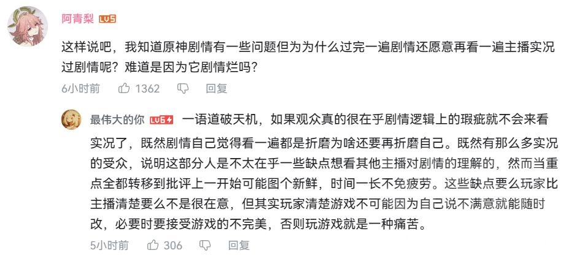
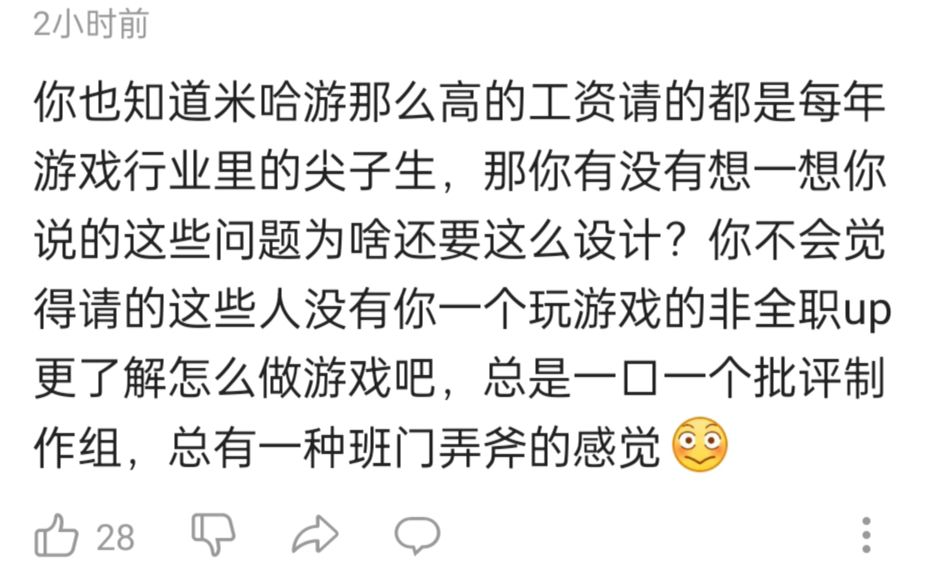
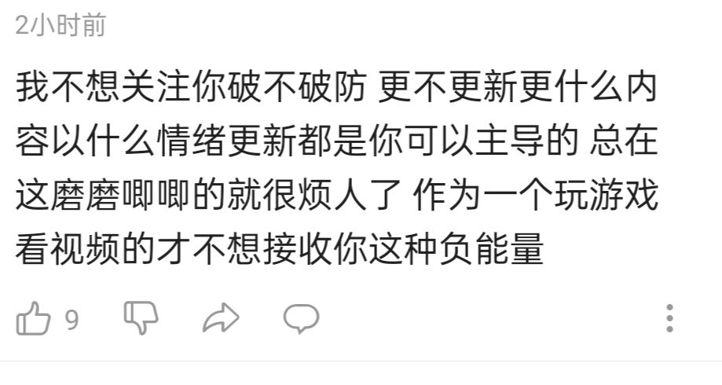
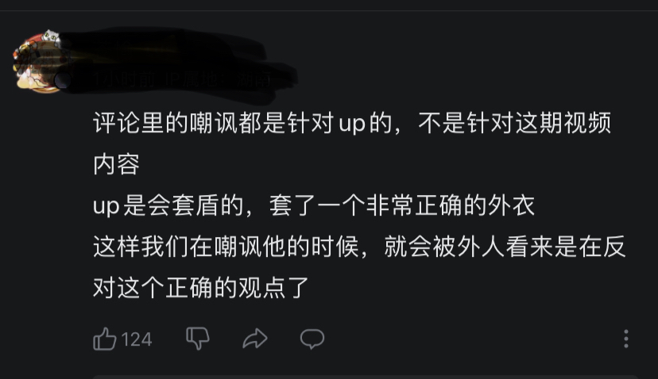
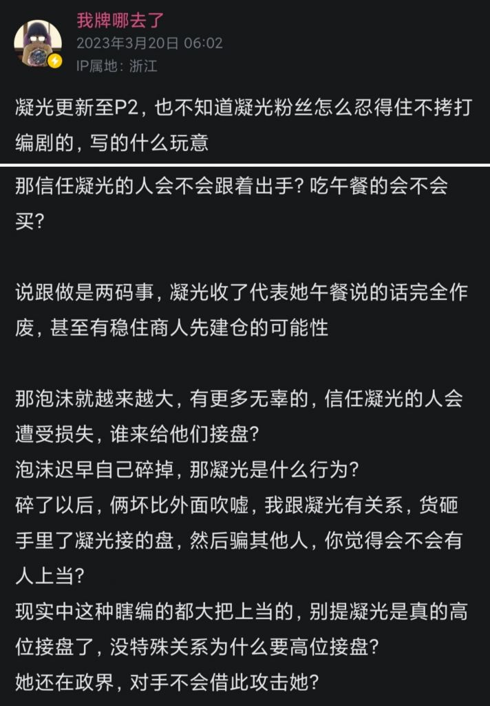
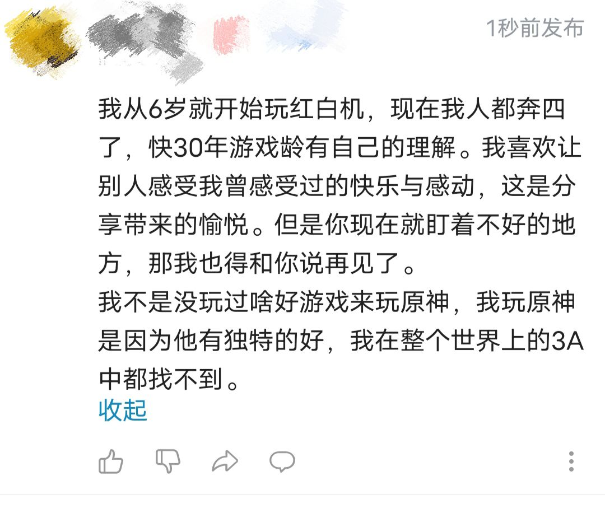

### [热点事件] yysy，真点进去看了小床最新锐评，震惊于居然还挺客观的

Made by ngapost2md (c) ludoux [GitHub Repo](https://github.com/ludoux/ngapost2md)

----

##### 0.[0] \<pid:0\> 2023-07-22 22:49:31 by momookyk
抛开剧情不谈，关于大世界探索和氪金的矛盾以及原神目前玩法面临的问题居然还蛮合理的
然后评论区怎么爆炸了……

~~今天1202两盒没碎，开的SER白人鱼还莫名其妙的不见了，手机要没电了想回办公室充会电发现门锁了打不开，晚上洗完澡发现眼镜坏了，我是不是散兵黑多了被神罚了~~

----

##### 1.[0] \<pid:704238183\> 2023-07-22 22:52:09 by 白开水巨好喝
谎言哪有真相伤人呢？

----

##### 2.[0] \<pid:704238189\> 2023-07-22 22:52:11 by Fsge2017
正是因为他说的客观，弹幕区反而很正常，评论区才炸了
美其名曰“我们不在乎你说的原神这些问题，我们只想听你夸原神，夸米哈游”

----

##### 3.[0] \<pid:704238328\> 2023-07-22 22:53:08 by id不知道用什么id
米up永远是立场比事实重要。

----

##### 4.[0] \<pid:704238655\> 2023-07-22 22:55:01 by UID42694396
他基本盘真的很小了但是还是狠狠的得罪了

----

##### 5.[2] \<pid:704239197\> 2023-07-22 22:58:14 by 苏雅见
挺魔幻的，第一次弹幕和评论区撕裂到这种程度就是玩原神给的自信.jpg
最令我印象深刻的是，视频小床几乎有理有据的讲出了自己的观点，但是评论区扯这扯那无法反驳各种撒泼打滚，让我觉得原的社区舆论氛围已经癫狂到这种程度嘛？！

----

##### 6.[0] \<pid:704239332\> 2023-07-22 22:59:03 by 雨源rainsource
谎言不会伤人，真相才是快刀

----

##### 7.[0] \<pid:704239388\> 2023-07-22 22:59:26 by 前排合影围观
我猜测因为床是单机转过来的，也确实还有一点水平，结晶有一种&quot;你看单机玩家都说原神好了那一定好&quot;的自卑心理，希望得到天龙人认可，拉来给原神背书，结果没想到床还真瞧不上原神剧情，戳破结晶美梦了

----

##### 8.[0] \<pid:704240332\> 2023-07-22 23:04:57 by Icalo
不仅挺客观，甚至还叠了甲，用比较客气的说法说了，哪怕这样他们都破防了

----

##### 9.[1] \<pid:704240595\> 2023-07-22 23:06:23 by 朔夜寒光
看到评论区有个评价，大意是“我难道不知道你说的很客观吗，但是我是来看你夸夸的，不是来看你说缺点的”而且大概看了一下评论区，类似的表达还不少。怎么说呢，表达的倒是没有很强的恶意，但是这个态度还是挺让我感慨的，看来原神真的是很多人的精神奶嘴啊。

----

##### 10.[0] \<pid:704240878\> 2023-07-22 23:08:01 by Rudimentary
他的视频主打的就是一个会好好分析和客观。
其实每次分析都会被骂一通
但是他以前没有整体锐评过，只会锐评部分剧情，所以直接把人搞应激了。
正好加上前几天搞断章刷数据什么的，爆发得就更厉害了

----

##### 11.[1] \<pid:704240982\> 2023-07-22 23:08:32 by 月舞星璇
原的剧情现在是有着灵活的二游二相性，有些人说原神是二游，剧情表达的情绪到位就行，不用太揪细节。

人家开始锐评，又说人家玩的不仔细，只要细看就知道表达的是yyy，ooo意思。

要我说现在的所有博主发布视频解读的都还不够细，真细起来是什么样子？

B站能允许原神后续版本的内鬼视频大量发布，但只要有人细细解读蒸鸡，不出几日就会被斩杀。

----

##### 12.[0] \<pid:704241008\> 2023-07-22 23:08:42 by LoldtiA
打碎人家结晶的美梦，不急没完。

----

##### 13.[1] \<pid:704241259\> 2023-07-22 23:10:04 by 月上七楼6004537238
>[jump](#pid704239197) 苏雅见(2023-07-22 22:58) 说: 
>
>挺魔幻的，第一次看到弹幕和评论区撕裂到这种程度就是玩原神给的自信.jpg
>最令我印象深刻的是，视频小床几乎有理有据的讲出了自己的观点，但是评论区扯这扯那无法反驳各种撒泼打滚，让我觉得原的社区舆论氛围已经癫狂到这种程度嘛？！

当初3.6关于其他的汴京就是这样的，跟那边讲道理剖逻辑没用
你说的到位他们就撒泼打滚说你上纲上线主观臆断，疯狂输出自己的想法
你说的有几句纰漏他们就抓死不放然后借着这点迅速上升，无视其他没法反驳的内容
现在想来真是浪费时间

----

##### 14.[0] \<pid:704241367\> 2023-07-22 23:10:42 by setsuna2023
我看过他风起鹤归的实况，大概可以想象到他受众是那种喜欢明贬暗褒以此暗爽“小样逃不出咱们伟大的原神的手掌心”
结果到了原玩家数量和流水都接近鼎盛的版本他并没有“恶堕”，甚至肉眼可见为了3.3的即将爆炸在铺垫，那想听夸的受众可不得梦碎发疯吗

----

##### 15.[0] \<pid:704241550\> 2023-07-22 23:11:49 by 米兰达1234
说的其实都挺合理的，尤其是宝箱那里，又没啥好东西，又多，最后只能选择跟攻略走

----

##### 16.[0] \<pid:704242028\> 2023-07-22 23:14:35 by Bauhaus的大豪斯

ME:  -&gt;  -&gt; 

----

##### 17.[0] \<pid:704242266\> 2023-07-22 23:15:53 by 今锁朱楼
>[jump](#pid704242028) Bauhaus的大豪斯(2023-07-22 23:14)说:
>[img]https://img.nga.178.com/attachments/mon_202307/22/l2Q2s-3ek0ZcT3cSpm-bu.jpg[/img]  ME: [s:ac:咦] -&gt; [s:a2:惊] -&gt; [s:a2:是在下输了]

省流：自豪型镍币人。

----

##### 18.[1] \<pid:704242496\> 2023-07-22 23:17:22 by 他一直都是对的
一边骂宅男哥一边无比渴望获得宅男哥认可是这样的，他们去看这种天龙人就是为了得到他的认可和夸赞的，和看外国人夸原神没差  人家开骂了就崩溃了

----

##### 19.[0] \<pid:704243236\> 2023-07-22 23:21:45 by 苏雅见
>[jump](#pid704241259) 月上七楼6004537238(2023-07-22 23:10) 说: 
>
>当初3.6关于其他的汴京就是这样的，跟那边讲道理剖逻辑没用
>你说的到位他们就撒泼打滚说你上纲上线主观臆断，疯狂输出自己的想法
>你说的有几句纰漏他们就抓死不放然后借着这点迅速上升，无视其他没法反驳的内容
>现在想来真是浪费时间

感觉饭圈那味太冲了看过小床分析渊下宫的视频就该知道这位up主有多认真看剧情了但是评论区给我的感觉就是“你说得对，但是我家鸽鸽就是神圣不可侵犯的，抛开事实不谈有问题的是你吧”这结晶程度太哈人了吧

----

##### 20.[0] \<pid:704243438\> 2023-07-22 23:23:03 by 未始有物
看现在原神相关的反应视频都是什么播放量高就知道这帮人想看什么了，哪想看内容呢，“斯国一”“卡哇伊”“说不出话”“满命宣言”，结束了，从某个时间点开始基本就这样无限循环像个动物一样就完事了，开始说人话人家可听不得，有什么抱怨立马所有评论区打成黑子忘恩负义的主播

----

##### 21.[0] \<pid:704243546\> 2023-07-22 23:23:48 by 沈一馨不怕黑
他的粉丝是想看“高贵的”单机天龙人恶堕成米孝子的，他锐评能不骂他吗？人家本来只想看怎么夸。

----

##### 22.[0] \<pid:704245064\> 2023-07-22 23:33:32 by 乐克乐克yyds
>[jump](#pid704242028) Bauhaus的大豪斯(2023-07-22 23:14) 说: 
>
>
>
>ME:  -&gt;  -&gt; 

我注意到有好多nt口里说着知道原神剧情有问题，可以锐评什么什么的，但只要别人车的不是心海传说雷神1稻妻主线几个特定的，就会狂骂一顿

----

##### 23.[0] \<pid:704245837\> 2023-07-22 23:38:53 by 球球游侠
我去看了，句句说我心坎里了，做为一个玩家，他的发言是很中肯的，但是有些人并不是想看他分享自己的游戏理解只是想听他单纯的夸夸原神，骨子里就没把他当做玩家看，还是默认他是天龙人，我想说有些人别太低贱了，就算人家以前玩单机，现在也是做为原神玩家在给原提意见，自己也知道原几斤几两，得不到天龙人的肯定就大哭大闹撒泼打滚的样子不要太小丑

----

##### 24.[0] \<pid:704246491\> 2023-07-22 23:43:34 by ThedesAlizes
因为他确实是从玩家角度出发看问题的虽然也会站在制作组的角度思考，但立场始终是玩家消费者
之前那期讲游戏氪金的说的也挺不错

----

##### 25.[0] \<pid:704247962\> 2023-07-22 23:53:07 by Bauhaus的大豪斯
>[jump](#pid704245064) 乐克乐克yyds(2023-07-22 23:33)说:
>[quote][pid=704242028,37099017,1]Reply[/pid] <b>Post by [uid=63913156]Bauhaus的大豪斯[/uid] (2023-07-22 23:14):</b>  [img]https://img.nga.178.com/attachments/mon_202307/22/l2Q2s-3ek0ZcT3cSpm-bu.jpg[/img]  ME: [s:ac:咦] -&gt; [s:a2:惊] -&gt; [s:a2:是在下输了][/quote]我注意到有好多nt口里说着知道原神剧情有问题，可以锐评什么什么的，但只要别人车的不是心海传说雷神1稻妻主线几个特定的，就会狂骂一顿[s:ac:凌乱]

其实这就是B站目前mhy游戏下的生态。本质上还是不容许别人批判自己玩的游戏

----

##### 26.[0] \<pid:704248541\> 2023-07-22 23:57:08 by 乐克乐克yyds
>[jump](#pid704247962) Bauhaus的大豪斯(2023-07-22 23:53) 说: 
>
>其实这就是B站目前mhy游戏下的生态。本质上还是不容许别人批判自己玩的游戏

然后再假装宽宏大量地把一两个公认烂的列为可车的来制造允许批判的假象

----

##### 28.[0] \<pid:704248952\> 2023-07-23 00:00:13 by Final Vent
>[jump](#pid704246491) ThedesAlizes(2023-07-22 23:43)说:
>因为他确实是从玩家角度出发看问题的[s:ac:哭笑]虽然也会站在制作组的角度思考，但立场始终是玩家消费者 之前那期讲游戏氪金的说的也挺不错

请问讲氪金是哪期？我目前印象深刻的氪金能讲个1234的，就是Gigguk花了一千美刀体验抽卡。

----

##### 30.[0] \<pid:704249963\> 2023-07-23 00:07:33 by Zzyugg
对错是小事，立场是大事。对一切向迷迭提出问题的人发起圣战

----

##### 31.[0] \<pid:704252013\> 2023-07-23 00:22:29 by 沉睡的梦境
>[jump](#pid704242028) Bauhaus的大豪斯(2023-07-22 23:14) 说: 
>
>
>
>ME:  -&gt;  -&gt; 

不在乎剧情的人挺多的，可惜米就是不愿意出跳过。

----

##### 32.[0] \<pid:704252024\> 2023-07-23 00:22:31 by 说话可直了
甚至好像还没播3.3？

我觉得只是为了3.3做的心理铺垫

----

##### 33.[1] \<pid:704252093\> 2023-07-23 00:22:53 by 甲庞魏乙关郑
所以你懂为什么米的结晶喊镍币喊最多，因为他们自己捏啊

----

##### 34.[0] \<pid:704252279\> 2023-07-23 00:24:05 by momookyk
>[jump](#pid704252093) 甲庞魏乙关郑(33楼) (2023-07-23 00:22)说:
>所以你懂为什么米的结晶喊镍币喊最多，因为他们自己捏啊

经典回旋镖大师

----

##### 35.[1] \<pid:704253236\> 2023-07-23 00:30:51 by 方子幕_桃
看了下up，分析起码是举例证明，底下按屁股按立场觉得不符合心意就恼羞成怒的看得我笑了，难道他们真的没看过任何一个番剧玩过除了米家以外的任何一个游戏？

----

##### 36.[0] \<pid:704254113\> 2023-07-23 00:37:07 by 一个好昵称
我感觉这群结晶才是真的镍币人，既然知道剧情有问题还乐呵呵的玩下去不许别人提出意见，你乐意吃答辩不代表别人乐意吃，而且我很好奇他们是真的没看过其他游戏好的剧情吗

----

##### 37.[0] \<pid:704254195\> 2023-07-23 00:37:46 by cccherch
结晶只想看单机天龙人堕落为米家卫兵，给他们赢赢赢当素材用呢。客观评价？当B站氛围是只能赢的时候，客观等于背叛呀。看看以前知乎来B站恰米家饭的那几位，现在敢锐评原神剧情吗？除了文输高技术力就是唯物主义中式价值观啊～组合拳来回使，不知道的还以为是哪位大厂的游戏制作人呢～

----

##### 38.[0] \<pid:704254908\> 2023-07-23 00:43:44 by double的h
>[jump](#pid704247962) Bauhaus的大豪斯(2023-07-22 23:53) 说: 
>
>其实这就是B站目前mhy游戏下的生态。本质上还是不容许别人批判自己玩的游戏

b站用户还是年纪太小了

----

##### 39.[0] \<pid:704254945\> 2023-07-23 00:43:59 by ThedesAlizes
>[jump](#pid704248952) Final Vent(2023-07-23 00:00) 说: 
>
>请问讲氪金是哪期？我目前印象深刻的氪金能讲个1234的，就是Gigguk花了一千美刀体验抽卡。

BV1J24y1q7AL  
就是讲了讲买断制和氪金的差异什么的(以玩家角度)

----

##### 40.[0] \<pid:704255488\> 2023-07-23 00:48:26 by 小白菜种子
>[jump](#pid704243236) 苏雅见(2023-07-22 23:21) 说: 
>
>感觉饭圈那味太冲了看过小床分析渊下宫的视频就该知道这位up主有多认真看剧情了但是评论区给我的感觉就是“你说得对，但是我家鸽鸽就是神圣不可侵犯的，抛开事实不谈有问题的是你吧”这结晶程度太哈人了吧

渊下宫是唯一一个让小床凹到100%的地图，其它地方经常是宝箱都不开。我记得小床在渊下宫开宝箱的理由是看到没开的宝箱就知道这块地方自己还没来过…能让小床这样掘地三尺也说明渊下宫剧情优秀了

----

##### 41.[0] \<pid:704256101\> 2023-07-23 00:53:33 by Wave2000
>[jump](#pid704242028) Bauhaus的大豪斯(2023-07-22 23:14) 说: 
>
>
>
>ME:  -&gt;  -&gt; 

----

##### 42.[0] \<pid:704256201\> 2023-07-23 00:54:26 by 十夜铃沄花
看几个相关视频，然后评论区里“这个人不行，还是看别的吧”之后推荐的几个UP无一例外都是对原神一顿狂吹的，基本就知道这次为什么起节奏了
吃原神流量尤其剧情相关的，除非你本来就没怎么夸原神，否则你的粉里结晶就是会有很多，所以哪怕你是一些简单的吐槽也会导致这些人觉得自己被“背叛”了

或者换个角度，就原神之前的主线剧情水平，能一路做到须弥都没怎么吐槽过原神剧情的，那肯定会被结晶划到自己阵营里去
你这时候说须弥有问题，它们铁定不接受，像这种主机单机转原神的更容易让这群人破大防

但我觉得对这个UP自身来说是个好事，只要他能无视这群人自己做自己的，之后的视频继续保持客观，他的粉丝会逐渐变成正常人的，而且一旦枫丹崩盘，他还能反向吃到一波热度，这个概率肯定也不小，相当于一次洗粉了

----

##### 43.[19] \<pid:704263297\> 2023-07-23 02:09:52 by 当灵魂呼吸时
>[jump](#pid704242028) Bauhaus的大豪斯(2023-07-22 23:14) 说: 
>
>
>
>ME:  -&gt;  -&gt; 

这两个评论真的太纯了，游戏剧情有缺点有问题，不让人说出来？

----

##### 44.[72] \<pid:704264653\> 2023-07-23 02:33:11 by yuya_长草中
只能证明结晶粉真的就和散一模一样，嘴臭但内心极其脆弱，本质上其实是自卑的，所以才嫉妒渴望别人，尤其是“天龙人”的肯定来获得自我满足

本来世界上就不存在完美的游戏，老头环玩家也会批评后期地图太空，部分怪物无脑读指令设计太粪之类的，王国之泪玩家也会吐槽地底地图重复性太高很无聊。承认游戏存在缺点并不意味着否认游戏的优秀，会对客观且言之有理的批评都敏感破防的人，只能说明他自己对游戏是否足够优秀都不够自信，所以只听得进去赞扬，也只有依靠赞扬，特别是“权威人士”的赞扬才能不断强化自己这种“我玩的游戏很优秀”的认知。
一个例子，原拿了TGA的奖，哪怕只是手游奖和玩家之声这种微不足道的边缘奖都会大吹特吹，并试图和说TGA是野鸡奖的天龙人辩论试图证明其权威性，因为他们需要TGA这种“权威”来认证“原是个优秀的游戏”。但当野炊或者老头环拿了TGA年度最佳的时候，单机玩家普遍是认为，并不是野炊和老头环需要TGA来证明自己是年度最佳，而是TGA需要靠给野炊老头环颁奖来证明自己不是野鸡奖。

所以说这种主机转手游的up理解不了为啥自己做这种视频都能得罪受众是很正常的，他们以前待的圈子里的玩家可没这么玻璃心

----

##### 45.[10] \<pid:704264906\> 2023-07-23 02:38:33 by 有梦想的非酋
先看评论区，我还以为是个站在喷的立场上输出情绪的，结果看完，还挺客观分析，没喷没吹，而且客观分析了最显著的优缺点(比如收集要素和奖励的矛盾)以及一些可能改进方案，这种用心思考分析过的视频比绝大部分站一个立场然后全靠输出情绪博取(op，米黑等各种群体选一个或多个的)流量的视频不只高了多少质量。评论区反而是情绪输出大战，还有up吃流量阴谋论，尤其是这个阴谋论，有种某角色三次背叛的似曾相识感，评论区一堆高赞的好像是觉得up背叛了他们，狠狠滴取关攻击up呢

----

##### 46.[24] \<pid:704265144\> 2023-07-23 02:42:48 by xycrise
绝了我记得去年12月份有关这个up的讨论出现在版里的时候，还有好多喷他镍币天龙人的过去八个月这次竟然都是站他的中间发生了什么我不好说

----

##### 47.[21] \<pid:704265692\> 2023-07-23 02:52:18 by 先R再R最后R
mvb就不是去分析的，人家就是去党同伐异的
要么加入污手党，要么滚出加基森！

----

##### 48.[31] \<pid:704265706\> 2023-07-23 02:52:27 by 月球势力←
所以本质想要的还是拉夫营业吧
人人都笑伏拉夫
人人都爱伏拉夫

----

##### 49.[52] \<pid:704266084\> 2023-07-23 02:59:13 by 有梦想的非酋
最好的一点是，剧情分析，所有人以为他要吹or冲某散，但是他给出了剧情从玩家体验上更根本的问题和思考，编剧倒写剧情，主角缺乏行动力，玩家被强行推着走，剧情事件的承接点和发展突兀生硬，细节逻辑缺少打磨，编剧完全是先有终点再倒推过程老实说，能感觉到剧情不好谁都行，但能客观分析出哪里不好并用通俗的话语解释给观众是需要一定文学素养的

很喜欢一句话，当角色的人设立起来后，角色是会自己动起来的，届时剧情的发展就不完全是作者说了算，作者不能想让一个角色做啥就写啥，而是只能通过设置外部条件去干涉角色的行动将事情发展引导向目标剧本，但是现在原神编剧就是我想让角色干啥就干啥，导致一言不合崩人设

----

##### 50.[0] \<pid:704266188\> 2023-07-23 03:01:26 by 长乐清悠
这个视频的发布时间不对，这up以前的老粉认为他在转移矛盾，那些对他有意见的老粉被打成结晶，拿路人当挡箭牌太抽象了，现在评论区又混进了不少奇怪生物，硝烟弥漫但突出一个各打各的

----

##### 51.[12] \<pid:704266253\> 2023-07-23 03:02:39 by Koko7mi
评论区有些人还真把自己当up的衣食父母了，才几个子啊。放别的平台这个体量主播礼物都不一定谢的到

----

##### 52.[17] \<pid:704266778\> 2023-07-23 03:15:36 by CUCUK
>[jump](#pid704238189) Fsge2017(2023-07-22 22:52) 说: 
>
>正是因为他说的客观，弹幕区反而很正常，评论区才炸了
>美其名曰“我们不在乎你说的原神这些问题，我们只想听你夸原神，夸米哈游”

绝对的啊，弹幕区肯定看视频的
评论区纯属看见标题就光速破防对线了

----

##### 53.[17] \<pid:704266869\> 2023-07-23 03:17:40 by 君影清灵
某些人只想看夸夸获取认同感，看见up提出意见就开始急了

----

##### 54.[11] \<pid:704266984\> 2023-07-23 03:20:22 by 猫污
我倒是挺好奇小床下三个月的充电数据到底会怎么样。刚刚看了看是两万一(对比他差不多20万关注来说可以说是高得非常离谱了)。

如果没掉多少，那这个视频算是提纯成功了，剩下的应该都是真真真粉了。

不过哪怕掉一半这个充电的数据还是高得离谱就对了，不知道多少up拼了命好几年都达不到的高度

----

##### 55.[28] \<pid:704266995\> 2023-07-23 03:20:35 by 有梦想的非酋
>[jump](#pid704265144) xycrise(2023-07-23 02:42)说:
>绝了我记得去年12月份有关这个up的讨论出现在版里的时候，还有好多喷他镍币天龙人的过去八个月这次竟然都是站他的中间发生了什么我不好说

他以前干了啥不清楚(完全不知道这号人)，但是这次对于剧情逻辑性的分析确实做的不错，很通俗的语言解释了原神中剧情逻辑性缺失的部分以及玩家觉得剧情中人物ooc的原因，算是跳出对编剧三观屁股歪的攻击情绪客观分析了剧情中人设崩，逻辑性差，主角(玩家)被强行推着走等问题，当然也有可能是因为他还没看3.4-3.6的剧情，所以还没到散草屁股大战ttk的部分。不过现在剧情缺乏逻辑是真的，一堆bug不提了，单单是人物ooc的问题，就是编剧不考虑剧情的逻辑性，一些已经明确人设的人物，在xx事件中他的身份，立场，性格导致他必然会参与其中做出行动。

但是现在情况是剧情编写仿佛是先果后因的倒推写法，先确定结果，再写过程，然后把角色往里面填充，而不是让角色动起来，角色只是成为了编剧笔下将剧情推向目标结果的棋子，人物ooc，剧情bug频出就不奇怪了，更何况剧情细节总是缺少打磨

----

##### 56.[9] \<pid:704267221\> 2023-07-23 03:27:21 by 有梦想的非酋
>[jump](#pid704266984) 猫污(2023-07-23 03:20)说:
>我倒是挺好奇小床下三个月的充电数据到底会怎么样。刚刚看了看是两万一(对比他差不多20万关注来说可以说是高得非常离谱了)。
>
>如果没掉多少，那这个视频算是提纯成功了，剩下的应该都是真真真粉了。
>
>不过哪怕掉一半这个充电的数据还是高得离谱就对了，不知道多少up拼了命好几年都达不到的高度

真要提纯反而应该继续狠狠滴只概括不评价，发实况就可以了，狠狠滴吃mvb的流量，从商业角度来说他现在出一个分析剧情逻辑性问题的视频属于纯纯的吃力不讨好，还可能会爆掉自己粉丝基本盘，但是怎么说，可能这个up有自己的想法吧(如果说他只是单纯想分析剧情逻辑性问题，那也不对，这个up看着像全职的，这可是职业不是爱好)，他这波操作有点怪，但是不妨碍这个视频分析确实做的不错，情绪少分析多，客观为主而不是站着一个立场靠情绪狂炫流量的低质量视频

----

##### 57.[3] \<pid:704267445\> 2023-07-23 03:34:12 by 有梦想的非酋
>[jump](#pid704248724) Final Vent(2023-07-22 23:58):

有空确实能看看，和评论区大战不同，真的看视频的弹幕区和评论区简直两个世界，视频其实没什么负面情绪输出，而是客观分析了剧情的逻辑性缺失，从编剧角度分析。在现今站立场输出情绪就能有流量吃(甚至能吃得更多更久)，这种客观分析的视频看一个少一个咯像我这种喜欢看小说，影视作品解析的不得不吹一下这个视频了

----

##### 58.[13] \<pid:704267474\> 2023-07-23 03:34:49 by 猫污
>[jump](#pid704267221) 有梦想的非酋(2023-07-23 03:27) 说: 
>
>真要提纯反而应该继续狠狠滴只概括不评价，发实况就可以了，狠狠滴吃mvb的流量，从商业角度来说他现在出一个分析剧情逻辑性问题的视频属于纯纯的吃力不讨好，还可能会爆掉自己粉丝基本盘，但是怎么说，可能这个up有自己的想法吧(如果说他只是单纯想分析剧情逻辑性问题，那也不对，这个up看着像全职的，这可是职业不是爱好)，他这波操作有点怪，但是不妨碍这个视频分析确实做的不错，情绪少分析多，客观为主而不是站着一个立场靠情绪狂炫流量的低质量视频

啊，可能我用词不对，我指的提纯意思是小床这次操作可能是想要把一部分素质极差的粉踢掉(参考他之前被一些逆天评论气得破防拉黑了一些人)

我记得他也不是全职up，白天还得上班，好像有一个月剪片剪到每天平均只睡4小时，这样下去真的现在赚多少钱以后全都要赔到医药费上面去甚至倒贴。

如果提纯的代价是少了一半的垃圾粉，换回来的是小床可以继续保持良好的心态继续给我们优质的电子榨菜到关服那也挺不错的。

----

##### 59.[5] \<pid:704267545\> 2023-07-23 03:36:43 by 有梦想的非酋
>[jump](#pid704239197) 苏雅见(2023-07-22 22:58):

这个评论区真的让我感觉ys社区已经被xxn入侵同化了，抛开事实不谈这不是xxn的经典起手么

----

##### 60.[8] \<pid:704267677\> 2023-07-23 03:40:48 by 有梦想的非酋
>[jump](#pid704267474) 猫污(2023-07-23 03:34)说:
>>[jump](#pid704267221) 有梦想的非酋(2023-07-23 03:27) 说: 
>>
>>真要提纯反而应该继续狠狠滴只概括不评价，发实况就可以了，狠狠滴吃mvb的流量，从商业角度来说他现在出一个分析剧情逻辑性问题的视频属于纯纯的吃力不讨好，还可能会爆掉自己粉丝基本盘，但是怎么说，可能这个up有自己的想法吧(如果说他只是单纯想分析剧情逻辑性问题，那也不对，这个up看着像全职的，这可是职业不是爱好)，他这波操作有点怪，但是不妨碍这个视频分析确实做的不错，情绪少分析多，客观为主而不是站着一个立场靠情绪狂炫流量的低质量视频
>
>啊，可能我用词不对，我指的提纯意思是小床这次操作可能是想要把一部分素质极差的粉踢掉(参考他之前被一些逆天评论气得破防拉黑了一些人)
>
>我记得他也不是全职up，白天还得上班，好像有一个月剪片剪到每天平均只睡4小时，这样下去真的现在赚多少钱以后全都要赔到医药费上面去甚至倒贴。
>
>如果提纯的代价是少了一半的垃圾粉，换回来的是小床可以继续保持良好的心态继续给我们优质的电子榨菜到关服那也挺不错的。

我去，这么拼，说实在的，现在b站做视频的收益按他兼职形式以这种强度做视频是纯亏的，而且这样等于他的空闲和休息时间大部分都得放在视频制作上了，做到这份上应该不是当兼职而是真的有自己想表达想分享的东西通过视频发出来挺好的，能客观表达出自己的感受，分享自己的看法而不是倾倒情绪，这样的视频制作才是b站视频创作的初衷希望他能做自己喜欢的东西吧

----

##### 61.[2] \<pid:704268262\> 2023-07-23 03:57:47 by 五月晴岚
>[jump](#pid704267221) 有梦想的非酋(2023-07-23 03:27) 说: 
>
>真要提纯反而应该继续狠狠滴只概括不评价，发实况就可以了，狠狠滴吃mvb的流量，从商业角度来说他现在出一个分析剧情逻辑性问题的视频属于纯纯的吃力不讨好，还可能会爆掉自己粉丝基本盘，但是怎么说，可能这个up有自己的想法吧(如果说他只是单纯想分析剧情逻辑性问题，那也不对，这个up看着像全职的，这可是职业不是爱好)，他这波操作有点怪，但是不妨碍这个视频分析确实做的不错，情绪少分析多，客观为主而不是站着一个立场靠情绪狂炫流量的低质量视频

但他是兼职做为爱好的
有句话说得好
“我做视频是因为我喜欢做，我研究数据是因为我在乎这个结果，和别人怎么觉得怎么想为赚钱才是目的有啥关系，你得先喜欢才能把一件事情做好”

他真的是从原来的号到这个号都一直不忘初心

----

##### 62.[19] \<pid:704268430\> 2023-07-23 04:02:21 by xycrise
>[jump](#pid704266995) 有梦想的非酋(2023-07-23 03:20) 说: 
>
>他以前干了啥不清楚(完全不知道这号人)，但是这次对于剧情逻辑性的分析确实做的不错，很通俗的语言解释了原神中剧情逻辑性缺失的部分以及玩家觉得剧情中人物ooc的原因，算是跳出对编剧三观屁股歪的攻击情绪客观分析了剧情中人设崩，逻辑性差，主角(玩家)被强行推着走等问题，当然也有可能是因为他还没看3.4-3.6的剧情，所以还没到散草屁股大战ttk的部分。不过现在剧情缺乏逻辑是真的，一堆bug不提了，单单是人物ooc的问题，就是编剧不考虑剧情的逻辑性，一些已经明确人设的人物，在xx事件中他的

说实话以前也没干啥都是正常过剧情分析，然后分析璃月剧情被冲了说他太爱钻牛角尖，过凝光邀约吐槽了几句编剧然后又被破防凝光厨冲了，再之后过完稻妻剧情以后因为七圣召唤比赛和现实生活拖了节奏有一段时间拖着没进须弥，所以又被等着看他对须弥剧情夸夸夸的冲了然后现在过完须弥了，对须弥剧情(截止3.2)夸了一点但不多，反而经常在任务里讨论编剧这么安排是否合理，这下等着看他夸夸夸缺没等到的观众彻底破防了然后就是现在最新视频评论区下面的盛况

----

##### 63.[8] \<pid:704269828\> 2023-07-23 05:01:33 by 木十八酱
>[jump](#pid704242028) Bauhaus的大豪斯(2023-07-22 23:14) 说: 
>
>
>
>ME:  -&gt;  -&gt; 

有一种吃了?嘴硬是巧克力还要昭告天下的感觉，大家快来看闻一闻这个巧克力啊，真的是巧克力啊。但是答辩的味道已经溢出来了，还吸引了很多蛆虫

----

##### 64.[6] \<pid:704270848\> 2023-07-23 05:54:29 by CUCUK
>[jump](#pid704248724) Final Vent(2023-07-22 23:58) 说: 
>
>不为挂人，我就引用一个评论过来。这太搞笑了，知道剧情不好又不让人说，不是先捏了自己的鼻还想去帮别人捏鼻嘛。~~哪天吃饭的时候看看视频本体好了~~

玩原神已经那么痛苦了，卫兵们只是想看点开心的，怎么你们了

----

##### 65.[57] \<pid:704270878\> 2023-07-23 05:55:43 by kimorse

来看看结晶精彩时刻
说真的up视频里已经讲明白了，但评论区这么失望，原因可以是擅自期待擅自破防，也可以是玩()玩的，反正我是倾向两种都沾点

----

##### 66.[23] \<pid:704272424\> 2023-07-23 06:53:11 by bzbjzj
其实怎么说呢，原神社区近期节奏和现象完全可以做为人文社科等经典案例来分析研究，不知道有没有大佬做出论文来了。

----

##### 67.[0] \<pid:704272645\> 2023-07-23 06:59:02 by renjianhualaozi
>[jump](#pid704254195) cccherch(2023-07-23 00:37) 说: 
>
>结晶只想看单机天龙人堕落为米家卫兵，给他们赢赢赢当素材用呢。客观评价？当B站氛围是只能赢的时候，客观等于背叛呀。看看以前知乎来B站恰米家饭的那几位，现在敢锐评原神剧情吗？除了文输高技术力就是唯物主义中式价值观啊～组合拳来回使，不知道的还以为是哪位大厂的游戏制作人呢～

没毛病，前面吹的还有点道理，后面就是来回几样，啥都吹，没意思

----

##### 68.[12] \<pid:704272933\> 2023-07-23 07:05:13 by renjianhualaozi
>[jump](#pid704266084) 有梦想的非酋(2023-07-23 02:59) 说: 
>
>最好的一点是，剧情分析，所有人以为他要吹or冲某散，但是他给出了剧情从玩家体验上更根本的问题和思考，编剧倒写剧情，主角缺乏行动力，玩家被强行推着走，剧情事件的承接点和发展突兀生硬，细节逻辑缺少打磨，编剧完全是先有终点再倒推过程老实说，能感觉到剧情不好谁都行，但能客观分析出哪里不好并用通俗的话语解释给观众是需要一定文学素养的
>
>很喜欢一句话，当角色的人设立起来后，角色是会自己动起来的，届时剧情的发展就不完全是作者说了算，作者不能想让一个角色做啥就写啥，而是只能通过设置外部条件去干涉

原神都是快全变成提线木偶加皮套了，空有华丽的外表，这么说文案强推散兵，也是因为觉得人偶是自己最擅长来写的么

----

##### 69.[0] \<pid:704273877\> 2023-07-23 07:25:26 by Final Vent
>[jump](#pid704270848) CUCUK(2023-07-23 05:54) 说: 
>
>玩原神已经那么痛苦了，卫兵们只是想看点开心的，怎么你们了

我后面回复的稍微长点的评论都被折叠了，不点“查看对话”根本看不到(比直接被删稍微好点)，洗地的怕不是为了适应这点所以变得只会用极短的语句输出情绪的。

----

##### 70.[18] \<pid:704274036\> 2023-07-23 07:28:41 by Final Vent
>[jump](#pid704272424) bzbjzj(2023-07-23 06:53) 说: 
>
>其实怎么说呢，原神社区近期节奏和现象完全可以做为人文社科等经典案例来分析研究，不知道有没有大佬做出论文来了。

真想弄的话，北师大心理学部的曾祥龙是最容易上道的，他发过调查问卷，研究过某某角色在玩家心中受欢迎的原因。但说实话，如果我是他，就算做了研究也不会在B站广而告之，免得一身骚。

----

##### 71.[1] \<pid:704274301\> 2023-07-23 07:33:13 by 阿瓦隆aqq
氛围早就是了。只是恭喜各位出了脑。

那群人只想听&quot;我们原神真是太厉害啦&quot;

----

##### 72.[10] \<pid:704275569\> 2023-07-23 07:54:26 by 我冲我自己
这评论区真的给我看笑了，是真的孝啊

----

##### 73.[2] \<pid:704275713\> 2023-07-23 07:56:12 by 友项
>[jump](#pid704239197) 苏雅见(2023-07-22 22:58) 说: 
>
>挺魔幻的，第一次看到弹幕和评论区撕裂到这种程度就是玩原神给的自信.jpg
>最令我印象深刻的是，视频小床几乎有理有据的讲出了自己的观点，但是评论区扯这扯那无法反驳各种撒泼打滚，让我觉得原的社区舆论氛围已经癫狂到这种程度嘛？！

一般向游戏当被饭圈跟xxn完全接盘改造后就是这样。沪上暴雪不是白叫的，连当年暴白魔怔程度都差不多。

----

##### 74.[9] \<pid:704281475\> 2023-07-23 08:57:55 by 渐行渐远ii
而且认同up的说法居然被打成这人的妈粉了，我都没关注也才第三次看他的视频这是可以说的吗

----

##### 75.[0] \<pid:704281791\> 2023-07-23 09:01:03 by 其实是kiki
笑死了 两拨人居然互撕上了 狗咬狗真是一出好戏啊
这个up的铁血粉丝就是弱化版床卫兵 两拨人打起来太有节目效果了

----

##### 76.[7] \<pid:704282907\> 2023-07-23 09:11:43 by 溶解在暧昧中
>[jump](#pid704270878) kimorse(2023-07-23 05:55)说:
>
>来看看结晶精彩时刻
>说真的up视频里已经讲明白了，但评论区这么失望，原因可以是擅自期待擅自破防，也可以是玩()玩的，反正我是倾向两种都沾点

有没有可能就是985请的太多了才不好玩

----

##### 77.[13] \<pid:704287151\> 2023-07-23 09:45:23 by 育空河之金
提的问题确实挺中肯的，言辞也比较温和了：
1、玩游戏都能赛博劳动力贬值——今天开店赚五百，明天斥巨资升级店铺赚250，后天建议旺铺转让；
2、须弥地图重心转移，单路径被支线任务层层看守，往哪走缺乏指引，可谓“既不游戏，也不开放，更不世界”；
3、编剧水平参差不齐期待值始终上下浮动，“进步”实感不够明显；结果往前倒写/巧合推进事件两大问题两三年下来始终没有消失；
不过严格点说，前两个问题以及第三个问题上半部分在大社区里已经有很多人发现，第三个问题下半部分则是在UP自己视频里一以贯之的观点，相对大号和早期的锐评可能缺点“新”东西，有点遗憾。

但话又说回来，他这些问题基本是全靠自己探索半年下来总结得到的，这又让情形变得很有趣和有价值：实况主半年能总结的问题以及社区屡次提及的问题，有不少估计一年半载下去还不会转变方向……

当然，这期间肯定有先前断章节奏之类积累的问题。不过要说最近叠甲技术其实也不断精进委婉了，也许实况UP作为“萌新”的优势在锐评时会因进度被人抓住而成为劣势吧。呃……虽然我看剧情流玩家大多也得不在意账号、破罐破摔的时候才来段长差评？想想以前一些节奏，热门UP+公开差评是真能激化一切旧矛盾的。

最后弹幕评论割裂确实好玩

----

##### 78.[0] \<pid:704289570\> 2023-07-23 10:03:50 by 714442843Q
米哈游的结晶人是真的魔怔，米哈游离死不远了

----

##### 79.[0] \<pid:704290904\> 2023-07-23 10:13:01 by 突棘嵴线
《孟子》说的不错啊,生于忧患死于安乐，现在问题那么严重这帮孝子还在那试图歌舞升平，米哈游和孝子总得4一个

----

##### 80.[0] \<pid:704291655\> 2023-07-23 10:18:19 by shidao6376
虽然但是，这个UP难道不是吃皇粮的吗

早在七圣召唤各种买料的时候我就拉黑他了，现在居然敢做出砸饭碗的视频了，不知道后面皇粮还有没得吃

----

##### 81.[4] \<pid:704292959\> 2023-07-23 10:27:29 by 星际兄贵
>[jump](#pid704287151) 育空河之金(2023-07-23 09:45)说:
>提的问题确实挺中肯的，言辞也比较温和了：
>1、玩游戏都能赛博劳动力贬值——今天开店赚五百，明天斥巨资升级店铺赚250，后天建议旺铺转让；
>2、须弥地图重心转移，单路径被支线任务层层看守，往哪走缺乏指引，可谓“既不游戏，也不开放，更不世界”；
>3、编剧水平参差不齐期待值始终上下浮动，“进步”实感不够明显；结果往前倒写/巧合推进事件两大问题两三年下来始终没有消失；
>不过严格点说，前两个问题以及第三个问题上半部分在大社区里已经有很多人发现，第三个问题下半部分则是在UP自己视频里一以贯之的观点，相对大号和早期的锐评可能缺点“新”东西，有点遗憾。
>
>但话又说回来，他这些问题基本是全靠自己探索半年下来总结得到的，这又让情形变得很有趣和有价值：实况主半年能总结的问题以及社区屡次提及的问题，有不少估计一年半载下去还不会转变方向……
>
>当然，这期间肯定有先前断章节奏之类积累的问题。不过要说最近叠甲技术其实也不断精进委婉了，也许实况UP作为“萌新”的优势在锐评时会因进度被人抓住而成为劣势吧。呃……虽然我看剧情流玩家大多也得不在意账号、破罐破摔的时候才来段长差评？想想以前一些节奏，热门UP+公开差评是真能激化一切旧矛盾的。
>
>最后弹幕评论割裂确实好玩
>
>

视频里有个弹幕说的好，原神已经从开放世界游戏变成剧情互动电影了

----

##### 82.[0] \<pid:704308060\> 2023-07-23 12:01:57 by eikoww
zi?sh
紫薯布丁

----

##### 83.[0] \<pid:704317978\> 2023-07-23 13:03:27 by fd32171
你是让我针对这件事还是针对up主呢？

针对这件事，粉丝基础是原神玩家，出视频反过来骂原神，吃饱了骂厨子是吧。

针对up主，他的逆天言论罄竹难书了吧。骂钟离，骂凝光厨，最让我可笑的是他居然觉得久利须脑子不合适。

所以，总结起来，逆天up主骂原神惨遭粉丝反噬，这不是双喜临门吗

----

##### 84.[5] \<pid:704318686\> 2023-07-23 13:07:47 by joygso
看完了，确实算客观的了~~甚至已经很委婉了~~

----

##### 85.[57] \<pid:704319229\> 2023-07-23 13:11:07 by 格兰登
>[jump](#pid704317978) fd32171(2023-07-23 13:03) 说: 
>
>你是让我针对这件事还是针对up主呢？
>
>针对这件事，粉丝基础是原神玩家，出视频反过来骂原神，吃饱了骂厨子是吧。
>
>针对up主，他的逆天言论罄竹难书了吧。骂钟离，骂凝光厨，最让我可笑的是他居然觉得久利须脑子不合适。
>
>所以，总结起来，逆天up主骂原神惨遭粉丝反噬，这不是双喜临门吗

骂原神，怎么骂的？
厨子，什么厨子，米哈游厨子？
他什么时候骂钟离，骂凝光厨了？

哪个视频啊，有图吗，没图？没图说个及拔

----

##### 86.[7] \<pid:704322470\> 2023-07-23 13:32:12 by 釋シ然
看完了，
讲实话我突然发现我觉得原神剧情烂，额，也不能说烂吧，没有吹得那么好的原因居然仅仅是我觉得很幼稚。无论从具体的话语上还是整体走向上。
那其实不太客观其实，因为幼稚不能算是客观缺点
他说的逻辑问题我倒是没考虑过也没感同身受。

但是这人在三分半左右说的关于社区舆论的事儿是真敢说啊好真实。这块现在问题太大了

----

##### 87.[2] \<pid:704323808\> 2023-07-23 13:41:12 by 诗酒趁年华-狼人
>[jump](#pid704282907) 溶解在暧昧中(2023-07-23 09:11) 说: 
>
>有没有可能就是985请的太多了才不好玩

985策划，不是骂人的话？

----

##### 88.[68] \<pid:704324564\> 2023-07-23 13:46:40 by 连花清瘟胶囊
>[jump](#pid704317978) fd32171(2023-07-23 13:03) 说: 
>
>你是让我针对这件事还是针对up主呢？
>
>针对这件事，粉丝基础是原神玩家，出视频反过来骂原神，吃饱了骂厨子是吧。
>
>针对up主，他的逆天言论罄竹难书了吧。骂钟离，骂凝光厨，最让我可笑的是他居然觉得久利须脑子不合适。
>
>所以，总结起来，逆天up主骂原神惨遭粉丝反噬，这不是双喜临门吗

这个up发视频骂原神
他是怎么骂的
他委婉的指出了原神目前的不足

----

##### 89.[51] \<pid:704326142\> 2023-07-23 13:57:35 by cccccc999
看了视频感觉都算不上锐评，就很平淡，都是老生常谈也没什么情绪输出……看了眼存活的评论区居然如此群情激奋，实在是很难评价

----

##### 90.[57] \<pid:704328822\> 2023-07-23 14:16:23 by 五月晴岚
>[jump](#pid704317978) fd32171(2023-07-23 13:03) 说: 
>
>你是让我针对这件事还是针对up主呢？
>
>针对这件事，粉丝基础是原神玩家，出视频反过来骂原神，吃饱了骂厨子是吧。
>
>针对up主，他的逆天言论罄竹难书了吧。骂钟离，骂凝光厨，最让我可笑的是他居然觉得久利须脑子不合适。
>
>所以，总结起来，逆天up主骂原神惨遭粉丝反噬，这不是双喜临门吗

他觉得钟离传说2的剧情可以改进不然太都合倒推结果被你觉得骂钟离
他觉得凝光邀约人设ooc指出来被你觉得骂凝光

不是最近有个格式很流行吗？
A:他骂钟离和凝光
B:诶怎么骂的？
B:他把这两个剧情的编剧骂了一顿

----

##### 91.[7] \<pid:704329488\> 2023-07-23 14:21:02 by pspniw1w1xindingmy
因为这个楼我去看了视频，确实是句句说到我的心坎了。。。怎么说呢，不看评论区还是挺好的，弹幕的参与感也有，弹幕老哥也都很友善。

----

##### 92.[21] \<pid:704329852\> 2023-07-23 14:23:48 by 子怡哈哈哈
那群结晶渴望up对须弥主线大夸特夸痛哭流涕，可能还想着用人来再洗一波3.3，但现在出这个视频 就很明显他不可能对3.3一点都不了解  
你看弹幕和评论区的割裂怕不是只看了标题就直接开冲了

----

##### 93.[32] \<pid:704330998\> 2023-07-23 14:32:32 by 末日未央
>[jump](#pid704292959) 星际兄贵(2023-07-23 10:27) 说: 
>
>视频里有个弹幕说的好，原神已经从开放世界游戏变成剧情互动电影了

辱互动电影了，后者是真的拿剧情当卖点的，稍微有点名气的像奇异人生/暴雨/超凡双生/底特律变人哪个不比gayshit的宝宝巴士强几条街

----

##### 94.[12] \<pid:704333836\> 2023-07-23 14:52:28 by Bauhaus的大豪斯
>[jump](#pid704330998) 末日未央(2023-07-23 14:32)说:
>>[jump](#pid704292959) 星际兄贵(2023-07-23 10:27) 说: 
>>
>>视频里有个弹幕说的好，原神已经从开放世界游戏变成剧情互动电影了
>
>辱互动电影了，后者是真的拿剧情当卖点的，稍微有点名气的像奇异人生/暴雨/超凡双生/底特律变人哪个不比gayshit的宝宝巴士强几条街

至少我玩底特律的时候，我是可以操作康纳酱的结局走向的，不是说把一句话拆成两个选项。康纳可以玩硬币，ys我还没见到
&quot;My name is Connor.&quot;

----

##### 95.[5] \<pid:704335386\> 2023-07-23 15:04:13 by ★_☆
有一说一，这样的黑底白字的封面，我要是一年前看到，多少得进去冷嘲热讽几句可惜我现在已经变了

----

##### 96.[13] \<pid:704338527\> 2023-07-23 15:27:43 by 714442843Q
>[jump](#pid704292959) 星际兄贵(2023-07-23 10:27) 说: 
>
>视频里有个弹幕说的好，原神已经从开放世界游戏变成剧情互动电影了

剧情互动游戏非常吃演出效果，原神不配碰瓷剧情互动游戏。
原神的剧情互动没什么动作，换来换去都是那几个动作，还有递空气，物品连个建模都没有，而且主角还是哑巴，支线还没有配音。

----

##### 97.[0] \<pid:704342973\> 2023-07-23 15:59:33 by fd32171
>[jump](#pid704319229) 格兰登(2023-07-23 13:11) 说: 
>
>骂原神，怎么骂的？
>厨子，什么厨子，米哈游厨子？
>他什么时候骂钟离，骂凝光厨了？
>
>哪个视频啊，有图吗，没图？没图说个及拔

你看看锐评璃月主线，看看凝光邀约，看看稻妻主线第一期。实在不会操作，点开nga，搜搜这个主播的id

他出的所有视频，老子从头到尾都看过一遍，别给我整这岁月史书。相信我，每个黑子都比你这种收钱尬洗的认真，因为我们确实是需要认认真真看过他的视频

最后，群号多少发一下，谢谢

----

##### 98.[0] \<pid:704343496\> 2023-07-23 16:03:20 by fd32171
>[jump](#pid704328822) 五月晴岚(2023-07-23 14:16) 说: 
>
>他觉得钟离传说2的剧情可以改进不然太都合倒推结果被你觉得骂钟离
>他觉得凝光邀约人设ooc指出来被你觉得骂凝光
>
>不是最近有个格式很流行吗？
>A:他骂钟离和凝光
>B:诶怎么骂的？
>B:他把这两个剧情的编剧骂了一顿
>
>
>

请你去看他动态的原话，现在可能已经删除了。

凝光厨子是怎么能忍得住的

他是什么屌东西，配代表一个群体？还是说要我翻出nga当时讨论他的帖子？当时一个个义正言辞驳斥他，现在就变成尬黑了是吧？

我告诉你，原神这nt剧情随便骂，我拍手叫好，这个恰流量、素质低还请人尬洗的up主，我见一次骂一次

最后群号多少啊，你跟上面那老哥在一个群吗，群里昵称是啥&#39;啊

----

##### 99.[20] \<pid:704343678\> 2023-07-23 16:04:51 by 秘密首领艾华斯
>[jump](#pid704317978) fd32171(2023-07-23 13:03) 说: 
>
>你是让我针对这件事还是针对up主呢？
>
>针对这件事，粉丝基础是原神玩家，出视频反过来骂原神，吃饱了骂厨子是吧。
>
>针对up主，他的逆天言论罄竹难书了吧。骂钟离，骂凝光厨，最让我可笑的是他居然觉得久利须脑子不合适。
>
>所以，总结起来，逆天up主骂原神惨遭粉丝反噬，这不是双喜临门吗

？写的烂的剧情不骂还得接着孝是吧，你是不是觉得米大佐做的都很对啊？

----

##### 100.[33] \<pid:704343841\> 2023-07-23 16:06:16 by 问书想要一条鱼
>[jump](#pid704343496) fd32171(2023-07-23 16:03) 说: 
>
>请你去看他动态的原话，现在可能已经删除了。
>
>凝光厨子是怎么能忍得住的
>
>他是什么屌东西，配代表一个群体？还是说要我翻出nga当时讨论他的帖子？当时一个个义正言辞驳斥他，现在就变成尬黑了是吧？
>
>我告诉你，原神这nt剧情随便骂，我拍手叫好，这个恰流量、素质低还请人尬洗的up主，我见一次骂一次
>
>最后群号多少啊，你跟上面那老哥在一个群吗，群里昵称是啥&#39;啊

不要因为自己有群恰烂钱就觉得其他人也是集体恰烂钱呀

----

##### 101.[37] \<pid:704344303\> 2023-07-23 16:09:47 by 秘密首领艾华斯
>[jump](#pid704342973) fd32171(2023-07-23 15:59) 说: 
>
>你看看锐评璃月主线，看看凝光邀约，看看稻妻主线第一期。实在不会操作，点开nga，搜搜这个主播的id
>
>他出的所有视频，老子从头到尾都看过一遍，别给我整这岁月史书。相信我，每个黑子都比你这种收钱尬洗的认真，因为我们确实是需要认认真真看过他的视频
>
>最后，群号多少发一下，谢谢

璃月主线我不太清楚他是怎么锐评的，但璃月主线的粪点确实也是一堆一堆的，糖霜史莱姆，b数没有想把岩神逼出来的公子，千岩军零伤亡，凝光青蒜愚人众仅存在于背景板无任何实感，璃月人居然觉得岩神能被旅行者刺杀，只不过都是小问题不伤及根本才能糊弄糊弄差不多得了而已。

----

##### 102.[7] \<pid:704344881\> 2023-07-23 16:14:17 by 今锁朱楼
>[jump](#pid704342973) fd32171(2023-07-23 15:59)说:
>>[jump](#pid704319229) 格兰登(2023-07-23 13:11) 说: 
>>
>>骂原神，怎么骂的？
>>厨子，什么厨子，米哈游厨子？
>>他什么时候骂钟离，骂凝光厨了？
>>
>>哪个视频啊，有图吗，没图？没图说个及拔
>
>你看看锐评璃月主线，看看凝光邀约，看看稻妻主线第一期。实在不会操作，点开nga，搜搜这个主播的id
>
>他出的所有视频，老子从头到尾都看过一遍，别给我整这岁月史书。相信我，每个黑子都比你这种收钱尬洗的认真，因为我们确实是需要认认真真看过他的视频
>
>最后，群号多少发一下，谢谢

凝光那一期我当时看了，我没记错他是觉得凝光这种身份和普通小孩走太近不妥吧，容易给小孩惹祸。

----

##### 103.[17] \<pid:704345324\> 2023-07-23 16:17:14 by fd32171
>[jump](#pid704342973) fd32171(2023-07-23 15:59) 说: 
>
>你看看锐评璃月主线，看看凝光邀约，看看稻妻主线第一期。实在不会操作，点开nga，搜搜这个主播的id
>
>他出的所有视频，老子从头到尾都看过一遍，别给我整这岁月史书。相信我，每个黑子都比你这种收钱尬洗的认真，因为我们确实是需要认认真真看过他的视频
>
>最后，群号多少发一下，谢谢

对了，再补充一点，这就是你们洗散兵的话术是吧。图呢？证据呢？没有说勾八呢？我家散哥哥可没做过坏事捏。

快来啊，意外收获啊，竟然还抓住了一头散解

----

##### 104.[12] \<pid:704345372\> 2023-07-23 16:17:31 by 今锁朱楼
>[jump](#pid704344303) 秘密首领艾华斯(2023-07-23 16:09)说:
>>[jump](#pid704342973) fd32171(2023-07-23 15:59) 说: 
>>
>>你看看锐评璃月主线，看看凝光邀约，看看稻妻主线第一期。实在不会操作，点开nga，搜搜这个主播的id
>>
>>他出的所有视频，老子从头到尾都看过一遍，别给我整这岁月史书。相信我，每个黑子都比你这种收钱尬洗的认真，因为我们确实是需要认认真真看过他的视频
>>
>>最后，群号多少发一下，谢谢
>
>璃月主线我不太清楚他是怎么锐评的，但璃月主线的粪点确实也是一堆一堆的，糖霜史莱姆，b数没有想把岩神逼出来的公子，千岩军零伤亡，凝光青蒜愚人众仅存在于背景板无任何实感，璃月人居然觉得岩神能被旅行者刺杀，只不过都是小问题不伤及根本才能糊弄糊弄差不多得了而已。

当时看的，记不太清了，印象里是这样。
璃月主线他当时没看出来钟离是岩神，觉得旅行者不去干正事(比如找谁杀了岩神、洗脱罪名之类的)陪钟离在这逛街准备送葬很莫名其妙，而且后面的准备流程感觉很无聊。

----

##### 105.[0] \<pid:704345521\> 2023-07-23 16:18:28 by bestrebecca
小床分析能力挺强的，在游戏领域里视野又很宽

----

##### 106.[1] \<pid:704347061\> 2023-07-23 16:29:20 by 溶解在暧昧中
后排又吵起来了，这贴感觉要炸了

----

##### 107.[0] \<pid:704353180\> 2023-07-23 17:08:12 by 坂本辰马
>[jump](#pid704266984) 猫污(2023-07-23 03:20) 说: 
>
>我倒是挺好奇小床下三个月的充电数据到底会怎么样。刚刚看了看是两万一(对比他差不多20万关注来说可以说是高得非常离谱了)。
>
>如果没掉多少，那这个视频算是提纯成功了，剩下的应该都是真真真粉了。
>
>不过哪怕掉一半这个充电的数据还是高得离谱就对了，不知道多少up拼了命好几年都达不到的高度

充电是什么啊？

----

##### 108.[0] \<pid:704353821\> 2023-07-23 17:12:05 by 五月晴岚
>[jump](#pid704343496) fd32171(2023-07-23 16:03)说:
>>[jump](#pid704328822) 五月晴岚(2023-07-23 14:16) 说: 
>>
>>他觉得钟离传说2的剧情可以改进不然太都合倒推结果被你觉得骂钟离
>>他觉得凝光邀约人设ooc指出来被你觉得骂凝光
>>
>>不是最近有个格式很流行吗？
>>A:他骂钟离和凝光
>>B:诶怎么骂的？
>>B:他把这两个剧情的编剧骂了一顿
>>
>>
>>
>
>请你去看他动态的原话，现在可能已经删除了。
>
>凝光厨子是怎么能忍得住的
>
>他是什么屌东西，配代表一个群体？还是说要我翻出nga当时讨论他的帖子？当时一个个义正言辞驳斥他，现在就变成尬黑了是吧？
>
>我告诉你，原神这nt剧情随便骂，我拍手叫好，这个恰流量、素质低还请人尬洗的up主，我见一次骂一次
>
>最后群号多少啊，你跟上面那老哥在一个群吗，群里昵称是啥&#39;啊

上面那位兄弟我没机会认识
要不你也来试试碧蓝档案？加个碧蓝档案群吧

----

##### 109.[0] \<pid:704355509\> 2023-07-23 17:22:21 by 传说中的乱码
啊？怎么有人洗这种天天贩卖数据焦虑逼迫水友点赞,拿水友做实验的三次元&quot;博士&quot;啊？天天说自己为爱发电,回头来好家伙赚的盆满钵满就算了还要说自己数据差.视频底下狂删说充电内容的评论,yygq自己国家 反原反魔怔了?
原神3.3以后剧情垃圾,跟他作为up是个逆天有啥关系么?何况他还没到3.3呢,就这么个元素反应就不会的玩意,就根本没好好玩好吧
对的对的,多踩点,为了反原拉拢一切队友,哪怕这队友是个逆天~原区二极管是真厉害啊

----

##### 110.[9] \<pid:704355856\> 2023-07-23 17:24:24 by setsuna2023
经典饭圈控评式打滚，反驳不了言论就抹黑发表言论的人
照此逻辑mhy确实该死

----

##### 111.[17] \<pid:704356214\> 2023-07-23 17:26:14 by 月舞星璇
>[jump](#pid704345372) 今锁朱楼(2023-07-23 16:17) 说: 
>
>当时看的，记不太清了，印象里是这样。
>璃月主线他当时没看出来钟离是岩神，觉得旅行者不去干正事(比如找谁杀了岩神、洗脱罪名之类的)陪钟离在这逛街准备送葬很莫名其妙，而且后面的准备流程感觉很无聊。

旅行者的目的是什么，是找妹妹，再看看神的外貌。既然神死了，那就该开始找妹妹。

结果干的什么事？帮人跑腿，做点心给凝光，翻山越岭找仙人，去蒙德煮石头，最后还得为了璃月人玩命，旅行者凭什么帮璃月人打魔神？吃了几餐饭而已，和你们很熟吗？

如果让旅行者和凝光达成交易，你帮我钓公子出来，我帮你在全提瓦特悬赏妹妹，那旅行者就有了明确的目的，明线是陪公子演戏寻仙，暗线是陪着钟离办葬礼，最后公子暴露真身，旅行者击败公子，再顺手解决魔神，钟离出来交易，末尾凝光悬赏妹妹，合情合理。

这璃月的旅行者跟个憨货一样，打完魔神才提出找妹妹的要求，“凭什么帮璃月人”根本没有合理的解答。

----

##### 112.[14] \<pid:704357726\> 2023-07-23 17:35:37 by 神阳初忆时间

这是他做凝光邀约的评价，有没有删动态忘记了，不过和个人记忆里的一样，自由心证

----

##### 113.[13] \<pid:704359686\> 2023-07-23 17:47:27 by Frranxx
结晶的心理和厕妹一样脆弱其实去看看原神厕就会发现其实很多散解自己也觉得3.3剧情不好但是只要有人说3.3剧情她们就会跳出来：别拐你散爹
顺便一提据我观察其实很多散解也不喜欢鹿喑的配音，日常说的最多的是：“谁去毒哑他”
所以喜欢散又喜欢鹿喑的到底是什么我不好说

----

##### 114.[0] \<pid:704363577\> 2023-07-23 18:08:45 by 今锁朱楼
>[jump](#pid704356214) 月舞星璇(2023-07-23 17:26)说:
>>[jump](#pid704345372) 今锁朱楼(2023-07-23 16:17) 说: 
>>
>>当时看的，记不太清了，印象里是这样。
>>璃月主线他当时没看出来钟离是岩神，觉得旅行者不去干正事(比如找谁杀了岩神、洗脱罪名之类的)陪钟离在这逛街准备送葬很莫名其妙，而且后面的准备流程感觉很无聊。
>
>旅行者的目的是什么，是找妹妹，再看看神的外貌。既然神死了，那就该开始找妹妹。
>
>结果干的什么事？帮人跑腿，做点心给凝光，翻山越岭找仙人，去蒙德煮石头，最后还得为了璃月人玩命，旅行者凭什么帮璃月人打魔神？吃了几餐饭而已，和你们很熟吗？
>
>如果让旅行者和凝光达成交易，你帮我钓公子出来，我帮你在全提瓦特悬赏妹妹，那旅行者就有了明确的目的，明线是陪公子演戏寻仙，暗线是陪着钟离办葬礼，最后公子暴露真身，旅行者击败公子，再顺手解决魔神，钟离出来交易，末尾凝光悬赏妹妹，合情合理。
>
>这璃月的旅行者跟个憨货一样，打完魔神才提出找妹妹的要求，“凭什么帮璃月人”根本没有合理的解答。

个人感觉璃月主线的问题在于，需要玩家接受旅行者是个比较软的老好人，剧情的逻辑才能勉强成立。或者说前期文案给个暗示，旅行者从一开始就意识到了钟离就是岩神，所以不担心自己被通缉的事，同时也顺着钟离来，试探钟离是不是当初和他打架的神。
后面这个逻辑对于当时的很多玩家是成立的，确实有不少人也猜出来了。但是单看故事就比较微妙。

----

##### 115.[0] \<pid:704363968\> 2023-07-23 18:11:07 by 今锁朱楼
>[jump](#pid704357726) 神阳初忆时间(2023-07-23 17:35)说:
>
>这是他做凝光邀约的评价，有没有删动态忘记了，不过和个人记忆里的一样，自由心证

这个up好像本身就是这一行的，所以对于相关剧情更敏感。

----

##### 116.[29] \<pid:704364124\> 2023-07-23 18:12:04 by 设备锁谁还没关
>[jump](#pid704357726) 神阳初忆时间(2023-07-23 17:35) 说: 
>
>
>这是他做凝光邀约的评价，有没有删动态忘记了，不过和个人记忆里的一样，自由心证

就这这不说的挺对的吗？真有人觉得璃月架构很有逻辑？
看前面那么暴怒，我还以为这人直球辱骂凝光sb凝光厨弱智了呢

“他在黑原神！”
“他怎么黑的？”
“他复述了一遍剧情！”

----

##### 117.[0] \<pid:704365965\> 2023-07-23 18:23:11 by 星际兄贵
>[jump](#pid704338527) 714442843Q(2023-07-23 15:27)说:
>>[jump](#pid704292959) 星际兄贵(2023-07-23 10:27) 说: 
>>
>>视频里有个弹幕说的好，原神已经从开放世界游戏变成剧情互动电影了
>
>剧情互动游戏非常吃演出效果，原神不配碰瓷剧情互动游戏。
>原神的剧情互动没什么动作，换来换去都是那几个动作，还有递空气，物品连个建模都没有，而且主角还是哑巴，支线还没有配音。

我觉得那位想说的是原神想往这方面靠拢，但结果怎么样大家都看到了

----

##### 118.[0] \<pid:704366633\> 2023-07-23 18:26:53 by 星际兄贵
>[jump](#pid704330998) 末日未央(2023-07-23 14:32)说:
>>[jump](#pid704292959) 星际兄贵(2023-07-23 10:27) 说: 
>>
>>视频里有个弹幕说的好，原神已经从开放世界游戏变成剧情互动电影了
>
>辱互动电影了，后者是真的拿剧情当卖点的，稍微有点名气的像奇异人生/暴雨/超凡双生/底特律变人哪个不比gayshit的宝宝巴士强几条街

就是走错路线了，赶紧掰回来或许还有一线生机，但看那帮xxn和神父我觉得原是死定了

----

##### 119.[8] \<pid:704368829\> 2023-07-23 18:38:03 by narozx
>[jump](#pid704345372) 今锁朱楼(2023-07-23 16:17)说:
>>[jump](#pid704344303) 秘密首领艾华斯(2023-07-23 16:09)说:
>>>[jump](#pid704342973) fd32171(2023-07-23 15:59) 说: 
>>>
>>>你看看锐评璃月主线，看看凝光邀约，看看稻妻主线第一期。实在不会操作，点开nga，搜搜这个主播的id
>>>
>>>他出的所有视频，老子从头到尾都看过一遍，别给我整这岁月史书。相信我，每个黑子都比你这种收钱尬洗的认真，因为我们确实是需要认认真真看过他的视频
>>>
>>>最后，群号多少发一下，谢谢
>>
>>璃月主线我不太清楚他是怎么锐评的，但璃月主线的粪点确实也是一堆一堆的，糖霜史莱姆，b数没有想把岩神逼出来的公子，千岩军零伤亡，凝光青蒜愚人众仅存在于背景板无任何实感，璃月人居然觉得岩神能被旅行者刺杀，只不过都是小问题不伤及根本才能糊弄糊弄差不多得了而已。
>
>当时看的，记不太清了，印象里是这样。
>璃月主线他当时没看出来钟离是岩神，觉得旅行者不去干正事(比如找谁杀了岩神、洗脱罪名之类的)陪钟离在这逛街准备送葬很莫名其妙，而且后面的准备流程感觉很无聊。

我觉得他那个视频说的挺有道理的，璃月的剧情逻辑不够合理，链接不够紧密，主角的行动没有足够的合理性和必要性，还有一大堆莫名其妙的凑时长的任务，不管他这个人怎么样，对于璃月剧情的瑞平还算中肯

----

##### 120.[0] \<pid:704370116\> 2023-07-23 18:45:06 by 今锁朱楼
>[jump](#pid704368829) narozx(2023-07-23 18:38)说:
>>[jump](#pid704345372) 今锁朱楼(2023-07-23 16:17)说:
>>>[jump](#pid704344303) 秘密首领艾华斯(2023-07-23 16:09)说:
>>>>[jump](#pid704342973) fd32171(2023-07-23 15:59) 说: 
>>>>
>>>>你看看锐评璃月主线，看看凝光邀约，看看稻妻主线第一期。实在不会操作，点开nga，搜搜这个主播的id
>>>>
>>>>他出的所有视频，老子从头到尾都看过一遍，别给我整这岁月史书。相信我，每个黑子都比你这种收钱尬洗的认真，因为我们确实是需要认认真真看过他的视频
>>>>
>>>>最后，群号多少发一下，谢谢
>>>
>>>璃月主线我不太清楚他是怎么锐评的，但璃月主线的粪点确实也是一堆一堆的，糖霜史莱姆，b数没有想把岩神逼出来的公子，千岩军零伤亡，凝光青蒜愚人众仅存在于背景板无任何实感，璃月人居然觉得岩神能被旅行者刺杀，只不过都是小问题不伤及根本才能糊弄糊弄差不多得了而已。
>>
>>当时看的，记不太清了，印象里是这样。
>>璃月主线他当时没看出来钟离是岩神，觉得旅行者不去干正事(比如找谁杀了岩神、洗脱罪名之类的)陪钟离在这逛街准备送葬很莫名其妙，而且后面的准备流程感觉很无聊。
>
>我觉得他那个视频说的挺有道理的，璃月的剧情逻辑不够合理，链接不够紧密，主角的行动没有足够的合理性和必要性，还有一大堆莫名其妙的凑时长的任务，不管他这个人怎么样，对于璃月剧情的瑞平还算中肯

是的，所以当时评论区开始车了他一小段时间，后面就避重就轻说是因为他不知道对方是钟离。
但说实话我觉得他知道也会这么说，因为故事本身给的信息是不足的。

----

##### 121.[0] \<pid:704381884\> 2023-07-23 19:50:41 by 遗憾奖i
>[jump](#pid704240595) 朔夜寒光(2023-07-22 23:06) 说: 
>
>看到评论区有个评价，大意是“我难道不知道你说的很客观吗，但是我是来看你夸夸的，不是来看你说缺点的”而且大概看了一下评论区，类似的表达还不少。怎么说呢，表达的倒是没有很强的恶意，但是这个态度还是挺让我感慨的，看来原神真的是很多人的精神奶嘴啊。

这个态度可真是离大谱了

----

##### 122.[0] \<pid:704394569\> 2023-07-23 20:49:17 by 银铃铃铃
床不是在刚火的时候就已经被原版批臭批倒了吗当时好像出一个安利贴下面骂一片

----

##### 123.[0] \<pid:704398372\> 2023-07-23 21:03:47 by 瀚宇茫茫
给个链接

----

##### 124.[5] \<pid:704400361\> 2023-07-23 21:11:53 by Amklein
看到连结晶都觉得“米哈游不会改正他们的瑕疵，只有玩家自己选择适应”……这何尝不是一种劝退呢

----

##### 125.[0] \<pid:704408338\> 2023-07-23 21:50:34 by 矜言sean
他说什么不重要，他这人恶心得要死，三十岁的男人要别人当宝宝哄着，没追着看过他一百多个视频的别来反驳

----

##### 126.[0] \<pid:704434316\> 2023-07-24 00:20:29 by 一颗魔法螺丝
忠诚不绝对就是绝对不忠诚是这样的

两边不讨好，惨啊

我对凝光邀约的印象，也就米氏编剧标准的“小孩流”水剧情的起点
摸不着头脑

----

##### 128.[0] \<pid:704441840\> 2023-07-24 01:21:52 by 东方豆腐饭店
刚看到锐评这个UP的视频
UP主不当夸夸党让他们很难受啊

----

##### 129.[0] \<pid:704447272\> 2023-07-24 02:43:29 by 扶光む
慕名去看了，刚看到一半突然跳出来个评论，没玩过3A，但确实没绷住

----

##### 130.[0] \<pid:704448515\> 2023-07-24 03:12:10 by 夕音子
>[jump](#pid704408338) 矜言sean(2023-07-23 21:50)说:
>他说什么不重要，他这人恶心得要死，三十岁的男人要别人当宝宝哄着，没追着看过他一百多个视频的别来反驳[s:a2:你看看你][s:a2:你看看你]

难绷

----

##### 131.[0] \<pid:704448553\> 2023-07-24 03:13:18 by 今锁朱楼
>[jump](#pid704447272) 扶光む(2023-07-24 02:43)说:
>慕名去看了，刚看到一半突然跳出来个评论，没玩过3A，但确实没绷住[s:ac:哭笑][img]https://img.nga.178.com/attachments/mon_202307/24/l2Q2s-33fjZcT3cSu0-pg.jpg[/img]

确实独一份，3A里可没有氪金抽卡和机制拆分。

----

##### 132.[0] \<pid:704451153\> 2023-07-24 04:50:12 by 拿到了小孩角色卡噜
评论区为啥那么多破防的？看不得人说o不好？

----

##### 133.[0] \<pid:704452186\> 2023-07-24 05:46:35 by 亚楠热心村民
>[jump](#pid704357726) 神阳初忆时间(2023-07-23 17:35) 说: 
>
>这是他做凝光邀约的评价，有没有删动态忘记了，不过和个人记忆里的一样，自由心证[s:a......

这说的挺好的
璃月那又是裁判又是选手的政体
不知道是什么样的东西一拍脑子想出来的

----

##### 134.[0] \<pid:704485118\> 2023-07-24 10:23:31 by momookyk
>[jump](#pid704441840) 东方豆腐饭店(2023-07-24 01:21) 说: 
>
>刚看到锐评这个UP的视频
>UP主不当夸夸党让他们很难受啊
>
>

有种花了138我就是逆蝶的感觉

----

##### 135.[0] \<pid:704485794\> 2023-07-24 10:26:27 by 月上七楼6004537238
>[jump](#pid704441840) 东方豆腐饭店(2023-07-24 01:21) 说: 
>
>刚看到锐评这个UP的视频
>UP主不当夸夸党让他们很难受啊
>
>

总结：瞎说什么大实话呢
~~大过年的~~拿了红包说点好听的

----

##### 136.[0] \<pid:704487423\> 2023-07-24 10:32:59 by momookyk
>[jump](#pid704452186) 亚楠热心村民(2023-07-24 05:46) 说: 
>
>这说的挺好的
>璃月那又是裁判又是选手的政体
>不知道是什么样的东西一拍脑子想出来的

我记得还真有一边做生意一边当领导，然后他任期还没捞到钱

他好像也是金毛来着

----

##### 137.[0] \<pid:704514121\> 2023-07-24 12:22:00 by 秘密首领艾华斯
>[jump](#pid704441840) 东方豆腐饭店(2023-07-24 01:21) 说: 
>
>刚看到锐评这个UP的视频
>UP主不当夸夸党让他们很难受啊
>
>

不够好已经够委婉了，事实上就是烂

----

##### 138.[0] \<pid:704545382\> 2023-07-24 15:00:52 by 佳乘是狗
要是能查成分就好了，我真想看看这帮B人多少级

----

##### 139.[0] \<pid:704549734\> 2023-07-24 15:21:29 by 七月八日
这UP把号注销回大号不就成了，做弱智吧视频都比做原强的多，还能惯着这群结晶不成，不懂有什么舍不得的

----

##### 140.[0] \<pid:704553640\> 2023-07-24 15:39:38 by 已经成为了一种笑话
>[jump](#pid704441840) 东方豆腐饭店(2023-07-24 01:21) 说: 
>
>刚看到锐评这个UP的视频
>UP主不当夸夸党让他们很难受啊
>
>

等一下，结晶对氪佬不是说的AWWBWG？这个时候怎么开始提上舰充电了？

----

##### 141.[0] \<pid:704560896\> 2023-07-24 16:13:41 by wlgcwcl
>[jump](#pid704553640) 已经成为了一种笑话(2023-07-24 15:39)说:
>[quote][pid=704441840,37099017,7]Reply[/pid] <b>Post by [uid=60157279]东方豆腐饭店[/uid] (2023-07-24 01:21):</b>  刚看到锐评这个UP的视频 UP主不当夸夸党让他们很难受啊[s:ac:哭笑] [img]https://img.nga.178.com/attachments/mon_202307/24/l2Q2s-gqloKyT1kSby-em.jpg.thumb.jpg[/img] [img]https://img.nga.178.com/attachments/mon_202307/24/l2Q2s-mxmK1eT1kS9i-jv.jpg.thumb.jpg[/img][/quote]等一下，结晶对氪佬不是说的AWWBWG？这个时候怎么开始提上舰充电了？[s:ac:茶]

结晶一直想足够硬的榜样来证明M的o不是垃圾游戏。
部分人在各种利维坦、洋大人、天龙人之间徘徊，想找那么一两个吹o的，可惜后来他们找的对象无一例外给的上限评价是：[手游]赛道的顶流，下限评价太多了不看了。
部分人觉着天龙人有什么了不起？就自己直接就是一个开玩！打算等有了4-5个白金奖杯，自己给o发证书，可惜后来他们都变成了M黑，吧U，精鹰，TX水军
剩余部分可能要周末才能拿到手机，那时候就是充分体验o精彩PVP设计的时候了，你看评论区不是很多么。

----

##### 142.[0] \<pid:704586057\> 2023-07-24 18:06:28 by 乙穆靳丙阎寇
>[jump](#pid704560896) wlgcwcl(2023-07-24 16:13) 说: 
>
>结晶一直想足够硬的榜样来证明M的o不是垃圾游戏。
>部分人在各种利维坦、洋大人、天龙人之间徘徊，想找那么一两个吹o的，可惜后来他们找的对象无一例外给的上限评价是：[手游]赛道的顶流，下限评价太多了不看了。
>部分人觉着天龙人有什么了不起？就自己直接就是一个开玩！打算等有了4-5个白金奖杯，自己给o发证书，可惜后来他们都变成了M黑，吧U，精鹰，TX水军
>剩余部分可能要周末才能拿到手机，那时候就是充分体验o精彩PVP设计的时候了，你看评论区不是很多么。

你别说，我还真认识这么群友，原本是忠实mvb，对单机天龙人充满怨恨的，直到几个月为了健身买了ns ，顺便趁打折买了野炊。现在已经变成经常跟群友聊单机并时不时diss原两句的“天龙人”了

