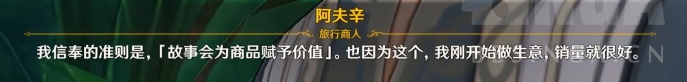
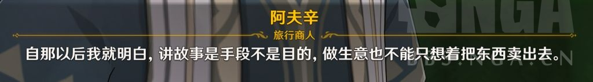

### [不吐不快]都搞不清mhy对散是爱还是恨了

Made by ngapost2md (c) ludoux [GitHub Repo](https://github.com/ludoux/ngapost2md)

##### 热门回复

- [1楼](#pid704381566): 洗白文是米自发的 被喷是玩家自发...
- [2楼](#pid704381949): 居然怀疑太子的内部爱[s:ac:哭笑]他...
- [5楼](#pid704382788): 懂不懂十喵图的含金量啊...
- [13楼](#pid704386144): 可能就是太爱了才会把剧情写成那样，毕竟太...

----

##### 0.[0] \<pid:0\> 2023-07-23 19:42:16 by 梦一下怎么了
说恨吧，独一无二的飞天机制，戏里戏外给够资源，各种买水造势
说爱吧，又感觉像把散架起来烤制造话题，快复刻了才让人写洗白文被喷几万楼，还有做成孤儿c一眼就不会高的使用率

----

##### 1.[215] \<pid:704381566\> 2023-07-23 19:48:42 by 洒家头上有只喵
洗白文是米自发的
被喷是玩家自发的；
孤儿风c是指落地配好超级专拐+适配圣遗物+契合提升专武+强需求大世界地图
看出来实在找不到米对散的恨于是随便找点凑一凑了

----

##### 2.[134] \<pid:704381949\> 2023-07-23 19:51:03 by 怎样才能不被禁言1
居然怀疑太子的内部爱他这机制给珐姐我绝不会停在1+1

----

##### 3.[0] \<pid:704382230\> 2023-07-23 19:52:44 by 吃烤肉去啊
对编剧来说既不爱也不恨，只是工具而已。
但不排除有些内部画师或者宣发超爱

----

##### 4.[20] \<pid:704382245\> 2023-07-23 19:52:47 by 今锁朱楼
我觉得是爱的，其他不说给了这么多东西就凭沉没成本也不会放弃。
问题在于爱没用啊，爱又不能弥补曾经的逻辑漏洞和散兵的黑点。

----

##### 5.[96] \<pid:704382788\> 2023-07-23 19:55:59 by 断神霹雳001
懂不懂十喵图的含金量啊

----

##### 6.[32] \<pid:704383236\> 2023-07-23 19:58:41 by Aster7
为了能让他进池并且美美参加大团建，不惜毁了本来好评众多的一国剧情，还让无数自机成了小丑，内部恨好恨啊

----

##### 7.[22] \<pid:704383402\> 2023-07-23 19:59:46 by 小kotomi
甚至崩了3.6的流水

----

##### 8.[17] \<pid:704383478\> 2023-07-23 20:00:12 by 这游戏真给我整沉默了
要是不在意还花钱给他买洗白文啊？笑死

----

##### 9.[0] \<pid:704385025\> 2023-07-23 20:09:35 by 梦一下怎么了
>[jump](#pid704383478) 这游戏真给我整沉默了(2023-07-23 20:00) 说: 
>
>要是不在意还花钱给他买洗白文啊？笑死

这个发的节点就很耐人寻味，早不发，在大伙快要遗忘掉他的时候发，内部看到散宝又被车了几万楼会怎样想呢

----

##### 10.[3] \<pid:704385076\> 2023-07-23 20:09:50 by 是的魈很弱
爱，但是能力不够显得小丑了

----

##### 11.[24] \<pid:704385226\> 2023-07-23 20:10:44 by 在豆田发现少女
肯定是爱的，但米内部人以群分物以类聚，都是废物才能写出这么废物的内部爱

----

##### 12.[22] \<pid:704385705\> 2023-07-23 20:13:26 by 理查德骗吃骗喝
前几天不是有匿名来里版说高层超爱吗，基层员工就不知道了，但看十喵图美工应该是爱的

----

##### 13.[68] \<pid:704386144\> 2023-07-23 20:15:32 by 泪滴洇湿的言语
可能就是太爱了才会把剧情写成那样，毕竟太爱了就没脑子了。不用怀疑米哈游对流的爱，假期半夜三更加班的含金量，各种水军公关控评删评各种推广的含金量。网友随便搞的梗分分钟游戏里就加屏蔽词，明明连敏感的wef都没有。独一档的检查名字，强制性改名而且不能乱改不能骂。你为什么会怀疑米哈游不爱流呢。米哈游哪怕原地反叛咱中国都不会恨流。

----

##### 14.[9] \<pid:704387536\> 2023-07-23 20:22:12 by 吃烤肉去啊
>[jump](#pid704382245) 今锁朱楼(2023-07-23 19:52)说:
>我觉得是爱的，其他不说给了这么多东西就凭沉没成本也不会放弃。
>问题在于爱没用啊，爱又不能弥补曾经的逻辑漏洞和散兵的黑点。

事实上都不说放不放弃散兵，散兵的刻画你去掉那些滤镜，整就一个彻头彻尾的小人。以至于对其他角色正常的称赞都好像在骂散兵一样。
可以说，散兵目前烂到地心的风评是mhy一手打造、一手引导的，如果真想救早就救了，现在已经晚了。
即使他以后真的救了纳西妲的命、真的拯救了整个须弥也只会被骂得更狠，还会连带着破坏与他剧情相关的其他本来真善美的角色全都变成了假仁假义假美好了。
都不说别的，假设散兵是最后拯救了须弥的英雄，那赛诺、艾尔海森、纳西妲这一系列本应由他们来拯救须弥的角色，必然会沦为用来衬托散兵高光的小丑。
这会直接动摇原神、mhy所有编剧的立身之本，也就是贯彻mhy所有作品的主题“爱与正义”会因为散兵的存在而变成一个彻底的笑话。
所以说，从长远来看散兵反而是站在所有编剧对立面的角色。
因此，即使真的有个别编剧对散兵的喜爱超出常理，最终也只会成为破坏其他编剧心血的眼中钉，被按回他自身应有的位置。
也就是作为一个真正的负面标杆，以他的卑鄙衬托别人的高尚，用他的恶心衬托别人的善良。只要能借他捧起来另一个角色，那对他的投入也不算太亏。
打个比方，就像他前脚踩莱依拉比赛不使用占星术没有觉悟，莫娜后脚就能以占星术士的原则和正直来反踩他。这才只是刚开始试一试水温，后面肯定还有更狠的。

----

##### 15.[2] \<pid:704388481\> 2023-07-23 20:26:04 by 梦一下怎么了
>[jump](#pid704386144) 泪滴洇湿的言语(2023-07-23 20:15) 说: 
>
>可能就是太爱了才会把剧情写成那样，毕竟太爱了就没脑子了。不用怀疑米哈游对流的爱，假期半夜三更加班的含金量，各种水军公关控评删评各种推广的含金量。网友随便搞的梗分分钟游戏里就加屏蔽词，明明连敏感的wef都没有。独一档的检查名字，强制性改名而且不能乱改不能骂。你为什么会怀疑米哈游不爱流呢。米哈游哪怕原地反叛咱中国都不会恨流。

除了本国历史hy一直很敏感，我签名带个星怒都审核不通过

----

##### 16.[5] \<pid:704389192\> 2023-07-23 20:29:09 by 冷泠棱凌
>[jump](#pid704387536) 吃烤肉去啊(2023-07-23 20:22) 说: 
>
>事实上都不说放不放弃散兵，散兵的刻画你去掉那些滤镜，整就一个彻头彻尾的小人。以至于对其他角色正常的称赞都好像在骂散兵一样。
>可以说，散兵目前烂到地心的风评是mhy一手打造、一手引导的，如果真想救早就救了，现在已经晚了。
>即使他以后真的救了纳西妲的命、真的拯救了整个须弥也只会被骂得更狠，还会连带着破坏与他剧情相关的其他本来真善美的角色全都变成了假仁假义假美好了。
>都不说别的，假设散兵是最后拯救了须弥的英雄，那赛诺、艾尔海森、纳西妲这一系列本应由他们来拯救须弥的角色，必然会沦为用来衬托散兵高光的小丑

这么看来，散兵3.0大版本之前的塑造就很耐人寻味。
如果他真的被高层爱到了极致，那为何不一开始不
就把他塑造成伟光正的形象呢？做个万叶plus那样的角色，虽然肯定也有人骂，好歹不会像现在这样三观炸裂。还是说米哈游的文案对自己的笔力太过自信，觉得自己有能力驾驭一个所谓的黑白之间的立体角色？

----

##### 17.[15] \<pid:704390502\> 2023-07-23 20:34:54 by 嘀嘟滴嘟嘀
米哈游对散兵人憎狗嫌的状况事实上非常了解。
比如说3.6大版本活动特意在草神卡池末期才开，万叶池子尾巴才买枫散商单，挽留玩家商单因为有散兵挽瘤失败up主不得不关闭评论区，还有五一假期凌晨加班、流水和热度下滑等等直接或者间接影响，就这种情况了还要买商单硬推，不是内部爱是什么？

----

##### 18.[17] \<pid:704391274\> 2023-07-23 20:38:03 by 卯林毛癸梅晏
为什么明明都把“这里是散神，该滚的是你们吧”写脸上了还会有人质疑它对它散爹的爱，米哈游是不是应该反思一下自己了

----

##### 19.[15] \<pid:704391656\> 2023-07-23 20:39:16 by 吃烤肉去啊
>[jump](#pid704389192) 冷泠棱凌(2023-07-23 20:29)说:
>>[jump](#pid704387536) 吃烤肉去啊(2023-07-23 20:22) 说: 
>>
>>事实上都不说放不放弃散兵，散兵的刻画你去掉那些滤镜，整就一个彻头彻尾的小人。以至于对其他角色正常的称赞都好像在骂散兵一样。
>>可以说，散兵目前烂到地心的风评是mhy一手打造、一手引导的，如果真想救早就救了，现在已经晚了。
>>即使他以后真的救了纳西妲的命、真的拯救了整个须弥也只会被骂得更狠，还会连带着破坏与他剧情相关的其他本来真善美的角色全都变成了假仁假义假美好了。
>>都不说别的，假设散兵是最后拯救了须弥的英雄，那赛诺、艾尔海森、纳西妲这一系列本应由他们来拯救须弥的角色，必然会沦为用来衬托散兵高光的小丑
>
>这么看来，散兵3.0大版本之前的塑造就很耐人寻味。
>如果他真的被高层爱到了极致，那为何不一开始不
>就把他塑造成伟光正的形象呢？做个万叶plus那样的角色，虽然肯定也有人骂，好歹不会像现在这样三观炸裂。还是说米哈游的文案对自己的笔力太过自信，觉得自己有能力驾驭一个所谓的黑白之间的立体角色？

我觉得散兵是很明显有故意操纵争议性的角色。
从雷神到万叶到魈，从剧情到风C定位，有关无关的全都被他惹了个遍。
而且编剧真的不是不知道什么样的塑造才能让角色的风评好，就以散厨喜欢吹的[风雅]为例，在mhy心目中的风雅之人是这样的：
[quote]风雅是不谄媚。风雅之人永远是高贵的。正似只愿高飞与雷暴争鸣的海鹰；迎合鄙俗则恰如将花冠倒插泥淖，仅让尊严染上了污渍。
风雅是不倨傲。风雅之人永远是谦虚的。只有消除虚荣与怠慢，才能明亮双眼，从哪怕最不堪入目的表象之下寻求美与雅致的真境。
风雅是不庸俗。风雅之人永远是独行的。不屈于平庸之恶，不感动于平庸之爱，不逃避于平庸的无知，才可能明辨何为雅致与鄙陋。[/quote]而编剧笔下的散兵，正好是不敢与雷暴争鸣让尊严染上污渍，既虚荣又怠慢毫不谦虚，既屈从于平庸之恶又逃避平庸的无知。所以他刻画出来的散兵既谄媚又倨傲还庸俗。
哪怕是所谓的“正机之神”，文案也要写他“于此颠倒梦想、剜去心因”。
颠倒梦想，即无法涅槃。剜去心因，即不得善果。
所以散兵会崩成现在这样我真的毫不意外，真正让我意外的反而是那些孜孜不倦不肯承认散兵本来就只是个负面角色、总是在给他贷款高光吹嘘深度的人。

----

##### 20.[14] \<pid:704392114\> 2023-07-23 20:40:53 by 今锁朱楼
>[jump](#pid704387536) 吃烤肉去啊(2023-07-23 20:22)说:
>>[jump](#pid704382245) 今锁朱楼(2023-07-23 19:52)说:
>>我觉得是爱的，其他不说给了这么多东西就凭沉没成本也不会放弃。
>>问题在于爱没用啊，爱又不能弥补曾经的逻辑漏洞和散兵的黑点。
>
>事实上都不说放不放弃散兵，散兵的刻画你去掉那些滤镜，整就一个彻头彻尾的小人。以至于对其他角色正常的称赞都好像在骂散兵一样。
>可以说，散兵目前烂到地心的风评是mhy一手打造、一手引导的，如果真想救早就救了，现在已经晚了。
>即使他以后真的救了纳西妲的命、真的拯救了整个须弥也只会被骂得更狠，还会连带着破坏与他剧情相关的其他本来真善美的角色全都变成了假仁假义假美好了。
>都不说别的，假设散兵是最后拯救了须弥的英雄，那赛诺、艾尔海森、纳西妲这一系列本应由他们来拯救须弥的角色，必然会沦为用来衬托散兵高光的小丑。
>这会直接动摇原神、mhy所有编剧的立身之本，也就是贯彻mhy所有作品的主题“爱与正义”会因为散兵的存在而变成一个彻底的笑话。
>所以说，从长远来看散兵反而是站在所有编剧对立面的角色。
>因此，即使真的有个别编剧对散兵的喜爱超出常理，最终也只会成为破坏其他编剧心血的眼中钉，被按回他自身应有的位置。
>也就是作为一个真正的负面标杆，以他的卑鄙衬托别人的高尚，用他的恶心衬托别人的善良。只要能借他捧起来另一个角色，那对他的投入也不算太亏。
>打个比方，就像他前脚踩莱依拉比赛不使用占星术没有觉悟，莫娜后脚就能以占星术士的原则和正直来反踩他。这才只是刚开始试一试水温，后面肯定还有更狠的。

我说实话如果是我，枫丹就撕他的卡，既能让玩家出气，还能在玩家要求其他他更不想做的事时堵玩家的嘴，也能最后引一波流量给这个新角色冲一冲流水，说不定能回到之前的水平上。
散兵的低风评也不怕大部分人逆反。

----

##### 21.[23] \<pid:704392646\> 2023-07-23 20:42:37 by 嘀嘟滴嘟嘀
>[jump](#pid704389192) 冷泠棱凌(2023-07-23 20:29) 说: 
>
>这么看来，散兵3.0大版本之前的塑造就很耐人寻味。
>如果他真的被高层爱到了极致，那为何不一开始不
>就把他塑造成伟光正的形象呢？做个万叶plus那样的角色，虽然肯定也有人骂，好歹不会像现在这样三观炸裂。还是说米哈游的文案对自己的笔力太过自信，觉得自己有能力驾驭一个所谓的黑白之间的立体角色？

不要把散兵当作米哈游员工的爱，把它当作米哈游员工的替身，
人最爱的就是自己，米哈游员工就是喜欢岁月史树和饿人蒸鸡，一切就能说得通。
自己做坏事哪能是坏事呢？都是被逼的。自己做了坏事怎么会认错呢？都是你们不懂我。

----

##### 22.[3] \<pid:704392900\> 2023-07-23 20:43:26 by 梦一下怎么了
>[jump](#pid704392114) 今锁朱楼(2023-07-23 20:40) 说: 
>
>我说实话如果是我，枫丹就撕他的卡，既能让玩家出气，还能在玩家要求其他他更不想做的事时堵玩家的嘴，也能最后引一波流量给这个新角色冲一冲流水，说不定能回到之前的水平上。
>散兵的低风评也不怕大部分人逆反。

就看梦里的那位女士能不能爆散金币了

----

##### 23.[23] \<pid:704394482\> 2023-07-23 20:48:55 by 今锁朱楼
>[jump](#pid704392646) 嘀嘟滴嘟嘀(2023-07-23 20:42)说:
>>[jump](#pid704389192) 冷泠棱凌(2023-07-23 20:29) 说: 
>>
>>这么看来，散兵3.0大版本之前的塑造就很耐人寻味。
>>如果他真的被高层爱到了极致，那为何不一开始不
>>就把他塑造成伟光正的形象呢？做个万叶plus那样的角色，虽然肯定也有人骂，好歹不会像现在这样三观炸裂。还是说米哈游的文案对自己的笔力太过自信，觉得自己有能力驾驭一个所谓的黑白之间的立体角色？
>
>不要把散兵当作米哈游员工的爱，把它当作米哈游员工的替身，
>人最爱的就是自己，米哈游员工就是喜欢岁月史树和饿人蒸鸡，一切就能说得通。
>自己做坏事哪能是坏事呢？都是被逼的。自己做了坏事怎么会认错呢？都是你们不懂我。

之前黑客那事爆出来内部画师喜欢散兵我真是一点都不意外，散兵这个角色的形象和一些wb小画师真的是如出一辙。

----

##### 24.[0] \<pid:704394783\> 2023-07-23 20:50:09 by 何時會有HE的存在
這大概是戀愛腦唄

----

##### 25.[7] \<pid:704395721\> 2023-07-23 20:53:36 by 冷泠棱凌
>[jump](#pid704391656) 吃烤肉去啊(2023-07-23 20:39) 说: 
>
>我觉得散兵是很明显有故意操纵争议性的角色。
>从雷神到万叶到魈，从剧情到风C定位，有关无关的全都被他惹了个遍。
>而且编剧真的不是不知道什么样的塑造才能让角色的风评好，就以散厨喜欢吹的[风雅]为例，在mhy心目中的风雅之人是这样的：
>而编剧笔下的散兵，正好是不敢与雷暴争鸣让尊严染上污渍，既虚荣又怠慢毫不谦虚，既屈从于平庸之恶又逃避平庸的无知。所以他刻画出来的散兵既谄媚又倨傲还庸俗。
>哪怕是所谓的“正机之神”，文案也要写他“于此颠倒梦想、剜去心因”。
>颠倒梦想，即无法涅槃。剜去心因，即不得善果。
>所以

唉，唉。
可叹雷神一时恻隐给自己招来多少非议。
可叹万叶神里兄妹恐毕生永远无法触及真相。
可叹草神因他一人风评跌落神坛多米诺骨牌般崩坏至再起不能。
可叹多少人心心念念想他被大众喜欢最后落得个千夫所指下场。
可叹散兵其人亦不过一纸上投影。虽他之所思非他所思，而他之所想又确他所想，多重拉扯至此，可不比受车裂之法的囚犯，此生已定在一个“死”字之上，而最终连全尸也无从收得。

----

##### 26.[14] \<pid:704396080\> 2023-07-23 20:55:00 by Seeyoupelos
岁月史书，强推七圣，沙漠连发，流水低迷，须弥几个版本全是烂活，谁管你内部爱恨，能力不行就滚粗吧。

----

##### 27.[8] \<pid:704396082\> 2023-07-23 20:55:01 by 冷泠棱凌
>[jump](#pid704392646) 嘀嘟滴嘟嘀(2023-07-23 20:42) 说: 
>
>不要把散兵当作米哈游员工的爱，把它当作米哈游员工的替身，
>人最爱的就是自己，米哈游员工就是喜欢岁月史树和饿人蒸鸡，一切就能说得通。
>自己做坏事哪能是坏事呢？都是被逼的。自己做了坏事怎么会认错呢？都是你们不懂我。

此等嘴脸，倒确实与美好的二次元割裂得生分，颇有三次现实的脏臭感了。

----

##### 28.[16] \<pid:704396099\> 2023-07-23 20:55:05 by 球球游侠
>[jump](#pid704391656) 吃烤肉去啊(2023-07-23 20:39) 说: 
>
>我觉得散兵是很明显有故意操纵争议性的角色。
>从雷神到万叶到魈，从剧情到风C定位，有关无关的全都被他惹了个遍。
>而且编剧真的不是不知道什么样的塑造才能让角色的风评好，就以散厨喜欢吹的[风雅]为例，在mhy心目中的风雅之人是这样的：
>而编剧笔下的散兵，正好是不敢与雷暴争鸣让尊严染上污渍，既虚荣又怠慢毫不谦虚，既屈从于平庸之恶又逃避平庸的无知。所以他刻画出来的散兵既谄媚又倨傲还庸俗。
>哪怕是所谓的“正机之神”，文案也要写他“于此颠倒梦想、剜去心因”。
>颠倒梦想，即无法涅槃。剜去心因，即不得善果。
>所以

说不定还真是内部不统一造成了散兵现在的割裂，不论是主线与自己角色故事的割裂，还是行为动机上的前后矛盾，将爱和恨都杂糅在一起了，让他像一具腐烂而华丽的腐尸，乍一看好像是美的，但稍微一凑近就会发现其臭不可闻的本质，最终米哈游高层也不知道是出于什么原因，将这个拼凑在一起的本就充满矛盾的角色就这么推出来了，他的矛盾自推出就有，也不怪乎社区关于他的讨论会持续不断，说不定老米就是馋这一口脏流量呢？

且不论内部制作组是不是真爱，但宣发的那一帮子东西确实很爱，天天还孜孜不倦的给我推炸裂眼睛的玩意，频率也踏马的很固定，一周2，3回，热门必有他野跌

----

##### 29.[2] \<pid:704397032\> 2023-07-23 20:58:39 by 梦一下怎么了
>[jump](#pid704394482) 今锁朱楼(2023-07-23 20:48) 说: 
>
>之前黑客那事爆出来内部画师喜欢散兵我真是一点都不意外，散兵这个角色的形象和一些wb小画师真的是如出一辙。

这又是什么瓜wb小画家喜欢他不奇怪，人均想润北欧恨父母恨同学

----

##### 30.[2] \<pid:704397484\> 2023-07-23 21:00:22 by 梦一下怎么了
我是每次感觉原很凉了就把散放出来搞节奏

----

##### 31.[7] \<pid:704398303\> 2023-07-23 21:03:33 by 今锁朱楼
>[jump](#pid704397032) 梦一下怎么了(2023-07-23 20:58)说:
>>[jump](#pid704394482) 今锁朱楼(2023-07-23 20:48) 说: 
>>
>>之前黑客那事爆出来内部画师喜欢散兵我真是一点都不意外，散兵这个角色的形象和一些wb小画师真的是如出一辙。
>
>这又是什么瓜wb小画家喜欢他不奇怪，人均想润北欧恨父母恨同学

就是国外爆设计图结果爆出来画师内部爱散兵，一张图十只猫，姿态各异一看就很上心那件事啦。
一说北欧小画师，想起来前段时间小画师推特画师入驻的时候破防的好笑样子了。

----

##### 32.[5] \<pid:704400512\> 2023-07-23 21:12:33 by 火炎焱燚之浮浪人
>[jump](#pid704392900) 梦一下怎么了(2023-07-23 20:43) 说: 
>
>就看梦里的那位女士能不能爆散金币了

玛雅，就怕那位连珐姐这位风系专拐都蹭不到。

----

##### 33.[4] \<pid:704401143\> 2023-07-23 21:15:28 by 鼠卫兵
爱是盲目的
水平是有限的

----

##### 34.[12] \<pid:704402766\> 2023-07-23 21:22:54 by 音羽城
别的先不说，独一无二的改名+飞天机制，专门出了风拐，拿了一位高人气七神给他当垫子背书洗白，我由衷希望米桑也能这么恨一下优菈，
对于米桑和散，我只能说一句“它超爱”

----

##### 35.[7] \<pid:704403059\> 2023-07-23 21:24:13 by 梦一下怎么了
>[jump](#pid704400512) 火炎焱燚之浮浪人(2023-07-23 21:12) 说: 
>
>玛雅，就怕那位连珐姐这位风系专拐都蹭不到。

米为了散宝流水也不要了，他真的

----

##### 36.[0] \<pid:704404734\> 2023-07-23 21:32:22 by 雷军单推人
>[jump](#pid704390502) 嘀嘟滴嘟嘀(2023-07-23 20:34)说:
>米哈游对散兵人憎狗嫌的状况事实上非常了解。
>比如说3.6大版本活动特意在草神卡池末期才开，万叶池子尾巴才买枫散商单，挽留玩家商单因为有散兵挽瘤失败up主不得不关闭评论区，还有五一假期凌晨加班、流水和热度下滑等等直接或者间接影响，就这种情况了还要买商单硬推，不是内部爱是什么？

插个楼 楼主头像哪里能找啊

----

##### 37.[1] \<pid:704406770\> 2023-07-23 21:42:26 by xlsq03
或许你应该听说过恋爱脑和爱使人失去理智

----

##### 38.[0] \<pid:704410410\> 2023-07-23 22:00:38 by 嘀嘟滴嘟嘀
>[jump](#pid704404734) 雷军单推人(2023-07-23 21:32) 说: 
>
>插个楼 楼主头像哪里能找啊

P站的，id忘了

----

##### 39.[0] \<pid:704412508\> 2023-07-23 22:10:51 by 理查德骗吃骗喝
>[jump](#pid704387536) 吃烤肉去啊(2023-07-23 20:22) 说: 
>
>事实上都不说放不放弃散兵，散兵的刻画你去掉那些滤镜，整就一个彻头彻尾的小人。以至于对其他角色正常的称赞都好像在骂散兵一样。
>可以说，散兵目前烂到地心的风评是mhy一手打造、一手引导的，如果真想救早就救了，现在已经晚了。
>即使他以后真的救了纳西妲的命、真的拯救了整个须弥也只会被骂得更狠，还会连带着破坏与他剧情相关的其他本来真善美的角色全都变成了假仁假义假美好了。
>都不说别的，假设散兵是最后拯救了须弥的英雄，那赛诺、艾尔海森、纳西妲这一系列本应由他们来拯救须弥的角色，必然会沦为用来衬托散兵高光的小丑

烤肉哥你的分析不是没有道理，但你好像忘了这种游戏公司文案的地位都不会太高，也就是说美术建模甚至动画定稿之后文案才能确定自己具体要写什么，完全是高层怎么指挥他们怎么填句子，而米哈游甚至不是一家上市公司，只要三巨头不插手高层完全可以为所欲为，就算有文案不满，他们还能起义不成？当然我现在也很怀疑三巨头给公司定了什么大方向，把游戏和社区搞得这么抽象

----

##### 40.[2] \<pid:704413766\> 2023-07-23 22:16:58 by Lilith330
从结果反推动机不是很准确 
主要是看你想不想把这种强推理解成“爱”，还是说是一种商业策略
那个十猫图其实我觉得还好，美术不算什么有决定权的大人物，在草稿上厨放一下不影响策略，其实那批图里还有一些角色草图上有一些比较随意的发散，毕竟不是什么很严肃正规的定稿图，只是散兵那画师随意口嗨的一些玩意和游戏最终表现出来的东西差不多才显得绷不住，不知道该说是简陋还是完全不觉得不妥
如果承认是商业策略强推，那就是为什么要给这个角色下注，饭圈化或许是米本来就想选择的捷径，风男更是他们选中的试验田，前几个风男本身质量过得去，宣发有往饭圈引导的意思，但总体来说还是限制在正常一般向二游范围内，不然风男节奏也不至于现在才引爆。

----

##### 41.[0] \<pid:704414458\> 2023-07-23 22:20:20 by 吃烤肉去啊
>[jump](#pid704412508) 理查德骗吃骗喝(2023-07-23 22:10)说:
>>[jump](#pid704387536) 吃烤肉去啊(2023-07-23 20:22) 说: 
>>
>>事实上都不说放不放弃散兵，散兵的刻画你去掉那些滤镜，整就一个彻头彻尾的小人。以至于对其他角色正常的称赞都好像在骂散兵一样。
>>可以说，散兵目前烂到地心的风评是mhy一手打造、一手引导的，如果真想救早就救了，现在已经晚了。
>>即使他以后真的救了纳西妲的命、真的拯救了整个须弥也只会被骂得更狠，还会连带着破坏与他剧情相关的其他本来真善美的角色全都变成了假仁假义假美好了。
>>都不说别的，假设散兵是最后拯救了须弥的英雄，那赛诺、艾尔海森、纳西妲这一系列本应由他们来拯救须弥的角色，必然会沦为用来衬托散兵高光的小丑
>
>烤肉哥你的分析不是没有道理，但你好像忘了这种游戏公司文案的地位都不会太高，也就是说美术建模甚至动画定稿之后文案才能确定自己具体要写什么，完全是高层怎么指挥他们怎么填句子，而米哈游甚至不是一家上市公司，只要三巨头不插手高层完全可以为所欲为，就算有文案不满，他们还能起义不成？当然我现在也很怀疑三巨头给公司定了什么大方向，把游戏和社区搞得这么抽象

mhy的文案可比美工地位高
你美工给角色外观设计得再有B格，“考据”得上天入地，我文案就是不想让他出场，你能怎么办(路过的赛诺、妮露、艾尔海森：……)
这或许也是剧情抽象的原因之一，因为搞文学的往往容易自我陶醉，所以可能故意不说人话。
一些明褒暗贬、明贬暗褒的小把戏，轻度玩家是分辨不出来的。

----

##### 42.[0] \<pid:704418790\> 2023-07-23 22:44:57 by 这游戏真给我整沉默了
>[jump](#pid704385025) 梦一下怎么了(2023-07-23 20:09) 说: 
>
>这个发的节点就很耐人寻味，早不发，在大伙快要遗忘掉他的时候发，内部看到散宝又被车了几万楼会怎样想呢

按照饭圈的话术就是黑红也是红，不怕黑红就怕被人遗忘

----

##### 43.[8] \<pid:704418925\> 2023-07-23 22:45:57 by 标的物的风险分担
懂不懂waf不是屏蔽词 骂散兵的名字会被屏蔽的含金量啊

----

##### 44.[1] \<pid:704419286\> 2023-07-23 22:48:05 by bbb7789
对散是什么态度先不论，对他的厨子应该是真的感到高兴吧

----

##### 45.[1] \<pid:704419473\> 2023-07-23 22:49:02 by somebodyelse
这么生硬的洗，我只能说头像好评，散艹99喵

----

##### 46.[1] \<pid:704420211\> 2023-07-23 22:53:17 by 普露璐特
>[jump](#pid704392900) 梦一下怎么了(2023-07-23 20:43) 说: 
>
>就看梦里的那位女士能不能爆散金币了

风申鹤

----

##### 47.[0] \<pid:704420328\> 2023-07-23 22:53:59 by 理查德骗吃骗喝
>[jump](#pid704414458) 吃烤肉去啊(2023-07-23 22:20) 说: 
>
>mhy的文案可比美工地位高
>你美工给角色外观设计得再有B格，“考据”得上天入地，我文案就是不想让他出场，你能怎么办(路过的赛诺、妮露、艾尔海森：……)
>这或许也是剧情抽象的原因之一，因为搞文学的往往容易自我陶醉，所以可能故意不说人话。
>一些明褒暗贬、明贬暗褒的小把戏，轻度玩家是分辨不出来的。

但是年初的员工截图明确说了文案组会为了写自己想写的东西去学动画啊，动画定稿应该是在文案之前吧？

----

##### 48.[1] \<pid:704420970\> 2023-07-23 22:57:48 by 梦一下怎么了
>[jump](#pid704420211) 普露璐特(2023-07-23 22:53) 说: 
>
>风申鹤

散宝的五星拐终于有着落了

----

##### 49.[0] \<pid:704422587\> 2023-07-23 23:07:02 by 罗一川
米对散兵不就典型的一粉顶十黑么，本来还没那么多人讨厌他，内部有逆天发癫直接导致风评跌穿地心

----

##### 50.[1] \<pid:704423150\> 2023-07-23 23:09:57 by 泪滴洇湿的言语
>[jump](#pid704420211) 普露璐特(2023-07-23 22:53) 说: 
>
>风申鹤

好耶流太子的五星专辅来了。

诶我说假如留云进池是流太子的五星专辅离开流就连丘丘人都a不动你们抽吗。毕竟米哈游还真做得出来。

----

##### 51.[0] \<pid:704423456\> 2023-07-23 23:11:42 by 梦一下怎么了
>[jump](#pid704423150) 泪滴洇湿的言语(2023-07-23 23:09) 说: 
>
>好耶流太子的五星专辅来了。
>
>诶我说假如留云进池是流太子的五星专辅离开流就连丘丘人都a不动你们抽吗。毕竟米哈游还真做得出来。

都退游了还抽那就祝散神蒸蒸日上吧

----

##### 52.[0] \<pid:704424150\> 2023-07-23 23:15:48 by 泪滴洇湿的言语
>[jump](#pid704423456) 梦一下怎么了(2023-07-23 23:11) 说: 
>
>都退游了还抽那就祝散神蒸蒸日上吧

我还在白嫖呢，说不定到留云进池我直接白嫖拿不花一分钱。不过搞成流专辅那就拜拜六。会觉得很晦气。

----

##### 53.[1] \<pid:704424324\> 2023-07-23 23:16:49 by 吃烤肉去啊
>[jump](#pid704420328) 理查德骗吃骗喝(2023-07-23 22:53)说:
>[quote][pid=704414458,37107772,3]Reply[/pid] <b>Post by [uid=63987990]吃烤肉去啊[/uid] (2023-07-23 22:20):</b>  mhy的文案可比美工地位高[s:ac:哭笑] 你美工给角色外观设计得再有B格，“考据”得上天入地，我文案就是不想让他出场，你能怎么办[s:ac:哭笑](路过的赛诺、妮露、艾尔海森：……) 这或许也是剧情抽象的原因之一，因为搞文学的往往容易自我陶醉，所以可能故意不说人话。 一些明褒暗贬、明贬暗褒的小把戏，轻度玩家是分辨不出来的。[/quote]但是年初的员工截图明确说了文案组会为了写自己想写的东西去学动画啊，动画定稿应该是在文案之前吧？

虽然我不知道他们内部分工是怎么安排的，不过也只有当自己的工作内容涉及到对方，才有学的必要吧。
如果是先定好了动画，那就只有动画干预文案的份。
只有先出文案后定动画，文案才有必要去了解动画的表现效果如何、符不符合自己的心意。

而且mhy真的对自己的剧情很自信，不是一般的自信
他是真想靠自己那漏洞百出还一个劲美好能量的剧情吃饭，之前在妮露的传说任务里我就明显感觉到了幕后编剧那过于旺盛的表达欲。

与其说这个传说任务是为了塑造妮露，更像是编剧借妮露的故事来说教一些大道理。
先不说这个行为本质上很不尊重角色，但既然米哈游要靠故事赋予商品价值，那就不可能脱离对真善美的歌颂，因为只有玩家能从中感受到美好的故事才是有价值的故事。
所以当散兵的存在只会对这个贩卖梦想的柜台产生破坏、当mhy在兜售商品的时候他却暴露了这些假冒伪劣根本不值钱，自然会被商家从光鲜亮丽的柜台上移除掉。

----

##### 54.[1] \<pid:704424449\> 2023-07-23 23:17:35 by Fablet
这肯定是爱啊。
要是恨的话，甚至“要是不够爱的话”，根本犯不着为了他，又是扛着退坑浪潮又是扛着众人诋毁堵嘴，又是买pv宣传又是绑人气角色凑cp，一整个“只是你们看不懂我家宝宝的好，多看看就懂了”的思考模式。
直接杀了他祭天就完了。
说不定还能推出一个新的赚够路人缘的角色回血。

----

##### 55.[1] \<pid:704426169\> 2023-07-23 23:27:17 by 朔夜寒光
米是真的爱散，这种爱恋已经可以算是游戏历史上一段佳话了。须弥前就不算了，进入须弥之后，直接给散安排了一段三次背叛的cg，安排了一个最初的狂信徒。用了一个作为主线的间章(有主线任务粉球的)来塑造，为了散不惜修改整个原神的基本设定，不惜把两个版本大活动内容吃书(容彩祭、海岛2)，用一个愚人众高级执行官、两个神、两个原来所谓的“内部爱”(万叶神里)、甚至疑似修改整个须弥主线剧情作为垫子来塑造散。3.6更是不惜把须弥其他所有自机角色变成小丑，来凸显她们流哥的英明神武。如果这都不算爱，那这个世界就没有真爱可言了。

----

##### 56.[1] \<pid:704426987\> 2023-07-23 23:32:38 by 被爱概率如宇宙
典型内部爱了，3.1到3.3花了三个大版本塑造他，相比之下草神.....拉两位高人气神给他当故事背景垫背，铺垫从1.1开始各种小纸条限时活动就没停过，官方举办的同人活动似乎都有给他买两个以上的商单，以他为主角的商单同人曲同人动画cp也买得很多，给他买热搜买洗白长文买推广etc.更别说还有演绎版周本音乐和游戏里各种优待，两个主题秘境两套圣遗物，无剧情复刻也有live2d作为补偿。综上所述找不到第二个原神里比他待遇还好的角色了，这待遇放眼二游都是炸裂的，已经如此了还有些散解卖惨哭散兵待遇散兵内部恨的未免太不要脸了楼里有些人有内部恨他的这种错觉难道不是溺爱过度一粉顶十黑吗？mhy对散兵的钱和精力投入已经非常明显了

----

##### 57.[0] \<pid:704427126\> 2023-07-23 23:33:28 by 梦一下怎么了
>[jump](#pid704426169) 朔夜寒光(2023-07-23 23:27) 说: 
>
>米是真的爱散，这种爱恋已经可以算是游戏历史上一段佳话了。须弥前就不算了，进入须弥之后，直接给散安排了一段三次背叛的cg，安排了一个最初的狂信徒。用了一个作为主线的间章(有主线任务粉球的)来塑造，为了散不惜修改整个原神的基本设定，不惜把两个版本大活动内容吃书(容彩祭、海岛2)，用一个愚人众高级执行官、两个神、两个原来所谓的“内部爱”(万叶神里)、甚至疑似修改整个须弥主线剧情作为垫子来塑造散。3.6更是不惜把须弥其他所有自机角色变成小丑，来凸显她们流哥的英明神武。如果这都不算爱，那这个世界就没有真爱

然而现实是在散的衬托下，大众对提纳里赛诺海哥的好感度up，对万叶神里多了怜惜

----

##### 58.[0] \<pid:704427235\> 2023-07-23 23:34:07 by 吃烤肉去啊
>[jump](#pid704420328) 理查德骗吃骗喝(2023-07-23 22:53)说:
>[quote][pid=704414458,37107772,3]Reply[/pid] <b>Post by [uid=63987990]吃烤肉去啊[/uid] (2023-07-23 22:20):</b>  mhy的文案可比美工地位高[s:ac:哭笑] 你美工给角色外观设计得再有B格，“考据”得上天入地，我文案就是不想让他出场，你能怎么办[s:ac:哭笑](路过的赛诺、妮露、艾尔海森：……) 这或许也是剧情抽象的原因之一，因为搞文学的往往容易自我陶醉，所以可能故意不说人话。 一些明褒暗贬、明贬暗褒的小把戏，轻度玩家是分辨不出来的。[/quote]但是年初的员工截图明确说了文案组会为了写自己想写的东西去学动画啊，动画定稿应该是在文案之前吧？

哦对了，我想起来了一个细节。
之前崩3有个短片，编剧介绍创作永世乐土的过程，就是由他们编剧先去找场景讨论自己想要什么样的地图。
一个编剧想做孤岛上的火箭发射基地，但另一个编剧特别想做游乐园，就一直跟场景鼓动一直劝说，最后做了游乐园，而且场景会给编剧先画示意图。
所以在mhy内部编剧对美工的影响肯定是非常大的。

----

##### 59.[0] \<pid:704427500\> 2023-07-23 23:35:39 by 普露璐特
>[jump](#pid704423150) 泪滴洇湿的言语(2023-07-23 23:09) 说: 
>
>好耶流太子的五星专辅来了。
>诶我说假如留云进池是流太子的五星专辅离开流就连丘丘人都a不动你们抽吗。毕竟米哈游还真做得出来[s:......

新剧情塑造、建模、独立行走强度，少一个都不抽。

----

##### 60.[0] \<pid:704427649\> 2023-07-23 23:36:47 by 理查德骗吃骗喝
>[jump](#pid704427235) 吃烤肉去啊(2023-07-23 23:34) 说: 
>
>哦对了，我想起来了一个细节。
>之前崩3有个短片，编剧介绍创作永世乐土的过程，就是由他们编剧先去找场景讨论自己想要什么样的地图。
>一个编剧想做孤岛上的火箭发射基地，但另一个编剧特别想做游乐园，就一直跟场景鼓动一直劝说，最后做了游乐园，而且场景会给编剧先画示意图。
>所以在mhy内部编剧对美工的影响肯定是非常大的。

没受到其他组干预也没内部爱那他们怎么写出岁月史树洗白其他这种东西的，还是说就想吃这一口黑红流量？

----

##### 61.[0] \<pid:704427872\> 2023-07-23 23:38:04 by 梦一下怎么了
>[jump](#pid704426987) 被爱概率如宇宙(2023-07-23 23:32) 说: 
>
>典型内部爱了，3.1到3.3花了三个大版本塑造他，相比之下草神.....拉两位高人气神给他当故事背景垫背，铺垫从1.1开始各种小纸条限时活动就没停过，官方举办的同人活动似乎都有给他买两个以上的商单，以他为主角的商单同人曲同人动画cp也买得很多，给他买热搜买洗白长文买推广etc.更别说还有演绎版周本音乐和游戏里各种优待，两个主题秘境两套圣遗物，无剧情复刻也有live2d作为补偿。综上所述找不到第二个原神里比他待遇还好的角色了，这待遇放眼二游都是炸裂的，已经如此了还有些散解卖惨哭散

喜欢看hy费尽心思推太子翻车现场，机关算尽夹带私货大伙不买账也太乐了能让人看清米内部的三观也算是好事了

----

##### 62.[0] \<pid:704428152\> 2023-07-23 23:39:47 by 看我把那飞机打下来
我记得3.3出来时贴吧有个高楼贴说

米哈游对散兵的爱如同唐家三少对他的亡妻的爱

----

##### 63.[0] \<pid:704428164\> 2023-07-23 23:39:51 by 梦一下怎么了
>[jump](#pid704427649) 理查德骗吃骗喝(2023-07-23 23:36) 说: 
>
>没受到其他组干预也没内部爱那他们怎么写出岁月史树洗白其他这种东西的，还是说就想吃这一口黑红流量？

米一开始就是碰瓷塞走黑红路线营销的

----

##### 64.[0] \<pid:704428312\> 2023-07-23 23:40:46 by 朔夜寒光
>[jump](#pid704427126) 梦一下怎么了(2023-07-23 23:33) 说: 
>
>然而现实是在散的衬托下，大众对提纳里赛诺海哥的好感度up，对万叶神里多了怜惜

怜惜？奖励你黑猫万叶图！

----

##### 65.[0] \<pid:704429338\> 2023-07-23 23:46:57 by 被爱概率如宇宙
>[jump](#pid704427872) 梦一下怎么了(2023-07-23 23:38) 说: 
>
>喜欢看hy费尽心思推太子翻车现场，机关算尽夹带私货大伙不买账也太乐了能让人看清米内部的三观也算是好事了

关键吧须弥版本有效剧情也就3.0到3.3，剩下的版本都是些常驻节日活动甚至还整出打牌来强制拖节奏的烂活散兵这个自机角色区别于其他自机角色还有一点就是，他生平几乎没有留白，每一个节点都给你强制性的讲得清清楚楚，而这是其他自机角色都没有的待遇。况且像米这样的商业公司钱和精力在哪里爱就在哪里不是很明显的吗，说编剧恨他那隔段时间买的商稿推广又是为什么呢有的角色一年都查无此人，有的角色见缝插针给你展现内部无处安放的厨力

----

##### 66.[0] \<pid:704430487\> 2023-07-23 23:54:03 by 吃烤肉去啊
>[jump](#pid704427649) 理查德骗吃骗喝(2023-07-23 23:36)说:
>[quote][pid=704427235,37107772,3]Reply[/pid] <b>Post by [uid=63987990]吃烤肉去啊[/uid] (2023-07-23 23:34):</b>  哦对了，我想起来了一个细节。 之前崩3有个短片，编剧介绍创作永世乐土的过程，就是由他们编剧先去找场景讨论自己想要什么样的地图。 一个编剧想做孤岛上的火箭发射基地，但另一个编剧特别想做游乐园，就一直跟场景鼓动一直劝说，最后做了游乐园，而且场景会给编剧先画示意图。 所以在mhy内部编剧对美工的影响肯定是非常大的。[/quote]没受到其他组干预也没内部爱那他们怎么写出岁月史树洗白其他这种东西的，还是说就想吃这一口黑红流量？[s:ac:哭笑]

我猜是为了捧另一个更重要的角色出来说永远不要忘记过去，罪孽不会因遗忘而消失
只有散兵做的事情足够倒行逆施、令人可恨，那个出来拨乱反正的角色才越光明磊落、打动人心。
说白了就是给原本的炮灰型角色加了一堆BUFF，以至于看上去好像有多么可悲可叹超凡脱俗，使部分观众与他共情从而怜惜他，但他本质上还是炮灰定位，注定要用自己的愚昧无知自私狂妄衬托主角的形象。
编剧给散兵取的名字，从斯卡拉姆齐到散兵到国崩到流浪者，一个正面含义的都没有。要说编剧有多么真心爱这个角色，我真的感觉不到，不过想利用他赚钱的心倒是很明显。

----

##### 67.[2] \<pid:704432386\> 2023-07-24 00:07:21 by 梦一下怎么了
>[jump](#pid704430487) 吃烤肉去啊(2023-07-23 23:54) 说: 
>
>我猜是为了捧另一个更重要的角色出来说永远不要忘记过去，罪孽不会因遗忘而消失
>只有散兵做的事情足够倒行逆施、令人可恨，那个出来拨乱反正的角色才越光明磊落、打动人心。
>说白了就是给原本的炮灰型角色加了一堆BUFF，以至于看上去好像有多么可悲可叹超凡脱俗，使部分观众与他共情从而怜惜他，但他本质上还是炮灰定位，注定要用自己的愚昧无知自私狂妄衬托主角的形象。
>编剧给散兵取的名字，从斯卡拉姆齐到散兵到国崩到流浪者，一个正面含义的都没有。要说编剧有多么真心爱这个角色，我真的感觉不到，不过想利

太乐观了，这一切假设的前提是米是个正常的商业公司，编剧不歪屁股觉得真善美能打动人心

----

##### 68.[0] \<pid:704434899\> 2023-07-24 00:24:13 by Rudimentary
>[jump](#pid704381949) 怎样才能不被禁言1(2023-07-23 19:51) 说: 
>
>居然怀疑太子的内部爱他这机制给珐姐我绝不会停在1+1

但如果散6是四星超级风拐呢(

----

##### 69.[0] \<pid:704435195\> 2023-07-24 00:26:03 by 桑葚煮酒
给了这么多的资源叫恨？能不能这样恨一恨我推

----

##### 70.[0] \<pid:704447832\> 2023-07-24 02:55:15 by 沆瀣一气zex
这么跟你说吧，有些扭曲的爱是会变成——“只许我一个人拥有”、“如果只有我喜欢那该多好？”这种奇怪感情的。
为啥我这么清楚，因为其他二游的某些角色，我喜欢过头的时候就会产生这种想法，我巴不得只有我一个人抽到，只有我一个人喜欢。
要是这个角色不是t0那就更好了，我会在论坛和群里大肆宣扬不强别抽，甚至我还会在替别人着想的角度来让人别抽我喜欢到疯魔的这个角色，让他们留着资源去抽其他强力角色。
正因如此我才坚信米哈游确实爱着散兵。爱到骨子里那种

----

##### 71.[0] \<pid:704448751\> 2023-07-24 03:18:45 by 今锁朱楼
>[jump](#pid704430487) 吃烤肉去啊(2023-07-23 23:54)说:
><b>Reply to [pid=704427649,37107772,4]Reply[/pid] Post by [uid=65176401]理查德骗吃骗喝[/uid] (2023-07-23 23:36)</b> 我猜是为了捧另一个更重要的角色出来说永远不要忘记过去，罪孽不会因遗忘而消失[s:ac:哭笑] 只有散兵做的事情足够倒行逆施、令人可恨，那个出来拨乱反正的角色才越光明磊落、打动人心。 说白了就是给原本的炮灰型角色加了一堆BUFF，以至于看上去好像有多么可悲可叹超凡脱俗，使部分观众与他共情从而怜惜他，但他本质上还是炮灰定位，注定要用自己的愚昧无知自私狂妄衬托主角的形象。 编剧给散兵取的名字，从斯卡拉姆齐到散兵到国崩到流浪者，一个正面含义的都没有。要说编剧有多么真心爱这个角色，我真的感觉不到，不过想利用他赚钱的心倒是很明显。

关于名字这件事，他起得越小丑可能越反映了对他的内部爱。
散兵这个角色洗白的方式就是靠 世界对我太无情了把一个好人逼成了坏人 ，这也是吸引他厨子很重要的一点。而在此基础上，他的形象越扭曲卑劣，他的粉丝可能越会去同情他、怜惜他，并yy如果他没经历这一切，会发生什么。

----

##### 72.[0] \<pid:704449355\> 2023-07-24 03:37:56 by orangrey
>[jump](#pid704429338) 被爱概率如宇宙(2023-07-23 23:46) 说: 
>
>关键吧须弥版本有效剧情也就3.0到3.3，剩下的版本都是些常驻节日活动甚至还整出打牌来强制拖节奏的烂活散兵这个自机角色区别于其他自机角色还有一点就是，他生平几乎没有留白，每一个节点都给你强制性的讲得清清楚楚，而这是其他自机角色都没有的待遇。况且像米这样的商业公司钱和精力在哪里爱就在哪里不是很明显的吗，说编剧恨他那隔段时间买的商稿推广又是为什么呢有的角色一年都查无此人，有的角色见缝插针给你展现内部无处安放的厨力

其实吧，这种塞满了厨力放出和溺爱、没有留白的塑造方式反而把这个角色害死了。就算知道塑造出了问题，想弥补也找不到操作空间，他们一动手所有玩家都能看出来，哦，想洗他了；哦，要吃书了。越描越黑徒增笑柄。

正如它落地时的待遇，专武专拐专属圣遗物间章剧情，能给资源的都给了。那意味着什么？没有别的能给了啊，以后的所有复刻只能是三无复刻了。

能展望的只剩剧情了。但是真的还有剧情匀给满身争议的旧货吗？每年要卖的新货都分不到资源，还要跟npc抢戏呢。不懂做事留一线，一口气拉满，看似风光，今后就只剩下还债了。

----

##### 73.[0] \<pid:704449584\> 2023-07-24 03:45:17 by 妖姬冰
我的看法是爱到深处自然黑
让我最不明白的是散兵的塑造弱智如斯，拿其他角色垫的手段堪称不要脸，那他以前到底是咋写出那些津津乐道的人设的，比如三神那种
就散兵的[官方]故事看完感觉最明白散兵人设的是1.1，稻妻文案，3.2大脑袋着地cg跟boss战的音乐老师
他入池之前虽然卖卡手段卑劣，但我好歹还明白他的塑造方向，我以为后面是复仇，报偿罪孽的命题作文
3.6一出我发现米子在搞一种很新的反派转正模式，转正塑造堪称离奇
散兵内部爱的入池剧情抛却轻蔑的滥用设定，叙事赶得跟编剧要上吊了一样急，干巴巴的交代完设定，剩下基本靠脑补，事实证明能get到的确实善于臆想
文案就写对了一个设定，空洞的人偶，看着美丽，内在是空的，正如文案的大脑一般
爱他就给他疯狂堆砌设定，写oc上瘾，对补充人设细节完全没能力，吹嘘有多么深刻的内涵，但我实在没法对这么个玩意说我day到rua

----

##### 74.[0] \<pid:704485100\> 2023-07-24 10:23:26 by LDV2D
那必然是爱，就像家长对小孩过于溺爱养成了人见人厌的熊孩子你不能说是家长太狠小孩导致的吧

----

##### 75.[0] \<pid:704485900\> 2023-07-24 10:26:51 by 来点乐子吧
路人缘不好，玩家不喜欢怎么办？→没关系，有自带路人缘的神来给咱们阿帽背书。如果一次不够，那就两次。
阿帽在以前做了不少坏事，会不会遭报应啊？→没关系，区区世界树设定罢了，再核心也没有阿帽核心。对了，你们说的是什么坏事啊，我们阿帽不是什么都没有做的可怜猫猫吗？
喜欢阿帽的人不够多怎么办？→没关系，本米亲自来给阿帽注水，阿帽你就放心地当“提瓦特顶流”吧!
阿帽最近没有剧情排期了，万一人气下降怎么办？→没关系，商单已经买好了，马上就发!这就给阿帽炒炒我最爱的枫散和散草CP!
哎呀！玩家们都说阿帽的剧情是一坨，阿帽挨骂了，这可怎么办呢？→没关系，咱家营销号呢？上啊，别光写我啊，多去写写我们阿帽啊！

如此这般，米怎么可能会恨阿帽呢?居然有人敢质疑米对阿帽的爱，当心米一气之下把下个月的广告全换成阿帽的高清怼脸视频。

----

##### 76.[0] \<pid:704485949\> 2023-07-24 10:27:01 by momookyk
孤儿C：指落地自带超强完美适配，完全解决痛点的风辅，专属圣遗物

你这哪里孤儿了？

----

##### 77.[0] \<pid:704486582\> 2023-07-24 10:29:30 by 渐行渐远ii
有没有可能不管是洗白文案还是制造话题都是mhy真心地，他是真心地想给散宝拯救、关爱、幸福

----

##### 78.[0] \<pid:704495142\> 2023-07-24 11:03:21 by 陌湮
那什么，一粉顶十黑

----

##### 79.[0] \<pid:704498783\> 2023-07-24 11:17:02 by tbiph9277
他所谓的内部恨难道不是硬凑的吗

自己机制特殊落地特地该模型带专武带拐和圣遗物，名字随便带点梗立刻人工审核打回，游戏内游戏外都养一群逆天洗他，被骂上天了也要跳脸恶心人，还有啥不满足的，这也是内部恨的话那是不是米哈游对自己手底下的角色没一个爱的全是恨

----

##### 80.[0] \<pid:704501688\> 2023-07-24 11:28:13 by 风起鹤归。
也就三阶搞不明白，正常人都看得出来是米和其他是纯爱

----

##### 81.[0] \<pid:704502704\> 2023-07-24 11:32:14 by 怎样才能不被禁言1
>[jump](#pid704434899) Rudimentary(2023-07-24 00:24) 说: 
>
>但如果散6是四星超级风拐呢(

我就是为了抽6珐抽了散兵1+1，如果珐姐拿的是散兵的模组，6散可以接受，反正是工具人

----

##### 82.[0] \<pid:704504130\> 2023-07-24 11:38:05 by nuo_frost
洗白文在哪，想看

----

##### 83.[0] \<pid:704509903\> 2023-07-24 12:02:31 by mie001
如果3.3结束都还情有可原，然而中间又是送信的，又是参加学院吃鸡的，突出一个不明所以……
如果这就是内部爱的话，我的评价是，这是表现为爱的恨
散兵作为一个从这么早的时候就开始铺垫的角色，结果人物弧光在走到最关键的时候不走下去了？这是什么行为
就好比蝙蝠侠，刻画了人家目睹双亲被杀之后有多苦大仇深，又是去世界旅游苦练武术，又是发明一堆惩罚罪犯的装备，结果在街上看到人抢劫之后，这人转身跑了。这种剧情虽然避免了角色暴露于危险之中，但是没有让他继续发展成长，我只感觉莫名其妙，并不会觉得有意思

----

##### 85.[0] \<pid:704571744\> 2023-07-24 17:01:24 by Aby星人
不知道楼主看没看过龙族，你觉得江南爱不爱学姐呢诺诺后来可是只要是个女的就比她人气高，这么多人物人设有从一而终的有不小心写崩了的，但只有诺诺从第一部开始就让大家皱眉，难道江南其实是深恨学姐一定要把她钉在耻辱柱上吗

----

##### 86.[0] \<pid:704574050\> 2023-07-24 17:12:04 by 紧张就缩边边
big胆，太子爷也敢忤逆，新卡池吃保底安排上。

