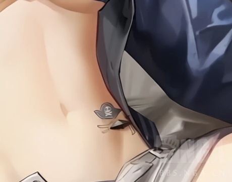
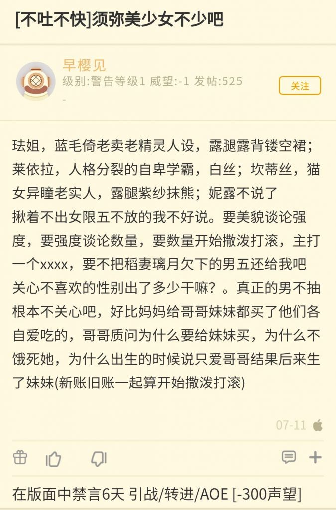

### [不吐不快]玩原神可能确实会让人审美降级

Made by ngapost2md (c) ludoux [GitHub Repo](https://github.com/ludoux/ngapost2md)

----

##### 0.[0] \<pid:0\> 2023-07-23 23:25:37 by 秘密首领艾华斯
我看双新出那个人鱼挺好看的回去玩了玩，觉得做的挺不错的，然后去战双吧一看人都看傻了了，是我玩原神玩的吗？我觉得这剧情挑不出任何毛病，他们打的大道都磨灭了

----

##### 1.[0] \<pid:704426311\> 2023-07-23 23:28:09 by 随便看看186215
一样一样，对游戏的要求阈值都降低了

----

##### 2.[0] \<pid:704426343\> 2023-07-23 23:28:24 by 残血之殇
不知道跟原神有没有关系反正我之前看谁都觉得不好看 哪个游戏都
最近好一点了

----

##### 3.[0] \<pid:704426520\> 2023-07-23 23:29:38 by 随便看看186215
>[jump](#pid704426343) 残血之殇(2023-07-23 23:28) 说: 
>
>不知道跟原神有没有关系反正我之前看谁都觉得不好看 哪个游戏都
>最近好一点了

我连bgo和农皇好感都高了不少，想当初不知道多少次高血压

----

##### 4.[9] \<pid:704426994\> 2023-07-23 23:32:42 by Fablet
何止会让人审美降级，文艺界一直有一个说法:
比如说，meta game，time looping这种叙事手法，如果看的是经典的前作，类似于ever17啦幽灵诡计人狼村啦，那你能保持新鲜感的同时感受到极好的剧情体验，也因此会对它啧啧称奇。
但是如果看的是我们的原神，类似于花神诞祭之后这一大串，你以后回想起来这两种叙事手段，可能总会扯到“虚假的历史”“无意义的打破第四面墙”“岁掉了”云云。
这会让你难以看进去优秀的作品的同时，产生一定的ptsd。
当然啦，说这话的我已经对<b>理想主义者</b>这个叙事策略产生了严重的ptsd，这种负面情绪延伸到了很多角色，比如垃圾君，我现在看他很不顺眼。

----

##### 5.[0] \<pid:704427172\> 2023-07-23 23:33:42 by yvebjs
所以战双这次是啥剧情啊这么多人车？

----

##### 6.[3] \<pid:704427284\> 2023-07-23 23:34:22 by 四方形打柠檬茶
现在我除了米对每个游戏策划都非常耐心，这就是mhy的策略吗，让我变成别人的韭菜

----

##### 8.[0] \<pid:704428010\> 2023-07-23 23:38:53 by 颓魔炼狱
是这样的，就像之前阴阳师的月读实装的时候，脸做胖了，立绘也没画好，我还是看了评论区的对比图才意识到。
另外的还有sp红叶大头娃娃也是
只能说是玩原神玩的了

----

##### 9.[0] \<pid:704428088\> 2023-07-23 23:39:23 by 一二三三二一啊忒
你说得对，但原神是一款后面忘了

----

##### 10.[4] \<pid:704428409\> 2023-07-23 23:41:31 by 梅兰德协会探员N
玩米家游戏跑到别家很容易被骂，因为会觉得别家的烂活没什么从而开始护官方然后被骂结晶

----

##### 11.[1] \<pid:704428840\> 2023-07-23 23:44:00 by ToutSeul
今晚看完某游夏活直播
我也同好友发出了相同的感叹，阈值真被拉低了

----

##### 12.[0] \<pid:704429411\> 2023-07-23 23:47:23 by 他一直都是对的
我玩顺火暖觉得顾惜朝挺好的特别想救他
玩原神玩的

----

##### 13.[0] \<pid:704429918\> 2023-07-23 23:50:35 by cocococococo123456
今天看了纸嫁衣五剧情，感觉
对比着真残忍

----

##### 14.[0] \<pid:704429970\> 2023-07-23 23:50:53 by 喵西斯
啊这样吗
我从来没觉得原的剧情有哪里值得吹了，就算是好剧情基本也都是中规中矩的水平，而大部分剧情漏洞太多太大。
米哈游这个公司的美术风格也向来不是我喜欢的那一挂。“溢出的美术力”，尴尬得抠脚。

我最讨厌原的世界框架破破烂烂，很多剧情发展没有前因后果，很多文案模棱两可。这样导致了特别多的想当然和谣言。原这破玩意儿从一开始就不是一个完整的架空世界，谈何沉浸感。

----

##### 15.[0] \<pid:704430054\> 2023-07-23 23:51:25 by 哒哒块

<a href="javascript:;" onclick="collapse(this);">+</a>切下瓜，涉及隔壁剧透 ...
战双这版本整了个活，具体不展开，于是大家就现在的主角是本体还是克隆体吵了起来(一个死了一个逃出来了)，按理说不会有这样的争论，但是以前战双还整过另外两个活

1、女主是复制体，女主本体是反派
2、复制体女主意识被删除了，然后用认识主角前的备份意识+现在的记忆数据凑了一个新意识，当时大家就女主还是不是女主也吵得大道都磨灭了
于是大家就陷入了深深的自我猜疑

----

##### 16.[0] \<pid:704430131\> 2023-07-23 23:51:50 by 朔夜寒光
我去战双版，看他们在骂剧情；去无期版，看到一片剧情的黑泥；甚至方舟最新的个人剧情，也有很多争议。回来再看原神的幼儿园剧情，居然必须要夸夸。卧槽，这已经不是审美降级了你懂吧，这是降智，真的太可怕了。
平心而论，原神很多方面确实仍然傲视群雄，仍然是头部二次元游戏，贬得一无是处肯定是不客观的。但是原神现在的剧情就是纯纯的一坨，你让我夸什么我也没法去夸剧情，实在太降智了。

----

##### 17.[0] \<pid:704430421\> 2023-07-23 23:53:36 by 秘密首领艾华斯
>[jump](#pid704427172) yvebjs(2023-07-23 23:33) 说: 
>
>所以战双这次是啥剧情啊这么多人车？

拉弥亚的时间线太早了，弄了个指挥官克隆体，但在我看来没啥出格互动，拉弥亚的感情指向也很明确，没什么好吵的。

----

##### 18.[0] \<pid:704430711\> 2023-07-23 23:55:31 by setsuna2023
也不一定，比如我就会因为受够了原的庸俗利己海上精英文案，而对1999换汤不换药的小资味儿敬而远之，这就是玩原给我带来的抗体

----

##### 19.[0] \<pid:704430883\> 2023-07-23 23:56:42 by 九皋213
还好吧，更大的问题是会变太监

----

##### 20.[0] \<pid:704431397\> 2023-07-24 00:00:02 by scoutqq
>[jump](#pid704430054) 哒哒块(2023-07-23 23:51) 说: 
>

<a href="javascript:;" onclick="collapse(this);">+</a>就为啥吵起来切下瓜，涉及隔壁剧透 ...
战双这版本整了个活，具体不展开，于是大家就现在的主角是本体还是克隆体吵了起来(一个死了一个逃出来了)，按理说不会有这样的争论，但是以前战双还整过另外两个活
>
>1、女主是复制体，女主本体是反派
>2、复制体女主意识后来被删除了，然后用认识主角前的备份意识+现在的记忆数据凑了一个新意识，当时大家就女主还是不是女主也吵得大道都磨灭了
>
>结合这几点导致战双玩家陷入了深深的自我猜疑

这个女主是指露西亚吧?

为啥不是主视角(指挥官?)也能让玩家自我怀疑啊

----

##### 21.[1] \<pid:704431605\> 2023-07-24 00:01:37 by 道仰
别说，之前万其他手游觉得想弃坑了那几天都懒得上
最近原这一系列烂活我之前想弃坑的手游热情是噌噌噌的涨

----

##### 22.[0] \<pid:704432157\> 2023-07-24 00:05:32 by 戴森林
>[jump](#pid704428010) 颓魔炼狱(2023-07-23 23:38) 说: 
>
>是这样的，就像之前阴阳师的月读实装的时候，脸做胖了，立绘也没画好，我还是看了评论区的对比图才意识到。
>另外的还有sp红叶大头娃娃也是
>只能说是玩原神玩的了  
>
>编辑:剧情的话，我都是跳过的，仔细看完的只有阿修罗帝释天和之前的sp小鹿男，一个是合理的使用岁月史书，一个是人类和非人种携手拯救了森林
>这样比较会不会对原太残忍了

哦天，谢谢你的提醒！我都忘了阿修罗帝释天的剧情最后确实是岁月史书，你这么一说我记起来了，再跟原的一对比，这差距不要太大

----

##### 23.[0] \<pid:704432586\> 2023-07-24 00:08:46 by tenmouses
>[jump](#pid704427172) yvebjs(2023-07-23 23:33) 说: 
>
>所以战双这次是啥剧情啊这么多人车？

绝大部分玩家还是认同巅峰剧情的评价(b站评分嗖嗖嗖的涨)

主要是激进代入ml党有一种自己被自己绿了的感觉(不理解但尊重只能说)，目前已经被其他玩家镇压了

----

##### 24.[0] \<pid:704432766\> 2023-07-24 00:09:59 by MeliMor
我也是看拉弥亚挺好看的就回坑去抽了一个打算玩上几天，剧情我没看，和我一起玩双的朋友(他不玩原)评价说还可以，不过无所谓反正有跳过键蝗起来很方便，相比起来原一旦退了再想回坑真的是就得面对漫长的任务

----

##### 25.[0] \<pid:704432769\> 2023-07-24 00:10:01 by tenmouses
>[jump](#pid0) 秘密首领艾华斯(2023-07-23 23:25) 说: 
>
>我看双新出那个人鱼挺好看的回去玩了玩，觉得做的挺不错的，然后去战双吧一看人都看傻了了，是我玩原神玩的吗？我觉得这剧情挑不出任何毛病，他们打的大道都磨灭了

贴吧就突出一个抽象，双在孙吧的风评都比战双吧要好

----

##### 26.[0] \<pid:704432804\> 2023-07-24 00:10:19 by wassily_hilda
为了避开原我冲动消费买了ns，买了很多游戏，还是电子养胃，直接回归小说怀抱

----

##### 27.[1] \<pid:704433183\> 2023-07-24 00:13:19 by 秘密首领艾华斯
>[jump](#pid704432769) tenmouses(2023-07-24 00:10) 说: 
>
>贴吧就突出一个抽象，双在孙吧的风评都比战双吧要好

这种事其实挺常见的，比如当年鸣潮测试的时候名声最好的地方是原神内鬼吧  
当年鸣潮吧和战双吧都在骂抽卡骂刷怪太少骂bug骂剧情，唯独原神玩家觉得bug公测会修，其他都可以接受

----

##### 28.[0] \<pid:704433207\> 2023-07-24 00:13:28 by ZFBXBD
>[jump](#pid704430054) 哒哒块(2023-07-23 23:51):

等等等等等等等！！
你的意思是战双为了让拉弥亚入池子，把指挥官搞了个克隆体？？
不是吧，露西亚这么搞诺安这么搞，主角也这么搞，这不是活该挨骂吗，不会写入池剧情就别写。
但和()比好了不知道多少倍，至少没把我的三观按地上。

----

##### 29.[0] \<pid:704433702\> 2023-07-24 00:16:34 by 秘密首领艾华斯
>[jump](#pid704433207) ZFBXBD(2023-07-24 00:13) 说: 
>
>等等等等等等等！！
>你的意思是战双为了让拉弥亚入池子，把指挥官搞了个克隆体？？
>不是吧，露西亚这么搞诺安这么搞，主角也这么搞，这不是活该挨骂吗，不会写入池剧情就别写。
>但和()比好了不知道多少倍，至少没把我的三观按地上。

这个克隆体的故事是很久以前的故事，克隆体为了救拉弥亚寄了，拉弥亚主要互动的还是真正的指挥官本人。

----

##### 30.[0] \<pid:704434217\> 2023-07-24 00:19:47 by ZFBXBD
>[jump](#pid704433702) 秘密首领艾华斯(2023-07-24 00:16)说:
>[quote][pid=704433207,37110686,2]Reply[/pid] <b>Post by [uid=65008005]ZFBXBD[/uid] (2023-07-24 00:13):</b>  等等等等等等等！！[s:ac:惊] 你的意思是战双为了让拉弥亚入池子，把指挥官搞了个克隆体？？ 不是吧，露西亚这么搞诺安这么搞，主角也这么搞，这不是活该挨骂吗，不会写入池剧情就别写。 但和()比好了不知道多少倍，至少没把我的三观按地上。[/quote]这个克隆体的故事是很久以前的故事，克隆体为了救拉弥亚寄了，拉弥亚主要互动的还是真正的指挥官本人。

这个克隆体是谁的？指挥官的吗？
是n年前指挥官克隆体把拉弥亚救了这个意思是吗？
然后拉弥亚看见现在这个指挥官就好感上来了。
(这不是吃了九龙船和九龙城还有n多地方的书吗？这些时候拉弥亚没表现的认识指挥官啊，还是说那个什么海里的基地里拉弥亚才想起来？)

----

##### 31.[0] \<pid:704434253\> 2023-07-24 00:19:59 by fuchen828
所以雅俗共赏啊，手游不动脑子的时候玩，有时间了看看西部点子王又整了什么大活，或者花点时间看看书。不会真有人把原神当主要娱乐方式吧

----

##### 32.[0] \<pid:704434568\> 2023-07-24 00:22:04 by tenmouses
>[jump](#pid704433207) ZFBXBD(2023-07-24 00:13) 说: 
>
>等等等等等等等！！
>你的意思是战双为了让拉弥亚入池子，把指挥官搞了个克隆体？？
>不是吧，露西亚这么搞诺安这么搞，主角也这么搞，这不是活该挨骂吗，不会写入池剧情就别写。
>但和()比好了不知道多少倍，至少没把我的三观按地上。

不要太相信对剧情的概括，我还说神章枯朽是内部厨力放出呢，不妨碍大半夜在被窝里哭。

相信双的文案和编剧搞大活的本事，这剧情从两年前的一个版本就开始埋暗线写大纲(来自官方透露)，几乎串起了所有伏笔(包括之前被车的死去活来的几个烂剧情)采用双主角，玩家(克隆首席)的人物弧光比起当期up拉弥亚更耀眼，更多的内心描写，把玩家从一个无敌的主角变回有血有肉会挂掉的普通人，而且着重探讨了克隆人和本体的关系。

----

##### 33.[0] \<pid:704434599\> 2023-07-24 00:22:15 by 哒哒块
>[jump](#pid704433207) ZFBXBD(2023-07-24 00:13) 说: 
>
>等等等等等等等！！
>你的意思是战双为了让拉弥亚入池子，把指挥官搞了个克隆体？？
>不是吧，露西亚这么搞诺安这么搞，主角也这么搞，这不是活该挨骂吗，不会写入池剧情就别写。
>但和()比好了不知道多少倍，至少没把我的三观按地上。

剧情几句话讲不清楚，所以只谈结果，目前的情况是部分玩家无法完全确定“我”还是不是“我”~~以及如其他人所说还有少部分玩家觉得被克隆体绿了~~

----

##### 34.[1] \<pid:704434714\> 2023-07-24 00:23:01 by Rudimentary
>[jump](#pid704430131) 朔夜寒光(2023-07-23 23:51) 说: 
>
>我去战双版，看他们在骂剧情；去无期版，看到一片剧情的黑泥；甚至方舟最新的个人剧情，也有很多争议。回来再看原神的幼儿园剧情，居然必须要夸夸。卧槽，这已经不是审美降级了你懂吧，这是降智，真的太可怕了。
>平心而论，原神很多方面确实仍然傲视群雄，仍然是头部二次元游戏，贬得一无是处肯定是不客观的。但是原神现在的剧情就是纯纯的一坨，你让我夸什么我也没法去夸剧情，实在太降智了。

米的强处一直是高潮的情绪调动和演出。
几乎可以说是动画组养活了一家公司
从女王到最后一课到薪炎到总有地上的生灵，再到宵宫传说2，全是过场动画和情绪调动带飞整段剧情。
但是过场动画的演出确实是剧情的一部分，这导致很多人被动画演出感动到了反而以为是剧情好实际上根本不是这么回事(

----

##### 35.[0] \<pid:704434918\> 2023-07-24 00:24:21 by Chostsongs
>[jump](#pid704433207) ZFBXBD(2023-07-24 00:13) 说: 
>等等等等等等等！！
>你的意思是战双为了让拉弥亚入池子，把指挥官搞了个克隆体？？
>不是吧，露西亚这么搞诺安这么搞，主角也这么搞，这不是活该挨骂吗，不会写入池剧情就别写。......

完全不是，你还是去b站看一下剧情视频吧，这一章简单两三句是根本说不清的但我觉得这一章很神

----

##### 36.[0] \<pid:704434938\> 2023-07-24 00:24:30 by 玛缇亚斯
>[jump](#pid704428840) ToutSeul(2023-07-23 23:44) 说: 
>
>今晚看完某游夏活直播
>我也同好友发出了相同的感叹，阈值真被拉低了

我：哇，好健康啊，好二次元啊，叉烧猫怎么加了一点布料还是原来死库水可爱，我靠嘉维尔的沟我去桃子泳装天啊粉毛也有沟买买买
这就是原神午餐肉给我的自卑

----

##### 37.[2] \<pid:704435251\> 2023-07-24 00:26:27 by tenmouses
>[jump](#pid704434217) ZFBXBD(2023-07-24 00:19) 说: 
>
>这个克隆体是谁的？指挥官的吗？
>是n年前指挥官克隆体把拉弥亚救了这个意思是吗？
>然后拉弥亚看见现在这个指挥官就好感上来了。
>(这不是吃了九龙船和九龙城还有n多地方的书吗？这些时候拉弥亚没表现的认识指挥官啊，还是说那个什么海里的基地里拉弥亚才想起来？)

是主角被绑了，然后反派搞了一个主角的克隆体(记忆相同的)

本体主角十六天后就自己跑了，克隆体一年后才苏醒，开始剧情。

拉弥亚偶遇克隆主角，两人相互扶持一路逃生，最后克隆主角伤重身亡，托孤拉弥亚。

拉弥亚在章末见到本体主角，告诉了本体这档事

什么九龙，不存在的

----

##### 38.[1] \<pid:704435339\> 2023-07-24 00:27:09 by 安源源源
>[jump](#pid704433207) ZFBXBD(2023-07-24 00:13) 说: 
>
>等等等等等等等！！
>你的意思是战双为了让拉弥亚入池子，把指挥官搞了个克隆体？？
>不是吧，露西亚这么搞诺安这么搞，主角也这么搞，这不是活该挨骂吗，不会写入池剧情就别写。
>但和()比好了不知道多少倍，至少没把我的三观按地上。

这次的剧情是以玩家复制体为主视角讲一年前 拉弥娅(新自机人鱼5星)和一堆复制体的故事。
这些复制体有着本体同样的记忆，而且他们原本不知道自己是复制体，并且只有本体可以进行复制。
这次主线剧情的一个主旨就是“只要‘我’的意志是我，那‘我’就是我”。也就是说，剧情想说的是玩家本体在同样的地方遇到同样的情况也会做出同样的事。
然后玩家复制体最后死了，拉弥娅被玩家复制体自我奉献的精神所打动，并且最后去接触了一下玩家本体。

社区争论的点大概，一个是，代入复制体视角，觉得本体享受着主角光环太光鲜太可恶了。还有一个就是代入本体视角，拉弥娅是玩家要新抽的老婆(战双主推是ml)，但是拉弥娅是和复制体产生的羁绊，而本体本身和拉弥娅没什么接触

----

##### 39.[0] \<pid:704435350\> 2023-07-24 00:27:13 by 秘密首领艾华斯
>[jump](#pid704434217) ZFBXBD(2023-07-24 00:19) 说: 
>
>这个克隆体是谁的？指挥官的吗？
>是n年前指挥官克隆体把拉弥亚救了这个意思是吗？
>然后拉弥亚看见现在这个指挥官就好感上来了。
>(这不是吃了九龙船和九龙城还有n多地方的书吗？这些时候拉弥亚没表现的认识指挥官啊，还是说那个什么海里的基地里拉弥亚才想起来？)

好像是在好感度故事里，但我角色还没抽到这个我不确定 
克隆体是指挥官的，总之挺复杂的。
本次故事本身和九龙没啥大关系。

----

##### 40.[0] \<pid:704435814\> 2023-07-24 00:30:19 by 早樱见
>[jump](#pid704426994) Fablet(2023-07-23 23:32) 说: 
>
>何止会让人审美降级，文艺界一直有一个说法:
>类似meta game，time looping这种叙事手法，如果看的是经典的前作，类似于ever17啦幽灵诡计啦人狼村啦，那你能保持新鲜感的同时感受到极好的剧情体验，也因此会对它啧啧称奇。
>但是如果看的是我们的原神，类似于花神诞祭之后这一大串，你以后回想起来这两种叙事手段，可能总会扯到“虚假的历史”“无意义的打破第四面墙”“岁掉了”云云。
>这会让你难以看下已完成的优秀的作品的同时，对未来可能使用类似手法的好作品好角色产生ptsd。
>当然，说这话的我已

别掺宁那私货了showshowway啊海解

----

##### 41.[0] \<pid:704435819\> 2023-07-24 00:30:20 by 克普仑
>[jump](#pid704433207) ZFBXBD(2023-07-24 00:13)说:
><b>Reply to [pid=704430054,37110686,1]Reply[/pid] Post by [uid=16199709]哒哒块[/uid] (2023-07-23 23:51)</b>等等等等等等等！！[s:ac:惊] 你的意思是战双为了让拉弥亚入池子，把指挥官搞了个克隆体？？ 不是吧，露西亚这么搞诺安这么搞，主角也这么搞，这不是活该挨骂吗，不会写入池剧情就别写。 但和()比好了不知道多少倍，至少没把我的三观按地上。

所以说别老看剧情概括，这次双的剧情属于自己看一遍都未必能完全明白，看个概括开喷简直无话可说了
其实就是讨论科幻里的一个很经典的问题，即意识的连续性和唯一性以及我是谁的关系，我觉得讲的还挺好的，可以看出文案对科幻有相当的理解，只不过对二游来说这个话题有点太沉重了

----

##### 42.[0] \<pid:704435854\> 2023-07-24 00:30:32 by 秘密首领艾华斯
>[jump](#pid704428409) 梅兰德协会探员N(2023-07-23 23:41) 说: 
>
>玩米家游戏跑到别家很容易被骂，因为会觉得别家的烂活没什么从而开始护官方然后被骂结晶

然后还会被说玩原神玩的。
还真是！

----

##### 43.[0] \<pid:704435993\> 2023-07-24 00:31:25 by 朔夜寒光
>[jump](#pid704434714) Rudimentary(2023-07-24 00:23) 说: 
>
>米的强处一直是高潮的情绪调动和演出。
>几乎可以说是动画组养活了一家公司
>从女王到最后一课到薪炎到总有地上的生灵，再到宵宫传说2，全是过场动画和情绪调动带飞整段剧情。
>但是过场动画的演出确实是剧情的一部分，这导致很多人被动画演出感动到了反而以为是剧情好实际上根本不是这么回事(

我觉得崩那边动画质量确实很高，原这边还是差得多了。可能是世界观格局的问题，矛盾始终不够激烈，情绪调动的不足，顶多让我感觉还不错，害确实没让我觉得特别感动或者特别燃的。

----

##### 44.[0] \<pid:704436010\> 2023-07-24 00:31:32 by ToutSeul
>[jump](#pid704434938) 玛缇亚斯(2023-07-24 00:24)说:
>[quote][pid=704428840,37110686,1]Reply[/pid] <b>Post by [uid=60635158]ToutSeul[/uid] (2023-07-23 23:44):</b>  今晚看完某游夏活直播 我也同好友发出了相同的感叹，阈值真被拉低了[s:ac:哭笑][/quote]我：哇，好健康啊，好二次元啊，叉烧猫怎么加了一点布料还是原来死库水可爱，我靠嘉维尔的沟我去桃子泳装天啊粉毛也有沟买买买[s:ac:哭1] 这就是原神午餐肉给我的自卑[s:ac:哭笑]

我第一感觉就是夏天终于来了
这活动才有点夏天的样子嘛

----

##### 45.[0] \<pid:704436043\> 2023-07-24 00:31:46 by Chostsongs
>[jump](#pid704434599) 哒哒块(2023-07-24 00:22) 说: 
>
>剧情几句话讲不清楚，所以只谈结果，目前的情况是部分玩家无法完全确定“我”还是不是“我”~~以及如其他人所说还有少部分玩家觉得被克隆体绿了~~

主要的问题应该就是剧情的结局比较开放式和暗示可能不够明显，导致有些人分不清了
至于被绿这个问题可能是因为海底指太高光了，而空花指只在结尾露了一下脸，导致对比起来简直不像是“我”

----

##### 46.[0] \<pid:704436144\> 2023-07-24 00:32:26 by Fablet
>[jump](#pid704435814) 早樱见(2023-07-24 00:30) 说: 
>
>别掺宁那私货了showshowway啊海解

？？？
单纯找了个游戏里的例子方便理解，一口一个解解，和你很熟吗？该不会是哪来的厕宝吧。

----

##### 47.[0] \<pid:704436608\> 2023-07-24 00:35:49 by 今锁朱楼
没玩过战双，不过居然敢写复制体当主角，感觉好勇。
很多人还是把复制体和其他复制体与主体当成完全不同的个体在看的，尤其是在涉及到感情时。
~~之前看的小说主角的伴侣为保护主角去世了，但是作者安排了有记忆备份的复制体，并声明这就是伴侣。哪怕角色本身也是这么想的，很多读者还是直接破防了认为对死去的伴侣不公平，认为作者在喂shit。~~

----

##### 48.[0] \<pid:704436760\> 2023-07-24 00:37:00 by 咸鱼摆烂王
是这样的，而且一个感受就是耐受力变强了，我回去玩粥一年来策划明明给我喂了大大小小的屎，但是一对比原的岁月史书和按头让玩家接受内部XP都算可接受范围内，放在19年早跑了

----

##### 49.[0] \<pid:704436843\> 2023-07-24 00:37:47 by 朔夜寒光
>[jump](#pid704436144) Fablet(2023-07-24 00:32) 说: 
>
>？？？
>单纯找了个游戏里的例子方便理解，一口一个解解，和你很熟吗？该不会是哪来的厕宝吧。

这个名字都眼熟了，看看发帖也就明白怎么回事了，

----

##### 50.[0] \<pid:704437253\> 2023-07-24 00:41:09 by 今锁朱楼
>[jump](#pid704435814) 早樱见(2023-07-24 00:30)说:
>[quote][pid=704426994,37110686,1]Reply[/pid] <b>Post by [uid=63104890]Fablet[/uid] (2023-07-23 23:32):</b>  何止会让人审美降级，文艺界一直有一个说法: 类似meta game，time looping这种叙事手法，如果看的是经典的前作，类似于ever17啦幽灵诡计啦人狼村啦，那你能保持新鲜感的同时感受到极好的剧情体验，也因此会对它啧啧称奇。 但是如果看的是我们的原神，类似于花神诞祭之后这一大串，你以后回想起来这两种叙事手段，可能总会扯到“虚假的历史”“无意义的打破第四面墙”“岁掉了”云云。 这会让你难以看下已完成的优秀的作品的同时，对未来可能使用类似手法的好作品好角色产生ptsd。 当然，说这话的我已[/quote]别掺宁那私货了showshowway啊海解

那我也只能说海卡解收收味了。
顺便翻了翻你的发言，不是嫌理查管黑泥多让你不舒服了吗，怎么还屁颠屁颠地往这跑啊

----

##### 51.[0] \<pid:704437449\> 2023-07-24 00:42:39 by Fablet
>[jump](#pid704436843) 朔夜寒光(2023-07-24 00:37) 说: 
>
>这个名字都眼熟了，看看发帖也就明白怎么回事了，

嗨，看到回复还以为是想和我讨论人狼村幽灵诡计之类time looping剧情设置的人，白高兴一场。
说实在的，个人总结中的time looping剧情设置有两种，一是诡计引导，二是情感引导:二的类型类似于re0和永远的七日之都，属于“只要愿意写就很讨巧”的设定。
理论上花神诞祭完全可以顺着二来，只要没有之后的烂活儿……

----

##### 52.[1] \<pid:704437612\> 2023-07-24 00:43:52 by 秘密首领艾华斯
>[jump](#pid704436608) 今锁朱楼(2023-07-24 00:35) 说: 
>
>没玩过战双，不过居然敢写复制体当主角，感觉好勇。
>很多人还是把复制体和其他复制体与主体当成完全不同的个体在看的，尤其是在涉及到感情时。
>~~之前看的小说主角的伴侣为保护主角去世了，但是作者安排了有记忆备份的复制体，并声明这就是伴侣。哪怕角色本身也是这么想的，很多读者还是直接破防了认为对死去的伴侣不公平，认为作者在喂shit。~~

yysy崩三也是这样处理的，但崩三很明显处理的很失败，德莉莎直接变德蝗力

----

##### 53.[2] \<pid:704437997\> 2023-07-24 00:46:49 by 咸鱼摆烂王
>[jump](#pid704435993) 朔夜寒光(2023-07-24 00:31) 说: 
>
>我觉得崩那边动画质量确实很高，原这边还是差得多了。可能是世界观格局的问题，矛盾始终不够激烈，情绪调动的不足，顶多让我感觉还不错，害确实没让我觉得特别感动或者特别燃的。

原的冲突孱弱问题不在世界观而在于编剧舍不得也不敢搞冲突，但凡有点争议的角色不是雪藏就是硬洗，最好笑的是NPC在支线和活动里死麻了，结果和自机关联有名有性的也就一个哲平，最多最多再加个雷电五传，而两个都拉了，事实证明这群文案也没能力做好自机的矛盾处理，散兵那一串真的看笑了

----

##### 54.[0] \<pid:704438917\> 2023-07-24 00:55:08 by setsuna2023
爬了下后面的楼怎么还有突兀打滚的，看来题目还是说对了确实是现场演绎审美降级，什么叙述诡计题材滥用的正经讨论都看不见，心中只有这解那解的饭圈大战

----

##### 55.[0] \<pid:704439270\> 2023-07-24 00:58:23 by 今锁朱楼
[b]Reply to [pid=704437612,37110686,3]Reply[/pid] Post by [uid=65009970]秘密首领艾华斯[/uid] (2023-07-24 00:43)[/b没玩过崩坏三，但听朋友说过一点相关剧情。(朋友是卡莲和八重樱厨)
她挺讨厌德莉莎的，不过没骂过她，但喷相关剧情的时候能看出怒气值已经点满了。

----

##### 56.[2] \<pid:704439324\> 2023-07-24 00:58:50 by 秘密首领艾华斯
>[jump](#pid704437997) 咸鱼摆烂王(2023-07-24 00:46) 说: 
>
>原的冲突孱弱问题不在世界观而在于编剧舍不得也不敢搞冲突，但凡有点争议的角色不是雪藏就是硬洗，最好笑的是NPC在支线和活动里死麻了，结果和自机关联有名有性的也就一个哲平，最多最多再加个雷电五传，而两个都拉了，事实证明这群文案也没能力做好自机的矛盾处理，散兵那一串真的看笑了

错误的，非自机的也没有。
你有印象原神里有特别好的反派吗？反派基本都是背景板来衬托正面角色的，有白次男，亚雷斯塔，蓝染，维吉尔(鬼泣三限定)，jo7大总统这样人物弧光完整丰富的反派吗？原神编剧只能处理把一方打成只有坏一个特征的简单矛盾，换句话说缺乏塑造一个立体反派的能力，然后一遇到自机反派不能坏了脑子就宕机了。

----

##### 57.[3] \<pid:704439621\> 2023-07-24 01:01:23 by 江尽一
>[jump](#pid704429918) cocococococo123456(2023-07-23 23:50) 说: 
>
>今天看了纸嫁衣五剧情，感觉
>对比着真残忍

高品位的

----

##### 58.[3] \<pid:704439727\> 2023-07-24 01:02:20 by 秘密首领艾华斯
>[jump](#pid704436608) 今锁朱楼(2023-07-24 00:35) 说: 
>
>没玩过战双，不过居然敢写复制体当主角，感觉好勇。
>很多人还是把复制体和其他复制体与主体当成完全不同的个体在看的，尤其是在涉及到感情时。
>~~之前看的小说主角的伴侣为保护主角去世了，但是作者安排了有记忆备份的复制体，并声明这就是伴侣。哪怕角色本身也是这么想的，很多读者还是直接破防了认为对死去的伴侣不公平，认为作者在喂shit。~~

我一直都是认为不是同一个人的。
或者也可能是看魔禁看的，18万日元一个的批量制造，记忆也完全共享的御坂妹妹，每一个都是值得主角拼命拯救的独一无二的人。这基本上定死了我日后看所有克隆人相关作品的态度。

----

##### 59.[0] \<pid:704439893\> 2023-07-24 01:03:45 by 疯子二太郎
>[jump](#pid704428010) 颓魔炼狱(2023-07-23 23:38) 说: 
>
>是这样的，就像之前阴阳师的月读实装的时候，脸做胖了，立绘也没画好，我还是看了评论区的对比图才意识到。
>另外的还有sp红叶大头娃娃也是
>只能说是玩原神玩的了  
>
>编辑:剧情的话，我都是跳过的，仔细看完的只有阿修罗帝释天和之前的sp小鹿男，一个是合理的使用岁月史书，一个是人类和非人种携手拯救了森林
>这样比较会不会对原太残忍了

虽然但是，yys现在是偶尔不发病，多数情况下创得人想死

----

##### 60.[6] \<pid:704440044\> 2023-07-24 01:04:57 by lingwzhui
>[jump](#pid704435814) 早樱见(2023-07-24 00:30) 说: 
>
>别掺宁那私货了showshowway啊海解

一查成分，鸡舍，真哈人啊  
你们鸡舍出来的一口一个解我看着都想笑，您配吗

----

##### 61.[3] \<pid:704440053\> 2023-07-24 01:05:00 by 咸鱼摆烂王
>[jump](#pid704436608) 今锁朱楼(2023-07-24 00:35) 说: 
>
>没玩过战双，不过居然敢写复制体当主角，感觉好勇。
>很多人还是把复制体和其他复制体与主体当成完全不同的个体在看的，尤其是在涉及到感情时。
>~~之前看的小说主角的伴侣为保护主角去世了，但是作者安排了有记忆备份的复制体，并声明这就是伴侣。哪怕角色本身也是这么想的，很多读者还是直接破防了认为对死去的伴侣不公平，认为作者在喂shit。~~

崩三不也是k423当主角，我实在不明白已经有k423了为什么要再拉个呆鹅出来，显得后者倒霉又小丑吗

----

##### 62.[0] \<pid:704440534\> 2023-07-24 01:09:09 by 无料通贩商
>[jump](#pid704434938) 玛缇亚斯(2023-07-24 00:24) 说: 
>
>我：哇，好健康啊，好二次元啊，叉烧猫怎么加了一点布料还是原来死库水可爱，我靠嘉维尔的沟我去桃子泳装天啊粉毛也有沟买买买
>这就是原神午餐肉给我的自卑

我q群里还在骂嘉维尔杯级被削了，一致认为本来能整出事业线但鹰角让步xxn呢(当然我也在跟着骂，因为我真的想看事业线)

----

##### 63.[0] \<pid:704440725\> 2023-07-24 01:10:55 by Fablet
>[jump](#pid704439727) 秘密首领艾华斯(2023-07-24 01:02) 说: 
>
>我一直都是认为不是同一个人的。
>或者也可能是看魔禁看的，18万日元一个的批量制造，记忆也完全共享的御坂妹妹，每一个都是值得主角拼命拯救的独一无二的人。这基本上定死了我日后看所有克隆人相关作品的态度。

原来楼主的名字真的是嘴臭天使艾华斯。
其实就像我发的贴吧链接里说的那样，这次战双的争议比起“首席是不是独一无二的人”“克隆体是不是成了拉弥亚的死去的白月光”。
我觉得，这次处理的最大问题还是“首席居然要在最后来一句我也会做出相似的选择”“我作为复制体实现了高光，但是我却被告知我为他人做嫁衣”。
也就是，首席和复制体的关系处理不太好。

----

##### 64.[0] \<pid:704440754\> 2023-07-24 01:11:08 by 咸鱼摆烂王
>[jump](#pid704439324) 秘密首领艾华斯(2023-07-24 00:58) 说: 
>
>错误的，非自机的也没有。
>你有印象原神里有特别好的反派吗？反派基本都是背景板来衬托正面角色的，有白次男，亚雷斯塔，蓝染，维吉尔(鬼泣三限定)，jo7大总统这样人物弧光完整丰富的反派吗？原神编剧只能处理把一方打成只有坏一个特征的简单矛盾，换句话说缺乏塑造一个立体反派的能力，然后一遇到自机反派不能坏了脑子就宕机了。

你说的对，我还高估了这群人的能力，是本来就很拉的水平遇到可能会影响流水的自机更加处理不好了
推断这群人的动机大概真的把纸片人当虚拟偶像来处理了，要落地赚钱的资产清清白白容不得一点黑的，就算是反派也要硬给你洗成宝宝无辜什么都不知道(隔壁某个真虚拟偶像音游主笔倒是在发疯sjb互创，大爆笑)

----

##### 65.[0] \<pid:704440820\> 2023-07-24 01:11:42 by lingwzhui
>[jump](#pid704440534) 无料通贩商(2023-07-24 01:09) 说: 
>
>我q群里还在骂嘉维尔杯级被削了，一致认为本来能整出事业线但鹰角让步xxn呢(当然我也在跟着骂，因为我真的想看事业线)

没削，b站有个专做cup的up，测出来嘉维尔只有大杯异格看上去大是衣服收束出来的，这次皮肤穿的比基尼还选的半仰姿，熊很容易就摊到两边去

----

##### 66.[0] \<pid:704441023\> 2023-07-24 01:13:47 by 秘密首领艾华斯
>[jump](#pid704440053) 咸鱼摆烂王(2023-07-24 01:05) 说: 
>
>崩三不也是k423当主角，我实在不明白已经有k423了为什么要再拉个呆鹅出来，显得后者倒霉又小丑吗

我挺喜欢幽兰黛尔这个角色的，某种意义上我就是为了苏的预言中她的作用和凯文这个角色啥结局去看的终章。
结果这下小丑世家了

----

##### 67.[0] \<pid:704441177\> 2023-07-24 01:15:17 by 梅兰德协会探员N
>[jump](#pid704440820) lingwzhui(2023-07-24 01:11) 说: 
>
>没削，b站有个专做cup的up，测出来嘉维尔只有大杯异格看上去大是衣服收束出来的，这次皮肤穿的比基尼还选的半仰姿，熊很容易就摊到两边去

嘉维尔这皮肤可太海贼王了，一眼看过去，我超，海军大将

----

##### 68.[0] \<pid:704441924\> 2023-07-24 01:22:38 by 雨源rainsource
深空之眼刚开服的时候我觉得建模僵，现在回坑觉得建模老好看了，这就是玩原神玩的

----

##### 69.[0] \<pid:704442249\> 2023-07-24 01:26:17 by tenmouses
>[jump](#pid704441924) 雨源rainsource(2023-07-24 01:22) 说: 
>
>深空之眼刚开服的时候我觉得建模僵，现在回坑觉得建模老好看了，这就是玩原神玩的

其实大眼有进步的，之前的建模是真的没眼看

----

##### 70.[0] \<pid:704442319\> 2023-07-24 01:26:59 by Asche1017
>[jump](#pid704441177) 梅兰德协会探员N(2023-07-24 01:15)说:
>[quote][pid=704440820,37110686,4]Reply[/pid] <b>Post by [uid=65181789]lingwzhui[/uid] (2023-07-24 01:11):</b>  没削，b站有个专做cup的up，测出来嘉维尔只有大杯[s:ac:哭笑]异格看上去大是衣服收束出来的，这次皮肤穿的比基尼还选的半仰姿，熊很容易就摊到两边去[/quote]嘉维尔这皮肤可太海贼王了，一眼看过去，我超，海军大将[s:ac:哭笑]

已经明示了，又帅又萌

----

##### 71.[0] \<pid:704442629\> 2023-07-24 01:30:45 by 咸鱼摆烂王
>[jump](#pid704441023) 秘密首领艾华斯(2023-07-24 01:13) 说: 
>
>我挺喜欢幽兰黛尔这个角色的，某种意义上我就是为了苏的预言中她的作用和凯文这个角色啥结局去看的终章。
>结果这下小丑世家了

别提了呆鹅这角色我外观上本身不感冒，结果全方位垫子让我硬是心生怜爱了米桑颠起来真的各位全都是亲女儿亲儿子的垫脚石

----

##### 72.[0] \<pid:704445623\> 2023-07-24 02:14:39 by Kururugi
>[jump](#pid704429411) 他一直都是对的(2023-07-23 23:47) 说: 
>
>我玩顺火暖觉得顾惜朝挺好的特别想救他
>玩原神玩的

我玩顺火暖要被这人气死了

----

##### 73.[0] \<pid:704446166\> 2023-07-24 02:23:52 by 音羽城
>[jump](#pid704430131) 朔夜寒光(2023-07-23 23:51) 说: 
>
>我去战双版，看他们在骂剧情；去无期版，看到一片剧情的黑泥；甚至方舟最新的个人剧情，也有很多争议。回来再看原神的幼儿园剧情，居然必须要夸夸。卧槽，这已经不是审美降级了你懂吧，这是降智，真的太可怕了。
>平心而论，原神很多方面确实仍然傲视群雄，仍然是头部二次元游戏，贬得一无是处肯定是不客观的。但是原神现在的剧情就是纯纯的一坨，你让我夸什么我也没法去夸剧情，实在太降智了。

无期这次活动剧情我觉得写的很好，人物都立起来了，很期待后续。有争议主要还是有些人上帝视角看事情外加自我意识过剩导致的。
无期剧情算是有一定深度的，虽然主笔是女性，但是和原这边的xxn式剧情简直是天差地别

----

##### 74.[0] \<pid:704446372\> 2023-07-24 02:27:06 by 有梦想的非酋
双版那个新剧情很有争议，搞了个很容易吵起来的主角复制人如果没争议反而证明剧情写的乐色，整个版本的剧情里玩家视角是一个主角复制体这么大的爆点(或者说雷点)，有争议才正常，光是阴谋论死的到底是本体还是克隆体就够吵上天了，更别提克隆体到底该算本体的什么衍生？实际存在的if线，还是践行了同样精神会做出同样选择的人？如果这剧情没争议只能说写的乐色没有讨论的必要

----

##### 75.[0] \<pid:704450100\> 2023-07-24 04:01:57 by 法图依米亚
o神各方面真的丑的一比。。。全靠跪舔?人烧鸡烧鸭赚钱 最近看假面骑士dirve，帅的一比，豆奶特浓比o抄的男ji好看多了

----

##### 76.[0] \<pid:704450320\> 2023-07-24 04:10:10 by ackmk9
看刀剑神域新剧场版时，哇，阿丝娜这也太“白给”了吧，这是我能看的？

----

##### 77.[0] \<pid:704451092\> 2023-07-24 04:46:11 by 玖玖77
这下真玩原神玩的了

----

##### 78.[0] \<pid:704453363\> 2023-07-24 06:37:19 by wiwiwi1888
久居兰室不闻其香，久居鲍市不闻其臭。在粪坑呆的时间长了就会这样

----

##### 79.[0] \<pid:704453730\> 2023-07-24 06:48:14 by 我冲我自己
>[jump](#pid704435814) 早樱见(2023-07-24 00:30) 说: 
>
>别掺宁那私货了showshowway啊海解

草啊，前面几页都是认真讨论剧情，翻到这里突兀的冒出一个hkj破防让我笑出了声

----

##### 80.[0] \<pid:704455222\> 2023-07-24 07:19:57 by 药师鬼
也不拿pc主机游戏什么的对比了，免得被打成天龙人。
稍微手游玩多点也就能知道剧情是可以写好的，反派是可以有逼格的，泳装是可以每年出的，角色是可以ml的，cp是可以不用捆着卖照样精彩的……

----

##### 81.[0] \<pid:704456502\> 2023-07-24 07:38:28 by n258456
战双那个黑泥莫名其妙的，反正我看完了主线后再看拉弥亚语音里约定要指挥官活下去的时候还是很有感触的

----

##### 82.[0] \<pid:704456721\> 2023-07-24 07:41:09 by origird
啊，战双剧情看来是心头好啊……这种扭曲又胃痛、暗含着些许恶心的哲思讨论，我这就去玩。

----

##### 83.[0] \<pid:704458468\> 2023-07-24 08:00:32 by 染ァΔ酃嶻
>[jump](#pid704435814) 早樱见(2023-07-24 00:30) 说: 
>
>别掺宁那私货了showshowway啊海解

xxn还是去氪648抽你那嗨丝小男孩吧

----

##### 84.[0] \<pid:704460090\> 2023-07-24 08:14:35 by 小景一郎
>[jump](#pid704450100) UID63202809(2023-07-24 04:01) 说: 
>
>o神各方面真的丑的一比。。。全靠跪舔?人烧鸡烧鸭赚钱 最近看假面骑士dirve，帅的一比，豆奶特浓比o抄的男ji好看多了

高品味的，drive确实好看，感觉对比起来用drive这种有点欺负人了，01至少有好看的皮套，o的晚餐剧情只配和利维斯一起被冲进历史的下水道

----

##### 85.[0] \<pid:704460636\> 2023-07-24 08:19:14 by 月小炎
个人觉得，米家的美术就是那种
看宣传绘，看建模，感觉的确好看
但是进游戏一看，其他地方的美术也就那样了
而且审美疲劳来的非常快

----

##### 86.[1] \<pid:704464587\> 2023-07-24 08:45:29 by 伊莱亚斯0508
玩战双玩的，这节奏就莫名其妙的，不过也不奇怪，毕竟双u对剧情总有莫名奇妙的高要求和奇怪的标准，像这次那确实是认好剧情了，但是没达到这种水准的只有一般二游水准和一般水准之上的都可以被批为垃圾剧情

----

##### 88.[0] \<pid:704465286\> 2023-07-24 08:49:24 by 今天也依然是的一天
啊？难道只有我现在看各家的立绘建模感觉就那样，一点兴趣都提不起来吗

----

##### 89.[0] \<pid:704466454\> 2023-07-24 08:56:03 by 你家破猫不招财
我也觉得我现在玩过原神再去看别的游戏感觉根本没啥，估计我也是能被当成孝子拷打的人事了，各种忍耐值嗖嗖网上涨

----

##### 90.[0] \<pid:704485402\> 2023-07-24 10:24:50 by shskdbd
>[jump](#pid704435814) 早樱见(2023-07-24 00:30) 说: 
>
>别掺宁那私货了showshowway啊海解

姐妹们狠狠地抽黑丝小男孩

----

##### 91.[0] \<pid:704485849\> 2023-07-24 10:26:41 by NastyaT
>[jump](#pid704434714) Rudimentary(2023-07-24 00:23) 说: 
>
>米的强处一直是高潮的情绪调动和演出。
>几乎可以说是动画组养活了一家公司
>从女王到最后一课到薪炎到总有地上的生灵，再到宵宫传说2，全是过场动画和情绪调动带飞整段剧情。
>但是过场动画的演出确实是剧情的一部分，这导致很多人被动画演出感动到了反而以为是剧情好实际上根本不是这么回事(

过场动画恐怕也在拉
最近隔壁的卖腐巨作，那个分镜又乱又抽象我甚至没看懂
我以为：景元和丹恒同时开大所以大招交重了；景元掉下来丹恒去接，结果没接住给人掼地上了。还在想最终决战你们是来这里搞笑的吗，怎么要点题一下太空喜剧？
最乐的是后面剧中角色还给了个复盘，米()也知道自己搞这一坨玩家根本看不懂是吧
~~而那个公主抱我甚至是又去拉了一遍录屏才发现确实接住了的，之前看都在车公主抱，我还想抱了吗我看没接住啊~~

----

##### 92.[0] \<pid:704492429\> 2023-07-24 10:52:51 by 油炸食品滚出地球
~~其实在我心里人鱼薄纱你原大部分女角色，真的特别美~~
~~仅个人观点，不要骂我~~

----

##### 93.[0] \<pid:704493925\> 2023-07-24 10:58:45 by 随便改个名字吧
>[jump](#pid704426994) Fablet(2023-07-23 23:32) 说: 
>
>何止会让人审美降级，文艺界一直有一个说法:
>类似meta game，time looping这种叙事手法，如果看的是经典的前作，类似于ever17啦幽灵诡计啦人狼村啦，那你能保持新鲜感的同时感受到极好的剧情体验，也因此会对它啧啧称奇。
>但是如果看的是我们的原神，类似于花神诞祭之后这一大串，你以后回想起来这两种叙事手段，可能总会扯到“虚假的历史”“无意义的打破第四面墙”“岁掉了”云云。
>这会让你难以看下已完成的优秀的作品的同时，对未来可能使用类似手法的好作品好角色产生ptsd。
>当然，说这话的我已

月计真要论理想主义者的话C不是比A更……吗？  

(很久没玩脑叶了 我也不确定)

----

##### 94.[0] \<pid:704494627\> 2023-07-24 11:01:30 by 自由搏击总冠军
>[jump](#pid704435814) 早樱见(2023-07-24 00:30) 说: 
>
>别掺宁那私货了showshowway啊海解

磕其他cp磕的？

----

##### 95.[0] \<pid:704497584\> 2023-07-24 11:12:19 by 江尽一
>[jump](#pid704429411) 他一直都是对的(2023-07-23 23:47) 说: 
>
>我玩顺火暖觉得顾惜朝挺好的特别想救他
>玩原神玩的

你……这……额……

----

##### 96.[0] \<pid:704498265\> 2023-07-24 11:14:58 by Fablet
>[jump](#pid704493925) 随便改个名字吧(2023-07-24 10:58) 说: 
>
>月计真要论理想主义者的话C不是比A更……吗？  
>
>(很久没玩脑叶了 我也不确定)

嘛，我的理解，c是a前进的最初动力，a愿意为了这个共同的愿望去承受打击和非议，为了完成目标做沾血的事，是实干家。
(为什么你的同事都在骂你啊，难道你真的不擅长处理人际关系吗！)
而实干家，比起“只有理念，标签和信念的人”，更让我尊重些。
~~都是米的理想主义大旗给我恶心出脑的~~

----

##### 97.[2] \<pid:704498347\> 2023-07-24 11:15:18 by Laeditil
真的笑出声了大家搁这儿认真讨论剧情呢突然冲出个嗨咔解对着无人关心的一句话破防，脑回路都和正常人不一样了，鉴定为嗑其他cp嗑的
其实战双人鱼建模也有不少不满意的，因为和旧模差别还挺大，更像个普通美少女了(不过依旧吊打你原大头娃娃

----

##### 98.[0] \<pid:704500268\> 2023-07-24 11:22:53 by 草酸艾司西酞普蘭
>[jump](#pid704426994) Fablet(2023-07-23 23:32) 说: 
>
>何止会让人审美降级，文艺界一直有一个说法:
>类似meta game，time looping这种叙事手法，如果看的是经典的前作，类似于ever17啦幽灵诡计啦人狼村啦，那你能保持新鲜感的同时感受到极好的剧情体验，也因此会对它啧啧称奇。
>但是如果看的是我们的原神，类似于花神诞祭之后这一大串，你以后回想起来这两种叙事手段，可能总会扯到“虚假的历史”“无意义的打破第四面墙”“岁掉了”云云。
>这会让你难以看下已完成的优秀的作品的同时，对未来可能使用类似手法的好作品好角色产生ptsd。
>当然，说这话的我已

~~但是隔壁yj现在的剧情水平已经搞得我看到对脑叶Ayin的评价不是低情商恋爱脑都感动得快哭了~~

----

##### 99.[0] \<pid:704501217\> 2023-07-24 11:26:30 by Fablet
>[jump](#pid704500268) 草酸艾司西酞普蘭(2023-07-24 11:22) 说: 
>
>~~但是隔壁yj现在的剧情水平已经搞得我看到有人对脑叶Ayin的评价不是低情商恋爱脑都已经感动得快哭了~~

~~低情商确实低情商，恋爱脑也差不多哈哈哈。
但是作为擅长运用切割技术的贴吧老哥，给a的定性一直都是“枭雄”，给c的定型是黑化了的阳炎的文乃姐，哈哈哈~~

----

##### 100.[0] \<pid:704501717\> 2023-07-24 11:28:21 by tbiph9277
是这样的

自从我被你原的不能跳过按头不看也得看，这半年还一个版本比一个逆天，我前几天回坑重新打舟，看了看8图剧情居然有种写的挺好我被触动了的感觉遥还记得我当年还在坑的时候这一章剧情还是被槽的

----

##### 101.[0] \<pid:704502648\> 2023-07-24 11:31:59 by tbiph9277
>[jump](#pid704435814) 早樱见(2023-07-24 00:30) 说: 
>
>别掺宁那私货了showshowway啊海解

真哈人，你这不是不喜欢里茶馆吗，来打滚干啥，不被问候一下难受？

----

##### 102.[0] \<pid:704504023\> 2023-07-24 11:37:32 by AKashiOni
确实，感觉对粪作的容忍度都高了不少，这就是玩原神给我的自卑

----

##### 103.[0] \<pid:704505705\> 2023-07-24 11:44:34 by 呙邱邱
虽然有争议但双剧情真的很不错，虽然我的着重点不是人鱼而是暗线里面一直帮指挥官的那个角色，看起来是面瘫吐槽役，最后赴死前疼痛又温柔的告别把我干懵了。

----

##### 104.[3] \<pid:704506359\> 2023-07-24 11:47:20 by 十一月四日风
想起我刚被朋友拉来玩原的时候，前期过蒙德主线特烦，虽然没啥雷但是剧情也太无聊了还不给跳过，因为画风加上喜欢开图才镍币玩的，玩到我们终将重逢那章，第一次对剧情有了兴趣，因为希望能看到兄妹重逢的那一天，从此之后对剧情忍耐力有了显著提升开始认真看剧情，没事儿还喜欢看别人夸原神剧情，直到3.3开始爆大雷，一连几个版本的恶心感一下子把我熏醒，回想起之前对米剧情的拥护第一次意识到了自己是玩原玩的，主线剧情一直都薄弱明明是我刚开始玩就知道的事，对兄妹重逢的期待也是我作为一个正常人一时被激起的同理心，结果就掉入一个看似美好的陷阱，玩着玩着就开始接受一切并且维护了起来，今天看见楼主这么一说，发现自己确实因为玩原导致审美下降，最近玩别的游戏过剧情的时候一直惊叹真不错啊真不错，跟刘姥姥进大观园似的

----

##### 105.[3] \<pid:704507862\> 2023-07-24 11:53:26 by 油门踩到底
既然是里版我就直接aoe了
说实话，我自从开服一来就一直对所谓考据党和剧情解读up有所怀疑
“有糖霜史莱姆/蒙德黑虎掏心在前，你怎么真敢认真研究这玩意”
这两个东西摆在面前，但凡审美品位正常的人都知道不能认真对待里面的设定
因为mhy很可能根本驾驭不了这些东西，只能往游戏的边边角角里塞点东西
一旦端上来做剧情，很可能就是糖霜史莱姆级别的灾难——“已经品鉴过一次了，快端下去吧”

后面的优菈和心海传说任务，以及主线女士之死更是突破下限
你一个二油最关键的人物设定都弄成依托史，我管你的世界设定成什么b样吗

结果真就有一堆审美品位不行的人，拿着文案塞的边角料大做文章出视频，天天“里面有大的药”，热度蹭的满满的
现在3.3岁月史书一出，“这些设定冲一下树就可以更改了哦”
非要官方mhy给你一巴掌才知道自己是小丑

ps.其实你有心的话，你看3.2最后大慈树王死的那段，树王死前莫名其妙说了一大堆东西，无非就想表达“嗨呀我被污染了我必须死啊那不然怎么办呢”
就知道这里的树王之死是编剧用设定堆死的，后来纳西妲被记忆修改之后也承认“是我用两个神之心修复的世界树”
好家伙编剧如果你直接把设定改成“两个神之心就可以修复世界树”不就完了吗
偏要惦记着你那b失忆，还整出游戏全局文本修改(连森林树任务都不放过)的烂活

结果不还是依托史，废物就是废物，程序部门给你做全局修改都是给你b脸了
不知道你们的烂活让mhy在3.3之后招了多少散兵名字审核员啊

----

##### 106.[0] \<pid:704510290\> 2023-07-24 12:04:14 by 呙邱邱
>[jump](#pid704433207) ZFBXBD(2023-07-24 00:13):

看剧情其实还好。毕竟性格记忆行为逻辑都一模一样，你可以理解为原指挥官的基底造就这个复制体。而且其实这章重点描写的不是恋爱而是四个“伪物”(非贬义)的逃生冒险故事。
(而且好感剧情里面人鱼是在前往海底之前遇到的指挥官)

----

##### 107.[0] \<pid:704512019\> 2023-07-24 12:12:22 by 狼煞天泣
完了，玩原神玩的

----

##### 108.[0] \<pid:704513132\> 2023-07-24 12:17:31 by 1703kj
>[jump](#pid704432586) tenmouses(2023-07-24 00:08) 说: 
>
>绝大部分玩家还是认同巅峰剧情的评价(b站评分嗖嗖嗖的涨)
>
>主要是激进代入ml党有一种自己被自己绿了的感觉(不理解但尊重只能说)，目前已经被其他玩家镇压了

战双也是这群逆天搞事？舟那边也是脑瘫ml档搞事

----

##### 109.[0] \<pid:704516415\> 2023-07-24 12:32:15 by rr1317
>[jump](#pid704435814) 早樱见(2023-07-24 00:30):

玩原神玩的

----

##### 110.[0] \<pid:704517018\> 2023-07-24 12:34:58 by 天天宝贝n1
说起来我最近看一个动画，评论区有人吐槽最近几集太水了，但我感觉还好啊，后来我反思了一下，感觉我确实是玩原神玩的，你原无意义水时长又不能跳过的剧情太特么多了，导致我看啥都觉得不算太水

----

##### 111.[0] \<pid:704517567\> 2023-07-24 12:37:47 by 一只独嗅001
别的不知道，我从阴阳师跑到原神真的感觉到了审美降级

----

##### 112.[0] \<pid:704517973\> 2023-07-24 12:39:47 by 丁沈牛己孟
一个玩家在原神群内
说自己要去玩别的手游，不玩原神了
管理员问：“你是对新角色不满意么”
他说：“我对新角色很满意”
群主问：“是对剧情不满意吗”
他说：“我对剧情很满意”
群友问他：“是因为制作组还是声优表现么”
他说：“不，都很满意”

大家继续问他为什么很满意还要去玩别的手游
他说：“因为我去别的手游群可以有不满意”

----

##### 113.[0] \<pid:704519479\> 2023-07-24 12:47:04 by Mr木杉
>[jump](#pid704433207) ZFBXBD(2023-07-24 00:13):

[url](https://www.bilibili.com/video/BV1UN411e7Bs)

