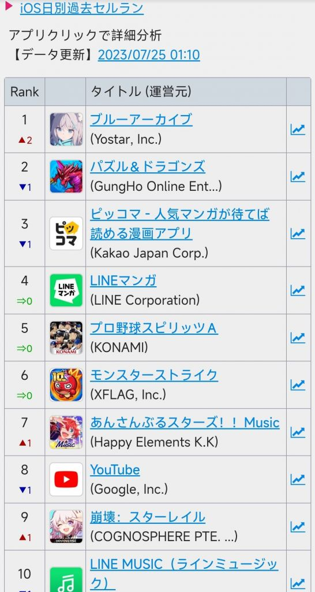
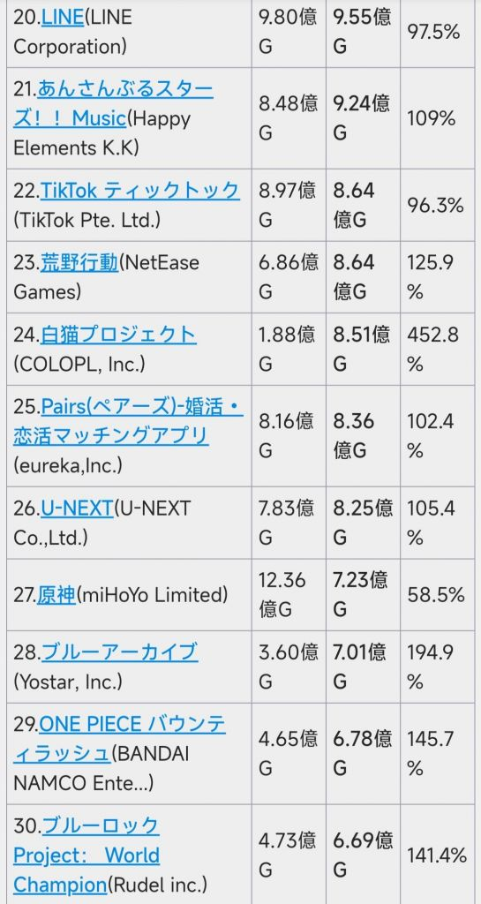

### [不吐不快]我实在是想不通了，流水这种东西高不高和我们普通玩家有一毛钱关系么

Made by ngapost2md (c) ludoux [GitHub Repo](https://github.com/ludoux/ngapost2md)

----

##### 0.[4] \<pid:0\> 2023-07-24 09:46:04 by 小景一郎
不知道会不会被锁了扔进流水楼，但确实是有感而发

起因是隔壁铁版一个讨论各种二游男女角色比例端水问题，好好讨论着讨论着唐突一转“流水高就是好，就是牛”

我挺好奇的，作为玩家你不去讨论游戏性好不好，剧情有没有意思，老婆美不美，搁这里讨论游戏流水高不高?

拜托，流水高不高对我们这些普通玩家而言唯一的意义不就是游戏公司拿了钱能不能产出更高质量的作品让我们玩个爽?怎么有些人把自己代入精神股东了啊，是不是看到大伟掉几滴鳄鱼的眼泪某些人还要共情一波?差不多得了，

哦你说原神利润率这么高啊，那产出来的内容一定有趣又好玩吧，不会是活动天天4399换汤不换药剧情又臭又长吧，角色一定不会是黑丝本子小男孩新角色女性都是午餐肉二创要靠老角色吧，不会吧不会吧

想了半天，突然间茅塞顿开了，某些张口闭口流水的不明生物估计连游戏都不玩，只是需要个能给他们带来迷之自信的东西用来获取一点点可怜的优越感

“诶你看我喜欢的游戏流水比你喜欢的高诶，我是不是很牛很有眼光?”

开什么玩笑要吐了，我十岁就知道拿喜欢的东西比较来比较去没有意义，别人的东西终究是别人的，只有自己牛才是真的牛这道理了。米厂刚好也擅长做饭圈这一套，团结这群年龄翻三倍不知道没有我45码的鞋子大的不明生物搞二刺螈宗教有一手的两边真的是臭味相投，只能说是尊重祝福，希望米厂再接再厉，当好国内二游的锁妖塔，多培养一些爆不出金币的云玩家而不是真正的核心玩家，反正你们都家大业大了随便作也作不死，那建议再努努力继续加速一下吧

上班摸鱼有感而发，bw看到了希望手下留情，不过都进里版了，我还是想不吐不快畅所欲言一下，溜了回工位了，一点小小的感受各位就当看个乐子吧。

----

##### 1.[3] \<pid:704477208\> 2023-07-24 09:49:12 by 断神霹雳001
流水厨一大特点:流水高的时候狂吹米牛逼流水低骂厨子爆不出金币，颇有赢了都是我在C输了就是队友菜的风范。不得不品尝

----

##### 2.[0] \<pid:704477386\> 2023-07-24 09:49:57 by 大a加油
我鸽鸽收视率高演唱会门票高，大家都是喜欢他的

----

##### 3.[0] \<pid:704477646\> 2023-07-24 09:51:06 by q794623
本来就和玩家没关系。。。

之前舟游玩家关注也是因为登顶送10连券，登不了之后就没几个人看了，后面倒是某些人一直在拿这个BB

我寻思你原登顶跟喝水一样，发了几次登顶10连来着？

----

##### 4.[0] \<pid:704477684\> 2023-07-24 09:51:18 by zero14134
从有互联网开始

电子斗蛐蛐

就一直有人乐此不彼

----

##### 5.[0] \<pid:704477766\> 2023-07-24 09:51:39 by Fablet
一种可能，流水多高多高是话术，提升说这话的人的集体自豪感——
效果等同于“我们()有文化输出的作用，名扬海外”，“我们()广受大众喜爱，顺应主流风向”云云，括号内写什么都行。
还有一种可能，流水多高多高和娱乐圈的“咬一买三”接近，类似于“花钱越多越有讨论权”。

----

##### 6.[0] \<pid:704477818\> 2023-07-24 09:51:53 by 汐汐漓漓
要游戏性有流水，要剧情有流水，要美工有流水，要女自机有流水，要体验有流水，要原石有流水

----

##### 7.[0] \<pid:704477867\> 2023-07-24 09:52:10 by 红茶拿铁泡枸杞
浅浅切割一下，们正经流水厨从不吹原吹米

----

##### 8.[3] \<pid:704478039\> 2023-07-24 09:53:06 by ToutSeul
还记得律者哥吗
典中典之游戏性比不过就开始扯人气流水
本质上是技不如人，转移话题的小伎俩

----

##### 9.[6] \<pid:704478125\> 2023-07-24 09:53:36 by 佐佐风守
当我喜欢他的时候我从来不看流水，因为流水跟我有毛关系
当我恨不得他死的时候天天看流水，因为我恨不得他立刻死

----

##### 10.[0] \<pid:704478261\> 2023-07-24 09:54:20 by 今锁朱楼
为的就是人上人的快感。
原是吹流水，未定是吹剧情。
然后今年这两个吹点都吹不起来了。

----

##### 11.[0] \<pid:704478684\> 2023-07-24 09:56:15 by 爱尔海参
为了所谓“集体荣誉感”，我只能说米学到了精髓。有的人是越骂越“弱小”，不懂得反抗，分化一批人提纯，留下来的弱势群体只会“习得性无助”。他们想要变强的途径不是“自立自强”，而是去寻找“救世主”。如果有人看过《遥远的救世主》

----

##### 12.[0] \<pid:704478972\> 2023-07-24 09:57:24 by a136875563
好像每家都会有这样的存在，除开米之外的，我之前还听说过芒果台也有这样的群体，叫做“芒果精”，就是芒果台的收视率厨

----

##### 13.[0] \<pid:704479397\> 2023-07-24 09:59:14 by Seeyoupelos
沃尔玛一年营收4万亿呢，怎么这些人不去集体荣誉一下。

----

##### 14.[1] \<pid:704479564\> 2023-07-24 09:59:56 by 月上七楼6004537238
记得()厨吹人气的时候必提谷子价格和销量吗，一样的道理

----

##### 15.[0] \<pid:704479575\> 2023-07-24 09:59:58 by 阿古斯的影灵衣
这种问题怎么会转进流水的，崩坏本家100%女角色啊

----

##### 16.[1] \<pid:704479608\> 2023-07-24 10:00:06 by 雨源rainsource
有人就是慕强，从众心理，看看知乎那帮人前后的嘴脸

----

##### 17.[1] \<pid:704480009\> 2023-07-24 10:01:47 by shli—
>[jump](#pid704479564) 月上七楼6004537238(2023-07-24 09:59) 说: 
>记得()厨吹人气的时候必提谷子价格和销量吗，一样的道理

我家哥哥那么多人黑，但谷子出来我都抢不到呜呜呜。

----

##### 18.[1] \<pid:704480020\> 2023-07-24 10:01:49 by 诗音小跟班
不但没关系，甚至流水越高马哈鱼越不会把普通玩家放在眼里

----

##### 19.[0] \<pid:704480181\> 2023-07-24 10:02:30 by 苇絮逐风
一般来说流水会证明游戏的运营是否良好，能否可持续发展，也会引导运营找出玩家更感兴趣的点，找准后续的发力方向，比如说男角色卖得好就会多出男角色，女角色买的好就会多出女角色，什么风格的新皮肤更受欢迎就会往这个风格多发力，游戏的新机制受不受欢迎，需要深入发掘还是赶紧淘汰之类的，至于米现在的情况，我只能说一般人看不懂，只能说是为(内部)爱发电了

----

##### 20.[1] \<pid:704480183\> 2023-07-24 10:02:31 by 先R再R最后R
本来就没关系，别家游戏关注这个好歹有个正当理由，比如小厂希望厂家活下去提供长期服务，奶嘴那还发点福利

米这有啥啊，完全就是拿来当嘴炮弹药的，给他们赛博跌尽孝用，要么花式赢要么喷厨子不给力，别家真没见过这毛病的

----

##### 21.[0] \<pid:704480924\> 2023-07-24 10:05:54 by 随便看看186215
说一下个人看法，都是臭打游戏的，不应该有啥集体荣誉感
它发点福利吹他两句，不发，爱多少多少谁管他
过去原神该玩玩，没在乎过这个，现在原神不玩了该骂骂，流水只是看他乐子的一环
顺便了解了解，看看散圣的魔力
好歹原神也算二游头部，虽然我觉得一点也不二游了，现在厂家跟风学习原神的很多，我对这一套有点ptsd了
主要想根据流水评估一下这一大批跟我三观不合的有多少。
希望能绕过这些人，玩点二游一点的游戏。

----

##### 22.[0] \<pid:704481085\> 2023-07-24 10:06:43 by Blancville
和普通玩家没关系
但是对公司厨、公司黑来说很重要，我属于公司黑

----

##### 23.[0] \<pid:704482031\> 2023-07-24 10:10:46 by scoutqq
>[jump](#pid704480183) 先R再R最后R(2023-07-24 10:02) 说: 
>
>本来就没关系，别家游戏关注这个好歹有个正当理由，比如小厂希望厂家活下去提供长期服务，奶嘴那还发点福利
>
>米这有啥啊，完全就是拿来当嘴炮弹药的，给他们赛博跌尽孝用，要么花式赢要么喷厨子不给力，别家真没见过这毛病的

我也觉得,氪金党玩凉游稍微关注下决定后续是加大力度还是提桶跑路倒是没啥问题,像崩铁流水我是从不关注

----

##### 24.[0] \<pid:704482247\> 2023-07-24 10:11:33 by _fluency
骄傲地挺起胸膛，这个梗在哪都适用

----

##### 25.[0] \<pid:704482356\> 2023-07-24 10:12:01 by 四方形打柠檬茶
玩别的游戏从来没听说过流水这回事公司厨吹的流水已经被三巨头拿去买连号豪车了，利润率这么高也没看放玩家口袋里

----

##### 26.[0] \<pid:704482599\> 2023-07-24 10:13:05 by 诗酒趁年华-狼人
>[jump](#pid704479397) Seeyoupelos(2023-07-24 09:59) 说: 
>
>沃尔玛一年营收4万亿呢，怎么这些人不去集体荣誉一下。

就沃尔玛那可怜的利润率，拿什么碰瓷我大米？

----

##### 28.[1] \<pid:704484407\> 2023-07-24 10:20:27 by AAO233
没有关系。在半壁江山爆典之前，流水都是用来骂厂家骗氪的，流水越高厂家妈妈飞得越高，你看以前的人骂小马骂得多狠，怎么骂丁三石改点卡，FGO玩家怎么骂叔叔。
以前就算有游戏间PVP，虽然也是比数量，例如单机就是我卖了多少份你卖了多少份，网游就是我同接多少人你同接多少人，放二次元就是你买了多少本本我买了多少本本。股东才需要看流水，玩家不需要。
但是国内圈子那个半壁江山爆典之后，这个逆天言论被米哈游韩国了，还洗白了自己拿来用，用别人的爆典当自己的真理。
以前瓜版放流水还陶侃胫骨大战，现在已经不是调侃了，你说他的胫骨他还谢谢你呢。

泥潭要讨论流水那只能讨论完美的，很多NGA人是确实买了完美股份。

----

##### 29.[0] \<pid:704484726\> 2023-07-24 10:21:50 by AiakosG
因为他们选择了()，所以当()流水高的时候就说明他们的选择没错也就=他们牛逼，所以吹流水本质上是吹他们自己

----

##### 30.[0] \<pid:704484739\> 2023-07-24 10:21:53 by bzbjzj
有点关系，关系不大。流水只能侧面印证游戏的吸金能力，确实和游戏性、剧情相关，但是也和游戏玩法、游戏风格、游戏受众、游戏质量、运营推广、稀缺性、玩家黏性等等一系列因素相关，就算玩法、剧情或游戏性某单一元素中的小细节有问题放在整体上也是微不足道的一小部分有的体验好、有的体验坏都是很正常，在这个复杂系统内，如果有人能他能精准评判游戏好坏，说流水高就没问题，流水低就没有做的好的部分那我只能说是蠢货了，还有玩家感到游戏是否好坏不一定能直接立即体现在流水上。当然要是有人能说的明白那些事情为什么不自己去做游戏。
而且就算流水高低，玩家有意见不妨碍继续提，接不接受才能厂商该考虑的事，当然这应该是一般游戏公司的套路和偶像运营无关，偶像运营才是容不得污点的，除非污点是人设。而堵塞厂商通过多种渠道了解玩家反馈这种事，我不知道是厂商友军还是厂商敌人才会做的事情。

----

##### 31.[0] \<pid:704484747\> 2023-07-24 10:21:54 by 长风未尽
流水不也是一种看米的乐子么。我建议想不通就不要想。世界是多彩和多答案的。

----

##### 32.[1] \<pid:704484756\> 2023-07-24 10:21:58 by 锟斤拷烫烫
米家流水厨而已，真流水厨不厨农皇？

----

##### 33.[0] \<pid:704485845\> 2023-07-24 10:26:40 by 君长白
我真的不太理解，还有说玩家氪的少不配说话的……
就是说，有没有可能，免费游戏的人场就是无氪捧出来的？说起来确实是高氪养服，但是这么看不起无氪干嘛搞内购啊，开买断怎么样？

----

##### 34.[0] \<pid:704487632\> 2023-07-24 10:33:52 by kiyota119
fgo和舟登顶是发石头的，这两家关注流水我理解
其他的“流水厨”，不厨农的话，那我很难理解

----

##### 35.[0] \<pid:704487659\> 2023-07-24 10:33:59 by M斯卡麗
最搞笑的不是因為劇情不能跳過，人家罵劇情，結晶們連雲劇情玩家的帽子也扣不上去麼
支線文本啥的還能爭辯兩嘴，主線人人都玩過，還不能跳過，只要內容不是錯的太離譜根本不能拿雲玩家那一套話術堵嘴

----

##### 36.[0] \<pid:704488417\> 2023-07-24 10:37:06 by 叶公好龙娘
你看隔壁版车版的一小部分人就知道了
出了问题还要护 流水上升就要吹

----

##### 37.[0] \<pid:704490167\> 2023-07-24 10:43:46 by kunizu
>[jump](#pid704477646) q794623(2023-07-24 09:51) 说: 
>
>本来就和玩家没关系。。。
>
>之前舟游玩家关注也是因为登顶送10连券，登不了之后就没几个人看了，后面倒是某些人一直在拿这个BB
>
>我寻思你原登顶跟喝水一样，发了几次登顶10连来着？

往事莫要再提，那种登顶送十连极大恶化了流水讨论，导致讨论环境一步步无可避免地恶化至当今如此地步

----

##### 38.[0] \<pid:704490373\> 2023-07-24 10:44:35 by 朔夜寒光
因为结晶是真心把米哈游当做自己的生命支柱和精神寄托的，米游流水高=米牛逼=我眼光好我牛逼，流水下降了=米被奸人迫害了=我要出征了，大概是这么个意思。

----

##### 39.[0] \<pid:704491600\> 2023-07-24 10:49:25 by 燕国地图
>[jump](#pid704480183) 先R再R最后R(2023-07-24 10:02)说:
>本来就没关系，别家游戏关注这个好歹有个正当理由，比如小厂希望厂家活下去提供长期服务，奶嘴那还发点福利  米这有啥啊，完全就是拿来当嘴炮弹药的，给他们赛博跌尽孝用，要么花式赢要么喷厨子不给力，别家真没见过这毛病的[s:a2:不明觉厉]

我就会关注BA的流水，因为BA常常发石头和十抽券，福利又好，真的担心BA流水不足

----

##### 40.[0] \<pid:704502587\> 2023-07-24 11:31:45 by hgsCinnabar
>[jump](#pid0) 小景一郎(2023-07-24 09:46):

因为它们都不玩游戏的，自然不会关心游戏怎么样，流水高能吹就行了。

----

##### 41.[0] \<pid:704509867\> 2023-07-24 12:02:23 by 兜适措蹩恣
如果一个玩家真的在玩一款游戏，那这款游戏的热度，流水，评分，获不获奖等数据，对于这名玩家来说，基本上可以说是没有意义的存在了。不会真的有人看到游戏的高热度，觉着手上的游戏更好玩了吧。

那些数据最大的意义我觉得是给还没入坑的玩家做参考用，很多人喜欢玩这款游戏，那么自己也很有可能喜欢，至少值得尝试一下。

----

##### 42.[0] \<pid:704514182\> 2023-07-24 12:22:12 by 啊呜呜博物馆
不知道，可能是这样的吧

----

##### 43.[1] \<pid:704516292\> 2023-07-24 12:31:38 by 剑筑师と書記官
对我来讲完全骗吃骗喝骗购物车的载体

----

##### 44.[0] \<pid:704520275\> 2023-07-24 12:51:19 by gtmmd
玩了15年游戏，从来没见过任何一个游戏吹流水的。哦不太严谨，单机、主机市场还是讲究销量的，但是核心还是围绕游戏本体。有些mxz是属于抛开游戏本体不谈，只看流水了，就很离谱，这不是一个“游戏玩家”该有的思维

----

##### 45.[0] \<pid:704523794\> 2023-07-24 13:09:24 by 经常看书看得开
“即使是伦敦东区最贫穷的人，一想到英国的财富和工业。便会不由自主地挺起胸膛。”

不过游戏和生活不同。 对于一些游戏公司来说，流水越高玩家待遇反而越差(我都这样了还是有人氪爆，我改什么，少招几个人省点钱啦)。  等到流水血崩夭折，他们才会回头想想自己是不是哪里做的不够好。 

这又不得不歪一话题，隔壁路过的人夸一句都能被塞奖励

----

##### 46.[0] \<pid:704524421\> 2023-07-24 13:12:35 by 被窝里叉出去
>[jump](#pid704478039) ToutSeul(2023-07-24 09:53) 说: 
>
>还记得律者哥吗
>典中典之游戏性比不过就开始扯人气流水
>本质上是技不如人，转移话题的小伎俩

我怎么感觉人气游戏性都比不过农皇

----

##### 47.[0] \<pid:704524875\> 2023-07-24 13:15:06 by ToutSeul
>[jump](#pid704524421) 被窝里叉出去(2023-07-24 13:12)说:
>>[jump](#pid704478039) ToutSeul(2023-07-24 09:53) 说: 
>>
>>还记得律者哥吗
>>典中典之游戏性比不过就开始扯人气流水
>>本质上是技不如人，转移话题的小伎俩
>
>我怎么感觉人气游戏性都比不过农皇

确实，当潭友提到农的问题之后
律者哥就熄火了，拉大胯了属于是

----

##### 48.[0] \<pid:704525038\> 2023-07-24 13:15:56 by setsuna2023
比亚迪拉动50万人就业4000多亿的营收160多亿利润和mhy打平，华为拉动20万人就业6000多亿的营收360多亿利润也就mhy两倍
工业制造业利润就是这么一点，然而有一个厂商特别爱吹自己工业化
讲真，薄利多销且积极投入研发改进产品质量的工业制造业还真是和普通人有关系，但是手游应该算服务业吧

----

##### 49.[0] \<pid:704525041\> 2023-07-24 13:15:56 by ewdang
>[jump](#pid704478261) 今锁朱楼(2023-07-24 09:54) 说: 
>
>为的就是人上人的快感。
>原是吹流水，未定是吹剧情。
>然后今年这两个吹点都吹不起来了。

有一说一，经常看到有米氏岩元素反应物说其他游戏流水少声音大，其实仔细想想最吻合这个描述的游戏不就是未定么，用仙的话说蔷薇有着比原神这种百亿级别流水游戏还强的对线战力，然后一看年流水3个亿，不如((((的零头

----

##### 50.[0] \<pid:704525258\> 2023-07-24 13:17:11 by Teddydesu
还有吹净利润的
一家未上市公司，一群赛博股东盯着这个看
“看！我爹卷钱也太厉害了吧！”

总不是玩游戏都不自信自卑到需要看别人眼色来玩吧？

----

##### 51.[0] \<pid:704527796\> 2023-07-24 13:31:15 by CUCUK
手游比流水，单机吹销量
养出了游戏圈两坨宗教级别的卧龙凤雏

----

##### 52.[0] \<pid:704562051\> 2023-07-24 16:18:47 by KOUBAKU
話不是這樣說，要是某種角色的池子流水高，不管他是因為強度、外型、還是人物劇情所造成的流水高，這多多少少會影響到日後角色產出傾向於這種流水高的角色，這會不會跟你口中所謂的普通玩家有關係我就不好說了。

----

##### 53.[0] \<pid:704562579\> 2023-07-24 16:21:03 by 御坂2180号
虽然我喷过卡游戏版号，但是卡游戏版号之后最起码不少手游更重视自己的品牌运营了我以前玩手游都要看看游戏流水怎么样，别玩着没几天就倒闭了

----

##### 54.[0] \<pid:704564463\> 2023-07-24 16:28:53 by 白面馒头白馍馍
流水高又不会优化我的游戏体验

----

##### 55.[0] \<pid:704610887\> 2023-07-24 20:04:57 by 一个粉帽帽同学
真的，我在米游社看见评论说有的角色是爆不出米的东西的时候，震撼我全家

----

##### 56.[0] \<pid:704612426\> 2023-07-24 20:12:59 by wyfrs
>[jump](#pid704562051) KOUBAKU(2023-07-24 16:18)说:
>話不是這樣說，要是某種角色的池子流水高，不管他是因為強度、外型、還是人物劇情所造成的流水高，這多多少少會影響到日後角色產出傾向於這種流水高的角色，這會不會跟你口中所謂的普通玩家有關係我就不好說了。

这条不适用于原神，目前流水最高的是夜雷胡，这并不影响原神快一年没有女限五，把迪希雅作废

----

##### 57.[0] \<pid:704612708\> 2023-07-24 20:14:38 by 慈怀药王
这个是一种“炒股”思想，就算分不到钱也可以挺起胸膛，用别人的流水来证明自己的眼光正确。类似于电影票房，这个电影好在哪里，你评价不出东西来，那就可以用票房来证明这电影好

----

##### 58.[0] \<pid:704613069\> 2023-07-24 20:16:53 by 优妮的温文儒雅
看到了皮衣黄年创新高的股价，n卡用户一定露出了欣慰的笑容了吧

----

##### 59.[0] \<pid:704613760\> 2023-07-24 20:21:17 by freonsuzuka
因为他的流水暴死对我真的很重要

----

##### 60.[0] \<pid:704614361\> 2023-07-24 20:25:01 by 可以让我骂个痛快吗
小心提醒，里面有个关键词发了会被禁言的，你猜我现在为什么是小号

----

##### 61.[0] \<pid:704614597\> 2023-07-24 20:26:35 by sgqmmlz
有关系的，心散池上不了150h我压的火锅就吃不上了

----

##### 62.[0] \<pid:704617885\> 2023-07-24 20:44:26 by 高山狸藻
手机里没有一款一个月流水50亿(米站评论区说的)但开服三年对话仍是固定动作样板戏，双立绘取消，人均套模，角色摆烂，活动没新意，无限长草的开放世界手游

----

##### 63.[0] \<pid:704623599\> 2023-07-24 21:15:25 by sacici
>[jump](#pid704617885) 高山狸藻(2023-07-24 20:44) 说: 
>
>手机里没有一款一个月流水50亿(米站评论区说的)但开服三年对话仍是固定动作样板戏，双立绘取消，人均套模，角色摆烂，活动没新意，无限长草的开放世界手游

现在对话是真的越来越没意思了

----

##### 64.[0] \<pid:704624119\> 2023-07-24 21:18:28 by 说话可直了
你这在米家自己游戏社群内都受不了 

要不试试在自己玩的其他手游圈里碰到米家流水厨来指点江山

----

##### 65.[0] \<pid:704626488\> 2023-07-24 21:33:21 by riceee
手游玩的少 只有这边开口闭口流水 用流水捂嘴一切 
高了吹公司蒸蒸日上 低了拷打嘲讽角色厨 
隔壁登顶 尸血山河抽卡机制黑运营飞马

----

##### 66.[0] \<pid:704626896\> 2023-07-24 21:34:49 by 怎样才能不被禁言1
>[jump](#pid704624119) 说话可直了(2023-07-24 21:18) 说: 
>
>你这在米家自己游戏社群内都受不了 
>
>要不试试在自己玩的其他手游圈里碰到米家流水厨来指点江山

流水厨？二观厨！

----

##### 67.[0] \<pid:704631088\> 2023-07-24 21:51:37 by 方子幕_桃
结晶拿流水踩3A/排除农皇吹流水有一种内娱粉丝用gege热度拉踩艺术家/证明行业内top的美，但我寻思卡池流水高这钱也进不了纸片人口袋啊，除非他的gege是米哈游

----

##### 68.[0] \<pid:704631230\> 2023-07-24 21:52:17 by 已经成为了一种笑话
>[jump](#pid704624119) 说话可直了(2023-07-24 21:18) 说: 
>
>你这在米家自己游戏社群内都受不了 
>
>要不试试在自己玩的其他手游圈里碰到米家流水厨来指点江山

不怕，不怎么玩手游，手机上的游戏只有农

----

##### 69.[0] \<pid:704637046\> 2023-07-24 22:22:27 by Raysken
笑死，利刃在那儿BB‘XXXX活动流水肯定薄纱铁道’时就没人说流水跟玩家有一毛钱关系了进可攻退可守，赢麻了

----

##### 70.[0] \<pid:704642230\> 2023-07-24 22:52:26 by 碳烤阿苏拉
一股微博追星妹搁那儿吹哥哥的既视感

----

##### 71.[0] \<pid:704645344\> 2023-07-24 23:11:57 by 鴉走
流水只有在登顶时运营愿意大方发福利的时候对我有意义

----

##### 72.[0] \<pid:704647856\> 2023-07-24 23:27:10 by Derusting
有关系，流水低了就得收拾收拾准备润了，要不等着关服，依公司而言有的连流水不够多都会关米则是彻底压榨剩下的人

----

##### 73.[0] \<pid:704660161\> 2023-07-25 01:02:23 by 诗音小跟班
>[jump](#pid704491600) 燕国地图(2023-07-24 10:49) 说: 
>
>我就会关注BA的流水，因为BA常常发石头和十抽券，福利又好，真的担心BA流水不足

关心ba大可不必，还是先关心原吧，毕竟游戏体量不在一个级别

----

##### 74.[0] \<pid:704674299\> 2023-07-25 06:12:02 by ritsukaalter
本质还是从众心理？觉得流水高就是氪的人多，玩的人多，大家都玩的就是好的

----

##### 75.[0] \<pid:704782190\> 2023-07-25 15:51:34 by KOUBAKU
>[jump](#pid704612426) wyfrs(2023-07-24 20:12):

其實與你所說的不適用恰巧相反，你也說了流水最高的是夜雷胡，這三隻角色裡面我們可以看到的大項是1.有特殊機制2.攻擊強度在合格線上。
於是乎後來出的某個滿滿內部角色愛的東西就有了可以說是整個遊戲獨一無二的機制，甚至怕他攻擊強度不夠強還刻意給他弄了個屬性輔助角色搭配，要不是因為過於偏愛該角色搞得劇情出了非常嚴重的問題該名角色的流水絕不僅僅如此。
至於你說的沒女限五則是也是你們那邊男女玩家之爭的問題，你們那邊一些你們所謂的XXN瘋狂舉報女角色的消息外面這邊都看得到你知道嗎？拜託你們那邊男玩家支稜起來，你們不好好向製作組表態就會被當作XXN的聲音才是你們全部玩家的聲音。
再來迪希雅與其說是做廢了，不如說是各種原因導致結果廢了，從設計角色的佔模理論來看，迪希雅這個角色非常尷尬的是她擁有自身傷害提升、自身治療、隊友承傷、霸體、協同攻擊、移速提升這些全都是佔模率高的要素，最後能分給自機傷害能力的剩餘點數可想而知，這也是為什麼當初的初版鐘離會廢到可笑的原因，可惜的是你們沒像當時鐘離那般反應劇烈的去爭取，結果這次就讓該製作組蒙混過關。

----

##### 76.[0] \<pid:704782696\> 2023-07-25 15:53:32 by VinceBlack
某些人吹是因为他真的能分到钱哦

----

##### 77.[0] \<pid:705011484\> 2023-07-26 14:54:30 by 皮卡丘跑快快
都一样，懂不懂集体荣誉感，大伙都喜欢吹逼

----

##### 78.[0] \<pid:705011807\> 2023-07-26 14:55:52 by 威尔逊以撒
一开始看流水也不是为了别的，只是想知道热搜上挂的登顶多少多少国到底什么水平

----

##### 79.[0] \<pid:705093467\> 2023-07-26 21:11:49 by 春日隼
高了无所谓，低了mhy好似

----

##### 80.[0] \<pid:705135592\> 2023-07-27 02:08:42 by cladrew
其实还是有的，流水低了就要逼氪了

----

##### 81.[0] \<pid:705143009\> 2023-07-27 06:03:03 by 狐狸吃团子
游戏流水高带来的乐子可不是流水暴死带来的乐子能比的
史无前例的赔钱货让不少玩家乐到现在~~也有我啊，那没事了~~

----

##### 82.[0] \<pid:705143611\> 2023-07-27 06:25:22 by 月宫的牧羊人C
我认为原神流水唯一能吹的地方在于堵嘴棒粉吹逼的时候来一句“加一起不如原神”，突出一个短平快破防

----

##### 83.[0] \<pid:705143827\> 2023-07-27 06:31:58 by 鼓盆何以叹
按我玩游戏的经验，流水最好保持在似不了但又不高的情况下才是最好的，太高了策划就要作妖了

