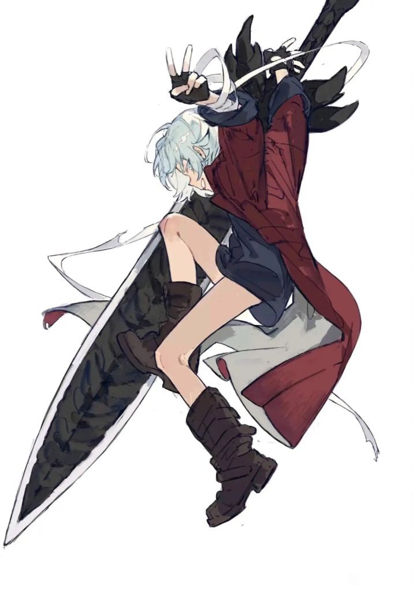

### [热点事件] 生贺图相关，我好像明白mhy男角色设计思路了

Made by ngapost2md (c) ludoux [GitHub Repo](https://github.com/ludoux/ngapost2md)

----

##### 0.[0] \<pid:0\> 2023-07-24 13:50:09 by unxplier
答案就在历史里，在原神之前mhy做的全是美少女游戏，全都是女桐，并且以往的用户主要是面向男性
关于男角色最大的节奏，就是崩坏三问卷对出男角色看法如何，结果被喷了

于是如果从mhy的角度，可以得出这样一个结论：用户画像男性为主，喜欢女性，流水高，讨厌男性
那么在新游戏里如何设计男角色呢？答案不言而喻，根据以往作品得出的用户经验，男玩家不喜欢男角色，那就设计出一堆不是以男性玩家为受众对象的男角色

当然可能这么说感觉很脑残，但捋下来就是，首先mhy经过前作筛选用户并积累口碑，根据筛选出的玩家得出了畸形的用户画像，根据畸形的用户画像招聘了对应口味的人才，最后沿着资本惯性造出了一些奇怪的男角色

省流：自己作的

----

##### 1.[0] \<pid:704534095\> 2023-07-24 14:05:21 by 啊2333
这也不是大部分女性视角哇，第三性别者是吧

----

##### 2.[6] \<pid:704534345\> 2023-07-24 14:06:32 by kiyota119
其实游戏界不乏受男玩家欢迎的男性角色，鬼泣斯巴达一家子，生化克里斯里昂威斯克，潜龙谍影系列如龙系列等等等等
也不知道怎么滴原神一些玩家直接就张嘴“男角色就应该是出给女玩家”的
也别拿抽卡二游当挡箭牌，二游最会玩厨力抽卡的fgo，不少男角色可是有很多男玩家也喜欢的呢

----

##### 4.[5] \<pid:704534549\> 2023-07-24 14:07:35 by 寅晏冉辰乔郑
资本：我又卜是sb，怎么会有这种惯性
建议看看其他真正的资本怎么出人物的，内部完全厕妹化这么明显的事情找这么多理由干什么

----

##### 5.[0] \<pid:704534578\> 2023-07-24 14:07:42 by unxplier
>[jump](#pid704534095) 啊2333(2023-07-24 14:05)说:
>这也不是大部分女性视角哇，第三性别者是吧[s:ac:哭笑]

非男性向不完全等于女性向

----

##### 6.[0] \<pid:704534604\> 2023-07-24 14:07:54 by タウィル
招来一群xxn,让她们做自己喜欢做的事

----

##### 7.[0] \<pid:704534749\> 2023-07-24 14:08:42 by samiyako
他们只喜欢抛洒着发酵的奶酪味的形象

----

##### 8.[0] \<pid:704534878\> 2023-07-24 14:09:22 by 凌岚望月
感觉不如
1.0版本之女甘雨，黑丝连体紧身衣
2.0版本之女申鹤，黑丝连体紧身衣
于是3.0版本产生了路径依赖，设计了艾尔海森

----

##### 9.[0] \<pid:704535320\> 2023-07-24 14:11:29 by 猹飞
和隔壁一样一年只出三个男六可以解决所有问题，抛开剂量谈毒性就是耍流氓

----

##### 10.[0] \<pid:704535607\> 2023-07-24 14:12:58 by unxplier
>[jump](#pid704534345) kiyota119(2023-07-24 14:06)说:
>其实游戏界不乏受男玩家欢迎的男性角色，鬼泣斯巴达一家子，生化克里斯里昂威斯克，潜龙谍影系列如龙系列等等等等 也不知道怎么滴原神一些玩家直接就张嘴“男角色就应该是出给女玩家”的 也别拿抽卡二游当挡箭牌，二游最会玩厨力抽卡的fgo，不少男角色可是有很多男玩家也喜欢的呢

说白了，角色设计这东西需要人才和经验。mhy既没有经验，也没有对应的人才团队，因为以前一个游戏里最多就一个男角色，也不是自机

和原神同期上线的是什么？不是名不见经传的project:sh，也不是炫得一批的ZZZ，而是未定事件簿，里面全是前所未有多的男性角色

从这个角度看，原神里的男角色带点怪味很好理解吧

----

##### 11.[1] \<pid:704535700\> 2023-07-24 14:13:30 by 休戰的天空
游戏史上男玩家喜欢的男角色多了 帅的直男胡子大叔画女硬说男都有 HY偏不 非得中性阴柔麦麸雌雄难辨 我真怀疑他家办公室里是挂红旗还是彩虹旗

----

##### 12.[0] \<pid:704535787\> 2023-07-24 14:13:58 by 无。乡4
>[jump](#pid704534345) kiyota119(2023-07-24 14:06) 说: 
>
>其实游戏界不乏受男玩家欢迎的男性角色，鬼泣斯巴达一家子，生化克里斯里昂威斯克，潜龙谍影系列如龙系列等等等等
>也不知道怎么滴原神一些玩家直接就张嘴“男角色就应该是出给女玩家”的
>也别拿抽卡二游当挡箭牌，二游最会玩厨力抽卡的fgo，不少男角色可是有很多男玩家也喜欢的呢

因为这些角色真的很酷

----

##### 13.[0] \<pid:704536074\> 2023-07-24 14:15:22 by 黑蜀黍电动输弹机
莫名其妙，O人气最高的不是钟离？
明明做个传统正派酷盖造型成男能好好吸一波的，硬要捏的给给的，连着崩铁那几个都是给给的

----

##### 14.[0] \<pid:704536356\> 2023-07-24 14:16:44 by 岸上的喀秋莎
评价为路线错了知识越多越反动
照着空条承太郎出几个男角色，流水直接薄纱胡夜池

----

##### 15.[0] \<pid:704536609\> 2023-07-24 14:18:01 by 子苗章己汤季
>[jump](#pid704536074) 黑蜀黍电动输弹机(2023-07-24 14:15) 说: 
>
>莫名其妙，O人气最高的不是钟离？
>明明做个传统正派酷盖造型成男能好好吸一波的，硬要捏的给给的，连着崩铁那几个都是给给的

说实话，我倒觉得崩铁男角色明显有从钟离等原神高人气角色身上汲取灵感的影子

----

##### 16.[0] \<pid:704536655\> 2023-07-24 14:18:22 by 星际兄贵
就是内部xxn和神父厨力放出而已，能让男玩家无法抗拒的男角色可海了去，mhy怎么不抄那些现成的案例？

----

##### 17.[0] \<pid:704537035\> 2023-07-24 14:20:19 by 锟斤拷烫烫
莫名其妙这锅还甩男玩家头上了？正常人会觉得男人喜欢这种玩意？不就是招了一堆xxn做xxn喜欢的东西吗

----

##### 18.[0] \<pid:704537096\> 2023-07-24 14:20:36 by unxplier
>[jump](#pid704536655) 星际兄贵(2023-07-24 14:18)说:
>就是内部xxn和神父厨力放出而已，能让男玩家无法抗拒的男角色可海了去，mhy怎么不抄那些现成的案例？

在mhy眼里，男角色就不是给男玩家玩的，为什么？因为前有“男性偏多用户群体”，又有“女同游戏发家历史”，mhy的脑回路跟这些玩游戏的脑回路它就不一样，这么说懂了吗

----

##### 19.[0] \<pid:704537377\> 2023-07-24 14:21:54 by 雨源rainsource
因为原神怎么出都会有“我男我也”

----

##### 20.[0] \<pid:704537600\> 2023-07-24 14:22:57 by 剑筑师と書記官
男角色并非不能做成男女通吃的type
只能说米哈游格局太小。

----

##### 21.[0] \<pid:704538114\> 2023-07-24 14:25:09 by 星际兄贵
>[jump](#pid704537096) unxplier(2023-07-24 14:20)说:
><b>Reply to [pid=704536655,37116426,1]Reply[/pid] Post by [uid=60933471]星际兄贵[/uid] (2023-07-24 14:18)</b> 在mhy眼里，男角色就不是给男玩家玩的，为什么？因为前有“男性偏多用户群体”，又有“女同游戏发家历史”，mhy的脑回路跟这些玩游戏的脑回路它就不一样，这么说懂了吗[s:ac:哭笑]

这我知道，要解释mhy的行为不能套正常商业公司的模板

----

##### 23.[0] \<pid:704539013\> 2023-07-24 14:29:27 by ayayayo
纯扯淡，天天被拿来拐的fgo，男性高人气数都数不过来，从早期梅林，医生，狗蛋，闪闪，红a，到第二部蝙蝠哥，超人熊，伊阿宋等等等等纯粹是剧情写的烂了只能靠外形吸引人气，还做的不怎么合大众口味

----

##### 24.[1] \<pid:704539565\> 2023-07-24 14:32:13 by 多一滋
钟离这种男角色不受男玩家欢迎吗？迪卢克绫人这种也很正常吧，又不是做不出，非要往麦麸小男孩方向做，你说不夹带私货我是不信

----

##### 25.[0] \<pid:704540402\> 2023-07-24 14:36:24 by unxplier
>[jump](#pid704539565) 多一滋(2023-07-24 14:32)说:
>钟离这种男角色不受男玩家欢迎吗？迪卢克绫人这种也很正常吧，又不是做不出，非要往麦麸小男孩方向做，你说不夹带私货我是不信

 确实，不过夹带私货那就是另一个话题了

----

##### 26.[0] \<pid:704541007\> 2023-07-24 14:39:33 by 安达利斯
mhy对男角色塑造怕不是有什么误解，我1.1入坑最喜欢的男角色是迪卢克，现在还是....

----

##### 28.[0] \<pid:704541039\> 2023-07-24 14:39:45 by wjxjh
>[jump](#pid704537096) unxplier(2023-07-24 14:20) 说: 
>
>在mhy眼里，男角色就不是给男玩家玩的，为什么？因为前有“男性偏多用户群体”，又有“女同游戏发家历史”，mhy的脑回路跟这些玩游戏的脑回路它就不一样，这么说懂了吗

那难道这些角色是给女玩家玩的吗？那设计的也怪怪的啊。总不能既不是给男的玩也不是给女的玩的吧

----

##### 29.[0] \<pid:704541513\> 2023-07-24 14:41:58 by unxplier
>[jump](#pid704541039) wjxjh(2023-07-24 14:39)说:
>[quote][pid=704537096,37116426,1]Reply[/pid] <b>Post by [uid=60482374]unxplier[/uid] (2023-07-24 14:20):</b>  在mhy眼里，男角色就不是给男玩家玩的，为什么？因为前有“男性偏多用户群体”，又有“女同游戏发家历史”，mhy的脑回路跟这些玩游戏的脑回路它就不一样，这么说懂了吗[s:ac:哭笑][/quote]那难道这些角色是给女玩家玩的吗？那设计的也怪怪的啊。总不能既不是给男的玩也不是给女的玩的吧[s:ac:哭笑]

 “人类有七种性别，分别为：男、女、中性、偏男两性人、偏女两性人、不完全男性、不完全女性”

----

##### 30.[0] \<pid:704541837\> 2023-07-24 14:43:34 by wjxjh
>[jump](#pid704541513) unxplier(2023-07-24 14:41) 说: 
>
>“人类有七种性别，分别为：男、女、中性、偏男两性人、偏女两性人、不完全男性、不完全女性”

我在中国，中国目前只有两种性别

----

##### 31.[0] \<pid:704542287\> 2023-07-24 14:45:46 by xlsq03
你是不是分不清楚正常男角色和又丑又不正常的男角色？

----

##### 32.[0] \<pid:704542888\> 2023-07-24 14:48:38 by unxplier
>[jump](#pid704542287) xlsq03(2023-07-24 14:45)说:
>你是不是分不清楚正常男角色和又丑又不正常的男角色？

 我不是以我的视角来看男角色设计，而是以mhy的视角来看，我知道什么是正常男角色和又丑又不正常的男角色

----

##### 33.[0] \<pid:704543002\> 2023-07-24 14:49:11 by 叶落寒宵
今天来点大家想看的东西

----

##### 34.[0] \<pid:704543416\> 2023-07-24 14:51:30 by 小白菜种子
我觉得原神早期男角色更符合大部分女玩家对异性的审美，毕竟女生普遍更看重的是男生的能力品性而非性特征

----

##### 36.[0] \<pid:704544933\> 2023-07-24 14:58:43 by fgfdfk
但是能把男角色做成男女都不吃也是本事
厕弟厕妹先不说，至少大众宅向都不上头。

----

##### 37.[0] \<pid:704548756\> 2023-07-24 15:16:39 by UID43055609
这游戏以前又不是没有男女通吃的男角色，为什么变成这样我不好说

----

##### 38.[0] \<pid:704557716\> 2023-07-24 15:59:17 by Arccrice
>[jump](#pid704534345) kiyota119(2023-07-24 14:06) 说: 
>
>其实游戏界不乏受男玩家欢迎的男性角色，鬼泣斯巴达一家子，生化克里斯里昂威斯克，潜龙谍影系列如龙系列等等等等
>也不知道怎么滴原神一些玩家直接就张嘴“男角色就应该是出给女玩家”的
>也别拿抽卡二游当挡箭牌，二游最会玩厨力抽卡的fgo，不少男角色可是有很多男玩家也喜欢的呢

对极了，在我看旧剑就是这样的，他的性格肯定能当好哥们。

----

##### 39.[0] \<pid:704558732\> 2023-07-24 16:03:41 by logicnnn
欧美热度低了，搞点lgbt

----

##### 40.[0] \<pid:704559177\> 2023-07-24 16:05:49 by 悲伤烤红薯
不是，可以看看隔壁买营销时用的哪些，mhy显然知道哪些男角色受欢迎

----

##### 41.[0] \<pid:704559329\> 2023-07-24 16:06:30 by 快乐莫小问
身边统计学，亲友里不管男女，喜欢钟离魈绫人海哥的比例都很高(直到海卖腐卖到脸上群里老哥破口大骂) 钟离不用说的人气很高，绫人海哥都是剧情不错的，魈 酷炫小伙 大家也爱。
编辑 ，再看某些是谁在喜欢，反正不是我，但我的学长亲友她超爱。

----

##### 42.[0] \<pid:704562150\> 2023-07-24 16:19:11 by 好想上钟离啊
米哈游估计这辈子都搞不懂钟离人气为啥那么高

----

##### 44.[0] \<pid:704564002\> 2023-07-24 16:26:57 by Fablet
喜报，我也不知道是谁超爱.jpg
老实说，前排也有人提到了男性大众喜欢的男性角色，诸如但丁维吉尔里昂(不愧是卡普空优秀的设计机制)。
我就没见过一个此类角色是“削弱男性特征，减弱角色张扬感和侵略性，幼化弱化角色能力”的。
~~难道这顺应了玛丽莲梦露那个经济下行裙摆变长的定律~~
顺带，同样是设计小男孩，放一张但丁同人图比对一下，方便思考“究竟出啥问题了”。

----

##### 45.[0] \<pid:704565411\> 2023-07-24 16:33:06 by 啊呜一口吃掉aa
完了，那我这种不喜欢原神小男孩和基佬的是不是再次被米开除女籍了  

可我之前也喜欢过纸片人少年角色，还磕过一些bl cp，只是不怎么喜欢原神和铁的其他和丹枫这些角色，好奇怪啊

----

##### 46.[0] \<pid:704566422\> 2023-07-24 16:37:14 by 浮士德噩梦
>[jump](#pid704564002) Fablet(2023-07-24 16:26)说:
>喜报，我也不知道是谁超爱.jpg 老实说，前排也有人提到了男性大众喜欢的男性角色，诸如但丁维吉尔里昂(不愧是卡普空优秀的设计机制)。 我就没见过一个此类角色是“削弱男性特征，减弱角色张扬感和侵略性，幼化弱化角色能力”的。 <del class='gray'> 难道这顺应了玛丽莲梦露那个经济下行裙摆变长的定律 </del> 顺带，同样是设计小男孩，放一张但丁同人图比对一下，方便思考“究竟出啥问题了”。 [img]https://img.nga.178.com/attachments/mon_202307/24/l2Q2s-hhr4K1xT3cSjv-sg.jpg[/img]

我来发一张可能是二次元历史上最高人气的小男孩

----

##### 47.[0] \<pid:704566668\> 2023-07-24 16:38:17 by sbsx123
“用户画像男性为主，喜欢女性，流水高，讨厌男性”
所以新游戏为什么一定要做男角色呢？

----

##### 48.[0] \<pid:704567016\> 2023-07-24 16:39:51 by 色胚茄子
建议看看海哥的风评，我不信mhy一点不懂，但他就是要卖

----

##### 51.[0] \<pid:704567817\> 2023-07-24 16:43:23 by unxplier
>[jump](#pid704566668) sbsx123(2023-07-24 16:38)说:
>“用户画像男性为主，喜欢女性，流水高，讨厌男性” 所以新游戏为什么一定要做男角色呢？[s:ac:茶]

 可能是跟立项的想法冲突了，七个国家总不能都是女儿国吧
现在原神有男角色但没有铁血肌肉男，就像有牛奶没有牛，有骑兵队长没有马一样

----

##### 52.[0] \<pid:704571758\> 2023-07-24 17:01:29 by 断裂的尾巴
>[jump](#pid704567016) 色胚茄子(2023-07-24 16:39) 说: 
>
>建议看看海哥的风评，我不信mhy一点不懂，但他就是要卖

详细点，看看海哥风评变化
主线刚完结和3.6时代的海森是两种风评，我现在真不希望他有新剧情了，有也来点一个人的

----

##### 53.[0] \<pid:704572698\> 2023-07-24 17:05:56 by dfpvml
现实中受异性欢迎但同性都很讨厌的人 你觉得会是好东西吗

----

##### 54.[0] \<pid:704575387\> 2023-07-24 17:17:53 by rr1317
我是宅男，非二游里我喜欢的男角色挺多，但我觉得二游的男角色就不是出给男玩家的，因为我发现只要有男角色就一定环境里面有神奇动物，男角色比例越高神奇动物越多，正好我原神里面讨厌的几个角色全都是因为场外因素，费拉宅男惹不起至少躲得起

----

##### 55.[0] \<pid:704589296\> 2023-07-24 18:20:46 by bishoujo！！！
我见过的男的，没一个是不喜欢蝙蝠侠的，不要太爱好吧。

----

##### 56.[0] \<pid:704590164\> 2023-07-24 18:25:12 by 透明的视野
>[jump](#pid704537096) unxplier(2023-07-24 14:20) 说: 
>
>在mhy眼里，男角色就不是给男玩家玩的，为什么？因为前有“男性偏多用户群体”，又有“女同游戏发家历史”，mhy的脑回路跟这些玩游戏的脑回路它就不一样，这么说懂了吗

懂你意思了，因为之前崩3是男玩家为主，卖女同广受好评，所以现在原这边吸引来的这么多女玩家一定也会磕男同

----

##### 57.[0] \<pid:704591437\> 2023-07-24 18:32:09 by 溯洄寻英
>[jump](#pid704536356) 岸上的喀秋莎(2023-07-24 14:16) 说: 
>
>评价为路线错了知识越多越反动
>照着空条承太郎出几个男角色，流水直接薄纱胡夜池

已经出了，镀金旅团(枫丹的典狱长？肌肉能有镀金旅团一半吗)
真不明白米哈游老是要把肌肉男做成细狗，艾尔海森有个胳膊就已经谢天谢地了

----

##### 58.[0] \<pid:704593392\> 2023-07-24 18:43:15 by freonsuzuka
我觉得更像是mhy根本不在乎玩家喜不喜欢，就是想满足自己那点私货小心思

----

##### 59.[0] \<pid:704601276\> 2023-07-24 19:20:56 by xklwjz
支持热评。自从原神之前，我完全不会有“男角色是服务女玩家女角色是服务男玩家”这种意识，从小看番打游戏喜欢一堆牛逼上天的男角色。就说火影吧，晓组织前后十几个人就小南一个女的，这性别比例搁原神不得炸了，但人家就是一个比一个有逼格帅的飞起。再说fgo，当初也玩了好几年，确实更喜欢妹子，但是有逼格的男角色一样没落下。原这里我也是在3.3更新后第一时间就去抽了伞，剧情看完直接呃呃了，什么捞比巨婴。真的就从这个b3.3开始一下子回过味了，原娱真不是闹着玩的，这逼游戏角色剧情就那么一点，剩下的全靠粉丝吹粉丝脑补，最可怕的是就那么点剧情还能次次都写成答辩，还要强行去吹。

----

##### 60.[0] \<pid:704601871\> 2023-07-24 19:24:15 by 空井咲のsensei
虽然但是，拿非二游和二游比本来就不合理，二游本质就是迎合宅宅的xp，男宅女宅都是宅，说二游99%的男角色设计初衷是为了迎合女性xp并没有什么问题。说涩涩女角色迎合男玩家没人会反对，为什么不允许男角色迎合女玩家呢？喷的应该是狂出小众xp让男女玩家都不高兴而不是迎合女玩家这件事本身

----

##### 61.[0] \<pid:704603143\> 2023-07-24 19:30:51 by sbsx123
>[jump](#pid704601871) 空井咲のsensei(2023-07-24 19:24) 说: 
>
>虽然但是，拿非二游和二游比本来就不合理，二游本质就是迎合宅宅的xp，男宅女宅都是宅，说二游99%的男角色设计初衷是为了迎合女性xp并没有什么问题。说涩涩女角色迎合男玩家没人会反对，为什么男角色迎合女玩家就要吐槽呢？喷的应该是狂出小众xp让男女玩家都不高兴而不是迎合女玩家这件事本身。
>叠甲：不喜欢林尼和其他哥

有人喜欢甜豆腐脑，有人喜欢咸豆腐脑，不代表你把甜咸豆腐脑混在一起就能迎合所有人，这就是“一般向”二游的问题。

----

##### 62.[0] \<pid:704604258\> 2023-07-24 19:36:57 by 空井咲のsensei
>[jump](#pid704603143) sbsx123(2023-07-24 19:30) 说: 
>
>有人喜欢甜豆腐脑，有人喜欢咸豆腐脑，不代表你把甜咸豆腐脑混在一起就能迎合所有人，这就是“一般向”二游的问题。

我认为的一般向：甜豆腐脑咸豆腐脑都卖，只喜欢甜的和只喜欢咸的都可以各取所需
米哈游的一般向：把甜咸混在一起用的还是变质豆腐做的，嗨嗨嗨又甜又咸的豆腐脑来咯，诶怎么不吃啊，不吃是吧，不吃你们都别想有饭吃
该喷的是把两种豆腐脑混在一起和变质豆腐这种逆天行为而不是喷咸豆腐脑或者甜豆腐脑的受众

----

##### 63.[3] \<pid:704606366\> 2023-07-24 19:46:48 by tbiph9277
钟离：？
我寻思着钟离断层的人气第一不可能是只有女玩家投出来的吧，这个角色应该能算塑造的男女大部分都会喜欢，至少不会讨厌的水平吧，你看看钟师傅再看看现在的散兵林尼，这设计是一个路数的吗 ，说白了就是你写的好谁那么在乎你什么性别，你写的拉了不管是男是女都会吐槽这角色写的什么玩意

----

##### 64.[0] \<pid:704615938\> 2023-07-24 20:34:39 by sbsx123
>[jump](#pid704604258) 空井咲のsensei(2023-07-24 19:36) 说: 
>
>我认为的一般向：甜豆腐脑咸豆腐脑都卖，只喜欢甜的和只喜欢咸的都可以各取所需
>米哈游的一般向：把甜咸混在一起用的还是变质豆腐做的，嗨嗨嗨又甜又咸的豆腐脑来咯，诶怎么不吃啊，不吃是吧，不吃你们都别想有饭吃
>该喷的是把两种豆腐脑混在一起和变质豆腐这种逆天行为而不是喷“咸豆腐脑迎合喜欢吃咸的人”

角色不只有立绘建模，剧情也是重要部分，而迎合男性和女性的剧情走向从本质上就是不同的，不然网文也不需要分男频和女频了，你能想象一部网文一章让男频作者写，下一章让女频作者写吗？所以除非剧情上男女角色也毫无交集，不然“一般向”二游就只能端出甜咸混合的豆腐脑。

----

##### 65.[0] \<pid:704623955\> 2023-07-24 21:17:31 by sacici
>[jump](#pid704534878) 凌岚望月(2023-07-24 14:09) 说: 
>
>感觉不如
>1.0版本之女甘雨，黑丝连体紧身衣
>2.0版本之女申鹤，黑丝连体紧身衣
>于是3.0版本产生了路径依赖，设计了艾尔海森

然后5点0继续黑丝

----

##### 66.[0] \<pid:704626754\> 2023-07-24 21:34:22 by 琉璃瓶蔷薇水
说穿了就是思路狭隘+刻板印象
以为男玩家只喜欢女角色，女玩家只喜欢男角色
至于国内人气TOP的钟先生，说白了也是因为璃月神的这一层身份，他要不是璃月的神的话照样被喷

----

##### 67.[4] \<pid:704631081\> 2023-07-24 21:51:34 by 云影之离
>[jump](#pid704626754) 琉璃瓶蔷薇水(2023-07-24 21:34) 说: 
>
>说穿了就是思路狭隘+刻板印象
>以为男玩家只喜欢女角色，女玩家只喜欢男角色
>至于国内人气TOP的钟先生，说白了也是因为璃月神的这一层身份，他要不是璃月的神的话照样被喷

又开始了，国内限定人气高的钟离

----

##### 68.[1] \<pid:704631640\> 2023-07-24 21:54:12 by 午吃饱晚吃少
这种帖子怎么还有钓鱼的啊米现在的小男孩设计明显不是面向大众的，高人气小男孩是怎样的看看其他热门作品都知道

