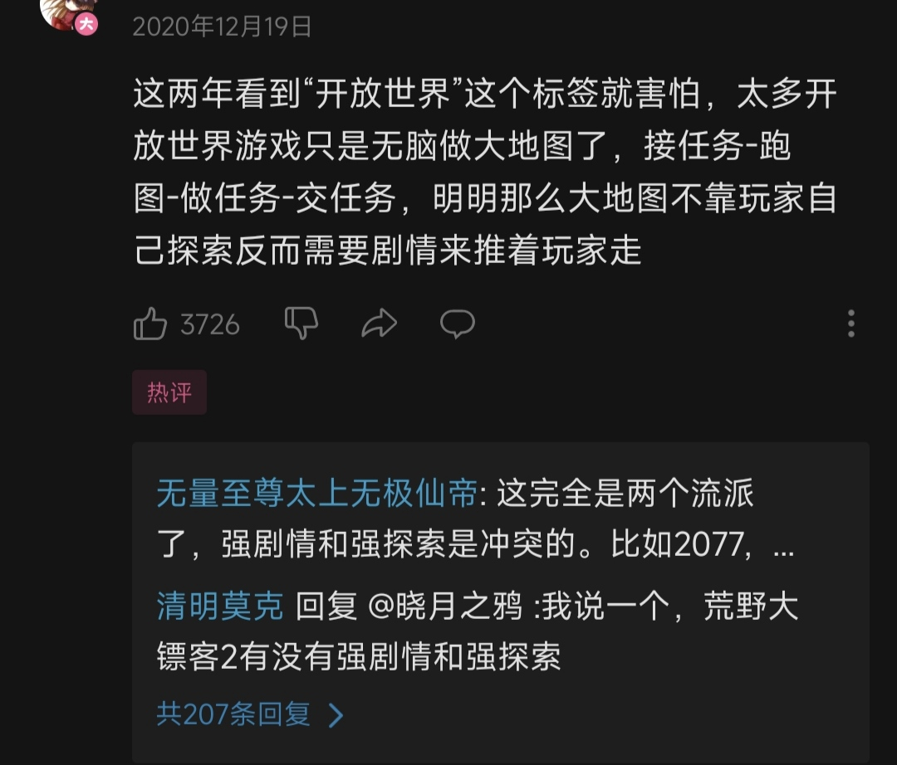

### [不吐不快] 三年后再看这个视频感觉很多问题都说到点子上了啊

Made by ngapost2md (c) ludoux [GitHub Repo](https://github.com/ludoux/ngapost2md)

----

##### 0.[0] \<pid:0\> 2023-07-24 23:47:57 by 始源爱莉希雅
指路→
[为什么说原神的“开放世界”不尽人意？荒野之息的“开放世界”又有多特殊？] [url](https://www.bilibili.com/video/BV1Ay4y1D7Zk/?share_source=copy_web&amp;vd_source=9ff860f8f919d6cad586edf6a72bd9b7)
视频关于原的主要观点在后半段，看完可以看看up去年在评论区置顶的评论，前半段内容他自己也觉得做得不太好，但是感觉后半段的观点基本上完全印证了原神这三年走过的路。

----

##### 1.[0] \<pid:704672405\> 2023-07-25 04:44:14 by MADAbāi
太强了，看完了之后把原神义无反顾卸载了，之前还打算每天做做日常
我必须承认我玩这么久原神是因为没见过世面
没什么，以后不用再浪费时间了

----

##### 2.[0] \<pid:704672754\> 2023-07-25 05:00:42 by 泥头车司机67号
不行我进来看到评论第一条就没蹦住

原神主打的是二次元 开放世界是个添头

三年过去了，我也不知道究竟哪里二次元，感觉王者荣耀都比原神二次元

----

##### 3.[0] \<pid:704672824\> 2023-07-25 05:04:27 by 黑蜀黍电动输弹机
两部塞尔达把海拉鲁逛了1000h之后，我能说还是很乐，永远有东西吸引我去做。战斗、探索、世界生态本身就是充满了乐趣，而O的大世界……玩久了无非是个刷苦工材料的矿场罢了，设计深度完全不在一个量级
大师模式穿内裤单挑台地黄金人马和O裸装打深渊是完全不同的概念，基于氪金、养成、数值的战斗系统从底层机制、动作设计到场地安排、声光打击感反馈都是妥妥的折磨，打死粪怪也没有一丝激动，只会感叹材料真尼玛难刷or深渊又超时了

----

##### 4.[0] \<pid:704673937\> 2023-07-25 05:57:35 by jasmine4869
去年就看到这个视频了，还真就是底层逻辑了，一个游戏靠什么氪金赚钱和游戏模式决定了他是个怎样的游戏，所以人家几年前就看出来了，也能说明几年了老米完全没想着去改进，只是果不其然在骗氪的道路上狂奔

----

##### 5.[0] \<pid:704675441\> 2023-07-25 06:48:43 by smasher401
>[jump](#pid704672405) MADAbāi(2023-07-25 04:44) 说: 
>
>太强了，看完了之后把原神义无反顾卸载了，之前还打算每天做做日常
>我必须承认我玩这么久原神是因为没见过世面
>没什么，以后不用再浪费时间了

我还是先玩的野炊，第一次接触单机，很多东西搞不明白…觉得野炊一个人玩着好孤独。正好那个时候原神2.4，哔站好多吹国风的视频上热门，看到帝君up就跑来玩原神了。只能说谢谢原，让我明白了野炊的牛逼。~~现在已经化身为一个塞吹了~~

----

##### 6.[0] \<pid:704675836\> 2023-07-25 06:58:54 by 奇迹沼
野炊本来就吊起来打原，解谜和指引不是一个等级的都。刚入坑肝到稻妻那里这游戏我就当个养成战斗手游玩了。

----

##### 7.[0] \<pid:704676353\> 2023-07-25 07:09:51 by 格里兹纳特
这些只是噪音罢了，米想做的是什么大家还不清楚吗？
它目的早就达到了，原神的表现超出预期太多了。有多少像我这样的玩家看走了眼，开服氪完之后才发现不对劲的？
那么现在才开始玩的萌新，就一样有可能步我后尘。只要有新人进游戏，一切皆有可能
除非爆个超级加倍的负面新闻，让原神口碑彻底烂掉

----

##### 8.[0] \<pid:704677396\> 2023-07-25 07:26:29 by HitsugayaToushirou
视频说的真的很好，现在看来原神三年前存在的问题到现在不仅没有任何改善，甚至问题还愈发严重了，旧雷不仅没排掉，还增加了不少新雷。
而且横向对比一下原神和崩铁的话，会发现崩铁除了在人物设计和剧情演出方面有些许进步之外，在玩法方面甚至比原神还落后。

----

##### 9.[0] \<pid:704677539\> 2023-07-25 07:28:28 by bug失去联系

难绷

----

##### 10.[0] \<pid:704677948\> 2023-07-25 07:33:40 by 平泽唯1987
他说的很对，但他绝对料不到这游戏会变成gay神

----

##### 11.[0] \<pid:704681798\> 2023-07-25 08:11:25 by ZFBXBD
原可以帮你戒掉其他游戏，然后帮你戒掉原神

----

##### 12.[0] \<pid:704738073\> 2023-07-25 12:19:22 by 药师鬼
说的挺对的，大世界其实是最有魅力的部分，然而它的存在只是提供给卖卡养成的一个矿场……
mhy有技术力开发大世界的乐趣，但是它不会的，因为原的核心还是卖卡。

----

##### 13.[0] \<pid:704739648\> 2023-07-25 12:26:42 by sumoboss
倒不是我非要装预言家，而是在原开服前我就疑惑过开放世界rpg和抽卡要怎么统一到一起。
因为前者的爽感和后者会有矛盾的地方……果然这么久之后还是炸了

----

##### 14.[0] \<pid:704750136\> 2023-07-25 13:20:21 by momookyk
和我前两天发的帖子想的差不多
作为开放世界游戏，你必须得在地图上放好东西才能让玩家有探索的动力

而作为一款氪金游戏，注定了大世界是不能放太多好东西的，不然会影响玩家氪金的必要性，氪金的玩法就决定了必须得给予玩家焦虑，包括但不限于，跑图焦虑(夜兰双E，散兵飞天，以及以后可能会有的其他大世界探索机制)，强度焦虑(大版本后老C逐渐退环境，强度跟不上膨胀)

两种东西在底层是相互冲突极难平衡的，最终导致大世界越来越不好玩

----

##### 14.[0] \<pid:704750136\> 2023-07-25 13:20:21 by momookyk
和我前两天发的帖子想的差不多
作为开放世界游戏，你必须得在地图上放好东西才能让玩家有探索的动力

而作为一款氪金游戏，数值必须为充值服务，策划必须竭尽所能的创造付费必要性，否则作为一款氪金游戏是不合格的

而我玩的开放世界游戏不多，就我浅薄的游戏经验来看，这两者是冲突的

原神数值被氪金高度绑定，导致了策划必须限制玩家通过大世界获得的数值成长(包括但不限于开箱所得，野外探索奖励等)，这就导致了玩家很多时候野外探索的唯一乐趣就只剩下剧情和新地图带来的奇妙体验

而众所周知，剧情这种东西可遇不可求，别说手游了，不少PC主机游戏的剧情都是一言难尽的，而米氏游戏还给加了个重量级的不可跳过，直接把短板贴在玩家脸上展示

那最后就只剩地图了，而前面也说了，原神是一款氪金游戏，氪金游戏要想让玩家乖乖交钱，一般结果就是给玩家创造数值焦虑，常规游戏通常会在角色强度下手，让老角色随版本更新慢慢退环境，想爽必须要氪新角色，而原基于大世界玩法创造了全新的跑图焦虑，想爽跑图你就得抽1命夜兰，0命散，否则我就在新地图的建筑边缘加凸起，你不抽卡你就是爬不上去，得绕半天卡地图模型，加上同质化解密，和各种一言难尽的设计(沙漠二三期，开个宝箱捡垃圾都能找死人，最优解成了一开始就：不带脑子跟着UP主的视频跟跑)，把第三条腿也打断了

结果原现在基本可以说是靠着偶尔硬起来的滨周在负重前行

----

##### 15.[0] \<pid:704761272\> 2023-07-25 14:18:47 by YJohnson
看了看发视频的时间，此时正值钟离事件期间(这时米游社、b站、知乎、nga的玩家社区都处在冲米的狂潮中，较少人愿意为米哈游说话)。
我认为这个up在当时的触觉是比较锐利的，懂得瞅准时机发视频。用同样锐利的触觉审视当时的原神，能大致预估原神的发展方向，也就不奇怪了。

