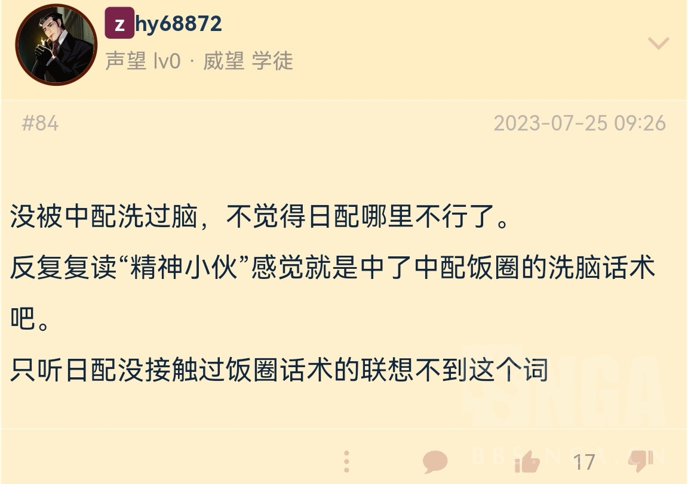

### [不吐不快]看隔壁钟离配音贴有个疑惑

Made by ngapost2md (c) ludoux [GitHub Repo](https://github.com/ludoux/ngapost2md)

----

##### 0.[0] \<pid:0\> 2023-07-25 10:50:30 by 咸鱼6666668
钟离中配现在因为嗓音问题，棒读，在活动中表现确实一言难尽，但是帖子里大量夸夸日配，并且只要表示日配不合适就是饭圈拉踩是什么逻辑？这什么饭圈逻辑，不喜欢a就是b吹？
最后可以推荐几个觉得日配演绎的比其它三国出色的片段吗？
最后叠甲：对日配前野本人没有意见。

----

##### 1.[0] \<pid:704716550\> 2023-07-25 10:54:13 by 零点，陈彬
我的话大概就是日配本身的声线不适合钟离，但是三年来还是有在进步的，但是日文的台词比起中文读的就很奇怪。。。可能是翻译问题吧我个人更觉得韩配好一点，感谢月亮计划，我不反感韩配就是从那里开始的

----

##### 2.[0] \<pid:704716976\> 2023-07-25 10:55:39 by 今锁朱楼
我本人用日配，偶尔换中配。
不是钟厨。
个人体验是最近的一些钟离剧情都不怎么行，前野声音还是太年轻压不太住人设，中配嗓子有点问题。

----

##### 3.[0] \<pid:704718036\> 2023-07-25 10:59:37 by dfpvml
日配真不如隔壁瓦尔特

不过比起神子的日配那还是好多了

----

##### 4.[2] \<pid:704722020\> 2023-07-25 11:14:20 by ritsukaalter
这个其实挺好理解听惯了中配的听不惯日配，听惯了日配的觉得日配就挺好。
顺便你说的那个什么饭圈，这个应该是有一定的pstd在里面的毕竟日配嘛人人喊打，正常骂日配也都是要带一句中配的优点，比如中配的钟离更符合那个沉稳的人设。但事实是日配玩家可能压根对钟离就不是这个认知。所以你问他们日配配的更好的地方，就算他们说出来，也绝对达不到喜欢中配玩家的预期角色认知不一样，中配眼中的缺点可能是日配眼中的优点。
顺带一提，个人认为中配钟离之所以封神，原因之一就是钟离这个性格和中文配音(整体)平稳/情感起伏不大的特点是相通的，所以也是只有中文能配出来这个味儿。假如你让日配钟离配出平稳的感觉，说实话那个句式加上cv那个音色，我是真脑补不出来。

----

##### 5.[0] \<pid:704727693\> 2023-07-25 11:35:12 by 顾止淮
我也想说吹日配的省省，不合适就是不合适，调整了三年依旧是精神小伙，日配是年轻的钟离一直以来没完没了，那他配的是年轻的钟离吗？我凭什么给这个特权忍受，怎么了年轻钟离跟现在钟离不是一个人？
日配最大的问题是台词，台词完全没有敬语，他无论怎么配都注定跟钟离这个人本身的人设背道而驰

----

##### 6.[1] \<pid:704732688\> 2023-07-25 11:55:11 by 午吃饱晚吃少
别说什么年轻时的暴躁摩拉克斯，若陀龙王剧情里明确说“你还是和以前一样”，配得不合适不是说前野水平不够，但如此找借口和护中配阳康有什么区别？

----

##### 7.[0] \<pid:704738192\> 2023-07-25 12:19:51 by zzwscc
感觉日配不如韩配韩配真的很对味 只不过输在韩语难听了

----

##### 8.[0] \<pid:704738816\> 2023-07-25 12:22:56 by 孤灯予身后
其实刚开始的时候觉得帝君配音还是可以的，但是三年下来隔壁游戏的中配突飞猛进到吊打其他语种的配音，再回过头来看原神就觉得实在是不太得劲

----

##### 9.[1] \<pid:704740204\> 2023-07-25 12:29:15 by 咸鱼6666668
>[jump](#pid704727693) 顾止淮(2023-07-25 11:35) 说: 
>
>我也想说吹日配的省省，不合适就是不合适，调整了三年依旧是精神小伙，日配是年轻的钟离一直以来没完没了，那他配的是年轻的钟离吗？我凭什么给这个特权忍受，怎么了年轻钟离跟现在钟离不是一个人？传说一配的像霸道总裁，传说二完全接不住对手戏，两个常驻剧情一个比一个差
>并且日配最大的问题其实是台词，台词完全没有敬语，他无论怎么配都注定跟钟离这个人本身的人设背道而驰，那群吹的人知道扇底春秋他米的翻译把“岩王帝君手艺不精雕不出如此精美的作品”  翻译成“岩王帝君手艺差所以作品不精美”吗

是的，翻译问题一大堆，翻译错误和理解错误，演员也很坦诚说自己对角色理解错误了，这是怎么都圆不了的问题，再加上日语音节过多，说话为了赶时间显得非常急促，这次海灯节同样也是这个问题，而这次海灯韩配表现好了很多(所以我下了韩配，生日信也很好)没有了那种急促的感觉。
而且在那楼里，我说日配不喜欢不贴不合适之后，还陈述了一大堆理由，完了反手一个说别人饭圈x吹，也死活举不出日配比其它三国演绎的更优秀更好的片段。

----

##### 10.[0] \<pid:704740974\> 2023-07-25 12:32:55 by 零点，陈彬
>[jump](#pid704740204) 咸鱼6666668(2023-07-25 12:29) 说: 
>
>是的，翻译问题一大堆，翻译错误和理解错误，演员也很坦诚说自己对角色理解错误了，这是怎么都圆不了的问题，再加上日语音节过多，说话为了赶时间显得非常急促，这次海灯节同样也是这个问题，而这次海灯韩配表现好了很多(所以我下了韩配，生日信也很好)没有了那种急促的感觉。
>而且在那楼里，我说日配不喜欢不贴不合适之后，还陈述了一大堆理由，完了反手一个说别人饭圈x吹，也死活举不出日配比其它三国演绎的更优秀更好的片段。

日语语言方面吃了大亏，音节太多，节奏又不能更改，再加上翻译错误和理解错误，录音不修正的话钟离日配真的难绷

----

##### 11.[0] \<pid:704744262\> 2023-07-25 12:49:38 by 咸鱼6666668
>[jump](#pid704722020) ritsukaalter(2023-07-25 11:14) 说: 
>
>这个其实挺好理解听惯了中配的听不惯日配，听惯了日配的觉得日配就挺好。
>顺便你说的那个什么饭圈，这个应该是有一定的pstd在里面的毕竟日配嘛人人喊打，正常骂日配也都是要带一句中配的优点，比如中配的钟离更符合那个沉稳的人设。但事实是日配玩家可能压根对钟离就不是这个认知。所以你问他们日配配的更好的地方，就算他们说出来，也绝对达不到喜欢中配玩家的预期角色认知不一样，中配眼中的缺点可能是日配眼中的优点。
>顺带一提，个人认为中配钟离之所以封神，原因之一就

没错，这个很早就有人讨论过了，钟离在外网的同人形象差异，这个在主版应该没有被隐藏，大多数认同的是：钟离形象差异就是各国配音演员差异，同是也认为韩国太太同人里的钟离是最接近的国内的(当然也不排除朝鲜半岛受大陆文化影响比较深，文化壁垒没日本欧美那么大)
所以在那个让钟离粉丝评价的楼里，日配居然呼声这么高，还上升到反对的都是饭圈，我真的很匪夷所思，就算不是钟离粉丝评价，就随便在任何平台开个帖，问四国哪个角色配的好，我说实话很少看到有人推日配钟离的

----

##### 12.[0] \<pid:704745958\> 2023-07-25 12:58:31 by 清明上核图
因为现在骂中配的下限就是日配的上限，每次骂中配都有日配粉趁机跳出来吹，从前野敬业吹到前野有厨力，问就是“听习惯了”声优粉死远点谢谢

----

##### 13.[0] \<pid:704763618\> 2023-07-25 14:29:49 by 爱吃peach
为什么不和英配韩配一起比呢？中日英韩，四国配音，哪个钟离偏差最大，不就是哪个理解最有问题吗？

----

##### 14.[0] \<pid:704763876\> 2023-07-25 14:31:05 by 爱吃peach
我觉得语言吃亏是韩配啊，你见其他日配因为日语吃亏吗>[jump](#pid704740974) 零点，陈彬(2023-07-25 12:32)说:
>[quote][pid=704740204,37127810,1]Reply[/pid] <b>Post by [uid=64809375]咸鱼6666668[/uid] (2023-07-25 12:29):</b>  是的，翻译问题一大堆，翻译错误和理解错误，演员也很坦诚说自己对角色理解错误了，这是怎么都圆不了的问题，再加上日语音节过多，说话为了赶时间显得非常急促，这次海灯节同样也是这个问题，而这次海灯韩配表现好了很多(所以我下了韩配，生日信也很好)没有了那种急促的感觉。 而且在那楼里，我说日配不喜欢不贴不合适之后，还陈述了一大堆理由，完了反手一个说别人饭圈x吹，也死活举不出日配比其它三国演绎的更优秀更好的片段。[/quote]日语语言方面吃了大亏，音节太多，节奏又不能更改，再加上翻译错误和理解错误，录音不修正的话钟离日配真的难绷[s:ac:哭笑][s:ac:哭笑]

----

##### 15.[0] \<pid:704764824\> 2023-07-25 14:35:30 by 月宫的牧羊人C
中配日配一对垃圾就别乌鸦嫌猪黑了吧

----

##### 16.[0] \<pid:704765176\> 2023-07-25 14:37:13 by 零点，陈彬
>[jump](#pid704763876) 爱吃peach(2023-07-25 14:31) 说: 
>
>我觉得语言吃亏是韩配啊，你见其他日配因为日语吃亏吗

韩配是语言认知度低日配实在是发展的太久了

----

##### 17.[0] \<pid:704765509\> 2023-07-25 14:38:45 by 色胚茄子
感觉前野就不适合配钟离，他那把声音在我脑子里的印象就是阳光开朗大男孩
~~我记忆中他配别的角色也是，特别端着，尤其是钟离这种不属于阳光开朗大男孩类型的，有点用力过猛~~
但是日配整体确实有不少吹的，习惯就好

----

##### 18.[0] \<pid:704766376\> 2023-07-25 14:42:55 by RainSola24
我去，这也开岁，那帖子不是从第一页开始就车日配吗？统一风向为中配现在虽然不行，但也不是垃圾日配能碰瓷的，后面几页出现几个为日配抱不平的(包括我)不是也统统被你们骂CJB了吗
怎么这也粉随正主啊，这真的得说鉴定为
“玩原神玩的”

----

##### 19.[1] \<pid:704767303\> 2023-07-25 14:47:02 by 月宫的牧羊人C
也别说前野配的是年轻钟离了，不会有人觉得钟离年轻时候是什么阳光开朗大男孩精神小伙吧不会吧
另外中配也没好到哪去，我就不说那杨康一样的咯痰嗓多难听了，沉稳不等于棒读，情绪起伏不大不等于没有情绪
日配中配一个完全不适配一个业务能力极差，韩语又实在适应不来，钟离倒八辈子霉一个能听的配音都没有

----

##### 20.[1] \<pid:704767803\> 2023-07-25 14:49:23 by narozx
>[jump](#pid704766376) RainSola24(2023-07-25 14:42)说:
>我去，这也开岁，那帖子不是从第一页开始就车日配吗？统一风向为中配现在虽然不行，但也不是垃圾日配能碰瓷的，后面几页出现几个为日配抱不平的(包括我)不是也统统被你们骂CJB了吗 怎么这也粉随正主啊，这真的得说鉴定为 “玩原神玩的”  都在里茶了，我建议你们去冲MHY，让他别在四国语言前瞻都放上日配这种垃圾了

“打抱不平”

这话到底是在打抱不平，还是堵嘴钟离厨？甚至前面的人已经把为什么不喜欢日配的原因列出一二三条来了，到底是谁在强词夺理一上来就攻击别人？

----

##### 21.[0] \<pid:704768107\> 2023-07-25 14:50:50 by 翻糖哔哔机
两坨答辩互殴对方是答辩

----

##### 22.[1] \<pid:704768206\> 2023-07-25 14:51:14 by 卯景苏乙施宋
我说你们都别打谁好谁坏了，给一个换声优的机会你说换不换吧都烂！

----

##### 23.[1] \<pid:704768482\> 2023-07-25 14:52:22 by 咸鱼6666668
>[jump](#pid704766376) RainSola24(2023-07-25 14:42) 说: 
>
>我去，这也开岁，那帖子不是从第一页开始就车日配吗？统一风向为中配现在虽然不行，但也不是垃圾日配能碰瓷的，后面几页出现几个为日配抱不平的(包括我)不是也统统被你们骂CJB了吗
>怎么这也粉随正主啊，这真的得说鉴定为
>“玩原神玩的”
>
>都在里茶了，我建议你们去冲MHY，让他别在四国语言前瞻都放上日配这种垃圾了

那个帖子又没删，一大堆人推日配，还把别人说成是饭圈，原话“后面怎么还车起日配了”抨击中xx，我寻思着我也没在那为现在的中配洗吧。
最后您能演点好的，&quot;粉随正主”又开始爆典，饭圈把你腌入味了吗？

----

##### 24.[1] \<pid:704769353\> 2023-07-25 14:56:08 by 顾止淮
>[jump](#pid704740204) 咸鱼6666668(2023-07-25 12:29) 说: 
>
>是的，翻译问题一大堆，翻译错误和理解错误，演员也很坦诚说自己对角色理解错误了，这是怎么都圆不了的问题，再加上日语音节过多，说话为了赶时间显得非常急促，这次海灯节同样也是这个问题，而这次海灯韩配表现好了很多(所以我下了韩配，生日信也很好)没有了那种急促的感觉。
>而且在那楼里，我说日配不喜欢不贴不合适之后，还陈述了一大堆理由，完了反手一个说别人饭圈x吹，也死活举不出日配比其它三国演绎的更优秀更好的片段。  
>最后不是aoe整个日配，也不是上升cv本人，只是针对日配钟离演绎问题。日配很多我都喜欢，温迪

日配的配音表现如果不是角色理解问题，那就是演技问题，因为他是四国配音里突出的人设不统一，别的配音可能是配音风格，但是日配不是

----

##### 25.[0] \<pid:704769837\> 2023-07-25 14:58:10 by ritsukaalter
>[jump](#pid704744262) 咸鱼6666668(2023-07-25 12:49) 说: 
>
>没错，这个很早就有人讨论过了，钟离在外网的同人形象差异，这个在主版应该没有被隐藏，大多数认同的是：钟离形象差异就是各国配音演员差异，同是也认为韩国太太同人里的钟离是最接近的国内的(当然也不排除朝鲜半岛受大陆文化影响比较深，文化壁垒没日本欧美那么大)
>所以在那个让钟离粉丝评价的楼里，日配居然呼声这么高，还上升到反对的都是饭圈，我真的很匪夷所思，就算不是钟离粉丝评价，就随便在任何平台开个帖，问四国哪个角色配的好，我说实话很少看到有人推日配钟离的

这个，怎么说呢你在国内的平台问的话，肯定是中配好的多。我前面也说过了，这个配音不仅是cv理解，可能还涉及到当地玩家的喜好问题，汝之砒霜彼之蜜糖。不过我也没做过调查，也不太能确定外国人是更喜欢中配还是日配了但看二创等推测可能还真是会喜欢日配

----

##### 26.[0] \<pid:704770402\> 2023-07-25 15:00:49 by 七月七日长生殿-
现在来看是韩英大于中日吧。日语老是用年轻的岩王帝君来找补，但是他以前不也是这个样子吗……

----

##### 27.[0] \<pid:704770800\> 2023-07-25 15:02:32 by 咸鱼6666668
>[jump](#pid704768206) 卯景苏乙施宋(2023-07-25 14:51) 说: 
>
>我说你们都别打谁好谁坏了，给一个换声优的机会你说换不换吧都烂！

在那楼里发表日配并不合适的观点，被说成中xx洗脑，实在有些难泵。最主要的是这些还是高赞，所以想单开个楼让安利几个日配钟离比其它三国优秀出色的片段来实际证明一下，现在你也看到了，过来打滚滑坡的有了，还是举不出具体哪个片段比其它三国要好(我说的不止中配，是三国语音，所以别把别人说成中xx了)

----

##### 28.[1] \<pid:704771182\> 2023-07-25 15:04:08 by narozx
我真的不吐不快了，对于钟离厨(不敢代表全员，就我见过的大多数)对中日韩英四国的配音都是不满意的，彭博现在尤其拉胯骂的最多，不代表其他国家的配音就可以被别人堵嘴“配的很好你们不理解”“这就是年轻时候的钟离”，两坨屎还分什么谁香谁臭？而且我真搞不懂为什么有些人觉得车日配就是在捧中配，中英韩三国的配音都是往沉稳青年(英配是老年)方向走的吧，怎么不说是英配韩配的饭圈粉呢？

----

##### 29.[0] \<pid:704771453\> 2023-07-25 15:05:18 by 咸鱼6666668
>[jump](#pid704769837) ritsukaalter(2023-07-25 14:58) 说: 
>
>这个，怎么说呢你在国内的平台问的话，肯定是中配好的多。我前面也说过了，这个配音不仅是cv理解，可能还涉及到当地玩家的喜好问题，汝之砒霜彼之蜜糖。不过我也没做过调查，也不太能确定外国人是更喜欢中配还是日配了但看二创等推测可能还真是会喜欢日配

其实有讨论，霓虹地区肯定只听日配，其它地区的看法，怎么说呢，类似于枫丹大法官的争议

----

##### 30.[0] \<pid:704771677\> 2023-07-25 15:06:25 by 这个西瓜好甜
吹日配的省省吧 不如和我一样选择润韩配，音色真的好听

----

##### 31.[0] \<pid:704771920\> 2023-07-25 15:07:34 by 逢河牧野0v0
两坨答辩一定要争哪一个更好吃吗

----

##### 32.[1] \<pid:704772421\> 2023-07-25 15:10:04 by SangriaNova
>[jump](#pid704769837) ritsukaalter(2023-07-25 14:58) 说: 
>
>这个，怎么说呢你在国内的平台问的话，肯定是中配好的多。我前面也说过了，这个配音不仅是cv理解，可能还涉及到当地玩家的喜好问题，汝之砒霜彼之蜜糖。不过我也没做过调查，也不太能确定外国人是更喜欢中配还是日配了但看二创等推测可能还真是会喜欢日配

有没有可能你这个因果关系就反了，当地玩家的喜好一方面是刻板印象一方面是配音塑造的，配音不去消解刻板印象还加深？

----

##### 33.[1] \<pid:704772453\> 2023-07-25 15:10:10 by narozx
>[jump](#pid704771920) 逢河牧野0v0(2023-07-25 15:07)说:
>两坨答辩一定要争哪一个更好吃吗[s:ac:哭笑]

有没有一种可能，这个帖子的本意是疑惑为什么大家骂两坨屎的时候会有一批人出来说他们觉得其中一坨味道不错，并且把不爱吃的人批判成喜欢另一坨的饭圈粉

----

##### 34.[1] \<pid:704773069\> 2023-07-25 15:12:56 by 咸鱼6666668
>[jump](#pid704771920) 逢河牧野0v0(2023-07-25 15:07) 说: 
>
>两坨答辩一定要争哪一个更好吃吗

你可别说日配是答辩了，小心说你中配饭圈洗脑，粉随正主，玩原神玩的。
最后就算认为x配不好的还是建议说出几条一二三吧，纯攻击没有意思。

----

##### 35.[1] \<pid:704773130\> 2023-07-25 15:13:11 by 小红薯看起来好吃
不是骂其中一个另一个就好的，我车目前中配垃圾不代表我觉得日配就好要是中配日配打包一起走我举双手双脚赞成

----

##### 36.[1] \<pid:704773274\> 2023-07-25 15:13:47 by 猜你想看
日配语言吃亏就是天大的笑话，都二次元了还不接受日语啊
韩配才是真的被语言拖后腿，声线贴脸，演技合格，除了战斗语音哼哼哈嘿那几下稍微出戏没有大问题
但是呢 ，推荐韩配立刻就有人冲上来西八语难听受不了，对不起我更受不了的还是烂配音
中配日配的cv和腿毛能不能打包滚

----

##### 37.[0] \<pid:704774074\> 2023-07-25 15:17:33 by 没朋友的自闭人
俩都不咋地，建议找米哈游，让米哈游把中日都换了

----

##### 38.[1] \<pid:704774192\> 2023-07-25 15:18:05 by 安希雅_R4
日配其实就是他们配导或者运营有自己的理解，给角色新作了一个人设。

----

##### 39.[0] \<pid:704774335\> 2023-07-25 15:18:35 by Fabulous64
当想要干死原u的时候当然是吹英配最好啊可以直接一转对面English poor然后攻击本人的受教育程度
什么？你说英配不行？那是你英语不好，英语都听不懂怎么敢评价配音的好坏，我告诉你这个地方用词有多高级……
~~啥？你问我用哪国配音？我开的韩语思密达~~

----

##### 40.[0] \<pid:704774472\> 2023-07-25 15:19:10 by 零点，陈彬
>[jump](#pid704773274) 猜你想看(2023-07-25 15:13) 说: 
>
>日配语言吃亏就是天大的笑话，都二次元了还不接受日语啊
>韩配才是真的被语言拖后腿，声线贴脸，演技合格，除了战斗语音哼哼哈嘿那几下稍微出戏没有大问题
>但是呢 ，推荐韩配立刻就有人冲上来西八语难听受不了，对不起我更受不了的还是烂配音
>中配日配的cv和腿毛能不能打包滚

我说吃亏一方面是配音节奏和翻译问题以及理解问题结合到一起的，造成误解很抱歉

----

##### 42.[0] \<pid:704774853\> 2023-07-25 15:20:49 by 这个西瓜好甜
>[jump](#pid704773274) 猜你想看(2023-07-25 15:13) 说: 
>
>日配语言吃亏就是天大的笑话，都二次元了还不接受日语啊
>韩配才是真的被语言拖后腿，声线贴脸，演技合格，除了战斗语音哼哼哈嘿那几下稍微出戏没有大问题
>但是呢 ，推荐韩配立刻就有人冲上来西八语难听受不了，对不起我更受不了的还是烂配音
>中配日配的cv和腿毛能不能打包滚

我真的好喜欢韩配钟离的音色，温润贵气，优雅温柔。听起来就是那种有阅历有内涵的贵公子的感觉。就是吃了语言的亏，要是彭博有这种声线，钟离身上的烂梗能少一半。
日配我都懒得评价

----

##### 43.[0] \<pid:704775481\> 2023-07-25 15:23:28 by 猜你想看
>[jump](#pid704774853) 这个西瓜好甜(2023-07-25 15:20)说:
>[quote][pid=704773274,37127810,2]Reply[/pid] <b>Post by [uid=60087297]猜你想看[/uid] (2023-07-25 15:13):</b>  日配语言吃亏就是天大的笑话，都二次元了还不接受日语啊 韩配才是真的被语言拖后腿，声线贴脸，演技合格，除了战斗语音哼哼哈嘿那几下稍微出戏没有大问题 但是呢 ，推荐韩配立刻就有人冲上来西八语难听受不了，对不起我更受不了的还是烂配音 中配日配的cv和腿毛能不能打包滚[/quote]我真的好喜欢韩配钟离的音色，温润贵气，优雅温柔。听起来就是那种有阅历有内涵的贵公子的感觉。就是吃了语言的亏，要是彭博有这种声线，钟离身上的烂梗能少一半。[s:ac:哭笑] 日配我都懒得评价

米不是有ai吗 真的很想把韩配声线用ai换成中文 不知道有生之年有没有这个可能性

----

##### 44.[0] \<pid:704776699\> 2023-07-25 15:28:55 by ritsukaalter
>[jump](#pid704772421) SangriaNova(2023-07-25 15:10) 说: 
>
>有没有可能你这个因果关系就反了，当地玩家的喜好一方面是刻板印象一方面是配音塑造的，配音不去消解刻板印象还加深？

有可能，毕竟我也没调查过。但是假如刻板印象就能获得好评的话，为什么要消解呢。

----

##### 45.[0] \<pid:704778844\> 2023-07-25 15:37:43 by 万俟御k
本钟离厨看法是，韩配可以，中配原先可以现在拉胯，英配日配从头到尾都没有理解角色。最而且我喜欢的又不是声音，大不了静音，反正每年也就海灯节蹭几句台词

----

##### 46.[1] \<pid:704782185\> 2023-07-25 15:51:33 by SangriaNova
>[jump](#pid704776699) ritsukaalter(2023-07-25 15:28) 说: 
>
>有可能，毕竟我也没调查过。但是假如刻板印象就能获得好评的话，为什么要消解呢。

这还需要调查吗，你对角色的看法不需要剧情塑造的话会不会太肤浅了

不知道钟离在外网的刻板印象是什么样说明你本来也不关心，建议少评论别人喜欢的角色的配音吧

