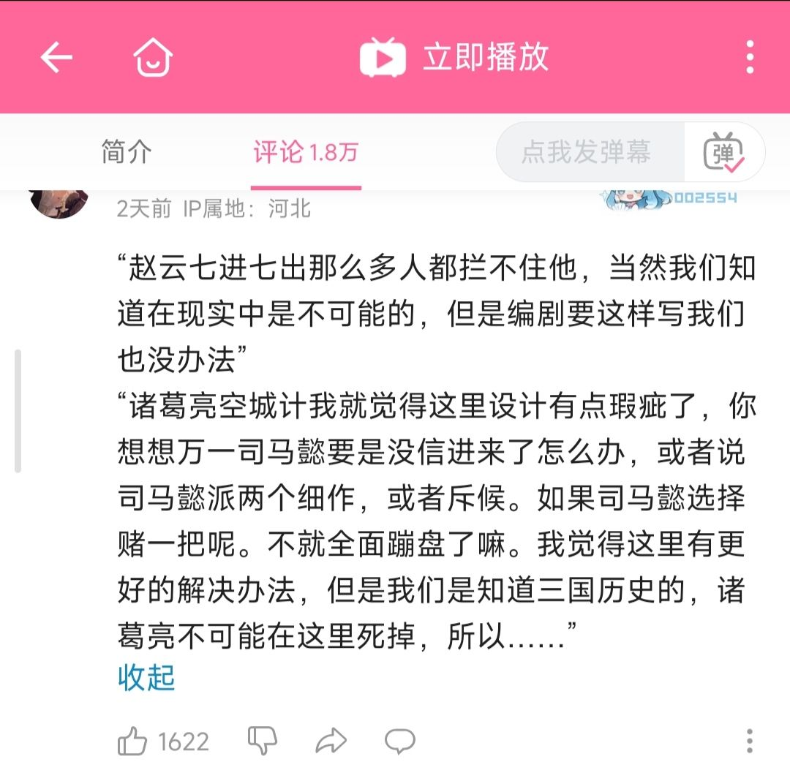

### [热点事件]这是罗贯中被黑得最狠的一次

Made by ngapost2md (c) ludoux [GitHub Repo](https://github.com/ludoux/ngapost2md)

----

##### 0.[0] \<pid:0\> 2023-07-25 11:41:43 by 肖学家
选自牌佬锐评的评论区，全肯定民把原神文案类比为《三国演义》，认为纠结原神文案的逻辑是抬杠，后面大量复制黏贴全自动复读

----

##### 1.[2] \<pid:704730591\> 2023-07-25 11:46:20 by 白开水巨好喝
就剧情来解释是这样的。
赵云七进七出是曹操下令要抓活的。
诸葛亮空城计是因为诸葛亮一生不犯险，让司马懿觉得事出反常必有妖。

现在轮到米哈游来跟我解释为什么一个没能量没智慧也不能打的废物能坐上所谓神的位置？为什么一个灭人满门发泄的杀人犯能保送进学校？
解释不让人信服米哈游你马必死。

