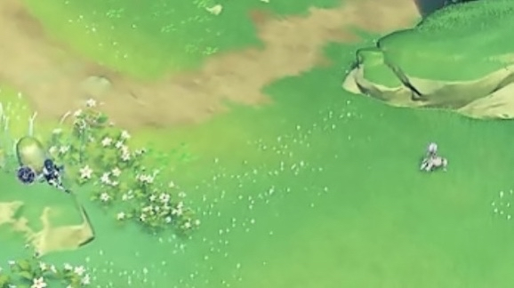
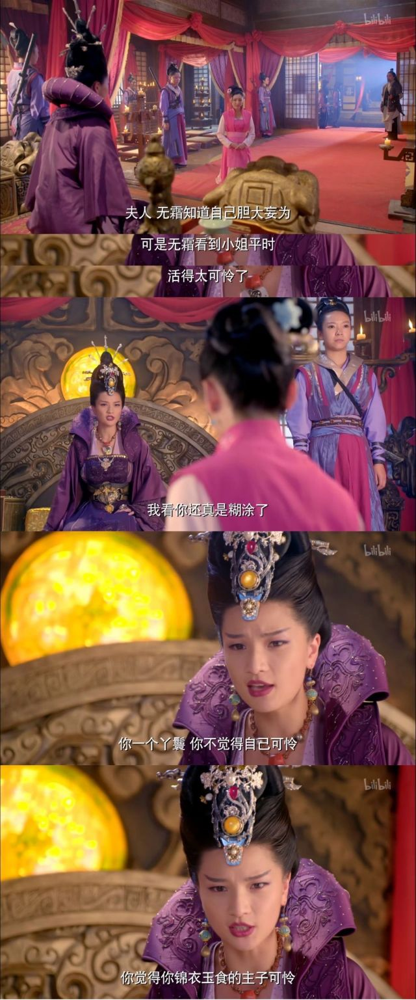

### [不吐不快]从商业角度来看，把草神垫给散兵，算是一个优秀的决策么？

Made by ngapost2md (c) ludoux [GitHub Repo](https://github.com/ludoux/ngapost2md)

----

##### 0.[1] \<pid:0\> 2023-07-25 22:07:17 by fealib
现在两位嘉宾的首up和初次复刻都有了
应该可以开始讨论了

----

##### 1.[0] \<pid:704864509\> 2023-07-25 22:07:53 by 白浪梅
嗯？这还用讨论

----

##### 2.[19] \<pid:704864758\> 2023-07-25 22:08:53 by TTorena
当然，我们的游戏在蒸蒸日上

----

##### 3.[9] \<pid:704864804\> 2023-07-25 22:09:06 by AkariYu3310
根据需求层次论 现在是自我实现的阶段 这些东西是金钱不可以直接买到的

----

##### 4.[9] \<pid:704864870\> 2023-07-25 22:09:22 by 九叶喵
有没有一种可能，那些文案甚至没觉得自己把角色垫了，而是觉得自己把谁都写的有血有肉这帮玩家怎么就这么没品味呢

----

##### 6.[6] \<pid:704864967\> 2023-07-25 22:09:41 by wzdlc
对mhy，员工爽了，算
对我，持续爆典还省钱，算

那必然是好决策啊

----

##### 7.[1] \<pid:704864977\> 2023-07-25 22:09:43 by 水幻形
很优秀，优秀就优秀在让原神的流水大跌特跌

----

##### 8.[2] \<pid:704864979\> 2023-07-25 22:09:43 by 冷泠棱凌
我要是纳西妲，我知道世界之外有那么一群人按着我的头让我叫“阿帽亲”让我笑眯眯地审他论文陪他在郊外摸鱼睡觉，我高低是想动用我的全能把那群傻逼的脑子打开来看看里面装着什么样的核废水的。

----

##### 9.[0] \<pid:704865059\> 2023-07-25 22:10:05 by 飘雪菌
我记得早就讨论过了，而且正常人来看也根本不划算吧，你看看现在什么情况

----

##### 10.[0] \<pid:704865133\> 2023-07-25 22:10:23 by 给我七天光明
我觉得是，建议其他立刻联动崩坏，正好我们李编剧看起来也很喜欢这种人设

----

##### 11.[0] \<pid:704865182\> 2023-07-25 22:10:37 by Adrammelech
散兵何止垫进去一个草神，整个原神截至3.2的生机勃勃万物竞发都被打断了

----

##### 12.[0] \<pid:704865254\> 2023-07-25 22:10:55 by 药师鬼
人家内部爽了就够了，我们只是play的一环

----

##### 13.[1] \<pid:704865267\> 2023-07-25 22:10:59 by 子柃子柃
对玩家而言不是可支配的钱变多了，不是好事吗

----

##### 14.[1] \<pid:704865365\> 2023-07-25 22:11:26 by 今锁朱楼
我要是大伟哥今晚就把提这个建议的人突突了

----

##### 15.[2] \<pid:704865417\> 2023-07-25 22:11:38 by uftbr
草神正常流水参考雷神，三次100h起步(第一次就过了100h)

如果草一草二按照叉子哥说的写(草一兰纳罗，草二携小队救草龙)第二次有机会150h，

散兵60h+个位数，它这套技能给女角色起码两次60h起步

----

##### 16.[1] \<pid:704865455\> 2023-07-25 22:11:47 by 罗一川
绝对是优秀决策，直接帮我省钱了

----

##### 17.[3] \<pid:704865458\> 2023-07-25 22:11:47 by 感恩戴德真君
这很重要吗。
应该只有你这种草神厨会在意吧。

----

##### 18.[0] \<pid:704865485\> 2023-07-25 22:11:54 by 纳西妲的小秋千
你们都错了。不喜欢散宝的人，品味素养都十分低劣，自然会受不了地离开质量优秀的原神。
反之，留下来的玩家，品味都十分的高雅，但是数量当然会少很多，然而这才是米哈游真正想要的核心用户。
短暂的几个月流水变化看不出什么，还是要看新国家的流水才能知道。流水越少，说明留下来的玩家越忠诚，这才是米哈游真正想要的。

----

##### 19.[1] \<pid:704865493\> 2023-07-25 22:11:56 by 迷你靓仔
米的操作和脑回路根本不是正常人能理解的
应该问问猛干哥是怎么想的

----

##### 20.[0] \<pid:704865566\> 2023-07-25 22:12:15 by 泛舟浮白
问就是蒸蒸日上

----

##### 21.[1] \<pid:704865817\> 2023-07-25 22:13:28 by 冉指流水
你散和散解就是个祸害什么？你说mhy也是散解(割)，那没事了

----

##### 22.[0] \<pid:704865889\> 2023-07-25 22:13:45 by 岁晚云绮
很优秀，蒸馍，你不扶器

----

##### 23.[1] \<pid:704866030\> 2023-07-25 22:14:26 by jrbzero
草神的PV、萝莉身材、2.8海岛说中诉说自己是笼中之鸟、3.0-3.2的剧情。无一不是在极力的激起玩家的保护欲。
当初万众声讨大贤者的盛况还历历在目，可以说是好的不能再好的开局了。
而沾上其他后竟然把这一切都毁了，不知怎么还有点佩服米忽悠。

----

##### 24.[0] \<pid:704866267\> 2023-07-25 22:15:38 by La da
从商业角度看优菈不复刻不补强不给剧情占位六十爆伤拐埋掉优菈是正确的吗？

但凡把角色玩家甚至于说把钱当个钱都干不出来这些事。

----

##### 25.[0] \<pid:704866709\> 2023-07-25 22:17:35 by 小鸽白尼
何止，我还看他准备把原都垫给崩铁了
假以时日那个国产手游饼图说不定都要重画了太乐了

----

##### 26.[1] \<pid:704866906\> 2023-07-25 22:18:32 by 宣无邪
我愿称之为手游历史上里程碑式的优秀，在友商绞尽脑汁都想不到要怎么才能把原的势头摁下去的情况下，他们来了个大义灭亲，自我了断，对营商环境做出了不可磨灭的贡献，团结了友商，促进了徐汇区写字楼的和谐发展。

----

##### 27.[0] \<pid:704867208\> 2023-07-25 22:19:56 by tenmouses
我想起以前在昆虫记里看过一种蜜蜂，他会先用细腻的泥土构筑好精巧的蜂巢，然后随便拿烂泥往外面糊上去

----

##### 28.[0] \<pid:704867411\> 2023-07-25 22:20:53 by skyandevil
内部嗑爽了，玩家省钱了，里版吃瓜吃爽了，流水下降了，这不是赢麻了

----

##### 29.[0] \<pid:704868121\> 2023-07-25 22:24:14 by 狐狸吃团子
我觉得捆绑推cp才是最有话题度的商业决策
看EP散散都开始守护草神了，草神宛如公主在自家花园玩耍，散散当她的随从，累了只能坐地休息，好浪漫，编剧一定欲仙欲死了

----

##### 30.[0] \<pid:704868244\> 2023-07-25 22:24:47 by お宅不是
初级文案一个月打底半狗，算上七七八八的一狗总有吧，输出一些自己喜欢的东西怎么了，不愁吃不愁穿，不发癫来不放爱，人生还有什么意思

----

##### 31.[0] \<pid:704868409\> 2023-07-25 22:25:29 by fealib
>[jump](#pid704866906) 宣无邪(2023-07-25 22:18) 说: 
>
>我愿称之为手游历史上里程碑式的优秀，在友商绞尽脑汁都想不到要怎么才能把原的势头摁下去的情况下，他们来了个大义灭亲，自我了断，对营商环境做出了不可磨灭的贡献，团结了友商，促进了徐汇区写字楼的和谐发展。

的确，我在玩3.2的时候，从未想过有一天我会因为沉迷武侠mmo而导致原神碰都不想碰

----

##### 32.[0] \<pid:704868656\> 2023-07-25 22:26:43 by 无明尽
其他友商做得到吗！？能走到今天吗！？能开创这样的局面吗！？
只有米社可以！
计划通！

----

##### 33.[0] \<pid:704868658\> 2023-07-25 22:26:43 by fealib
>[jump](#pid704868121) 狐狸吃团子(2023-07-25 22:24) 说: 
>
>我觉得捆绑推cp才是最有话题度的商业决策
>看EP散散都开始守护草神了，草神宛如公主在自家花园玩耍，散散当她的随从，累了只能坐地休息，好浪漫，编剧一定欲仙欲死了
>

这里反了，是稻妻在逃公主睡觉，草神看着他

----

##### 34.[0] \<pid:704870081\> 2023-07-25 22:34:07 by 狐狸吃团子
>[jump](#pid704868658) fealib(2023-07-25 22:26) 说: 
>
>这里反了，是稻妻在逃公主睡觉，草神看着他

草神小公主背对着荡秋千自顾自玩呢，散散是忠心侍从，站累了都只能坐地上

----

##### 35.[0] \<pid:704871807\> 2023-07-25 22:42:06 by Seebird
>[jump](#pid704865365) 今锁朱楼(2023-07-25 22:11) 说: 
>
>我要是大伟哥今晚就把提这个建议的人突突了

我要是秦始皇我就把他们都铸进十二金人里

----

##### 36.[0] \<pid:704872594\> 2023-07-25 22:45:52 by 星际量子状态中
算是一个能让策划高巢的决策，cp蟑螂就好这口捏，流水？关xxn文案啥事？

----

##### 37.[0] \<pid:704873046\> 2023-07-25 22:48:12 by sumoboss
最后一圈晃下来，我还是回到3.3之前的那个观点，就是散就应该纹丝不动的配个能用的强度塞进池子里面完事。
从改建模到后面所有乱七八糟的操作都是没必要的，做的事越多越会炸，不洗直接进受众也就是厨子，锅全给博士直接洗完……也行吧
问题是操作这么一大圈下来你说洗了吗，洗了但没成功，还物理意义上换了个人，还垫了一堆角色，还坑了主线剧情。我真的搞不懂在图什么，就很迷惑

而且……我不知道是不是错觉，就是3.2那里包括之前，我都觉得是在卖主角和散的，就对话啊，镜头啊，是有这个趋势的。而且这个卖起来是能有受众还不得罪单推的，但后面就一路转到草那里去了

