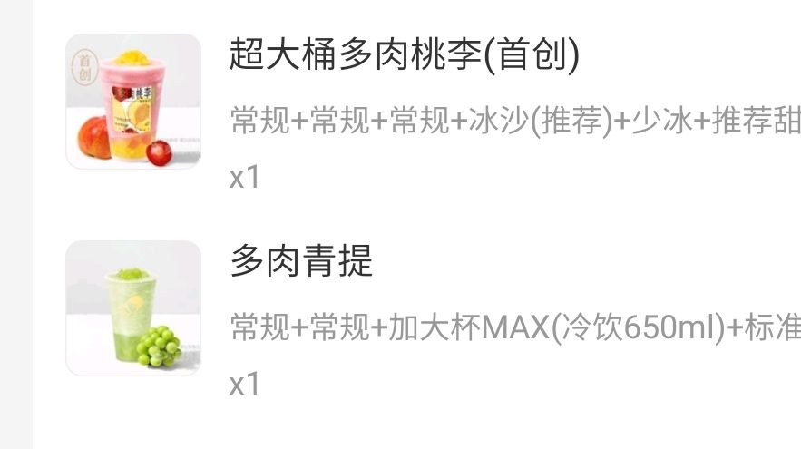
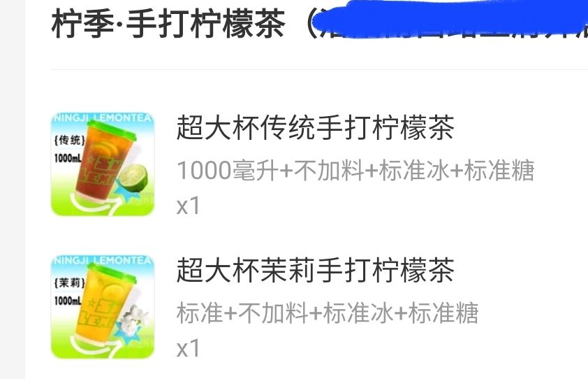

### [热点事件] 喝了豆乳玉麒麟，还有什么推荐的吗

Made by ngapost2md (c) ludoux [GitHub Repo](https://github.com/ludoux/ngapost2md)

----

##### 0.[0] \<pid:0\> 2023-07-25 22:10:27 by Jason794
看乐子太多点了杯豆乳玉麒麟，油液绫人时期就久仰大名的奶茶，结果喝完感觉挺普通的，有没有其他奶茶或者果茶的推荐

----

##### 1.[0] \<pid:704865283\> 2023-07-25 22:11:05 by 幽夜净土的大日子
都很普通 不如三块钱可乐

----

##### 2.[0] \<pid:704865537\> 2023-07-25 22:12:06 by 铃Ring
古茗的龙井香青团

----

##### 3.[0] \<pid:704865642\> 2023-07-25 22:12:37 by EmileVittorio
那当然是里版强推的铁观音奶冻啊，超好喝的

----

##### 4.[0] \<pid:704865656\> 2023-07-25 22:12:42 by 格里兹纳特
乌漆嘛黑
不额外加糖，不加小料

----

##### 5.[0] \<pid:704865658\> 2023-07-25 22:12:43 by 油门踩到底
铁观音奶冻？

----

##### 6.[0] \<pid:704865659\> 2023-07-25 22:12:43 by 给我七天光明
现在是夏天，喝冰镇西瓜汁吧。

----

##### 7.[0] \<pid:704865669\> 2023-07-25 22:12:46 by syhmlt
铁观音奶冻8错

----

##### 8.[0] \<pid:704865862\> 2023-07-25 22:13:38 by 阿猹不吃香菜
茶百道！黄金！椰椰！乌龙！去冰！三分糖！
还有喜茶和柠季

----

##### 9.[0] \<pid:704865901\> 2023-07-25 22:13:50 by Jason794
铁观音奶冻？了解了

----

##### 10.[0] \<pid:704865924\> 2023-07-25 22:13:56 by 一个没有名字的非洲咸鱼
薄荷奶绿已经成为我人生中不可或缺的一部分了

----

##### 11.[0] \<pid:704865993\> 2023-07-25 22:14:16 by 白浪梅
铁观音奶冻，
私心推荐杨枝甘露和乌漆嘛黑
不过应景的话建议一份“超级大瓜”

----

##### 12.[0] \<pid:704866038\> 2023-07-25 22:14:28 by 超音速凉面
推荐日本生可乐(宾州代发)

----

##### 13.[0] \<pid:704866073\> 2023-07-25 22:14:40 by 九五合拍
古茗 牛油果巴旦木奶昔 超绝好喝

----

##### 14.[0] \<pid:704866132\> 2023-07-25 22:14:57 by 一念の差
我也喝了，个人口感更喜欢铁观音奶冻

----

##### 15.[0] \<pid:704866342\> 2023-07-25 22:15:57 by Kurunie
古茗的爆有料大瓜椰，最近很喜欢，很清爽

----

##### 16.[0] \<pid:704866707\> 2023-07-25 22:17:35 by Rinmi-Sokukei
铁观音奶冻 我喜欢不加糖的 有茶味

----

##### 17.[0] \<pid:704868548\> 2023-07-25 22:26:09 by 迷失★光明
七分甜铁观音奶冻！

----

##### 18.[0] \<pid:704869510\> 2023-07-25 22:31:01 by derhirte
>[jump](#pid704865537) 铃Ring(2023-07-25 22:12) 说: 
>
>古茗的龙井香青团

问问什么口感 之前看了好像只有青团比较特别就没点

----

##### 19.[0] \<pid:704869548\> 2023-07-25 22:31:16 by 月宫的牧羊人C
无论哪家的杨枝甘露，目前喝过茶百道、爱丁堡阿姨、古茗家的都不错

----

##### 20.[0] \<pid:704870657\> 2023-07-25 22:36:50 by 大碗番茄炒鸡拌饭
茶百道新出的青提小青柑不错
古茗的龙井香牛乳(个人感觉龙井香青团怪怪的)和牛油果巴旦木奶昔
霸王茶姬的夏梦玫珑和寻香山茶(伯牙绝弦什么的都可以尝尝感觉每款都很好喝)
coco的新品芋泥雪冰还可以
阿水的优格寒天每星期都喝，经典口味

----

##### 21.[0] \<pid:704870883\> 2023-07-25 22:37:51 by ZFBXBD
我喝的黑砖

----

##### 22.[0] \<pid:704871093\> 2023-07-25 22:38:49 by meg1412
上次在理查看到推荐和朋友一起点了，实在太甜了，我朋友说居然说还好我估计老了

----

##### 23.[0] \<pid:704872079\> 2023-07-25 22:43:26 by Wave2000
有没有适合减脂人的人在国外，大概说下什么类型适合就好

----

##### 24.[0] \<pid:704872329\> 2023-07-25 22:44:40 by 铃Ring
>[jump](#pid704869510) derhirte(2023-07-25 22:31) 说: 
>
>问问什么口感 之前看了好像只有青团比较特别就没点

我一般点三分糖去冰 茶味比较重青团也很好吃 然后我一般会加一份白宝石会更好喝但是这个小料好像下架了

----

##### 25.[0] \<pid:704872358\> 2023-07-25 22:44:46 by giegie好坏我好爱
>[jump](#pid704869548) 月宫的牧羊人C(2023-07-25 22:31) 说: 
>
>无论哪家的杨枝甘露，目前喝过茶百道、爱丁堡阿姨、古茗家的都不错

铁观音奶冻的奶味很纯，不喜欢纯奶的不会喜欢，我建议夏天就要狂炫西瓜桶  
编辑：好像误点回复了

----

##### 26.[0] \<pid:704872601\> 2023-07-25 22:45:54 by 铃Ring
顺便再提名一个阿嬷的鲜柑青提前两天刚喝好好喝啊

----

##### 27.[0] \<pid:704872876\> 2023-07-25 22:47:19 by derhirte
>[jump](#pid704872329) 铃Ring(2023-07-25 22:44) 说: 
>
>我一般点三分糖去冰 茶味比较重青团也很好吃 然后我一般会加一份白宝石会更好喝但是这个小料好像下架了

ok 明天尝尝

----

##### 28.[0] \<pid:704873166\> 2023-07-25 22:48:43 by 十六个核桃
之前听安利喝过乌漆嘛黑和铁观音奶冻
感觉都不如三分糖去冰豆乳玉麒麟

----

##### 29.[0] \<pid:704873371\> 2023-07-25 22:49:48 by Cecilia非羽
记录下 过几天去喝

----

##### 30.[1] \<pid:704873671\> 2023-07-25 22:51:18 by AiakosG
乌漆嘛黑我投反对票
连带着那个杨梅的新品体验也不行
因为吸管太容易堵了，不使劲嘬不上来

----

##### 31.[0] \<pid:704873687\> 2023-07-25 22:51:25 by Jason794
问一下要不要加冰啊，每次加完冰到后面口味就变得很淡了，然后感觉冰还占了不少空间

----

##### 32.[0] \<pid:704873874\> 2023-07-25 22:52:25 by mithy-
我感觉还是喜茶品类口味更多而且现在也不贵了，但是开店太少

----

##### 33.[0] \<pid:704874138\> 2023-07-25 22:53:53 by 快乐莫小问
好喝的，但听说茶百道料不好

----

##### 34.[0] \<pid:704876326\> 2023-07-25 23:04:37 by 十束安良
请喝新品青提茉莉，我怀疑茶百道在里面下毒了

----

##### 35.[0] \<pid:704878481\> 2023-07-25 23:15:10 by RainforestLoe
楼主考虑绿豆冰沙吗我母校每年夏天都进货，已经喝习惯了，微甜冰凉超解暑(而且便宜适合学生党)

----

##### 36.[0] \<pid:704879909\> 2023-07-25 23:22:16 by y776942913
比起铁观音奶冻，我觉得茉香奶绿+奶冻更好喝点，不过记得一定要少糖

----

##### 37.[0] \<pid:704880105\> 2023-07-25 23:23:14 by 拿到了小孩角色卡噜
古茗龙井香青团(7分糖
茶百道铁观音奶冻(7分糖
书亦的蓝莓酸奶昔、椰椰仙草清补凉(也是7分
一点点的冰淇淋红茶去冰三分加波霸加奶霜
益禾堂龙珠奶茶、宇治抹茶/益禾烤奶+燕麦(7分
还有茶颜悦色的人间烟火，不知冬(好像是叫这个？)、筝筝纸鸢，我都挺喜欢的

----

##### 38.[0] \<pid:704880611\> 2023-07-25 23:25:52 by 火中术士会梦到电泰坦
我还是觉得麻薯玉麒麟比豆乳玉麒麟好喝！(凌人嘬奶茶.jpg)

----

##### 39.[0] \<pid:704881688\> 2023-07-25 23:31:30 by Cecilia非羽
>[jump](#pid704873687) Jason794(2023-07-25 22:51) 说: 
>
>问一下要不要加冰啊，每次加完冰到后面口味就变得很淡了，然后感觉冰还占了不少空间

我每次都选去冰 感觉冰牙+占据杯子空间实际喝到的少了 你也可以选少冰

----

##### 40.[0] \<pid:704881893\> 2023-07-25 23:32:36 by 落叶迷航
夏天，徐小包的薄荷奶绿好喝

----

##### 41.[0] \<pid:704882493\> 2023-07-25 23:35:33 by iplikm
厝内小眷村  涓豆腐奶茶。

----

##### 42.[0] \<pid:704888582\> 2023-07-26 00:09:13 by 自由干饭人
茶百道那个什么桃桃奶茶好喝，桃脆

----

##### 43.[0] \<pid:704888944\> 2023-07-26 00:11:19 by 过客型逆戟鲸
不如买整个西瓜冻好了开嗦

