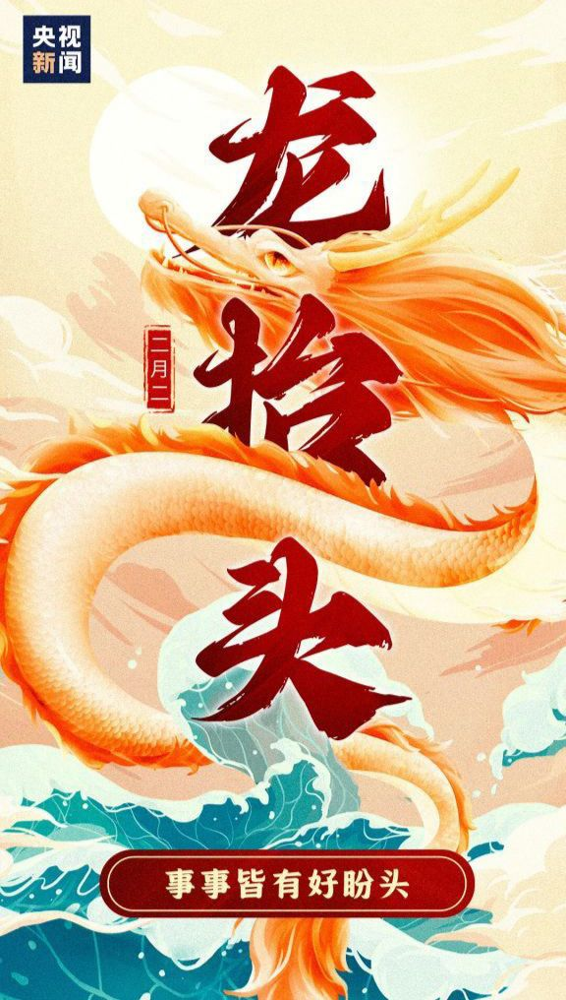
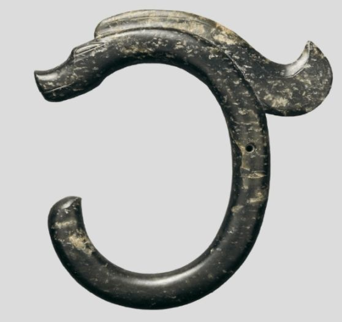
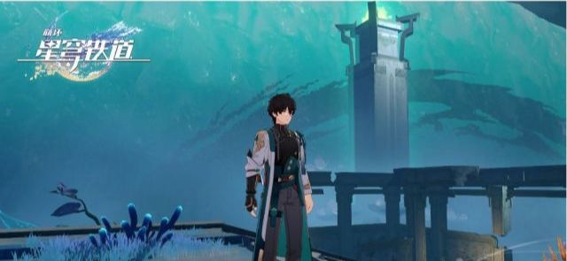
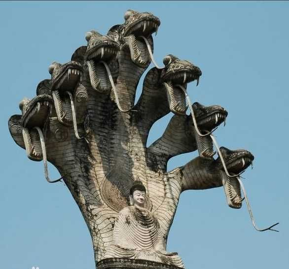

### [不吐不快]勾起火气了，水龙吟？起这名字mhy你是真不要脸啊

Made by ngapost2md (c) ludoux [GitHub Repo](https://github.com/ludoux/ngapost2md)

----

##### 0.[0] \<pid:0\> 2023-07-25 22:53:23 by 千代医
趁着今天人多，瓜也多，理查不堵嘴，正好和大家伙聊聊，隔壁版懂得都懂。

今天瓜大顺带着我火气也上来了，崩铁版水龙吟刚出的时候我就想说了，mhy你是真不要脸啊，和正版国家宝藏原创曲重名，就你m各个工作人员的冲浪玩梗程度，我不信你是不想蹭的，一蹭还蹭了个大的。
(注：我说的是歌曲名，这里不讨论诗词名)

尼玛结果还天天商单糊脸(是不是商单大家伙可以自己搜搜，真是一张封面图用到死啊，换都不带换的)，得！这下好了，至少B站前面搜出来全是崩铁版水龙吟

一想到以后一提起水龙吟，第一印象竟然是崩铁原创曲，不仅国宝版水龙吟一直有m家阴影我就膈应的慌，而且国宝版肯定还会受到ky，最后还要给别人解释取名时间线……我吐了

以后说水龙吟我还要带一个国家宝藏版的前缀，尼玛我真是服了

你m取个名字也能恶心到我，我还真是没想到，就跟你一直欣赏爱护的花被x沾到了一样恶心，尤其是这拉x的屁股还是歪的

----

##### 1.[3] \<pid:704874734\> 2023-07-25 22:56:56 by 梦一下怎么了
mhy就是爱蹭捏，水龙吟还是我很喜欢的曲子

----

##### 2.[2] \<pid:704874977\> 2023-07-25 22:58:05 by 千代医
你这宣发是真不给国宝版的一条活路啊

----

##### 3.[6] \<pid:704875019\> 2023-07-25 22:58:20 by 格里兹纳特
米的“模因污染”玩得6得一批
你现在百度搜“七七”，看看排名前5的有几个是和原神有关？
再把年限调到2020年之前，再看看排名前5。看看什么被污染了？
能成立公司的都是成年人了，避嫌不懂么。就硬蹭，做文案审核的机构也是吃干饭的

----

##### 4.[1] \<pid:704875080\> 2023-07-25 22:58:35 by 宛如珍宝的勇气
别急，双畜狂洗马上就来

----

##### 5.[0] \<pid:704875177\> 2023-07-25 22:59:04 by 其实我也不想说
其实我最早接触水龙吟是仙剑2，还有人记得吗？

----

##### 6.[0] \<pid:704875373\> 2023-07-25 22:59:54 by aa3880393
国宝版的已经做2创了，可以搜一下，就是米的画面 国宝的音乐，国宝他们自己做的

----

##### 7.[4] \<pid:704875474\> 2023-07-25 23:00:20 by hx0539
这也叫龙？没爪的不就是蛇吗应该叫水蛇什么的

----

##### 8.[0] \<pid:704875697\> 2023-07-25 23:01:29 by tbiph9277
乐，我朋友前两天还跟我喷这米哈游的水龙吟真尼玛难听，她也本来以为是国宝版的

----

##### 9.[0] \<pid:704875716\> 2023-07-25 23:01:35 by AGDer
ky啥啊，国家宝藏有个号不也是换bgm蹭吗

----

##### 10.[2] \<pid:704876182\> 2023-07-25 23:03:56 by 无料通贩商
感觉不如，印度龙

----

##### 11.[0] \<pid:704876292\> 2023-07-25 23:04:26 by 火郭 Electronica

我不知道说啥好了，国家宝藏我也挺喜欢的

----

##### 12.[0] \<pid:704876329\> 2023-07-25 23:04:38 by 嘟嘟可在哪
>[jump](#pid704875177) 其实我也不想说(2023-07-25 22:59) 说: 
>
>其实我最早接触水龙吟是仙剑2，还有人记得吗？

仙剑二开始界面经典bgm，可以说是全系列最经典的开头bgm了，崩铁这个尬穿低音的土味歌也配

----

##### 13.[1] \<pid:704876393\> 2023-07-25 23:04:55 by 千代医
>[jump](#pid704875716) AGDer(2023-07-25 23:01) 说: 
>
>ky啥啊，国家宝藏有个号不也是换bgm蹭吗

怎么？旗舰店可以代表整个节目主办方的意思了是吧，只要沾上米，我就有“双厨狂喜”的权力，那腾讯不是mhy合作伙伴吗，何来的打压啊

----

##### 14.[0] \<pid:704876551\> 2023-07-25 23:05:42 by 雾海漫游者
我就说名字很耳熟，原来是仙剑有

----

##### 15.[1] \<pid:704876596\> 2023-07-25 23:05:50 by TooruW
(水龙吟不是一个很常见的词牌名吗，即使是古风填词曲一点也不少见吧)

----

##### 16.[0] \<pid:704876601\> 2023-07-25 23:05:51 by Yau1968
。。。对角色没意见 但这凹的什么破姿势 好难看

----

##### 17.[0] \<pid:704876625\> 2023-07-25 23:05:58 by 零点，陈彬
>[jump](#pid704875177) 其实我也不想说(2023-07-25 22:59) 说: 
>
>其实我最早接触水龙吟是仙剑2，还有人记得吗？

仙剑真的好可惜

----

##### 18.[0] \<pid:704876731\> 2023-07-25 23:06:32 by 平泽唯1987
过剧情的时候，听个男的搁那唱，当场就喷了，什么几把网红烂歌

----

##### 19.[4] \<pid:704876745\> 2023-07-25 23:06:37 by 云影之离
可是水龙吟为什么叫Samudrartha啊

----

##### 20.[1] \<pid:704876947\> 2023-07-25 23:07:41 by Kadorc
好开，闪现跟了
隔壁ep曲《水龙吟》一出来我内心一咯噔，还以为你米和国家宝藏联动了，结果一看发现是蹭的
国家宝藏的《水龙吟》是我心里最经典的国风纯音乐，每次听到高潮都会为之震颤乃至感动到流泪，现在被你米这么一蹭，现在网易云上搜水龙吟已经被崩铁翻唱刷屏，再也见不到国家宝藏的影子
凭什么？
再一联想到你米吟的还是个印度龙就更搞笑了

----

##### 21.[0] \<pid:704876951\> 2023-07-25 23:07:43 by write54
崩崩开始就喜欢碰瓷营销吧
现在这个还能用宣扬中国文化堵嘴

----

##### 22.[0] \<pid:704876956\> 2023-07-25 23:07:44 by AGDer
>[jump](#pid704876393) 千代医(2023-07-25 23:04)说:
>[quote][pid=704875716,37136760,1]Reply[/pid] <b>Post by [uid=63298298]AGDer[/uid] (2023-07-25 23:01):</b>  ky啥啊，国家宝藏有个号不也是换bgm蹭吗[/quote]怎么？旗舰店可以代表整个节目主办方的意思了是吧[s:ac:茶]，只要沾上米，我就有“双厨狂喜”的权力，那腾讯不是mhy合作伙伴吗，何来的打压啊[s:ac:blink] [img]https://img.nga.178.com/attachments/mon_202307/25/l2Q2s-osiZaT1kShs-10l.jpg[/img]

既然能污染77，改个别的也是轻而易举

----

##### 23.[0] \<pid:704877024\> 2023-07-25 23:08:08 by forewan
国家宝藏的水龙吟特别大气，气势恢宏现在一搜前几个全是崩铁确实无语

----

##### 24.[0] \<pid:704877051\> 2023-07-25 23:08:18 by 千代医
>[jump](#pid704876745) 云影之离(2023-07-25 23:06) 说: 
>
>可是水龙吟为什么叫Samudrartha啊

这翻译我还忘了吐槽，瓜楼里也有科普

----

##### 25.[0] \<pid:704877078\> 2023-07-25 23:08:25 by Just  Monika
>[jump](#pid704876745) 云影之离(2023-07-25 23:06) 说: 
>
>可是水龙吟为什么叫Samudrartha啊

胆

----

##### 26.[3] \<pid:704877288\> 2023-07-25 23:09:24 by nbcsddddd
别尬黑，mhy可是国宣之光，文化输出大牛名字相同怎么了

----

##### 27.[0] \<pid:704877430\> 2023-07-25 23:10:10 by 千代医
>[jump](#pid704876745) 云影之离(2023-07-25 23:06) 说: 
>
>更心梗的是水龙吟为什么叫Samudrartha啊

m的文案确实是会翻译的

----

##### 28.[0] \<pid:704877667\> 2023-07-25 23:11:24 by bestrebecca
>[jump](#pid704875177) 其实我也不想说(2023-07-25 22:59) 说: 
>
>其实我最早接触水龙吟是仙剑2，还有人记得吗？

最喜欢仙剑配乐之一

----

##### 29.[0] \<pid:704877958\> 2023-07-25 23:12:47 by 雾霜森林
其实我觉得不用太担心，因为隔壁这个水龙吟吧……说实话没有雪国的野火契合剧情且惊艳。给人留不下深刻印象，在我这里还不如蝉喓歌有点味道只要拉个对比视频基本就会被爆杀，铺天盖地的宣发也起不到什么作用，因为即使有人被吸引进来过完主线大概率都得一脸懵逼，因为隔壁它是真的什么都没讲清楚……

----

##### 30.[0] \<pid:704878211\> 2023-07-25 23:13:56 by 临云砂
你米但凡整的中国龙再烂我也不说啥了

----

##### 31.[0] \<pid:704878367\> 2023-07-25 23:14:38 by 莱若Lyra
黄钟毁弃瓦釜雷鸣属于是

----

##### 32.[1] \<pid:704878428\> 2023-07-25 23:14:56 by 子沙岑辰车丁
可能我比较传统吧，米哈游的国风是我最不能接受的，蹭的太低级，偏偏还吸引了一大堆低龄玩家

----

##### 33.[0] \<pid:704878662\> 2023-07-25 23:16:01 by eciul53220
我很喜欢水龙吟……
关大洲属于比较偏爱的国风音乐人
他的长空非常适合双人花滑
以及崩铁音乐比不上他一点

----

##### 34.[2] \<pid:704878787\> 2023-07-25 23:16:39 by tsqtt
>[jump](#pid704874977) 千代医(2023-07-25 22:58) 说: 
>
>你这宣发是真不给国宝版的一条活路啊
>
>

这个封面还这么丑据说这是星铁太子？看起来米家厨太子的内部人员品味都挺…

----

##### 35.[0] \<pid:704879014\> 2023-07-25 23:17:45 by 月上七楼6004537238
讲道理，过剧情的时候那唱的真的出戏且尴尬，吐词断句也奇怪，唱的洋不洋中不中

单拎出来也不好听，觉得好估计只是大场面动画加分，跟歌没半毛钱关系

这种宣发规模加上有意无意提文输，总感觉是想复刻一波神女劈观
但神女劈观我真能循环播放几十遍，这歌只能跟子供向国漫曲去比划了

----

##### 36.[0] \<pid:704879153\> 2023-07-25 23:18:22 by xiehuaijiu76
原来不是买的国宝水龙吟曲子吗，太好了
那个视频嫌弃晦气没进去看，我还一直以为用的国宝水龙吟曲子填的词

楼主应该庆幸米没花钱买国宝水龙吟宣传，那样你连人家ky都骂不了了

----

##### 37.[1] \<pid:704879605\> 2023-07-25 23:20:45 by Dotless
他取什么名字其实并不是很重要，重要的是不管他米有什么动静，相关或相同的关键词甚至是内容里有那么几次词相同或近似都会被大规模污染，

----

##### 38.[1] \<pid:704879693\> 2023-07-25 23:21:09 by 林山远木
虽然但是，水龙吟是现成的词牌名……~~我看到水龙吟的第一反应是天刀~~

----

##### 39.[0] \<pid:704879862\> 2023-07-25 23:22:00 by yunwowuxin
崩铁版水龙吟真的不好听我还特意搜了下热度比较高的翻唱。感觉唱得很口水歌，听得难受，一种想要气势却高音卡在那里的不上不下和想要动人却没有感情的空泛，是想要高级感吗，可我作为听众一点都没感觉到啊还不如刃的，搞了唢呐，走乐器压场刺激听觉的赛道

----

##### 40.[0] \<pid:704880216\> 2023-07-25 23:23:48 by UID42376165
难听的一逼，刚开始还以为是boss战的那个，boss战的bgm还挺带感的。

----

##### 41.[0] \<pid:704880229\> 2023-07-25 23:23:54 by Branden0118
楼里提到七七+水龙吟，我突然想到仙剑二了

----

##### 42.[0] \<pid:704880352\> 2023-07-25 23:24:35 by 四叶_雨
其实关键问题是真觉得不好听
崩铁boss战那几个还有一些背景音乐我都ok，但这首我真的没懂怎么吹上来的

----

##### 43.[1] \<pid:704880375\> 2023-07-25 23:24:43 by 卡尔卡松
>[jump](#pid704876745) 云影之离(2023-07-25 23:06) 说: 
>
>更心梗的是水龙吟为什么叫Samudrartha啊

虽然在国内污染了词牌名
但是在国外大力输出了印度梵文呢

----

##### 44.[0] \<pid:704880636\> 2023-07-25 23:25:58 by 众生蔓延
楼主该庆幸不是直接买了水龙吟的使用权那样连ky都没得骂，会有一群结晶来堵嘴(亲身经历)

----

##### 45.[1] \<pid:704880818\> 2023-07-25 23:26:56 by simonnedved
歪个楼，C罗球迷以后每次看利雅得胜利比赛都会想到…

----

##### 46.[0] \<pid:704880890\> 2023-07-25 23:27:15 by 凌晨十八分
>[jump](#pid704880216) UID42376165(2023-07-25 23:23) 说: 
>
>难听的一逼，刚开始还以为是boss战的那个，boss战的bgm还挺带感的。

Boss战蝉喓歌带了侗族大歌的成分，真的好听相比起来这个……我都不想叫它水龙吟

----

##### 47.[0] \<pid:704881169\> 2023-07-25 23:28:41 by 猜你想看
>[jump](#pid704875177) 其实我也不想说(2023-07-25 22:59):

余情幽梦

----

##### 48.[1] \<pid:704881171\> 2023-07-25 23:28:41 by 云影之离
查了一下水龙吟词牌名的英文翻译基本固定是water dragon chant，我们米查了一大堆资料起了个梵语意为趋向海洋

----

##### 49.[0] \<pid:704881226\> 2023-07-25 23:29:00 by 月上七楼6004537238
>[jump](#pid704880890) 凌晨十八分(2023-07-25 23:27) 说: 
>
>Boss战蝉喓歌带了侗族大歌的成分，真的好听相比起来这个……我都不想叫它水龙吟

比起水龙吟，论复杂度、好听程度和文输水平，明明boss战这个更应该推广，不知道宣发怎么想的

----

##### 50.[0] \<pid:704881565\> 2023-07-25 23:30:43 by 格里兹纳特
>[jump](#pid704880229) Branden0118(2023-07-25 23:23)说:
>楼里提到七七+水龙吟，我突然想到仙剑二了[s:ac:惊]

你再看看大宇是哪个省的公司

----

##### 52.[0] \<pid:704881815\> 2023-07-25 23:32:10 by 凌晨十八分
>[jump](#pid704881226) 月上七楼6004537238(2023-07-25 23:29) 说: 
>
>比起水龙吟，论复杂度、好听程度和文输水平，明明boss战这个更应该推广，不知道宣发怎么想的

乐观点，也许也会发，主要是蝉喓歌是boss战不像这歌自带动画，传播不如动画方便吧

----

##### 53.[0] \<pid:704881838\> 2023-07-25 23:32:18 by 当个乐子人
没看懂这个封面，为什么要我看他的腋下

----

##### 54.[1] \<pid:704882001\> 2023-07-25 23:33:07 by 霜雪有序
难听的要死，蝉喓歌虽然风格太诡异了我不喜欢但听起来还不错，这个傻比水龙吟，唱的一点气势都没有，唱不好你放个纯音交响乐加点传统乐器都比这垃圾要强

----

##### 55.[1] \<pid:704882098\> 2023-07-25 23:33:32 by reeneene
水龙吟确实是国家宝藏这个节目的一系列曲目之一，主打民族乐器和国风。b站有个up主剪中国历史年表的视频里面用了它当bgm，那个视频当时也很火，2000w播放吧，所以应该不少人哪怕没看过节目也听过这个歌
今天之前还觉得可能是巧合，现在我觉得八九不离十，就是故意蹭的

----

##### 56.[1] \<pid:704882981\> 2023-07-25 23:38:04 by 凌晨十八分
>[jump](#pid704881838) 当个乐子人(2023-07-25 23:32) 说: 
>
>没看懂这个封面，为什么要我看他的腋下

这是个抬手的动画截图，接下去是挥手让水龙支援玩家打boss

----

##### 57.[1] \<pid:704883050\> 2023-07-25 23:38:24 by 马铃薯先生
终于有人说了，还以为只有我一个人觉怪
曲子是真不好听，剧情也没见得有什么高度，但就是要硬蹭名字加病毒式营销快进到米符号们去国宝下面双厨狂洗

----

##### 58.[0] \<pid:704883580\> 2023-07-25 23:41:03 by RainforestLoe
仙二那首全名叫水龙吟·余情幽梦名字也好好听

----

##### 59.[0] \<pid:704883718\> 2023-07-25 23:41:44 by RainforestLoe
>[jump](#pid704880229) Branden0118(2023-07-25 23:23) 说: 
>
>楼里提到七七+水龙吟，我突然想到仙剑二了

我的沈七七我的苏媚

----

##### 60.[0] \<pid:704883730\> 2023-07-25 23:41:48 by 江火啊
>[jump](#pid704878428) 子沙岑辰车丁(2023-07-25 23:14) 说: 
>
>可能我比较传统吧，米哈游的国风是我最不能接受的，蹭的太低级，偏偏还吸引了一大堆低龄玩家

就像王者荣耀，我看一堆人喊着历史人物，实际讨论的是被魔改到除了名字没有一点关联的游戏角色，很难受。

----

##### 61.[0] \<pid:704884415\> 2023-07-25 23:45:38 by 当个乐子人
>[jump](#pid704882981) 凌晨十八分(2023-07-25 23:38) 说: 
>
>这是个抬手的动画截图，接下去是挥手让水龙支援玩家打boss

那我感觉拉个远景更好，这种我感觉太奇怪了感觉像角色pv？这个应该不是角色pv吧

----

##### 62.[0] \<pid:704884594\> 2023-07-25 23:46:35 by 未方客人
米哈游还在用《水龙吟》，当时看到这三字就蚌埠住了
求田问舍，怕应羞见，刘郎才气

----

##### 63.[0] \<pid:704884665\> 2023-07-25 23:46:56 by Branden0118
>[jump](#pid704881565) 格里兹纳特(2023-07-25 23:30) 说: 
>
>你再看看大宇是哪个省的公司

这个知道实不相瞒我还搞了本本子把每一代的bgm名字给抄下来了小时候觉得这些音乐选词牌名来命名又酷又能反复咀嚼，回味无穷

----

##### 64.[0] \<pid:704885221\> 2023-07-25 23:50:02 by 春日钓兔
虽然我同意隔壁水龙吟真是个毫不抓耳的烂歌
但是把这个宋词很常见的词牌名追溯到国家宝藏身上会被拿来笑的

----

##### 65.[0] \<pid:704885304\> 2023-07-25 23:50:32 by Farout
米做的这首水龙吟真的很难听。之前听别人说这个ep买推广很厉害就去听了一下，不如国家宝藏版的一根，，
拿关老师做比较可能有点降维打击了。但九点横向对比同期推出的那首应该是反派相关有三个阶段的bgm也比不过

----

##### 66.[5] \<pid:704885455\> 2023-07-25 23:51:18 by Elsa清
>[jump](#pid704877958) 雾霜森林(2023-07-25 23:12) 说: 
>
>其实我觉得不用太担心，因为隔壁这个水龙吟吧……说实话没有雪国的野火契合剧情且惊艳。给人留不下深刻印象，在我这里还不如蝉喓歌有点味道只要拉个对比视频基本就会被爆杀，铺天盖地的宣发也起不到什么作用，因为即使有人被吸引进来过完主线大概率都得一脸懵逼，因为隔壁它是真的什么都没讲清楚……

说实话隔壁水龙吟我真体会到了营销的存在，就原神神女劈观我真是做完了就被震撼到了，感觉论坛口碑和二创数量也是正相关，你会发现热度是慢慢涨上去的，隔壁水龙吟我做完啥感觉没有，论坛口碑还行但是也讨论的不算多，忽然b站铺天盖地的水龙吟二创，我真感觉是米看到了神女劈观的成功所以铁买了一堆单想要复刻，就很刻意

----

##### 67.[1] \<pid:704885619\> 2023-07-25 23:52:09 by 凌晨十八分
>[jump](#pid704884415) 当个乐子人(2023-07-25 23:45) 说: 
>
>那我感觉拉个远景更好，这种我感觉太奇怪了感觉像角色pv？这个应该不是角色pv吧

因为原动画就是近景，接下去水龙打远处boss，是居高临下的视角当然这么摆肯定也有让玩家看一看饮月君的心理就是了

----

##### 68.[2] \<pid:704886650\> 2023-07-25 23:58:14 by 丁张谷戊屈滕
最地狱的，难道不是水龙还不是中国龙吗？
阿三龙有什么资格用中国词牌名啊

----

##### 69.[0] \<pid:704886656\> 2023-07-25 23:58:18 by 雾霜森林
>[jump](#pid704885455) Elsa清(2023-07-25 23:51) 说: 
>
>说实话隔壁水龙吟我真体会到了营销的存在，就原神神女劈观我真是做完了就被震撼到了，感觉论坛口碑和二创数量也是正相关，你会发现热度是慢慢涨上去的，隔壁水龙吟我做完啥感觉没有，论坛口碑还行但是也讨论的不算多，忽然b站铺天盖地的水龙吟二创，我真感觉是米看到了神女劈观的成功所以铁买了一堆单想要复刻，就很刻意

对的，究竟好不好真去玩的人能感觉出来的，玩家又不傻，能唤起共鸣自然差不了。营销能塑造的只有虚假的繁荣。米越这么干反而让我越确信原神就是个意外，它自己都不知道为什么会这么成功，反倒是想试图证明因为自己是米哈游才会成功，那就只能祝米好运咯，连b数没有的东西

----

##### 70.[1] \<pid:704886736\> 2023-07-25 23:58:44 by 红豆薏米汤圆
国家宝藏的b站账号还把m的水龙吟pv画面配上了自己版本的水龙吟bgm而且还特地做了卡点处理这格局mhy这辈子也学不来了

----

##### 71.[0] \<pid:704887027\> 2023-07-26 00:00:22 by 千代医
>[jump](#pid704885221) 春日钓兔(2023-07-25 23:50) 说: 
>
>虽然我同意隔壁水龙吟真是个毫不抓耳的烂歌
>但是把这个宋词很常见的词牌名追溯到国家宝藏身上会被拿来笑的

所以我都说注意了，不讨论诗词这些，只讨论歌名运用了啊，括号里有啊，怎么后排还在纠结这个

----

##### 72.[0] \<pid:704888104\> 2023-07-26 00:06:29 by 最强熬夜选手
什么水龙吟？印度来的水龙？

----

##### 73.[0] \<pid:704888126\> 2023-07-26 00:06:36 by 游云鲸梦
我也想吐槽这点
很喜欢关大洲老师的编曲，水龙吟是我最喜欢的那几首之一，这首曲子本身人气和知名度也非常高。b站的古风/武侠/国风等混剪用这首bgm的也多，甚至有好几个播放过百万的

崩铁的水龙吟甚至买了我很喜欢的一个b站音乐区up的商单，这个up的翻唱我是每首都会听会点赞的。但是，它真的，完全不好听，词和曲都毫无可取之处，甚至放到米家的二创曲里都算平平无奇的那一档

----

##### 74.[0] \<pid:704888597\> 2023-07-26 00:09:18 by 春日钓兔
>[jump](#pid704887027) 千代医(2023-07-26 00:00)说:
>[quote][pid=704885221,37136760,4]Reply[/pid] <b>Post by [uid=63681765]春日钓兔[/uid] (2023-07-25 23:50):</b>  虽然我同意隔壁水龙吟真是个毫不抓耳的烂歌 但是把这个宋词很常见的词牌名追溯到国家宝藏身上会被拿来笑的[s:ac:汗][/quote]所以我都说注意了，不讨论诗词这些，只讨论歌名运用了啊[s:ac:咦]，括号里有啊，怎么后排还在纠结这个 ，我也没写一句是说水龙吟是国家宝藏发明的吧

一想到以后一提起水龙吟，第一印象竟然是崩铁原创曲，国宝版水龙吟一直有m家阴影我就膈应的慌，我吐了擦汗以后说水龙吟我还要带一个国家宝藏版的前缀，尼玛我真是服了无语
  
先叠甲米就是爱蹭贼恶心

你这段意思难道不是水龙吟在你这特指国宝的曲子么
后排不知道 反正我一看到水龙吟仨字只想到常见词牌名
想不到米想蹭国宝

----

##### 75.[0] \<pid:704889065\> 2023-07-26 00:11:59 by 翊chain
港真隔壁那个歌难听得一批，我听了三分之一就听不下去了

----

##### 76.[0] \<pid:704890200\> 2023-07-26 00:17:55 by 灯火蓝三
应该庆幸一下mhy没有不让以后的人用水龙吟当歌名虽然效果也差不多了(

----

##### 77.[0] \<pid:704891381\> 2023-07-26 00:24:01 by 千代医
>[jump](#pid704888597) 春日钓兔(2023-07-26 00:09) 说: 
>
>一想到以后一提起水龙吟，第一印象竟然是崩铁原创曲，国宝版水龙吟一直有m家阴影我就膈应的慌，我吐了擦汗以后说水龙吟我还要带一个国家宝藏版的前缀，尼玛我真是服了无语
>  
>先叠甲米就是爱蹭贼恶心
>
>你这段意思难道不是水龙吟在你这特指国宝的曲子么
>后排不知道 反正我一看到水龙吟仨字只想到常见词牌名
>想不到米想蹭国宝

你说米没蹭就没蹭呗，你自己单开一个帖子去，蹭没蹭每个人心里都有数，这楼里的人你一个个去回呗，你就当我玩原玩的，

反正我今天吃瓜吃饱了撑的，我开心不行吗，坛友受我威逼利诱才给我楼里的回答点了那么多赞

----

##### 78.[0] \<pid:704891727\> 2023-07-26 00:25:59 by 阿猹不吃香菜

唉，铁道

----

##### 79.[0] \<pid:704984563\> 2023-07-26 12:39:57 by キキキ気
水龙吟不是词牌名么？

----

##### 80.[1] \<pid:704988191\> 2023-07-26 12:56:44 by 被暗算的第一天
感觉不如原型印度龙破防

----

##### 81.[0] \<pid:704988377\> 2023-07-26 12:57:37 by 剑筑师と書記官
想起了一些买错tag

----

##### 82.[0] \<pid:704988763\> 2023-07-26 12:59:38 by 汀上白沙_
好丑的封面
这是中国龙？我不认~~爬，别蹭~~

----

##### 83.[3] \<pid:704988779\> 2023-07-26 12:59:42 by 悠哥死得早7
>[jump](#pid704875019) 格里兹纳特(2023-07-25 22:58) 说: 
>
>米的“模因污染”玩得6得一批
>你现在百度搜“七七”，看看排名前5的有几个是和原神有关？
>再把年限调到2020年之前，再看看排名前5。看看什么被污染了？
>能成立公司的都是成年人了，避嫌不懂么。就硬蹭，做文案审核的机构也是吃干饭的

有没有可能…弄个尸变得我觉得它就是故意的

----

##### 84.[0] \<pid:704989248\> 2023-07-26 13:02:15 by 草酸艾司西酞普蘭
>[jump](#pid704879014) 月上七楼6004537238(2023-07-25 23:17) 说: 
>
>讲道理，过剧情的时候那唱的真的出戏且尴尬，吐词断句也奇怪，唱的洋不洋中不中
>
>单拎出来也不好听，觉得好估计只是大场面动画加分，跟歌没半毛钱关系
>
>这种宣发规模加上有意无意提文输，总感觉是想复刻一波神女劈观
>但神女劈观我真能循环播放几十遍，这歌只能跟子供向国漫曲去比划了

~~别，至少我当年的子供国漫oped还是很能打的，梦的光点，爱不会绝迹，还有果宝特攻这种搞怪向的，听一听还不亏~~

----

##### 85.[0] \<pid:704989279\> 2023-07-26 13:02:26 by 苏珞
>[jump](#pid704879693) 林山远木(2023-07-25 23:21) 说: 
>
>虽然但是，水龙吟是现成的词牌名……~~我看到水龙吟的第一反应是天刀~~

天刀那个是《龙吟水上》吧

我感觉挺好听的 唐青枫也很帅 人家至少不到处乱蹭别人搞什么双厨狂喜

----

##### 86.[0] \<pid:704989471\> 2023-07-26 13:03:20 by 剑筑师と書記官
>[jump](#pid704875019) 格里兹纳特(2023-07-25 22:58) 说: 
>
>米的“模因污染”玩得6得一批
>你现在百度搜“七七”，看看排名前5的有几个是和原神有关？
>再把年限调到2020年之前，再看看排名前5。看看什么被污染了？
>能成立公司的都是成年人了，避嫌不懂么。就硬蹭，做文案审核的机构也是吃干饭的

还有77是僵尸而且还是从人变成僵尸的这个设定，想到谐音，怕不是角色设计有五十万哦？

----

##### 87.[0] \<pid:704989504\> 2023-07-26 13:03:33 by 铁观音奶冻家军
>[jump](#pid704876745) 云影之离(2023-07-25 23:06) 说: 
>
>更心梗的是水龙吟为什么叫Samudrartha啊

李猛干先生是个印度文化痴，

----

##### 88.[0] \<pid:704989537\> 2023-07-26 13:03:47 by gzrck
什么，居然有人听得下去那破歌，我全程按下静音键念叨别唱了别唱了

----

##### 89.[0] \<pid:704989674\> 2023-07-26 13:04:32 by 十一月四日风
米是真的爱蹭，一开始你们说崩铁版水龙吟，我还以为它买了授权做推广，结果它自己整了个原创，真会膈应人  

编辑: 想了下就算是买授权也膈应，米别来沾边

----

##### 90.[0] \<pid:704989774\> 2023-07-26 13:05:03 by 剑筑师と書記官
>[jump](#pid704989504) 铁观音奶冻家军(2023-07-26 13:03) 说: 
>
>李猛干先生是个印度文化痴，
>

而且如果是印度文化痴，某大好评dlc转主线剧情那么多印度要素是不是也有他参与了呀

----

##### 91.[0] \<pid:704990081\> 2023-07-26 13:06:38 by 透明级
为什么印度龙要蹭中国词牌名啊哈哈

----

##### 92.[0] \<pid:704990118\> 2023-07-26 13:06:48 by 球球游侠
至今没卵过这“水蛇吟”，打败90%的里版网友

----

##### 93.[0] \<pid:704990260\> 2023-07-26 13:07:34 by 雨源rainsource
原来boss战有歌？完全没听出来是歌

----

##### 94.[0] \<pid:704990332\> 2023-07-26 13:08:02 by 十三日。
>[jump](#pid704989279) 苏珞(2023-07-26 13:02) 说: 
>
>天刀那个是《龙吟水上》吧
>
>我感觉挺好听的 唐青枫也很帅 人家至少不到处乱蹭别人搞什么双厨狂喜

也有盟惹 是俺们移花的掌门创立的(
龙吟水上好像是一首歌 没咋听过一会听听

----

##### 95.[0] \<pid:704991103\> 2023-07-26 13:12:23 by 众生蔓延
刚搜了下，我不好说宝藏那首评论区还一堆说联动了所以理直气壮ky的~~而且有好多ky的是太子头像这是可以说的吗~~  

----

##### 96.[0] \<pid:704991751\> 2023-07-26 13:15:35 by macree
不是水龙敬？

----

##### 97.[0] \<pid:704992235\> 2023-07-26 13:18:05 by 壬任司壬潘覃
请从一下几个龙里找出印度龙
这楼太搞笑了，留档ing

----

##### 98.[0] \<pid:704992281\> 2023-07-26 13:18:19 by 无月之想
>[jump](#pid704891381) 千代医(2023-07-26 00:24) 说: 
>
>你说米没蹭就没蹭呗，你自己单开一个帖子去，蹭没蹭每个人心里都有数，这楼里的人你一个个去回呗，你就当我玩原玩的
>
>反正我今天吃瓜吃饱了撑的，我开心不行吗，坛友受我威逼利诱才给我楼里的所有人回答一起点了那么多赞，给我nb坏了

老实说，我也觉得很强行
不能说国家宝藏用了水龙吟，崩铁就不能用
提到水龙吟，我第一反应，把吴钩看了，栏杆拍遍，无人会，登临意。
第二反应，春色三分，二分尘土，一分流水
也没有说国家宝藏有首歌用了水龙吟，水龙吟这个词牌名就国家宝藏独有
就是说本来就该“国家宝藏 水龙吟”这么搜
我在音乐软件搜到不带前缀的水龙吟我只会觉得是辛弃疾或者苏轼诗词朗诵
至于是否蹭热度，我也无兴趣查证国家宝藏水龙吟什么时候出的，崩铁是否真的蹭热度，我也没兴趣给崩铁洗地
我只是觉得国家宝藏用了“水龙吟”便不准别人再用十分霸道
许巍有歌名《青鸟》，火影疾风传《青鸟》出来之后也未见许巍粉丝吐槽青鸟以许巍为正统

----

##### 99.[0] \<pid:704992389\> 2023-07-26 13:18:52 by coaljun
前几天刷B站看到你米的广告大概是mhy带火水龙吟这个意思我直接一个疑惑你米什么东西啊水龙吟还要你来带火，还有平时活动不记得璃月，打广告吸引人入坑倒是知道拉上国风了

----

##### 100.[0] \<pid:704992821\> 2023-07-26 13:21:04 by 手无寸铁空桐君
我的评价是不如野火

----

##### 101.[0] \<pid:704993206\> 2023-07-26 13:23:08 by Rgaa
文案：这很重要吗？也就你这样的喜欢国家宝藏觉得重要吧

----

##### 102.[0] \<pid:704993423\> 2023-07-26 13:24:15 by 隐悸自我
在隔壁你说水龙吟难听会被孝子骂你母语尴尬

----

##### 103.[3] \<pid:704994353\> 2023-07-26 13:28:57 by 云影之离
[quote][pid=704992235,37136760,5]Reply[/pid] <b>Post by 壬任司壬潘覃(97楼) (2023-07-26 13:18):</b>

请从一下几个龙里找出印度龙
看看也是你米的建模的龙，怎么原的黑发男路人的龙都有爪，你们崩铁太子龙尊却没爪，怎么，是不配吗

----

##### 104.[0] \<pid:704994693\> 2023-07-26 13:30:33 by lly0571
我不好说

----

##### 105.[1] \<pid:704994881\> 2023-07-26 13:31:27 by 直接夹断
不是米哈游谁知道你国家宝藏啊

----

##### 106.[0] \<pid:704995035\> 2023-07-26 13:32:15 by 无月之想
哦，顺便一提，不光光是影视作品、游戏里面插入曲有重名
就是普通歌手演唱歌曲也时有重名
劳动尊指多打几个字罢了，为了这事大发肝火属实是没有必要
真要搜曲，搜曲的人也一般是带有明确目的，搜到崩铁曲子换个关键词也就是了
还是说你觉得一般人会没事敲个水龙吟在音乐软件里面搜搜？想多了吧

----

##### 107.[0] \<pid:704995772\> 2023-07-26 13:36:32 by 五月晴岚
印度龙是啥  
fgo的那个？

----

##### 108.[0] \<pid:704997438\> 2023-07-26 13:45:21 by yaemikochan
滑滑滑，就喜欢看理查一滑到底的样子

----

##### 109.[2] \<pid:704997766\> 2023-07-26 13:47:13 by 冬日霜露
想到无人机表演的那条龙
人公司即使爪子做的难看了点也知道龙是有爪子的

----

##### 110.[0] \<pid:704998065\> 2023-07-26 13:48:33 by 四方形打柠檬茶
但凡是个真龙我就不说什么了翻译还是梵语，啧啧

