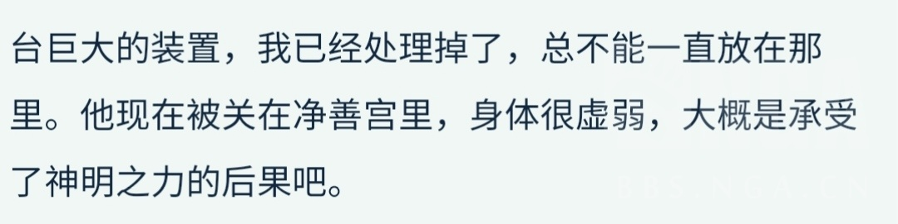

### [不吐不快]我是sb啊

Made by ngapost2md (c) ludoux [GitHub Repo](https://github.com/ludoux/ngapost2md)

----

##### 0.[0] \<pid:0\> 2023-07-26 03:48:06 by iluluchoe
吃了瓜，失望透顶，一早知道都是商品经不起验证，真的知道了还是犯恶心。俩游戏卡全抽掉了，这样就不惦记了

是散厨，单推人来的，但是厨尼玛，这很重要吗？只有xp党才觉得重要吧。
说一下成分，我也没什么厨力，但是花了对我来说最多的时间和钱，已经付出了很多，官方给什么我就看什么，没有什么屁股，就是一个关注流浪者这个角色的玩家。很多事情抽象了大半年，发展到理查我都不关注了，一直觉得不混论坛与我无关，两耳一塞不闻窗外事，怎么定义散解也随便了，说我是就是吧，谁能完全客观的讨论所有的事情呢？
现在复刻了，ep有别人也无所谓吧，倒不是讨厌卖cp，随便它卖，玩梗散草99我都一笑而过了，人与人有互动也正常吧，但是你搞这小动作放那么小一个小草我真的不懂，你到底是在表达什么？这二位正经互动每次都让人受不了，两个人都在疯狂ooc。你要卖cp，你总得让两个人之间有磁场吧？cb也没磁场啊？
sm编剧，我是真的受不了这么糟蹋一个角色，一个没有担当的角色，简章糊弄了个什么？刷机是天雷操作贵公司都能信手拈来，大肆宣扬过去有多惨，编剧怕你不知道他有多可怜，用了几乎全部的篇章告诉你他性格是怎么形成的，我又不是他妈，想让我怎么同情可怜他？最后撂下一句我一定会回来的，不关心啊，你卖卡的时候都卖不明白，我还指望你这个商品以后能发光发热？最让我绝望的是好像所有人都要向前看了，曾经的烂摊子呢？只记得要给博士复仇，自己造下的罪孽如何洗清？
单纯的觉得这个性格很让人讨厌，可恨，<b> 不能直面自己的罪，那就不要扎在好人堆里当捏鼻人 </b>，如果他尊崇自己的意志而活，自己复仇，那我敬他是汉子，一坏到底的角色多了去了。现在这又当又立的样子，到底谁还能喜欢下去？也不要说小草监视他所以他走不了，帮小草就是赎罪，放p，最离谱的就是这两个人凑到一起的时候，剧情乱七八糟，完全没有规律，到现在我都摸不清这两个人的对话会是什么走向。
以及3.6我连点都要按烂了，哦，对不起，我确实看不穿你，流浪者，你打破的不是第四面墙，是差点没把我创死。曾经那么多新加的设定，都因为未归的息星不置可否，只因初见惊艳，日配很好，角色设计也独一无二，稻妻主线遇见，知道这是个坏种，也很期待以后会有什么发展，2.6字字细腻，可惜现在，编剧大人开口了，看来果然是大可不必。

里堕了，发贴在这是真的很失望，昨天听说了猛干兄贵才来这里的，看了一些帖子也算豁然开朗了，再加上3.3以来种种剧情早已出脑。是可忍孰不可忍，这么抽象的游戏公司，谁爱吹谁吹，谁想送钱纯纯nc，我祝他暴s，我就睁着眼睛，看大厦倾倒的那一天

----

##### 1.[0] \<pid:704910093\> 2023-07-26 03:58:32 by 嘟嘟可在哪
苦海无涯，回头是岸。只要思想改造到位了国军也是一起解放人民的好同志

----

##### 2.[1] \<pid:704910259\> 2023-07-26 04:03:24 by aaaaazzzzzkkkkk
恭喜逃离粪坑！

----

##### 3.[0] \<pid:704910321\> 2023-07-26 04:05:43 by cecial
以后一起来看乐子吧

----

##### 4.[0] \<pid:704910369\> 2023-07-26 04:07:04 by samiyako
first time?.gif

----

##### 5.[0] \<pid:704910529\> 2023-07-26 04:12:12 by 经常看书看得开
最近在里茶看到不少散厨和草厨了。

我很好奇米哈游到底是在讨好哪家厨子

----

##### 6.[0] \<pid:704910580\> 2023-07-26 04:13:58 by 梦里寻欢-
曾经我挺喜欢纳西妲的，还抽了2+1，3.3剧情之后看大伙刷散草散纳还很难受，3.6彻底死心，现在她就乖乖当工具人，给八重和妮露挂草，连还没毕业的草套也不想刷了，看到相关的视频全部划过

----

##### 7.[0] \<pid:704910747\> 2023-07-26 04:19:34 by iluluchoe
>[jump](#pid704910580) 梦里寻欢-(2023-07-26 04:13) 说: 
>
>曾经我挺喜欢纳西妲的，还抽了2+1，3.3剧情之后看大伙刷散草散纳还很难受，3.6彻底死心，现在她就乖乖当工具人，给八重和妮露挂草，连还没毕业的草套也不想刷了，看到相关的视频全部划过

心累，付出越多就越失望……主要是今天真的知道内部就爱看乐子，高高在上的左右玩家情绪，真的是最后一根稻草

----

##### 8.[2] \<pid:704910772\> 2023-07-26 04:20:36 by 梅兰德协会探员N
>[jump](#pid704910529) 经常看书看得开(2023-07-26 04:12) 说: 
>
>最近在里茶看到不少散厨和草厨了。
>
>我很好奇米哈游到底是在讨好哪家厨子

当然是文案自嗨啦，管你什么厨，笔在我手里，想怎么写怎么写，看到你们破防我还要开心的笑哇哈哈哈哈

----

##### 9.[0] \<pid:704912106\> 2023-07-26 05:23:11 by 老婆说什么都对
前散厨，现散黑，早已是里版恶堕人一枚了，来这边参与个深夜树洞。这个ID当初还是给他注册的呢，用这么个ID发言真有一种莫名的快乐
作为一个对文案写作意图十分敏感的人，我是1月3日生日信后就出脑脱粉并祝福99锁死了，并且预料到了往后散草卖的方式、程度，可以说今天的EP范围内的程度尚在我当年的预料之内。
但我最早喜欢的也不是这个3.3之后的形象。我一直认为华馆套尤其是雷变风、机甲登神被打爆这么个小丑的逼格全无的走向，后续只有ml能救他一手。也就是说如果散兵不是ml，那3.2之后他的结局，原本应该不是我的XP好球区。结果mhy从3.2测试服开始，就疯狂营销带散兵ml的节奏(混过绿洲的应该都有印象)，当时对他的包容就跟草厨包容小草那种心态差不多吧。
结果从3.3的派蒙那句“你最好跟随纳西妲”开始，我就发现好像货不对板，测试服那些放出来的风声就是诈骗，而原本十分期待的生日信今天看来简直跟卡维生日信五五开，仿佛衬得辛苦赶在生日前把尘歌壶修好的自己像个sb。
再到3.6，到今天的EP，只能说买股买对，这瓜真甜。
之前3.2绿洲版和3.3刚开版本的蜜月期里，作为谁也没惹的ml党，就在看散厕的时候无缘无故地被AOE数次，乙解死了拒绝ml摄云云(截图都在)。在绿洲当年也很多堵嘴的，不知道还有没有现在出脑sj的老散厨还记得当年怎么因为一个起名消息，骂让角色失去了独立性又不是小猫小狗的那批zzzq的人。(直到我来到里版才发现原来也有一个地方ml配上桌吃饭啊，笑)再后来就是她们无限制地玩菜鸟，what are you doing？这个乙女烂梗来污名化ml党，甚至建立了菜鸟_wrud超话，有事没事在广场刷xx，xxxx？来嘲讽，甚至散厕现在都名字叫菜鸟驿立占，也是玩这个烂梗投票投出来的。
直到3.6之前，整个散兵相关的社区里，舆论都是这样ml人抬不起头的状态。假如你的微博上掌控舆论的都是这批人、甚至在被散黑反攻倒算之前，她们的日常就是这样高强度地刷烂梗、打同担(大概这些“同担”在她们眼里不配当同担吧)、挖苦ml党为乐，可以想像这个体验有多高血压。当然3.6之后，蒸馍，你不扶器？的缩写也是xx，xxxx？这下她们终于不刷这烂梗了，什么回旋镖啊hhh
而我当年生日信出脑之后，回顾3.3剧情结合生日信透露的剧情发展，已经看出了文案那股把巨婴好好宠着的味道，这才意识到文案真正想写的是一个怎样的逆天，而且这个逆天并不是做给我的。他的受众是当时整个社区遍地都是发情的散嬷、看散兵过得好有人爱有人宠就感动得不行的妈妈粉，“时而代入纳西妲时而代入多托雷”(散厨原话)的海芭夏式粉丝。
我都怀疑我的品位出问题了，为什么有人会喜欢这样的一个本身毫无人格魅力但是玻璃心能够凭着美貌就能让人母爱泛滥的人？她们只是在散兵身上看到了曾经的自己，想要自己无处安放的爱意有一个赛博男宝作为出口吗？就像有人追星追得像吸毒，一个塌房了必须找一个下家作为精神寄托的那种无处安放的爱意和锚点吗？
而且更离谱的是，这个逆天的塑造因为对了这群主流受众的pg，所以每当不喜欢这个散兵塑造的人出来倒黑泥，都会喜提来自厨子内部的堵嘴。每当有人说希望散兵和自己亲近一点，总有人趾高气扬地骑脸到你面前，故作无辜地说“我不希望散兵媚任何人”。更有甚者，说“喜欢看宝宝和对他好的人互动”，然后到处都在刷好喜欢小草想要抽她给散宝作伴。那时候的散厨内部真没几个特别强调cb的，YY小草长大两边日久生情的同人满大街都是，甚至嗑到内鬼吧喜提第一次禁散(笑)。这离谱的社区舆论还有明里暗里你不配上桌吃饭的架势，让我对这个角色彻底出脑。正因为他的受众爱看这个，加上草神被别出心裁地安了萝莉体型，3.6这一出大活其实我早就预感到了。可能里版有些草厨是等3.6才彻底幻想破灭被创飞的，但见识过散厨社区内部氛围、深知他的主流受众是什么人的我，早已先草厨一步被创飞了。
我不是他的受众，就这么简单。不服务我的角色，留下来就是被卖了还要帮人数钱，所以我跑了。当然，跑的时候，几个妈妈粉从nga那边sj过来，千里追杀莅临指导、高高在上的捂嘴和指点江山，也是功不可没。怎么样，现在看你宝真成了巨婴，爽吗？
可以说，如果当年是编剧发颠而散厨都在反对，那我可能不会这么出脑，我还会和同担一起维护人设，一起对抗sb编剧。
但很可惜，现实是编剧发颠而当年散厨主流的反应却是维护、喜欢，为了pg捂嘴同担，人和编剧本就是双向奔赴蛇鼠一窝，这怎么不能算一种什么锅配什么盖呢？
那我只能说一句敬谢不敏，你们giegie太高贵从不向玩家低头还要玩家当他的狗(海芭夏这个角色造出来就是在讽刺散姐群体画像)，人物内涵太深刻不喜欢的就是没品就不配喜欢他，哦不配就不配吧，以后莫挨老子。
可是3.6你散草都99了还老拉我黄毛当play的背景板，是不是多少沾点？
什么？都3.8了EP又有新活，终于有那么些人回过味来了？晚了，为了打ml，为了你们那烂透的品位和恶心的XP，连脑子都不要了，活该。
还好里茶馆让我认识到原来有那么多人当年也是这么从散兵的潜在厨子变成了黑，原来审美差劲的人也不是那么多。
但是不管怎么说，祝鸡馍夫妇99锁死，发烂发臭吧。

----

##### 10.[0] \<pid:704915886\> 2023-07-26 07:20:22 by iluluchoe
>[jump](#pid704912106) 老婆说什么都对(2023-07-26 05:23) 说: 
>
>前散厨，现散黑，早已是里版恶堕人一枚了，来这边参与个深夜树洞。这个ID当初还是给他注册的呢，用这么个ID发言真有一种莫名的快乐
>作为一个对文案写作意图十分敏感的人，我是1月3日生日信后就出脑脱粉并祝福99锁死了，并且预料到了往后散草卖的方式、程度，可以说今天的EP范围内的程度尚在我当年的预料之内。
>但我最早喜欢的也不是这个3.3之后的形象。我一直认为华馆套尤其是雷变风、机甲登神被打爆这么个小丑的逼格全无的走向，后续只有ml能救他一手。也就是说如果散兵不是ml，那3.2之后他的结局

是的，散厨现在的社区氛围就是他又惨又可爱，值得怜悯珍惜，又是白散又是散猫又是失忆，又有散兵赛博亲妈给他护航，这种当妈属性会让氛围乌烟瘴气，很有追星的感觉，什么都护着，只要是他相关什么都夸，什么都不能批评，我真的是越来越受不了了。

而且更恶心的是散兵最开始吸引人的地方根本就不是他凄惨的过去，或者傲娇等人设，而是他身为反派的反派魅力，这个反派魅力如何解构都要回归主旨，反派得到了教训/反派被过去掣肘/反派人格因为什么事件得到了丰富，等等。结果这个简章好大一坨答辩，货不对板不说，内容更是什么都没有表示，车轱辘话谁都能说，讲了几个过去的故事就糊弄过去了，回忆篇结束了你总得干点什么吧？就tm寸止，我以为3.6能烧个树，结果更是重量级。

----

##### 11.[0] \<pid:704916035\> 2023-07-26 07:22:41 by 四喜不是萝莉
>[jump](#pid704910529) 经常看书看得开(2023-07-26 04:12)说:
>最近在里茶看到不少散厨和草厨了。  我很好奇米哈游到底是在讨好哪家厨子[s:ac:咦]

讨好什么？好贵米家文案还需要讨好其他人？笔在人家手里，他自己也说就爱看玩家打架。硬说的话可能是讨好自己吧。

----

##### 12.[0] \<pid:704916425\> 2023-07-26 07:28:11 by cbzmxx
草神厨倒是从3.3开始就一直处于一种渐近性衰退的状态，3.6达到了巅峰。这次出现在散兵ep里结果也没多少草神厨破防了，似人当然没办法再破防了，都是在看乐子。
我倒是没想到会有一些散厨会因为昨天帽子戏法破防，不过嘛，我倒是觉得无论男女无论xp如何，在一般向二游里当单推人真得谨慎再谨慎，不要投入真心和金钱

----

##### 13.[0] \<pid:704916763\> 2023-07-26 07:32:30 by 扶光む
>[jump](#pid704912106) 老婆说什么都对(2023-07-26 05:23) 说: 
>
>前散厨，现散黑，早已是里版恶堕人一枚了，来这边参与个深夜树洞。这个ID当初还是给他注册的呢，用这么个ID发言真有一种莫名的快乐
>作为一个对文案写作意图十分敏感的人，我是1月3日生日信后就出脑脱粉并祝福99锁死了，并且预料到了往后散草卖的方式、程度，可以说今天的EP范围内的程度尚在我当年的预料之内。
>但我最早喜欢的也不是这个3.3之后的形象。我一直认为华馆套尤其是雷变风、机甲登神被打爆这么个小丑的逼格全无的走向，后续只有ml能救他一手。也就是说如果散兵不是ml，那3.2之后他的结局

怜爱了(指楼主)，从没厨过散，原来内部这么精彩很符合我对饭圈妈粉的刻板印象

----

##### 14.[0] \<pid:704917078\> 2023-07-26 07:36:20 by ZFBXBD
你作为厨子，在这里看见骂他的话你还能看得下去的时候。你不是就已经意识到很久了吗。
另外，别太在意，区区一个游戏，三次元开心点。

----

##### 15.[0] \<pid:704917251\> 2023-07-26 07:38:31 by 五蕴盛苦
在米家当厨子是这样的
mhy你该死啊
总之恭喜出脑！一起看乐子

----

##### 16.[0] \<pid:704917406\> 2023-07-26 07:40:10 by 洛长河
>[jump](#pid0) iluluchoe(2023-07-26 03:48) 说: 
>
>吃了瓜，失望透顶，一早知道都是商品经不起验证，真的知道了还是犯恶心。俩游戏卡全抽掉了，这样就不惦记了
>
>是散厨，单推人来的，但是厨尼玛，这很重要吗？只有xp党才觉得重要吧。
>说一下成分，我也没什么厨力，但是花了对我来说最多的时间和钱，已经付出了很多，官方给什么我就看什么，没有什么屁股，就是一个关注流浪者这个角色的玩家。很多事情抽象了大半年，发展到理查我都不关注了，一直觉得不混论坛与我无关，两耳一塞不闻窗外事，怎么定义散解也随便了，说我是就是吧，谁能完全客观的讨论

吃瓜晚了，猛干兄贵是什么？

----

##### 17.[0] \<pid:704917537\> 2023-07-26 07:41:35 by iluluchoe
>[jump](#pid704917078) ZFBXBD(2023-07-26 07:36) 说: 
>
>你作为厨子，在这里看见骂他的话你还能看得下去的时候。你不是就已经意识到很久了吗。
>另外，别太在意，区区一个游戏，三次元开心点。

感觉不如公子话不投机半句多，我厨反派自然心理素质不差的，很多话我知道也不是针对我这类人的，所以无所谓，可是官方背刺实在是我的大雷点，真的让人玩不下去了

----

##### 18.[0] \<pid:704917604\> 2023-07-26 07:42:18 by 九叶喵
我觉得这个ep确实难顶的原因是加个角色还偷偷摸摸的加，有人也说了，想加完全可以大大方方安排场景，不管是回报还是看书甚至都能成他们最正常的互动，但是这种偷偷塞一个的行为给我感觉就好像之前es卡面塞一堆三次明星的头一样

----

##### 19.[0] \<pid:704917768\> 2023-07-26 07:44:03 by iluluchoe
>[jump](#pid704917406) 洛长河(2023-07-26 07:40) 说: 
>
>吃瓜晚了，猛干兄贵是什么？

哈哈，你在我回复里找找帖子吧，版里好像搜不到了

----

##### 20.[0] \<pid:704918080\> 2023-07-26 07:47:00 by 奇迹沼
出脑了就好，米社这操作就是打所有单推玩家的脸呗大概只有无脑代入狂磕的人接受的了

----

##### 21.[0] \<pid:704918115\> 2023-07-26 07:47:17 by 色胚茄子
>[jump](#pid704917406) 洛长河(2023-07-26 07:40) 说: 
>
>吃瓜晚了，猛干兄贵是什么？

可以在版里看那个“mhy文案阴阳玩家”的高楼，
记得有个脱水版，一时找不到了，就看水很高的版本吧()

----

##### 22.[0] \<pid:704918365\> 2023-07-26 07:49:38 by Lilith330
>[jump](#pid704912106) 老婆说什么都对(2023-07-26 05:23):

卧槽我说那个菜鸟是什么东西，之前经常在微博首页刷到只知道和散兵有关，还以为是玩雷文的烂梗，原来是在打乙解啊……
其实我觉得一个角色卖不卖ml看主线比较准，你游那几个ml角色都是主线里卖过的，只在语音和尘歌壶里卖的不作数我在幽夜时期被语音文案吓到了这么直球的ml是不是不太符合他人设，结果出来剧情果然毫无ml要素(那牵手我觉得和ml没多大关系)
以及，推散草肯定不是看社区氛围才卖的，像羽毛一样藏起来这句台词写的比他任何语音都要暧昧，其次3.6的剧情也是提前就做好了的
这波只能说是骗进来杀，并不是被厨子牵着走的……该说mhy预测到了他这剧情能提纯的就是妈粉和嬷嬷吗

----

##### 23.[0] \<pid:704925883\> 2023-07-26 08:40:51 by 看我把那飞机打下来
>[jump](#pid704918365) Lilith330(2023-07-26 07:49)说:
><b>Reply to [pid=704912106,37138911,1]Reply[/pid] Post by [uid=64400541]老婆说什么都对[/uid] (2023-07-26 05:23)</b>  卧槽我说那个菜鸟是什么东西，之前经常在微博首页刷到[s:ac:哭笑]只知道和散兵有关，还以为是玩雷文的烂梗，原来是在打乙解啊…… 其实我觉得一个角色卖不卖ml看主线比较准，你游那几个ml角色都是主线里卖过的，只在语音和尘歌壶里卖的不作数[s:ac:哭笑]我在幽夜时期被语音文案吓到了这么直球的ml是不是不太符合他人设，结果出来剧情果然毫无ml要素(那牵手我觉得和ml没多大关系) 以及，推散草肯定不是看社区氛围才卖的，像羽毛一样藏起来这句台词写的比他任何语音都要暧昧，其次3.6的剧情也是提前就做好了的 这波只能说是骗进来杀，并不是被厨子牵着走的……该说mhy预测到了他这剧情能提纯的就是妈粉和嬷嬷吗[s:ac:哭笑]

散兵主线的ml体现在3.2和3.3，3.2是特地跑来找旅行者，3.3是旅行者取名字+说要当旅行者黑暗中的助力

----

##### 24.[0] \<pid:704928953\> 2023-07-26 08:56:11 by zhz35
>[jump](#pid704910529) 经常看书看得开(2023-07-26 04:12):

猛干兄不是都爆料了吗，扯头花、很重要吗、不受约束.jpg

----

##### 25.[0] \<pid:704930018\> 2023-07-26 09:01:10 by 老婆说什么都对
>[jump](#pid704915886) iluluchoe(2023-07-26 07:20) 说: 
>
>是的，散厨现在的社区氛围就是他又惨又可爱，值得怜悯珍惜，又是白散又是散猫又是失忆，又有散兵赛博亲妈给他护航，这种当妈属性会让氛围乌烟瘴气，很有追星的感觉，什么都护着，只要是他相关什么都夸，什么都不能批评，我真的是越来越受不了了。
>
>而且更恶心的是散兵最开始吸引人的地方根本就不是他凄惨的过去，或者傲娇等人设，而是他身为反派的反派魅力，这个反派魅力如何解构都要回归主旨，反派得到了教训/反派被过去掣肘/反派人格因为什么事件得到了丰富，等等。结果这个简章好大一坨答辩，货不对板不说，内容更是什么都没有表示

现在就更可怕了，现在的氛围就是一旦表达对现在散兵人设的不认可，要么上来名为安慰实为堵嘴地怪你你滑坡，要么遇到言辞激烈一点的直接打为散黑。除非你是跟内部统一口径，比如3.3间章演出敷衍缺乏高光云云，翻译一下就是：肯定giegie的现在，与主流控舆粉丝立场一致愿意帮giegie卖惨要后续待遇。

真是都给她们赢完了，这么汴京真是没法辩，因为只要你的对方不是能抛弃粉丝立场，双方彻底跳出来站在读者角度客观评价，那么对方就立于不败之地。因为对方能仗着你还有爱不愿意撕破脸，拿粉丝不能负面评价角色疯狂道德绑架，你摆出一个事实批判，对方一句你辱角色就把你干沉默了，请问这还怎么讨论？

笑死了，还辱角色呢，怎么不问问现在写出来这是个什么贵物？怎么，贵物都能写出来，却不让人说实话？

实话说，我觉得任何人厨米家的角色，最基本的还是得带脑子，先跳出厨子视角努力做到回归本源，在这基础上再去附加你作为厨子的滤镜吧，别一开始上来就把角色当石块各取各粮用来填补你自己喜欢的二设。显然现在的他们根本不具备这样的能力，而是给自己编织一个茧房直接过滤掉自己不喜欢的信息，连信息的接收都做不到完备怎么不算一种自欺欺人呢？

此外，她们还有一些其他角色的“单推”，不知道是装不懂还是真不懂，总希望自推高高在上都是别人舔她们推。包括散兵在3.3前后出来的那一大串攻击性表情包、那个挑衅拉满的语音，还有对主角那个不客气的态度，她们都觉得是自己占便宜了。我只能说劝这些人治治脑子，游戏里逞一时意气有什么用？别整的你的纸片人恶心骑脸了其他玩家好像自己骑脸了其他玩家一样爽，你的纸片人对玩家低头了就好像你自己低头一样憋屈？这些人是现实里太loser才觉得一坨数据的纸片人的“脸面”代表自己的脸面？

自机散兵为什么能踩爆这么多人雷点很大程度上就是他那个恶心人的态度导致的，纸片人低个头示个弱表达一下自己柔软的一面，是很容易就能导致观感变好的事，可是现在散厨的主流群体压根看不得这个。但凡他在3.6时真的表现出想要伸出手却不敢触碰，想要弥补却只能沉默的柔软，对主角好一点，把主角真当兄弟(加上少卖点散草，笑)，大部分人对他态度肯定会软化不少。可是厨子和mhy正主一样一副宅男乙解不配让我宝低头、请mhy多卖卖散草的样子，那我只能笑嘻了祝你宝未来继续好好争这口纸片人的气，千万不要低头啊(包括对这次氪了满命的散姐也别低头，对小草除外毕竟散草99嘛，对没堵过同担嘴的散厨也除外。sj的散厨如果觉得我骂到你了，那么骂的就是你)。

而且这个群体还让我恶心的一点就是屠龙者终成恶龙，当年在绿洲看着散兵v1v2v3地改出来，应该没有人比散厨更清楚什么叫强度就是一坨任人搓扁捏圆的数据，本该没有人比散厨更懂辱角色的痛苦。他实装之后我是感受到了他的自追踪和手长机制，这便宜自己偷偷占了就完了，为什么要反复地去外面骑脸魈厨，甚至其他各种厨？己所不欲，勿施于人，当年是策划玩物骂策划，现在占了便宜就当策划伥鬼？

作为一个出脑人，3.3整个版本看下来，每当散兵马杯分数超过魈，个超就一阵欢呼雀跃夹杂着对魈的辱角色；再到散厨大超反攻、个超zhengbian上位清算双厨、清算滑坡人的魔怔场面；当时就觉得这些陷入癫狂的集体狂欢的人类迷惑行为必定翻车，而且一定会摔得很惨。结果果然，在3.6前夕蹲到了“原来你也讨厌()”这部大戏，而且又新又好比我当年预想的还要持久和精彩

----

##### 26.[0] \<pid:704930596\> 2023-07-26 09:03:46 by お宅不是
>[jump](#pid704910529) 经常看书看得开(2023-07-26 04:12) 说: 
>
>最近在里茶看到不少散厨和草厨了。
>
>我很好奇米哈游到底是在讨好哪家厨子

手综版还有大量厨子呢一小时几百赞的含金量了解一下

----

##### 27.[0] \<pid:704931589\> 2023-07-26 09:08:22 by 地下埋地雷
mhy拿太子玩黑红流量

----

##### 28.[0] \<pid:704933718\> 2023-07-26 09:18:14 by 老婆说什么都对
>[jump](#pid704918365) Lilith330(2023-07-26 07:49) 说: 
>
>卧槽我说那个菜鸟是什么东西，之前经常在微博首页刷到只知道和散兵有关，还以为是玩雷文的烂梗，原来是在打乙解啊……
>其实我觉得一个角色卖不卖ml看主线比较准，你游那几个ml角色都是主线里卖过的，只在语音和尘歌壶里卖的不作数我在幽夜时期被语音文案吓到了这么直球的ml是不是不太符合他人设，结果出来剧情果然毫无ml要素(那牵手我觉得和ml没多大关系)
>以及，推散草肯定不是看社区氛围才卖的，像羽毛一样藏起来这句台词写的比他任何语音都要暧昧，其次3.6的剧情也是提前就做好了

对，就是骗进来杀。这个角色做出来就是服务妈粉和嬷嬷的，谁让ml是工作不熟是生活呢。整个3.2绿洲的那个氛围会是玩家想多吗？再看看又新又好的李猛干吧，想想米到底下场过多少社区舆论，这简直就是一场杀猪盘。

我跟你对ml的观点一样，认为只有官方剧情卖而且不割裂两头卖的才算。如果散兵那个算，那么优菈语音夜兰语音一样能算。同样卖CP，散兵那个自机语音感觉论真诚程度，不如迪卢克(而且迪卢克捆得也没散兵这么死，更何况蒙德人是真把主角当朋友)，更不用说魈华申阿这几位ml专业户。

而且散厨这个群体吧，对ml的态度很有点既要又要的爱蹭味，说到原神ml角色时要蹭，吹自推时又说他不卖ml和CP同人人气也很高(啊这，看看他跟雷电影、纳西妲、万叶，当然还有小丑黄毛的对照关系，还有米桑给他拉的金瓜博士？)。当年3.3官方给他买的商单和生日信给我的感觉就是，这位未来应该是主打一手米桑内部最爱的主卖散草兼职贵乱(可能雷电影不敢明着剧情里卖)，你一个小丑黄毛还想垄断太子？只有太子开后宫当箭头中心，你黄毛只是太子的箭头中的小小一个而已。一想到都已经是巨婴了，后面厨子内部还要为这么个巨婴男宝党争扯头花就真的难绷，过于普信也不看看你太子配不配啊。

----

##### 29.[0] \<pid:704934481\> 2023-07-26 09:21:30 by 老婆说什么都对
>[jump](#pid704916763) 扶光む(2023-07-26 07:32) 说: 
>
>怜爱了(指楼主)，从没厨过散，原来内部这么精彩很符合我对饭圈妈粉的刻板印象

谢谢。希望sj的散厨别岁我是被宅男割影响了，因为我出脑和醒过来比宅男割还早了好几个月呢

----

##### 30.[0] \<pid:704941690\> 2023-07-26 09:52:32 by 龙游旷野
>[jump](#pid704910529) 经常看书看得开(2023-07-26 04:12):

公司厨和文案厨

----

##### 31.[0] \<pid:704946654\> 2023-07-26 10:13:45 by 向日葵之梦
>[jump](#pid704930018) 老婆说什么都对(2023-07-26 09:01) 说: 
>
>现在就更可怕了，现在的氛围就是一旦表达对现在散兵人设的不认可，要么上来名为安慰实为堵嘴地怪你你滑坡，要么遇到言辞激烈一点的直接打为散黑。除非你是跟内部统一口径，比如3.3间章演出敷衍缺乏高光云云，翻译一下就是：肯定giegie的现在，与主流控舆粉丝立场一致愿意帮giegie卖惨要后续待遇。
>
>真是都给她们赢完了，这么汴京真是没法辩，因为只要你的对方不是能抛弃粉丝立场，双方彻底跳出来站在读者角度客观评价，那么对方就立于不败之地。因为对方能仗着你还有爱不愿意撕破脸，拿粉丝不能负面评价角色疯狂道德绑架

内部不还是一群人看不得()去须弥 觉得魈厨才是爱挑事的一方吗  就算恨mhy恨现在的剧情也要留下来 真是不好评价

----

##### 32.[0] \<pid:704955554\> 2023-07-26 10:48:03 by 夏尔的微光

3.2入坑的新玩家，前面啥情况不了解，但是3.3真的满满的ML，那会儿上头了也没深究剧情。而且抽到手后觉得很好用，本来想复刻补满命。妮绽、冰队，胡桃队啥的都没抽，雷国因为抢班也没练，深渊随便打打，就为他留着位置。
3.6后开始感觉不太妙，跟朋友聊的时候就觉得，我氪金是不是给了编剧瞎写的底气，打算补到2+1和满珐就算了。
昨天上午被朋友喂了猛干这瓜，爬完楼跟朋友吐槽到半夜，已经打算弃游了

给草神和万叶都抽了2+1，氪了20来单了吧，都是为了他氪的。~~磕过散草CB和枫散CP~~

隔壁也玩了，厨云五，还好因为原，隔壁氪的少了很多
隔壁大概也许还会继续玩，但不会再氪一分钱了

----

##### 33.[0] \<pid:704955873\> 2023-07-26 10:49:19 by ToutSeul
>[jump](#pid704910529) 经常看书看得开(2023-07-26 04:12):

有没有可能，是公司厨
讲究一个内部厨力文化是全肯定

----

##### 34.[0] \<pid:704958553\> 2023-07-26 10:58:59 by 洛长河
>[jump](#pid704918115) 色胚茄子(2023-07-26 07:47) 说: 
>
>可以在版里看那个“mhy文案阴阳玩家”的高楼，
>记得有个脱水版，一时找不到了，就看水很高的版本吧()

谢谢了

----

##### 35.[0] \<pid:704958643\> 2023-07-26 10:59:18 by 洛长河
>[jump](#pid704917768) iluluchoe(2023-07-26 07:44) 说: 
>
>哈哈，你在我回复里找找帖子吧，版里好像搜不到了

好的谢谢了

----

##### 36.[0] \<pid:704959559\> 2023-07-26 11:02:43 by 无月之想
>[jump](#pid704930018) 老婆说什么都对(2023-07-26 09:01)说:
>[quote][pid=704915886,37138911,1]Reply[/pid] <b>Post by [uid=62016960]iluluchoe[/uid] (2023-07-26 07:20):</b>  是的，散厨现在的社区氛围就是他又惨又可爱，值得怜悯珍惜，又是白散又是散猫又是失忆，又有散兵赛博亲妈给他护航，这种当妈属性会让氛围乌烟瘴气，很有追星的感觉，什么都护着，只要是他相关什么都夸，什么都不能批评，我真的是越来越受不了了。  而且更恶心的是散兵最开始吸引人的地方根本就不是他凄惨的过去，或者傲娇等人设，而是他身为反派的反派魅力，这个反派魅力如何解构都要回归主旨，反派得到了教训/反派被过去掣肘/反派人格因为什么事件得到了丰富，等等。结果这个简章好大一坨答辩，货不对板不说，内容更是什么都没有表示[/quote]现在就更可怕了，现在的氛围就是一旦表达对现在散兵人设的不认可，要么上来名为安慰实为堵嘴地怪你你滑坡，要么遇到言辞激烈一点的直接打为散黑。除非你是跟内部统一口径，比如3.3间章演出敷衍缺乏高光云云，翻译一下就是：肯定giegie的现在，与主流控舆粉丝立场一致愿意帮giegie卖惨要后续待遇。  真是都给她们赢完了，这么汴京真是没法辩，因为只要你的对方不是能抛弃粉丝立场，双方彻底跳出来站在读者角度客观评价，那么对方就立于不败之地。因为对方能仗着你还有爱不愿意撕破脸，拿粉丝不能负面评价角色疯狂道德绑架，你摆出一个事实批判，对方一句你辱角色就把你干沉默了，请问这还怎么讨论？  笑死了，还辱角色呢，怎么不问问现在写出来这是个什么贵物？怎么，贵物都能写出来，却不让人说实话？  实话说，我觉得任何人厨米家的角色，最基本的还是得带脑子，先跳出厨子视角努力做到回归本源，在这基础上再去附加你作为厨子的滤镜吧，别一开始上来就把角色当石块各取各粮用来填补你自己喜欢的二设。显然现在的他们根本不具备这样的能力，而是给自己编织一个茧房直接过滤掉自己不喜欢的信息，连信息的接收都做不到完备怎么不算一种自欺欺人呢？  此外，她们还有一些其他角色的“单推”，不知道是装不懂还是真不懂，总希望自推高高在上都是别人舔她们推。包括散兵在3.3前后出来的那一大串攻击性表情包、那个挑衅拉满的语音，还有对主角那个不客气的态度，她们都觉得是自己占便宜了。我只能说劝这些人治治脑子，游戏里逞一时意气有什么用？别整的你的纸片人恶心骑脸了其他玩家好像自己骑脸了其他玩家一样爽，你的纸片人对玩家低头了就好像你自己低头一样憋屈？这些人是现实里太loser才觉得一坨数据的纸片人的“脸面”代表自己的脸面？  自机散兵为什么能踩爆这么多人雷点很大程度上就是他那个恶心人的态度导致的，纸片人低个头示个弱表达一下自己柔软的一面，是很容易就能导致观感变好的事，可是现在散厨的主流群体压根看不得这个。但凡他在3.6时真的表现出想要伸出手却不敢触碰，想要弥补却只能沉默的柔软，对主角好一点，把主角真当兄弟(加上少卖点散草，笑)，大部分人对他态度肯定会软化不少。可是厨子和mhy正主一样一副宅男乙解不配让我宝低头、请mhy多卖卖散草的样子，那我只能笑嘻了祝你宝未来继续好好争这口纸片人的气，千万不要低头啊(包括对这次氪了满命的散姐也别低头，对小草除外毕竟散草99嘛，对没堵过同担嘴的散厨也除外。sj的散厨如果觉得我骂到你了，那么骂的就是你)。  而且这个群体还让我恶心的一点就是屠龙者终成恶龙，当年在绿洲看着散兵v1v2v3地改出来，应该没有人比散厨更清楚什么叫强度就是一坨任人搓扁捏圆的数据，本该没有人比散厨更懂辱角色的痛苦。他实装之后我是感受到了他的自追踪和手长机制，这便宜自己偷偷占了就完了，为什么要反复地去外面骑脸魈厨，甚至其他各种厨？己所不欲，勿施于人，当年是策划玩物骂策划，现在占了便宜就当策划伥鬼？  作为一个出脑人，3.3整个版本看下来，每当散兵马杯分数超过魈，个超就一阵欢呼雀跃夹杂着对魈的辱角色；再到散厨大超反攻、个超zhengbian上位清算双厨、清算滑坡人的魔怔场面；当时就觉得这些陷入癫狂的集体狂欢的人类迷惑行为必定翻车，而且一定会摔得很惨。结果果然，在3.6前夕蹲到了“原来你也讨厌()”这部大戏，而且又新又好比我当年预想的还要持久和精彩[s:ac:茶]

我其实也很难理解为什么有人这么多面树敌
二次元角色其实很难引起我真心实意的反感，比如说很早之前我本命是黑猫但是能和很多桐乃厨玩得很开心；再比如我对原神某角色观感不佳，但是她的厨子有不少是我的至交好友。
唯独散兵是例外，其一是我身边那么多人从男到女没有一个人表示可以接受散兵，其二就是如果有人跟我说他是散兵厨(现在还是的话)我会认真观察一下他的言行已确定我还能不能再跟他做朋友
有的时候真的就是，莫名其妙，比如魈，多少还是因为同赛道和抢珐露珊，莫名其妙把花时来信头换成散兵然后说不是衣服丑而是绫华丑真的是很莫名其妙
然后得知2.2w楼真的令人大开眼界

----

##### 37.[0] \<pid:704959913\> 2023-07-26 11:04:01 by williamwinter
以前我会痛苦，
现在我看“到现在我都摸不清这两个人的对话会是什么走向”的时候竟然笑了出来

----

##### 38.[0] \<pid:704961672\> 2023-07-26 11:10:12 by 已美美冬眠
>[jump](#pid704915886) iluluchoe(2023-07-26 07:20) 说: 
>
>是的，散厨现在的社区氛围就是他又惨又可爱，值得怜悯珍惜，又是白散又是散猫又是失忆，又有散兵赛博亲妈给他护航，这种当妈属性会让氛围乌烟瘴气，很有追星的感觉，什么都护着，只要是他相关什么都夸，什么都不能批评，我真的是越来越受不了了。
>
>而且更恶心的是散兵最开始吸引人的地方根本就不是他凄惨的过去，或者傲娇等人设，而是他身为反派的反派魅力，这个反派魅力如何解构都要回归主旨，反派得到了教训/反派被过去掣肘/反派人格因为什么事件得到了丰富，等等。结果这个简章好大一坨答辩，货不对板不说，内容更是什么都没有表示

所以我一直是明白雷散粉在想什么的，要是维持之前的人设哪怕有人不喜欢但也是口味问题。现在这个瘤子完全是为了其他一些目的做出来的，倾注了大量饭圈的东西进去，比如猫塑、嘴臭等等，让她们仗着这些东西吹皇族，享受攻击别人的快感，至于人设本身？这角色是一丁点正面的品性都不沾，卖惨卖不好，要逼格没有，之前反派的气质也没有。不过瘤子姐都不在意这奇怪的塑造，那就别怪别人踩一脚

----

##### 39.[0] \<pid:704962829\> 2023-07-26 11:14:26 by 老婆说什么都对
>[jump](#pid704946654) 向日葵之梦(2023-07-26 10:13) 说: 
>
>内部不还是一群人看不得()去须弥 觉得魈厨才是爱挑事的一方吗  就算恨mhy恨现在的剧情也要留下来 真是不好评价

她们恨归恨，但她们的口味本来就被mhy研究透了，太子妈的占有欲其实是独一份的，婆婆表面上说谁跟我儿子好都可以，但已经把自己置于一个可以随意对“儿子”的CP品头论足且不会被任何角色威胁的高位位置上，而且和现实婆婆一样有种你们都没我爱我儿子、为我儿子付出(舔)得不如我的都不配肖想我儿的酸臭味。

ml党永远赢不过妈粉的根本原因就是ml党的互动关系地位靠游戏公司的文案施舍，而妈粉的这种自发的以付出论地位的评价尺度永远不会被任何人威胁到。而散兵的个别meta元素本质上就是媚的这波人(可能对其他人不是，但出现在这样一个跟玩家化身不假辞色的人身上，我只能这么解读)，告诉妈粉她们对散兵是特别的，是散兵的高维解救者，和她们对自己的定位重合了。

所以当年妈粉在绿洲捂嘴ml党说你不配给散兵起名这样就是把他当小猫小狗不尊重他，结果落地猫塑之后我倒是从未把这位当小猫小狗，但是叫他散咪动不动就捡个猫家人们最上头的也恰好是这帮人。都小猫咪玩物了，我还以为她们真不吃这一套呢，这不也被媚得挺高兴的吗？

但是散兵身上的meta元素本质上还是挺少的，而且其实写起来也不怎么花资源，懂不懂写一句你以为你能看穿我这样毫无亲近感的话也能让散姐激动脑补一万字，然后人就可以在游戏里叠猫猫互相对话几十句在EP里做风晶蝶的含金量啊？这也太好糊弄了，是我我也这么放点风声让散姐脑补。

就跟人和妈/女朋友肩并肩路过看到你对你笑了一下，你就觉得人对你是特别的了？散厨们劝你们别想太多hhh还等着你们爆米呢，这么好做这么敷衍的meta和这么用心的散草99，骗的就是散宝妈呢。

----

##### 40.[0] \<pid:704963984\> 2023-07-26 11:18:33 by iluluchoe
>[jump](#pid704961672) 已美美冬眠(2023-07-26 11:10) 说: 
>
>所以我一直是明白雷散粉在想什么的，要是维持之前的人设哪怕有人不喜欢但也是口味问题。现在这个瘤子完全是为了其他一些目的做出来的，倾注了大量饭圈的东西进去，比如猫塑、嘴臭等等，让她们仗着这些东西吹皇族，享受攻击别人的快感，至于人设本身？卖惨卖不好，要逼格没有，之前反派的气质也没有。不过瘤子姐都不在意这奇怪的塑造，那就别怪别人踩一脚

我说实话，我一直都没骂过流浪者，改了外观也挺好看的，配音没用中配就还好了，从来没说自己只厨雷散。但是这个贴有人说散嬷，我想了想只能说确实是这样，现在的流浪者真能喜欢的也就散嬷妈粉了吧……我最讨厌的就是告诉我坏人的可怜，mhy这转锅卖惨玩的好六，非得如此才能抽我真是跟吃了诗一样

----

##### 41.[0] \<pid:704964312\> 2023-07-26 11:19:42 by Fakenews
米：不好意思我们做不到让所有人满意，但是让所有人不满意，可是我们的拿手绝活

----

##### 42.[0] \<pid:704965412\> 2023-07-26 11:23:43 by 老婆说什么都对
>[jump](#pid704959559) 无月之想(2023-07-26 11:02) 说: 
>
>我其实也很难理解为什么有人这么多面树敌
>二次元角色其实很难引起我真心实意的反感，比如说很早之前我本命是黑猫但是能和很多桐乃厨玩得很开心；再比如我对原神某角色观感不佳，但是她的厨子有不少是我的至交好友。
>唯独散兵是例外，其一是我身边那么多人从男到女没有一个人表示可以接受散兵，其二就是如果有人跟我说他是散兵厨(现在还是的话)我会认真观察一下他的言行已确定我还能不能再跟他做朋友
>有的时候真的就是，莫名其妙，比如魈，多少还是因为同赛道和抢珐露珊，莫名其妙把花时来信头换成散兵然后说不是衣服丑而是绫华丑真的

对，我有朋友是爱女解，当年看到2.2W散厨拐华打魈双厨委屈一边换头拉踩华本人穿新衣装没散的换头好看，嗤之以鼻说都给她们懂完了。好歹先克制一下自己犯剑拉踩爱满世界蹭的手呢。

----

##### 43.[0] \<pid:704984925\> 2023-07-26 12:41:28 by iluluchoe
>[jump](#pid704964312) Fakenews(2023-07-26 11:19) 说: 
>
>米：不好意思我们做不到让所有人满意，但是让所有人不满意，可是我们的拿手绝活

能做到所有人都不满意也是一种本事

----

##### 44.[0] \<pid:705005006\> 2023-07-26 14:22:58 by 落穹千刃
来人，上猛哥经典语录

----

##### 45.[0] \<pid:705005414\> 2023-07-26 14:25:00 by 朝云无觅
3.3入坑抽了散，逐步了解散的身世被抛弃还有点苦，所以靠喜欢伤害他人来维护自尊，有一点好像我能读懂他但外界觉得他素质是真不好，很期待他的蜕变，3.6作为一个萝莉控抽了2+1草。结果3.6给我上猛料，自爆+没有赎罪的散，妈的，我到底期待了个啥  ，可能也就曾今的我这么在意吧

----

##### 46.[0] \<pid:705006310\> 2023-07-26 14:29:37 by 纸游W
其实做到这一步，就是内部在阴搓搓恶心人
有啥好怀疑的，除了这个其它思路都解释不通
一个商业破鞋，一个内部爱，化学反应拉满了

----

##### 47.[0] \<pid:705007598\> 2023-07-26 14:35:49 by 好想幹林尼
>[jump](#pid704918365) Lilith330(2023-07-26 07:49):

對了，羽毛這句是故意改的，原文不是這樣
這次是真&amp;#8226;廢案，我手上還有原文的txt檔案

----

##### 49.[0] \<pid:705009608\> 2023-07-26 14:45:31 by Hanaisnotok
>[jump](#pid704959559) 无月之想(2023-07-26 11:02):

我印象里我最开始对其他厨感到反感是因为他们大面积拉踩宵宫和绫人。。。。。。真的是莫名其妙

----

##### 50.[0] \<pid:705010312\> 2023-07-26 14:49:05 by ElementDoll
>[jump](#pid704910529) 经常看书看得开(2023-07-26 04:12):

讨好文案它自己

----

##### 51.[0] \<pid:705010815\> 2023-07-26 14:51:30 by iluluchoe
>[jump](#pid705005414) 朝云无觅(2023-07-26 14:25) 说: 
>
>3.3入坑抽了散，逐步了解散的身世被抛弃还有点苦，所以靠喜欢伤害他人来维护自尊，有一点好像我能读懂他但外界觉得他素质是真不好，很期待他的蜕变，3.6作为一个萝莉控抽了2+1草。结果3.6给我上猛料，自爆+没有赎罪的散，妈的，我到底期待了个啥  ，可能也就曾今的我这么在意吧

一个反派有点心理变态再正常不过了，退一万步讲，哪怕他现在状况是死不悔改，拂袖而去说他要报仇，他残害的生命依旧说都是蝼蚁，让恨他的人恨透他，骂s他我都高兴，因为他本来就不是一个正常人，人设是对的，这就是他要背负的罪孽。哪怕这样的讲述不符合价值观，也罢了。这种时候在想起来他曾经那么可怜，让人觉得这个角色很复杂，我都很乐意看到。
现在搞的让人真真摸不着头脑，最直接的就是没有担当，没有自觉。

----

##### 52.[0] \<pid:705011043\> 2023-07-26 14:52:35 by tbiph9277
>[jump](#pid704910529) 经常看书看得开(2023-07-26 04:12) 说: 
>
>最近在里茶看到不少散厨和草厨了。
>
>我很好奇米哈游到底是在讨好哪家厨子

什么厨很重要吗，也就你们厨子会在乎这些

----

##### 53.[0] \<pid:705014306\> 2023-07-26 15:07:13 by 好想幹林尼
>[jump](#pid705009467) 啊2333(2023-07-26 14:44)说:
>[quote][pid=705007598,37138911,3]Reply[/pid] <b>Post by [uid=64802919]好想幹林尼[/uid] (2023-07-26 14:35):</b>  對了，羽毛這句是故意改的，原文不是這樣[s:ac:哭笑] 這次是真?廢案，我手上還有原文的txt檔案[s:ac:哭笑][/quote]老哥，可以让我瞅瞅吗[s:ac:瞎]

那台巨大的装置，我已经处理掉了，总不能一直放在那里。
他现在被关在净善宫里，身体很虚弱，大概是承受了神明之力的后果吧。

英譯中

----

##### 54.[0] \<pid:705015463\> 2023-07-26 15:12:21 by 啊2333
>[jump](#pid705014306) 好想幹林尼(2023-07-26 15:07) 说: 
>
>有人看到，我就編輯掉了

啥

----

##### 55.[0] \<pid:705016202\> 2023-07-26 15:15:41 by 叶落寒宵
只能说，mhy只会无底线，无差别恶心厨子

----

##### 56.[0] \<pid:705016673\> 2023-07-26 15:17:58 by 纠缠的狗
>[jump](#pid704910529) 经常看书看得开(2023-07-26 04:12) 说: 
>
>最近在里茶看到不少散厨和草厨了。
>
>我很好奇米哈游到底是在讨好哪家厨子

讲真，两边都吃力不讨好。我看到有草神的时候，人都麻了。只能尽力安慰自己，告诉自己，只要不是官方明目张胆的说是CP，那他们就不是CP

----

##### 58.[0] \<pid:705019452\> 2023-07-26 15:30:44 by 冰川真琴
羽毛原文是什么，有看见的老哥能私信我一下吗？谢谢

----

##### 59.[0] \<pid:705019633\> 2023-07-26 15:31:33 by gtgce
>[jump](#pid704910529) 经常看书看得开(2023-07-26 04:12) 说: 
>
>最近在里茶看到不少散厨和草厨了。
>
>我很好奇米哈游到底是在讨好哪家厨子

讨好他自己

----

##### 60.[0] \<pid:705020033\> 2023-07-26 15:33:14 by yenfsjs
>[jump](#pid705019452) 冰川真琴(2023-07-26 15:30)说:
>羽毛原文是什么，有看见的老哥能私信我一下吗？谢谢

----

##### 61.[0] \<pid:705021983\> 2023-07-26 15:42:19 by 冰川真琴
态度差别很大，所以实际上3.2就已经被上身了

----

##### 62.[0] \<pid:705024001\> 2023-07-26 15:51:31 by ochaaki
不说3.6和生日信，就3.3撞树这个手法真的不仅触动底层世界观，而且3.2才刚用了一次，对这个世界观代入感影响都很大，而且最妙的是这等于把散兵后续补丁也撞没了，那个大可以提刀来更是嘲讽值拉满，文案或许是想表达他主管上有那个意思，然而表现出来的就呃呃呃，对相关者来说历史都洗完了，赎罪剧情客观上就不可能了。及时后续对原来的受害者做点什么，那只会变成一种施舍而不是报偿，更加地狱笑话。而反派人设也同理因为撞了清空没办法维持了。这到底写的是什么几把。

----

##### 63.[1] \<pid:705072604\> 2023-07-26 19:27:17 by 白菊 ほたる
草厨，现在也是，不过我现在把对纳西妲塑造的一切不满全部归咎于sb，所以我对sb的恶意只会到一个十分极端的地步。
不过站在一个相对理性的角度分析，实际上散兵也是个可怜角色。并不是说他的经历“三次背叛”有多可怜，而是摊上这么个sm编剧是真可怜。
回想当时1.1未归熄星的时候的那种恶，和看破虚假之天的那种高深。还有稻妻时候那种迷晕了主角的作为反派的压迫感。现在，不过是一个在幼妈庇护下随意嘴臭别人的傲娇雄小鬼。逼格掉一地不说，还碎掉了。
只能说，不光能把一个高人气的纳西妲写废，还能把一个本来能很有逼格很有魅力的反派散兵写废，米哈游编剧在整个二游圈也是独一档的废物啊

----

##### 64.[1] \<pid:705074530\> 2023-07-26 19:37:52 by 罐装小鸟
>[jump](#pid704910529) 经常看书看得开(2023-07-26 04:12) 说: 
>
>最近在里茶看到不少散厨和草厨了。
>
>我很好奇米哈游到底是在讨好哪家厨子

这个问题不是第一次了，

白术头部以下设计是在讨好哪一群体
林尼的着装设计是在讨好哪一群体
黄豆姐胸部畸形是在讨好哪一群体

可能有，但都是非常罕见稀有的人群吧。任何你叫的上号的群体都不愿意接这些锅。整天把锅推来推去性别大战XP大战，现在知道了，你老婆设计成C罗是在讨好哪一群体？没有什么理由就是至高无上的创作者喜欢嘛

----

##### 65.[0] \<pid:705074743\> 2023-07-26 19:39:19 by 呙邱邱
它不仅卖，还是偷偷卖，既要又要是深入骨髓了

----

##### 66.[0] \<pid:705077033\> 2023-07-26 19:49:41 by 鹭闲
我曾经也是散厨，指3.2之前，后来版本开了，当时忙也没先梦梦剧情 就直接开抽，抽完了还美滋滋的给好友们分享喜悦，然后我就去过剧情了，然后感觉很后悔，内心复杂到拼命删消息删以前给它画的二创，生怕被人发现我喜欢过这么个东西，游戏内我把它摔死了，改成不太好听的名字，当初听说可以给它取名，我翻了很久的古诗。其实三次背叛那时候就感觉到不对劲了，但是从1.1等到那时候的我已经感觉能落地就行，谁知道能小丑成这样啊。现在直接变成散草cp粉，天天祝他俩99

----

##### 67.[0] \<pid:705077191\> 2023-07-26 19:50:22 by 颜值协会资深会员
楼里的大家好会说，我曾经也是被主线取名和个人语音骗到的萌萌ml人
现在已经出脑变成混乱邪恶乐子人了

