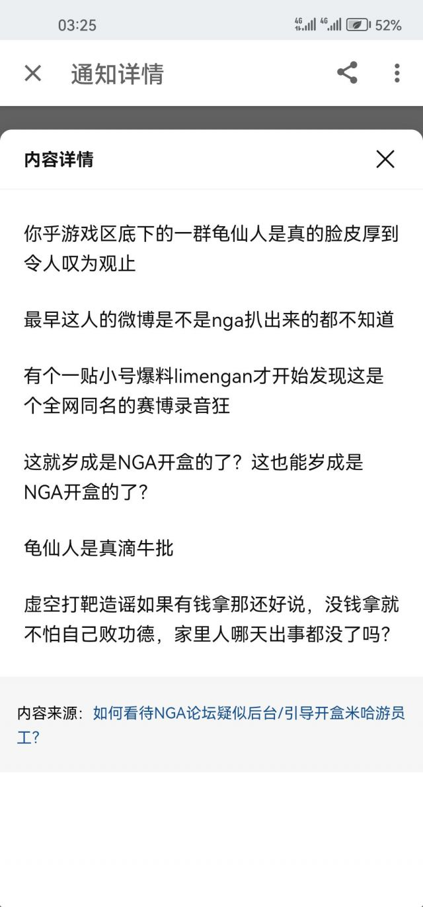

### [不吐不快][热点事件]这洗地有点离谱了

Made by ngapost2md (c) ludoux [GitHub Repo](https://github.com/ludoux/ngapost2md)

----

##### 0.[11] \<pid:0\> 2023-07-26 04:21:37 by 诗酒趁年华-狼人
知乎，手综的洗地帖已经完全是知乎团建人的形状了。

胡搅蛮缠，遍地打滚，乱扣帽子，各种造谣，岁月史树。
把不可名状的标准展示的淋漓尽致。

知乎团建人大多是付费水军和自我洗脑的XX。

洗地帖是什么情况？

----

##### 1.[4] \<pid:704910845\> 2023-07-26 04:23:24 by 嘟嘟可在哪
当你想用逻辑来理解一群疯子的时候你就已经输了，对付疯子魔法对轰才是王道

----

##### 2.[3] \<pid:704910899\> 2023-07-26 04:25:30 by CaptLinC
这事发展到现在用正常逻辑根本没法洗，可不就得撒泼打滚了嘛

----

##### 3.[0] \<pid:704910901\> 2023-07-26 04:25:32 by 纳西妲的小秋千

zsbd

----

##### 4.[0] \<pid:704910947\> 2023-07-26 04:27:25 by 辉火熠耀
从一开始的不想接受发现没办法再继续洗了可不就只能自我洗脑
哦，还有嘬奶嘴

----

##### 5.[1] \<pid:704910978\> 2023-07-26 04:28:15 by restack
刚才在手综看到辟谣希儿称呼的感觉挺无语的，他去翻了PV和后续的剧情论证了那段PV里称呼是没问题的，是某个人格故意喊错的(我没玩过崩三，如果转述错了见谅)。我一下就无语了，他在这费心费力洗地论证，不就反映了角色用什么称呼其实是很重要的事？结果编剧大人都说了这事不重要了。。。

----

##### 6.[0] \<pid:704911022\> 2023-07-26 04:29:50 by aaaaazzzzzkkkkk
这波啊，这波是把赛博爹当亲爹孝顺了，亲爹不是自己能选的，好容易搞了个新爹，可不得拼命维护证明自己眼光卓越啊

----

##### 7.[0] \<pid:704911047\> 2023-07-26 04:30:44 by Wave2000
<b>玩原神玩的</b>

----

##### 8.[2] \<pid:704911199\> 2023-07-26 04:36:48 by 渡狸時雨丶
手综的贴子死光了这是不是坐实了舟ga不让辟谣啊？希望手综大人们赶紧离开舟ga寻找新的家园

----

##### 9.[0] \<pid:704911228\> 2023-07-26 04:37:44 by lingwzhui
>[jump](#pid704910978) restack(2023-07-26 04:28) 说: 
>
>刚才在手综看到辟谣希儿称呼的感觉挺无语的，他去翻了PV和后续的剧情论证了那段PV里称呼是没问题的，是某个人格故意喊错的(我没玩过崩三，如果转述错了见谅)。我一下就无语了，他在这费心费力洗地论证，不就反映了角色用什么称呼其实是很重要的事？结果编剧大人都说了这事不重要了。。。

那个辟谣贴的热评不是更好玩？

----

##### 10.[0] \<pid:704911538\> 2023-07-26 04:55:19 by 丙陶殷辛司晏
>[jump](#pid704910978) restack(2023-07-26 04:28)说:
>刚才在手综看到辟谣希儿称呼的感觉挺无语的，他去翻了PV和后续的剧情论证了那段PV里称呼是没问题的，是某个人格故意喊错的(我没玩过崩三，如果转述错了见谅)。我一下就无语了，他在这费心费力洗地论证，不就反映了角色用什么称呼其实是很重要的事？结果编剧大人都说了这事不重要了。。。[s:ac:哭笑]

那版浓度确实巨高无比，这事想要去洗白，讲道理最能让路人接受的说法不应该是“编剧只是一时口快，你看这段剧情它后面xxxxx，说明他们其实很注重这些细节”之类的话吗，既稳住了米哈游的形象又小小的帮这位编剧挽尊了一波。然而他最后整了个“以直报怨”，这不纯纯自嗨么，感觉他发那贴就没考虑要说服别人...

----

##### 11.[0] \<pid:704911603\> 2023-07-26 04:59:06 by 茫然的熊
手综发明了这么多词，最后都米氏回旋镖到他们自己身上了

----

##### 12.[0] \<pid:704911624\> 2023-07-26 05:00:21 by 祗堂鞠也不知道
>[jump](#pid704911199) 渡狸時雨丶(2023-07-26 04:36)说:
>手综的贴子死光了[s:a2:你看看你]这是不是坐实了舟ga不让辟谣啊？希望手综大人们赶紧离开舟ga寻找新的家园

其实是BW半夜起床上厕所顺便清杂而已

----

##### 13.[0] \<pid:704911690\> 2023-07-26 05:04:00 by znaibeind
不过我真的好奇，这个瓜的溯源到底是哪里，看一开始发的挂微博的那些截图，感觉很专业，很像蓄谋已久，尤其是一些打码和框选大小，很一致的码了发布时间，每个截图基本都是固定大小，尤其有一点，关于崩铁那个仙舟剧情的截图甚至是一小时前，考虑到这瓜出来三小时猛干桑就察觉并开始自保，发帖人准备整理信息也太快了 更别说后来nga小号一句话吹响冲锋号角，有种刻意的感觉，感觉追踪截图这个人能让这瓜更有意思一点

----

##### 14.[0] \<pid:704912040\> 2023-07-26 05:20:25 by 熹有长庚雨
>[jump](#pid704911690) znaibeind(2023-07-26 05:04) 说: 
>
>不过我真的好奇，这个瓜的溯源到底是哪里，看一开始发的挂微博的那些截图，感觉很专业，很像蓄谋已久，尤其是一些打码和框选大小，很一致的码了发布时间，每个截图基本都是固定大小，尤其有一点，关于崩铁那个仙舟剧情的截图甚至是半小时前，考虑到这瓜出来三小时猛干桑就察觉并开始自保，发帖人准备整理信息也太快了 更别说后来nga小号一句话吹响冲锋号角，有种刻意的感觉，感觉追踪截图这个人能让这瓜更有意思一点

我记得最开始好像是一个匿名号？后来估计锁了吧就成现在的高楼了，希望我没记错

----

##### 15.[0] \<pid:704912668\> 2023-07-26 05:49:24 by Vs_Code
>[jump](#pid704911690) znaibeind(2023-07-26 05:04) 说: 
>不过我真的好奇，这个瓜的溯源到底是哪里，看一开始发的挂微博的那些截图，感觉很专业，很像蓄谋已久，尤其是一些打码和框选大小，很一致的码了发布时间，每个截图基本都是固定大小，尤其有一点，关于崩铁那个仙舟......

我当时亲眼见证这个爆料，最早是流水楼匿名，甚至都没有说出处，只是说了句&quot;不受制约的文案&quot;那句话可以在首页就能搜到，然后我一开始还没理解那个所谓的首页是哪个首页，我先去贴吧搜了一下，没有搜到，然后想不会是泥潭吧，于是又在泥潭搜了一下还是没有搜到，再回来的时候就看到有人单开贴了，原来是微博首页。

