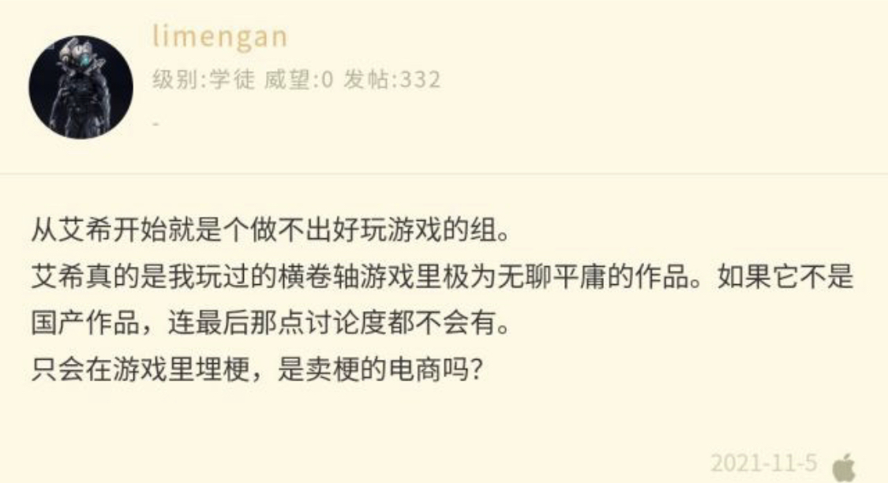

### [热点事件]是时候复习一下星铁制作人大卫先生采访时的发言了

Made by ngapost2md (c) ludoux [GitHub Repo](https://github.com/ludoux/ngapost2md)

----

##### 0.[2] \<pid:0\> 2023-07-26 05:30:41 by ReachUO
大卫：
 
HoYoverse所研发的游戏，全都极度重视“角色”。HoYoverse的剧情写手从来都将“让笔下的各类角色仿佛真的生活在那个世界中一般”这点牢记于心。
 
写手们需要做的不是按照自身想法让角色动起来，而是记录生活于那个世界当中的角色的言行举止，以及所发生的各类事件，更类似于“记录员”这样一种职责……HoYoverse一直对此极为重视，绝不允许写手依照个人喜好让角色做出OOC行为。
 
但同时因为希望角色拥有“真人一般的人味儿”，所以也会以自己身边的人为模特来塑造角色。
 
举例来说，《崩坏：星穹铁道》里有一位热衷打麻将的角色名叫“青雀(seijyaku)”，在打造该角色的时候，我们观察了身边的麻将发烧友，“喜欢麻将的人平时是怎么行动的？”“喜欢麻将的人会讨厌什么？”，然后将此类特征融入到了角色身上。(笑)。

----

##### 1.[0] \<pid:704912307\> 2023-07-26 05:31:57 by pxn360529052
这件事很重要吗，可能只有角色厨才会觉得重要吧

----

##### 2.[0] \<pid:704912317\> 2023-07-26 05:32:40 by loadin233
总结：搞语擦

----

##### 3.[0] \<pid:704912333\> 2023-07-26 05:33:29 by タウィル
内鬼速度来说说符玄原型是谁,急

----

##### 4.[0] \<pid:704912367\> 2023-07-26 05:34:59 by 痕跡_
现在已经逐渐成为一种笑话了.jpg还有什么崩坏三幕后说文案平时会模仿角色对话呢，我看是直接取材现实而不是模仿角色吧

----

##### 5.[0] \<pid:704912448\> 2023-07-26 05:38:26 by CUCUK
>[jump](#pid704912333) タウィル(2023-07-26 05:33) 说: 
>
>内鬼速度来说说符玄原型是谁,急

首先排除女性

----

##### 6.[0] \<pid:704912602\> 2023-07-26 05:46:01 by 加贺烧
我当时看到这段采访就跟群里朋友说这句话指定成为回旋镖，没想到这么快

----

##### 7.[0] \<pid:704915235\> 2023-07-26 07:09:22 by write54

可是只会在游戏里卖梗，是卖梗的电商吗

----

##### 8.[1] \<pid:704915542\> 2023-07-26 07:14:49 by 风缠丶
“绝不允许写手依照个人喜好让角色做出OOC行为”
是的，这句话当初我还借来反观3.3之后的原神。。
后来有人说星铁两个多月走完了原神三年多的路，这下真米氏一家亲了

----

##### 9.[0] \<pid:704915769\> 2023-07-26 07:18:30 by 霜伊丶
>[jump](#pid704915542) 风缠丶(2023-07-26 07:14) 说: 
>
>“绝不允许写手依照个人喜好让角色做出OOC行为”
>是的，这句话当初我还借来反观3.3之后的原神。。
>后来有人说星铁两个多月走完了原神三年多的路，这下真米氏一家亲了

错啦，现在不管是铁道还是原，剧情都是他们觉得好才这样想的，可没有ooc

