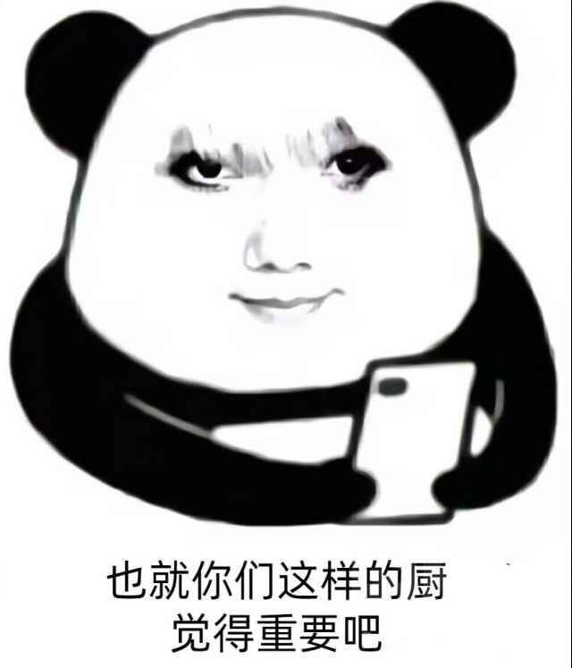

### [不吐不快] 作为一个在3.3版本还为散辩护的玩家是如何被官方创死的

Made by ngapost2md (c) ludoux [GitHub Repo](https://github.com/ludoux/ngapost2md)

----

##### 0.[0] \<pid:0\> 2023-07-26 07:18:08 by gloriel
先亮PG，我第一次UP就抽了散1命，本来对散是属于中立偏好感的态度，散草CP也能接受(毕竟作为老崩坏玩家，除了男酮CP都能吃得下)。所以直到3.3版本的时候我还在替散厨、替官方辩护，认为散黑滑坡的太厉害，不应该那么极端。但是3.6的版本活动把我直接创死了

3.3的时候我是真心相信流浪者以后会作为“暗中的助力”在里侧去保护须弥，或是仗着人偶的特性可以投身于与深渊力量有关的战斗中来赎罪，而且从流浪者的语音来看，他对于自己是个有罪之人是有着自觉的，在3.3最后他与旅行者的对话也软化了。可学院争霸赛的流浪者是怎样的？登场时就出言不逊怼天怼地，之后又蛊惑老实孩子莱依拉用占星术作弊，对方不愿意还出言嘲讽。靠着草神的关系占了因论派的出赛名额但是在前两轮比赛里却直接摆烂。与其同时作为草神的暗桩对整个事件的解决也没起到任何作用，也没有保护到其它参赛人员(王冠还是到了卡维手里，卡维依靠自己的意志挣脱)，也就是说除了给提纳里水之外他啥正事都没干，反倒是打伤卡维、给莱依拉留下心理阴影。而给提纳里水这事又是强行让提纳里降智
所以我就困惑了，这是一个赎罪之人应有的态度吗？岁月史书是个意外，散兵本意是抹除自己，我还可以理解。但是学院争霸赛的这些言行可是流浪者自己想做而做出来的，无法再找任何客观理由。流浪者在学院争霸赛的举止表现既不像赎罪之人，也不像秘密助力，反而像个飞扬跋扈的二世祖，而草神则像一个纵容溺爱大宝贝的昏君(在加上其对萨其因研究的态度)
我始终不恨角色，因为用猛干兄的话来说，笔在别人手里。角色只是编剧的提线木偶，他们也是无辜的。既然编剧就是有意要把散与散厨放到火上去烤，那我只能顺从了，我不会再去做任何辩护，我只会一边鼓掌一边让他加速，求仁得仁，自业自得

----

##### 1.[0] \<pid:704925230\> 2023-07-26 08:37:28 by 看我把那飞机打下来
想一想猛哥语录，估计mhy里喜欢专门恶心玩家的不少

----

##### 2.[0] \<pid:704927497\> 2023-07-26 08:48:54 by 请孔明继续迦班
仔细回想最近剧情察觉到，是这样的，编剧应该故意的，故意往恶心人的方向写，散兵塑造突出一个“对坏事是我干的，没有反转没有反转，都是我干的”“啊我趾高气昂我可一点瘪都不吃”
因为如果只是单纯喜欢角色而写崩了，他们完全知道在后续剧情怎么圆，比如雷神，比如绫华，从人物刻画的细节来看他们其实完全知道自家角色啥地方改了观感会更好

----

##### 3.[0] \<pid:704928068\> 2023-07-26 08:51:39 by 阿卡林12450
编剧是乐子人，所以认真看过剧情的玩家最后也变成乐子人，也很合理吧。

Winwin

----

##### 4.[0] \<pid:704929221\> 2023-07-26 08:57:25 by 超时空鉴定师
翻了遍楼主的历史发帖，特别是看到《纳西妲是最适合成为旅行者伴侣》的帖子时绷不住了

----

##### 5.[0] \<pid:704929914\> 2023-07-26 09:00:36 by write54
泥游编剧喜欢看玩家乐子，我看泥游乐子，大家都有美好的未来

----

##### 6.[0] \<pid:704931846\> 2023-07-26 09:09:29 by 狼煞天泣
猛干哥都这么说了，以后谁还厨米家角色我都看不起他

----

##### 7.[0] \<pid:704933041\> 2023-07-26 09:14:59 by 调香师正牌夫人
确实3.3我也抱着，&#39;散兵材料世界树，差点成神，草神要是真拿他有用利用一下也不是不行&#39;的想法，后面一看，纯属发癫

----

##### 8.[0] \<pid:704933588\> 2023-07-26 09:17:29 by meg1412
评价是

----

##### 9.[0] \<pid:704974535\> 2023-07-26 11:57:25 by gloriel
>[jump](#pid704929221) 超时空鉴定师(2023-07-26 08:57) 说: 
>
>翻了遍楼主的历史发帖，特别是看到《纳西妲是最适合成为旅行者伴侣》的帖子时绷不住了

那时候的我确实以为草神与散分别是须弥的ML女角色与ML男角色

----

##### 10.[0] \<pid:704975900\> 2023-07-26 12:02:46 by Hanaisnotok
我记忆里自动把间章那堆剧情全删了，问下，散去世界树删了自己，然后变成失忆白散，之后是为啥又有记忆了…… 突然想到这个怎么也想不起来了

----

##### 11.[0] \<pid:704976106\> 2023-07-26 12:03:36 by 平淡无奇的今天
谁不是呢，我也是呢，然后我就被学园祭登堂入室的散兵创死了

----

##### 12.[0] \<pid:704976322\> 2023-07-26 12:04:36 by wanmanfung
>[jump](#pid704975900) Hanaisnotok(2023-07-26 12:02)说:
>我记忆里自动把间章那堆剧情全删了，问下，散去世界树删了自己，然后变成失忆白散，之后是为啥又有记忆了…… 突然想到这个怎么也想不起来了

当然是草神特地存了一份自用的散包记忆备份还给他辣

----

##### 13.[0] \<pid:704976484\> 2023-07-26 12:05:18 by loadin233
>[jump](#pid704975900) Hanaisnotok(2023-07-26 12:02) 说: 
>
>我记忆里自动把间章那堆剧情全删了，问下，散去世界树删了自己，然后变成失忆白散，之后是为啥又有记忆了…… 突然想到这个怎么也想不起来了

我就记得白散和爷去打了正机之神，然后就想起来(可能是？)了，大概

----

##### 14.[0] \<pid:704977091\> 2023-07-26 12:07:51 by 贾元春儿
>[jump](#pid704975900) Hanaisnotok(2023-07-26 12:02) 说: 
>
>我记忆里自动把间章那堆剧情全删了，问下，散去世界树删了自己，然后变成失忆白散，之后是为啥又有记忆了…… 突然想到这个怎么也想不起来了

妲留有原先教令院存下的散到进高达之前的记忆，表示可以给流灌回去，问要不要，
流表示要，
所以就给他灌回去了。

----

##### 15.[0] \<pid:704978937\> 2023-07-26 12:15:30 by Hanaisnotok
>[jump](#pid704977091) 贾元春儿(2023-07-26 12:07) 说: 
>
>妲留有原先教令院存下的散到进高达之前的记忆，表示可以给流灌回去，问要不要，
>流表示要，
>所以就给他灌回去了。

行。

----

##### 17.[0] \<pid:704979856\> 2023-07-26 12:19:24 by tsqtt
和我一模一样真信了贷款赎罪甚至我到生日信还觉得sb不去坐牢也能接受，毕竟没过多久。直到3.6给我当头一棒。现在看来我就是个纯傻逼

----

##### 18.[0] \<pid:704982863\> 2023-07-26 12:32:31 by 芙芙蓉蓉
>[jump](#pid704927497) 请孔明继续迦班(2023-07-26 08:48) 说: 
>
>仔细回想最近剧情察觉到，是这样的，编剧应该故意的，故意往恶心人的方向写，散兵塑造突出一个“对坏事是我干的，没有反转没有反转，都是我干的”“啊我趾高气昂我可一点瘪都不吃”
>因为如果只是单纯喜欢角色而写崩了，他们完全知道在后续剧情怎么圆，比如雷神，比如绫华，从人物刻画的细节来看他们其实完全知道自家角色啥地方改了观感会更好

绫华圆什么了？

----

##### 19.[0] \<pid:704983405\> 2023-07-26 12:34:52 by 冷泠棱凌
>[jump](#pid704982863) 芙芙蓉蓉(2023-07-26 12:32) 说: 
>
>绫华圆什么了？

3.4皮肤剧情？
反正我觉得绫华的偷心宣言媚到我了

----

##### 20.[0] \<pid:704984668\> 2023-07-26 12:40:20 by gloriel
>[jump](#pid704982863) 芙芙蓉蓉(2023-07-26 12:32) 说: 
>
>绫华圆什么了？

容彩祭时绫华对旅行者的态度比较冷淡，与传说任务形成极大反差，让有些玩家认为绫华之前在主线的态度只是在利用旅行者，是绿茶行为。之后的两个活动试胆大会与皮肤又再度维持ML人设了

