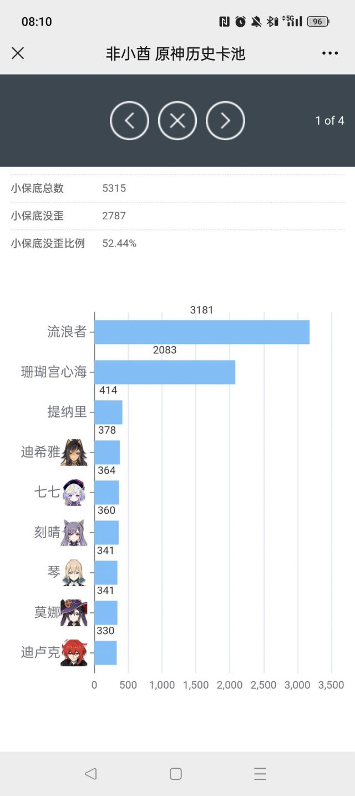
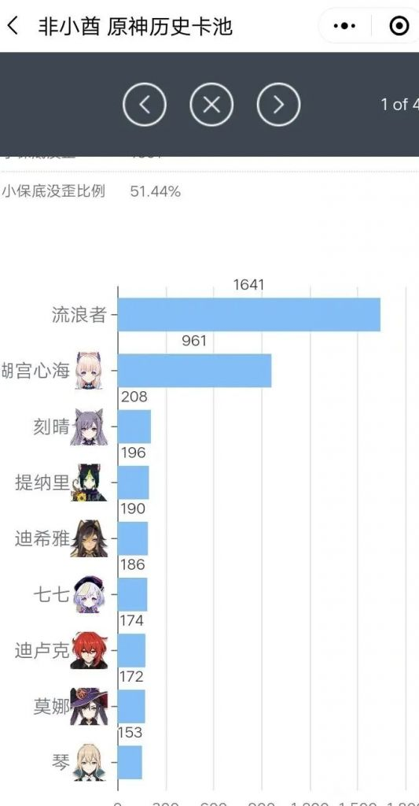

### [热点事件]有没有大文豪，来总结下这次流水暴死的意义

Made by ngapost2md (c) ludoux [GitHub Repo](https://github.com/ludoux/ngapost2md)

----

##### 0.[6] \<pid:0\> 2023-07-26 07:40:57 by Bolannn
我看到的一个，感觉总结还不是很到位，不能涵盖太子的全部丰功伟绩
须弥剧情深度代表人，佛教文化的传播者，米忽悠的编剧内部爱，开服铺垫的剧情，与主角同一待遇的起名，为进池不惜岁月史书，拿须弥人气最高的角色草神党垫子，嘴臭各路角色厨子还很得意的其他角色喜提全角色第一次复刻最差成绩，这还是双up且抽取比1.6比1，与散解在社区的巨大声量、米哈游的巨量塑造形成的巨大反差，成为二游史上一个后现代经典笑话

----

##### 1.[0] \<pid:704920780\> 2023-07-26 08:09:42 by AkariYu3310
很喜欢一句话
卖Cp不如卖你妈的骨灰

----

##### 2.[0] \<pid:704920882\> 2023-07-26 08:10:28 by q794623
我就讲个笑话，雷神心海池当时是75H左右吧(忘了具体)，

散()心海池子？

----

##### 3.[4] \<pid:704920935\> 2023-07-26 08:10:52 by 关闭网页
意义就是证明太子已经带领原神全面进入加速时代，加速加速再加速

----

##### 4.[1] \<pid:704921010\> 2023-07-26 08:11:21 by 流离之人追逐幻影丶
我只能说我心不背这锅，责任全在散方

----

##### 6.[0] \<pid:704921123\> 2023-07-26 08:12:10 by SNsymerry
都是心海害了giegie，为什么不是散草双up

----

##### 7.[0] \<pid:704921149\> 2023-07-26 08:12:22 by 白苹果k
意义就是给大伙带来了乐子

----

##### 8.[0] \<pid:704921702\> 2023-07-26 08:16:25 by D_终于考好了
心海第三次复刻+命座不行+专武不行，这要怪我心也太没道理了
不过散兵是第二个双池复刻的0，尤其是尤可都不是首次复刻，可莉还没有专武~~但凡给可莉补个专武，3.8也不至于0+0~~

----

##### 9.[0] \<pid:704921707\> 2023-07-26 08:16:26 by 欧莱文
理论上米是有后台数据的，分析一下就知道知道到底玩家都抽什么，流水如何的，看来内部爱是真的很大咯，继续抽卡的相当于掏钱请神父在你面前……

----

##### 10.[2] \<pid:704921719\> 2023-07-26 08:16:32 by 就爱看乐子
代表剧情影响不可忽略，枫丹没有任性的资本，不膨胀流水以后就这样，强的20+，弱的过不了抖音，看看水神能不能破圈，带来雷神一样的影响吧

----

##### 11.[1] \<pid:704921921\> 2023-07-26 08:17:44 by Lilith330
只能说别急，抽取比心海说不定会后来居上

----

##### 12.[2] \<pid:704921991\> 2023-07-26 08:18:11 by kunizu
根据推测，可能的原因是散兵过于散兵了

----

##### 13.[2] \<pid:704922083\> 2023-07-26 08:18:46 by 樱木花kun
有种吃四路经济，然后团战暴毙，导致夺冠热门队伍止步八强十六强的美

----

##### 14.[2] \<pid:704922228\> 2023-07-26 08:19:40 by 油炸食品滚出地球
#珊瑚宫心海发表声明称与此事无关

----

##### 15.[3] \<pid:704922249\> 2023-07-26 08:19:48 by yxliu24

抽取比已经在逐步降低了，现在是1.5:1
考虑到两边角色的特点，说不定最后能到1.2:1前后

----

##### 16.[0] \<pid:704922278\> 2023-07-26 08:20:02 by 最果てにて輝ける槍
完全没关注过流水，比例1.6是什么水平？有其他双up的数据看看吗？

----

##### 17.[0] \<pid:704922337\> 2023-07-26 08:20:25 by 倾落影
话说主角的取名审查机制和流浪者一样吗？怎么感觉流浪者的更严一些

----

##### 18.[0] \<pid:704922340\> 2023-07-26 08:20:27 by GewinJin
这下因为做的散兵决策须弥全面拉胯，枫丹如果再来个新体系把老体系全面噶了就只能靠自己了

----

##### 19.[1] \<pid:704922462\> 2023-07-26 08:21:23 by 关闭网页
>[jump](#pid704922249) yxliu24(2023-07-26 08:19)说:
>
>抽取比已经在逐步降低了，现在是1.5:1
>考虑到两边角色的特点，说不定最后能到1.2:1前后

考虑到两个角色抽满命和抽0命的比例，实际抽取人数……啊这

----

##### 20.[0] \<pid:704922528\> 2023-07-26 08:21:54 by 梦一下怎么了
意义是我们不是小众，原来你也讨厌其他.jpg

----

##### 21.[0] \<pid:704923008\> 2023-07-26 08:25:01 by 这游戏真给我整沉默了
这下可以吹原神的流水还有很大的进步空间了

----

##### 22.[0] \<pid:704923137\> 2023-07-26 08:25:50 by yxliu24
>[jump](#pid704922278) 最果てにて輝ける槍(2023-07-26 08:20) 说: 
>
>完全没关注过流水，比例1.6是什么水平？有其他双up的数据看看吗？

心海雷神各自第一次复刻的时候
抽取比雷神:心海是5:1往上

----

##### 23.[2] \<pid:704923140\> 2023-07-26 08:25:51 by NATFproposal
>[jump](#pid704921719) 就爱看乐子(2023-07-26 08:16) 说: 
>
>代表剧情影响不可忽略，枫丹没有任性的资本，不膨胀流水以后就这样，强的20+，弱的过不了抖音，看看水神能不能破圈，带来雷神一样的影响吧

就这个男路人看来女性性特征为0的中性人设，破圈可能0

----

##### 24.[0] \<pid:704923284\> 2023-07-26 08:26:41 by 吮指原味萝莉
意义是在以后的文案里再暗戳戳地冷嘲热讽玩家一番

----

##### 25.[0] \<pid:704923560\> 2023-07-26 08:28:17 by Lilith330
>[jump](#pid704922278) 最果てにて輝ける槍(2023-07-26 08:20) 说: 
>
>完全没关注过流水，比例1.6是什么水平？有其他双up的数据看看吗？

我记得最夸张的是草神首up和宵宫是10:1
1.6:1可以说是拉不开差距的，考虑到抽散兵命座的比较多，实际抽取人数恐怕是心海更多

----

##### 26.[0] \<pid:704924029\> 2023-07-26 08:30:55 by 智豪萨拉曼卡
>[jump](#pid704922083) 樱木花kun(2023-07-26 08:18) 说: 
>
>有种吃四路经济，然后团战暴毙，导致夺冠热门队伍止步八强十六强的美

散兵还没退役，散兵只是没人要

----

##### 27.[0] \<pid:704924478\> 2023-07-26 08:33:29 by 木易风歌
很喜欢杨戬的一句话：把大局逆转吧。虽然是反向逆转但不管是剧情还是流水，散都是这个关键人物。

----

##### 28.[0] \<pid:704925047\> 2023-07-26 08:36:34 by 大a加油
证明内部不是恒河水就是核废水，以猛干哥这位恨男恨女精印的38岁厕弟为首的米哈游蒸蒸日上

----

##### 29.[0] \<pid:704926297\> 2023-07-26 08:43:01 by 依旧心情
爆杀了哈哈哈

----

##### 30.[0] \<pid:704926726\> 2023-07-26 08:45:13 by Sulfuring
加速，必须加速！

----

##### 31.[0] \<pid:704926955\> 2023-07-26 08:46:20 by 一张便利贴_
>[jump](#pid704922249) yxliu24(2023-07-26 08:19) 说: 
>
>
>抽取比已经在逐步降低了，现在是1.5:1
>考虑到两边角色的特点，说不定最后能到1.2:1前后

居然还有这种统计吗 这就下回来把原石全奉献给我心

----

##### 32.[0] \<pid:704927124\> 2023-07-26 08:47:11 by 胖芋头不胖
还能说什么？好似！！！！！！！！！！！！！！！

----

##### 33.[0] \<pid:704928012\> 2023-07-26 08:51:23 by 狗头子
>[jump](#pid704924029) 智豪萨拉曼卡(2023-07-26 08:30) 说: 
>
>散兵还没退役，散兵只是没人要

别尬黑啊红温龙龟有冒泡赛打的

----

##### 34.[0] \<pid:704928064\> 2023-07-26 08:51:38 by 燕子安贝
半场香槟先开着 但还是很怕足迹的枫丹封面创下大流水

----

##### 35.[0] \<pid:704929132\> 2023-07-26 08:57:02 by ﹎清霜
>[jump](#pid704921921) Lilith330(2023-07-26 08:17) 说: 
>
>只能说别急，抽取比心海说不定会后来居上

现在抽取比例已从1.62:1变成1.52:1了

感觉心海抽取比例还能增加，毕竟主c大多xp抽卡，一般前几天想抽的都抽了。

----

##### 36.[0] \<pid:704931580\> 2023-07-26 09:08:20 by 绮曼念雪
“和主角同一待遇” ，你个臭黄毛还想碰瓷散宝

----

##### 37.[0] \<pid:704931607\> 2023-07-26 09:08:26 by 似君梦枉然
而且这个抽取比例，我猜一个池子结束之前小心海会超过其他

----

##### 38.[1] \<pid:704931994\> 2023-07-26 09:10:11 by 底片影子
>[jump](#pid704921719) 就爱看乐子(2023-07-26 08:16) 说: 
>代表剧情影响不可忽略，枫丹没有任性的资本，不膨胀流水以后就这样，强的20+，弱的过不了抖音，看看水神能不能破圈，带来雷神一样的影响吧

最好玩的难道不是枫丹已经任性的做完了吗？哈哈哈哈哈哈哈……

----

##### 39.[0] \<pid:704932209\> 2023-07-26 09:11:10 by aphemia777
数据体现不出你对球队的伤害

----

##### 40.[0] \<pid:704932982\> 2023-07-26 09:14:46 by 雪之下冰
流水暴死了吗

----

##### 41.[0] \<pid:704933697\> 2023-07-26 09:18:08 by aswaw111
真的吗？我感觉流水这么低主要还是其他的原因吧

----

##### 42.[0] \<pid:704935270\> 2023-07-26 09:25:01 by Inquisit
纯复刻池子卖不动表露出来最简单的问题就是这游戏没有新人了
mhy为什么讨厌角色厨，不就是因为他们只单推一两个角色有漫长的攒石周期根本不会为新角色爆金币吗，看到散厨拿着攒的石头抽完散晒图发表以后抽卡自由纯bp的言论mhy怕不是心在滴血。
内部越爱，路人观感越差，粉丝越提纯，越只喜欢其他和恨别的角色，越能攒石头抽卡而且未来也不会爆金币给别人。
所以内部越爱，内部越恨

----

##### 43.[0] \<pid:704942394\> 2023-07-26 09:55:20 by lly0571
意义就是米哈游终于能真正认识到什么角色是“赔钱货”了。
根据结晶最喜欢的工业化理论，现在枫丹的剧情已经做好，纳塔的大纲已经定型，等一年多到至冬开放，或许米哈游就会在角色和剧情设计上做出合理的转变了。而这段时间里的岁月史树，萘夫西林，芒荒纪和黑丝小男孩都会变成比例尺上很短的一部分。

