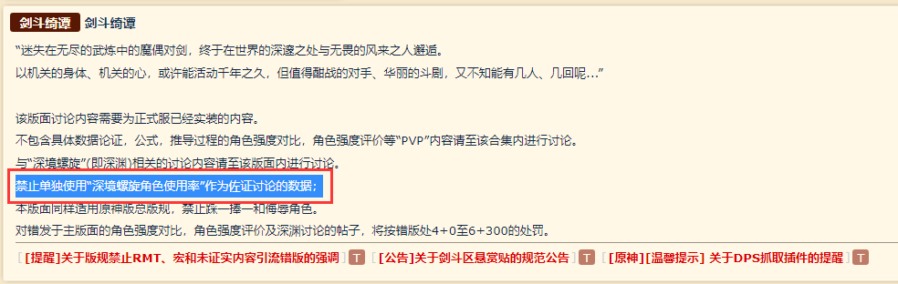

### [不吐不快]我就搞不懂了小程序使用率和角色强度有个毛关系

Made by ngapost2md (c) ludoux [GitHub Repo](https://github.com/ludoux/ngapost2md)

----

##### 0.[0] \<pid:0\> 2023-07-26 08:48:36 by 七宗罪之贪吃
先不说小程序那玩意写着8w多样本，我们有个群里参与统计的说是样本太少，2w多样本乘以三，他自己统计的自己都不全信。本来是看个乐的，但总有人把那玩意当成自己父亲

更有言论说什么使用率前列强度肯定高，真的厉害啊

我当时反问那个说这个话的人，说3.6-3.8三期深渊使用率前十妮露和香菱都上榜两次，所以这俩强度差不多？

他说是的。

然后我问他温迪使用率这么低他就菜？

他说是的，不如万叶一根

——————————————————————

最近总是容易火大，不知道是不是新玩家参与讨论越来越多的缘故，感觉资格证显得尤其重要

这年头大家一块聊机制数值的时候，聊得好好的，总有个晚餐突然窜出来问为什么某某使用率高使用率低，我们说6散强，就问问问使用率怎么才十几，跟个nt一样，还不止一个

还有什么胡桃使用率的图，艾尔海森使用率的图，草神使用率的图，心海使用率的图，有人在看乐子，有人在真拉踩

——————————————————————

最典的是使用率前列角色强度肯定高这个得好好说说

咱先抛开
“开发者不信”
“样本低”
“打榜的都是什么群体玩家”
“厨子有没有发力”
“打满了没”

我们再抛开
“角色命座和专武”
“当期环境影响”
“新角色影响”
“玩家box”

然后不谈
“培养成本”
“培养时长”
“常规配队及其变种”
“操作手法难易”
“数值和机制”
“多久打满的，凹了几次”

你说的何尝不是对的？

——————————————————————

更为经典的话术是：
“因为0命草神怎么怎么强，所以使用率在前面”

我觉得你“怎么怎么”的观点也许是对的，

但这句话必然是个充分不必要条件

充分不必要条件！

反推必然是错误的，更何况你的使用率也可能是假的呢

这是高一还是高二知识？忘了，自行恶补，要杠去找你的数学老师。

——————————————————————

此帖不指代任何人，就只是发表一下观点，最近被跳脸火气比较大，文章可能会情绪化

----

##### 1.[0] \<pid:704927892\> 2023-07-26 08:50:54 by sffgn
nag不是也最爱拿使用率来论坛pvp吗

----

##### 2.[0] \<pid:704928383\> 2023-07-26 08:53:25 by 七宗罪之贪吃
>[jump](#pid704927892) sffgn(2023-07-26 08:50) 说: 
>
>nag不是也最爱拿使用率来论坛pvp吗

----

##### 3.[0] \<pid:704928507\> 2023-07-26 08:54:10 by 早见初
好熟悉，剑斗车过

----

##### 4.[0] \<pid:704928727\> 2023-07-26 08:55:04 by 从入门到坐牢
为啥这个不在剑斗，那我会说会在乎这个，只有……
还没看穿米马上新机制再安排就业率的人才会在乎吧

----

##### 5.[6] \<pid:704928894\> 2023-07-26 08:55:54 by 这游戏真给我整沉默了
感觉回到了一年半前的剑斗
当时的说法我记得是
啊你不看使用率你看什么？身边体感统计学是吗

----

##### 6.[0] \<pid:704929022\> 2023-07-26 08:56:32 by arsppp
强度随环境变化，3.6-3.8环境都不一样了，那强度变化了也不奇怪

----

##### 7.[0] \<pid:704929216\> 2023-07-26 08:57:24 by 零点，陈彬
>[jump](#pid0) 七宗罪之贪吃(2023-07-26 08:48) 说: 
>
>先不说小程序那玩意写着8w多样本，我们有个群里参与统计的说是样本太少，2w多样本乘以三，他自己统计的自己都不全信。本来是看个乐的，但总有人把那玩意当成自己父亲
>
>更有言论说什么使用率前列强度肯定高，真的厉害啊
>
>我当时反问那个说这个话的人，说3.6-3.8三期深渊使用率前十妮露和香菱都上榜两次，所以这俩强度差不多？
>
>他说是的。
>
>然后我问他温迪使用率这么低他就菜？
>
>他说是的，不如万叶一根
>
>——————————————————————
>
>

还别说，充分不必要和必要不充分是集合论的东西，算是高一入学第一门课

----

##### 8.[2] \<pid:704929258\> 2023-07-26 08:57:33 by mebiusss
啊，那和什么有关嘛，米哈游用脚设计角色造的孽会被大众下深渊选人的时候用脚投票出来的

----

##### 9.[0] \<pid:704929400\> 2023-07-26 08:58:14 by UID60173942
这么不是被剑斗车烂的东西吗？以前还能拿竞速和使用率争一下，现在马杯都死了，不看使用率看什么？看嘴斗吗？

----

##### 10.[0] \<pid:704930034\> 2023-07-26 09:01:14 by aphemia777
希望不是借着车使用率给x下第一人招魂

----

##### 11.[0] \<pid:704930062\> 2023-07-26 09:01:22 by 不太好吃
使用率代不代表强度我不知道，我只知道经常跳起来说使用率不代表强度的是刚复刻池子里这位，其他使用率高的闭嘴不说话，使用率持续低迷的已经直接问xx角色是不是不行了

----

##### 12.[0] \<pid:704930136\> 2023-07-26 09:01:41 by 不再嘴硬
不然呢，大佬打出的一般人无法企及的竞速？偷球偷输出的excel？张嘴就来的厨子？
那我还是信使用率吧

----

##### 13.[0] \<pid:704930422\> 2023-07-26 09:02:53 by 海与风的礼物w
又想起宵下第一人的()

----

##### 14.[0] \<pid:704930805\> 2023-07-26 09:04:46 by 天使小飞飞
>[jump](#pid704927892) sffgn(2023-07-26 08:50)说:
>nag不是也最爱拿使用率来论坛pvp吗[s:ac:哭笑]

你这个是经典的以偏概全AOE话术。

你可以拿nga某某个例来说事。
但是有一个规则请牢记

----

##### 15.[0] \<pid:704931239\> 2023-07-26 09:06:44 by Clintha
不说使用率跟强度有多大关系吧，你都能说成“有毛”关系了，那我真不知道有什么东西能评判强度了

----

##### 16.[1] \<pid:704931518\> 2023-07-26 09:08:02 by 随便看个乐子
srds，两万样本数可不算少，你知不知道很多新药研发的上市前临床试验一般也就几千几百个样本。

----

##### 17.[0] \<pid:704931789\> 2023-07-26 09:09:13 by AkariYu3310
~~我覺得大眾競速榜和使用率含金量比較高~~

----

##### 18.[0] \<pid:704931887\> 2023-07-26 09:09:38 by 懂不懂薄纱啊
>[jump](#pid704930805) 天使小飞飞(2023-07-26 09:04)说:
><b>Reply to [pid=704927892,37139786,1]Reply[/pid] Post by [uid=65112034]sffgn[/uid] (2023-07-26 08:50)</b>  你这个是经典的以偏概全AOE话术。  你可以拿nga某某个例来说事。 但是有一个规则请牢记 [img]https://img.nga.178.com/attachments/mon_202307/26/l2Q2s-bwj1K1eT3cSrc-8o.png[/img]

那可以用出场率吗？我觉得每期深渊的平均出场率才是证明一个角色是否泛用及强度，使用率看起来没啥用

----

##### 19.[0] \<pid:704931912\> 2023-07-26 09:09:47 by 零点，陈彬
>[jump](#pid704931518) 随便看个乐子(2023-07-26 09:08) 说: 
>
>srds，两万样本数可不算少，你知不知道很多新药研发的上市前临床试验一般也就几千几百个样本。

这可以比的吗二游卡要卖钱的啊，样本数一是持有率，而是配队出伤能力，这和新药八竿子打不着吧，原玩家基数都多少了？这能和药品比？

----

##### 20.[0] \<pid:704931943\> 2023-07-26 09:09:55 by 已经成为了一种笑话
使用率不代表强度，但是使用率高的，一定是玩家用着最舒服的，也就是说，使用率是推荐抽取的参考

----

##### 21.[2] \<pid:704932190\> 2023-07-26 09:11:05 by Tartaglia_11th
直接说了，大部分人没有能力去分析一个角色强弱，只能拿着使用率从结果推原因，复读几句江湖术士的p话

----

##### 22.[1] \<pid:704932617\> 2023-07-26 09:13:03 by 诗酒趁年华-狼人
个人感觉，
使用率高的角色在当时的深渊环境下，强度肯定是不弱的。
如果一个角色在多个深渊里，使用率都比较高，那他强度肯定不低。

----

##### 23.[0] \<pid:704932794\> 2023-07-26 09:13:53 by 羲一望
使用率榜是掺和了厨力和强度的综合榜单。
能排名靠前的，不一定是最强，但一定不弱。

----

##### 24.[0] \<pid:704932887\> 2023-07-26 09:14:20 by 天使小飞飞
>[jump](#pid704931887) 懂不懂薄纱啊(2023-07-26 09:09):

出场率、使用率、舒适度、竞速成绩、等等，都是一个意思。
单从一个维度判定强度，那么可不都是盲人摸象？

----

##### 25.[0] \<pid:704933146\> 2023-07-26 09:15:26 by Kaekaekae
使用率低的不一定弱，但使用率高的一定不弱

----

##### 26.[0] \<pid:704935837\> 2023-07-26 09:27:22 by 呙邱邱
使用率第一档的角色要么是当期优势要么是一直稳坐第一档的强度卡……总的来说不都挺好用的嘛。
使用率低肯定有它的理由，凹度，低命强度多少有关系。

----

##### 27.[0] \<pid:704936878\> 2023-07-26 09:31:56 by 随便看个乐子
>[jump](#pid704931912) 零点，陈彬(2023-07-26 09:09):

我只是拿新药做个例子，说明2w的样本量并不算小，连这种要求极为严格、关乎到患者生命安全的研究都可以承认几千几百样本量呈现出来的结果并应用到临床，你个破游戏2w样本量呈现出来的使用率怎么就一文不值了？
当然我也不认为使用率完全等同于强度，毕竟强度这个概念很泛，但使用率反映了当期12层深渊的好用与性价比程度个人觉得没啥问题。
使用率就类似于应试教育的考试成绩，聪明人未必都适合应试教育，分数低未必就是笨，但分数高能考上清北的基本脑子都挺好使的。

----

##### 28.[0] \<pid:704939498\> 2023-07-26 09:43:32 by 四叶_雨
我还以为这里是剑斗
以及小助手使用率样本之前不是4w吗，现在怎么2w了

----

##### 29.[0] \<pid:704941273\> 2023-07-26 09:50:55 by 柒月霜飞1
使用率怎么也比狗屁竞速更能代表强度。竞速比的是出伤速度、出伤方式、手法以及当期深渊怪适配情况。使用率在这些的基础上，还受到舒适程度以及手法圣遗物较差的情况下的容错的影响。如果你觉得使用率不能代表强度，那就别吹狗屁竞速成绩

----

##### 30.[0] \<pid:704942836\> 2023-07-26 09:57:05 by ghlki
你想说明什么 是香菱确实比妮露强还是零命草神弱

----

##### 31.[0] \<pid:704943337\> 2023-07-26 09:59:07 by tag一定要打对真菌
这个不是剑斗的话题吗

----

##### 32.[0] \<pid:704951470\> 2023-07-26 10:33:01 by 霜伊丶
使用率在相当程度上就是代表强度，觉得不代表的只能认为是你推使用率持续低迷

----

##### 33.[0] \<pid:704963650\> 2023-07-26 11:17:21 by 七宗罪之贪吃
>[jump](#pid704951470) 霜伊丶(2023-07-26 10:33) 说: 
>
>使用率在相当程度上就是代表强度，觉得不代表的只能认为是你推使用率持续低迷

哈哈，现成的

----

##### 34.[0] \<pid:704964068\> 2023-07-26 11:18:49 by cbzmxx
来人，上文案语录！

----

##### 35.[0] \<pid:704965301\> 2023-07-26 11:23:18 by Extrawdw
发剑斗zsbd

----

##### 36.[0] \<pid:704966691\> 2023-07-26 11:28:05 by 木原光
()()很重要吗，只有()()才会在意吧
嗯说点正经的，，只能说现在好多新玩家是这样的就嗯看使用率觉得就是强度，只能说放下劝说，直接摆烂罢
和闷在头套看头套里世界的人讲话是没有办法的口牙

----

##### 37.[0] \<pid:704970728\> 2023-07-26 11:42:43 by 季柚
xp抽卡打深渊的就这么少吗一直不理解玩个二游怎么抽卡还要按着风评走了 是资格证真就那么重要还是其实哪个角色都没吸引到所以抽谁都无所谓了

----

##### 38.[0] \<pid:704970842\> 2023-07-26 11:43:09 by 舔狗2
两年前我在剑斗看人车使用率，两年后我在理查看人车使用率，历史是个圆啊
认真的说，强度是个很宽广的概念，使用率确实代表不了全部，但是把使用率高当成强度高的论据我觉得没什么问题
你觉得ch给优菈量身定制个木桩子，优菈的使用率到得了97.8吗？

----

##### 39.[1] \<pid:704983868\> 2023-07-26 12:36:54 by 我是连连aa
你的高中数学成绩一定很差

----

##### 40.[0] \<pid:704985564\> 2023-07-26 12:44:33 by 司空萌萌
先说你想车的是统计方法还是样本不够

