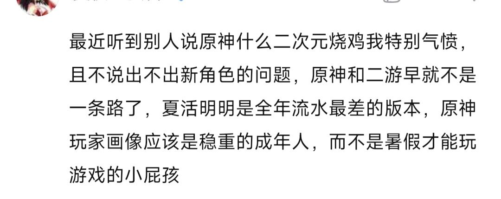

### [不吐不快] 氵，我一直觉着米家的感情戏写得很有一种熟悉感

Made by ngapost2md (c) ludoux [GitHub Repo](https://github.com/ludoux/ngapost2md)

----

##### 0.[1] \<pid:0\> 2023-07-26 09:33:23 by Yau1968
观昨天猛子哥说的爱恨情仇有感从三泵子开始就这样，仿佛是为了写冰清玉洁唐三少的一往情深所以才描写一个成为了神女白月光(虽然后来又复活了)的小舞一样  些这种深情戏码就是为了展示 啊，多么深情多么优秀多么有魅力   但是这种为了给剧情里干大事有大志的人增加一点细嗅蔷薇的细腻情感却往往因为用力过猛变成了现在奥托和赤王 某种意义上也包括星冰乐 给人的感觉一种观感：把大伙儿都搅进来就为了这点b事啊？   
所以虽然我不嗑那奥樱莲三个角色之间或者内部的任何一对组成CP爷更不是他们谁的ml党 我都觉得 这个奥子哥一往情深的设定笼罩之下他们相关的剧情仿佛都变low了点 
42朋友对此的评价是：仿佛对着纯圆皇后自以为是地陷入到了自己深情帝王爱美人也爱江山的人设里的甄嬛传老皇帝 怪到位的

----

##### 1.[5] \<pid:704937940\> 2023-07-26 09:36:31 by 香槟买好了就等
是这样的，事实就是爱情驱动的剧情经常给观众一种空虚感，能为了小爱做圣人也能为了小爱做魔鬼，从而伤害角色的形象和自洽性。这和性向啊ml啊都没什么关系。

----

##### 2.[0] \<pid:704938775\> 2023-07-26 09:40:09 by arsppp
所以只有大纲和前瞻pv能吸引人，一到具体展开必拉胯，从开服到现在的剧情，都是如此

----

##### 3.[1] \<pid:704939097\> 2023-07-26 09:41:40 by 肌肉壮汉
有一说一，商业游戏写桥段不就是为了卖才写吗，卖卡或者增加讨论度啥的，大家都是打工人哪会对工作内容真的充满感情

----

##### 4.[0] \<pid:704939428\> 2023-07-26 09:43:13 by Yau1968
>[jump](#pid704937940) 香槟买好了就等(2023-07-26 09:36)说:
>是这样的，事实就是爱情驱动的剧情经常给观众一种空虚感，能为了小爱做圣人也能为了小爱做魔鬼，从而伤害角色的形象和自洽性。这和性向啊ml啊都没什么关系。

确实，不是说人物的动机是儿女情长不行，比如最近的纸嫁衣主人公出发点就是爱情但是那是因为人本来一开始也就是为了守护对象 为爱而勇敢是契合的但是&amp;#8482;的编剧老喜欢先给你看一个看起来胸怀天下很有格局很有理想的人设 然后后来悄咪咪凑到你耳朵旁跟那种八卦长舌妇一样：唉你知道吗 其实他是为了某个爱人 是不是觉得他很细腻很铁汉柔情 但给我的感觉只是：格局小了 而且由于这种模式化流水一样的嗯造个死了的白月光过于重复且空洞 只觉得这人境界也就这样了

----

##### 5.[0] \<pid:704939859\> 2023-07-26 09:45:04 by 最爱吃是月饼
奥拓凯文都是这样的皮套，你要代入崩三主角憋屈的不行。女角色全程被两个男牵着鼻子走

----

##### 6.[4] \<pid:704939974\> 2023-07-26 09:45:29 by 厂厂菜
从这些编剧的岁数也能看出来受什么风格影响，没有男女情爱就走不动路了是这样，一款呼吸机
这么老套自嗨的剧情还以为自己写的多超凡脱俗

----

##### 7.[1] \<pid:704941873\> 2023-07-26 09:53:17 by 冬日霜露
一边喜欢万物转感情戏，一边“这事很重要吗，只有xx会觉得这事很重要吧？”

----

##### 8.[2] \<pid:704942165\> 2023-07-26 09:54:25 by 今锁朱楼
一说感情戏，有些话就不得不说了。
无论是海卡还是散草，从正经cp来看，都是女频非常常见且经典的设定：一个是霸娇，一个是温和师尊搭配疯批徒弟的救赎系。
但他写的这些设定，在女频发表会被车的更烂。
女频读者其实一直比大众想的要更精神洁癖，从角色设定到敏感话题，一旦沾上一点就会掀起无尽的车轮战。比如海卡，卡维的偷拿舍友东西、希望债主免除欠款等，在女频是会被骂 现在什么东西都能当主角(此为真实案例)的。散草的岁月史书就更不用说了，我估计一发表就有人去举报了。
另一方面，二次元其实比大家想得要更宽容。至少二次元你写各种设定是更容易被接受的。我一直说米哈游的去ml化是步绝对的臭棋，ml从来不是累赘，相反它可以是一切缺陷的遮羞布。剧情有问题？没关系，卖ml就可以了。人设有问题？没关系，卖ml就可以了。强度有问题？没关系，卖ml就可以了。以上三点在你游都是可以找出实例的。我本人并不是ml爱好者，我反而更爱好磕cp，但客观来讲，我说不出 ml应该被淘汰 这种话，ml是二游摸索了十几年摸索出来的路，是无数二游的立身之本，米哈游扔了它，是在斩断自己的根基。

----

##### 9.[0] \<pid:704942506\> 2023-07-26 09:55:45 by 哲学家萨尔
我觉得他们就是想看玩家尖叫抓挠，单纯的喜欢狗血爱情只是品味low，但你米则是纯纯的坏

----

##### 10.[0] \<pid:704943026\> 2023-07-26 09:57:51 by 我流伦子哥
他们的品位太复古了，现在大家生活都挺累的，不太爱看要死要活和不专一乱七八糟的爱情，还是一眼秒懂知己知彼的灵魂伴侣好味。连自己心意都不清楚，感情生活都处理不好的那种，我通常叫它贵物

----

##### 11.[0] \<pid:704943610\> 2023-07-26 10:00:19 by 河煌月夜
难道没人说他们的cp戏真的写的很烂吗？感觉跟乌贼的感情戏有一拼。

----

##### 12.[1] \<pid:704943778\> 2023-07-26 10:01:08 by 江之岛
这就是央视锐评当代古装剧的“有情无义，有仙无侠”啊，没有江山社稷苍生百姓，只有为狗血情爱作天作地，我一个从小爱看武侠剧的都好多年没看过了

----

##### 13.[0] \<pid:704944415\> 2023-07-26 10:03:49 by 鱿格索托丝
因为写的不是真的感情戏
米自己写的这种爱情设定本质上就是个挂件，类似大男主网文里的女主，推动剧情的挂件罢了，就是告诉你：a喜欢b，所以为了b，a要去做这些事情
真写感情戏，人物感情前因后果，双方个性的冲突调和与否，情感变化的阶段，全部都要讲清楚

其实在赤树花里不能只看赤花，花的形象本来就是扁平的，是为了塑造赤和树两个人，没怎么单独描写过，我觉得三个人放在一起是塑造得不错的组合，但拿赤花出来说爱情就完全不行。“爱情”这个点基本只是赤王的塑造而已

不要说都是写感情戏写多了的错，这写的感情戏根本就是垃圾

----

##### 14.[0] \<pid:704944650\> 2023-07-26 10:04:59 by 四叶_雨
崩我没有怎么管过人气~~单机看看剧情的~~就不点评了，在你原人气高的角色虽然不是全部，但大部分时候也不是靠那爱恨情仇才有高人气的啊。真当大家满意的是你那cp描写/大乱炖啊，你米炒cp总是突出一个空有标签写的和坨x似的~~不说全部但最近米想推的大部分给人这个感觉~~，该有的描写总是留白，情绪转变像是有情节指标似的，写的烂成这个鬼样真以为谁买单呢文案赶紧滚出来给你们建模组和音乐和美术磕10个头吧，真把自己当什么了不起的东西了呢

----

##### 15.[1] \<pid:704944907\> 2023-07-26 10:06:09 by EIVAAAA
怎么讲，我现在看到mhy反复讲雷五讲了三年都没讲清楚还打算继续讲下去就感觉最后雷五故事结束后玩家反应大概是“你就为了这点B事啰嗦了几年？”

----

##### 16.[0] \<pid:704947296\> 2023-07-26 10:16:20 by 雨源rainsource
文案都自爆说往偶像剧的方向写的，偶像剧能有什么好感情戏

----

##### 17.[0] \<pid:704947830\> 2023-07-26 10:18:33 by Yau1968
>[jump](#pid704943778) 江之岛(2023-07-26 10:01)说:
>这就是央视锐评当代古装剧的“有情无义，有仙无侠”啊，没有江山社稷苍生百姓，只有为狗血情爱作天作地，我一个从小爱看武侠剧的都好多年没看过了

怎么说呢 我姑且觉得米在些有几个角色的感情戏的时候真的是想写成靖蓉那样有大义也怀小情的 但是不知道是因为腌入味了还是怎么的  写出来的效果就很轻小说疼痛青春文学  角色不是增加人物细腻度的反而是把立意往低了拉的

----

##### 18.[0] \<pid:704947922\> 2023-07-26 10:18:55 by 鸣神映鸦
原不论，崩当时硬给奥托这畜牲整深情人设的时候我就想吐槽了：这畜牲东西写爱情是为了洗谁？到了短片更离谱，把幽兰黛尔自机角色的资源直接吃掉卖人渣的狗血三角恋，自以为深情的演了一大桶之后给人感觉就是这逼东西死一下就为这点事给大家煮屎啊？

----

##### 19.[0] \<pid:704949615\> 2023-07-26 10:25:40 by 红绳会太子
双向奔赴的感情它不香吗，樱莲互相爱恋心意相通多好，非得一直画大篇幅写奥托自我感动的单恋，官方自己也玩绿帽梗上瘾。非得所有人都看你那sb三角恋是吧

----

##### 20.[1] \<pid:704951627\> 2023-07-26 10:33:37 by 阿芙乐尔斯
奥托一边卖背着卡莲棺材深情人设，一边撩骚未成年李素裳，有唐三一边消费自己去世老婆一边搞粉丝那味了

----

##### 21.[1] \<pid:704953307\> 2023-07-26 10:39:57 by 我爱吃斯内克
不就是古偶仙侠剧么……看到一群什么神人仙人转世来回埋葬苍生来满足自己的爱爱恨恨就生理想吐

----

##### 23.[0] \<pid:704956813\> 2023-07-26 10:52:38 by 汐汐漓漓
你也觉得像唐三啊，我昨晚和朋友讨论了一波也觉得(或许连唐三都不如，因为主角这升级流也走得不爽

无尽的学院争霸赛-&gt;无尽的写论文
嘴上说着纯爱但是就是要卖奇怪的单箭头来造热点多头吃都没写好-&gt;又要买ml又要买cp多头吃结果哪儿都没写好
站在道德制高点约束配角，对自己烧杀抢掠和修疑似反派的功法毫无心理负担-&gt;某典王对须弥人和对其他的双标
前期嗯造伏笔后期一个没收-&gt;推荐信、蒙德璃月埋的须弥伏笔等

感觉有种他们自己内部很high但是观感稀烂的美

----

##### 24.[0] \<pid:704984049\> 2023-07-26 12:37:43 by Yau1968
>[jump](#pid704956813) 汐汐漓漓(2023-07-26 10:52)说:
>你也觉得像唐三啊，我昨晚和朋友讨论了一波也觉得(或许连唐三都不如，因为主角这升级流也走得不爽  无尽的学院争霸赛-&gt;无尽的写论文 嘴上说着纯爱但是就是要卖奇怪的单箭头来造热点多头吃都没写好-&gt;又要买ml又要买cp多头吃结果哪儿都没写好 站在道德制高点约束配角，对自己烧杀抢掠和修疑似反派的功法毫无心理负担-&gt;某典王对须弥人和对其他的双标 前期嗯造伏笔后期一个没收-&gt;推荐信、蒙德璃月埋的须弥伏笔等  感觉有种他们自己内部很high但是观感稀烂的美

草 你这么一说确实啊 不只是感情线战斗升级等方面的剧情也是烂得如出一辙 这下斗罗特大陆了

----

##### 25.[0] \<pid:704984880\> 2023-07-26 12:41:18 by 普鲁士蓝蓝蓝
他妈的，那个写出千年千岩、戴因三问和利露帕尔故事的编剧去哪了？狗屎

----

##### 26.[0] \<pid:705073302\> 2023-07-26 19:30:54 by asccccc
>[jump](#pid704947922) 鸣神映鸦(2023-07-26 10:18) 说: 
>
>原不论，崩当时硬给奥托这畜牲整深情人设的时候我就想吐槽了：这畜牲东西写爱情是为了洗谁？到了短片更离谱，把幽兰黛尔自机角色的资源直接吃掉卖人渣的狗血三角恋，自以为深情的演了一大桶之后给人感觉就是这逼东西死一下就为这点事给大家煮屎啊？

无非是代入问题罢了，我对百合无感，倒觉得奥托挺爽的，论大局没奥托的推动主角团根本成长不起来，论感情奥托死之前也达成心愿了，从头到尾就是按自己的心意做事，旁观来看有好有坏，这才是正常。
我不同意楼主观点，我倒觉得奥托凯文和前一代英杰挺有大局的，反而是主角团儿女情长毫无格局

----

##### 27.[0] \<pid:705075602\> 2023-07-26 19:43:44 by 就爱看乐子
我只想说米能不能出去看看，现在电视剧有后宫贵乱古偶吗？现在都是男女1v1，配角单箭头形式的

----

##### 28.[0] \<pid:705076163\> 2023-07-26 19:46:00 by 小鸽白尼
你看他们还要上大龄二次元找对象的，像是会写自然感情戏的吗，怕不是都取材自晋江

----

##### 29.[1] \<pid:705076326\> 2023-07-26 19:46:43 by xlsq03
我说一个眼熟的

花千骨

----

##### 31.[1] \<pid:705077725\> 2023-07-26 19:52:42 by mASAYUMecHASIN
>[jump](#pid704942165) 今锁朱楼(2023-07-26 09:54):

比如说ml里塑造问题最大的绫华，绫华因为ml被骂绿茶，我只会更心疼她，绫华有什么错呢？她只是被five编剧害了，塑造被影响也是因为想跟主角贴贴，更可怜了
但是对着散草海卡，难道我不知道都是five编剧写出来的稀烂剧情垃圾人设吗？我知道啊，可是因为我不会把他们当自己人，所以我看到他们被骂，我不会产生任何怜惜之情，我会：骂的好，怎么能有这么烂的纸片人，为什么不把他删了呢？把他删了对大家都好

----

##### 32.[0] \<pid:705078009\> 2023-07-26 19:54:02 by 就爱看乐子
>[jump](#pid705076163) 小鸽白尼(2023-07-26 19:46) 说: 
>
>你看他们还要上大龄二次元找对象的，像是会写自然感情戏的吗，怕不是都取材自晋江

晋江绝对男德，哪来这么多箭头

----

##### 33.[0] \<pid:705079854\> 2023-07-26 20:03:46 by 香槟买好了就等
>[jump](#pid705077574) asccccc(2023-07-26 19:52) 说: 
>
>事实上你和楼主对奥托人设有误解，他从一开始就是一样的目的，也谈不上什么天生格局大，奥托真要是那种只为天下苍生的类型，那就该改名奥托英雄传当正面人物，而不是现在琪亚娜他们主角团的故事，他从身世开始就不是写侠之大者的主角的，定位也不是郭靖，擅自期待再擅自失望很无聊
>小爱不是问题，逻辑自洽最重要，大格局写的不够好并不比小爱高贵，我认为剧情问题反而在于主角团开挂明显，为了卖卡百合贴贴强行提升，这才是格局不够

不是，我不认识奥托，只是空泛地谈一下对一些当代虚构类作品的感想

----

##### 34.[0] \<pid:705081740\> 2023-07-26 20:15:18 by Yau1968
>[jump](#pid705077574) asccccc(2023-07-26 19:52)说:
>[quote][pid=704937940,37140288,1]Reply[/pid] <b>Post by [uid=65209497]香槟买好了就等[/uid] (2023-07-26 09:36):</b>  是这样的，事实就是爱情驱动的剧情经常给观众一种空虚感，能为了小爱做圣人也能为了小爱做魔鬼，从而伤害角色的形象和自洽性。这和性向啊ml啊都没什么关系。[/quote]事实上你和楼主对奥托人设有误解，他从一开始就是一样的目的，也谈不上什么天生格局大，奥托真要是那种只为天下苍生的类型，那就该改名奥托英雄传当正面人物，而不是现在琪亚娜他们主角团的故事，他从身世开始就不是写侠之大者的主角的，定位也不是郭靖，擅自期待再擅自失望很无聊 小爱不是问题，逻辑自洽最重要，大格局写的不够好并不比小爱高贵，我认为剧情问题反而在于主角团开挂明显，为了卖卡百合贴贴强行提升，这才是格局不够

我的意意思就是这个啊 爱情驱动，可以，但是感情塑造的空白+气氛都烘托到这里了.jpg 在各种跟爱情线好像并没有什么卵联系的搞大新闻 就让我感觉这个人的格局太小了我并不是抨击情情爱爱 我是觉得这个东西，你写不好，还搭上了本来撑起这个角色格局的可能空间，就很low 事业线感情线双low  以及我这吐槽的重点在于她的感情线目的过于明显了，是啊这是任务我知道 但是能不能别像写散兵三次背叛以及那个小猫动画一样摁着我的头“快，觉得他惨”地向我展示“看，这个男人多么深情”

----

##### 35.[0] \<pid:705083784\> 2023-07-26 20:27:23 by 寅吴卜壬蔡莫
我说实话你米一旦想卖就是彻底的崩，同人女喜欢的是两方人设都有自己的理想自己的事业都为了自己的理想奋斗过程中产生的摩擦冲突也好合作信任也好，这才样有张力，你米一卖就是ta爱ta爱的要死要活的生活中都得全是ta跟国产烂剧没两样，就我是钟推我也得说，有人夸若钟若卖的好，我在没出传说二以前是真有期待的，我期待的是龙王曾经和钟离签订契约帮钟离，但是稳定后因为钟离的人类子民挖矿伤害了龙蜥为了龙蜥子民和钟离一战最后被封印，结果文本一出来你告诉我单纯的人类挖矿把他挖疯了，其实他超爱，龙蜥子民呢who cares我作为钟推我肯定对这种他超爱没意见，但是cp是真没法磕，就庆幸若陀没落地吧，当个npc还能有滤镜，真落地按米卖cp的尿性钟离也别看了

----

##### 36.[0] \<pid:705083920\> 2023-07-26 20:28:14 by 沆瀣一气zex
那隔壁能表演一下那个吗？就是那个——复活吧！我的爱人！！！

----

##### 37.[0] \<pid:705084949\> 2023-07-26 20:34:24 by 云老王协会
我比较好奇的是这一波爆典之后隔壁会不会改剧情啊？那种事情不要啊，我是真想看看猛干哥给大伙准备了什么样的爱恨情仇越狗血古偶越好，反正我退了只想看乐子，猛干哥会硬气地坚持自我吗？

----

##### 38.[0] \<pid:705086039\> 2023-07-26 20:41:05 by 云天间
>[jump](#pid704942165) 今锁朱楼(2023-07-26 09:54) 说: 
>
>一说感情戏，有些话就不得不说了。
>无论是海卡还是散草，从正经cp来看，都是女频非常常见且经典的设定：一个是霸娇，一个是温和师尊搭配疯批徒弟的救赎系。
>但他写的这些设定，在女频发表会被车的更烂。
>女频读者其实一直比大众想的要更精神洁癖，从角色设定到敏感话题，一旦沾上一点就会掀起无尽的车轮战。比如海卡，卡维的偷拿舍友东西、希望债主免除欠款等，在女频是会被骂 现在什么东西都能当主角(此为真实案例)的。散草的岁月史书就更不用说了，我估计一发表就有人去举报了。
>另一方面，二次元其实比大家想得要更宽容。至少

别尬黑别的二游早就不配和原神相提并论了，ml什么的人家瞧不上，人家有自己的路

----

##### 39.[0] \<pid:705086727\> 2023-07-26 20:45:04 by 子夜歌QAQ
我觉得还是写的太烂的问题
谈谈我对ml和CP的看法吧，我觉得最好的模式是那种多讲角色自己能让主角参与的故事，角色本身对主角的态度是那种比较合适的亲切而不亲热，和其他角色的互动点到为止，更多的可以放在彩蛋里。CP粉去自己挖彩蛋里的互动，自己抠的糖比贴脸上的工业糖精好磕多了；抽回来的角色本身就不要和其他角色搞比较深的互动了，就主要展示角色自己，也别对主角太殷勤，让单纯喜欢角色本身的单推人别被CP或者对主角的好感膈应到；对主角亲切而不殷勤的态度也能让ml党不被冷淡的态度伤到，点到为止留点白，剩下的让二创和玩家脑补完成

----

##### 40.[0] \<pid:705141597\> 2023-07-27 04:52:44 by too_nyuu
>[jump](#pid704947296) 雨源rainsource(2023-07-26 10:16) 说: 
>
>文案都自爆说往偶像剧的方向写的，偶像剧能有什么好感情戏

乳偶像剧了
以前的偶像剧确实很能打，出问题的是现在的国产偶像剧

