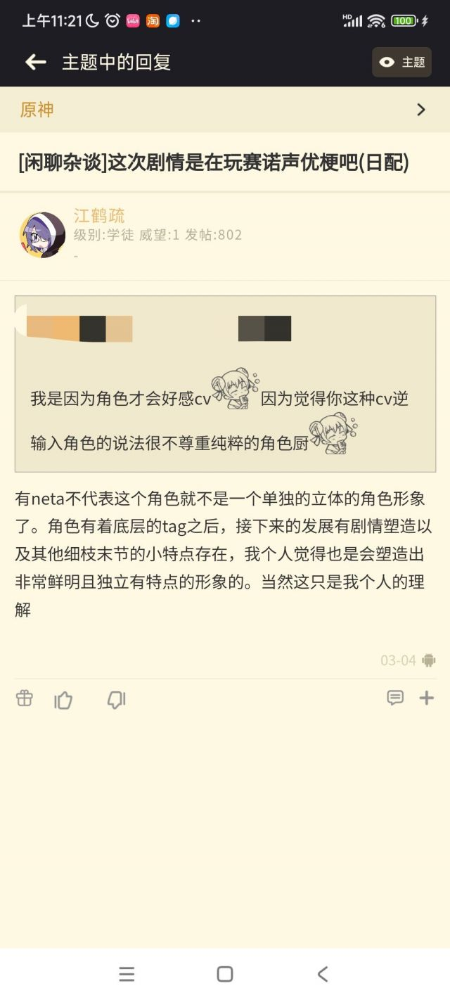
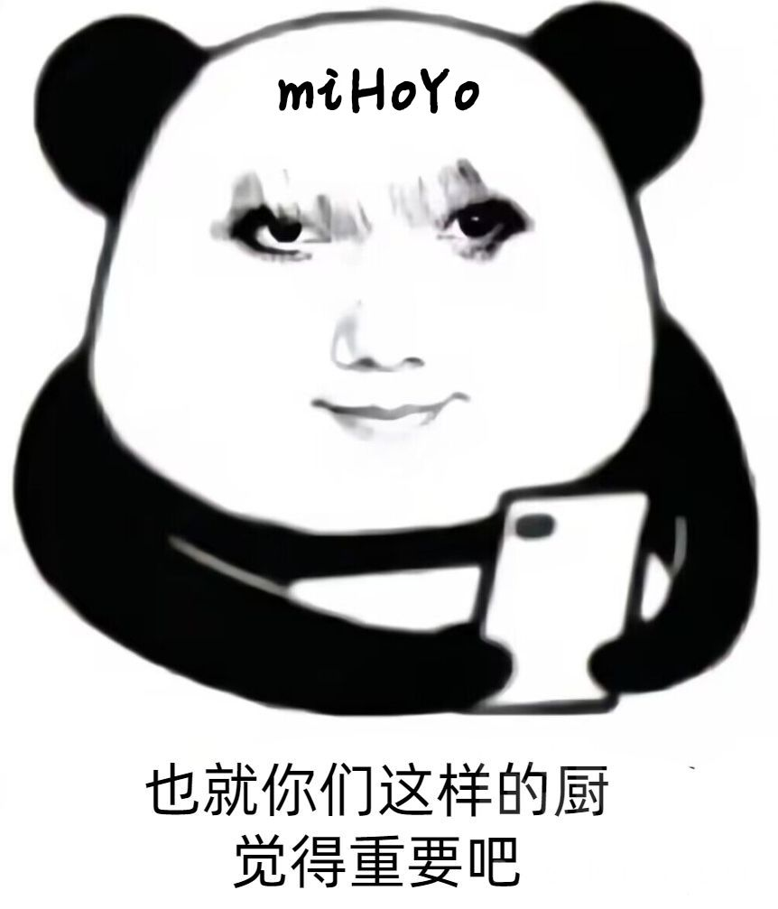

### [不吐不快]又想起来我之前跟厨子的辩论

Made by ngapost2md (c) ludoux [GitHub Repo](https://github.com/ludoux/ngapost2md)

----

##### 0.[0] \<pid:0\> 2023-07-26 11:35:39 by 江鹤疏
首先亮个身份，声优厨，早期足迹就开始有好感的赛诺厨
之前赛诺在蒙德活动的时候有过一次说喜欢龙和牌嘛，于是有人顺理成章的开贴说是不是有声优梗，毕竟确实配过牌佬。主要我是纯的声优厨，于是就针对角色几个共同点分析了一下，毕竟之前就知道米哈游编剧在崩三玩过z4梗，比如一飞冲天啊我和锵锵锵，成就条里面又有胜利的方程式这个明显的台词neta，在我看来，角色有neta的角度是很合理的，毕竟编剧曾经露出过自己的成分。但是就有厨子当时是这种看法
但是当时我感觉就像是米哈游编剧会经常玩梗，塞neta到角色里也不像是做不出来的事，毕竟当时还有散厨一天到晚标榜自己推是neta的eva来碰瓷呢。当然也有厨子会更希望自己喜欢的角色就是独一无二的，我也理解，所以当初我也觉得说不定是我自己表露的情绪太过激了，确实不太好。
但昨天晚上爆出来有角色直接原型是c罗，我直接就没绷住，有的时候真的回旋镖太多了，毕竟被说过分析neta是不尊重角色，可是有没有可能是<b>米哈游自己都没想着要尊重角色</b>，厨子在他们眼里只是“只有你们才会关心吧”这种存在，角色的创造在他们眼里说不定只是把自己和自己喜欢的角色二创出来的存在。甚至于角色原型至少可能是二次元角色而不是有黑点和自己套皮这点让我有点安心了起来。
已经累了，辩论什么的现在已经不想做了，就当是一个前玩家最后的牢骚吧，只能说上辈子坏事做尽，这辈子在米哈游厨角色吧。

----

##### 1.[0] \<pid:704969922\> 2023-07-26 11:39:46 by 鸣神映鸦
唉，这种事情很重要吗？只有我们这样的角色厨会在意吧

----

##### 2.[0] \<pid:704970558\> 2023-07-26 11:42:06 by poetry_瑾辞
&quot;笔在别人手上&quot;

----

##### 3.[0] \<pid:704972234\> 2023-07-26 11:48:23 by piepiero
不得不说大猛老师这句真情流露真的解决了我的很多疑问

为什么岩系一年没新角色
也就你这样的岩厨觉得重要吧
为什么能随便吃书改文案
也就你这样的世界观厨觉得重要吧
为什么要随便给角色加neta
也就你这样的角色厨觉得重要吧
为什么一个角色能五百天不复刻
也就你这样的优菈厨觉得重要吧
…
以不变应万变，我大猛老师不愧是文案组扛把子

----

##### 4.[2] \<pid:704972503\> 2023-07-26 11:49:24 by 疯狂de兔子n
以后用这个图回怼魔怔厨，万金油

----

##### 5.[2] \<pid:704973159\> 2023-07-26 11:52:09 by 食茄少年
我是不介意玩声优梗或者角色设计一些梗什么的，但首先他原本的人设要够好吧，你看赛诺这剧情和强度能昧着良心说一句好吗？

----

##### 6.[0] \<pid:704975422\> 2023-07-26 12:00:58 by 燕国地图
啊？！所以你是冒犯了他什麽，我觉得两者并没什麽冲突，就看到什麽都来咬一口是吧你就当他是玩原神玩的

----

##### 7.[0] \<pid:704976070\> 2023-07-26 12:03:28 by 残血之殇
梗要在原本有人设的基础上再来说锦上添花
米现在只会复读哪来的人设

----

##### 8.[0] \<pid:704976851\> 2023-07-26 12:06:50 by 江鹤疏
>[jump](#pid704973159) 食茄少年(2023-07-26 11:52) 说: 
>
>我是不介意玩声优梗或者角色设计一些梗什么的，但首先他原本的人设要够好吧，你看赛诺这剧情和强度能昧着良心说一句好吗？

所以我现在润了目前所有的塑造基本上就指向了冷笑话王和卖七圣召唤工具人，再继续玩下去就不礼貌了

