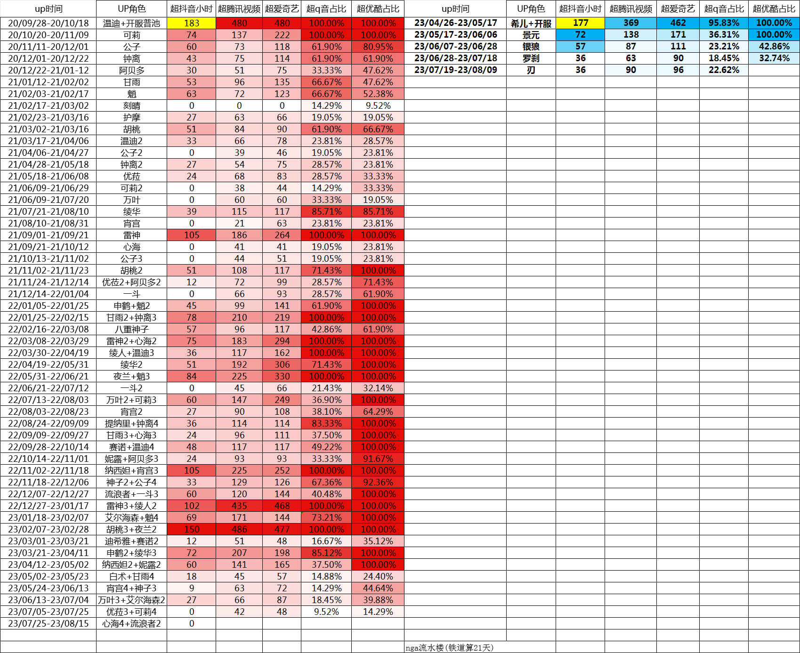

### [热点事件] 核算一下，散兵让米哈游少盈利了多少

Made by ngapost2md (c) ludoux [GitHub Repo](https://github.com/ludoux/ngapost2md)

----

##### 0.[0] \<pid:0\> 2023-07-26 14:10:23 by shi态
数据源[url](https://bbs.nga.cn/read.php?tid=37081813&amp;page=239) 4771楼
&amp;#8203;

纳西妲+宵宫3合计超抖音105小时，并且可以推测流水几乎全都是纳西妲的(宵宫2超抖音27小时，宵宫4+神子3是9小时，并且宵宫复刻也就过去两个版本光速复刻，抽宵宫的人更少)，也就是纳西妲首发自己就超了抖音100个小时
下面引用提瓦特小助手的84534人的数据。
万叶是全限五持有率最高的角色，高达95.2%。首发超抖音0，那时候风评还很差，称为小砂糖。万叶2+可莉3是60小时，几乎都是万叶的(可莉2,4全是0小时，就开服时首发高)，万叶3+海森2 27小时，估计一半给15小时万叶(海森+魈可是有69的)。实际上就是，万叶的命座很低，平均0.22命(命座以0为基础，没有这个角色的人不去平均)，对应的就是流水也比较低
夜兰，目前全游戏最强角色之一，小助手持有率80.9%全限5第三。胡桃3+夜兰2合砍150小时，胡桃2是51小时，那夜兰也差不多是80小时的，这比夜兰首发还高了(夜兰+魈384小时，夜兰应该占50~60小时)。平均命座0.66命，是万叶的三倍，超抖音时间也是万叶的两倍，算是比较合理的数值
雷神是持有率第四高的角色，79.8%持有率，平均命座0.82限五最高。同样的雷神单人首发105小时；雷神2+心海2是75小时，心海几乎没氪金量(心海首发+3+4营收都不高)那雷神2也有70小时左右；雷神3+绫人102小时，雷神约占70小时(绫人+温迪3是36小时，绫人可以按30小时算)
那么，持有率前4中的3个，其流水超抖音的变化为：
<b>万叶：0-60-15
夜兰：50-80
雷神：105-70-70</b>
万叶夜兰是早期风评不如砂糖行秋，后续大量人才知道强度，所以复刻流水高；雷神是首发就知道强度所以抽的人多，后续新人和补命座的也不少，但是首发就抽得差不多了。
那么，我们持有率第二，平均命座0.55，首发100小时的纳西妲，在3.3+3.6大两个雷之后，是什么情况呢？
哇哦……
纳西妲+妮露2，合计60小时……
那么纳西妲自己呢？
首先这两个在一起出就是神池，堪比胡夜/神鹤，妮绽对群利器，更加上武器池两个专武都极强，而人家胡夜150，神鹤72，你妮妲60小时……另外妮露+阿贝多3是24小时，妮露再怎么说也得有15小时吧，那你纳西妲一个人就只有45小时超抖音啊？直接砍半啊？
甚至我都觉得妮露应该是和夜兰那样复刻抽的人更多的，因为妮露首发没有好草，而且写明限定水草，再加上不清楚妮绽效果、不知道后续出纳西妲就是极好的挂草角色的话，很多人就不会抽妮露。也就是说妮露占20甚至30小时都有可能，那纳西妲都可以估计到30~40小时了。而根据(命座+1)*持有率，算得纳西妲总量大约是妮露3倍(纳西妲144.8%，妮露50.1%)，那就差不多是妮露总计45小时，纳西妲总计135小时，也就是纳西妲2只有35小时超抖音的流水了——比雷神少了一半
<b>纳西妲：100-35</b>
多么好笑，一个强行洗白的散兵角色， 一个埋雷的3.3修改世界树，一个爆炸的3.6散草暧昧，“我曾受到四度背叛”“在须弥，囚犯也有受教育的权利”。是，对，你说得对，所以你流水腰斩还砍到胯骨了，好在强度还在，没给你一刀直接砍膝盖上<h4 class='subtitle'></h4>那么，哪一位角色一刀砍膝盖上了呢？哦不是，不是砍膝盖上了，是砍脚踝上了
是我们散兵哒！
3.3首发，散兵+一斗3 60小时，一斗不用看了前两次单走都是0，也就是散兵自己60小时
3.8复刻，散兵超抖音的时间有多久呢？
是0哒！
一刀砍在脚踝，脚踝以上细细切做臊子，剩下的个脚掌，就是你散兵的“流水爆炸”<h4 class='subtitle'></h4>为了卖一个角色，拉着其他好几个角色下水，持有率第二的纳西妲去给他当学伴，持有率第一的万叶家里人被他屠了个精光。
换来的是什么呢？28.7%的持有率甚至不如五星专辅申鹤32.5%，平均命座0.37将将比申鹤0.34高一点，总量散兵39.319%还不如申鹤43.55%。这就是，你推的孩子。
具体数量呢？
拉下水的纳西妲，就算跟着的是雷神的剧本，首发100小时复刻70小时，也比现在高了35小时，126%。纳西妲现在抽取量144.8%，那就是损失了144.8*0.26=37.6%的总人数个纳西妲。
散兵自己，从60小时直接掉到0。现在散兵是39.3%的抽取量，复刻就直接没了。如果他是个正常人，能照样卖个40小时至少了，都不奢求去拿万叶剧本，那就也是少了26.2%的总人数个散兵
加起来，好嘛，直接少了63%倍人数个的限定五星，按一个角色90抽(其实偏少了，平均是93抽)，一半的抽数是氪金的，一抽10块(实际上是12的)，那就是一个人少氪了0.63*90/2*10=283.5，快300块啊！小助手84534人，少氪了23,965,389，两千四百万元！全游戏多少玩家，那更是一个大数字
棒！真棒！塑造一个角色，让你司少盈利至少千万甚至上亿元，是真的牛啤！<h4 class='subtitle'></h4>哦对了，上面这些还只是冰冷的持有量、命座、营收、流水之类的数据。还没说到“令人暖心”的剧情
这就是另一回事了。两个字，恶心。
完全对得起“散兵”这个名称的首字母对应的骂人词汇，多少算是自知之明了。

