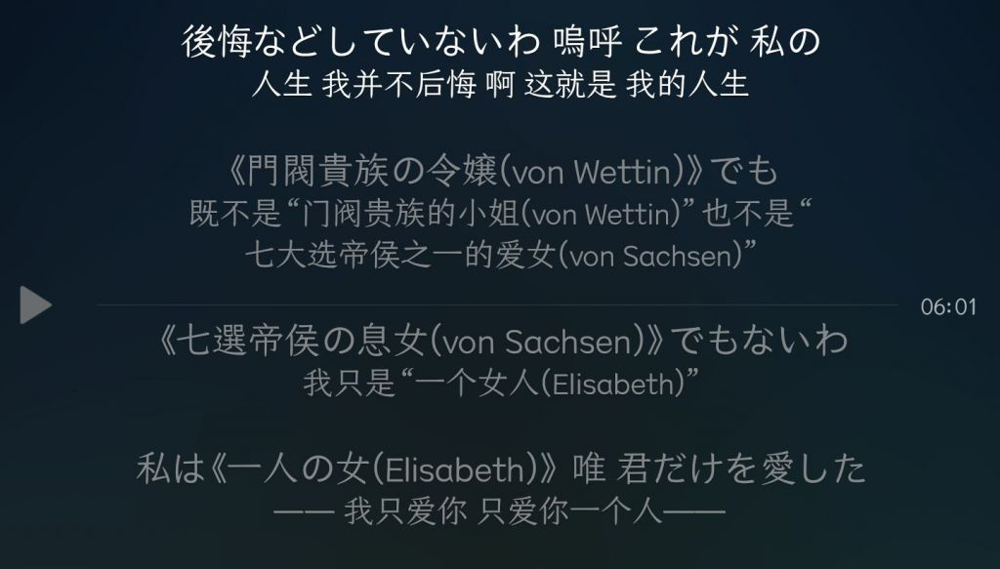

### [不吐不快]今日一乐

Made by ngapost2md (c) ludoux [GitHub Repo](https://github.com/ludoux/ngapost2md)

----

##### 0.[0] \<pid:0\> 2023-07-26 17:08:30 by 我觉得你脑子不太好

----

##### 1.[0] \<pid:705042089\> 2023-07-26 17:10:25 by 江鹤疏
我记得这种注解一般是有多重含义或者作解释会有的，第一次见到还是听一滴p的歌来着

----

##### 2.[0] \<pid:705042124\> 2023-07-26 17:10:35 by 做我的猫子
你米别太爱fgo了

----

##### 3.[5] \<pid:705042527\> 2023-07-26 17:12:23 by UID3563849
这TM就是日语片假名越来越多的锅
米学的什么臭毛病，人家要是说小日子是米的精神祖国，诶嘿那还真反驳不了

----

##### 4.[0] \<pid:705046089\> 2023-07-26 17:27:28 by 疯狂de兔子n
每日米式回旋镖 1/1

----

##### 5.[0] \<pid:705047502\> 2023-07-26 17:33:51 by q794623
FSN时期就有了，主要双重词意的太多了，其他一些语言风格比较谜语晦涩的也会用类似操作。。

----

##### 6.[0] \<pid:705049441\> 2023-07-26 17:42:31 by 大象的象子
是卖梗的电商吗.jpg

----

##### 7.[0] \<pid:705050224\> 2023-07-26 17:45:58 by 向日葵之梦
我还挺喜欢这种的 可能我是蘑菇受害者

----

##### 8.[0] \<pid:705054818\> 2023-07-26 18:04:00 by IB和MARRY
……单就“罗曼”而言说明不了什么吧？

为什么用这段对话？

毕竟真的有“罗曼蒂克”这个词只是现在很少用而已

----

##### 9.[0] \<pid:705055992\> 2023-07-26 18:08:28 by commodore1280
米桑是这样的，pv那段注解给我尬的抠脚，另外还有驭空的全心全灵，很难想象他们的母语不是日语

----

##### 10.[1] \<pid:705056153\> 2023-07-26 18:09:08 by Rinmi-Sokukei
物语音乐也很经常用这类表现手法，蘑菇写作习惯也会写很多有双重含义的句子。一些作词家也喜欢用谐音(比如歌词写“蓝”其实是“爱”)
自己也用就别嘲讽别人了

----

##### 11.[2] \<pid:705056324\> 2023-07-26 18:09:46 by 我冲我自己
你米一边疯狂抄型月一边看不起型月的样子真好笑

----

##### 12.[0] \<pid:705056597\> 2023-07-26 18:10:57 by 领路兔与说慌猫
日本人是这样的，说个经典的单行道和加速器

----

##### 13.[0] \<pid:705056718\> 2023-07-26 18:11:25 by RosyShadow
这只能说米爱模仿日语习惯，跟fgo倒是没有直接关系

----

##### 14.[0] \<pid:705057586\> 2023-07-26 18:15:02 by 白浪梅
你米哈游能有写出某个人理保障机构医生的水平，搞这些我屁都不放一个

