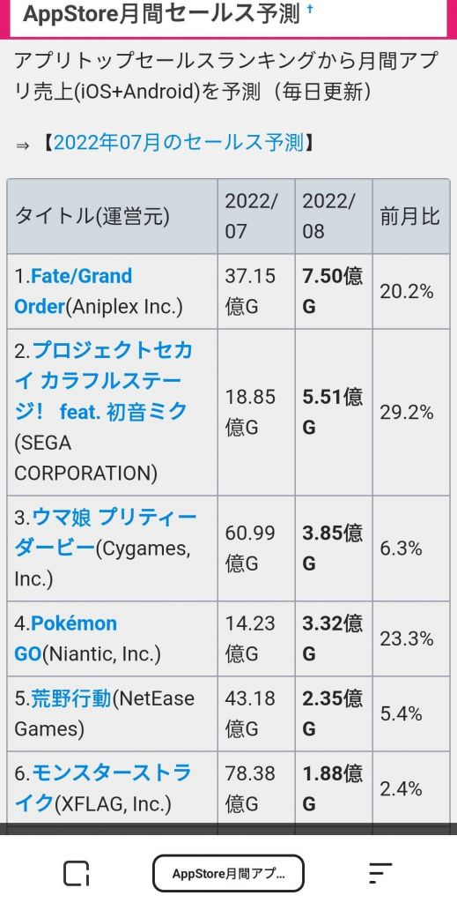
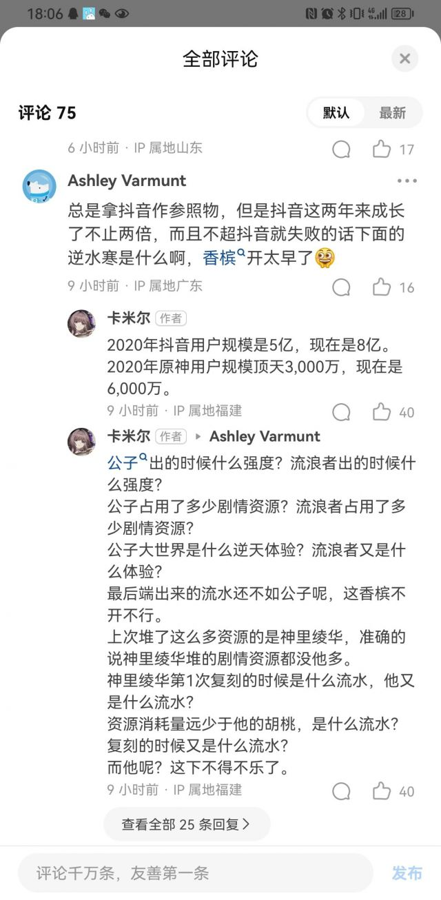
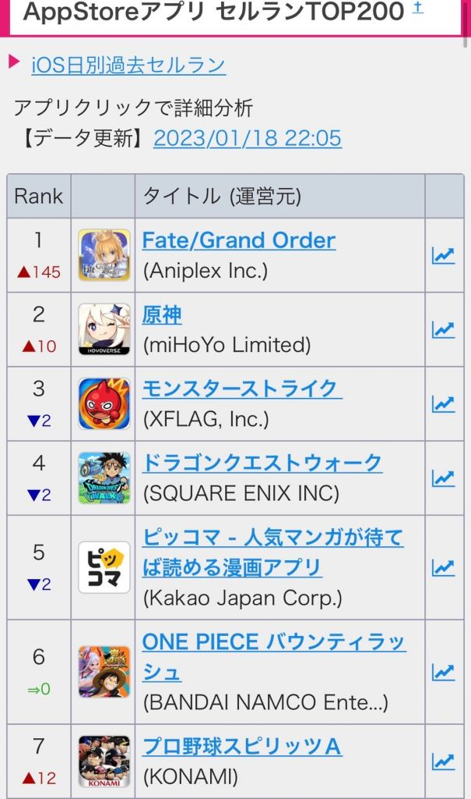

### [热点事件]什么是超抖音xx小时啊

Made by ngapost2md (c) ludoux [GitHub Repo](https://github.com/ludoux/ngapost2md)

----

##### 0.[0] \<pid:0\> 2023-07-26 17:30:02 by 洛汐熙曦
看大家聊流水，不知道什么是超抖音，之前看B站都是什么榜第一，多少多少w

----

##### 1.[0] \<pid:705047061\> 2023-07-26 17:31:57 by レオ
因为每次卡池看不到直接的流水数据，所以只能用流水稳定的app作为基准，通过看超了这个app多少小时来间接衡量流水

----

##### 2.[0] \<pid:705047206\> 2023-07-26 17:32:32 by ★_☆
字面意思，在排行榜上超过抖音多少小时

----

##### 3.[0] \<pid:705047269\> 2023-07-26 17:32:48 by AkariYu3310
你當是一個以app排名為流水參考的指標

----

##### 4.[0] \<pid:705047330\> 2023-07-26 17:33:08 by zxtapple
没有直观数据只能从这方面推测流水

----

##### 5.[2] \<pid:705047411\> 2023-07-26 17:33:26 by 剑筑师と書記官
因为抖音是一个相对来说最高且最稳定的对照组，
所以“超抖音时长”就是字面意义上的流水超过抖音流水的时长

同样的也有后劲，什么超爱奇艺、超腾讯视频、超q音这种
但是不如抖音明显

----

##### 6.[3] \<pid:705047445\> 2023-07-26 17:33:36 by 飘雪菌
抖音不是游戏，流水很平稳，然后原神这种游戏氪金都是一波一波的，所以把他当做衡量该池子玩家的氪金量，超抖音越多就说明氪金的越多，像3.8版本双零就是两个峰值都没超抖音线，说明流水惨淡

----

##### 7.[0] \<pid:705048216\> 2023-07-26 17:37:10 by 仲夏月影
说实话我觉得游戏比流水以正常的应用软件做基准是很奇怪的事情, 以前玩日游的时候大家都是所有的游戏在一起比的

----

##### 8.[0] \<pid:705049137\> 2023-07-26 17:41:06 by レオ
>[jump](#pid705048216) 仲夏月影(2023-07-26 17:37) 说: 
>
>说实话我觉得游戏比流水以正常的应用软件做基准是很奇怪的事情, 以前玩日游的时候大家都是所有的游戏在一起比的

和稳定的app比，其实得出的更多的是绝对流水，就是可以量化估成具体数字的，app的排名在这里就相当于一个刻度尺；但游戏和游戏之间比较得出来的流水是相对的，你只能知道一个游戏比另一个游戏流水高，但并不知道两个游戏具体是多少流水？

----

##### 9.[0] \<pid:705054613\> 2023-07-26 18:03:12 by 仲夏月影
>[jump](#pid705049137) レオ(2023-07-26 17:41) 说: 
>
>和稳定的app比，其实得出的更多的是绝对流水，就是可以量化估成具体数字的，app的排名在这里就相当于一个刻度尺；但游戏和游戏之间比较得出来的流水是相对的，你只能知道一个游戏比另一个游戏流水高，但并不知道两个游戏具体是多少流水？  
>
>好像有的游戏会报每次卡池是总榜第x位，用来比较这些池子的流水，个人觉得不如看超app靠谱，毕竟排名多少全靠看当天有几家游戏开了氪金活动

看了一下 日游那边的榜单确实是有数字的

----

##### 10.[0] \<pid:705055478\> 2023-07-26 18:06:30 by レオ
>[jump](#pid705054613) 仲夏月影(2023-07-26 18:03) 说: 
>
>看了一下 日游那边的榜单确实是有数字的
>

乌干达日语上面好像说的是预测？而且只有整月没有单次的吧，那种一个月开好几个卡池的不太方便实时看…？

----

##### 11.[0] \<pid:705055962\> 2023-07-26 18:08:19 by WHKTJZH
顺便说一下，不要理什么抖音也在发展之类的鬼话，上一张在知乎的截图

插句题外话，知乎的人是真的沾点纯质，又不懂又要给老米洗的样子真的很有观赏效果。

----

##### 12.[0] \<pid:705056705\> 2023-07-26 18:11:22 by 折光为刃
>[jump](#pid705055962) WHKTJZH(2023-07-26 18:08) 说: 
>
>顺便说一下，不要理什么抖音也在发展之类的鬼话，上一张在知乎的截图
>
>插句题外话，知乎的人是真的沾点纯质，又不懂又要给老米洗的样子真的很有观赏效果。

薄纱

----

##### 13.[0] \<pid:705056851\> 2023-07-26 18:11:58 by 我不是琴秀
>[jump](#pid705055962) WHKTJZH(2023-07-26 18:08) 说: 
>
>顺便说一下，不要理什么抖音也在发展之类的鬼话，上一张在知乎的截图
>
>插句题外话，知乎的人是真的沾点纯质，又不懂又要给老米洗的样子真的很有观赏效果。

根据坛友的分析
米乎真的是恰米的

----

##### 14.[0] \<pid:705057498\> 2023-07-26 18:14:39 by Miu的雨雨子
>[jump](#pid705055962) WHKTJZH(2023-07-26 18:08) 说: 
>
>顺便说一下，不要理什么抖音也在发展之类的鬼话，上一张从知乎上的截图
>
>插句题外话，知乎的人是真的沾点纯质，又不懂又要给老米洗的样子真的很有观赏效果。

人家逆水寒可是版本末期，明天更新。原还没更新散池的时候可是掉到30多名去了

----

##### 15.[0] \<pid:705057776\> 2023-07-26 18:15:46 by 仲夏月影
>[jump](#pid705055478) レオ(2023-07-26 18:06) 说: 
>
>乌干达日语上面好像说的是预测？而且只有整月没有单次的吧，那种一个月开好几个卡池的不太方便实时看…？

这种是从七月预测八月的，前面七月的流水已经结算了。如果我没记错fgo一个月最多也就俩活动，大活动也会持续15-20天左右？也相当于就1个卡池
还有卡池上线首日或第二日也会有实时榜单，不过这个榜单倒是没有钱数了

----

##### 16.[0] \<pid:705058038\> 2023-07-26 18:17:05 by Inquisit
>[jump](#pid705055962) WHKTJZH(2023-07-26 18:08) 说: 
>
>顺便说一下，不要理什么抖音也在发展之类的鬼话，上一张从知乎上的截图
>
>插句题外话，知乎的人是真的沾点纯质，又不懂又要给老米洗的样子真的很有观赏效果。

逆水寒开服到现在都没下去过，原低点都四十几了从来都是就开池几天冲一波这怎么比啊
登顶几天就觉得天凉鹅破的米游流水厨差不多得了

