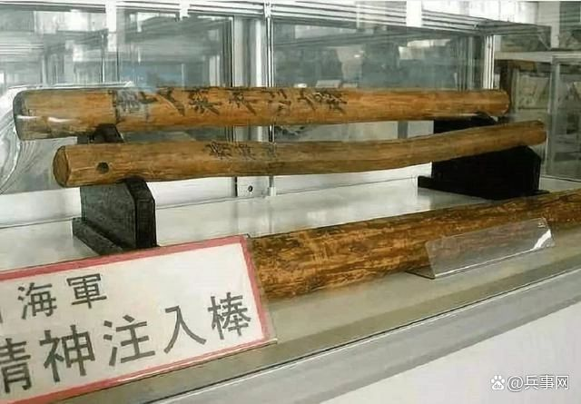
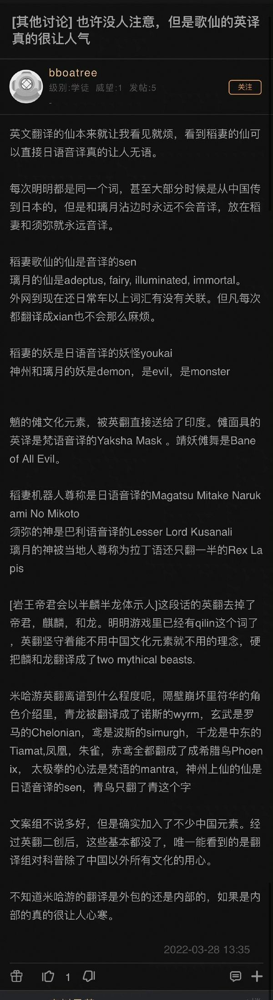

### [不吐不快]有件事想说很久了，你米文案的母语是日语吗

Made by ngapost2md (c) ludoux [GitHub Repo](https://github.com/ludoux/ngapost2md)

----

##### 0.[0] \<pid:0\> 2023-07-26 18:42:17 by Rinmi-Sokukei
这事儿憋着想说很久了，稻妻活动一大堆不翻译直接用的日语汉字，最受不了的就是“棒”和“屋”这个日语汉字，在百人一揆这个活动用了特别多次
比如“用心棒”是用心的人 相棒是伙伴 杀し屋是杀手
“喧哗屋”指的是类似小混混的人，因为喧哗指的是打架
一斗的天赋就叫喧哗屋传说

“一番”在日语中常用于“第一、最初；最”的意思，汉字中是“一阵、一次、一回”的意思(e.g.经过一番折腾)
“一本”在日语中常见于“一本胜负”的用法(得一分、赢一着) ，汉字中是量词，没有日语的用法

汉语母语者没有学过的必然看不懂或者会理解错
其他什么时雨御免的汉字里至少意思差不多也就算了
这些汉字和日语词汇不知道为什么就是不翻译 觉得这样很高级？
总不能指望所有玩原神的汉语母语者都学过日语吧
而且就算是“看不懂也没关系”也不要完全不翻译或者用差别特别大的汉字啊
可以说这些用词符合稻妻原型文化，毕竟“打刀”(影打、真打)等等日语语境特有的词汇也经常出现，还有一些日式文化特有的表达要符合地区特色。但是相对来说是否太多了。。。就算是退一万步符合稻妻文化也要让汉语母语者看懂吧……
而且不止于此，文案的写作习惯也时常让我眉头一皱，其中一点就是隔壁帖提到的“看不起型月但是很喜欢用双重注释”，显得很高级……
想到什么可能会在主楼编辑补上不过也没兴趣回头翻
不过四个月不玩了说实话脑内记忆也清空的差不多了 吐个黑泥算了

----

##### 1.[1] \<pid:705063129\> 2023-07-26 18:43:42 by 伊莱亚斯0508
毕竟米哈游株式会社

----

##### 2.[0] \<pid:705063500\> 2023-07-26 18:45:48 by 加贺烧
把公司名遮住我会认为这是个日游

----

##### 3.[0] \<pid:705063784\> 2023-07-26 18:46:56 by mie001
日本核心的内容无所谓，就当是懒得翻译了

----

##### 4.[0] \<pid:705063804\> 2023-07-26 18:47:00 by 巳龚蓝丑郝芦
你以为米x是白叫的

----

##### 5.[0] \<pid:705063895\> 2023-07-26 18:47:21 by mihomopromax
我当年看凌华短篇那句中文的王手把我雷得不轻。不应该本土化一下说将军吗

----

##### 6.[0] \<pid:705063984\> 2023-07-26 18:47:38 by 灵魂大批量生产
绣红旗是工作，故乡才是生活

----

##### 7.[1] \<pid:705064022\> 2023-07-26 18:47:46 by 不要和傻逼争论
所以，精神注入棒的意思是？  

----

##### 8.[0] \<pid:705064046\> 2023-07-26 18:47:52 by scoutqq
srds…用心棒ようじんぼう是保镖的意思…

----

##### 9.[0] \<pid:705064103\> 2023-07-26 18:48:05 by 楚翊哲
你游一个横向排版的游戏还坚持不用双引号，而是用日语的&#39;&#39;呢   

----

##### 10.[0] \<pid:705064120\> 2023-07-26 18:48:11 by 当个乐子人
明显是的，而且日语词汇含量越来越高文案写出来的东西有的都一股子日式轻小说的味道

----

##### 11.[0] \<pid:705064218\> 2023-07-26 18:48:41 by xuan2rpg
看看崩坏和原神的英文翻译

----

##### 12.[3] \<pid:705064358\> 2023-07-26 18:49:18 by 海力克斯之父
神里屋敷完全可以写成神里宅邸的。

----

##### 13.[0] \<pid:705064456\> 2023-07-26 18:49:43 by d钓鱼哥d
恭喜楼主终于知道马哈鱼身体力行之事

----

##### 14.[0] \<pid:705064498\> 2023-07-26 18:49:52 by gym888soul
只有起错的名字，没有叫错的外号

----

##### 15.[0] \<pid:705064502\> 2023-07-26 18:49:53 by Rinmi-Sokukei
>[jump](#pid705064046) scoutqq(2023-07-26 18:47) 说: 
>
>srds…用心棒ようじんぼう是保镖的意思…

sorry写的时候太快了没过脑 我编辑一下

----

##### 16.[0] \<pid:705064643\> 2023-07-26 18:50:30 by CUCUK
没办法的嘛，“你”国毕竟是外国，本土化难做啊

----

##### 17.[0] \<pid:705064667\> 2023-07-26 18:50:37 by scoutqq
>[jump](#pid705064120) 当个乐子人(2023-07-26 18:48) 说: 
>
>明显是的，而且日语词汇含量越来越高文案写出来的东西有的都一股子日式轻小说的味道

这说实话16年的崩3厕纸轻含量比现在高多了以至于我被朋友带入坑崩铁看了一段以为米()转性了才留下来的

----

##### 18.[0] \<pid:705064739\> 2023-07-26 18:50:55 by 黑松露蘑菇芝士
这其实已经被车过好几轮了，基本就是公认的，叫()桑不是无根据乱叫的

----

##### 19.[0] \<pid:705064763\> 2023-07-26 18:51:01 by 七月七日长生殿-
香菱：给你做料理
隔壁仙舟驭空是不是还有个全心全灵

米社日式词多的可怕

----

##### 20.[0] \<pid:705064792\> 2023-07-26 18:51:09 by Lagrange_
都叫genshin了。。。

----

##### 21.[0] \<pid:705064888\> 2023-07-26 18:51:30 by Luoxifq
重要吗？也就你们这些国籍魔怔的人在乎罢了

----

##### 22.[0] \<pid:705064924\> 2023-07-26 18:51:40 by Rinmi-Sokukei
>[jump](#pid705064218) xuan2rpg(2023-07-26 18:48) 说: 
>
>看看崩坏和原神的英文翻译

罗马音地狱
我都不知道英语母语者怎么看懂的

----

##### 23.[0] \<pid:705064987\> 2023-07-26 18:51:59 by CUCUK
>[jump](#pid705064358) 海力克斯之父(2023-07-26 18:49) 说: 
>
>神里屋敷完全可以写成神里宅邸的。

我第一反应，什么神里“呜呼”，搁这儿唱rap呢

----

##### 24.[0] \<pid:705065114\> 2023-07-26 18:52:31 by loadin233
毕竟是株式会社 以前不是还有人洗说“这样才能在海外赚钱”“中文会让海外败兴”的

----

##### 25.[1] \<pid:705065505\> 2023-07-26 18:54:09 by 透明级
将军有条语音名字就是关于我们-用心棒，看名字完全不知所云，非厨也懒得查，到这个贴才知道意思
喧哗屋也是

----

##### 26.[0] \<pid:705065832\> 2023-07-26 18:55:40 by 在家模块
在须弥都要说料理的含金量，这就是米X

----

##### 27.[1] \<pid:705066025\> 2023-07-26 18:56:30 by Seebird
原神英文Genshin，崩坏Honkai都老生常谈了根本不用怀疑他们的想法和成分了
换一个角度，难道宅就一定得是日本的吗，中国难道不能有自己的宅文化(事实是有的)而非要完全照搬日语吗(搬我不反对，不过既然标榜原创游戏，好歹有点自己的底气吧)

----

##### 28.[0] \<pid:705066098\> 2023-07-26 18:56:49 by 九尾卫星回收站
都料理genshin了

----

##### 29.[3] \<pid:705066450\> 2023-07-26 18:58:26 by 道仰
这个版某天晚上大伙就精神故乡这事爆了很多米的料，然后第二天起来干干净净

----

##### 30.[2] \<pid:705066649\> 2023-07-26 18:59:10 by 谢谢我不喝
老槽点了，外语名就说明了
但凡是叫yuanshen或者意译了，都不至于被起个违禁词的外号

----

##### 31.[0] \<pid:705066781\> 2023-07-26 18:59:44 by 天佑神牛
你觉得为啥是mihoyo而不是mihayou

----

##### 32.[0] \<pid:705066806\> 2023-07-26 18:59:49 by 十夜铃沄花
有一说一，二游风格的剧本，创作者首先得有足够多的acg接触，然后语言习惯会很容易受日语影响，很多东西不用日语过一遍是没那感觉的，类似于传统小说与轻小说角色分别一开口你肯定一眼就能看出来氛围差别

但原这一堆日语习惯写出来的却是各种文青宠男味，那就得问mhy为什么要蹭日语了

----

##### 33.[0] \<pid:705066854\> 2023-07-26 19:00:00 by 千代医

搬运

----

##### 34.[0] \<pid:705067025\> 2023-07-26 19:00:42 by 江之岛
>[jump](#pid705064763) 七月七日长生殿-(2023-07-26 18:51) 说: 
>
>香菱：给你做料理
>隔壁仙舟驭空是不是还有个全心全灵
>
>米社日式词多的可怕

香菱这句语音真的离谱，声优还配出了一种“这个词很难念，所以讲话卡了一下的感觉”，问题中文的“料理”根本就不难念，也就日语发音有长音可能卡一下，实锤台词剧本从用词到发音习惯都是日翻中

----

##### 35.[1] \<pid:705068215\> 2023-07-26 19:05:37 by 凝紫寒C
我觉得料理这个词简直是重灾区，不知道从什么时候开始，好多都不叫烹饪做饭，就非要叫料理(比如某个美食区mianyang料理)到米这都已经见怪不怪了

----

##### 37.[0] \<pid:705068890\> 2023-07-26 19:08:46 by suncolour
我没见那个中国人把饭叫做料理
尤其是璃月每个人都这么说，无语死了

----

##### 38.[0] \<pid:705068914\> 2023-07-26 19:08:53 by SamidareTacho
看看心海的天赋名：直接是“姬君”和“呗”，特别是这个“呗”，一个无意义语气词，它直接拿日语的字形某种形式的“歌”拿来用，印象里好像叫“珍珠之呗”，笑死了，珍珠之是什么东西啊，还“呗”，怪烦躁带点俏皮的照这么说有人叫某人物“老婆”其实就是另一种玩笑了，因为日式汉语“老婆”意思是老太太还没算它之前一堆人不知道咋弄的，婚纱婚服不说，说个“花嫁“呢。
而且不止稻妻，以本土文化为参考原型的也很泛滥。原里面的很久没看忘了有哪些，隔壁崩铁的就有一票，比如“长生/短生种”，这个是日轻创出来的说法，我们正常来说要么说“族/裔”，要么直接是“者”，从来没有什么“种”这种说法的还有那个星槎的，不说驾驶员飞行员，非要说个“飞行士”(北斗那个死兆星上也会说类似的“航海士”)，这也是典型的日式表达，我们常用的就是“员”，士用在末尾通常都是指(古时的)某种官职或者身份一类的，哪有这么用的mhy是真的很喜欢偷掺私货搞些莫名其妙的，非用语但表达有毛病的也有，比如甘雨的“安逸的氛围……喜欢”，看着最后“suki”那读音是不是都出来了

----

##### 39.[1] \<pid:705069361\> 2023-07-26 19:10:37 by write54
>[jump](#pid705063500) 加贺烧(2023-07-26 18:45) 说: 
>
>把公司名遮住我会认为这是个日游

mihayou
mihoyo

其实不用遮

----

##### 40.[0] \<pid:705069611\> 2023-07-26 19:11:44 by 霜糖点点
不管以前和现在都一股日本语法的感觉……说真的，一般人看了都会觉得是日本出的游戏吧

----

##### 41.[0] \<pid:705069680\> 2023-07-26 19:12:04 by 水幻形

----

##### 42.[0] \<pid:705069730\> 2023-07-26 19:12:18 by xlsq03
稻妻地区这些名次多也就算了，毕竟傻子都能看出来原型的地方
其他地区你还搞这种

----

##### 43.[0] \<pid:705069838\> 2023-07-26 19:12:47 by 剑筑师と書記官
也许是英语、印度语、法语、日语、德语………
但就是不是中文

----

##### 44.[0] \<pid:705069856\> 2023-07-26 19:12:53 by tsqtt
说这些，原神都是日语的genshin

----

##### 45.[0] \<pid:705070800\> 2023-07-26 19:17:37 by 杨霁雪
米桑是不是株式会社不好说，他能恶心一下二次元战狼这点还是有功的。

----

##### 46.[0] \<pid:705070870\> 2023-07-26 19:18:00 by Sigmoni
玩<b>ゲンシン</b>玩的

----

##### 47.[0] \<pid:705070978\> 2023-07-26 19:18:40 by 麦哲伦环企鹅
错了，是梵语捏

----

##### 48.[0] \<pid:705071318\> 2023-07-26 19:20:39 by hjg3
人家来推广家乡话做文化输出不是很正常

----

##### 49.[0] \<pid:705071369\> 2023-07-26 19:20:54 by 小鸽白尼
毕竟是文化输出游戏大火这不就被输入了米家乡文化吗

----

##### 50.[0] \<pid:705071501\> 2023-07-26 19:21:38 by charme2102
说起来，为什么米都照搬这么多日语词了，崩坏的英文名反而是错误的honkai而不是houkai啊。原是我玩的第一个(也是最后一个)米游，一直好奇这个问题，有没有遗老知道的

----

##### 51.[0] \<pid:705071601\> 2023-07-26 19:22:04 by 癸陆谭子卜甄
>[jump](#pid705070800) 杨霁雪(2023-07-26 19:17) 说: 
>
>米桑是不是株式会社不好说，他能恶心一下二次元战狼这点还是有功的。

“看到这么多人对桐乃狠的牙痒痒我就舒服了”
没看过俺妹但光看这句话你和老米阴湿程度一脉相承啊

----

##### 52.[0] \<pid:705071818\> 2023-07-26 19:23:06 by 山药薏米粥
如果他们需要的话。
不需要的话，红炉点雪这种中国诗的是可以直白用的，当然，得给稻妻

----

##### 53.[1] \<pid:705071909\> 2023-07-26 19:23:36 by 鸟咕
得了吧，他们的日翻也是一坨够使

