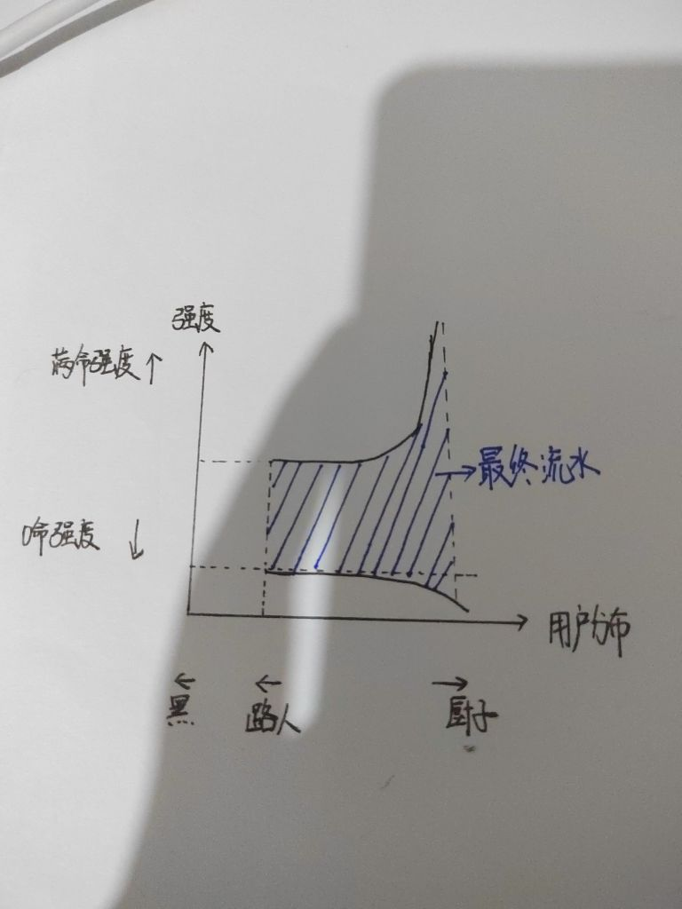

### [不吐不快][流水氵]是否可以这么理解剧情强度和流水的关系

Made by ngapost2md (c) ludoux [GitHub Repo](https://github.com/ludoux/ngapost2md)

----

##### 0.[2] \<pid:0\> 2023-07-26 19:23:36 by zzzzzzy13
强度决定上限，剧情决定下限。

例如八重神子，2.5强度极度抱歉但是优秀的剧情塑造让她能拿下单人57h的战绩，也就是所谓“厨力付费”

虽然优菈心海的传说任务非常糊弄，但是并没有触及大众的毒点，所以只要强度和美术在线依旧会有不少抽取。

宵宫的剧情几乎满分，但也因为强度原因，大部分玩家止于0+0，少部分(例如我)拿个飞雷外观毕业，除了真爱和氪佬，吸金能力还是不足。

至于纳西妲和其他就是反面教材了，纳西妲初次up神+优秀剧情+强度非常高，即使一起的是光速复刻的宵宫也有超抖100h的流水。第二次由于3.3灾难性的影响，带上强度在线的妮露和几句无敌的武器池也只有60h的超抖。

散兵一期吃了大部分人不看剧情直接冲的红利，依靠的还是之前没什么问题的人设，加之它强度到位机制独特，拿下60h成绩；3.8复刻节奏彻底发酵路人缘完全败坏，靠散解氪一咬三仍然只有超抖0h的战绩。

<b>结论是没问题的，但看着mhy这种业内独一份的和钱有仇的运营方式我还是想笑。

史上最大赔钱货！堂堂参上！</b>

----

##### 1.[0] \<pid:705083613\> 2023-07-26 20:26:18 by ai助手
灯兄能聊聊你的心路历程么之前看你一边在幽夜当小丑暴论一边在天命算数据有点乐的，怎么现在变成致力拷打米贤孙的人了

----

##### 2.[1] \<pid:705084253\> 2023-07-26 20:30:15 by 食茄少年
其实我感觉为爱买单厨力付费心里还是希望自己的喜欢的角色是能被爱着的即使早就知道ta是商品也可以被包装得很精致再卖给消费者的。
真相就是你喜欢的角色是别人内部爱和各种xp放出的消耗品以及“这很重要吗”
对啊，这很重要吗

----

##### 3.[0] \<pid:705084944\> 2023-07-26 20:34:22 by ggt12
这很重要吗？只有流水厨才会关心这种事情。

----

##### 4.[0] \<pid:705085321\> 2023-07-26 20:36:40 by 沆瀣一气zex
宵宫其实有一个原因是6命之前的命座太抽象了，要么0要么6如果卡在中间就会非常难受，专武、圣遗物、命座互相之间都很割裂相性不佳。
如果说命座不那么抽象，2命或者1命都有肉眼可云的提升以及飞雷相性稍微好一点，我感觉宵宫也不至于吸金能力不足。

----

##### 5.[0] \<pid:705085889\> 2023-07-26 20:40:13 by 零点，陈彬
>[jump](#pid705085321) 沆瀣一气zex(2023-07-26 20:36) 说: 
>
>宵宫其实有一个原因是6命之前的命座太抽象了，要么0要么6如果卡在中间就会非常难受，专武、圣遗物、命座互相之间都很割裂相性不佳。
>如果说命座不那么抽象，2命或者1命都有肉眼可云的提升以及飞雷相性稍微好一点，我感觉宵宫也不至于吸金能力不足。

，
宵宫不仅命座提升有问题，她技能设计也冲突啊，而且还是对单火c，胡桃能重击对多，她自己还吃不到大招，这要改真建议重做

----

##### 6.[0] \<pid:705086911\> 2023-07-26 20:46:10 by 沆瀣一气zex
>[jump](#pid705085889) 零点，陈彬(2023-07-26 20:40)说:
>[quote][pid=705085321,37147954,1]Reply[/pid] <b>Post by [uid=63963010]沆瀣一气zex[/uid] (2023-07-26 20:36):</b>  宵宫其实有一个原因是6命之前的命座太抽象了，要么0要么6如果卡在中间就会非常难受，专武、圣遗物、命座互相之间都很割裂相性不佳。 如果说命座不那么抽象，2命或者1命都有肉眼可云的提升以及飞雷相性稍微好一点，我感觉宵宫也不至于吸金能力不足。[/quote]， 宵宫不仅命座提升有问题，她技能设计也冲突啊，而且还是对单火c，胡桃能重击对多，她自己还吃不到大招，这要改真建议重做

技能之间的确设计得有问题，Q给我的感觉就是因为要吃专武所以随便做的，一股敷衍感。明明有更多的可能性，比如说开Q之后宵宫普攻命中敌人会引起连锁烟花爆炸什么的缓解对群压力。不过结合猛干哥来看米哈游就是故意做成这样恶心人的

----

##### 7.[0] \<pid:705088062\> 2023-07-26 20:50:01 by 零点，陈彬
>[jump](#pid705086911) 沆瀣一气zex(2023-07-26 20:46) 说: 
>
>技能之间的确设计得有问题，Q给我的感觉就是因为要吃专武所以随便做的，一股敷衍感。明明有更多的可能性，比如说开Q之后宵宫普攻命中敌人会引起连锁烟花爆炸什么的缓解对群压力。不过结合猛干哥来看米哈游就是故意做成这样恶心人的

最好就是连锁之类的机制，这样还可以配合聚怪，如果海带麻痹之类的软控那宵宫不但不弱，甚至还有了功能性胡桃eq能联动，设计的思路比宵宫用心，我不理解为什么限五火c就她俩还能整出幺蛾子

----

##### 8.[5] \<pid:705088146\> 2023-07-26 20:50:19 by zzzzzzy13
>[jump](#pid705083613) ai助手(2023-07-26 20:26) 说: 
>
>z兄能聊聊你的心路历程么之前看你一边在幽夜当小丑暴论一边在天命算数据有点乐的，怎么现在变成致力拷打米贤孙的人了

很简单，
我以前是妲厨啊

她都叫我最初的贤者了.jpg

虽然我幽夜永远暴论，冷血强度不谈厨力，但我个人是完全的xp抽卡。

米这样恶心我，那我只能让它死了。

----

##### 9.[0] \<pid:705088434\> 2023-07-26 20:51:19 by MYK1201
这很重要么

----

##### 10.[0] \<pid:705090016\> 2023-07-26 20:57:11 by andy2491437
0命拉跨，2命才正常，还得抱4星的大腿，培养成本还是最高一档的

----

##### 11.[0] \<pid:705090621\> 2023-07-26 20:59:30 by ai助手
>[jump](#pid705088146) zzzzzzy13(2023-07-26 20:50) 说: 
>
>很简单，
>我以前是妲厨啊
>她都叫我最初的贤者了.jpg
>虽然我幽夜永远暴论，冷血强度不谈厨力，但我个人是完全的xp抽......

妲厨？我一直以为你是狐狸厨来着，那这下合理了，建议加大力度

----

##### 12.[0] \<pid:705090658\> 2023-07-26 20:59:39 by 。一念七绝
我觉得不仅仅是剧情决定下限..
这么说吧 当大家为宵宫二感动拉手手心跳 然后去抽0+1或者补命座说晚安的时候
有人告诉你 内部人正认为你们好骗又可笑呢
你还会感动第二次吗
你真情实感的纸片人 是他们玩弄你的工具人 
想到这一点 
再好的剧情是不是都不想花钱了

----

##### 13.[2] \<pid:705091673\> 2023-07-26 21:03:49 by 安希雅_R4
楼主总结的非常优秀了。
你剧情可以没有，只要人设优秀，厨子可以闭眼脑补，靠脑补二创(实际上刀男人舰女人的剧情跟没有一样)，但你剧情不能反向劝退人。
而且更不能就为了自己一点龌龊心思故意夹杂恶心人的私货。

----

##### 14.[0] \<pid:705091888\> 2023-07-26 21:04:41 by sbsx123
谁让氪金能得到的只有强度呢，那当然是强度决定上限，为了厨力氪命座那属于纯纯被pua了

----

##### 15.[0] \<pid:705091973\> 2023-07-26 21:05:04 by 嘀嘟滴嘟嘀
草妮池被神鹤池按住已经充分说明剧情的作用了，有些人当时还要嘴硬，现在嘴还硬吗？

----

##### 16.[0] \<pid:705092248\> 2023-07-26 21:06:18 by dfpvml
没有skip的缺点就体现在这里了

有skip的话很多人看大世界能飞就直接抽了根本不管剧情

----

##### 17.[0] \<pid:705092729\> 2023-07-26 21:08:33 by Z10y8h23
强度决定流水不就是之前一批女玩家的话术吗？因为有些男限五强度低，就用这种话术来解释流水比不过女限五。
现在到了须弥，不少男限五的强度完全没问题，但卖的最好的还是女角色，说明这游戏的消费主力一直都是宅男

----

##### 18.[0] \<pid:705095187\> 2023-07-26 21:20:01 by vrv41426
说的我都有点感觉了，临时动笔画一下

简短解释一下吧，厨子减少时x轴右侧往里缩，路人减少时x轴左侧往里缩，满命强度高决定用户氪金的上限(y轴上限)，0命强度高决定用户氪金的下限(y轴下限)，四个部分围成的面积就是最终流水。考虑到厨子比路人少，厨子对角色强度包容性更高，所以围成的不是长方形

----

##### 19.[0] \<pid:705119632\> 2023-07-26 23:45:17 by 季柚
这下豁然开朗了

----

##### 20.[0] \<pid:705210962\> 2023-07-27 12:38:53 by 霜驰4869
氪一咬三这个词儿笑死我了

