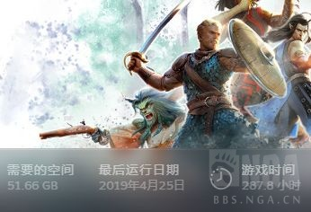

### [热点事件] 给里茶馆的大家推荐一款游戏，龙腾世纪 审判

Made by ngapost2md (c) ludoux [GitHub Repo](https://github.com/ludoux/ngapost2md)

----

##### 0.[0] \<pid:0\> 2023-07-26 19:37:08 by 卡普琪琪3
也许有人要问好游戏那么多，为啥非要推荐一个这种中上水平的游戏呢？

首先，这款游戏，和原神有点像。
游戏发生在一个被称作“Thedas”的幻想世界。玩家将扮演一位名为“审判官”的神秘角色，在自由的旅行中邂逅性格各异、能力独特的同伴们，和他们一起击败强敌，同时，逐步发掘历史的真相。

这个游戏也是个3d开放世界rpg，而且你也可以带3个队友，队友可以自动施法，补控补盾补输出。同时你也可以随时手动超驰操作。作为一款rpg，它可以说完全不硬核，不像什么神界原罪什么正义之怒。只要你主角选出弓贼，找对build，这个游戏大世界甚至比原神还简单，学会按1234567 1234567 就可以无压力通关了，和什么魂系完全不一样。选其他职业可能打的会慢一点，但是也没有什么压力。总之，可以相当悠闲的欣赏风景，和大世界交互。画风也是相对明亮一系，总之比老滚法环巫师都亮，也基本不用走什么阴暗地洞。解谜也不难。

其次，价格便宜。全dlc版现在steam上只卖198。打折的时候以ea习惯更是会打骨折。

第三，队友互动丰富。比起米家的cp斗嘴，这里边的人物是确实有他们的冲突的，而且会在你出外跑图的时候即时对你看到的东西做出反应，顺便斗嘴。比起黄毛带着三个幻想朋友跑图，这个游戏确定是审判官带着三个朋友跑图。队友互动是生软看家底的绝活。

第四，人物塑造，巅峰生软的人物塑造没的说。虽然龙腾审判是巅峰尾巴，但是也有亮点。

第五，tie dollar。龙腾一系的传统就是发刀。喜欢tie dollar的可以自己品尝。

总之，如果你喜欢以前的原神，那么你在所有3A大作里，我认为会喜欢龙腾审判的概率是最大的。

----

##### 1.[3] \<pid:705075085\> 2023-07-26 19:41:28 by adsere
>[jump](#pid0) 卡普琪琪3(2023-07-26 19:37) 说: 
>
>也许有人要问好游戏那么多，为啥非要推荐一个这种中上水平的游戏呢？
>
>首先，这款游戏，和原神有点像。
>游戏发生在一个被称作“Thedas”的幻想世界。玩家将扮演一位名为“审判官”的神秘角色，在自由的旅行中邂逅性格各异、能力独特的同伴们，和他们一起击败强敌，同时，逐步发掘历史的真相。
>
>这个游戏也是个3d开放世界rpg，而且你也可以带3个队友，队友可以自动施法，补控补盾补输出。同时你也可以随时手动超驰操作。作为一款rpg，它可以说完全不硬核，不像什么神界原罪什么正义之怒。只要你主角选出弓贼，找对bu

咋不推荐神原2，这个相似度多高啊
四人队?
元素反应?
七神?
主角在沙滩上醒来?

----

##### 2.[0] \<pid:705075241\> 2023-07-26 19:42:17 by 逆转的密码
“首先，这款游戏，和原神有点像。”

谢谢，下面不看了

----

##### 3.[0] \<pid:705075363\> 2023-07-26 19:42:46 by 卡普琪琪3
>[jump](#pid705075085) adsere(2023-07-26 19:41)说:
>>[jump](#pid0) 卡普琪琪3(2023-07-26 19:37) 说: 
>>
>>也许有人要问好游戏那么多，为啥非要推荐一个这种中上水平的游戏呢？
>>
>>首先，这款游戏，和原神有点像。
>>游戏发生在一个被称作“Thedas”的幻想世界。玩家将扮演一位名为“审判官”的神秘角色，在自由的旅行中邂逅性格各异、能力独特的同伴们，和他们一起击败强敌，同时，逐步发掘历史的真相。
>>
>>这个游戏也是个3d开放世界rpg，而且你也可以带3个队友，队友可以自动施法，补控补盾补输出。同时你也可以随时手动超驰操作。作为一款rpg，它可以说完全不硬核，不像什么神界原罪什么正义之怒。只要你主角选出弓贼，找对bu
>
>咋不推荐神原2，这个相似度多高啊
>四人队?
>元素反应?
>七神?
>主角在沙滩上醒来?

神原2不是3drpg，而且很多人觉得上手有点难

----

##### 4.[0] \<pid:705075548\> 2023-07-26 19:43:31 by 卡普琪琪3
>[jump](#pid705075241) 逆转的密码(2023-07-26 19:42)说:
>“首先，这款游戏，和原神有点像。”  谢谢，下面不看了

我当初被没dlc的审判气的半死，大概就是这个原因

----

##### 5.[1] \<pid:705075701\> 2023-07-26 19:44:12 by 阡陌氪
>[jump](#pid705075085) adsere(2023-07-26 19:41) 说: 
>
>咋不推荐神原2，这个相似度多高啊
>四人队?
>元素反应?
>七神?
>主角在沙滩上醒来?

主角从海边醒来，没走两步就遇到了陪伴自己旅程的伙伴，一路上还要和七个神明打交道

----

##### 7.[0] \<pid:705076193\> 2023-07-26 19:46:08 by adsere
>[jump](#pid705075701) 阡陌氪(2023-07-26 19:44) 说: 
>
>主角从海边醒来，没走两步就遇到了陪伴自己旅程的伙伴，一路上还要和七个神明打交道

费恩线再加个寻找失踪的族(亲)人

----

##### 8.[2] \<pid:705076344\> 2023-07-26 19:46:46 by Khris2456
>[jump](#pid705075085) adsere(2023-07-26 19:41) 说: 
>
>咋不推荐神原2，这个相似度多高啊
>四人队?
>元素反应?
>七神?
>主角在沙滩上醒来?

可能因为人家是认真推这款，不是在凑梗

审判就想到我圣武士扩散反应*元素大剑核爆+战术冲撞秒天秒地

----

##### 9.[1] \<pid:705076665\> 2023-07-26 19:48:09 by 柒月霜飞1
没有椅子能坐我不玩

----

##### 10.[0] \<pid:705076765\> 2023-07-26 19:48:32 by 海崎新太9139
错误的。
8月4日，dnd原神，启动!

----

##### 11.[0] \<pid:705077220\> 2023-07-26 19:50:28 by 冰川真琴
虽然那年是小年，但DAI还是拿了年度最佳的。不至于掉到中上，只是不够上等罢了。
如果硬说DAI像原神的部分，我的第一反应是生软被忽悠瘸的“开放世界”？

不过说相似度高、可以代替原神乃至更优选择的话，还是神界原罪2、刺客信条奥德赛、异度之刃2吧？

----

##### 12.[0] \<pid:705077312\> 2023-07-26 19:50:54 by fireeeeee
龙腾世纪 起源的画风现在很难让人接受了，战斗系统也偏复杂，其实并不是很适合玩原神玩的

----

##### 13.[0] \<pid:705078122\> 2023-07-26 19:54:34 by 卡普琪琪3
>[jump](#pid705077312) fireeeeee(2023-07-26 19:50)说:
>龙腾世纪 起源的画风现在很难让人接受了，战斗系统也偏复杂，其实并不是很适合玩原神玩的

不是起源啊，我连神原2都觉得上手难怎么会推起源，我推的是审判啊

----

##### 14.[0] \<pid:705078514\> 2023-07-26 19:56:28 by Dotless
DAI老实说，啥都好就是不好玩，地图要说是开放世界真的不至于，他就是个吃瘪的箱庭。战斗深度也低，基本就是固定的几个构筑做好了就慢动作重播。开局几张大地图堪称又臭又长，但DLC是真的好。

~~enchantment!~~

----

##### 15.[0] \<pid:705078641\> 2023-07-26 19:57:09 by 卡普琪琪3
>[jump](#pid705078514) Dotless(2023-07-26 19:56)说:
>DAI老实说，啥都好就是不好玩，地图要说是开放世界真的不至于，他就是个吃瘪的箱庭。战斗深度也低，基本就是固定的几个构筑做好了就慢动作重播。开局几张大地图堪称又臭又长，但DLC是真的好。
>
>~~enchantment!~~

所以说才像原神呢

----

##### 16.[0] \<pid:705078871\> 2023-07-26 19:58:29 by GewinJin
我是起源玩了好几遍，后面窝蹲不是主控就没玩了最近正在搞神原2，哈哈哈

----

##### 17.[0] \<pid:705078880\> 2023-07-26 19:58:32 by Zzyugg
我还是最喜欢doa，博得之门3正式版快上了吧，喜欢5e的可以一试。

----

##### 18.[0] \<pid:705079120\> 2023-07-26 19:59:52 by 大老师不傲娇
那下一步可以来玩正义之怒吗，都是crpg，剧情绝对爽文，要善良线有天使主打一个力大砖飞，邪恶线还有巫妖恶魔这种歪门邪道，想当乐子人还有诡计大师线。上手难度虽然高了点，但调个难度不也是菜刀砍爆，法术乱扔

----

##### 19.[0] \<pid:705079260\> 2023-07-26 20:00:44 by Dotless
>[jump](#pid705078880) Zzyugg(2023-07-26 19:58)说:
>我还是最喜欢doa[s:ac:哭笑]，博得之门3正式版快上了吧，喜欢5e的可以一试。

兄啊，你说的是DAO吧，错了一个位就变成另一种东西了

----

##### 20.[0] \<pid:705079438\> 2023-07-26 20:01:39 by 灭世之吼
还是看看远方的博3吧家人们

----

##### 21.[0] \<pid:705079711\> 2023-07-26 20:03:02 by fireeeeee
>[jump](#pid705078122) 卡普琪琪3(2023-07-26 19:54):

啊不好意思，我看错了

----

##### 22.[0] \<pid:705079867\> 2023-07-26 20:03:49 by 零点，陈彬
怎么不推荐起源审判真不如起源

----

##### 23.[0] \<pid:705079952\> 2023-07-26 20:04:18 by 零点，陈彬
>[jump](#pid705079120) 大老师不傲娇(2023-07-26 19:59) 说: 
>
>那下一步可以来玩正义之怒吗，都是crpg，剧情绝对爽文，要善良线有天使主打一个力大砖飞，邪恶线还有巫妖恶魔这种歪门邪道，想当乐子人还有诡计大师线。上手难度虽然高了点，但调个难度不也是菜刀砍爆，法术乱扔

毛子优化堪忧

----

##### 24.[0] \<pid:705080095\> 2023-07-26 20:05:01 by Zzyugg
>[jump](#pid705079260) Dotless(2023-07-26 20:00) 说: 
>
>兄啊，你说的是DAO吧，错了一个位就变成另一种东西了

雀氏打错了，起源romance我觉得最棒。审判emmmm，zzzq审美我无法接受，还是M和L养眼。

----

##### 25.[0] \<pid:705080106\> 2023-07-26 20:05:02 by 零点，陈彬
>[jump](#pid705079438) 灭世之吼(2023-07-26 20:01) 说: 
>
>还是看看远方的博3吧家人们

博3看看完成度，只开放到12级有点可惜

----

##### 26.[0] \<pid:705080510\> 2023-07-26 20:07:33 by 卡普琪琪3
>[jump](#pid705079867) 零点，陈彬(2023-07-26 20:03)说:
>怎么不推荐起源[s:ac:哭笑][s:ac:哭笑]审判真不如起源

起源不够宝宝巴士，我血法-法卫-战法这个亲爹专职路线都玩死好几次。审判玩弓贼点出跳射隐身，想死都难

----

##### 27.[0] \<pid:705080616\> 2023-07-26 20:08:09 by Dotless
>[jump](#pid705080095) Zzyugg(2023-07-26 20:05)说:
>[quote][pid=705079260,37148096,1]Reply[/pid] <b>Post by [uid=41719229]Dotless[/uid] (2023-07-26 20:00):</b>  [s:ac:哭笑]兄啊，你说的是DAO吧，错了一个位就变成另一种东西了[s:ac:哭笑][/quote]雀氏打错了[s:ac:哭笑]，起源romance我觉得最棒。审判emmmm，zzzq审美我无法接受，还是M和L养眼[s:ac:哭笑]。

~~it&#39;s cold in my tent, all alone~~(灵魂回响)

----

##### 28.[0] \<pid:705080692\> 2023-07-26 20:08:36 by Zzyugg
>[jump](#pid705079952) 零点，陈彬(2023-07-26 20:04) 说: 
>
>毛子优化堪忧

比km好，km最后一章卡的我玉玉了，初版bug多的我想似。

----

##### 29.[0] \<pid:705080972\> 2023-07-26 20:10:16 by 零点，陈彬
>[jump](#pid705080692) Zzyugg(2023-07-26 20:08) 说: 
>
>比km好，km最后一章卡的我玉玉了，初版bug多的我想似。

那可太合理了，毛子什么时候玩明白优化就真的能大卖了

----

##### 30.[0] \<pid:705081119\> 2023-07-26 20:11:06 by 零点，陈彬
>[jump](#pid705080510) 卡普琪琪3(2023-07-26 20:07) 说: 
>
>起源不够宝宝巴士，我血法-法卫-战法这个亲爹专职路线都玩死好几次。审判玩弓贼点出跳射隐身，想死都难既然是推荐游戏，都能玩明白起源的老ass还用我推吗？

确实，我忽略了不过审判当初真的可以说很可惜了，完成度比起前作低了

----

##### 31.[0] \<pid:705081316\> 2023-07-26 20:12:28 by 走路草233
那我就要推荐一款叫sexybeachPR“的开放世界”游戏了，大世界沙盒探险，男主可以蹦老高，有收集要素，也可以往尘歌壶里塞npc，还有丰富的战斗系统。

----

##### 32.[0] \<pid:705081518\> 2023-07-26 20:13:45 by Dotless
>[jump](#pid705081119) 零点，陈彬(2023-07-26 20:11)说:
>[quote][pid=705080510,37148096,2]Reply[/pid] <b>Post by [uid=65053574]卡普琪琪3[/uid] (2023-07-26 20:07):</b>  起源不够宝宝巴士，我血法-法卫-战法这个亲爹专职路线都玩死好几次。审判玩弓贼点出跳射隐身，想死都难[s:ac:哭笑]既然是推荐游戏，都能玩明白起源的老ass还用我推吗？[/quote]确实，我忽略了[s:ac:哭笑][s:ac:哭笑]不过审判当初真的可以说很可惜了，完成度比起前作低了

我当时玩DAI最大的乐趣就是在无聊地图上跑图的时候听不同的队友拌嘴，是真的乐，这可能是我对审判最大的认可了

----

##### 33.[0] \<pid:705081776\> 2023-07-26 20:15:31 by 零点，陈彬
>[jump](#pid705081518) Dotless(2023-07-26 20:13) 说: 
>
>我当时玩DAI最大的乐趣就是在无聊地图上跑图的时候听不同的队友拌嘴，是真的乐，这可能是我对审判最大的认可了

这样我不得不推荐质量效应三部曲了

----

##### 34.[0] \<pid:705082116\> 2023-07-26 20:17:21 by Zzyugg
都在推CRPG，那我也推荐个永恒之柱吧。二代虽然有些主线仓促，但一代质量还是不错的，并且结局可以影响二代的初始~~系统送的老头，太棒了~~

----

##### 35.[0] \<pid:705084068\> 2023-07-26 20:29:13 by 大老师不傲娇
>[jump](#pid705080972) 零点，陈彬(2023-07-26 20:10) 说: 
>
>那可太合理了，毛子什么时候玩明白优化就真的能大卖了

还是不行的，猫头鹰执着于一定要给游戏添加莫名其妙的弱智小游戏，km里面的王国管理，正义之怒的圣教军，还有马上要出的行商浪人里面的太空海战，以及贯穿游戏始终的解密要素。这些都是纯纯的负面反馈，我实在想象不到有人会觉得连迷题是什么都得解密的谜语有意思

----

##### 36.[0] \<pid:705084536\> 2023-07-26 20:31:57 by 卡普琪琪3
>[jump](#pid705084068) 大老师不傲娇(2023-07-26 20:29)说:
>[quote][pid=705080972,37148096,2]Reply[/pid] <b>Post by [uid=60656089]零点，陈彬[/uid] (2023-07-26 20:10):</b>  那可太合理了，毛子什么时候玩明白优化就真的能大卖了[s:ac:哭笑][s:ac:哭笑][/quote]还是不行的，猫头鹰执着于一定要给游戏添加莫名其妙的弱智小游戏，km里面的王国管理，正义之怒的圣教军，还有马上要出的行商浪人里面的太空海战，以及贯穿游戏始终的解密要素。这些都是纯纯的负面反馈，我实在想象不到有人会觉得连迷题是什么都得解密的谜语有意思

enigma里又弱智又重复的小谜题，我最后放弃了，对着攻略视频做，做了半个小时啊嘞是卡高我燃烧你的梦

----

##### 37.[0] \<pid:705084573\> 2023-07-26 20:32:08 by 零点，陈彬
>[jump](#pid705084068) 大老师不傲娇(2023-07-26 20:29) 说: 
>
>还是不行的，猫头鹰执着于一定要给游戏添加莫名其妙的弱智小游戏，km里面的王国管理，正义之怒的圣教军，还有马上要出的行商浪人里面的太空海战，以及贯穿游戏始终的解密要素。这些都是纯纯的负面反馈，我实在想象不到有人会觉得连迷题是什么都得解密的谜语有意思

至少安利起来方便一点，但是毛子那个弱智解谜和死命堆怪真的得优化，我不理解他自己有没有看过神界原罪对经验值和怪物数量的把控，而且弱智解谜加上垃圾优化真的会让人心态爆炸

----

##### 38.[0] \<pid:705084675\> 2023-07-26 20:32:43 by 大老师不傲娇
>[jump](#pid705082116) Zzyugg(2023-07-26 20:17) 说: 
>
>都在推CRPG，那我也推荐个永恒之柱吧。二代虽然有些主线仓促，但一代质量还是不错的，并且结局可以影响二代的初始~~系统送的老头，太棒了~~

二代确实，都大决战了都不给爽，亡焰列岛的那几个势力又各有各的逆天，不过那几个dlc是真不错，大场面很多

----

##### 39.[0] \<pid:705084786\> 2023-07-26 20:33:24 by 安比酱
你指望这堆梗小鬼玩的动这个，拜托不可能啦

----

##### 40.[0] \<pid:705084888\> 2023-07-26 20:33:58 by 零点，陈彬
>[jump](#pid705082116) Zzyugg(2023-07-26 20:17) 说: 
>
>都在推CRPG，那我也推荐个永恒之柱吧。二代虽然有些主线仓促，但一代质量还是不错的，并且结局可以影响二代的初始~~系统送的老头，太棒了~~

专八之柱当年气急败坏去学了模组制作和翻译，因为资源卡的好死我自己都要蚌埠住了

----

##### 41.[0] \<pid:705085175\> 2023-07-26 20:35:51 by Zzyugg
>[jump](#pid705084675) 大老师不傲娇(2023-07-26 20:32):

DLC很不错吗，我是买了全套但一直没玩~~电子YW~~。二代剧情emmm感觉有点工具人，POE2我最喜欢的还是自设AI，黑夹克切枪连射很有意思。

----

##### 42.[0] \<pid:705085503\> 2023-07-26 20:37:43 by micorom
我大型3agal工作室我是说bi社最绝的还是人物塑造哪怕是“角色也有自己的生活”也可以同ml互不冲突，比如质量效应的盖少和塔利分别可攻略，但如果你不攻略他俩中的任何一个，他俩最后也能谈起恋爱。喜欢南桐的也有审判的多利安和铁牛，不推他俩的画他俩自己搞上之后的剧情线真的甜甜甜

----

##### 43.[0] \<pid:705086157\> 2023-07-26 20:41:35 by Dotless
>[jump](#pid705085175) Zzyugg(2023-07-26 20:35)说:
><b>Reply to [pid=705084675,37148096,2]Reply[/pid] Post by [uid=43035825]大老师不傲娇[/uid] (2023-07-26 20:32)</b> DLC很不错吗，我是买了全套但一直没玩<del class='gray'> 电子YW </del>。二代剧情emmm感觉有点工具人，POE2我最喜欢的还是自设AI，黑夹克切枪连射很有意思。

牛牛神和眼睛神的DLC各一个都不错，尤其是眼睛神的DLC可以和大法师议会的人互动(~~甚至可以把康豪瑟变成古神~~)，还有一个是竞技场没什么好说的。

----

##### 44.[0] \<pid:705087537\> 2023-07-26 20:48:11 by Zzyugg
>[jump](#pid705086157) Dotless(2023-07-26 20:41)说:
><b>Reply to [pid=705085175,37148096,3]Reply[/pid] Post by [uid=26179499]Zzyugg[/uid] (2023-07-26 20:35)</b> 牛牛神和眼睛神的DLC各一个都不错，尤其是眼睛神的DLC可以和大法师议会的人互动(<del class='gray'> 甚至可以把康豪瑟变成古神 </del>)，还有一个是竞技场没什么好说的。  要说二代剧情，那就不是感觉有点工具人了，贝拉斯复活你就是为了让你当工具人[s:ac:哭笑]不想当？不想当就轮回去吧

柱二，启动！最神奇的是在理查重拾四年前的老游戏，谢谢你，米哈游

----

##### 45.[0] \<pid:705088130\> 2023-07-26 20:50:17 by Shigure1995
这游戏去年还是前年亚马逊prime送过，现在还在ea库里吃灰呢，没打开过

----

##### 46.[0] \<pid:705088407\> 2023-07-26 20:51:13 by 魑魅魍魉魖魌
enchanter这首歌是龙腾世纪的哪一部的配乐啊？我想在游戏里听这个

----

##### 47.[0] \<pid:705088497\> 2023-07-26 20:51:30 by 卡普琪琪3
>[jump](#pid705088130) Shigure1995(2023-07-26 20:50)说:
>这游戏去年还是前年亚马逊prime送过，现在还在ea库里吃灰呢，没打开过[s:ac:汗]

这游戏是玩了不亏，不玩不亏那种。怎么都不亏的。

----

##### 48.[0] \<pid:705088604\> 2023-07-26 20:51:59 by mie001
椅子可以坐吗
然后推荐神界原罪2的话也推荐magicka。元素反应all the way

----

##### 49.[0] \<pid:705089339\> 2023-07-26 20:54:47 by 史诗狗
这游戏很久以前玩一半玩不下去了，忘了为啥了，好像是系统做的不好玩，但依稀记得它在tga年度里面是风评比较差的。

----

##### 50.[0] \<pid:705090037\> 2023-07-26 20:57:17 by Dotless
>[jump](#pid705088407) 魑魅魍魉魖魌(2023-07-26 20:51)说:
>enchanter这首歌是龙腾世纪的哪一部的配乐啊？我想在游戏里听这个[s:ac:羡慕]

就是楼主推的这一部，是酒馆的歌，经常去酒馆呆着时不时就能听到，甜不辣路线可能不会有。

----

##### 51.[0] \<pid:705090365\> 2023-07-26 20:58:28 by xiehuaijiu76
人物实在太丑了

----

##### 52.[0] \<pid:705090481\> 2023-07-26 20:58:58 by 零点，陈彬
>[jump](#pid705088604) mie001(2023-07-26 20:51) 说: 
>
>椅子可以坐吗
>然后推荐神界原罪2的话也推荐magicka。元素反应all the way

ok谢谢老哥推荐

----

##### 53.[0] \<pid:705091044\> 2023-07-26 21:01:13 by Violet≡
前面很心动，但是好像画风不对我胃口……

----

##### 54.[0] \<pid:705091754\> 2023-07-26 21:04:06 by 卡普琪琪3
>[jump](#pid705091044) Violet≡(2023-07-26 21:01)说:
>前面很心动，但是好像画风不对我胃口……[s:ac:哭笑]

如果你会的话，打一个mod解决所有画风问题

----

##### 55.[1] \<pid:705092151\> 2023-07-26 21:05:53 by 狼煞天泣
>[jump](#pid705075085) adsere(2023-07-26 19:41) 说: 
>
>咋不推荐神原2，这个相似度多高啊
>四人队?
>元素反应?
>七神?
>主角在沙滩上醒来?

开放世界
传送锚点
宝箱
椅子可以坐
盘子可以偷

----

##### 56.[0] \<pid:705132688\> 2023-07-27 01:28:05 by 逐光影
看个人兴趣点在哪吧，喜欢角色扮演和探索世界我推荐上古卷轴天际，觉得NPC不好看可以直接下载别人的整合包

