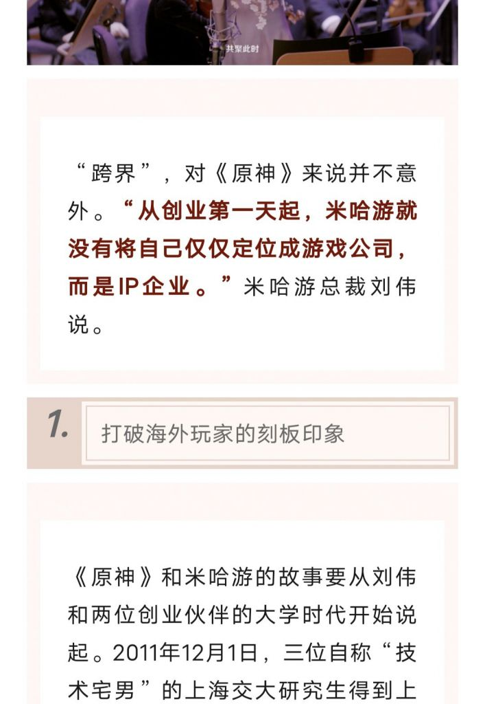
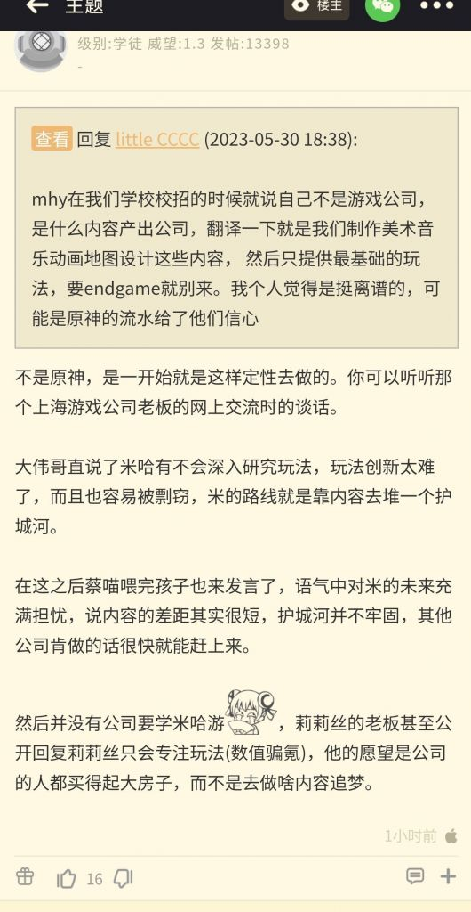
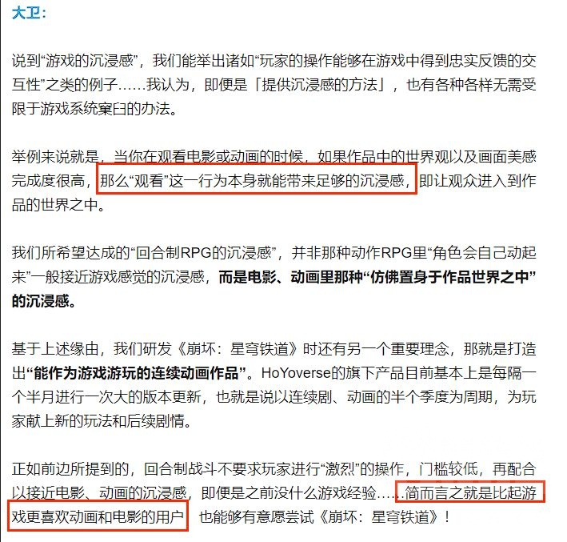
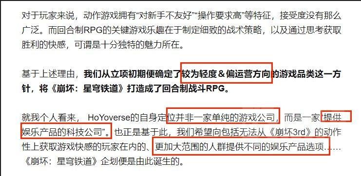
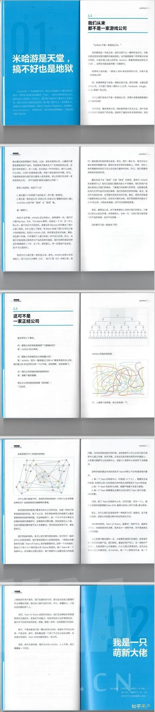

### [不吐不快] 有个说法是蔡浩宇说过 米哈游是一个做内容的公司，不是做游戏的。是真的吗？有出处吗

Made by ngapost2md (c) ludoux [GitHub Repo](https://github.com/ludoux/ngapost2md)

----

##### 0.[1] \<pid:0\> 2023-07-26 20:13:25 by 百鸟羽_樱花
联动这个传言，感觉原和铁也确实是往那句经典名言一路狂奔了
“这东西哪都好，就是不好玩”

----

##### 1.[1] \<pid:705081676\> 2023-07-26 20:14:56 by 啊2333
哪都好？要真能这样我就不跑了看在纸片人份上又不是不能忍

----

##### 2.[6] \<pid:705081685\> 2023-07-26 20:14:59 by 是是是洺
他都说了awwbwg了，为什么不顺从他呢

----

##### 3.[1] \<pid:705081916\> 2023-07-26 20:16:21 by 风之碧海之翠
他们才是玩家，我们只是他们的体验。看到我们被玩弄拱火于股掌之间，他们心里乐开了一朵野菊花

----

##### 4.[0] \<pid:705082089\> 2023-07-26 20:17:12 by 熊猫小天天
确实不是做游戏的，游戏性拉的一

----

##### 5.[0] \<pid:705082110\> 2023-07-26 20:17:19 by 嘀嘟滴嘟嘀
米哈游员工爱做做不做滚，别天天搁游戏抱怨了喵。

----

##### 6.[0] \<pid:705082177\> 2023-07-26 20:17:40 by 5151208
我记得那个图上说“玩法容易被抄袭，我们主要做内容”

----

##### 7.[0] \<pid:705082293\> 2023-07-26 20:18:26 by Scaramer
记得是 米哈游不是游戏公司而是ip公司

----

##### 8.[0] \<pid:705083064\> 2023-07-26 20:23:07 by bzbjzj
>[jump](#pid705082293) Scaramer(2023-07-26 20:18)说:
>记得是 米哈游不是游戏公司而是ip公司

别辱IP。。。。

----

##### 9.[0] \<pid:705083104\> 2023-07-26 20:23:20 by Scaramer
能这么快翻出来我还是挺纯的吧

----

##### 10.[0] \<pid:705083487\> 2023-07-26 20:25:38 by 晨雾nino
这两张?忘了在哪存的了

----

##### 11.[3] \<pid:705083647\> 2023-07-26 20:26:31 by KissAlter
>[jump](#pid705082177) 5151208(2023-07-26 20:17) 说: 
>我记得那个图上说“玩法容易被抄袭，我们主要做内容”

“玩法容易被抄袭”
确实，他们的玩法可不是抄来的嘛

----

##### 12.[0] \<pid:705083699\> 2023-07-26 20:26:49 by Inquisit
哪里哪都好了 也就建模好点还做不了几个动作

----

##### 13.[0] \<pid:705083991\> 2023-07-26 20:28:41 by AMADUESver0
>[jump](#pid705082177) 5151208(2023-07-26 20:17) 说: 
>我记得那个图上说“玩法容易被抄袭，我们主要做内容”

这个mhy应该是最懂得

----

##### 14.[0] \<pid:705084049\> 2023-07-26 20:29:05 by 廓尔克蜀黍
>[jump](#pid705082177) 5151208(2023-07-26 20:17)说:
>我记得那个图上说“玩法容易被抄袭，我们主要做内容”[s:a2:doge]

我觉得“被”字可以去掉，玩法容易抄袭，所以做内容就行了，玩法抄别人家的就可以

----

##### 15.[0] \<pid:705084344\> 2023-07-26 20:30:53 by 吃烤肉去啊

----

##### 16.[0] \<pid:705084426\> 2023-07-26 20:31:23 by kemax3
这个说法我在手综看到过

说的是米哈游参加游戏研讨大会，过程聊到米哈游发展的前景，三巨头其一认为技术这块只要业界肯追，迟早能赶上的，玩法上的革新又非常困难且容易被抄袭。所以要专注做内容，认为内容是米哈游的护城河。

另外，崩铁版有人曾发贴说参加过米哈游的面试，最终没过，其中讲到了米哈游面招负责人说过米家不做endgame。

因为没有当时没有特别在意所以没有保存图片和原文链接，所以不保证以上内容全对或全真。

----

##### 17.[0] \<pid:705085455\> 2023-07-26 20:37:26 by Arekekw
笑死我了，还玩法容易抄袭。
你们抄了那么多就只抄出个皮囊，真正有趣的地方是一点都抄不到啊，但凡你们真的抄到了游戏能做的这么无聊？
Ip企业科技公司更是笑掉大牙。
业内那么多打造传奇ip，技术力在你们十倍以上的企业，有这么傲慢说自己是ip企业科技公司的吗？
眼高手低，瞧不起游戏那你们连好好做游戏都不会啊。
而且你们自诩ip企业，也没见你们很珍惜自己ip和角色啊#

----

##### 18.[0] \<pid:705086874\> 2023-07-26 20:45:56 by 大洋海神草
一流的音乐和技术，二流的美术，三流的玩法，不入流的剧情

----

##### 19.[0] \<pid:705086886\> 2023-07-26 20:46:02 by 69哥冲一次s冠
我爸之前开车的时候在那里放财经博主那个博主分析米哈游是靠做ip起飞的

我试着从他的角度理解了一下他啥意思。

大概得出了一个结论：因为米哈游赚钱太多了，很多人认为赚的钱超越了技术范围了(叠个甲，米哈游肯定有技术)。

所以对他的营销模式分析，大概意思是原神这些角色，地图营销是一种品牌的，让人去购买这种品牌连带的东西。

类比一下，塞尔达打造了林克，塞尔达这个ip。马里奥打造了酷吧，马里奥，桃子公主。卡表鬼泣打造了尼禄维吉尔但丁。怪物猎人打造了火龙黑龙。

奶嘴就是打造了阿米娅，博士

而原神大部分角色都是按照高标准进行打造。钟离，雷电将军就是这种高标准下最顶级这种。

虽然现在这种造神不太行了，但不可否认以前确实有这能力。虽然，时势造英雄

----

##### 20.[0] \<pid:705087855\> 2023-07-26 20:49:17 by 1703kj
>[jump](#pid705082177) 5151208(2023-07-26 20:17) 说: 
>
>我记得那个图上说“玩法容易被抄袭，我们主要做内容”

哪怕真给我抄个《还原神作》出来呢？我也算他有本事了，抄巧克力抄成奥利给，纯纯的一坨

----

##### 21.[0] \<pid:705088215\> 2023-07-26 20:50:30 by 做我的猫子
ip公司但是对角色人设并不在意，甚至为了看玩家抓耳挠腮所以乱写剧情

----

##### 22.[0] \<pid:705092513\> 2023-07-26 21:07:30 by 暗之铃音
>[jump](#pid705088215) 做我的猫子(2023-07-26 20:50) 说: 
>
>ip公司但是对角色人设并不在意，甚至为了看玩家抓耳挠腮所以乱写剧情

“崩坏宇宙里原神只是小小的比例尺罢了”

----

##### 23.[0] \<pid:705095139\> 2023-07-26 21:19:46 by 云后的彩虹糖
因为想做IP，所以打算把市面上所有的玩法尽可能缝入崩坏大宇宙这个IP里吗？

----

##### 24.[0] \<pid:705141453\> 2023-07-27 04:44:51 by too_nyuu
>[jump](#pid705083647) KissAlter(2023-07-26 20:26) 说: 
>
>“玩法容易被抄袭”
>确实，他们的玩法可不是抄来的嘛

自己其身不正，看谁都觉得要剽窃他们的东西

----

##### 25.[0] \<pid:705141919\> 2023-07-27 05:10:23 by 未始有物
那个员工手册流出有些年头了吧，可以直接搜米哈游 员工手册就能看到，不知道现在的什么样改没改，但当年那个上来一个1.1我们从来都不是一家游戏公司，从来不是，可不是不只是

----

##### 26.[0] \<pid:705151751\> 2023-07-27 08:15:50 by 朝云无觅
做内容？指巧克力味的屎？

----

##### 27.[0] \<pid:705153109\> 2023-07-27 08:25:02 by 三木木三
指崩铁两个版本两小时的主线？

----

##### 28.[0] \<pid:705153859\> 2023-07-27 08:29:51 by 别慌冷静
最割裂的一点——注重做内容的公司，他的不让你skip的内容里重要NPC都不愿意单独建模

----

##### 29.[0] \<pid:705153984\> 2023-07-27 08:30:39 by forever_owl
这就是最牛逼的点了
目标是做内容的公司
结果先崩的就是内容
甚至员工直接嘲讽那些为内容买单的玩家

----

##### 30.[0] \<pid:705156556\> 2023-07-27 08:45:42 by ricardo_milos
这话复读了n遍了，换句话说mhy做的是套个游戏皮的rsq产品

----

##### 31.[0] \<pid:705159938\> 2023-07-27 09:02:45 by 过早
这是很重要吗？也就刘伟会在意吧

----

##### 32.[0] \<pid:705164308\> 2023-07-27 09:23:01 by Sigmoni
这话到也没错，米哈游是最早完成互联网转型底公司。在其他二游还在老老实实地卖角色的时候，米已经在卖角色的附加价值了。

你会发现米每次出新角色/版本更新都会有一群人跳出来考据某个地方多么多么细、又输出了若干文化。本质上就是在卖米哈游制作的厂牌，把游戏的流量圈成公司的流量。

----

##### 33.[1] \<pid:705177289\> 2023-07-27 10:19:12 by 矛盾双螺旋
追求“看番、看电影式的体验”，为什么要玩站桩对话的游戏？
索尼旗下工作室们那被吐槽已久的电影化叙事不比米哈游强多了？
他们说这种话怕是自己都不信，本身就是玩卖卡那一套

----

##### 34.[0] \<pid:705266964\> 2023-07-27 17:00:43 by Kuznetsov_2nd_Vayag

贴主找的是不是这个，也是当初在nga存的，糊得有点考验眼力了

----

##### 35.[0] \<pid:705269014\> 2023-07-27 17:08:40 by k384698637
说内容多是最搞笑的了看不见在线最长的都是锄地和打礁？剧情是什么垃圾

