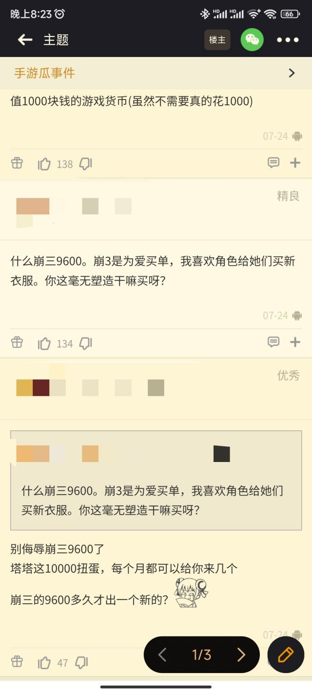

### [不吐不快]从幻塔赛博诈骗联想到给C罗买婚纱

Made by ngapost2md (c) ludoux [GitHub Repo](https://github.com/ludoux/ngapost2md)

----

##### 0.[2] \<pid:0\> 2023-07-26 20:36:06 by 火中术士会梦到电泰坦
最近在幻塔当屯屯鼠，塔出了个卡池，(原石)抽一个除出了形象啥也没有的老npc服装。说的恐怖点，就是把npc的皮扒了卖给你。幻塔当初说好的不抽角色呢

然后重点tm来了，我去瓜版找切瓜的，刚进去想一顿火力输出，我就看到了两个热评:

我看见&quot;崩坏三为爱买单&quot;就想笑，但是想想ta说不定喜欢的鹅(幽兰戴尔)，也挺可怜的，本来都打算退出去了，脑子里突然蹦出来一行&quot;我给C罗买婚纱&quot;，对不起我真的绷不住了！我实在忍不了了哈哈哈哈哈哈哈哈哈
<b>真的，谢谢你，猛干哥，我的快乐源泉</b>

----

##### 1.[0] \<pid:705096327\> 2023-07-26 21:25:53 by Congyul
不是服装是模型，就是定价太贵了，没啥诚意。其他倒是没太大问题，某种意义上甚至是件好事(废案模型，有入手方式了，利好看上的厨子)

常规新角色是抽 技能模组+模型，一起给
皮肤是抽 自捏脸角色的衣服
角色高定是抽 角色模型的皮肤
这次的新东西是抽 新角色的模型，但没有技能模组。(已废案角色，本来不会进池。8折抽卡，无模组)

另外，塔的角色模型 因为跟技能模组完全分离的，真喜欢的话抽了就是无限保值用到关服，不喜欢的话也没啥抽的必要。
问题也有，只能用一个，只能时不时换换口味(大多数玩家也是用的自捏脸。)

至于扒皮论，你可以套到幻塔所有非自捏脸模型身上。
这边想扒还不能扒呢，我倒是想扒个我推的模型 去玩夜6散6

----

##### 2.[0] \<pid:705096539\> 2023-07-26 21:27:05 by 晨雾nino
24号，在猛干节前一天。
哈哈哈哈哈哈哈哈哈哈哈哈哈哈哈哈哈哈哈哈哈哈哈

----

##### 3.[0] \<pid:705097088\> 2023-07-26 21:29:53 by 今锁朱楼
不行，我每次一看到给c罗买婚纱就绷不住笑，这帖子我看见多少次笑多少次

----

##### 4.[0] \<pid:705097106\> 2023-07-26 21:29:57 by sbsx123
对我来说花钱抽模型总比抽数字强

----

##### 5.[0] \<pid:705099540\> 2023-07-26 21:42:29 by 火中术士会梦到电泰坦
>[jump](#pid705096327) Congyul(2023-07-26 21:25) 说: 
>
>不是服装是模型，就是定价太贵了，没啥诚意。其他倒是没太大问题，某种意义上甚至是件好事(废案模型，有入手方式了，利好看上的厨子)
>
>常规新角色是抽 技能模组+模型，一起给
>皮肤是抽 自捏脸角色的衣服
>角色高定是抽 角色模型的皮肤
>这次的新东西是抽 新角色的模型，但没有技能模组。(已废案角色，本来不会进池。8折抽卡，无模组)
>
>另外，塔的角色模型 因为跟技能模组完全分离的，真喜欢的话抽了就是无限保值用到关服，不喜欢的话也没啥抽的必要。
>问题也有，只能用一个，只能时不时换换口味(大多数玩家也是用的自捏

也是哦，是我错怪塔塔了，我就喜欢收集各种美少女

----

##### 6.[0] \<pid:705100076\> 2023-07-26 21:45:27 by RebbitX
如果只是皮肤/模型、不涉及数值，我倒是觉得卖多贵都没关系，本来就是养服富哥炫耀用的东西，也不影响平民体验，挺好的。

----

##### 7.[0] \<pid:705101922\> 2023-07-26 21:55:39 by 缩小帽设定是神
>[jump](#pid705096539) 晨雾nino(2023-07-26 21:27) 说: 
>
>24号，在猛干节前一天。
>哈哈哈哈哈哈哈哈哈哈哈哈哈哈哈哈哈哈哈哈哈哈哈

猛干节还行猛干节当天大家开赢趴是吧？

----

##### 8.[0] \<pid:705102465\> 2023-07-26 21:59:02 by 冰河新栖姬
其实还好，幻塔高定本来就是卖外观的，这个角色外观也还算过得去~~虽然不是我喜欢的类型~~
幻塔除去强度，最大的矛盾还是可以高度个性化外观的主角和几乎没有自定义余量的角色完全互斥

