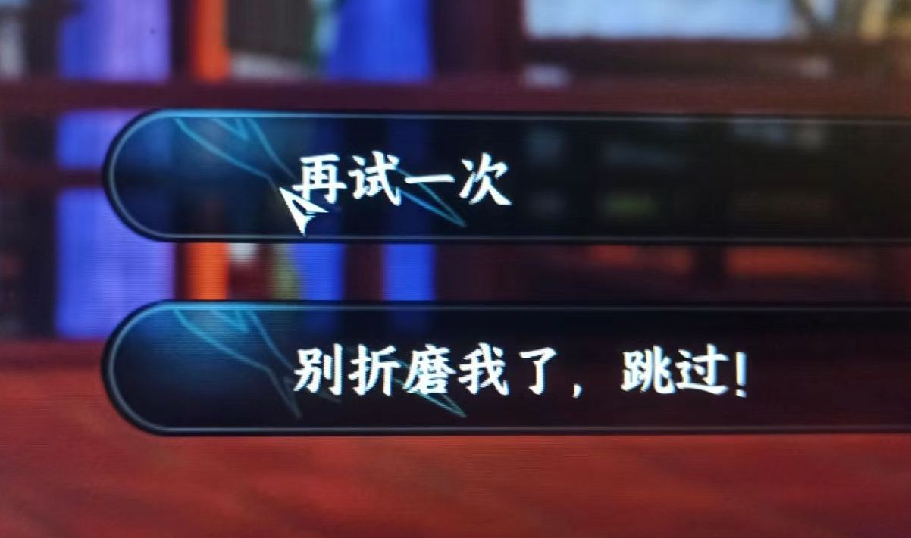

### [不吐不快]米哈游修复了我喜欢当剧情党的问题

Made by ngapost2md (c) ludoux [GitHub Repo](https://github.com/ludoux/ngapost2md)

----

##### 0.[3] \<pid:0\> 2023-07-26 20:50:02 by Liciamenoon
这两天跟着看了八卦，有点感慨。之前在各个游戏里都是剧情党，连LOL都是研究背景故事的时间比练补刀多。我其实并不指望在游戏里玩到多么波澜壮阔的故事，但只要完整自洽，设定又有点意思，我就能兴致勃勃研究半天，甚至加点自己的脑补去完善编剧没写到位的地方。
刚来玩原的时候也是这样，对原最初的好感也是来自于蒙德主线这个标准的勇者斗恶龙，勇气与友情不是什么很深刻难懂的主题，但我看完很开心，璃月的第一印象更好，所以主线虽然槽点很多，但我还是尽量去补完了支线传说间章，看完了绝版活动录屏，把每个角色的个人故事甚至每个道具视频的文案都翻出来看。到了稻妻更是如此，我甚至为此夸奖过原神细节用心，能让人考据到很多没想到的细节，同时又能呼应足迹这个开服大饼。
当然现在往事已成空，我也成功出脑。倒不是因为剧情写烂了。之前遇到烂剧情的小说动漫影视多得是，但这次这个编剧的事情让我发觉其实米哈游从运营思路上就没有像之前吹的那样很想认真做内容。
须弥后期剧情时常让我想起我那给偶像剧写剧本的编剧朋友，她告诉我很多偶像剧的剧情都是根据演员要突出什么番位卖什么CP上什么热搜量身定制，甚至很多挨骂的剧情都是提前写好等着发热搜的。我恍然大悟这不就是我们原神和崩铁现在的问题么？不是为了讲好一个故事，不是为了塑造好一群角色，而是为了定向贩卖一些定制垃圾给对应的受众，所以才产出了这种东西。
我会对着作者认真写的拉胯剧情骂几千字然后想办法给他圆逻辑补正设定，但对定制的垃圾我甚至无法产生生气这种感情。
我现在还是在每天给米哈游的游戏清日常，崩铁是为了攒石头等符玄顺便用完之前抽罗刹充的月卡，原神呢姑且还是为了玩得开心。是的，剧情出脑之后我突然轻松了很多，之前抽了甘雨一边很喜欢她的美貌一边对她剧情塑造的拉胯纠结不已，而现在我面对刚到手的kokomi内心只有喜悦，她剧情行不行重要吗？~~只有心海厨会在意吧~~ 我只在乎她长得好看还会在尘歌壶里对我说一个人或许有点孤单但还有你在。
或许这就是米哈游想要的玩家画像吧！不会追着他们的三流剧情不放，不会对几句OOC的台词耿耿于怀，只会为了张脸花钱而不会要求他们做这做那。
可我还是会想起3.2刚开的那天大家在泥潭激动的状态，而我请了半天假赶回家，坐在电脑前兴奋地点开了原神客户端，截了阿如村开会的图对朋友说这个屋子里的人我全都要抽，我要在壶里给他们搭一个须弥主题的房子，然后把小草也放进来，给她一个真正属于她自己的生日派对。
后来房子确实搭了，可惜米哈游不在乎，纳西妲不在乎，这些角色们也不在乎。
我是真的爱他们吗？也没有，我只是当时喜欢上了那个凡人齐心协力去拯救神明的剧情，连带着喜欢出现在其中的角色，甚至包括当时剧情结束时还大头朝下躺在地上的散兵。
想想真是有些萧索，玩原神我最幸运的是没有真情实感地厨过哪个角色，可不幸的是我真情实感地爱过剧情，爱过3.1-3.2，爱过层岩和渊下宫，鹤观和森林书。而现在我终于可以不再去纠结剧情合不合理角色塑造是否符合逻辑，我可以抛开剧情带着美少女开开心心逛街而不去想她在传说任务活动剧情里又说了什么傻话，但这一切真的值得吗？

----

##### 1.[1] \<pid:705090875\> 2023-07-26 21:00:35 by UID3563849
就算米哈游不搞骚操作也没必要去当他家的剧情党
他家因为要卖卡，本就平平无奇的剧情还一直被搞得支离破碎，前后矛盾，话又不说清楚，专攻迷语人，方便打补丁
没啥意思

----

##### 2.[0] \<pid:705092207\> 2023-07-26 21:06:08 by Liciamenoon
>[jump](#pid705090875) UID3563849(2023-07-26 21:00) 说: 
>
>就算米哈游不搞骚操作也没必要去当他家的剧情党
>他家因为要卖卡，本就平平无奇的剧情还一直被搞得支离破碎，前后矛盾，话又不说清楚，专攻迷语人，方便打补丁
>没啥意思

嗨，刚开始谁知道呢，我毕竟都信了那套米哈游和别的厂商不一样会认真做内容的说辞了，未尝不是一种玩原神玩的

----

##### 3.[0] \<pid:705092611\> 2023-07-26 21:07:57 by 我流伦子哥
米哈游修复了我喜欢玩二游的问题

----

##### 4.[0] \<pid:705093072\> 2023-07-26 21:10:07 by UID3563849
>[jump](#pid705092207) Liciamenoon(2023-07-26 21:06) 说: 
>
>嗨，刚开始谁知道呢，我毕竟都信了那套米哈游和别的厂商不一样会认真做内容的说辞了，未尝不是一种玩原神玩的

刚开始接触他家的时候是很容易被迷惑的
时间久了就知道他家是什么德性了，出脑是必然的
一旦出脑，真是看他家什么都想笑了

----

##### 5.[0] \<pid:705093576\> 2023-07-26 21:12:21 by 嫩鸡馍馍蒸着吃
层岩渊下宫雪山说多了都是泪，这些地图估计是发挥失常了，如今的爆典才是米的日常水准

----

##### 6.[0] \<pid:705093666\> 2023-07-26 21:12:49 by 良辰美景不夜天
>[jump](#pid0) Liciamenoon(2023-07-26 20:50) 说: 
>
>这两天跟着看了八卦，有点感慨。之前在各个游戏里都是剧情党，连LOL都是研究背景故事的时间比练补刀多。我其实并不指望在游戏里玩到多么波澜壮阔的故事，但只要完整自洽，设定又有点意思，我就能兴致勃勃研究半天，甚至加点自己的脑补去完善编剧没写到位的地方。
>刚来玩原的时候也是这样，对原最初的好感也是来自于蒙德主线这个标准的勇者斗恶龙，勇气与友情不是什么很深刻难懂的主题，但我看完很开心，璃月的第一印象更好，所以主线虽然槽点很多，但我还是尽量去补完了支线传说间章，看完了绝版活动录屏，把每个角色的个人故事甚至每

和你很像，是真心实意喜欢过剧情的，要说喜欢角色，大部分也是因为角色塑造才喜欢上的，其实虽然大家都说是因为角色好看所以才抽，但是我一直觉得剧情才是让大家长久喜欢的原因，米家游戏的重点都是卖内容，剧情是串联一切内容的主线，不管是角色、音乐、地图、动画，都是基于剧情才有了活力，但是现在原已经不再是用好的叙事来吸引受众了，而是为了扩大受众无所不用其极，我看见剧情都能感受到背后的急功近利，其实明明最开始是愿意尝试去好好讲一个故事的

----

##### 8.[0] \<pid:705093724\> 2023-07-26 21:13:08 by 岩间琉璃，云间月
猜我玩到这里的时候作何感想

----

##### 9.[0] \<pid:705093906\> 2023-07-26 21:14:04 by 今锁朱楼
我今天刚玩了个可以开后宫的游戏，本来欺男霸女还挺开心的突然想到原神就出脑了一下子索然无味。

----

##### 10.[0] \<pid:705094005\> 2023-07-26 21:14:30 by 格兰登
>[jump](#pid705092611) 我流伦子哥(2023-07-26 21:07) 说: 
>
>米哈游修复了我喜欢玩二游的问题

这确实，现在更多关注游戏性了。

----

##### 11.[1] \<pid:705094043\> 2023-07-26 21:14:40 by 嫩鸡馍馍蒸着吃
我是真的真的很喜欢森林书那些小萝卜头滴嘟滴嘟的，结果天天和其他联动
“森林会记住一切”
“帮兰拉娜惩罚坏人”
乐
玩原神玩的……

----

##### 12.[0] \<pid:705094266\> 2023-07-26 21:15:43 by 我话山居不记年
邮局港剧，在长线运营的游戏里当认真的剧情党都容易雷，魔兽世界就是挺好的例子，后继的编剧总会有自己想法的

布袋戏这种超长剧也是，bug多到数不清

----

##### 13.[0] \<pid:705094382\> 2023-07-26 21:16:15 by huycuk
还真是，刚玩的时候老喜欢扒文本去读了，在b站上看了好多好多圣遗物的背景故事，还专门去学了几句丘丘语。现在压根就不看了

----

##### 14.[0] \<pid:705094886\> 2023-07-26 21:18:33 by Harutya1009
我主攻的那款二游似乎是另一个极端，已经见过不少人骂文案组为了故事牺牲角色了(虽然我没怎么感觉到)。
想知道是哪款可以查我成分，虽然想必很多人都想得到

----

##### 15.[0] \<pid:705095384\> 2023-07-26 21:20:55 by znaibeind
原的剧情真的是。。。。有时候觉得之前考据各种文本细节各种补充信息的自己是sb

----

##### 16.[0] \<pid:705095445\> 2023-07-26 21:21:12 by 吾是D君
有这时间还不如去看点新番和国创呢？

----

##### 17.[1] \<pid:705095452\> 2023-07-26 21:21:14 by Liciamenoon
>[jump](#pid705094266) 我话山居不记年(2023-07-26 21:15) 说: 
>
>邮局港剧，在长线运营的游戏里当认真的剧情党都容易雷，魔兽世界就是挺好的例子，后继的编剧总会有自己想法的
>
>布袋戏这种超长剧也是，bug多到数不清

剧情拖长了容易出问题很正常，我追十几季的美剧的时候经常处于骂街状态，更不要说上个游戏FF16我就是因为剧情不满跑路的。但原神才几年啊，而且人家剧情都是写烂了，原神现在是压根儿没想写好。说到这个我现在跟石川夏子也和解了，起码人家是真的认真在试图写故事，还敢实名

----

##### 18.[0] \<pid:705095530\> 2023-07-26 21:21:43 by 无料通贩商
>[jump](#pid705094886) Harutya1009(2023-07-26 21:18) 说: 
>
>我主攻的那款二游似乎是另一个极端，已经见过不少人骂文案组为了故事牺牲角色了(虽然我没怎么感觉到)。
>想知道是哪款可以查我成分，虽然想必很多人都想得到

巨人车到这片大地，有多少角色人设被当成阻碍前进的肉瘤割了下来

----

##### 19.[0] \<pid:705095946\> 2023-07-26 21:23:53 by 邬宏畅
有的东西它就是不值得投注目光

----

##### 20.[0] \<pid:705130247\> 2023-07-27 01:06:21 by HextoDec
我的宵宫已经在奥摩斯港站了两个月了，卡维和凯亚的邀约也不打算动了，夏活剧情全程空格一个字也没听进去。

