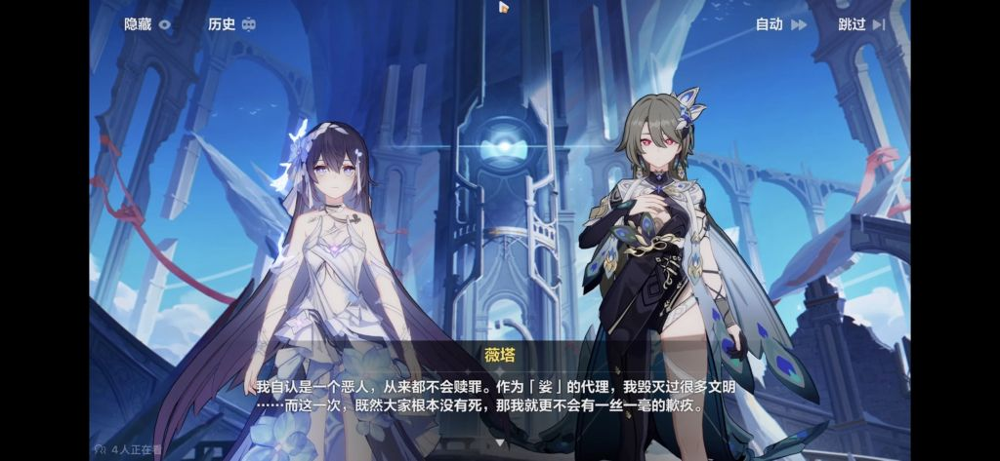
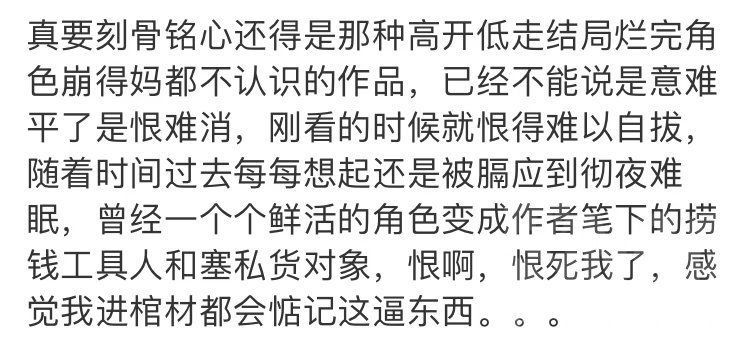
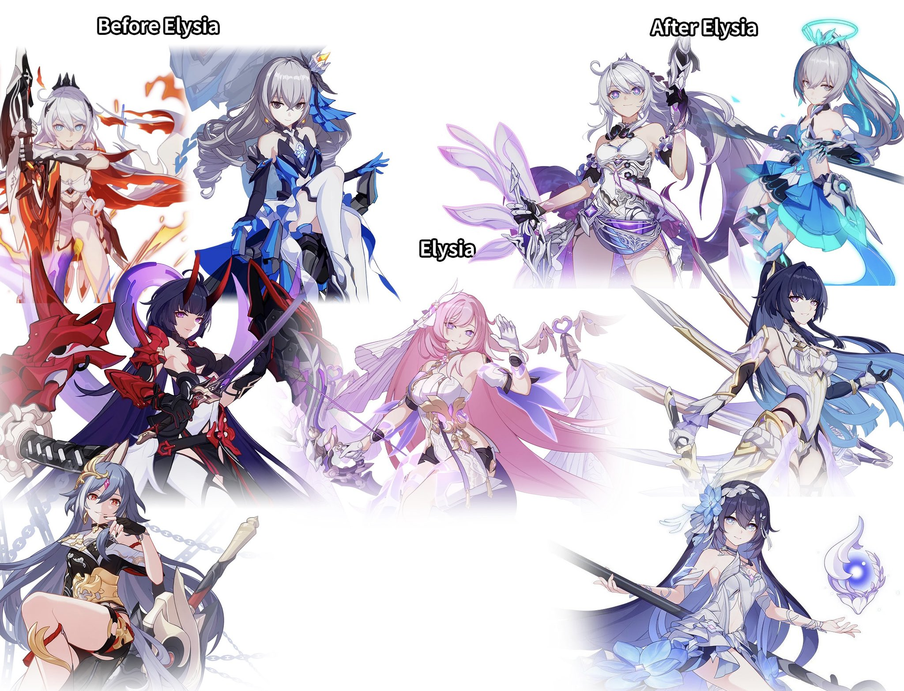

### [不吐不快]我觉得还是由我来给大家讲讲崩三剧情吧

Made by ngapost2md (c) ludoux [GitHub Repo](https://github.com/ludoux/ngapost2md)

----

##### 0.[2] \<pid:0\> 2023-07-26 21:23:20 by 云彩间隙裏消逝
先从往世乐土和永世乐土开始讲，虽然剧情是不错，但是编剧搞错了一个很关键的事情，那就是往世乐土的主角是谁？是爱莉吗？不，或者说她是次要的主角，而最关键的主角应该是芽衣
因为是芽衣去找凯文问崩坏的真相，她想要知道答案，于是凯文让他去往世乐土，之后发生了一系列的事情，这一系列的主角都是芽衣
结果呢，现在我们的芽衣集齐了往世乐土里所有人的刻印，按照常规剧本，应该让她露一手，结果呢，爱莉表示你出去吧，这里交给我，就？？？？
更别说结束之后，对于崩坏这个其实还是一知半解，基本没怎么推进。
之后就是终章剧情，首先就是剧情里大部分人，不管是以前扯过哲学没有扯过的，尤其是那些没扯过的，说话都要带一两句哲学相关，之后智囊团那些人，也去说一些高深的其他方面的知识，比如说数学什么的，而且也不做好通俗的解释，就tm很难看懂，俗称掉书袋环节，生怕让读者不知道他们知道这么多名词啊
并且我们芽衣去完之后就仿佛被打了思想钢印一样，满脑子就是爱莉和其他英桀了，不整两句就仿佛他没去过乐土一样，然后琪亚娜哦不应该说k423(这两个算是cp)问是谁，就有点遮遮掩掩
到了最后打凯文才是最典的，御三家现在在打凯文，凯文展开了次数盾，御三家表示有点吃力，这时候我们御三家之一的布洛妮娅表示，现在所有目光向我看齐，我要开始装逼了，看我表演，看我看我，现在开始准备犀利开大了
但是我们的爱酱表示，啥时候轮到你了？之后打断施法施展网暴攻击
我tm？？？？我布洛妮娅好不容易有个装逼机会你tm给我打断了，哪怕你说布洛妮娅撑不住了你顶上都比这个好啊，就非要为了你那个第四面墙去舍弃角色装逼机会是吧，什么机械降神？
哦对了，还有一件事，终章的全部剧情就是为了突破第四面墙而包的饺子

----

##### 1.[1] \<pid:705096200\> 2023-07-26 21:25:16 by 猜你想看
这很重要吗？也就你们这些正崩旗拥趸在乎吧

----

##### 2.[0] \<pid:705096538\> 2023-07-26 21:27:04 by 最爱吃是月饼
终章做的怎么样？b站最爱捧编剧臭脚的都只能说终章是平稳落地。然后终章完结后的4月s羽兔比起去年的4月s阿波尼亚，流水直接腰斩

----

##### 3.[0] \<pid:705096827\> 2023-07-26 21:28:36 by 云彩间隙裏消逝
>[jump](#pid705096538) 最爱吃是月饼(2023-07-26 21:27) 说: 
>
>终章做的怎么样？b站最爱捧编剧臭脚的都只能说终章是平稳落地。然后终章完结后的4月s羽兔比起去年的4月s阿波尼亚，流水直接腰斩

我个人表示，起码应该可能算是平稳落地，但是内部剧情你一旦细看一点点就觉得不行，说不通，比如说为什么之前一个不好好上课的学渣也给你来两句哲学了

----

##### 4.[0] \<pid:705097244\> 2023-07-26 21:30:38 by 重生之我是荣誉骑士
我记得我开服玩了一年，好像到八重村，主线一点进展没有，全是小队野外出任务剧情

----

##### 5.[2] \<pid:705113370\> 2023-07-26 23:04:49 by jinjin886
最扯的就是最后大包菜登场，非要来段打破第四面墙的剧情。你之前主线半句舰长没有提到，现在大结局给我搞这出?还把尼尔二拉出来垫背，人家有A到F多重结局，不断暗示玩家这是命运的轮回需要最后靠玩家来帮忙打破，你有吗？
乐土最先开始都猜芽衣会得到什么英桀力量，结果最后就是吼一句“回应我吧，爱莉希雅”，从坟里扒套衣服回来穿上，和k琪还有板鸭捆绑销售虚三家。

----

##### 6.[1] \<pid:705113819\> 2023-07-26 23:08:06 by 临玖君
不就是终焉律者的毕业旅行其实是留校察看，在月球吃吃泡面打打游戏吗？也就你们这些看剧情的才会在意了

----

##### 7.[0] \<pid:705114737\> 2023-07-26 23:13:53 by 小卒龍寒
看你们说的，好奇去看了看御三家觉醒那段，没搞懂芽衣为什么要带人去乐土，我真的一脸迷惑，谁能给我捋一捋~~其实我对每个人的觉醒都很迷惑~~

----

##### 8.[0] \<pid:705114981\> 2023-07-26 23:15:32 by Rycbarm_123
>[jump](#pid705097244) 重生之我是荣誉骑士(2023-07-26 21:30) 说: 
>
>我记得我开服玩了一年，好像到八重村，主线一点进展没有，全是小队野外出任务剧情

后面大改过。为了塞呆鹅进去。所有剧情动刀。呆鹅从一开始的剧情冷酷天命唯一S级女武神最终什么都没了

----

##### 9.[1] \<pid:705115076\> 2023-07-26 23:16:18 by 敗類的本願
不满意的都是唯芽衣厨

----

##### 10.[0] \<pid:705115288\> 2023-07-26 23:17:47 by Rycbarm_123
你从往世乐土开始讲那哥们只能和你说不熟了。毕竟我退坑的时候是黄金呆鹅UP。你自行参考我剧情在哪里后三年的剧情都是什么玩意啊

----

##### 11.[0] \<pid:705115305\> 2023-07-26 23:17:53 by 汐汐漓漓
最搞的的是乐土一开始似乎是要搞什么奇怪的b格写死了无数世界蛇的人进去，渡鸦进去还被爱莉阴阳了一下，终章一转爱莉爱全人类。
然后一看营销文案:大家以为是粉切黑的角色实际上是粉切粉，太颠覆啦
额，行吧

----

##### 12.[0] \<pid:705115497\> 2023-07-26 23:19:13 by jinjin886
>[jump](#pid705114737) 小卒龍寒(2023-07-26 23:13) 说: 
>
>看你们说的，好奇去看了看御三家觉醒那段，没搞懂芽衣为什么要带人去乐土，我真的一脸迷惑，谁能给我捋一捋~~其实我对每个人的觉醒都很迷惑~~

凯文找芽衣，说他有办法让k琪不被崩坏侵蚀变成终焉，但要求是你芽衣觉醒雷律并且跟我回世界蛇。芽衣答应了，变身雷律，分担k琪身上的崩坏能揍了一顿k琪就跟凯文走了。
走了之后就是著名的星冰乐剧情，然后芽衣回来找凯文说我要知道“崩坏的真相”，凯文就带芽衣去了乐土。之后就是乐土篇章了。

----

##### 13.[2] \<pid:705115517\> 2023-07-26 23:19:20 by 幻想東行
崩三收尾已经有点蚌埠住了，先是真理律那段又长又难懂的剧情，后来褒贬不一的终焉装甲和台词，到了大决战更是来了个机械降神的操作强行达成完美结局

----

##### 14.[0] \<pid:705115574\> 2023-07-26 23:19:41 by Fzero51
>[jump](#pid705115076) 敗類的本願(2023-07-26 23:16) 说: 
>
>不满意的都是唯芽衣厨

查询伊甸厨心情值

----

##### 15.[0] \<pid:705115652\> 2023-07-26 23:20:13 by 87123kaiu
但凡质疑爱衣机械降神的就统一扣“英桀三”的帽子我请问都到决战了你御三家主角团连敌人到底是什么都不知道我怎么信得过你们是主角团救世主啊，哪有还跟三岁小朋友一样只听大人的话走一步看一步对战略格局完全没有理解能力的救世主。新时代有靠谱的人吗也不是没有，真正拯救过一个宇宙和世界又有能力又有心性的呆鹅不就是，啊什么在终章被吃书又被虽然不认爹妈但是宠妹狂魔地垫给k琪了啊，那没事了又不是第一次了

----

##### 16.[2] \<pid:705116035\> 2023-07-26 23:22:42 by 临玖君
>[jump](#pid705115305) 汐汐漓漓(2023-07-26 23:17)说:
>最搞的的是乐土一开始似乎是要搞什么奇怪的b格写死了无数世界蛇的人进去，渡鸦进去还被爱莉阴阳了一下，终章一转爱莉爱全人类。 然后一看营销文案:大家以为是粉切黑的角色实际上是粉切粉，太颠覆啦 额，行吧[s:ac:哭笑]

敢对我爱皇大不敬？兄弟们冲了他

----

##### 17.[0] \<pid:705116166\> 2023-07-26 23:23:33 by 小卒龍寒
>[jump](#pid705115497) jinjin886(2023-07-26 23:19)说:
>[quote][pid=705114737,37149595,1]Reply[/pid] <b>Post by [uid=61676469]小卒龍寒[/uid] (2023-07-26 23:13):</b>  看你们说的，好奇去看了看御三家觉醒那段，没搞懂芽衣为什么要带人去乐土，我真的一脸迷惑，谁能给我捋一捋<del class='gray'> 其实我对每个人的觉醒都很迷惑 </del>[img]https://img.nga.178.com/attachments/mon_202307/16/axsgQ2s-pnkZ1rT1kS74-2v.gif[/img][/quote]凯文找芽衣，说他有办法让k琪不被崩坏侵蚀变成终焉，但要求是你芽衣觉醒雷律并且跟我回世界蛇。芽衣答应了，变身雷律，分担k琪身上的崩坏能揍了一顿k琪就跟凯文走了。 走了之后就是著名的星冰乐剧情，然后芽衣回来找凯文说我要知道“崩坏的真相”，凯文就带芽衣去了乐土。之后就是乐土篇章了。

我说的不是这里啦，这段我知道，我说的是决战前御三家都变最终形态那段剧情，芽衣带了k423去乐土玩游戏的时候

----

##### 18.[0] \<pid:705116261\> 2023-07-26 23:24:11 by jinjin886
>[jump](#pid705115305) 汐汐漓漓(2023-07-26 23:17) 说: 
>
>最搞的的是乐土一开始似乎是要搞什么奇怪的b格写死了无数世界蛇的人进去，渡鸦进去还被爱莉阴阳了一下，终章一转爱莉爱全人类。
>然后一看营销文案:大家以为是粉切黑的角色实际上是粉切粉，太颠覆啦
>额，行吧

我至今没想明白爱莉为啥阴阳渡鸦。你既然神爱世人，为啥单单看渡鸦不顺眼?人渡鸦也不是啥十恶不赦的坏蛋，还建了孤儿院。

----

##### 19.[0] \<pid:705116302\> 2023-07-26 23:24:24 by 无料通贩商
对二次元来说，爱希莉雅意味着什么

----

##### 20.[0] \<pid:705116555\> 2023-07-26 23:25:56 by xdq6
>[jump](#pid705114737) 小卒龍寒(2023-07-26 23:13) 说: 
>
>看你们说的，好奇去看了看御三家觉醒那段，没搞懂芽衣为什么要带人去乐土，我真的一脸迷惑，谁能给我捋一捋~~其实我对每个人的觉醒都很迷惑~~

芽衣没有再带去乐土，只是芽衣的梦。至于为什么要这样安排剧情时间导致大决战了还要去打补丁升级只能问mhy了。

----

##### 21.[0] \<pid:705116870\> 2023-07-26 23:27:53 by 灵-翊
凯文被网暴而死那段真的笑得我满地打滚

----

##### 22.[3] \<pid:705116984\> 2023-07-26 23:28:39 by 剑筑师と書記官
>[jump](#pid705115305) 汐汐漓漓(2023-07-26 23:17) 说: 
>
>最搞的的是乐土一开始似乎是要搞什么奇怪的b格写死了无数世界蛇的人进去，渡鸦进去还被爱莉阴阳了一下，终章一转爱莉爱全人类。
>然后一看营销文案:大家以为是粉切黑的角色实际上是粉切粉，太颠覆啦
>额，行吧

从来不觉得十三英杰是传统意义上的好人的路过
星冰乐从某些彩蛋来看和戒律高强度相关，乐土曾有过无人生还，
一转十三人全是好人
然后崩坏变拥抱

死在乐土的准干部：6
夜宵：6
我：6

最后，我必须说一句话：
<b>只能营销出粉切粉的角色，是一个能够纯粹且完全地体现出一个文案根本意义上无能的症状，没有之一。</b>

----

##### 23.[0] \<pid:705117288\> 2023-07-26 23:30:43 by 临玖君
>[jump](#pid705116261) jinjin886(2023-07-26 23:24):

因为渡鸦之前一直用兜帽遮脸，后来把帽子放下了爱莉希雅突然发现这是个美少女啊！于是就出来了

----

##### 24.[0] \<pid:705117409\> 2023-07-26 23:31:29 by 冷泠棱凌
>[jump](#pid705116302) 无料通贩商(2023-07-26 23:24) 说: 
>
>对二次元来说，爱希莉雅意味着什么

意味着一家中国有一家游戏公司，从运营到文案都废物且无能

----

##### 25.[0] \<pid:705117515\> 2023-07-26 23:32:07 by 被塞抹布后的小号
本凯文厨今天好崩溃……
我推怎么又被鞭尸了……

----

##### 26.[0] \<pid:705119669\> 2023-07-26 23:45:37 by 澄江月影
围观爱莉希雅剧情的时候就十分奇怪，这种苏到我鸡皮疙瘩掉一地的玛丽苏角色居然能被吹成这样

----

##### 27.[0] \<pid:705120000\> 2023-07-26 23:47:46 by 87123kaiu
最好笑的还属正崩xz，吹终章做的多好多好多感动，数据呢怎么这么难看啊救一下啊整整六年的青春滤镜buff能给人叠多少层滤镜，就这都没救回来的播放量，且不说和爱莉这个数据和逆天粉丝多的有争议的动画比，被奥托和过去的自己薪炎吊着打

----

##### 28.[0] \<pid:705120230\> 2023-07-26 23:49:21 by Congyul
啊？我终章前跑路的(推到芽衣出乐土)，这波原画集也不需要推终章，原来是个这种结局？
6年崩坏，有点惆怅……

----

##### 29.[0] \<pid:705120683\> 2023-07-26 23:52:15 by xdq6
>[jump](#pid705120230) Congyul(2023-07-26 23:49) 说: 
>
>啊？我终章前跑路的(推到芽衣出乐土)，这波原画集也不需要推终章，原来是个这种结局？
>6年崩坏，有点惆怅……

其实没那么差。但确实是明显断章、机械降神强行平稳落地的情况。

----

##### 30.[0] \<pid:705120976\> 2023-07-26 23:54:17 by jinjin886
>[jump](#pid705120000) 87123kaiu(2023-07-26 23:47) 说: 
>
>最好笑的还属正崩xz，吹终章做的多好多好多感动，数据呢怎么这么难看啊救一下啊整整六年的青春滤镜buff能给人叠多少层滤镜，就这都没救回来的播放量，且不说和爱莉这个数据和逆天粉丝多的有争议的动画比，被奥托和过去的自己薪炎吊着打
>[img]./mon_202307/26/l2Q

一直说沉默的大多数，其实是能体现出来的。终章pv数据不好看，终章完结后的版本流水跳楼都能反应出来。

----

##### 31.[0] \<pid:705121235\> 2023-07-26 23:56:12 by 剑筑师と書記官
>[jump](#pid705120230) Congyul(2023-07-26 23:49) 说: 
>
>啊？我终章前跑路的(推到芽衣出乐土)，这波原画集也不需要推终章，原来是个这种结局？
>6年崩坏，有点惆怅……

这波原(良)画(民)集(证)要推更逆天的新章

----

##### 32.[0] \<pid:705121245\> 2023-07-26 23:56:17 by tut485
>[jump](#pid705116984) 剑筑师と書記官(2023-07-26 23:28) 说: 
>
>从来不觉得十三英杰是传统意义上的好人的路过
>星冰乐从某些彩蛋来看和戒律高强度相关，
>(为什么？夜宵vs阿波尼亚挑战记录1条是被克莱因手头的boss档案记录过的，而且维尔薇明确提及过“芽衣是第二位获得刻印全图鉴”的人，那么夜宵vs阿波尼亚只有一种可能：<b>不敌阿波尼亚，没有见到13律便离开。中间极有可能被下了戒律，因戒律导致的思想钢印直接导致了18/19章的极端跳反。</b>这个坑原本是很好圆过来的，自始至终都没有填上，星冰乐彻底成了你游在终章前的最大耻辱柱)
>乐土曾有过无人生

英杰十三英杰都是好人的意思应该是本意是好的，执行就...因此之前的干部全灭也是可以解释的
~~可能有误，没看终章~~

----

##### 33.[0] \<pid:705121553\> 2023-07-26 23:58:34 by 矛盾双螺旋
我崩三是在芽衣琪亚娜天台一战时退坑的。当时就是受不了垃圾剧情。
后来听说识律和奥托的剧情挺好，还云了，的确观感不错，然而终章剧情基本就是塞设定，可以说是无聊透顶，所以我云一半就放弃了。

----

##### 34.[0] \<pid:705121596\> 2023-07-26 23:58:51 by 剑筑师と書記官
>[jump](#pid705121245) tut485(2023-07-26 23:56) 说: 
>
>英杰十三英杰都是好人的意思应该是本意是好的，执行就...因此之前的干部全灭也是可以解释的
>~~可能有误，没看终章~~

又来那套了，本意好但是执行垃圾，

云上五骁最初大家认为也是这个展开最后李猛干语录.jpg

承认他们无能、无用、无聊吧，
承认吧，往事乐土只是被用来洗刷兔女郎的影响而营销的新商品吧

----

##### 35.[0] \<pid:705121619\> 2023-07-26 23:58:58 by 红莲吞佛
>[jump](#pid705115497) jinjin886(2023-07-26 23:19):

我就是到乐土这段退坑的。。完全不知道这帮人一个劲的来回对话干啥。。。

----

##### 37.[0] \<pid:705121797\> 2023-07-27 00:00:11 by lkkkkstar
>[jump](#pid705096200) 猜你想看(2023-07-26 21:25) 说: 
>
>这很重要吗？也就你们这些正崩旗拥趸在乎吧

你杀死了比赛

----

##### 38.[0] \<pid:705121818\> 2023-07-27 00:00:17 by xdq6
>[jump](#pid705121235) 剑筑师と書記官(2023-07-26 23:56) 说: 
>
>这波原(良)画(民)集(证)要推更逆天的新章

新章观感感觉还可以啊？去除了哲学和煽情，标准的商业娱乐剧情。

----

##### 39.[0] \<pid:705122085\> 2023-07-27 00:02:10 by asccccc
>[jump](#pid705115288) Rycbarm_123(2023-07-26 23:17) 说: 
>
>你从往世乐土开始讲那哥们只能和你说不熟了。毕竟我退坑的时候是黄金呆鹅UP。你自行参考我剧情在哪里后三年的剧情都是什么玩意啊  
>
>编辑一下。我后三年的剧情就看了泛式的总结。我就觉得就是一坨shit。还有那个阿波卡利斯什么什么的。我内心是：煞笔舔狗男终于死了。

奥托至少是从头到尾目标坚定，手段多，间接促进了主角成长，十三英杰也是各有目标和方式，主角团才是靠百合贴贴卖卡，关键时刻靠感情一爆发就开挂解决，真理和始源就是硬开挂，最终不是打终焉之茧而是靠后门拿力量打凯文，整个终章急急忙忙，无聊至极

----

##### 40.[1] \<pid:705122209\> 2023-07-27 00:03:13 by 剑筑师と書記官
>[jump](#pid705121818) xdq6(2023-07-27 00:00) 说: 
>
>新章观感感觉还可以啊？去除了哲学和煽情，标准的商业娱乐剧情。

自己品吧

----

##### 41.[0] \<pid:705122347\> 2023-07-27 00:04:13 by xdq6
>[jump](#pid705121245) tut485(2023-07-26 23:56) 说: 
>
>英杰十三英杰都是好人的意思应该是本意是好的，执行就...因此之前的干部全灭也是可以解释的
>~~可能有误，没看终章~~

好人的意思是中间没什么反人类之类的人物。但是行为不一定符合道德的标准。

----

##### 42.[0] \<pid:705122354\> 2023-07-27 00:04:15 by Laeditil
在这顺便问一下，我过剧情不仔细，一直没看懂爱莉是怎么让现文明的律者能保持自我意识的，我只知道她好像是牺牲了自己？中间的原理剧情怎么说的？

----

##### 43.[0] \<pid:705122421\> 2023-07-27 00:04:47 by 被塞抹布后的小号
>[jump](#pid705122209) 剑筑师と書記官(2023-07-27 00:03) 说: 
>
>自己品吧
>

另外绀海在后崩二海的女儿设定被吃没了

----

##### 44.[0] \<pid:705122500\> 2023-07-27 00:05:21 by 猫小乐1124
>[jump](#pid705120000) 87123kaiu(2023-07-26 23:47):

你懂什么，是叔叔限流+修改播放量了，实际早就过千万了

----

##### 45.[0] \<pid:705122607\> 2023-07-27 00:06:07 by xdq6
>[jump](#pid705122354) Laeditil(2023-07-27 00:04) 说: 
>
>在这顺便问一下，我过剧情不仔细，一直没看懂爱莉是怎么让现文明的律者能保持自我意识的，我只知道她好像是牺牲了自己？中间的原理剧情怎么说的？

没说，剧情里就是在没有未来的情况下去赌。

----

##### 46.[1] \<pid:705122614\> 2023-07-27 00:06:09 by 被塞抹布后的小号
>[jump](#pid705122354) Laeditil(2023-07-27 00:04) 说: 
>
>在这顺便问一下，我过剧情不仔细，一直没看懂爱莉是怎么让现文明的律者能保持自我意识的，我只知道她好像是牺牲了自己？中间的原理剧情怎么说的？

神的女儿牺牲自己就可以了，不好意思，神的牺牲就是比人的牺牲高贵呀～

----

##### 47.[0] \<pid:705122649\> 2023-07-27 00:06:23 by ai助手
>[jump](#pid705116302) 无料通贩商(2023-07-26 23:24):

意味着爱莉装扮能更快捷地分辨一些东西

----

##### 48.[0] \<pid:705122768\> 2023-07-27 00:07:26 by sghkgfv
歪楼什么叫网暴死关底boss，这个鬼畜的描述令人好奇，求细说不含梗地概括

----

##### 49.[0] \<pid:705122802\> 2023-07-27 00:07:39 by 小其巨蟹
>[jump](#pid705122354) Laeditil(2023-07-27 00:04) 说: 
>
>在这顺便问一下，我过剧情不仔细，一直没看懂爱莉是怎么让现文明的律者能保持自我意识的，我只知道她好像是牺牲了自己？中间的原理剧情怎么说的？

提了一嘴解开命运的丝线，其他全靠脑补  
编辑：哦还有普罗米修斯入侵茧，但只保证了律者和上世代能力相同

----

##### 50.[0] \<pid:705123010\> 2023-07-27 00:09:04 by 剑筑师と書記官
>[jump](#pid705122768) sghkgfv(2023-07-27 00:07) 说: 
>
>歪楼什么叫网暴死boss，这个鬼畜的描述令人好奇，求细说不含梗地概括

不含梗脱水版：

爱酱真的开了“第四面墙”，
把从未出现在剧情中的舰长，
所有玩家的名字拉了个条来破凯文最终阶段次数盾。

----

##### 51.[1] \<pid:705123152\> 2023-07-27 00:09:59 by 云彩间隙裏消逝
>[jump](#pid705122768) sghkgfv(2023-07-27 00:07) 说: 
>
>歪楼什么叫网暴死boss，这个鬼畜的描述令人好奇，求细说不含梗地概括

简单来说就是突破第四面墙，对boss施展导弹攻击，导弹是有名字的，首先是游戏内不同阵营的人，之后就是不用玩家的id在上面，所以俗称网暴

----

##### 52.[0] \<pid:705123168\> 2023-07-27 00:10:05 by Laeditil
>[jump](#pid705122607) xdq6(2023-07-27 00:06) 说: 
>
>没说，剧情里就是在没有未来的情况下去赌。

？？居然没说？我打最后那几章用看到那么多术语讲崩坏世界观，还以为文案很注重这方面的逻辑性敢情是煽情一下就完事了？

----

##### 53.[0] \<pid:705123171\> 2023-07-27 00:10:06 by sghkgfv
感谢楼上的解答

----

##### 54.[3] \<pid:705123185\> 2023-07-27 00:10:14 by xdq6
>[jump](#pid705122209) 剑筑师と書記官(2023-07-27 00:03) 说: 
>
>自己品吧
>

品什么？一个标准的恶人反派，最后给后面的剧情展开埋个引子。

----

##### 55.[0] \<pid:705123277\> 2023-07-27 00:10:50 by 是风动，也是心动
有没有好心人告诉我，为什么凯文成最终大boss了？！！！！！之前零零散散的剧情里。他不还是正义方的天花板吗

----

##### 56.[0] \<pid:705123307\> 2023-07-27 00:11:04 by 汀南亦青
我觉得乐土剧情人物塑造还挺好了，之后接终章是真的看着皱眉

<a href="javascript:;" onclick="collapse(this);">+</a>个人 ...
本来我去年4月份终于入坑了崩，和朋友夸来着，到了终章全是在吐槽
反正在我看来 终章真不行，虽然我当时认为是创作思路方向变了
尤其是硬给主视角(“舰长”甚至说屏幕前的操作者)提戏份是真的难绷，几乎是让我最后评判终章为烂的全部权重
写不好就别硬写，本来崩的剧情是分段放送的，何况爱酱那时候就开始硬给主视角戏份
一点没觉得崩的meta写得多让人有兴趣，没见得反响多好，就硬按着这个思路继续写是不改
说是给舰长一贯的尊重叭……据我入坑补剧情的了解，活动世界泡的某个舰长线和烂尾没有下文好像没什么区别
要说给玩家一点尊重叭……我只能说机械降神就是机械降神，就算助力是所谓屏幕前的玩家也还是机械降神
可能是因为我个人更倾向于故事的逻辑完整合理性叭

其他的你说就是你对

----

##### 57.[0] \<pid:705123418\> 2023-07-27 00:11:50 by ggt12
说真的，我们镶崩旗的终章比你们正崩旗写的好一点点

----

##### 58.[0] \<pid:705123565\> 2023-07-27 00:12:56 by 被塞抹布后的小号
>[jump](#pid705123168) Laeditil(2023-07-27 00:10) 说: 
>
>？？居然没说？我打最后那几章用看到那么多术语讲崩坏世界观，还以为文案很注重这方面的逻辑性敢情是煽情一下就完事了？

世界观为了捧爱莉希雅彻底大改(人送岁律称号)
世界观也只是SB爱门PlAY的一环罢了

----

##### 59.[0] \<pid:705123606\> 2023-07-27 00:13:15 by 临玖君
>[jump](#pid705122354) Laeditil(2023-07-27 00:04)说:
>在这顺便问一下，我过剧情不仔细，一直没看懂爱莉是怎么让现文明的律者能保持自我意识的，我只知道她好像是牺牲了自己？中间的原理剧情怎么说的？

神的女儿的事你不要管那么多

----

##### 60.[1] \<pid:705123651\> 2023-07-27 00:13:34 by lkjzxm
就这之前有人骂原神剧情烂还要用崩三拐，吹崩三剧情多好乐土剧情多神，我还信以为真真去下载崩三看剧情了，幸亏在一个月以内就被日式厕纸番味弱智对话和ch教着玩游戏给劝退了，不然我到现在还要被弱智剧情给荼毒

----

##### 61.[0] \<pid:705123831\> 2023-07-27 00:14:52 by 被塞抹布后的小号
>[jump](#pid705123418) ggt12(2023-07-27 00:11) 说: 
>
>说真的，我们镶崩旗的终章比你们正崩旗写的好一点点

其实按理说你们才是正崩旗吧

----

##### 62.[0] \<pid:705123922\> 2023-07-27 00:15:32 by 云彩间隙裏消逝
>[jump](#pid705123307) 汀南亦青(2023-07-27 00:11) 说: 
>
>我觉得乐土剧情人物塑造还挺好了，之后接终章是真的看着皱眉
>[collapse=个人]本来我去年4月份终于入坑了崩，和朋友夸来着，到了终章全是在吐槽
>反正在我看来 终章真不行，虽然我当时认为是创作思路方向变了
>尤其是硬给主视角(“舰长”甚至说屏幕前的操作者)提戏份是真的难绷，几乎是让我最后评判终章为烂的全部权重
>写不好就别硬写，本来崩的剧情是分段放送的，何况爱酱那时候就开始硬给主视角戏份
>一点没觉得崩的meta写得多让人有兴趣，没见得反响多好，就硬按着这个思路继续

乐土的塑造啊，剧情是不错，我也说了，但是他们搞错的是这个篇章谁是真正的主角，是谁牵扯出这一系列的故事，为了什么
是芽衣想知道崩坏的真相所以去了往世乐土
结果我们芽衣到最后，对于崩坏的认知原地踏步，而且也没有让芽衣装逼，我不爽的是这个
至于终章，就是纯纯的为了meta而meta

----

##### 63.[0] \<pid:705124024\> 2023-07-27 00:16:21 by 野猫布鲁斯
>[jump](#pid705122649) ai助手(2023-07-27 00:06) 说: 
>
>意味着爱莉装扮能更快捷地分辨一些东西

还真是，比原的装扮还好用，现在分辨这些东西都是看粉色小人或者吃瓜小人

----

##### 64.[0] \<pid:705124253\> 2023-07-27 00:18:08 by xdq6
>[jump](#pid705123168) Laeditil(2023-07-27 00:10) 说: 
>
>？？居然没说？我打最后那几章用看到那么多术语讲崩坏世界观，还以为文案很注重这方面的逻辑性敢情是煽情一下就完事了？

你可以理解为终章烂尾了。
个人认为，原本的计划是要把崩三完结，然后后面跟崩坏四。然后现在崩三不能完结，就搞了个机械降神强行平稳落地。

----

##### 65.[0] \<pid:705124994\> 2023-07-27 00:23:38 by 汀南亦青
>[jump](#pid705123922) 云彩间隙裏消逝(2023-07-27 00:15)说:
>[quote][pid=705123307,37149595,3]Reply[/pid] <b>Post by [uid=60525671]汀南亦青[/uid] (2023-07-27 00:11):</b>  我觉得乐土剧情人物塑造还挺好了，之后接终章是真的看着皱眉[s:ac:哭笑] [collapse=个人]本来我去年4月份终于入坑了崩，和朋友夸来着，到了终章全是在吐槽 反正在我看来 终章真不行，虽然我当时认为是创作思路方向变了[s:ac:汗] 尤其是硬给主视角(“舰长”甚至说屏幕前的操作者)提戏份是真的难绷，几乎是让我最后评判终章为烂的全部权重 写不好就别硬写，本来崩的剧情是分段放送的，何况爱酱那时候就开始硬给主视角戏份 一点没觉得崩的meta写得多让人有兴趣，没见得反响多好，就硬按着这个思路继续[/quote]乐土的塑造啊，剧情是不错，我也说了，但是他们搞错的是这个篇章谁是真正的主角，是谁牵扯出这一系列的故事，为了什么 是芽衣想知道崩坏的真相所以去了往世乐土 结果我们芽衣到最后，对于崩坏的认知原地踏步，而且也没有让芽衣装逼，我不爽的是这个 至于终章，就是纯纯的为了meta而meta

因为我算是大写特写乐土那时候入坑的，所以一直以为乐土篇本来就是为了推爱莉，而且没自然感到任何问题
不过你的想法确实才合理，芽衣主动来走一趟乐土拿完刻印，本来该是乐土篇章结局的出力主角的

----

##### 66.[0] \<pid:705125030\> 2023-07-27 00:23:54 by xdq6
>[jump](#pid705123277) 是风动，也是心动(2023-07-27 00:10) 说: 
>
>有没有好心人告诉我，为什么凯文成最终大boss了？！！！！！之前零零散散的剧情里。他不还是正义方的天花板吗

因为烂尾了，要强行结束。没有时间再塑造新的大boss了，只能拉凯文上了。

----

##### 67.[0] \<pid:705125222\> 2023-07-27 00:25:24 by EWSCHNEE
顺便问一下，德丽莎又是什么情况

----

##### 68.[1] \<pid:705125281\> 2023-07-27 00:25:49 by 是风动，也是心动
>[jump](#pid705125030) xdq6(2023-07-27 00:23)说:
>[quote][pid=705123277,37149595,3]Reply[/pid] <b>Post by [uid=64018679]是风动，也是心动[/uid] (2023-07-27 00:10):</b>  [s:ac:怒]有没有好心人告诉我，为什么凯文成最终大boss了？！！！！！之前零零散散的剧情里。他不还是正义方的天花板吗[s:ac:哭1][/quote]因为烂尾了，要强行结束。没有时间再塑造新的大boss了，只能拉凯文上了。

？？？啊？？？？啥玩意啊卧槽，还好还好，还好没成功入坑崩三

----

##### 69.[0] \<pid:705125371\> 2023-07-27 00:26:34 by xdq6
>[jump](#pid705123922) 云彩间隙裏消逝(2023-07-27 00:15) 说: 
>
>乐土的塑造啊，剧情是不错，我也说了，但是他们搞错的是这个篇章谁是真正的主角，是谁牵扯出这一系列的故事，为了什么
>是芽衣想知道崩坏的真相所以去了往世乐土
>结果我们芽衣到最后，对于崩坏的认知原地踏步，而且也没有让芽衣装逼，我不爽的是这个
>至于终章，就是纯纯的为了meta而meta

乐土的时候认知是进步了的，只是终章马上疯狂吃书把乐土和之前的全部吃了而已。

----

##### 70.[0] \<pid:705125541\> 2023-07-27 00:27:48 by ggt12
>[jump](#pid705123831) 被塞抹布后的小号(2023-07-27 00:14) 说: 
>
>其实按理说你们才是正崩旗吧

满清八旗是镶在正前

----

##### 71.[1] \<pid:705125602\> 2023-07-27 00:28:13 by 有梦想的非酋
楼主提到大结局莫名的伤感什么，隔壁崩铁也差不多，第一个星球离别一副用别的样子，结果第二个星球支线任务就跑回去第一个星球借机器人了，我寻思你回去这么方便，告别的时候那么伤感干啥

----

##### 72.[0] \<pid:705125705\> 2023-07-27 00:29:08 by 巳龚蓝丑郝芦
能不能从头说俺看不懂

----

##### 73.[0] \<pid:705125936\> 2023-07-27 00:31:00 by 被塞抹布后的小号
>[jump](#pid705125541) ggt12(2023-07-27 00:27) 说: 
>
>满清八旗是镶在正前

艹，本史盲暴露了，太现眼了

----

##### 74.[0] \<pid:705126207\> 2023-07-27 00:33:17 by 子柃子柃
>[jump](#pid705123277) 是风动，也是心动(2023-07-27 00:10) 说: 
>
>有没有好心人告诉我，为什么凯文成最终大boss了？！！！！！之前零零散散的剧情里。他不还是正义方的天花板吗

剧情解释：火种计划和圣痕计划的冲突，御三家是火种那块的，凯文到了最后是执行了圣痕计划作为跨越终焉的最低保障，如果御三家打不过凯文那就是执行圣痕计划了其实应该不算是反派最后打的时候感觉好像还没好好开打就无了，感觉有点扫兴

终章确实写的乱乱的，感觉接在乐土和奥托那个后面显得真的很...

----

##### 75.[0] \<pid:705127004\> 2023-07-27 00:38:55 by xdq6
>[jump](#pid705124994) 汀南亦青(2023-07-27 00:23) 说: 
>
>因为我算是大写特写乐土那时候入坑的，所以一直以为乐土篇本来就是为了推爱莉，而且没自然感到任何问题
>不过你的想法确实才合理，芽衣主动来走一趟乐土拿完刻印，本来该是乐土篇章结局的出力主角的

乐土章本来是解决“崩坏神”是什么的，顺着乐土的剧情，要么爱莉或爱莉的某种状态，要么爱莉牺牲创造的某种生命。当然终章把这些全撕了。

----

##### 76.[0] \<pid:705127288\> 2023-07-27 00:41:12 by 汐团夏
话说我一直想问爱丽希亚为什么是人之律者啊？她和始源又是什么关系？

----

##### 77.[0] \<pid:705127512\> 2023-07-27 00:42:47 by 最爱吃是月饼
>[jump](#pid705127288) 汐团夏(2023-07-27 00:41) 说: 
>
>话说我一直想问爱丽希亚为什么是人之律者啊？她和始源又是什么关系？

因为她生下来就是人之律者，神的女儿。就像女儿是爸爸妈妈生的一样，没有为什么

----

##### 78.[0] \<pid:705127532\> 2023-07-27 00:42:55 by xdq6
>[jump](#pid705127288) 汐团夏(2023-07-27 00:41) 说: 
>
>话说我一直想问爱丽希亚为什么是人之律者啊？她和始源又是什么关系？

人之律者是自称，始源是实际的权能设定

----

##### 79.[0] \<pid:705127647\> 2023-07-27 00:43:52 by 凛yingtao
一直好奇到底是谁吹起来的剧情
我承认这一大堆不可燃物只有往世乐土能稍稍起火星子
只这一点能被吹上天了(改 放这个b的解读爱门能乐死我)
正常人谁看了不说句吃书严重逻辑混乱更有到终章认亲三观都不要了
为了捧主角不惜把其他所有人垫了
试问，崩坏3哪家配角厨能心平气和的看完这破剧情甚至对k有好感啊
别怀疑，感到ex了，就是米在ex你
人家就好这口看剧情抓耳挠腮泪汪汪那样

永世乐土不也是十二个垫子和摄像头恭送爱皇子吗
跟主线那一群人垫k有什么本质区别
唯一区别就是，神爱比k招人喜欢呗
毕竟神爱世人对吧
米尝到宗教化的甜头了
终章又整了个神k
看着那满评论清一色被洗脑的x门就想笑

终章认亲那段不用我多说吧
三观炸裂
终章识和符华那段
唯一de活人k.jpg
凯文被网暴死我笑能一辈子
舰长到终章又出来了？
你出来有个p用该死死该垫的垫
星冰乐唯一指定烂活
渡尘硕大绿帽
(现在看来米应该真爱ntr)

厨米角色，趁早出脑跑路
也就你们这样的角色厨在乎吧.jpg

----

##### 80.[0] \<pid:705127913\> 2023-07-27 00:46:00 by 汐团夏
以及谁能告诉我希儿为什么是海的女儿呢？我的版本还停留在希儿代替板鸭进行人体实验进入量子之海，后来不知道为什么就出来了
以及为什么最新版本变死律了？崩坏不是已经消灭了吗？

----

##### 81.[0] \<pid:705128334\> 2023-07-27 00:49:49 by 司及乌
我八月被往世乐土剧情骗进坑九月就被间章创飞，这就是正崩旗编剧实力吗
好消息是创太快了没来得及花钱，坏消息是之前已经花在原了

----

##### 82.[0] \<pid:705128406\> 2023-07-27 00:50:30 by 凛yingtao
>[jump](#pid705116261) jinjin886(2023-07-26 23:24) 说: 
>
>我至今没想明白爱莉为啥阴阳渡鸦。你既然神爱世人，为啥单单看渡鸦不顺眼?人渡鸦也不是啥十恶不赦的坏蛋，还建了孤儿院。

搞笑吧
神爱世人
但是往世乐土曾经试炼死了那么多后继者没管过
神爱世人
渡鸦戴着帽子没露脸完全不在意
神爱世人
我对雷电芽衣是特别的.jpg

----

##### 83.[0] \<pid:705128469\> 2023-07-27 00:51:04 by xdq6
>[jump](#pid705127913) 汐团夏(2023-07-27 00:46) 说: 
>
>以及谁能告诉我希儿为什么是海的女儿呢？我的版本还停留在希儿代替板鸭进行人体实验进入量子之海，后来不知道为什么就出来了
>以及为什么最新版本变死律了？崩坏不是已经消灭了吗？

希儿设定上是量子之海的眷顾者，有特殊权能。新律者理解为律者版本到了，该出新律者了最好。或者其实是其它东西，挂个律者的名也可以。

----

##### 84.[0] \<pid:705128687\> 2023-07-27 00:52:59 by 汐团夏
>[jump](#pid705127512) 最爱吃是月饼(2023-07-27 00:42):

但我记得律者是有编号的吧？一号是理律，十三是终焉，这个始源不知道从哪里冒出来的…就很突兀

----

##### 85.[0] \<pid:705128875\> 2023-07-27 00:54:56 by 凛yingtao
>[jump](#pid705128687) 汐团夏(2023-07-27 00:52) 说: 
>
>但我记得律者是有编号的吧？一号是理律，十三是终焉，这个始源不知道从哪里冒出来的…就很突兀

始源是新加的
崩二都没有这种东西
世界观都得跟着爱皇子变
书都可以吃

----

##### 86.[0] \<pid:705128882\> 2023-07-27 00:54:59 by 云彩间隙裏消逝
>[jump](#pid705127913) 汐团夏(2023-07-27 00:46) 说: 
>
>以及谁能告诉我希儿为什么是海的女儿呢？我的版本还停留在希儿代替板鸭进行人体实验进入量子之海，后来不知道为什么就出来了
>以及为什么最新版本变死律了？崩坏不是已经消灭了吗？

类比一下，琪亚娜拥抱的是虚数上的茧，而律者也是那个茧的投影，而希儿则是被在量子之海里所类似的茧所幻化的
至于编号，是十四个律者，只不过前文明第十三的律者下落不明，而在往世乐土里告诉你第十三律者其实就是始源律者

----

##### 87.[0] \<pid:705128952\> 2023-07-27 00:55:35 by idnaijux1
>[jump](#pid705128687) 汐团夏(2023-07-27 00:52)说:
><b>Reply to [pid=705127512,37149595,4]Reply[/pid] Post by [uid=63074266]最爱吃是月饼[/uid] (2023-07-27 00:42)</b>但我记得律者是有编号的吧？[s:ac:咦]一号是理律，十三是终焉，这个始源不知道从哪里冒出来的…就很突兀

为了给爱莉垫吃了很多书(这个吃书指的是设定与一开始的方向有明显的改动，圆还是能圆上)，不过长线运营很正常

但是爱皇的皇程度和厨子魔怔程度，让崩内部都分割除了乐土后入坑玩家和乐土前玩家

----

##### 88.[0] \<pid:705128959\> 2023-07-27 00:55:41 by 被塞抹布后的小号
>[jump](#pid705128687) 汐团夏(2023-07-27 00:52) 说: 
>
>但我记得律者是有编号的吧？一号是理律，十三是终焉，这个始源不知道从哪里冒出来的…就很突兀

文案：没想到吧，始源是0！13律根本不存在！

----

##### 89.[0] \<pid:705129084\> 2023-07-27 00:56:45 by 87123kaiu
>[jump](#pid705128687) 汐团夏(2023-07-27 00:52) 说: 
>
>但我记得律者是有编号的吧？一号是理律，十三是终焉，这个始源不知道从哪里冒出来的…就很突兀

始源是第0，律者的编号是根据律者被发现的顺序定的，爱莉的始源原本应该是最初的第一号，照这么排下去理律是二号，但因为始源律一直没被发现所以理律是第一。根据乐土的剧情推测爱莉是后期自己领悟了自己天生就是律者，刚好到上一任律者是第十二号，这个时候她自爆于是就成了第十三

----

##### 90.[1] \<pid:705129441\> 2023-07-27 01:00:17 by 逗逗源
崩三的终章真的烂中烂，乐土篇没有还好，有了乐土以后终章根本收不回来。先把圣痕计划一顿吃书，魔改了个无限月读出来，然后强行搞了个不知所云又丑的爆炸的爱衣，最后变个终焉也是直接茧的认同，100%纯外挂没一点逻辑。终章前我在那推荐别人玩，终章后我都没脸见人家。
再看看那角色设计，体态相似的银翼和李素裳那是一个美感吗？终焉和死律除了穿的少有一点吸眼球的吗？当初别人质疑美术换人还在视频里抓个“清凉侠”，现在看也就剩这么个人了吧，毕竟除了脱衣服啥也不会。

----

##### 91.[0] \<pid:705129462\> 2023-07-27 01:00:27 by 汐团夏
>[jump](#pid705129084) 87123kaiu(2023-07-27 00:56)说:
>[quote][pid=705128687,37149595,5]Reply[/pid] <b>Post by [uid=62921231]汐团夏[/uid] (2023-07-27 00:52):</b>  但我记得律者是有编号的吧？[s:ac:咦]一号是理律，十三是终焉，这个始源不知道从哪里冒出来的…就很突兀[/quote]始源是第0，律者的编号是根据律者被发现的顺序定的，爱莉的始源原本应该是最初的第一号，照这么排下去理律是二号，但因为始源律一直没被发现所以理律是第一。根据乐土的剧情推测爱莉是后期自己领悟了自己天生就是律者，刚好到上一任律者是第十二号，这个时候她自爆于是就成了第十三

嗯……我记得当年崩坏3早期漫画讲前文明覆灭的时候终焉还是琪亚娜的形象，这很难评

----

##### 92.[0] \<pid:705130460\> 2023-07-27 01:07:56 by 小其巨蟹
>[jump](#pid705129441) 逗逗源(2023-07-27 01:00) 说: 
>
>崩三的终章真的烂中烂，乐土篇没有还好，有了乐土以后终章根本收不回来。先把圣痕计划一顿吃书，魔改了个无限月读出来，然后强行搞了个不知所云又丑的爆炸的爱衣，最后变个终焉也是直接茧的认同，100%纯外挂没一点逻辑。终章前我在那推荐别人玩，终章后我都没脸见人家。
>再看看那角色设计，体态相似的银翼和李素裳那是一个美感吗？终焉和死律除了穿的少有一点吸眼球的吗？当初别人质疑美术换人还在视频里抓个“清凉侠”，现在看也就剩这么个人了吧，毕竟除了脱衣服啥也不会。

而且今年出的s配色都基本一样，自会紫白配色了，放远了一看都分不出谁是谁

----

##### 93.[0] \<pid:705131081\> 2023-07-27 01:12:58 by 87123kaiu
>[jump](#pid705129462) 汐团夏(2023-07-27 01:00) 说: 
>
>嗯……我记得当年崩坏3早期漫画讲前文明覆灭的时候终焉还是琪亚娜的形象

终章上月球看见的前文明终焉的石像也是和k琪形象高度相似的说实在的当时我还没出脑看的认真又严谨，毕竟k琪确实是无可置疑的大女主，大部分人包括我自己在内都默认最后是k琪变终焉拯救世界，只是没想到乐土出来之后收尾收的这么急，什么坑都没填好就大结局了以至于终章能烂成这个鬼样子，把我直接从凑合过吧的半个崩结晶创成崩黑。

----

##### 94.[0] \<pid:705132421\> 2023-07-27 01:25:17 by xdq6
>[jump](#pid705128952) idnaijux1(2023-07-27 00:55) 说: 
>
>为了给爱莉垫吃了很多书(这个吃书指的是设定与一开始的方向有明显的改动，圆还是能圆上)，不过长线运营很正常
>
>但是爱皇的皇程度和厨子魔怔程度，让崩内部都分割除了乐土后入坑玩家和乐土前玩家

但是乐土3不是因为对真理设计不满被开除崩坏3籍出现的东西吗？

----

##### 95.[0] \<pid:705132864\> 2023-07-27 01:29:55 by sszzk
乐土里的三章我觉得还好，但主线乐土后期有点让我觉得编剧换人了，要把之前的推倒重来，然后越往后越不对劲，但还是抱着期待，结果好嘛，终章来了，虚三家来了(这仨给我的感觉就是敷衍，然后嘴硬说自己多用心多重视)，整个人都给我创飞了，看终章我头一次使用剧情跳过，之前都不跳过的

----

##### 96.[0] \<pid:705133419\> 2023-07-27 01:36:35 by xdq6
>[jump](#pid705132864) sszzk(2023-07-27 01:29) 说: 
>
>乐土里的三章我觉得还好，但主线乐土后期有点让我觉得编剧换人了，要把之前的推倒重来，然后越往后越不对劲，但还是抱着期待，结果好嘛，终章来了，虚三家来了(这仨给我的感觉就是敷衍，然后嘴硬说自己多用心多重视)，整个人都给我创飞了，看终章我头一次使用剧情跳过，之前都不跳过的

本来就换了，之前烧鸡后面帆船。
其实本来就是这样，烧鸡是春夏季，然后另一组编剧冬季填充。之前的奥托篇章也是帆船。只不过谁都没想到就这么去做大结局了。

----

##### 97.[0] \<pid:705133788\> 2023-07-27 01:41:26 by 梓川枫丶
我到现在看到那几个主角的最终形态的大招都会崩不住，你们到底是怎么和那几个玩意和解的？

----

##### 98.[0] \<pid:705136929\> 2023-07-27 02:35:01 by 星踪幻影
>[jump](#pid705127647) 凛yingtao(2023-07-27 00:43):

首先不是K厨也不是鹅厨。然后，我就也不吐槽不快
K423都被鹅垫被奥托垫好么
别给鹅哭没了身份，鹅在作品上就是“配角”啊，要啥狗屁主角高光。
鹅要回身份，你们就该喷鹅了，现在鹅不偏不倚正好是所谓受害者，倒是进退一步都被喷的节奏
以及也别想着会有鹅性格的琪了，只会被好吃懒做的崩3琪人设覆盖，K琪的K243经历人设都被覆盖不少，比如吃苦一路从欧洲流浪到极东，天穹时期恢复K243苦大仇深性格人设。终章又被一键复原成“崩3琪亚娜”人设了
崩3琪亚娜身份是个烫手山芋而已

----

##### 99.[0] \<pid:705137224\> 2023-07-27 02:40:33 by 向日葵之梦
>[jump](#pid705128687) 汐团夏(2023-07-27 00:52) 说: 
>
>但我记得律者是有编号的吧？一号是理律，十三是终焉，这个始源不知道从哪里冒出来的…就很突兀

再致敬一下它最爱的EVA呗 渚薰就是从第一使徒变成了第十三使徒

----

##### 100.[0] \<pid:705137624\> 2023-07-27 02:47:01 by 星踪幻影
一直觉得替鹅哭丢了大女主身份是很好笑的事情

----

##### 101.[0] \<pid:705139124\> 2023-07-27 03:23:56 by 风起微渺
>[jump](#pid705136929) 星踪幻影(2023-07-27 02:35) 说: 
>
>首先不是K厨也不是鹅厨。然后，我就也不吐槽不快
>K423都被鹅垫被奥托垫好么
>别给鹅哭没了身份，鹅在作品上就是“配角”啊，要啥狗屁主角高光。
>鹅要回身份，你们就该喷鹅了，现在鹅不偏不倚正好是所谓受害者，倒是进退一步都被喷的节奏
>以及也别想着会有鹅性格的琪了，只会被好吃懒做的崩3琪人设覆盖，K琪的K243经历人设都被覆盖不少，比如吃苦一路从欧洲流浪到极东，天穹时期恢复K243苦大仇深性格人设。终章又被一键复原成“崩3琪亚娜”人设了
>[s:

毕竟崩三就是一部玛丽苏大女主文呢，前文明大女主爱皇，现文明大女主虫皇，雷垫芽衣还给两个大女主都垫过，难蚌

----

##### 102.[0] \<pid:705139277\> 2023-07-27 03:29:43 by 星踪幻影
>[jump](#pid705139124) 风起微渺(2023-07-27 03:23)说:
>[quote][pid=705136929,37149595,5]Reply[/pid] <b>Post by [uid=1896976]星踪幻影[/uid] (2023-07-27 02:35):</b>  首先不是K厨也不是鹅厨。然后[s:ac:哭笑]，我就也不吐槽不快 K423都被鹅垫被奥托垫好么 别给鹅哭没了身份，鹅在作品上就是“配角”啊，要啥狗屁主角高光。 鹅要回身份，你们就该喷鹅了，现在鹅不偏不倚正好是所谓受害者，倒是进退一步都被喷的节奏[s:ac:哭笑] 以及也别想着会有鹅性格的琪了，只会被好吃懒做的崩3琪人设覆盖，K琪的K243经历人设都被覆盖不少，比如吃苦一路从欧洲流浪到极东，天穹时期恢复K243苦大仇深性格人设。终章又被一键复原成“崩3琪亚娜”人设了[s:ac:blink] [s:[/quote]毕竟崩三就是一部玛丽苏大女主文呢，前文明大女主爱皇，现文明大女主虫皇，雷垫芽衣还给两个大女主都垫过，难蚌

K也被2个人垫啊
没被垫就奥托和爱莉希雅

----

##### 103.[0] \<pid:705139290\> 2023-07-27 03:29:58 by linmenil
对抗崩坏喊几年到头来没有一个真正想毁灭人类的，对抗个寂寞，非常难蚌

----

##### 104.[0] \<pid:705139413\> 2023-07-27 03:33:57 by 风起微渺
>[jump](#pid705139277) 星踪幻影(2023-07-27 03:29) 说: 
>
>K也被2个人垫啊
>没被垫就奥托和爱莉希雅

被谁垫了？罪人挽歌被芽衣揍了？还是被月轮抓了？

----

##### 105.[0] \<pid:705139483\> 2023-07-27 03:36:07 by 星踪幻影
>[jump](#pid705139413) 风起微渺(2023-07-27 03:33)说:
>[quote][pid=705139277,37149595,6]Reply[/pid] <b>Post by [uid=1896976]星踪幻影[/uid] (2023-07-27 03:29):</b>  K也被2个人垫啊[s:ac:哭笑] [s:ac:哭笑]没被垫就奥托和爱莉希雅[/quote]被谁垫了？罪人挽歌被芽衣揍了？还是被月轮抓了？

鹅和奥托啊

鹅如果不逼逼那身份，塑造还行的

----

##### 106.[0] \<pid:705139706\> 2023-07-27 03:44:46 by 风起微渺
>[jump](#pid705139483) 星踪幻影(2023-07-27 03:36) 说: 
>
>鹅和奥托啊
>
>鹅如果不逼逼那身份，塑造还行的
>
>
>K被严重逼逼“不努力”印象就是给鹅垫之后啊

啊？那不是k423自己好吃懒做吗？自己不努力怪别人太努力，难蚌

----

##### 107.[0] \<pid:705140039\> 2023-07-27 03:53:55 by 星踪幻影
>[jump](#pid705139706) 风起微渺(2023-07-27 03:44)说:
>[quote][pid=705139483,37149595,6]Reply[/pid] <b>Post by [uid=1896976]星踪幻影[/uid] (2023-07-27 03:36):</b>  鹅和奥托啊[s:ac:哭笑]  鹅如果不逼逼那身份，塑造还行的[s:ac:哭笑]   K被严重逼逼“不努力”印象就是给鹅垫之后啊[s:ac:哭笑][/quote]啊？那不是k423自己好吃懒做吗？自己不努力怪别人太努力，难蚌

抱歉。好吃懒做是崩3琪基础人设，活动线真琪虫也那样子
顺便你好像都没看完我前面的吐槽是吧，是触发关键字PTSD么]
没看见主线虫(K琪)。一边写K一路自理流浪到极东，以及圣芙莱雅设定是对体术课态度满意的设定，一边按崩3琪好吃懒做来逼逼么，整个割裂精分

----

##### 108.[0] \<pid:705140138\> 2023-07-27 03:56:23 by 风起微渺
>[jump](#pid705140039) 星踪幻影(2023-07-27 03:53) 说: 
>
>抱歉。好吃懒做是崩3琪基础人设，活动线真琪虫也那样子
>顺便你好像都没看完我前面的吐槽是吧，是触发关键字PTSD么]
>没看见主线虫(K琪)。一边写K一路自理流浪到极东，以及圣芙莱雅设定是对体术课态度满意的设定，一边按崩3琪好吃懒做来逼逼么，整个割裂精分

识律拿到符华名字那段时间都和真符华性格不一样呢，你是怎么得出琪亚娜这个名字代表的就是好吃懒做

----

##### 109.[0] \<pid:705140203\> 2023-07-27 03:58:03 by 星踪幻影
>[jump](#pid705140138) 风起微渺(2023-07-27 03:56)说:
>[quote][pid=705140039,37149595,6]Reply[/pid] <b>Post by [uid=1896976]星踪幻影[/uid] (2023-07-27 03:53):</b>  [s:ac:哭笑]抱歉。好吃懒做是崩3琪基础人设，活动线真琪虫也那样子 [s:ac:哭笑]顺便你好像都没看完我前面的吐槽是吧，是触发关键字PTSD么][s:ac:哭笑] [s:ac:哭笑]没看见主线虫(K琪)。一边写K一路自理流浪到极东，以及圣芙莱雅设定是对体术课态度满意的设定，一边按崩3琪好吃懒做来逼逼么，整个割裂精分[/quote]识律拿到符华名字那段时间都和真符华性格不一样呢，你是怎么得出琪亚娜这个名字代表的就是好吃懒做

你没通活动线是吧？顺便一直看贴看一半是吧

----

##### 110.[0] \<pid:705140392\> 2023-07-27 04:03:14 by 盆菜
突然有些好奇爱希莉雅这个剧情是什么时候出的，前面看到有老哥吐槽说以为是粉切黑没想到是粉切粉，突然让我想到了三字游戏的一款同样操作不会这些文案的心头好都是这种类型

----

##### 111.[0] \<pid:705140487\> 2023-07-27 04:05:50 by 风起微渺
>[jump](#pid705140203) 星踪幻影(2023-07-27 03:58) 说: 
>
>你没通活动线是吧？顺便一直看贴看一半是吧

网页小活动？

----

##### 112.[0] \<pid:705140536\> 2023-07-27 04:07:18 by 星踪幻影
>[jump](#pid705140392) 盆菜(2023-07-27 04:03)说:
>突然有些好奇爱希莉雅这个剧情是什么时候出的，前面看到有老哥吐槽说以为是粉切黑没想到是粉切粉，突然让我想到了三字游戏的一款同样操作[s:ac:呆]不会这些文案的心头好都是这种类型

按疑似原型的话，应该本来就粉切粉

----

##### 113.[0] \<pid:705140612\> 2023-07-27 04:09:14 by 星踪幻影
>[jump](#pid705140487) 风起微渺(2023-07-27 04:05)说:
>[quote][pid=705140203,37149595,6]Reply[/pid] <b>Post by [uid=1896976]星踪幻影[/uid] (2023-07-27 03:58):</b>  你没通活动线是吧？顺便一直看贴看一半是吧[s:ac:哭笑][/quote]网页小活动？

是新年活动，光看今年新年活动也行，今年新年活动齐塞也健在的

----

##### 114.[0] \<pid:705140683\> 2023-07-27 04:11:27 by 盆菜
>[jump](#pid705140536) 星踪幻影(2023-07-27 04:07) 说: 
>
>按疑似原型的话，应该本来就粉切粉

我没玩过所以也不太清楚她们原型是谁但就是觉得有点好笑，怎么文案发疯都是一模一样

----

##### 115.[0] \<pid:705140717\> 2023-07-27 04:12:33 by 透明级
我补崩三时只觉得原神一部分争议剧情终于找到源头了……
“爱小孩为什么要毁灭xx城(xx城的小孩不是小孩吗)”公子→渡鸦
区别是原神摄像头永远没法问出这个问题，公子也没有自述过相关原因，公子形象便割裂了。虽然渡鸦也有道德争议，但渡鸦身上的矛盾处理比公子细致多了。

奥托散兵，就不说了。深度和表现都被吊打

还有一个，空律和散兵。台词可以说都有一些攻击玩家的部分，经历也是善良-遭人类重创-黑化-一顿难以评价的洗白。
但空律机体的时间线上还是正儿八经的反派，等同于还是执行官的散兵，她人物逻辑是连续的。你流浪者散兵往事俱已成空现在都搁那无羁漫游了，火气咋还恁大呢

两边都是12+分级，不存在分级问题

总而言之就是一种，这边的部分剧情是隔壁劣化版的观感。前面能趟过的水，后面还能再摔个狗吃x，这是为什么。不过看猛干的说法，难保不是故意做得更烂，以期引起更多争议

----

##### 116.[0] \<pid:705140922\> 2023-07-27 04:19:48 by 星踪幻影
>[jump](#pid705140683) 盆菜(2023-07-27 04:11)说:
>[quote][pid=705140536,37149595,6]Reply[/pid] <b>Post by [uid=1896976]星踪幻影[/uid] (2023-07-27 04:07):</b>  按疑似原型的话，应该本来就粉切粉[s:ac:哭笑][/quote]我没玩过所以也不太清楚她们原型是谁[s:a2:偷吃]但就是觉得有点好笑，怎么文案发疯都是一模一样

崩3角色部分是男性伟人娘化
比如逆熵那票娘化大科学家，比如娘化的炎黄
爱莉希雅 光13人 爱门，你应该知道原型参考是谁

----

##### 117.[0] \<pid:705140950\> 2023-07-27 04:20:42 by 风起微渺
>[jump](#pid705140612) 星踪幻影(2023-07-27 04:09) 说: 
>
>是新年活动，光看今年新年活动也行，今年新年活动齐塞也健在的
>
>认真吐槽：K423一些设定都后面加的，但怎么说也过于苦大仇深，天穹时期K琪的智商和行动风格或许按当时定的K423的人设写的吧，可惜终章一键复原成偏初期琪亚娜性格了

不是？今年新年活动还有幽兰黛尔的啊？你确定不是套皮？活动线多久以前就是纯套皮了吧？

----

##### 118.[0] \<pid:705141034\> 2023-07-27 04:24:41 by 星踪幻影
>[jump](#pid705140950) 风起微渺(2023-07-27 04:20)说:
>[quote][pid=705140612,37149595,6]Reply[/pid] <b>Post by [uid=1896976]星踪幻影[/uid] (2023-07-27 04:09):</b>  是新年活动，光看今年新年活动也行，今年新年活动齐塞也健在的[s:ac:哭笑]  [s:ac:呆]认真吐槽：K423一些设定都后面加的，但怎么说也过于苦大仇深，天穹时期K琪的智商和行动风格或许按当时定的K423的人设写的吧，可惜终章一键复原成偏初期琪亚娜性格了[/quote]不是？今年新年活动还有幽兰黛尔的啊？你确定不是套皮？活动线多久以前就是纯套皮了吧？

没有，新年活动线一般 平行世界圣芙莱雅线，至少今年不是套皮故事，按视觉小说的话，鹅观测平行世界的自己们也不是琪亚娜(估计当时没想好鹅是真琪)

----

##### 119.[0] \<pid:705141389\> 2023-07-27 04:41:54 by 星踪幻影
>[jump](#pid705140950) 风起微渺(2023-07-27 04:20)说:
>[quote][pid=705140612,37149595,6]Reply[/pid] <b>Post by [uid=1896976]星踪幻影[/uid] (2023-07-27 04:09):</b>  是新年活动，光看今年新年活动也行，今年新年活动齐塞也健在的[s:ac:哭笑]  [s:ac:呆]认真吐槽：K423一些设定都后面加的，但怎么说也过于苦大仇深，天穹时期K琪的智商和行动风格或许按当时定的K423的人设写的吧，可惜终章一键复原成偏初期琪亚娜性格了[/quote]不是？今年新年活动还有幽兰黛尔的啊？你确定不是套皮？活动线多久以前就是纯套皮了吧？

再吐槽下：如果不逼逼鹅的身份，鹅也是就被就识宝和奥托垫一次，对虫一直碾压的(前期剧情，后期评论区斗蛐蛐节奏)

----

##### 120.[0] \<pid:705142029\> 2023-07-27 05:15:55 by 星踪幻影
>[jump](#pid705141389) 星踪幻影(2023-07-27 04:41) 说: 
>
>再吐槽下：如果不逼逼鹅的身份，鹅也是就被识宝和奥托垫一次，对虫一直碾压的(前期剧情，后期评论区斗蛐蛐节奏)，也战平凯文2次

所以说鹅现在只是不偏不倚正好所谓“受害者”，但作品的定位来说这角色实力上没什么垫过谁，当然这角色以为是真大女主另算了吧

总之进一步退一步都是鹅她自己被喷的节奏

----

##### 121.[0] \<pid:705143918\> 2023-07-27 06:34:22 by 随便改个名字吧
反正现在看后崩坏书就是个笑话
当年我也多次认为乐土章结束后要出的是集齐刻印的力量的加强版芽衣 结果是爱莉……唉算了吧爱莉还是可爱的

大包菜进主线突出一个莫名其妙 还有那个什么舰长的留言帮助主角团……原来崩三不是美少女拯救世界而是meta游戏啊

至于呆鹅认亲后那些待遇我真的服了
宠k423的工具人罢了
不愿意喊妈也不愿意喊爸 但是愿意和小时候只见过一面的“妹妹”相亲相爱……
老实说我真的很怀疑 呆鹅 你是不是真的因为童年经历而恨上齐格飞了 这么解释反而合理了

----

##### 122.[0] \<pid:705144818\> 2023-07-27 06:57:29 by xdq6
>[jump](#pid705143918) 随便改个名字吧(2023-07-27 06:34) 说: 
>
>反正现在看后崩坏书就是个笑话
>当年我也多次认为乐土章结束后要出的是集齐刻印的力量的加强版芽衣 结果是爱莉……唉算了吧爱莉还是可爱的
>
>大包菜进主线突出一个莫名其妙 还有那个什么舰长的留言帮助主角团……原来崩三不是美少女拯救世界而是meta游戏啊
>
>至于呆鹅认亲后那些待遇我真的服了
>宠k423的工具人罢了
>不愿意喊妈也不愿意喊爸 但是愿意和小时候只见过一面的“妹妹”相亲相爱……
>老实说我真的很怀疑 呆鹅 你是不是真的因为童年经历而恨上齐格飞了 这么解释反而合理了

后崩坏书的存在是我认为现在崩坏3结尾大改的原因。无论什么作品，跨过时间线去写后面的东西都是大忌，除非剧情本来就打算在哪里结束不继续写了。从这个角度看，终章就明显是为了确保故事还能继续写下去强行平稳落地，整体拉低崩坏的设定，给后面写的空间。终章只要知道崩坏暂时解决了，和琪亚娜现在不是全能的神就够了，细想就是自找没趣。

----

##### 123.[0] \<pid:705145064\> 2023-07-27 07:03:11 by 罗曼Roman1
其实对我来说，都比不上终章新出的装甲丑，我是女王降临和最后一课入坑的，我可以容忍吃书，谜语人，凑字数，但是我不能容忍丑

----

##### 124.[0] \<pid:705145231\> 2023-07-27 07:06:47 by 悠弓
>[jump](#pid705096538) 最爱吃是月饼(2023-07-26 21:27) 说: 
>
>终章做的怎么样？b站最爱捧编剧臭脚的都只能说终章是平稳落地。然后终章完结后的4月s羽兔比起去年的4月s阿波尼亚，流水直接腰斩

受主线完结影响但也不完全是主线完结的问题 我整个舰团群里愣是找不到一个喜欢这羽兔的 而阿波尼亚的色图一直都有人发 直到现在我都不知道羽兔这角色在他们预期中的的受众是谁 是塞西莉亚代餐粉么

----

##### 125.[0] \<pid:705145363\> 2023-07-27 07:09:12 by 随便改个名字吧
>[jump](#pid705145231) 悠弓(2023-07-27 07:06) 说: 
>
>受主线完结影响但也不完全是主线完结的问题 我整个舰团群里愣是找不到一个喜欢这羽兔的 而阿波尼亚的色图一直都有人发 直到现在我都不知道羽兔这角色在他们预期中的的受众是谁 是塞西莉亚代餐粉么

以前崩版确实有人喊着要当曹贼希望塞西莉亚实装的

可羽兔没有塞西莉亚好看这是能说的吗？  (指服装设计)

----

##### 126.[0] \<pid:705145478\> 2023-07-27 07:11:43 by 人间清欢夜未央
>[jump](#pid705145231) 悠弓(2023-07-27 07:06) 说: 
>
>受主线完结影响但也不完全是主线完结的问题 我整个舰团群里愣是找不到一个喜欢这羽兔的 而阿波尼亚的色图一直都有人发 直到现在我都不知道羽兔这角色在他们预期中的的受众是谁 是塞西莉亚代餐粉么

抽了，是当成塞西莉亚的代餐来抽的

----

##### 127.[0] \<pid:705145538\> 2023-07-27 07:12:48 by xdq6
>[jump](#pid705145231) 悠弓(2023-07-27 07:06) 说: 
>
>受主线完结影响但也不完全是主线完结的问题 我整个舰团群里愣是找不到一个喜欢这羽兔的 而阿波尼亚的色图一直都有人发 直到现在我都不知道羽兔这角色在他们预期中的的受众是谁 是塞西莉亚代餐粉么

玉兔就是单纯的缺乏个性，和终焉一脉相承

----

##### 128.[0] \<pid:705145557\> 2023-07-27 07:13:04 by 悠弓
>[jump](#pid705145363) 随便改个名字吧(2023-07-27 07:09) 说: 
>
>以前崩版确实有人喊着要当曹贼希望塞西莉亚实装的
>
>可羽兔没有塞西莉亚好看这是能说的吗？  (指服装设计)

我有相当长一段时间在崩群的名片是塞西莉亚势力等自机实装 但自机里羽兔也是我唯一一个特别不喜欢完全不考虑抽的

----

##### 129.[0] \<pid:705145566\> 2023-07-27 07:13:13 by gloriel
>[jump](#pid705144818) xdq6(2023-07-27 06:57) 说: 
>
>后崩坏书的存在是我认为现在崩坏3结尾大改的原因。无论什么作品，跨过时间线去写后面的东西都是大忌，除非剧情本来就打算在哪里结束不继续写了。从这个角度看，终章就明显是为了确保故事还能继续写下去强行平稳落地，整体拉低崩坏的设定，给后面写的空间。终章只要知道崩坏暂时解决了，和琪亚娜现在不是全能的神就够了，细想就是自找没趣。

你搞错因果了，是结局大改才导致对应原版结局的后续的后崩坏书1的剧情与现在这个完美结局格格不入

----

##### 130.[0] \<pid:705145584\> 2023-07-27 07:13:27 by samiyako
借用了你崩人名的其他作品的起点同人文剧情都暴杀这玩意

----

##### 131.[0] \<pid:705145800\> 2023-07-27 07:17:04 by 人间清欢夜未央
最令人绷不住的是，崩坏刚开始那会与其他二游不一样，搞特立独行，玩了个摄像机视角，把舰桥家园好主线拆分开来，一边玩媚宅，一边主线查无此人。

然后在后崩坏书里，突兀的插进去了个大男主设计。全是女校里进去的第一个男生，活泼可爱的后辈，成熟有悲惨过去的女同前辈。
笑死，现在想来，怕不是某人的代入。

----

##### 132.[0] \<pid:705145801\> 2023-07-27 07:17:04 by xdq6
>[jump](#pid705145566) gloriel(2023-07-27 07:13) 说: 
>
>你搞错因果了，是结局大改才导致对应原版结局的后续的后崩坏书1的剧情与现在这个完美结局格格不入

你看错了，我说的是一样的。后崩书佐证了现在的剧情是大改了的。原来的剧情应该是类似崩二那样的，最后要么换地图，要么琪亚娜她们只能当背景板。崩坏4银河就很符合这样的展开。

----

##### 133.[0] \<pid:705146186\> 2023-07-27 07:22:28 by xdq6
>[jump](#pid705145800) 人间清欢夜未央(2023-07-27 07:17) 说: 
>
>最令人绷不住的是，崩坏刚开始那会与其他二游不一样，搞特立独行，玩了个摄像机视角，把舰桥家园好主线拆分开来，一边玩媚宅，一边主线查无此人。
>
>然后在后崩坏书里，突兀的插进去了个大男主设计。全是女校里进去的第一个男生，活泼可爱的后辈，成熟有悲惨过去的女同前辈。
>笑死，现在想来，怕不是某人的代入。

但是并没有这方面的描写吧，应该还是为了后面卖男角色做的铺垫。只是效果么样就不好说了。

----

##### 134.[0] \<pid:705146790\> 2023-07-27 07:30:30 by 樱木花kun
我觉得崩坏3剧情还行，行就行在可以跳过

----

##### 135.[0] \<pid:705150067\> 2023-07-27 08:02:55 by Rgaa
二游美术不行是原罪

----

##### 136.[0] \<pid:705157915\> 2023-07-27 08:52:50 by 星踪幻影
>[jump](#pid705144818) xdq6(2023-07-27 06:57)说:
>[quote][pid=705143918,37149595,7]Reply[/pid] <b>Post by [uid=62520168]随便改个名字吧[/uid] (2023-07-27 06:34):</b>  反正现在看后崩坏书就是个笑话 当年我也多次认为乐土章结束后要出的是集齐刻印的力量的加强版芽衣 结果是爱莉……唉算了吧爱莉还是可爱的  大包菜进主线突出一个莫名其妙 还有那个什么舰长的留言帮助主角团……原来崩三不是美少女拯救世界而是meta游戏啊[s:ac:愁]  至于呆鹅认亲后那些待遇我真的服了 宠k423的工具人罢了 不愿意喊妈也不愿意喊爸 但是愿意和小时候只见过一面的“妹妹”相亲相爱…… 老实说我真的很怀疑 呆鹅 你是不是真的因为童年经历而恨上齐格飞了 这么解释反而合理了[/quote]后崩坏书的存在是我认为现在崩坏3结尾大改的原因。无论什么作品，跨过时间线去写后面的东西都是大忌，除非剧情本来就打算在哪里结束不继续写了。从这个角度看，终章就明显是为了确保故事还能继续写下去强行平稳落地，整体拉低崩坏的设定，给后面写的空间。终章只要知道崩坏暂时解决了，和琪亚娜现在不是全能的神就够了，细想就是自找没趣。

后崩1对一个能持续的二游的问题很大，当初观众根据后崩1芽衣所谓言行脑补出琪鸭华希后面真琪明郎化的鹅全寄了

有些默认还特别生草，比如符华，芽衣：一个故人，观众：符华寄了！

----

##### 137.[0] \<pid:705163391\> 2023-07-27 09:18:49 by 明月如昨
被网暴死这个描述也太好笑了

----

##### 138.[0] \<pid:705164757\> 2023-07-27 09:25:06 by 灿若★启明
不懂就问，老早就从崩三跑了，被网暴致死是什么情况，这描述真的太难绷了我真的很好奇

----

##### 139.[0] \<pid:705165956\> 2023-07-27 09:30:17 by 三木木三
崩三我只听歌

----

##### 140.[0] \<pid:705168066\> 2023-07-27 09:39:36 by Iternal_
一想芽衣这么多年就出了一个、唯一一个真正的氪金角色(也是原神出之前崩三的流水最高峰)雷之律者，非常难绷，始源都是送的，还难看得一批。

----

##### 141.[0] \<pid:705168540\> 2023-07-27 09:41:39 by 87123kaiu
>[jump](#pid705164757) 灿若启明(2023-07-27 09:25) 说: 
>
>不懂就问，老早就从崩三跑了，被网暴致死是什么情况，这描述真的太难绷了我真的很好奇

简单地说就是让最后的boss站桩开了个次数盾条，用游戏内各个角色的id和游戏外众多玩家的id做成弹幕去打盾，次数盾破了boss就死了

----

##### 142.[0] \<pid:705168658\> 2023-07-27 09:42:12 by 公子扶苏s
>[jump](#pid705096538) 最爱吃是月饼(2023-07-26 21:27) 说: 
>
>终章做的怎么样？b站最爱捧编剧臭脚的都只能说终章是平稳落地。然后终章完结后的4月s羽兔比起去年的4月s阿波尼亚，流水直接腰斩

不过羽兔也属实丑

----

##### 143.[0] \<pid:705170200\> 2023-07-27 09:48:46 by bloodlet
>[jump](#pid705136929) 星踪幻影(2023-07-27 02:35) 说: 
>
>首先不是K厨也不是鹅厨。然后，我就也不吐槽不快
>K423都被鹅垫被奥托垫好么
>别给鹅哭没了身份，鹅在作品上就是“配角”啊，要啥狗屁主角高光。
>鹅要回身份，你们就该喷鹅了，现在鹅不偏不倚正好是所谓受害者，倒是进退一步都被喷的节奏
>以及也别想着会有鹅性格的琪了，只会被好吃懒做的崩3琪人设覆盖，K琪的K243经历人设都被覆盖不少，比如吃苦一路从欧洲流浪到极东，天穹时期恢复K243苦大仇深性格人设。终章又被一键复原成“崩3琪亚娜”人设了
>[s:

咋了都是648，配角不配有高光是吧？那你让米哈游别把配角卖得跟主角一样贵啊？
还有，你不会真觉得鹅厨提真琪是真的稀罕你K的“大女主?”身份吧？
28章一边搞真琪噱头卖天元，一边又按头让德皇和鹅不停给你K盖章琪亚娜，后面丽塔告知德皇鹅是真琪，口口声声“塞西莉亚的至宝”的德皇就一句“你就是塞西莉亚的女儿吧？”，塞西莉亚死前把真琪托付给齐格飞，结果父女相认还没渡鸦幻视哥哥激动，后面还反过来让K去开口跟鹅说共享名字，键不键呐？
你文案把真琪的身份按鹅头上又不好好处理回过头来怪鹅厨强调真琪的身份？我告诉你这坎就别想过去，你文案自己非要这么整，你就是把K423吹破天，吹成宇宙唯一天选，她也逃不过假货的身份。
哦，要不这样，你直接让文案在剧情里找人告诉鹅，“虽然剧情里我们给你按了个真琪的身份，但其实K423才是我们认可的一直以来的琪亚娜形象”，你们不是一直喜欢强调这个嘛，K423才是一直以来的米哈游认可的正崩旗琪亚娜形象，所以剧情里涉及真琪的情节哪怕把德皇、齐格飞、鹅等等的人设都崩掉也要捧着K423简直太合理了是不是？当然，你都能觉得琪亚娜就得是好吃懒做的人设了，觉得合理也正常。
米哈游能有猛干哥这种畜类你们功不可没。

----

##### 144.[0] \<pid:705172322\> 2023-07-27 09:57:46 by 小卒龍寒
好奇看了一下这个羽兔的角色设计，这个大招动画结束的设计，我感觉好难绷啊，一个大特写镜头一睁眼然后“嘣”的一声~~放了个屁~~把旁边一震，感觉有点意义不明，这是什么玛丽苏主角吗

----

##### 145.[0] \<pid:705175019\> 2023-07-27 10:09:35 by SamidareTacho
>[jump](#pid705123168) Laeditil(2023-07-27 00:10) 说: 
>
>？？居然没说？我打最后那几章用看到那么多术语讲崩坏世界观，还以为文案很注重这方面的逻辑性敢情是煽情一下就完事了？

何止煽情，它为了煽情把这个粉毛人物捧到了有点匪夷所思的地步，什么神的女儿、小镇呵护、被“人性”打动、“无瑕”之人等等，活脱脱一个玛丽苏，最搞笑的是它时不时展示“每个人都有不同之处都独一无二”这种感觉，却弄出一个“人之律者”，搞得好像“人有不同但可以标签量化”，最后扭成了讲人对抗崩坏但需要这个“从天而降的公主”自我牺牲换取未来的机会感觉是对抗写不下去又为了扩充背景舞台(其实和网文那种位面到底有啥区别)直接给釜底抽薪把“崩坏”一块给洗了，为了煽情改到了这个地步也是没谁了

----

##### 146.[0] \<pid:705175743\> 2023-07-27 10:12:43 by 星踪幻影
>[jump](#pid705170200) bloodlet(2023-07-27 09:48)说:
>[quote][pid=705136929,37149595,5]Reply[/pid] <b>Post by [uid=1896976]星踪幻影[/uid] (2023-07-27 02:35):</b>  首先不是K厨也不是鹅厨。然后[s:ac:哭笑]，我就也不吐槽不快 K423都被鹅垫被奥托垫好么 别给鹅哭没了身份，鹅在作品上就是“配角”啊，要啥狗屁主角高光。 鹅要回身份，你们就该喷鹅了，现在鹅不偏不倚正好是所谓受害者，倒是进退一步都被喷的节奏[s:ac:哭笑] 以及也别想着会有鹅性格的琪了，只会被好吃懒做的崩3琪人设覆盖，K琪的K243经历人设都被覆盖不少，比如吃苦一路从欧洲流浪到极东，天穹时期恢复K243苦大仇深性格人设。终章又被一键复原成“崩3琪亚娜”人设了[s:ac:blink] [s:[/quote]咋了都是648，配角不配有高光是吧？那你让米哈游别把配角卖得跟主角一样贵啊？ 还有，你不会真觉得鹅厨提真琪是真的稀罕你K的“大女主?”身份吧？ 28章一边搞真琪噱头卖天元，一边又按头让德皇和鹅不停给你K盖章琪亚娜，后面丽塔告知德皇鹅是真琪，口口声声“塞西莉亚的至宝”的德皇就一句“你就是塞西莉亚的女儿吧？”，塞西莉亚死前把真琪托付给齐格飞，结果父女相认还没渡鸦幻视哥哥激动，后面还反过来让K去开口跟鹅说共享名字，键不键呐？ 你文案把真琪的身份按鹅头上又不好好处理回过头来怪鹅厨强调真琪的身份？我告诉你这坎就别想过去，你文案自己非要这么整，你就是把K423吹破天，吹成宇宙唯一天选，她也逃不过假货的身份。 哦，要不这样，你直接让文案在剧情里找人告诉鹅，“虽然剧情里我们给你按了个真琪的身份，但其实K423才是我们认可的一直以来的琪亚娜形象”，你们不是一直喜欢强调这个嘛，K423才是一直以来的米哈游认可的正崩旗琪亚娜形象，所以剧情里涉及真琪的情节哪怕把德皇、齐格飞、鹅等等的人设都崩掉也要捧着K423简直太合理了是不是？当然，你都能觉得琪亚娜就得是好吃懒做的人设了，觉得合理也正常。 米哈游能有猛干哥这种畜类你们功不可没。

事实上你吐槽我的，我也想一样吐槽啊

不同的事我认为主线K423都被 琪亚娜 这角色生态位限制甚至覆盖一些人设了，割裂的很
你说鹅厨也不稀罕这琪角色身份，但是总有人逼逼要拿回去，我寻思拿回来也会同K琪一样限制人设和覆盖

顺便鹅如果不是真琪的终章剧情还行吧，但现在一些人要求鹅的高光我不好说是什么了

----

##### 147.[0] \<pid:705179883\> 2023-07-27 10:29:58 by 斯特拉神斯

----

##### 148.[0] \<pid:705180358\> 2023-07-27 10:31:58 by xdq6
>[jump](#pid705175743) 星踪幻影(2023-07-27 10:12) 说: 
>
>事实上你吐槽我的，我也想一样吐槽啊
>
>不同的事我认为主线K423都被 琪亚娜 这角色生态位限制甚至覆盖一些人设了，割裂的很
>你说鹅厨也不稀罕这琪角色身份，但是总有人逼逼要拿回去，我寻思拿回来也会同K琪一样限制人设和覆盖
>
>顺便鹅如果不是真琪的终章剧情还行吧，但现在一些人要求鹅的高光我不好说是什么了
>
>认真：所以我觉得鹅不偏不倚正好是“完美受害者”的定位，你说再要高光的话，现在鹅的那层身份会把鹅这角色观感瞬间逆转

我寻思终章就没一个角色高光的吧？把有人想看但还没做的戏码演了一圈，然后煽情结束了。

----

##### 149.[0] \<pid:705180497\> 2023-07-27 10:32:33 by Kururugi
我想问一下符华在识宝之后有新剧情吗崩铁还会出符华吗以及现在上仙在崩坏三人气如何

----

##### 150.[0] \<pid:705181208\> 2023-07-27 10:35:35 by xdq6
>[jump](#pid705180497) Kururugi(2023-07-27 10:32) 说: 
>
>我想问一下符华在识宝之后有新剧情吗崩铁还会出符华吗以及现在上仙在崩坏三人气如何

马上后面一章就上符华了。目测奔着春节S去的

----

##### 151.[0] \<pid:705181465\> 2023-07-27 10:36:44 by 最爱吃是月饼
>[jump](#pid705180497) Kururugi(2023-07-27 10:32) 说: 
>
>我想问一下符华在识宝之后有新剧情吗崩铁还会出符华吗以及现在上仙在崩坏三人气如何

今年下半年应该就会出崩落符，下一个主线大篇幅就是讲符华的。人气的话，2021年年底官方的全服人气投票中排名第十。现在应该能上升几名，大概在5到10之间

----

##### 152.[0] \<pid:705181684\> 2023-07-27 10:37:41 by 星踪幻影
>[jump](#pid705180358) xdq6(2023-07-27 10:31)说:
>[quote][pid=705175743,37149595,8]Reply[/pid] <b>Post by [uid=1896976]星踪幻影[/uid] (2023-07-27 10:12):</b>  [s:ac:哭笑]事实上你吐槽我的，我也想一样吐槽啊  不同的事我认为主线K423都被 琪亚娜 这角色生态位限制甚至覆盖一些人设了，割裂的很 你说鹅厨也不稀罕这琪角色身份，但是总有人逼逼要拿回去，我寻思拿回来也会同K琪一样限制人设和覆盖  [s:ac:哭笑]顺便鹅如果不是真琪的终章剧情还行吧，但现在一些人要求鹅的高光我不好说是什么了  认真：所以我觉得鹅不偏不倚正好是“完美受害者”的定位，你说再要高光的话，现在鹅的那层身份会把鹅这角色观感瞬间逆转[/quote]我寻思终章就没一个角色高光的吧？把有人想看但还没做的戏码演了一圈，然后煽情结束了。

对啊，没什么人有高光

----

##### 153.[0] \<pid:705181877\> 2023-07-27 10:38:29 by 八月与柚子
>[jump](#pid705179883) 斯特拉神斯(2023-07-27 10:29) 说: 
>
>

最丑的羽兔还没放上来呢

----

##### 154.[0] \<pid:705182441\> 2023-07-27 10:40:41 by 向日葵之梦
>[jump](#pid705172322) 小卒龍寒(2023-07-27 09:57) 说: 
>
>好奇看了一下这个羽兔的角色设计，这个大招动画结束的设计，我感觉好难绷啊，一个大特写镜头一睁眼然后“嘣”的一声~~放了个屁~~把旁边一震，感觉有点意义不明，这是什么玛丽苏主角吗

剧情也烂 自以为是把人拖下水 结果玩崩了让希儿来收拾烂摊子

----

##### 155.[0] \<pid:705183662\> 2023-07-27 10:45:44 by xdq6
>[jump](#pid705181877) 八月与柚子(2023-07-27 10:38)说:
>[quote][pid=705179883,37149595,8]Reply[/pid] <b>Post by [uid=62677481]斯特拉神斯[/uid] (2023-07-27 10:29):</b>  [img]https://img.nga.178.com/attachments/mon_202307/27/l2Q2s-l7bhX14Zb1T3cS1kw-17i.png[/img][/quote]最丑的羽兔还没放上来呢[s:ac:哭笑]

羽兔算了，既不是虚三家那样的关键角色，也不是暑假S。单论S角色还有紫苑在前呢

----

##### 156.[0] \<pid:705183740\> 2023-07-27 10:46:02 by 狛啊狛
>[jump](#pid705168658) 公子扶苏s(2023-07-27 09:42) 说: 
>
>不过羽兔也属实丑

羽兔光看脸还可以，那身衣服是真的难绷。

----

##### 157.[0] \<pid:705183980\> 2023-07-27 10:46:57 by 沙漏和gsx
>[jump](#pid705168066) Iternal_(2023-07-27 09:39) 说: 
>
>一想芽衣这么多年就出了一个、唯一一个真正的氪金角色(也是原神出之前崩三的流水最高峰)雷之律者，非常难绷，始源都是送的，还难看得一批。

崩三流水最高峰是彼岸双生，不是雷律

----

##### 158.[0] \<pid:705184261\> 2023-07-27 10:47:59 by 沙漏和gsx
>[jump](#pid705179883) 斯特拉神斯(2023-07-27 10:29) 说: 
>
>

感觉爱莉西雅让美工产生了一种……粉白紫配色路径依赖？

----

##### 159.[0] \<pid:705185229\> 2023-07-27 10:51:55 by xdq6
>[jump](#pid705184261) 沙漏和gsx(2023-07-27 10:47) 说: 
>
>感觉爱莉西雅让美工产生了一种……粉白紫配色路径依赖？

这个其实是误导，其实是终焉始源和之后的明显换了个风格。终焉始源加上新希尔和羽兔是同一个风格。

----

##### 160.[0] \<pid:705185349\> 2023-07-27 10:52:26 by 星踪幻影
>[jump](#pid705183980) 沙漏和gsx(2023-07-27 10:46)说:
>[quote][pid=705168066,37149595,8]Reply[/pid] <b>Post by [uid=63811649]Iternal_[/uid] (2023-07-27 09:39):</b>  一想芽衣这么多年就出了一个、唯一一个真正的氪金角色(也是原神出之前崩三的流水最高峰)雷之律者，非常难绷[s:ac:哭笑]，始源都是送的，还难看得一批。[/quote]崩三流水最高峰是彼岸双生，不是雷律[s:ac:哭笑]

雷律那啥剧情和动画，是最烂最莫名其妙吧

----

##### 161.[0] \<pid:705187506\> 2023-07-27 11:01:20 by 87123kaiu
每次看终三家都难绷，一个赛一个的丑东西，尤其是终焉，丑的没边

----

##### 162.[0] \<pid:705190863\> 2023-07-27 11:13:57 by 被塞抹布后的小号
>[jump](#pid705187506) 87123kaiu(2023-07-27 11:01) 说: 
>
>每次看终三家都难绷，一个赛一个的丑东西，尤其是终焉，丑的没边

k和爱同样是垫了所有人，对剧情、设定、其它人物有毁灭性打击的角色。
但骂的时候爱莉希雅我会少嘴几句，毕竟脸在江山在
但K423一看终焉那个凑B脸我就止不住嘴，凑的tm像是弓虽女干我的眼神！

----

##### 163.[0] \<pid:705195435\> 2023-07-27 11:31:48 by 87123kaiu
>[jump](#pid705190863) 被塞抹布后的小号(2023-07-27 11:13) 说: 
>
>k和爱同样是垫了所有人，对剧情、设定、其它人物有毁灭性打击的角色。
>但骂的时候爱莉希雅我会少嘴几句，毕竟脸在江山在
>但K423一看终焉那个凑B脸我就止不住嘴，凑的tm像是弓虽女干我的眼神！

得了吧你个凯文厨还剩啥，骗自己脸在江山在，魅魔之后那个boss做的很好吗，都给你小丑完了当然我喜欢凯梅苏御三家的也小丑完了，现在出脑你对我说这些我只会嘲笑你

----

##### 164.[0] \<pid:705195808\> 2023-07-27 11:33:06 by Kururugi
>[jump](#pid705181465) 最爱吃是月饼(2023-07-27 10:36) 说: 
>
>今年下半年应该就会出崩落符，下一个主线大篇幅就是讲符华的。人气的话，2021年年底官方的全服人气投票中排名第十。现在应该能上升几名，大概在5到10之间

前十都分别有谁呀

----

##### 165.[0] \<pid:705196488\> 2023-07-27 11:35:46 by 最爱吃是月饼
>[jump](#pid705195808) Kururugi(2023-07-27 11:33) 说: 
>
>前十都分别有谁呀

当时前十按排名是琪亚娜布洛妮娅识律爱莉希雅芽衣白希黑希梅比乌斯空律符华

