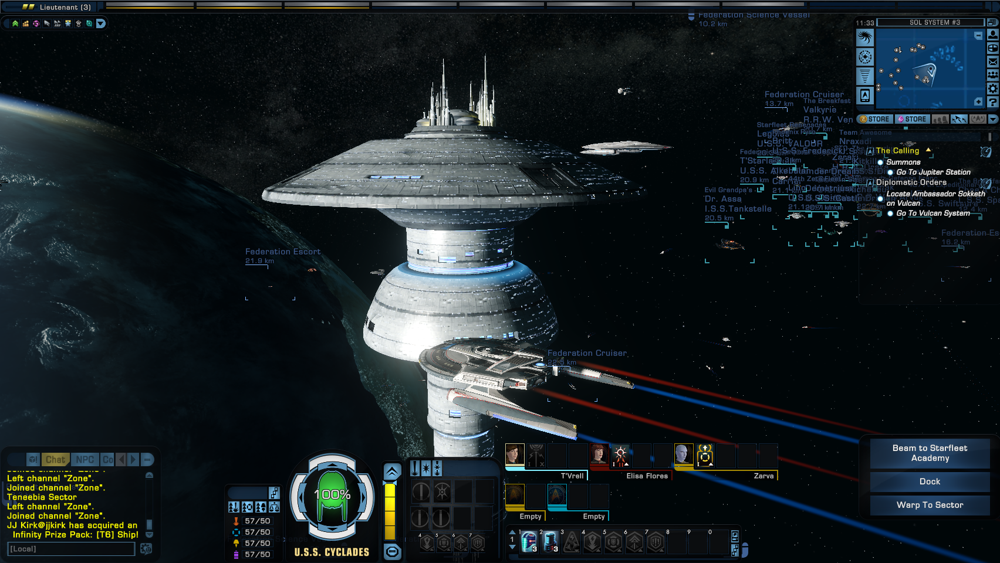
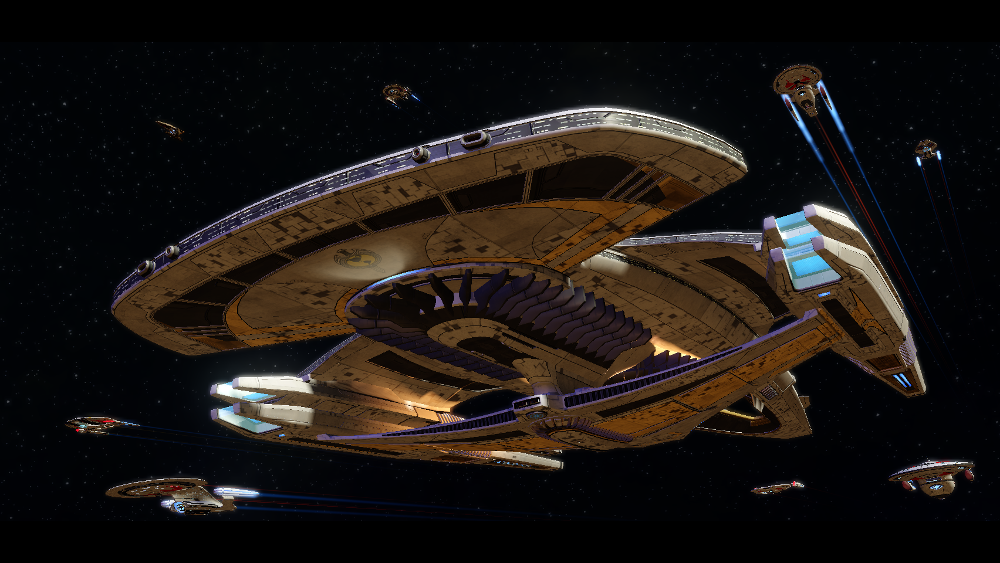
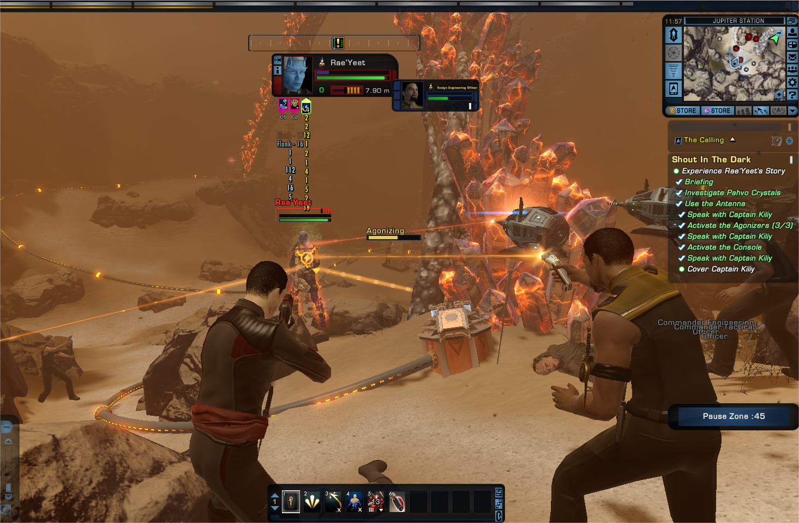
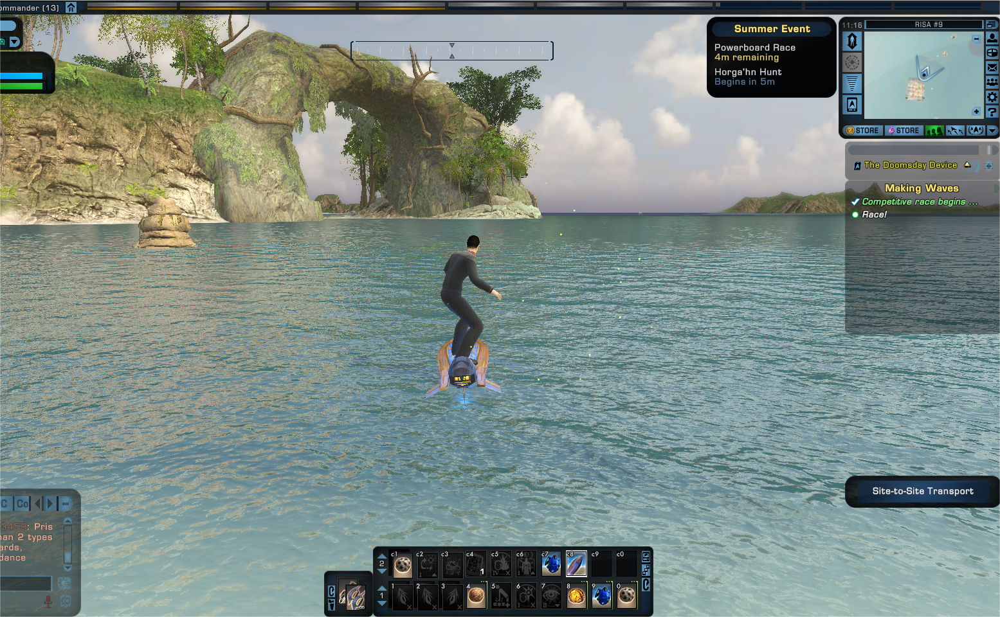
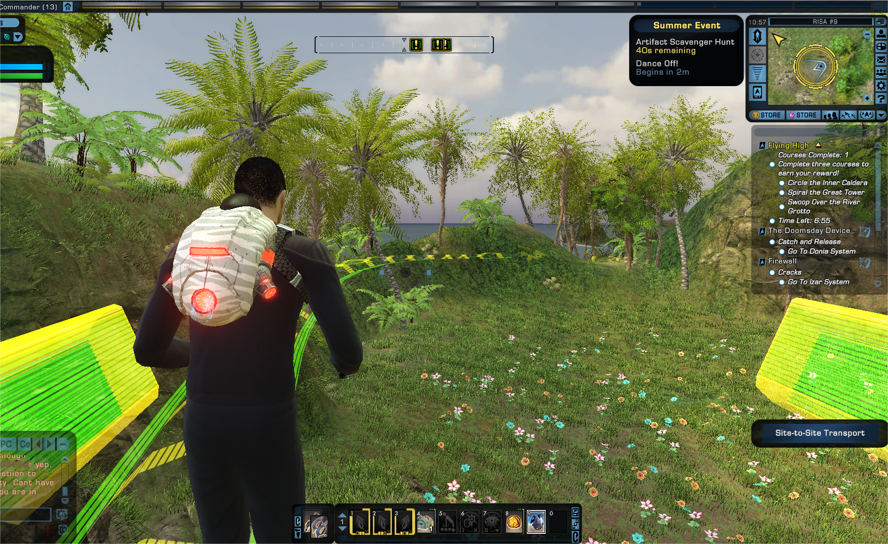

### [热点事件] 给里茶馆的大家推荐一款游戏，《星际迷航OL》

Made by ngapost2md (c) ludoux [GitHub Repo](https://github.com/ludoux/ngapost2md)

----

##### 0.[0] \<pid:0\> 2023-07-26 21:24:02 by GT7896
《星际迷航OL》(Star Trek Online)是一款由Cryptic Studios开发的大规模多人在线角色扮演游戏(MMORPG)。游戏基于美国科幻电视剧《星际迷航》(Star Trek)系列，为玩家带来了深入的星际世界冒险体验。

在《星际迷航OL》中，你将扮演一位名为“星际舰长”的主角。作为一名新晋的星际舰队成员，你将担负起指挥一艘星际飞船的重任。你可以自由地定制你的角色外貌和背景，并根据个人喜好选择不同的技能和能力。作为星际舰长，你将率领你的舰队在星际世界中进行探险和战斗，发现未知星球，解开宇宙的奥秘。

作为主角，你将在游戏中扮演重要的角色。你的选择和决定将影响整个故事的进程，你的舰队成员和其他角色也会根据你的行动做出反应。因此，你需要谨慎选择，权衡利弊，并做出对你和你的舰队最有利的决策。

作为星际舰长，你将体验到一个充满挑战和冒险的旅程。你将面对各种敌对势力、神秘的星球、未知的空间现象等等，而你的智慧和勇气将是探索宇宙中的关键。随着游戏的发展，你的主角将不断成长，获得更强大的技能和装备，最终成为星际世界中的一名传奇舰长。

在《星际迷航OL》中，你将成为这个宏大星际世界中的主角，书写自己的星际传奇。探索未知星系，建立强大的舰队，与其他玩家共同征服宇宙，成为星际航行的领军者！

省流：锁国服，要加速器才能玩 

