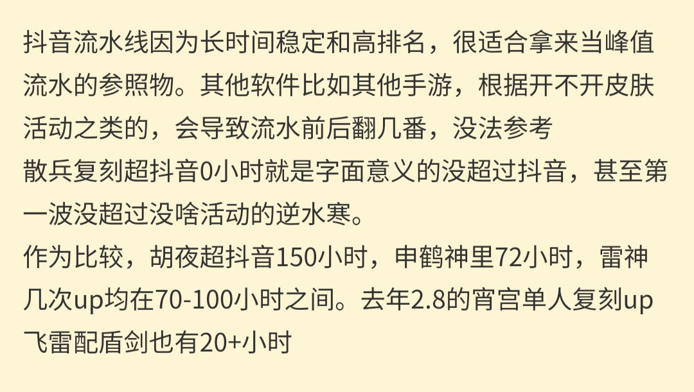
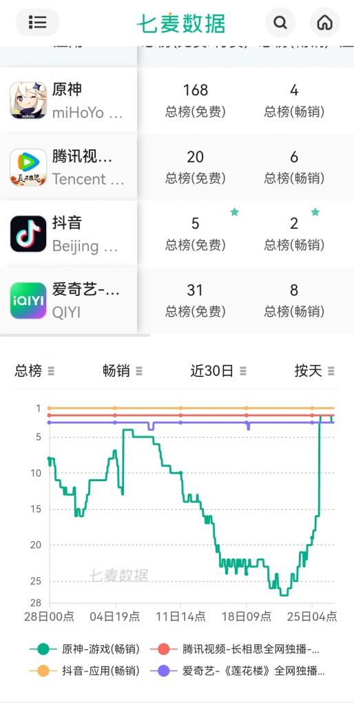

### [热点事件]可以请问一下0h是啥意思吗

Made by ngapost2md (c) ludoux [GitHub Repo](https://github.com/ludoux/ngapost2md)

----

##### 0.[0] \<pid:0\> 2023-07-26 23:46:09 by DoomBlackCat
应该是流水相关，但我找不到那个集中贴了

据说是超抖音0h，是说(流水)超过抖音的持续时长吗？

抖音居然不是免费视频app吗(不太了解，没下载过)
为啥要以抖音为标准？
抖音的流水很稳定，且很高吗？

----

##### 1.[0] \<pid:705119887\> 2023-07-26 23:47:04 by 优点讨厌你菈
全给你说对了
抖音有直播流水

----

##### 2.[0] \<pid:705119959\> 2023-07-26 23:47:33 by yhy119
是的，你猜的没错，而且抖音确实流水高且稳定

----

##### 3.[0] \<pid:705120133\> 2023-07-26 23:48:38 by szqiyimu
抖音有内购啊？
抖音内购一直都是比较稳定的，所以拿来做参照物，那些给钱数据的流水都是假的，但是相对预估在对比上上是有意义的。

----

##### 4.[0] \<pid:705120513\> 2023-07-26 23:51:01 by 87123kaiu
搬一下隔壁潭友的解答

----

##### 5.[0] \<pid:705120620\> 2023-07-26 23:51:47 by 平泽唯1987
>[jump](#pid705120133) szqiyimu(2023-07-26 23:48) 说: 
>
>抖音有内购啊？
>抖音内购一直都是比较稳定的，所以拿来做参照物，那些给钱数据的流水都是假的，但是相对预估在对比上上是有意义的。

据我所知应该不算内购吧，就是单纯打赏的钱

----

##### 6.[0] \<pid:705121022\> 2023-07-26 23:54:37 by jflame
>[jump](#pid705120620) 平泽唯1987(2023-07-26 23:51)说:
>[quote][pid=705120133,37151152,1]Reply[/pid] <b>Post by [uid=65125868]szqiyimu[/uid] (2023-07-26 23:48):</b>  抖音有内购啊？ 抖音内购一直都是比较稳定的，所以拿来做参照物，那些给钱数据的流水都是假的，但是相对预估在对比上上是有意义的。[/quote]据我所知应该不算内购吧，就是单纯打赏的钱

直播打赏就是所谓的&quot;内购&quot;，给苹果税，上排行榜
你说的是&quot;电商&quot;，买东西卖货，无苹果税，不计入排行榜

----

##### 7.[0] \<pid:705121113\> 2023-07-26 23:55:19 by 孤胆飞客
这个在什么平台能自助查啊，

----

##### 8.[0] \<pid:705122012\> 2023-07-27 00:01:40 by szqiyimu
>[jump](#pid705120620) 平泽唯1987(2023-07-26 23:51) 说: 
>
>据我所知应该不算内购吧，就是单纯打赏的钱

打赏的钱算内购的
电商不算

----

##### 9.[0] \<pid:705122468\> 2023-07-27 00:05:08 by La da
>[jump](#pid705120620) 平泽唯1987(2023-07-26 23:51) 说: 
>
>据我所知应该不算内购吧，就是单纯打赏的钱

不是，你说的这些所有的东西在iOS平台上，都叫“内购”

我们一般会说苹果抽成30%就是说苹果会对内购抽30%

换句话说就是能在苹果畅销榜上出现的东西，那统计的一定是内购，因为苹果也是根据内购抽成的多少来给AppStore畅销榜排名的。

诸如直播打赏之类的内容，都是内购的一部分，苹果全都要吃一口。

顺带一提，真正的流水厨建议厨苹果，无论是你王者荣耀逆水寒原神崩铁明日方舟，国内的国外的，只要是打我苹果平台过一道，在我苹果上充的钱都得给我苹果30%
苹果也是唯一一家自己几乎没有游戏业务，但是游戏收入(指抽成)能把任天堂psXbox拉起来秒了的“游戏公司”

----

##### 10.[0] \<pid:705201924\> 2023-07-27 11:57:37 by UID42694396
>[jump](#pid705121113) 孤胆飞客(2023-07-26 23:55)说:
>这个在什么平台能自助查啊，

直接搜ios榜单出来的那几个网站都能看吧

----

##### 11.[0] \<pid:705203412\> 2023-07-27 12:03:52 by Bauhaus的大豪斯
>[jump](#pid705122468) La da(2023-07-27 00:05)说:
>[quote][pid=705120620,37151152,1]Reply[/pid] <b>Post by [uid=64996851]平泽唯1987[/uid] (2023-07-26 23:51):</b>  据我所知应该不算内购吧，就是单纯打赏的钱[/quote]不是，你说的这些所有的东西在iOS平台上，都叫“内购”  我们一般会说苹果抽成30%就是说苹果会对内购抽30%  换句话说就是能在苹果畅销榜上出现的东西，那统计的一定是内购，因为苹果也是根据内购抽成的多少来给AppStore畅销榜排名的。  诸如直播打赏之类的内容，都是内购的一部分，苹果全都要吃一口。  [s:a2:那个…]顺带一提，真正的流水厨建议厨苹果，无论是你王者荣耀逆水寒原神崩铁明日方舟，国内的国外的，只要是打我苹果平台过一道，在我苹果上充的钱都得给我苹果30% 苹果也是唯一一家自己几乎没有游戏业务，但是游戏收入(指抽成)能把任天堂psXbox拉起来秒了的“游戏公司”

厨子才是真的会赚钱

