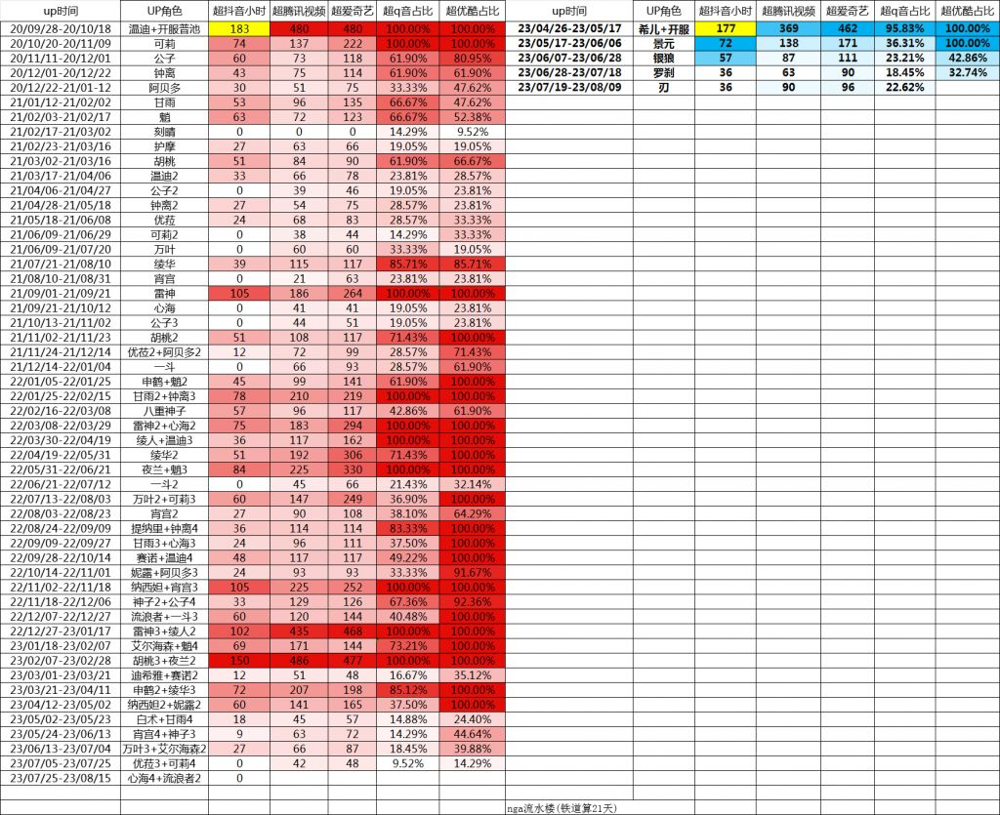

### [热点事件] 有没有算法能把不同时期的痘印流水统一在一起的？

Made by ngapost2md (c) ludoux [GitHub Repo](https://github.com/ludoux/ngapost2md)

----

##### 0.[0] \<pid:0\> 2023-07-27 00:14:02 by kayak2022
稻妻超抖音的难度和须弥超抖音难度肯定不一样吧，抖音毕竟也在做业务扩张。

----

##### 1.[0] \<pid:705124069\> 2023-07-27 00:16:42 by 其实出sp也不错嘛
那要是抖音自己的实力反而下降了呢，就现在这个经济环境()

----

##### 2.[0] \<pid:705131712\> 2023-07-27 01:18:30 by 楚末_二号机
抖音已经不能再扩张了吧，我感觉抖音用户市场已经吃到头了，基本全国人都在用再扩张总不能扩张到外星人
而且稻妻时期疫情大家不敢出去玩都在看直播打赏，现在看直播的也少了，抖音反而变弱了吧

----

##### 3.[0] \<pid:705132403\> 2023-07-27 01:25:07 by 清明上核图
痘印的实力肯定是逐渐增长的，但19年的抖音和23年的抖音究竟差多少这谁也不知道

